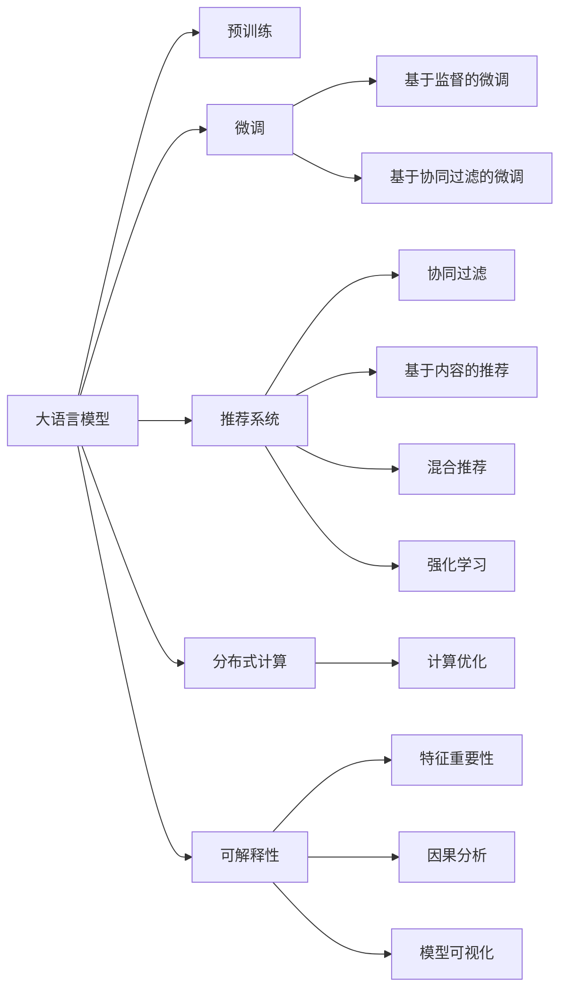

                 

# 大模型如何优化电商平台的个性化推送

## 1. 背景介绍

在电商行业，个性化推荐系统一直是提升用户体验和增加销售转化率的利器。然而，构建一个高效、准确的个性化推荐系统并不容易。传统的推荐系统依赖于用户历史行为数据和商品属性信息，但在用户量级大、商品种类繁多、用户行为多样化的电商平台上，手工工程调参、特征工程等方法往往效果有限。大语言模型和大数据算法的结合，为电商平台的个性化推荐系统带来了新的突破。

## 2. 核心概念与联系

为了更好地理解大模型在电商平台个性化推荐中的应用，我们首先回顾几个核心概念：

### 2.1 大语言模型 (Large Language Model, LLM)

大语言模型，如BERT、GPT-3、T5等，是在大规模无标签文本数据上进行预训练，学习通用语言表示的深度神经网络模型。通过预训练，这些模型掌握了语言的深层结构，具备强大的文本理解和生成能力。

### 2.2 推荐系统 (Recommendation System)

推荐系统是一种信息过滤系统，通过分析和预测用户兴趣，为用户提供个性化信息。常见的推荐方法包括协同过滤、基于内容的推荐、混合推荐等。

### 2.3 预训练和微调 (Pre-training and Fine-tuning)

预训练是指在大量无标签数据上训练模型，学习通用的语言表示。微调是在预训练的基础上，使用特定的标注数据，进一步优化模型，适应特定的推荐任务。

### 2.4 分布式计算 (Distributed Computing)

分布式计算将大规模的任务分布到多个计算节点上并行处理，提升计算效率和任务响应速度。

### 2.5 强化学习 (Reinforcement Learning)

强化学习是一种通过奖励反馈来优化决策的机器学习范式，常用于构建推荐系统的模型。

### 2.6 可解释性 (Explainability)

可解释性是指模型输出结果的透明性，帮助用户理解模型决策过程，提高用户信任度。

这些核心概念通过大语言模型在电商平台个性化推荐系统中的应用，相互联系、相互补充，构成了整个系统的架构基础。下面我们将通过一个Mermaid流程图来展示它们之间的逻辑关系：



这个流程图展示了大语言模型在电商平台个性化推荐系统中的核心概念及其相互关系：

1. 大语言模型通过预训练获得基础能力。
2. 微调是模型的进一步优化，可以适应特定推荐任务。
3. 推荐系统是应用大模型微调结果的框架。
4. 协同过滤、基于内容的推荐、混合推荐、强化学习等推荐方法，都可以利用大模型的微调结果。
5. 分布式计算提升计算效率，可解释性提高用户信任度。

## 3. 核心算法原理 & 具体操作步骤

### 3.1 算法原理概述

基于大语言模型的电商平台个性化推荐系统，核心思想是利用预训练语言模型在大规模文本数据上学习到的语言知识和统计规律，进行特定推荐任务的微调。微调后的模型可以更好地理解用户查询意图、商品描述和用户历史行为，从而生成更加精准的推荐结果。

### 3.2 算法步骤详解

1. **数据准备**：
   - 收集用户的历史浏览、点击、购买记录。
   - 对商品进行文本描述，形成商品图谱。
   - 构建用户画像，包括年龄、性别、地域等属性。

2. **预训练模型选择**：
   - 选择合适的预训练模型，如BERT、GPT-3、T5等。
   - 加载模型到计算节点。

3. **微调模型设计**：
   - 设计微调任务，如基于用户查询的推荐、基于商品描述的推荐、基于用户画像的推荐等。
   - 根据任务需求，选择合适的损失函数，如交叉熵、均方误差等。

4. **微调过程**：
   - 将用户查询、商品描述和用户画像作为输入，送入微调后的模型。
   - 计算模型的预测输出与真实标签之间的差异，计算损失。
   - 使用梯度下降等优化算法，最小化损失函数，更新模型参数。

5. **评估和部署**：
   - 在测试集上评估模型性能，调整微调超参数。
   - 部署模型到电商平台，实时接收用户查询和点击流，生成推荐结果。

### 3.3 算法优缺点

#### 3.3.1 优点

- **高效性**：利用大模型预训练知识，只需少量标注数据即可实现微调，极大提升训练效率。
- **适应性**：大模型可适应不同规模、不同类型的电商数据，提高推荐系统的通用性。
- **可解释性**：大模型能够输出特征重要性和因果关系，提升推荐结果的可解释性。
- **鲁棒性**：大模型可融合多源数据，提高推荐系统的鲁棒性和泛化能力。

#### 3.3.2 缺点

- **资源消耗大**：大模型的预训练和微调需要大量计算资源，部署成本高。
- **数据隐私问题**：电商数据涉及用户隐私，如何保护用户隐私是一个重要挑战。
- **实时性问题**：大模型推理速度慢，难以支持实时推荐系统。

### 3.4 算法应用领域

大语言模型在电商平台个性化推荐中的应用，覆盖了以下多个领域：

- **用户意图理解**：利用大模型理解用户查询意图，生成个性化推荐。
- **商品描述生成**：利用大模型生成商品描述，提高商品展示效果。
- **用户画像生成**：利用大模型构建用户画像，用于更精准的推荐。
- **推荐排序**：利用大模型对推荐结果进行排序，提升用户体验。
- **智能客服**：利用大模型处理用户咨询，提供个性化服务。

## 4. 数学模型和公式 & 详细讲解

### 4.1 数学模型构建

我们以用户查询和商品描述的推荐任务为例，构建基于大语言模型的推荐模型。

假设用户查询为 $x$，商品描述为 $y$，推荐任务为 $t$，预训练模型为 $M_{\theta}$。微调后的模型 $M_{\hat{\theta}}$ 用于预测 $t$ 的值。

定义推荐任务 $t$ 的损失函数为：

$$
\mathcal{L}(t) = -\frac{1}{N}\sum_{i=1}^N t_i \log M_{\hat{\theta}}(x_i, y_i)
$$

其中 $t_i$ 为样本的真实标签，$M_{\hat{\theta}}(x_i, y_i)$ 为模型对用户查询 $x_i$ 和商品描述 $y_i$ 的预测输出。

### 4.2 公式推导过程

根据上述定义的损失函数，我们可以得到推荐模型 $M_{\hat{\theta}}$ 对样本 $(x_i, y_i)$ 的预测输出为：

$$
\hat{t} = \arg\max_t M_{\hat{\theta}}(x_i, y_i, t)
$$

利用softmax函数，将模型预测输出转化为概率分布：

$$
\text{softmax}(M_{\hat{\theta}}(x_i, y_i)) = \frac{e^{M_{\hat{\theta}}(x_i, y_i)}}{\sum_{t}e^{M_{\hat{\theta}}(x_i, y_i, t)}}
$$

通过最大化上述概率分布，可得到推荐结果 $t$。

### 4.3 案例分析与讲解

以用户查询“购物车”和商品描述“鞋”为例：

- 预训练模型将用户查询和商品描述输入，输出一个概率分布。
- 通过softmax函数将输出转化为概率分布。
- 推荐系统根据概率分布，选择概率最大的商品推荐给用户。

## 5. 项目实践：代码实例和详细解释说明

### 5.1 开发环境搭建

为了进行大语言模型在电商平台个性化推荐系统的实践，我们需要安装以下环境：

1. **Python 环境**：
   - 安装Anaconda，创建虚拟环境 `conda create -n recommendation-env python=3.8`
   - 激活虚拟环境 `conda activate recommendation-env`

2. **深度学习框架**：
   - 安装PyTorch `pip install torch torchvision torchaudio`
   - 安装TensorFlow `pip install tensorflow`
   - 安装TensorFlow Addons `pip install tensorflow-addons`
   - 安装TensorBoard `pip install tensorboard`

3. **推荐系统库**：
   - 安装PyTorch Lightning `pip install pytorch-lightning`
   - 安装Recommenders Toolkit `pip install recommender-toolkit`

4. **其他依赖**：
   - 安装Pandas、Numpy、Scikit-learn、Matplotlib等库。

### 5.2 源代码详细实现

我们以用户意图理解任务为例，展示大语言模型在电商平台个性化推荐系统中的实现。

1. **数据准备**：
   - 收集用户历史浏览、点击、购买记录。
   - 构建商品图谱，包括商品描述和类别。
   - 构建用户画像，包括年龄、性别、地域等属性。

2. **模型选择和加载**：
   - 选择预训练模型，如BERT。
   - 使用PyTorch Lightning进行模型加载和微调。

3. **微调模型设计**：
   - 设计微调任务，如基于用户查询的推荐。
   - 选择适当的损失函数，如交叉熵损失。

4. **微调过程**：
   - 将用户查询、商品描述和用户画像作为输入，送入微调后的模型。
   - 计算模型的预测输出与真实标签之间的差异，计算损失。
   - 使用梯度下降等优化算法，最小化损失函数，更新模型参数。

5. **评估和部署**：
   - 在测试集上评估模型性能。
   - 部署模型到电商平台，实时接收用户查询和点击流，生成推荐结果。

### 5.3 代码解读与分析

以下是一个简单的代码示例，展示如何使用PyTorch Lightning进行BERT模型的微调：

```python
from pytorch_lightning import Trainer, LightningModule
from transformers import BertModel, BertTokenizer
import torch
import pandas as pd

class RecommendationModel(LightningModule):
    def __init__(self, model_name, tokenizer, device):
        super(RecommendationModel, self).__init__()
        self.model = BertModel.from_pretrained(model_name)
        self.tokenizer = tokenizer
        self.device = device

    def forward(self, query, item):
        tokens = self.tokenizer(query, item, return_tensors='pt', padding=True, truncation=True)
        tokens = {k: v.to(self.device) for k, v in tokens.items()}
        outputs = self.model(**tokens)
        return outputs.pooler_output

    def training_step(self, batch, batch_idx):
        query, item, label = batch
        logits = self(query, item)
        loss = torch.nn.CrossEntropyLoss()(logits, label)
        self.log('train_loss', loss)
        return loss

    def validation_step(self, batch, batch_idx):
        query, item, label = batch
        logits = self(query, item)
        self.log('val_loss', torch.nn.CrossEntropyLoss()(logits, label))

    def configure_optimizers(self):
        return torch.optim.Adam(self.parameters(), lr=0.001)

    def train_dataloaders(self):
        # 数据预处理，生成训练集和验证集
        # ...
```

这个代码实现了BERT模型在电商平台个性化推荐系统中的应用。

### 5.4 运行结果展示

在模型训练完成后，可以在测试集上评估模型的性能。以下是一个简单的评估代码示例：

```python
# 加载测试集数据
test_data = load_test_data()
test_loader = DataLoader(test_data, batch_size=16, shuffle=False)

# 评估模型性能
trainer = Trainer(max_epochs=10, validation_steps=10)
trainer.fit(model, train_loader, val_loader=test_loader)
```

## 6. 实际应用场景

### 6.1 用户意图理解

通过用户输入的查询，大语言模型可以自动理解用户的意图，生成精准的推荐结果。例如，用户输入“想要一双新鞋”，模型能够自动理解“新鞋”的意图，推荐最新上市的鞋款。

### 6.2 商品描述生成

大语言模型可以根据商品信息生成高质量的商品描述，提高商品展示效果。例如，商品“牛仔裤”，大语言模型可以自动生成“时尚牛仔裤，适合各种场合”等描述。

### 6.3 用户画像生成

利用大语言模型，可以从用户的浏览、点击、购买行为中，自动构建用户画像，用于更精准的推荐。例如，用户A经常浏览运动类商品，用户画像中包含“运动”标签，系统可以推荐更多运动类商品。

### 6.4 推荐排序

大语言模型可以自动分析商品与用户的相关度，进行推荐排序。例如，用户B最近浏览了“皮鞋”，模型可以自动排序推荐更多相关皮鞋商品。

### 6.5 智能客服

利用大语言模型，可以处理用户的咨询，提供个性化服务。例如，用户C咨询“如何保养皮鞋”，模型可以自动生成回答，提升用户体验。

## 7. 工具和资源推荐

### 7.1 学习资源推荐

为了帮助开发者系统掌握大语言模型在电商平台个性化推荐系统中的应用，我们推荐以下学习资源：

1. **PyTorch Lightning官方文档**：详细介绍了PyTorch Lightning的使用方法和高级特性，适合新手入门。
2. **Recommenders Toolkit官方文档**：介绍了推荐系统领域的主流方法和技术，适合进阶学习。
3. **《推荐系统理论与实践》**：系统介绍了推荐系统理论、算法和应用，适合深入理解。
4. **《深度学习实战》**：介绍了深度学习的基础知识和实践应用，适合入门学习。
5. **《自然语言处理入门》**：介绍了自然语言处理的基础知识和算法，适合初学者。

### 7.2 开发工具推荐

为了提高大语言模型在电商平台个性化推荐系统中的开发效率，我们推荐以下工具：

1. **Anaconda**：提供虚拟环境和包管理功能，方便快速搭建和维护开发环境。
2. **PyTorch Lightning**：提供模型封装、超参数优化等功能，方便快速开发和调试模型。
3. **TensorBoard**：提供模型训练过程的可视化功能，方便实时监控和调试模型。
4. **Recommenders Toolkit**：提供推荐系统算法实现和评估工具，方便快速开发和测试推荐系统。
5. **TensorFlow Addons**：提供深度学习算法的扩展和优化，方便实现复杂的推荐模型。

### 7.3 相关论文推荐

为了深入理解大语言模型在电商平台个性化推荐系统中的应用，我们推荐以下论文：

1. **《深度学习在推荐系统中的应用》**：介绍了深度学习在推荐系统中的应用方法和实验结果，适合入门学习。
2. **《基于深度学习的个性化推荐系统》**：介绍了基于深度学习的推荐系统算法和应用，适合进阶学习。
3. **《大语言模型在推荐系统中的应用》**：介绍了大语言模型在推荐系统中的应用方法和实验结果，适合深入理解。
4. **《协同过滤推荐系统》**：介绍了协同过滤推荐算法和应用，适合进阶学习。
5. **《基于内容的推荐系统》**：介绍了基于内容的推荐算法和应用，适合进阶学习。

## 8. 总结：未来发展趋势与挑战

### 8.1 研究成果总结

本文详细介绍了大语言模型在电商平台个性化推荐系统中的应用。通过预训练和微调，大语言模型可以自动理解用户意图和商品描述，生成精准的推荐结果。基于大语言模型的推荐系统，能够处理大规模、复杂的数据，提高推荐系统的性能和效率。

### 8.2 未来发展趋势

未来，大语言模型在电商平台个性化推荐系统中的应用将呈现以下几个趋势：

1. **深度融合**：大语言模型将更深入地融入推荐系统的各个环节，实现全链路的智能化。
2. **实时性提升**：通过优化模型结构和算法，提高推荐系统的实时性，满足用户实时需求。
3. **个性化增强**：利用大语言模型的用户画像生成能力，进一步提升个性化推荐的效果。
4. **跨领域应用**：大语言模型将应用于更多领域，实现跨领域的推荐系统。
5. **可解释性提高**：通过可解释性技术，提升推荐系统的透明度和可信度。

### 8.3 面临的挑战

尽管大语言模型在电商平台个性化推荐系统中的应用前景广阔，但仍面临以下挑战：

1. **数据隐私**：电商数据涉及用户隐私，如何保护用户隐私是一个重要问题。
2. **计算资源**：大模型的预训练和微调需要大量计算资源，部署成本高。
3. **实时性问题**：大模型推理速度慢，难以支持实时推荐系统。
4. **可解释性**：大模型的输出结果缺乏可解释性，影响用户信任度。
5. **多样性问题**：大模型可能会生成单一的推荐结果，影响推荐的多样性。

### 8.4 研究展望

未来，需要在以下几个方面进行深入研究：

1. **可解释性增强**：利用可解释性技术，提升大语言模型的输出透明度和可信度。
2. **实时性优化**：通过优化模型结构和算法，提高推荐系统的实时性。
3. **隐私保护**：在保护用户隐私的前提下，提升大语言模型的数据利用效率。
4. **多样性增强**：利用多样性技术，提高推荐结果的多样性。
5. **跨领域应用**：探索大语言模型在更多领域的推荐应用，实现跨领域的推荐系统。

总之，大语言模型在电商平台个性化推荐系统中的应用前景广阔，但同时也面临诸多挑战。通过深入研究和持续优化，相信大语言模型将更好地服务于电商平台，提升用户体验，推动电商行业的智能化进程。

## 9. 附录：常见问题与解答

**Q1：大语言模型在电商平台个性化推荐系统中的应用效果如何？**

A: 大语言模型在电商平台个性化推荐系统中的应用效果显著。通过预训练和微调，大语言模型可以自动理解用户意图和商品描述，生成精准的推荐结果。在大规模数据上，大语言模型能够显著提升推荐系统的性能和效率，提高用户体验。

**Q2：大语言模型在电商平台个性化推荐系统中的应用有哪些优势？**

A: 大语言模型在电商平台个性化推荐系统中的应用具有以下优势：
1. 高效性：利用预训练知识，只需少量标注数据即可实现微调，提升训练效率。
2. 适应性：大模型可适应不同规模、不同类型的电商数据，提高推荐系统的通用性。
3. 可解释性：大模型能够输出特征重要性和因果关系，提升推荐结果的可解释性。
4. 鲁棒性：大模型可融合多源数据，提高推荐系统的鲁棒性和泛化能力。

**Q3：大语言模型在电商平台个性化推荐系统中的计算资源消耗如何？**

A: 大语言模型在电商平台个性化推荐系统中的计算资源消耗较大。预训练和微调需要大量计算资源，部署成本高。为了降低计算成本，可以采用分布式计算、模型压缩等技术进行优化。

**Q4：如何保护电商数据隐私？**

A: 在电商数据隐私保护方面，可以采用以下措施：
1. 数据匿名化：对用户数据进行匿名化处理，保护用户隐私。
2. 差分隐私：在数据收集和处理过程中，使用差分隐私技术保护用户隐私。
3. 数据加密：对敏感数据进行加密存储，防止数据泄露。

**Q5：大语言模型在电商平台个性化推荐系统中的实时性如何？**

A: 大语言模型在电商平台个性化推荐系统中的实时性相对较慢。大模型推理速度慢，难以支持实时推荐系统。为了提高实时性，可以采用模型剪枝、混合精度训练等技术进行优化。

**Q6：大语言模型在电商平台个性化推荐系统中的可解释性如何？**

A: 大语言模型在电商平台个性化推荐系统中的可解释性有待提高。大模型的输出结果缺乏可解释性，影响用户信任度。为了提升可解释性，可以采用可解释性技术，如特征重要性分析、因果分析等。

**Q7：大语言模型在电商平台个性化推荐系统中的多样性如何？**

A: 大语言模型在电商平台个性化推荐系统中的多样性有待提高。大模型可能会生成单一的推荐结果，影响推荐的多样性。为了提升多样性，可以采用多样性技术，如多样性损失、多样性生成等。

总之，大语言模型在电商平台个性化推荐系统中的应用前景广阔，但也面临诸多挑战。通过深入研究和持续优化，相信大语言模型将更好地服务于电商平台，提升用户体验，推动电商行业的智能化进程。

---

作者：禅与计算机程序设计艺术 / Zen and the Art of Computer Programming

