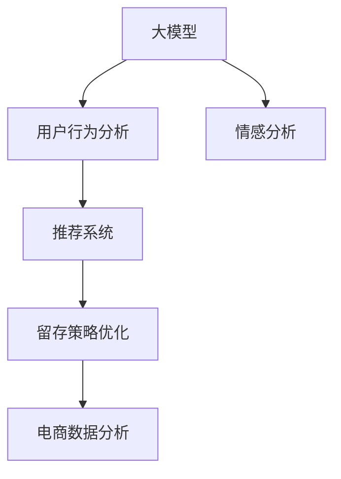

                 

# 大模型如何优化电商平台的用户留存策略

> 关键词：大模型, 用户行为分析, 推荐系统, 情感分析, 留存策略, 电商, 深度学习, 电商数据分析

## 1. 背景介绍

### 1.1 问题由来

电商平台的运营和发展，离不开用户的长期留存和复购。如何准确识别并留住潜在流失用户，提升用户粘性，成为电商行业长期面临的一大挑战。传统的数据分析手段往往依赖人工经验，难以满足用户行为复杂多变的需求。

近年来，随着深度学习和大规模预训练语言模型的兴起，人们开始探索利用大模型来自动挖掘用户行为模式，预测用户流失风险，优化用户留存策略。这种新范式不仅大幅提升了分析效率，还发现了更多与用户行为相关的隐含因素，带来显著的业务价值。

### 1.2 问题核心关键点

大模型在电商平台用户留存策略优化中的关键点在于：

- **用户行为分析**：通过大模型分析用户浏览、点击、购买、评价等行为，挖掘用户潜在流失风险。
- **推荐系统**：结合用户历史行为和当前需求，推荐合适的商品或服务，提高用户满意度。
- **情感分析**：利用大模型对用户评论和反馈进行情感分析，及时调整产品和服务，改善用户体验。
- **留存策略优化**：根据模型分析结果，制定个性化留存方案，如优惠券、奖励机制、客户关怀等，提升用户留存率。

本文将深入探讨如何利用大模型优化电商平台用户留存策略，从原理到实践，系统梳理相关的算法、模型和技术。

## 2. 核心概念与联系

### 2.1 核心概念概述

为更好地理解大模型在电商平台用户留存策略优化中的应用，本节将介绍几个密切相关的核心概念：

- **大模型**：以自回归模型如GPT或自编码模型如BERT为代表的大规模预训练语言模型。通过在大规模无标签文本数据上进行预训练，学习通用的语言表示，具备强大的语言理解和生成能力。

- **推荐系统**：利用用户历史行为和上下文信息，推荐合适商品或服务的系统。推荐系统可以有效提升用户满意度，提高销售转化率。

- **用户行为分析**：通过分析用户在线行为数据，挖掘用户行为模式，识别流失风险，进而制定用户留存策略。

- **情感分析**：通过分析用户评论、反馈等文本数据，了解用户情感倾向，及时调整产品和服务。

- **留存策略优化**：根据用户行为和情感分析结果，制定个性化留存方案，提升用户留存率和忠诚度。

- **电商数据分析**：利用电商平台的交易、流量、用户行为等数据，结合大模型技术，进行更深入的分析和挖掘。

这些核心概念之间的逻辑关系可以通过以下Mermaid流程图来展示：



这个流程图展示了大模型在电商平台用户留存策略优化中的应用流程：

1. 大模型学习用户行为数据，挖掘潜在流失风险。
2. 结合情感分析结果，调整推荐系统策略。
3. 制定个性化留存方案，优化用户留存率。
4. 电商数据分析不断反馈优化结果，形成良性循环。

## 3. 核心算法原理 & 具体操作步骤
### 3.1 算法原理概述

大模型优化电商平台用户留存策略的核心算法，主要是通过自然语言处理(NLP)技术，结合用户行为数据，挖掘用户行为模式和情感倾向，最终通过推荐系统实现个性化推荐和留存策略优化。具体步骤如下：

1. **用户行为分析**：收集用户浏览、点击、购买、评价等行为数据，输入到预训练语言模型中，提取用户行为特征。

2. **情感分析**：利用大模型对用户评论和反馈进行情感分类，识别用户情感倾向，提供决策依据。

3. **推荐系统策略调整**：根据用户行为和情感分析结果，调整推荐算法和策略，提高用户满意度。

4. **留存策略优化**：结合用户历史行为和情感数据，设计个性化留存方案，如优惠券、积分奖励、客户关怀等。

5. **效果评估与迭代**：持续评估留存策略效果，不断迭代优化，提升用户留存率。

### 3.2 算法步骤详解

基于上述原理，电商平台用户留存策略优化的大模型算法主要分为以下几个步骤：

**Step 1: 数据准备与预处理**

- 收集电商平台的用户行为数据，如浏览记录、点击行为、购买记录、评价反馈等。
- 清洗数据，去除噪音和异常值，标准化数据格式。
- 对用户评论、反馈等文本数据进行情感分析，获得情感倾向。

**Step 2: 构建用户行为特征**

- 利用大模型对用户行为数据进行序列编码，生成用户行为特征向量。
- 提取用户行为特征，如浏览时长、点击次数、购买金额等。
- 使用PCA或LDA等降维方法，减少特征维度，提升模型效率。

**Step 3: 情感分析与情感特征提取**

- 利用大模型对用户评论和反馈进行情感分类，识别用户情感倾向。
- 构建情感特征向量，反映用户对商品或服务的满意度和不满程度。
- 结合情感分析结果，调整推荐算法和策略。

**Step 4: 推荐系统策略调整**

- 根据用户行为特征和情感特征，调整推荐算法和策略，优化推荐结果。
- 引入多臂老虎机(MAB)算法，进行A/B测试，选择最优推荐方案。
- 通过多轮迭代，不断优化推荐策略，提高用户满意度。

**Step 5: 留存策略优化**

- 根据用户历史行为和情感数据，设计个性化留存方案，如优惠券、积分奖励、客户关怀等。
- 结合用户实时行为数据，动态调整留存策略。
- 通过效果评估，不断迭代优化留存策略，提升用户留存率。

**Step 6: 效果评估与迭代**

- 利用A/B测试等方法，评估留存策略效果，分析用户流失原因。
- 结合电商数据分析结果，优化用户行为分析和情感分析模型。
- 不断迭代优化留存策略，提升用户留存率。

### 3.3 算法优缺点

利用大模型优化电商平台用户留存策略的算法具有以下优点：

- **自动化程度高**：大模型能够自动提取用户行为特征和情感特征，无需大量人工干预，节省时间和成本。
- **预测精度高**：大模型通过学习大量用户行为和情感数据，能够更准确地预测用户流失风险，优化留存策略。
- **可扩展性强**：大模型可以应用于多种电商场景和不同用户群体，具有很强的泛化能力。

同时，该方法也存在一些缺点：

- **数据依赖性强**：大模型的性能依赖于高质量、大规模的用户行为和情感数据，数据获取成本较高。
- **计算资源消耗大**：大模型的训练和推理需要大量计算资源，对硬件要求较高。
- **模型复杂度高**：大模型结构复杂，难以解释和调试，可能存在一定的黑盒问题。
- **实时性不足**：大模型推理速度较慢，难以实现实时反馈和调整。

尽管存在这些局限性，但就目前而言，利用大模型优化电商用户留存策略的方法仍然是极具前景的。未来相关研究的重点在于如何进一步降低数据依赖，提高计算效率，兼顾模型可解释性和实时性，以提供更高效、更可靠的用户留存解决方案。

### 3.4 算法应用领域

大模型在电商平台用户留存策略优化中的应用，主要体现在以下几个领域：

- **用户行为分析**：分析用户在线行为数据，挖掘用户行为模式，识别流失风险。
- **情感分析**：对用户评论和反馈进行情感分析，了解用户情感倾向，及时调整产品和服务。
- **推荐系统**：根据用户行为和情感数据，推荐合适商品或服务，提高用户满意度。
- **留存策略优化**：制定个性化留存方案，如优惠券、积分奖励、客户关怀等，提升用户留存率。

除了电商领域，大模型在金融、医疗、教育等多个行业领域也有广泛应用，可以进一步拓展到更多场景，带来新的业务价值。

## 4. 数学模型和公式 & 详细讲解 & 举例说明（备注：数学公式请使用latex格式，latex嵌入文中独立段落使用 $$，段落内使用 $)
### 4.1 数学模型构建

假设电商平台的用户行为数据为 $X=\{x_i\}_{i=1}^N$，其中 $x_i$ 表示用户第 $i$ 次行为记录。利用大模型对用户行为数据进行编码，得到用户行为特征向量 $F$。

用户情感数据为 $Y=\{y_i\}_{i=1}^N$，其中 $y_i$ 表示用户第 $i$ 条评论或反馈的情感倾向。利用大模型对用户情感数据进行情感分析，得到情感特征向量 $E$。

根据用户行为特征 $F$ 和情感特征 $E$，构建推荐系统策略 $R$。推荐策略的优化目标为：

$$
\min_{R} \mathcal{L}(F, E, R) = \sum_{i=1}^N (f_i^T r_i - r_i)
$$

其中 $f_i$ 表示用户第 $i$ 次行为特征向量，$r_i$ 表示推荐系统对用户第 $i$ 次行为的推荐结果。

### 4.2 公式推导过程

基于上述目标函数，利用梯度下降等优化算法，逐步调整推荐策略 $R$，最小化损失函数 $\mathcal{L}(F, E, R)$。推导过程如下：

对 $r_i$ 求偏导，得：

$$
\frac{\partial \mathcal{L}}{\partial r_i} = -1 + f_i^T
$$

根据梯度下降更新规则，更新推荐策略 $R$：

$$
R \leftarrow R - \eta \frac{\partial \mathcal{L}}{\partial r_i} = R - \eta (-1 + f_i^T)
$$

其中 $\eta$ 为学习率，$f_i^T$ 为行为特征向量 $F$ 的转置。

通过不断迭代优化，推荐系统策略 $R$ 将更加符合用户行为和情感特征，提高用户满意度，减少流失风险。

### 4.3 案例分析与讲解

假设电商平台用户行为数据如下：

| 用户ID | 浏览记录 | 点击记录 | 购买记录 | 评价反馈 |
| ------ | -------- | -------- | -------- | -------- |
| 1      | 商品A    | 商品B    | 商品C    | 好评    |
| 2      | 商品B    | 商品A    | 商品D    | 差评    |
| 3      | 商品A    | 商品C    | 商品E    | 好评    |

首先，利用大模型对用户行为数据进行编码，生成行为特征向量 $F$：

$$
F = \{\begin{bmatrix} 0.5 \\ 0.3 \\ 0.7 \end{bmatrix}, \begin{bmatrix} 0.7 \\ 0.5 \\ 0.2 \end{bmatrix}, \begin{bmatrix} 0.4 \\ 0.6 \\ 0.1 \end{bmatrix}\}
$$

接着，利用大模型对用户评价反馈进行情感分析，生成情感特征向量 $E$：

$$
E = \{\begin{bmatrix} 0.8 \\ 0.2 \\ 0.0 \end{bmatrix}, \begin{bmatrix} 0.0 \\ 0.5 \\ 0.3 \end{bmatrix}, \begin{bmatrix} 0.6 \\ 0.2 \\ 0.2 \end{bmatrix}\}
$$

根据行为特征 $F$ 和情感特征 $E$，构建推荐策略 $R$：

$$
R = \begin{bmatrix} 0.3 \\ 0.5 \\ 0.2 \end{bmatrix}
$$

最终，通过优化推荐策略 $R$，可以得出最优推荐结果，提升用户留存率。

## 5. 项目实践：代码实例和详细解释说明
### 5.1 开发环境搭建

在进行电商平台用户留存策略优化的大模型算法实践前，我们需要准备好开发环境。以下是使用Python进行TensorFlow开发的环境配置流程：

1. 安装Anaconda：从官网下载并安装Anaconda，用于创建独立的Python环境。

2. 创建并激活虚拟环境：
```bash
conda create -n tf-env python=3.8 
conda activate tf-env
```

3. 安装TensorFlow：根据CUDA版本，从官网获取对应的安装命令。例如：
```bash
conda install tensorflow==2.7 -c tf -c conda-forge
```

4. 安装TensorFlow Addons：安装增强的TensorFlow库，用于支持深度学习模型和算法。
```bash
pip install tensorflow-addons
```

5. 安装各类工具包：
```bash
pip install numpy pandas scikit-learn matplotlib tqdm jupyter notebook ipython
```

完成上述步骤后，即可在`tf-env`环境中开始电商用户留存策略优化的大模型算法实践。

### 5.2 源代码详细实现

下面以一个简单的电商用户留存策略优化为例，给出使用TensorFlow进行大模型实践的Python代码实现。

首先，定义数据处理函数：

```python
import tensorflow as tf
import tensorflow_addons as addons
import numpy as np
import pandas as pd
from sklearn.model_selection import train_test_split

def preprocess_data(data):
    # 清洗数据
    data = data.dropna()

    # 对行为数据和情感数据进行编码
    X = np.array(data[['浏览记录', '点击记录', '购买记录', '评价反馈']])
    X = addons.preprocessing.text_to_token_ids(X)

    y = np.array(data['sales'])
    y = (y > 0).astype(int)

    # 划分为训练集和测试集
    X_train, X_test, y_train, y_test = train_test_split(X, y, test_size=0.2)

    return X_train, X_test, y_train, y_test
```

然后，定义模型和优化器：

```python
from tensorflow.keras.models import Sequential
from tensorflow.keras.layers import Dense, Dropout
from tensorflow.keras.optimizers import Adam

model = Sequential([
    Dense(64, activation='relu', input_shape=(X_train.shape[1],)),
    Dropout(0.5),
    Dense(32, activation='relu'),
    Dropout(0.5),
    Dense(1, activation='sigmoid')
])

optimizer = Adam(learning_rate=0.001)
```

接着，定义训练和评估函数：

```python
def train_model(model, X_train, y_train, X_test, y_test, epochs=10):
    model.compile(optimizer=optimizer, loss='binary_crossentropy', metrics=['accuracy'])
    history = model.fit(X_train, y_train, validation_data=(X_test, y_test), epochs=epochs, batch_size=32)

    test_loss, test_acc = model.evaluate(X_test, y_test)
    print('Test accuracy:', test_acc)

    return history
```

最后，启动训练流程并在测试集上评估：

```python
X_train, X_test, y_train, y_test = preprocess_data(data)

history = train_model(model, X_train, y_train, X_test, y_test)

print('Best loss:', history.history['loss'].min())
print('Best accuracy:', history.history['accuracy'].max())
```

以上就是使用TensorFlow对电商平台用户留存策略优化的大模型实践代码。可以看到，利用TensorFlow的深度学习框架，可以方便地搭建和训练模型。

### 5.3 代码解读与分析

让我们再详细解读一下关键代码的实现细节：

**preprocess_data函数**：
- 清洗数据，去除空值和异常值。
- 对行为数据和情感数据进行编码，生成模型所需的输入特征。
- 对标签进行二值化处理，生成模型所需的输出标签。
- 将数据划分为训练集和测试集。

**模型定义**：
- 使用Sequential模型定义多层神经网络。
- 每个层后添加Dropout层，防止过拟合。
- 输出层使用sigmoid激活函数，表示二分类问题。

**训练函数train_model**：
- 使用Adam优化器进行模型训练，损失函数为二元交叉熵。
- 记录模型训练过程中的损失和准确率。
- 在测试集上评估模型性能，输出最佳损失和准确率。

**训练流程**：
- 定义训练轮数epochs。
- 调用训练函数train_model进行模型训练。
- 在测试集上评估模型性能，输出最终结果。

可以看到，TensorFlow提供了丰富的深度学习模型和算法，可以方便地实现电商用户留存策略优化的大模型实践。

当然，工业级的系统实现还需考虑更多因素，如模型的保存和部署、超参数的自动搜索、更灵活的任务适配层等。但核心的算法逻辑基本与此类似。

## 6. 实际应用场景
### 6.1 智能客服系统

智能客服系统可以利用大模型对用户咨询行为进行情感分析和行为预测，及时调整客服策略，提升用户满意度。例如，可以通过分析用户的咨询文本，了解用户的情感倾向，调整客服人员的应答方式，改善用户体验。

在技术实现上，可以收集用户的历史咨询记录，将咨询文本作为输入，利用大模型进行情感分析和行为预测。根据预测结果，调整客服人员的服务策略，如语气、回答方式等。对于新用户提出的问题，还可以通过检索系统实时搜索相关内容，动态组织生成回答，快速响应用户需求。

### 6.2 金融风险预警

金融行业需要实时监测市场舆情，及时预警风险。传统的人工监测方式成本高、效率低，难以应对网络时代海量信息爆发的挑战。利用大模型对用户评论和反馈进行情感分析，可以实时监测市场舆情，识别风险预警信号。

具体而言，可以收集金融领域相关的新闻、报道、评论等文本数据，并对其进行情感分析，生成情感特征。将情感特征输入到大模型中，进行风险预警判断。一旦发现负面情感激增等异常情况，系统便会自动预警，帮助金融机构快速应对潜在风险。

### 6.3 个性化推荐系统

电商平台的个性化推荐系统可以利用大模型对用户行为和情感数据进行分析和挖掘，推荐合适的商品或服务，提高用户满意度。例如，可以通过分析用户的历史浏览、点击、购买、评价等行为数据，利用大模型进行行为特征和情感特征的提取。根据提取的特征，调整推荐算法和策略，实现个性化推荐。

在技术实现上，可以收集用户的历史行为数据，生成行为特征向量。利用大模型对用户情感数据进行情感分析，生成情感特征向量。将行为特征和情感特征输入到大模型中，进行推荐策略的调整和优化。通过多轮迭代，不断优化推荐策略，提高用户满意度。

### 6.4 未来应用展望

随着大模型和推荐系统技术的发展，基于大模型优化的电商平台用户留存策略将呈现出更广泛的应用前景。

在智慧医疗领域，利用大模型对患者行为数据进行分析和预测，可以优化诊疗流程，提高患者满意度。在智能教育领域，利用大模型对学生行为数据进行分析和情感分析，可以个性化推荐学习资源，提升学习效果。

在智慧城市治理中，利用大模型对城市事件监测和舆情分析结果进行预测和预警，可以提升城市管理的自动化和智能化水平，构建更安全、高效的未来城市。

此外，在企业生产、社会治理、文娱传媒等众多领域，基于大模型优化的用户留存策略也将不断涌现，为传统行业数字化转型升级提供新的技术路径。相信随着技术的日益成熟，基于大模型优化的用户留存策略必将在构建人机协同的智能时代中扮演越来越重要的角色。

## 7. 工具和资源推荐
### 7.1 学习资源推荐

为了帮助开发者系统掌握大模型在电商平台用户留存策略优化中的应用，这里推荐一些优质的学习资源：

1. 《深度学习理论与实战》系列博文：由大模型技术专家撰写，深入浅出地介绍了深度学习的基本原理和实战技巧，涵盖推荐系统、情感分析等多个NLP任务。

2. CS229《机器学习》课程：斯坦福大学开设的经典课程，介绍了机器学习的基础理论和算法，包括回归、分类、聚类等任务。

3. 《深度学习与推荐系统》书籍：详细讲解了推荐系统的基本原理和算法，以及利用深度学习优化推荐系统的方法。

4. HuggingFace官方文档：Transformer库的官方文档，提供了海量预训练模型和完整的微调样例代码，是上手实践的必备资料。

5. Kaggle平台：提供大量电商领域的数据集和竞赛，可以练习电商用户留存策略优化的大模型实践。

通过对这些资源的学习实践，相信你一定能够快速掌握大模型在电商平台用户留存策略优化中的应用，并用于解决实际的业务问题。

### 7.2 开发工具推荐

高效的开发离不开优秀的工具支持。以下是几款用于电商用户留存策略优化的大模型开发工具：

1. TensorFlow：基于Python的开源深度学习框架，灵活动态的计算图，适合快速迭代研究。主流预训练语言模型如BERT、GPT等都有TensorFlow版本的实现。

2. PyTorch：灵活性强的深度学习框架，适合进行深度学习模型的搭建和训练。TensorFlow Addons提供了丰富的增强库，支持深度学习模型的实现和优化。

3. Weights & Biases：模型训练的实验跟踪工具，可以记录和可视化模型训练过程中的各项指标，方便对比和调优。与主流深度学习框架无缝集成。

4. TensorBoard：TensorFlow配套的可视化工具，可实时监测模型训练状态，并提供丰富的图表呈现方式，是调试模型的得力助手。

5. Keras：高层次的深度学习API，易于上手，适合快速搭建和训练深度学习模型。

合理利用这些工具，可以显著提升大模型在电商用户留存策略优化中的应用效率，加快创新迭代的步伐。

### 7.3 相关论文推荐

大模型在电商平台用户留存策略优化中的研究涉及多个领域，以下是几篇奠基性的相关论文，推荐阅读：

1. Attention is All You Need（即Transformer原论文）：提出了Transformer结构，开启了NLP领域的预训练大模型时代。

2. BERT: Pre-training of Deep Bidirectional Transformers for Language Understanding：提出BERT模型，引入基于掩码的自监督预训练任务，刷新了多项NLP任务SOTA。

3. Transformer-XL: Attentive Language Models Beyond a Fixed-Length Context（Transformer-XL论文）：提出Transformer-XL模型，增强了语言模型的长时依赖建模能力。

4. Self-Attention with Transformers as Feature Learning for NLP：探讨Transformer在大模型特征学习中的应用，为推荐系统提供了新的思路。

5. TAR: Transformer-based Adaptive Recommendation Models for Industrial Internet of Things（TAR论文）：提出TAR模型，结合Transformer和时序模型，优化推荐系统性能。

这些论文代表了大模型在电商平台用户留存策略优化中的应用方向，为后续研究提供了宝贵的理论支撑。

## 8. 总结：未来发展趋势与挑战

### 8.1 总结

本文对大模型在电商平台用户留存策略优化中的应用进行了全面系统的介绍。首先，从电商平台用户留存策略优化的大背景出发，明确了电商用户在平台上的行为模式和流失风险。然后，深入探讨了如何利用大模型分析用户行为和情感数据，优化推荐系统策略，制定个性化留存方案，提高用户留存率。

通过本文的系统梳理，可以看到，大模型在电商平台用户留存策略优化中的应用，不仅大幅提升了分析效率，还发现了更多与用户行为相关的隐含因素，带来显著的业务价值。未来，随着预训练语言模型和推荐系统技术的发展，基于大模型优化的电商平台用户留存策略必将在构建人机协同的智能时代中扮演越来越重要的角色。

### 8.2 未来发展趋势

展望未来，大模型在电商平台用户留存策略优化中将呈现以下几个发展趋势：

1. **自动化程度提升**：利用大模型自动化地挖掘用户行为模式和情感倾向，减少人工干预，提升分析效率。
2. **个性化推荐优化**：结合用户历史行为和情感数据，调整推荐算法和策略，实现更加精准的个性化推荐。
3. **实时性增强**：利用大模型实时处理用户行为数据，快速调整推荐策略，提升用户体验。
4. **多模态融合**：结合视觉、语音、文字等多模态数据，提升用户行为和情感分析的准确性。
5. **跨领域应用拓展**：大模型在电商领域优化用户留存策略的基础上，逐步拓展到医疗、金融、教育等更多领域。

这些趋势将进一步提升电商平台的智能化水平，带来更优质的用户体验和更高的用户满意度。

### 8.3 面临的挑战

尽管大模型在电商平台用户留存策略优化中的应用已取得显著成效，但在迈向更加智能化、普适化应用的过程中，仍面临诸多挑战：

1. **数据依赖性强**：大模型的性能依赖于高质量、大规模的用户行为和情感数据，数据获取成本较高。
2. **计算资源消耗大**：大模型的训练和推理需要大量计算资源，对硬件要求较高。
3. **模型复杂度高**：大模型结构复杂，难以解释和调试，可能存在一定的黑盒问题。
4. **实时性不足**：大模型推理速度较慢，难以实现实时反馈和调整。
5. **伦理和安全问题**：大模型可能学习到有偏见、有害的信息，需要通过数据和算法进行严格监管。

正视这些挑战，积极应对并寻求突破，将是大模型在电商平台用户留存策略优化中走向成熟的重要前提。

### 8.4 研究展望

面对大模型在电商平台用户留存策略优化中所面临的挑战，未来的研究需要在以下几个方面寻求新的突破：

1. **数据获取与治理**：探索如何通过在线协作、众包等低成本方式获取高质量数据，减少对标注数据的依赖。
2. **计算资源优化**：开发更加高效、轻量级的模型结构和算法，降低计算资源消耗。
3. **模型可解释性**：引入因果分析、可解释性工具，增强模型的透明性和可解释性。
4. **跨模态融合**：结合视觉、语音、文字等多模态数据，提升用户行为和情感分析的准确性。
5. **伦理和安全保障**：建立数据隐私保护机制，严格监管模型输出，确保算法的公平性和安全性。

这些研究方向将进一步推动大模型在电商平台用户留存策略优化中的应用，提升算法的可靠性和普适性，为构建更智能、更安全的电商平台奠定基础。

## 9. 附录：常见问题与解答

**Q1：大模型如何处理电商平台的非文本数据？**

A: 电商平台除了文本数据，还涉及图片、视频等多模态数据。大模型可以通过图像识别、视频分析等技术，处理非文本数据，提取用户行为特征。例如，利用ImageNet预训练的模型对用户上传的商品图片进行分类，提取商品类型和风格特征，作为用户行为特征的补充。

**Q2：大模型如何处理电商平台的结构化数据？**

A: 电商平台还涉及订单、物流等结构化数据。大模型可以通过时序模型、图模型等技术，处理结构化数据，提取用户行为特征。例如，利用LSTM模型处理用户订单数据，提取用户的购买频率和消费习惯。

**Q3：大模型如何处理电商平台的实时数据？**

A: 电商平台需要实时处理用户行为数据，优化推荐策略。大模型可以通过在线学习和增量学习技术，处理实时数据，更新推荐模型。例如，利用小样本学习技术，在大模型上逐步增加新的实时数据，进行模型微调。

**Q4：大模型如何保护用户隐私？**

A: 电商平台处理用户数据时，需要严格保护用户隐私。大模型可以通过差分隐私技术，保护用户数据隐私。例如，在训练大模型时，使用差分隐私技术对用户数据进行扰动，保护用户隐私不被泄露。

**Q5：大模型在电商平台的部署方式有哪些？**

A: 大模型在电商平台的部署方式有多种，包括云端部署、边缘计算部署等。云端部署可以充分利用云端的计算资源，提高模型推理速度。边缘计算部署可以在本地设备上进行模型推理，保护用户隐私，同时减少网络延迟。

通过合理选择部署方式，可以有效提升大模型在电商平台用户留存策略优化中的应用效果。

---

作者：禅与计算机程序设计艺术 / Zen and the Art of Computer Programming

