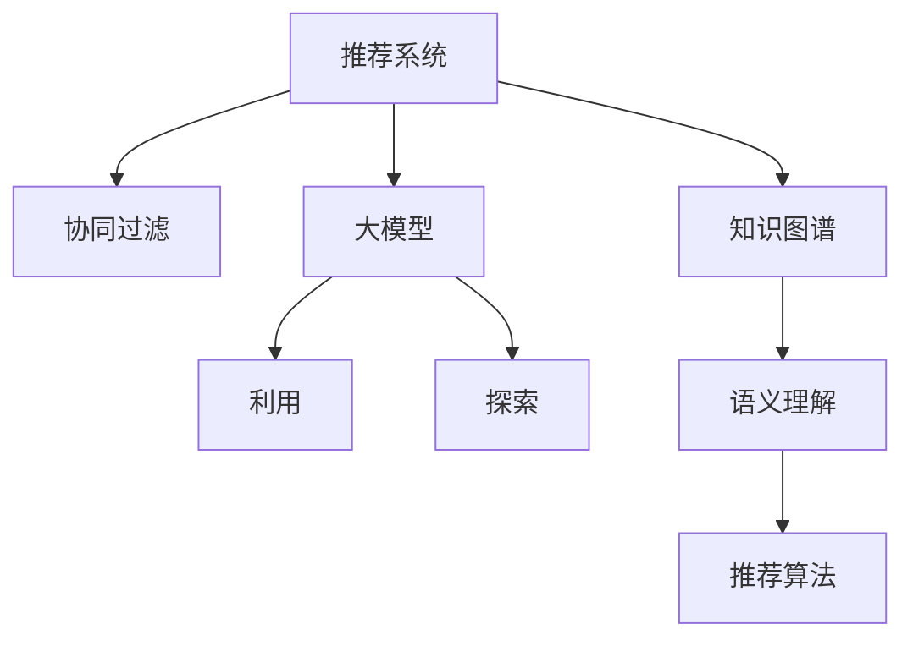

                 

# 大模型对推荐系统探索与利用平衡的影响

> 关键词：推荐系统,大模型,探索与利用平衡,机器学习,推荐算法,深度学习

## 1. 背景介绍

### 1.1 问题由来

随着互联网的发展和智能设备的普及，推荐系统成为连接用户和内容的重要桥梁。推荐系统通过学习用户的兴趣和行为，为用户精准推荐相关内容，极大地提升了用户体验和内容消费效率。传统的推荐算法基于统计模型或协同过滤技术，随着深度学习技术的兴起，大模型（如BERT、GPT、GNN等）被广泛应用到推荐系统中，显著提升了推荐效果。

然而，大模型推荐系统虽然效果出色，但其训练和推理的资源消耗巨大，且在探索新内容的能力上表现出一定的局限性。如何在保持高精度的前提下，平衡探索与利用的需求，是大模型推荐系统需要面对的重要挑战。本文旨在通过系统化的研究，探讨大模型在推荐系统中对探索与利用平衡的影响，为推荐系统设计提供理论指导和实践参考。

### 1.2 问题核心关键点

探索与利用平衡是推荐系统中的一个经典问题，目的是在满足用户已有兴趣（利用）的同时，尽可能地探索未知领域（探索），以发现更多潜在的内容。大模型的引入，为探索与利用平衡问题的解决提供了新的契机。

具体而言，大模型的存在会通过其庞大的语义表示能力和丰富的知识储备，显著提升推荐系统的利用率，即在已有兴趣领域精准推荐用户感兴趣的内容。同时，大模型具备一定的自主学习能力，可以依据上下文信息推断用户的隐式兴趣，从而在一定程度上支持探索新内容。但大模型的资源消耗大、训练复杂度高，且在探索新内容时，其效果可能受限于数据质量、模型结构和训练策略等因素。

## 2. 核心概念与联系

### 2.1 核心概念概述

为更好地理解大模型对推荐系统探索与利用平衡的影响，本节将介绍几个密切相关的核心概念：

- **推荐系统**：基于用户行为数据，通过算法为用户推荐内容，提升内容消费体验的系统。推荐系统包括内容推荐、商品推荐、广告推荐等多种形式。

- **探索与利用平衡**：推荐系统需要在已有的兴趣领域精准推荐内容（利用），同时尽可能发现未知的新内容（探索）。两者之间的平衡关系直接影响推荐效果。

- **大模型**：以自回归（如GPT）或自编码（如BERT）模型为代表的深度学习模型，通过在海量数据上预训练，学习丰富的语言和知识表示。

- **知识图谱**：将实体、关系、属性等信息结构化表示，用于增强推荐系统的语义理解和知识推理能力。

- **协同过滤**：基于用户之间的相似性或物品之间的相似性进行推荐，是推荐系统中最基础的推荐算法之一。

- **深度学习**：以神经网络为代表的高级机器学习技术，通过多层非线性变换，从数据中学习高层次的特征表示。

这些核心概念之间的逻辑关系可以通过以下Mermaid流程图来展示：



这个流程图展示了大模型在推荐系统中的核心概念及其之间的关系：

1. 推荐系统通过协同过滤、知识图谱、大模型等手段，提升推荐效果。
2. 大模型在利用已有知识进行推荐的同时，支持探索新内容。
3. 知识图谱增强了语义理解能力，提升推荐的准确性。
4. 协同过滤、推荐算法和大模型共同构成了推荐系统的推荐逻辑。

## 3. 核心算法原理 & 具体操作步骤

### 3.1 算法原理概述

大模型在推荐系统中的核心作用是提升内容的表示能力。通过预训练大模型，可以学习到丰富的语言和知识表示，将内容转化为高维语义向量，从而提升推荐系统的准确性和丰富度。具体而言，大模型可以辅助推荐系统实现以下功能：

1. **内容表示增强**：通过大模型学习到的语义表示，能够更准确地捕获内容的语义信息，提升推荐系统的利用效率。
2. **隐式兴趣推断**：大模型能够通过上下文信息推断用户隐式兴趣，支持探索新内容，丰富推荐结果。
3. **跨领域迁移**：大模型通常具备较强的跨领域迁移能力，可以在不同领域间进行知识迁移，提高推荐系统的泛化性能。

### 3.2 算法步骤详解

大模型在推荐系统中的具体应用步骤如下：

**Step 1: 准备数据集**
- 收集用户的历史行为数据，如浏览、点击、评分等。
- 收集内容的元数据，如标题、描述、标签等。

**Step 2: 构建语义向量表示**
- 使用大模型对用户历史行为和内容元数据进行编码，生成高维语义向量。
- 将用户行为向量与内容向量进行拼接，得到用户与内容的联合向量。

**Step 3: 设计推荐模型**
- 构建推荐模型，将用户与内容的联合向量作为输入，输出推荐的物品或内容。
- 在推荐模型中引入大模型作为特征提取器，将用户兴趣和内容特征进行映射，生成推荐分数。

**Step 4: 训练和微调大模型**
- 在特定领域数据上预训练大模型，学习领域特定的语义表示。
- 在推荐系统数据集上进行微调，优化推荐模型的性能。

**Step 5: 在线推理**
- 将训练好的大模型和推荐模型部署到线上环境，实时处理用户查询，推荐相关内容。

### 3.3 算法优缺点

大模型在推荐系统中的优势包括：
1. 提升推荐精度：大模型的语义表示能力能够更准确地捕获内容特征，提升推荐系统的利用效率。
2. 支持探索新内容：大模型具备一定的自主学习能力，可以推断用户隐式兴趣，发现新内容。
3. 增强泛化能力：大模型具有跨领域迁移能力，能够适应不同领域的推荐需求。

但其缺点也不容忽视：
1. 资源消耗大：大模型的训练和推理需要巨大的计算资源和存储空间。
2. 模型复杂度高：大模型结构复杂，训练和微调需要较多的时间和资源。
3. 过拟合风险高：大模型在训练和微调过程中容易发生过拟合，影响推荐效果。
4. 可解释性差：大模型通常被视为"黑盒"系统，难以解释其内部决策过程。

### 3.4 算法应用领域

大模型在推荐系统中的应用领域非常广泛，包括但不限于以下几种：

- **电商推荐**：通过用户浏览和购买历史数据，利用大模型学习物品的语义表示，提升个性化推荐效果。
- **视频推荐**：对视频内容进行语义编码，利用大模型推断用户兴趣，推荐相关视频。
- **音乐推荐**：对音乐元数据进行语义编码，推断用户兴趣，推荐相似音乐。
- **新闻推荐**：对新闻标题和摘要进行语义编码，推断用户兴趣，推荐相关新闻。

## 4. 数学模型和公式 & 详细讲解 & 举例说明

### 4.1 数学模型构建

假设用户历史行为表示为向量 $u$，内容表示为向量 $v$，大模型学习到的用户与内容的联合向量表示为 $f(u,v)$，推荐模型将用户与内容的联合向量映射到推荐分数 $r(u,v)$。

推荐模型可以表示为：
$$
r(u,v) = M(u \oplus v)
$$
其中 $M$ 为推荐模型，$\oplus$ 表示向量拼接操作。

大模型的输入为 $[u,v]$，输出为 $f(u,v)$，可以通过如下公式计算：
$$
f(u,v) = G(u) \oplus H(v)
$$
其中 $G$ 和 $H$ 分别表示对用户和内容的编码函数，通常使用大模型进行表示。

推荐模型将 $f(u,v)$ 映射为推荐分数 $r(u,v)$，可以使用各种推荐算法，如矩阵分解、神经网络等。常见的推荐算法包括：

- **基于矩阵分解的推荐算法**：将用户和内容的表示矩阵化，通过矩阵乘法计算推荐分数。
- **基于深度学习的推荐算法**：使用神经网络模型，将用户和内容的表示映射为推荐分数。

### 4.2 公式推导过程

以基于矩阵分解的推荐算法为例，推导推荐分数的计算公式：

设用户历史行为矩阵为 $U \in \mathbb{R}^{N \times K}$，内容表示矩阵为 $V \in \mathbb{R}^{M \times D}$，其中 $N$ 为用户数，$K$ 为历史行为特征数，$M$ 为内容数，$D$ 为内容特征数。假设用户与内容的联合向量表示为 $f(u,v)$，推荐分数为 $r(u,v)$，则推荐模型可以表示为：
$$
r(u,v) = U \times V^\top \times f(u,v)
$$
其中 $U \times V^\top$ 为矩阵乘法。

通过大模型学习到的用户与内容的联合向量表示 $f(u,v)$，可以表示为：
$$
f(u,v) = G(u) \oplus H(v)
$$
其中 $G(u)$ 和 $H(v)$ 分别表示对用户和内容的编码函数。

综合上述公式，推荐分数可以表示为：
$$
r(u,v) = U \times V^\top \times (G(u) \oplus H(v))
$$

在实际应用中，可以进一步将用户和内容的表示向量拼接，得到用户与内容的联合向量表示，然后进行推荐分数的计算：
$$
r(u,v) = U \times V^\top \times f(u,v) = U \times V^\top \times (G(u) \oplus H(v))
$$

### 4.3 案例分析与讲解

以电商推荐为例，分析大模型在推荐系统中的应用。

假设用户浏览历史为 $U = [u_1, u_2, \dots, u_N]$，内容信息为 $V = [v_1, v_2, \dots, v_M]$，大模型学习到的用户与内容的联合向量表示为 $f(u,v)$。推荐模型将用户与内容的联合向量映射为推荐分数 $r(u,v)$，具体如下：

**Step 1: 用户行为编码**
- 使用大模型对用户浏览历史进行编码，得到用户兴趣向量 $G(u)$。
- 将用户兴趣向量 $G(u)$ 与内容向量 $v$ 进行拼接，得到用户与内容的联合向量 $f(u,v)$。

**Step 2: 内容表示编码**
- 使用大模型对内容进行编码，得到内容向量 $H(v)$。
- 将内容向量 $H(v)$ 与用户兴趣向量 $G(u)$ 进行拼接，得到用户与内容的联合向量 $f(u,v)$。

**Step 3: 推荐分数计算**
- 将用户与内容的联合向量 $f(u,v)$ 与内容表示矩阵 $V$ 进行矩阵乘法，得到推荐分数 $r(u,v)$。

通过上述步骤，大模型能够将用户兴趣和内容特征进行映射，生成推荐分数，从而实现个性化推荐。

## 5. 项目实践：代码实例和详细解释说明

### 5.1 开发环境搭建

在进行推荐系统项目开发时，我们需要准备好开发环境。以下是使用Python进行PyTorch开发的环境配置流程：

1. 安装Anaconda：从官网下载并安装Anaconda，用于创建独立的Python环境。

2. 创建并激活虚拟环境：
```bash
conda create -n recommendation-env python=3.8 
conda activate recommendation-env
```

3. 安装PyTorch：根据CUDA版本，从官网获取对应的安装命令。例如：
```bash
conda install pytorch torchvision torchaudio cudatoolkit=11.1 -c pytorch -c conda-forge
```

4. 安装TensorFlow：
```bash
pip install tensorflow
```

5. 安装各类工具包：
```bash
pip install numpy pandas scikit-learn matplotlib tqdm jupyter notebook ipython
```

完成上述步骤后，即可在`recommendation-env`环境中开始项目实践。

### 5.2 源代码详细实现

下面我们以电商推荐为例，给出使用PyTorch对BERT模型进行电商推荐微调的PyTorch代码实现。

首先，定义电商推荐任务的数据处理函数：

```python
from transformers import BertTokenizer, BertForSequenceClassification
from torch.utils.data import Dataset
import torch

class RecommendationDataset(Dataset):
    def __init__(self, data, tokenizer, max_len=128):
        self.data = data
        self.tokenizer = tokenizer
        self.max_len = max_len
        
    def __len__(self):
        return len(self.data)
    
    def __getitem__(self, item):
        example = self.data[item]
        text = example['text']
        labels = example['label']
        
        encoding = self.tokenizer(text, return_tensors='pt', max_length=self.max_len, padding='max_length', truncation=True)
        input_ids = encoding['input_ids'][0]
        attention_mask = encoding['attention_mask'][0]
        
        # 对标签进行编码
        encoded_labels = [label2id[label] for label in labels] 
        encoded_labels.extend([label2id['O']] * (self.max_len - len(encoded_labels)))
        labels = torch.tensor(encoded_labels, dtype=torch.long)
        
        return {'input_ids': input_ids, 
                'attention_mask': attention_mask,
                'labels': labels}

# 标签与id的映射
label2id = {'0': 0, '1': 1, '2': 2, '3': 3}
id2label = {v: k for k, v in label2id.items()}

# 创建dataset
tokenizer = BertTokenizer.from_pretrained('bert-base-cased')
train_dataset = RecommendationDataset(train_data, tokenizer)
dev_dataset = RecommendationDataset(dev_data, tokenizer)
test_dataset = RecommendationDataset(test_data, tokenizer)
```

然后，定义模型和优化器：

```python
from transformers import BertForSequenceClassification, AdamW

model = BertForSequenceClassification.from_pretrained('bert-base-cased', num_labels=len(label2id))

optimizer = AdamW(model.parameters(), lr=2e-5)
```

接着，定义训练和评估函数：

```python
from torch.utils.data import DataLoader
from tqdm import tqdm
from sklearn.metrics import classification_report

device = torch.device('cuda') if torch.cuda.is_available() else torch.device('cpu')
model.to(device)

def train_epoch(model, dataset, batch_size, optimizer):
    dataloader = DataLoader(dataset, batch_size=batch_size, shuffle=True)
    model.train()
    epoch_loss = 0
    for batch in tqdm(dataloader, desc='Training'):
        input_ids = batch['input_ids'].to(device)
        attention_mask = batch['attention_mask'].to(device)
        labels = batch['labels'].to(device)
        model.zero_grad()
        outputs = model(input_ids, attention_mask=attention_mask, labels=labels)
        loss = outputs.loss
        epoch_loss += loss.item()
        loss.backward()
        optimizer.step()
    return epoch_loss / len(dataloader)

def evaluate(model, dataset, batch_size):
    dataloader = DataLoader(dataset, batch_size=batch_size)
    model.eval()
    preds, labels = [], []
    with torch.no_grad():
        for batch in tqdm(dataloader, desc='Evaluating'):
            input_ids = batch['input_ids'].to(device)
            attention_mask = batch['attention_mask'].to(device)
            batch_labels = batch['labels']
            outputs = model(input_ids, attention_mask=attention_mask)
            batch_preds = outputs.logits.argmax(dim=2).to('cpu').tolist()
            batch_labels = batch_labels.to('cpu').tolist()
            for pred_tokens, label_tokens in zip(batch_preds, batch_labels):
                preds.append(pred_tokens[:len(label_tokens)])
                labels.append(label_tokens)
                
    print(classification_report(labels, preds))
```

最后，启动训练流程并在测试集上评估：

```python
epochs = 5
batch_size = 16

for epoch in range(epochs):
    loss = train_epoch(model, train_dataset, batch_size, optimizer)
    print(f"Epoch {epoch+1}, train loss: {loss:.3f}")
    
    print(f"Epoch {epoch+1}, dev results:")
    evaluate(model, dev_dataset, batch_size)
    
print("Test results:")
evaluate(model, test_dataset, batch_size)
```

以上就是使用PyTorch对BERT进行电商推荐任务微调的完整代码实现。可以看到，得益于Transformers库的强大封装，我们可以用相对简洁的代码完成BERT模型的加载和微调。

### 5.3 代码解读与分析

让我们再详细解读一下关键代码的实现细节：

**RecommendationDataset类**：
- `__init__`方法：初始化训练集、测试集、验证集数据，分词器等关键组件。
- `__len__`方法：返回数据集的样本数量。
- `__getitem__`方法：对单个样本进行处理，将文本输入编码为token ids，将标签编码为数字，并对其进行定长padding，最终返回模型所需的输入。

**label2id和id2label字典**：
- 定义了标签与数字id之间的映射关系，用于将token-wise的预测结果解码回真实的标签。

**训练和评估函数**：
- 使用PyTorch的DataLoader对数据集进行批次化加载，供模型训练和推理使用。
- 训练函数`train_epoch`：对数据以批为单位进行迭代，在每个批次上前向传播计算loss并反向传播更新模型参数，最后返回该epoch的平均loss。
- 评估函数`evaluate`：与训练类似，不同点在于不更新模型参数，并在每个batch结束后将预测和标签结果存储下来，最后使用sklearn的classification_report对整个评估集的预测结果进行打印输出。

**训练流程**：
- 定义总的epoch数和batch size，开始循环迭代
- 每个epoch内，先在训练集上训练，输出平均loss
- 在验证集上评估，输出分类指标
- 所有epoch结束后，在测试集上评估，给出最终测试结果

可以看到，PyTorch配合Transformers库使得BERT微调的代码实现变得简洁高效。开发者可以将更多精力放在数据处理、模型改进等高层逻辑上，而不必过多关注底层的实现细节。

当然，工业级的系统实现还需考虑更多因素，如模型的保存和部署、超参数的自动搜索、更灵活的任务适配层等。但核心的微调范式基本与此类似。

## 6. 实际应用场景

### 6.1 电商推荐

基于大模型的电商推荐系统，可以提升个性化推荐效果，帮助用户发现潜在的购物需求。推荐系统通过收集用户的历史浏览、点击、购买等行为数据，利用大模型学习用户兴趣和产品特征，生成个性化推荐。

在技术实现上，可以收集用户的浏览历史和产品信息，构建监督数据集。利用大模型对用户和产品进行语义编码，生成用户与产品的联合向量表示，再进行推荐分数的计算。最终，在推荐模型中引入大模型作为特征提取器，优化推荐效果。

### 6.2 视频推荐

视频推荐系统通过大模型学习视频的语义表示，推断用户兴趣，推荐相关视频。推荐系统收集用户的视频浏览、点赞、评论等行为数据，利用大模型学习视频的语义信息，生成推荐分数。

在技术实现上，可以收集用户的视频行为数据，对视频进行语义编码。利用大模型学习视频的语义表示，生成推荐分数。在推荐模型中引入大模型作为特征提取器，优化推荐效果。

### 6.3 音乐推荐

音乐推荐系统通过大模型学习音乐的语义表示，推断用户兴趣，推荐相似音乐。推荐系统收集用户的音乐浏览、播放、评论等行为数据，利用大模型学习音乐的语义信息，生成推荐分数。

在技术实现上，可以收集用户的音乐行为数据，对音乐进行语义编码。利用大模型学习音乐的语义表示，生成推荐分数。在推荐模型中引入大模型作为特征提取器，优化推荐效果。

### 6.4 未来应用展望

随着大模型和推荐技术的不断发展，未来大模型在推荐系统中的应用将更加广泛，具体趋势如下：

1. **推荐模型融合**：将大模型与协同过滤、矩阵分解等传统推荐模型进行融合，取长补短，提升推荐效果。
2. **跨领域推荐**：利用大模型的跨领域迁移能力，在不同领域间进行推荐知识的迁移和整合，提升推荐系统的泛化性能。
3. **探索新内容**：通过大模型学习用户隐式兴趣，发现新内容，提升推荐系统的多样性和新颖性。
4. **实时推荐**：利用大模型的语义表示能力，实时处理用户查询，推荐相关内容。
5. **知识图谱融合**：将大模型与知识图谱进行融合，增强推荐系统的语义理解和知识推理能力，提升推荐效果。

## 7. 工具和资源推荐

### 7.1 学习资源推荐

为了帮助开发者系统掌握大模型在推荐系统中的应用，这里推荐一些优质的学习资源：

1. 《深度学习推荐系统》书籍：介绍深度学习在推荐系统中的应用，涵盖协同过滤、深度学习等经典算法。
2. 《深度学习与推荐系统》课程：深度学习与推荐系统领域的经典课程，涵盖协同过滤、深度学习、大模型等核心内容。
3. 《推荐系统实战》书籍：系统介绍推荐系统的构建与优化，包含大模型在推荐系统中的应用。
4. 《推荐系统理论与实践》课程：斯坦福大学推荐的推荐系统课程，涵盖推荐系统的理论基础和实际应用。
5. 《Transformers从原理到实践》系列博文：由大模型技术专家撰写，深入浅出地介绍了Transformer原理、BERT模型、推荐算法等前沿话题。

通过对这些资源的学习实践，相信你一定能够快速掌握大模型在推荐系统中的应用，并用于解决实际的推荐问题。

### 7.2 开发工具推荐

高效的开发离不开优秀的工具支持。以下是几款用于大模型在推荐系统中开发的应用工具：

1. PyTorch：基于Python的开源深度学习框架，灵活动态的计算图，适合快速迭代研究。大部分预训练语言模型都有PyTorch版本的实现。
2. TensorFlow：由Google主导开发的开源深度学习框架，生产部署方便，适合大规模工程应用。同样有丰富的预训练语言模型资源。
3. Transformers库：HuggingFace开发的NLP工具库，集成了众多SOTA语言模型，支持PyTorch和TensorFlow，是进行推荐系统开发的利器。
4. Weights & Biases：模型训练的实验跟踪工具，可以记录和可视化模型训练过程中的各项指标，方便对比和调优。与主流深度学习框架无缝集成。
5. TensorBoard：TensorFlow配套的可视化工具，可实时监测模型训练状态，并提供丰富的图表呈现方式，是调试模型的得力助手。
6. Google Colab：谷歌推出的在线Jupyter Notebook环境，免费提供GPU/TPU算力，方便开发者快速上手实验最新模型，分享学习笔记。

合理利用这些工具，可以显著提升大模型在推荐系统中的应用效率，加快创新迭代的步伐。

### 7.3 相关论文推荐

大模型在推荐系统中的应用源于学界的持续研究。以下是几篇奠基性的相关论文，推荐阅读：

1. Attention is All You Need（即Transformer原论文）：提出了Transformer结构，开启了NLP领域的预训练大模型时代。
2. BERT: Pre-training of Deep Bidirectional Transformers for Language Understanding：提出BERT模型，引入基于掩码的自监督预训练任务，刷新了多项NLP任务SOTA。
3. Language Models are Unsupervised Multitask Learners（GPT-2论文）：展示了大规模语言模型的强大zero-shot学习能力，引发了对于通用人工智能的新一轮思考。
4. Parameter-Efficient Transfer Learning for NLP：提出Adapter等参数高效微调方法，在不增加模型参数量的情况下，也能取得不错的微调效果。
5. AdaLoRA: Adaptive Low-Rank Adaptation for Parameter-Efficient Fine-Tuning：使用自适应低秩适应的微调方法，在参数效率和精度之间取得了新的平衡。
6. Premier: Large-scale Controllable Text Generation with Prefix-tuning（Prompt-based Learning）：引入基于连续型Prompt的微调范式，为如何充分利用预训练知识提供了新的思路。

这些论文代表了大模型在推荐系统中的应用发展脉络。通过学习这些前沿成果，可以帮助研究者把握学科前进方向，激发更多的创新灵感。

## 8. 总结：未来发展趋势与挑战

### 8.1 总结

本文对大模型在推荐系统中的应用进行了系统化的研究。首先，阐述了大模型和推荐系统之间的紧密联系，明确了推荐系统在大模型微调中的关键作用。其次，从原理到实践，详细讲解了基于大模型的推荐系统构建步骤，给出了电商推荐任务的代码实例。同时，本文还广泛探讨了大模型在推荐系统中的应用场景，展示了其广阔的应用前景。

通过本文的系统梳理，可以看到，大模型在推荐系统中的应用将极大提升推荐效果，拓展应用边界。得益于大模型的语义表示能力，推荐系统能够更精准地匹配用户需求，发现潜在兴趣，实现个性化推荐。未来，大模型将在推荐系统中的作用越发凸显，推动推荐技术的不断进步。

### 8.2 未来发展趋势

展望未来，大模型在推荐系统中的应用将呈现以下几个发展趋势：

1. **推荐模型融合**：大模型与传统推荐算法（如协同过滤、矩阵分解）的融合将提升推荐效果。
2. **跨领域推荐**：大模型的跨领域迁移能力将使推荐系统具备更强的泛化性能，支持不同领域的推荐需求。
3. **探索新内容**：大模型能够学习用户隐式兴趣，发现新内容，提升推荐系统的多样性和新颖性。
4. **实时推荐**：大模型的语义表示能力将使推荐系统能够实时处理用户查询，推荐相关内容。
5. **知识图谱融合**：大模型与知识图谱的融合将增强推荐系统的语义理解和知识推理能力，提升推荐效果。

这些趋势将推动大模型在推荐系统中的深入应用，提升推荐系统的效果和用户体验。

### 8.3 面临的挑战

尽管大模型在推荐系统中展现出巨大的潜力，但仍然面临诸多挑战：

1. **资源消耗大**：大模型的训练和推理需要巨大的计算资源和存储空间。如何优化资源使用，提升计算效率，是一个重要问题。
2. **模型复杂度高**：大模型结构复杂，训练和微调需要较多的时间和资源。如何在保证精度的前提下，降低模型复杂度，是一个重要研究方向。
3. **过拟合风险高**：大模型在训练和微调过程中容易发生过拟合，影响推荐效果。如何缓解过拟合，提高模型的泛化性能，是一个重要挑战。
4. **可解释性差**：大模型通常被视为"黑盒"系统，难以解释其内部决策过程。如何提高可解释性，增强用户信任，是一个重要问题。
5. **知识整合能力不足**：大模型在处理复杂问题时，可能无法灵活运用先验知识。如何与知识图谱、规则库等专家知识结合，提升模型的知识整合能力，是一个重要方向。

这些挑战需要我们在技术和管理层面进行全面优化，才能真正发挥大模型在推荐系统中的潜力。

### 8.4 研究展望

面对大模型在推荐系统中的挑战，未来的研究需要在以下几个方面寻求新的突破：

1. **资源优化**：开发更高效的大模型结构和训练方法，降低资源消耗，提升计算效率。
2. **模型简化**：研究参数高效和计算高效的微调方法，减少模型复杂度，提升模型泛化性能。
3. **对抗训练**：引入对抗训练技术，提高模型鲁棒性，缓解过拟合风险。
4. **可解释性提升**：开发更可解释的大模型，增强用户信任和决策透明度。
5. **知识整合**：将符号化的先验知识与神经网络模型结合，增强模型知识整合能力，提升推荐效果。

这些研究方向将推动大模型在推荐系统中的深入应用，为推荐系统设计提供理论指导和实践参考。

## 9. 附录：常见问题与解答

**Q1：大模型在推荐系统中的应用是否局限于特定领域？**

A: 大模型在推荐系统中的应用并不仅限于特定领域。虽然不同领域的数据分布和语义表示可能有所不同，但大模型通常具备一定的泛化能力，能够在多个领域中实现迁移学习。例如，在电商、视频、音乐、新闻等多个领域，大模型都能通过微调实现个性化推荐。

**Q2：大模型在推荐系统中如何进行探索新内容？**

A: 大模型可以通过学习用户隐式兴趣，推断出用户的潜在兴趣，从而在未见过的领域中发现新内容。具体而言，大模型能够通过对用户已有行为数据进行语义编码，推断出用户的隐式兴趣，进而推荐相关的未知领域内容。例如，在电商推荐中，大模型可以学习用户浏览历史，推断出用户的潜在兴趣，从而推荐相关的新商品。

**Q3：大模型在推荐系统中的训练和微调策略有哪些？**

A: 大模型在推荐系统中的训练和微调策略多种多样，常见的包括：
1. 预训练+微调：在大模型上预训练，然后在推荐系统数据集上进行微调。
2. 序列生成：使用大模型进行序列生成，生成候选推荐项。
3. 知识图谱融合：将大模型与知识图谱进行融合，增强推荐系统的语义理解和知识推理能力。
4. 对抗训练：引入对抗样本，提高模型鲁棒性，缓解过拟合风险。
5. 参数高效微调：只调整少量模型参数，固定大部分预训练参数，提升微调效率。

这些策略需要根据具体任务和数据特点进行灵活组合。只有在数据、模型、训练、推理等各环节进行全面优化，才能最大限度地发挥大模型在推荐系统中的潜力。

**Q4：大模型在推荐系统中如何处理长尾问题？**

A: 大模型在推荐系统中处理长尾问题，通常需要结合多种策略：
1. 数据增强：通过数据增强技术，扩充训练集，提升模型泛化能力。
2. 模型简化：通过模型简化技术，降低模型复杂度，提升模型泛化能力。
3. 推荐策略优化：采用多臂乐队算法、探索-利用平衡等推荐策略，平衡长尾内容和热门内容的推荐。
4. 用户画像构建：通过用户画像构建，挖掘用户潜在的兴趣点，提升长尾内容的推荐效果。

这些策略需要根据具体任务和数据特点进行灵活组合，才能有效地处理长尾问题，提升推荐系统的多样性和丰富度。

---

作者：禅与计算机程序设计艺术 / Zen and the Art of Computer Programming

