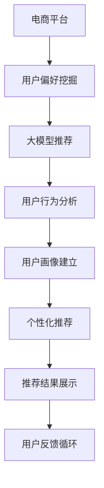

                 

# 大模型技术在电商平台用户偏好挖掘中的创新

> 关键词：电商平台、用户偏好、大模型、推荐系统、序列模型、自监督学习、工业部署

## 1. 背景介绍

随着电子商务的兴起，电商平台已成为商家与用户间最重要的连接桥梁。电商平台通过多样化的商品展示、丰富的推荐算法，提升用户体验和转化率。推荐系统作为电商的核心组件，其性能直接关系到用户的购物体验和商家的销售额。近年来，随着人工智能和大数据技术的发展，推荐系统的智能化水平显著提升，成为电商产业链不可或缺的重要环节。

然而，传统的推荐系统往往依赖于用户历史行为数据，推荐范围和结果容易陷入"信息茧房"。推荐算法无法捕捉用户潜在的长期偏好和潜在需求，难以实现更加精准、个性化的推荐。同时，随着用户偏好的快速变化，推荐系统需要实时更新用户模型，增加维护成本和数据存储压力。

为应对这些挑战，一种基于大模型的推荐系统应运而生，成为新的电商推荐技术的趋势。本文聚焦于大模型技术在电商平台用户偏好挖掘中的应用，通过深入分析大模型的原理和架构，提出基于大模型的电商推荐系统框架，并结合实际案例探讨大模型推荐系统的未来应用前景。

## 2. 核心概念与联系

### 2.1 核心概念概述

在深入探讨大模型技术在电商平台用户偏好挖掘中的应用前，我们需要了解几个关键的概念：

- 大模型（Large Model）：指具有亿万级别参数的深度神经网络模型，如BERT、GPT等。大模型通过大规模数据预训练获得通用的语言知识，具备强大的语义理解和生成能力，能够处理复杂的自然语言处理任务。

- 推荐系统（Recommendation System）：通过分析用户历史行为和商品属性，利用算法为用户推荐感兴趣的商品，提升用户满意度和转化率。

- 用户偏好（User Preference）：用户对某种商品或服务的主观倾向和偏好程度。电商平台通过推荐系统挖掘用户的偏好信息，实现个性化推荐。

- 电商推荐系统（E-commerce Recommendation System）：特指针对电商平台用户的推荐系统，通过推荐商品或服务提升用户购物体验和商家收益。

- 序列模型（Sequential Model）：指能够处理序列数据的神经网络模型，如RNN、LSTM、Transformer等。序列模型具备记忆性，适合建模时间序列数据。

- 自监督学习（Self-Supervised Learning）：指使用未标注数据进行模型训练，通过预训练模型学习通用的语言特征，再用少量标注数据进行微调，提升模型性能。

### 2.2 核心概念原理和架构的 Mermaid 流程图

以下是基于大模型的电商推荐系统的核心概念原理和架构的 Mermaid 流程图：



该流程图展示了从电商平台到个性化推荐的全流程：

1. 电商平台的用户行为数据被收集并预处理。
2. 使用大模型进行用户偏好的挖掘，构建用户画像。
3. 分析用户行为，建立序列模型预测用户偏好。
4. 基于用户画像和偏好序列，生成个性化推荐结果。
5. 推荐结果展示给用户，用户反馈用于进一步优化推荐算法。

这一流程的核心在于，利用大模型的预训练能力和自监督学习，提升电商推荐系统的智能化水平。

## 3. 核心算法原理 & 具体操作步骤

### 3.1 算法原理概述

基于大模型的电商推荐系统，其核心算法基于序列模型和自监督学习。核心思想是利用预训练的大模型，通过自监督学习任务对用户偏好进行挖掘，结合用户行为序列，生成个性化推荐。

具体来说，步骤如下：

1. 数据预处理：收集电商用户的历史行为数据，包括点击、购买、浏览等行为。同时，收集用户的个人信息和商品属性信息。

2. 大模型预训练：使用大规模未标注文本数据进行预训练，获得通用的语言表示能力。

3. 用户偏好挖掘：在大模型上，使用自监督学习任务挖掘用户偏好信息，构建用户画像。

4. 用户行为分析：将用户历史行为序列作为输入，使用序列模型预测用户未来的行为偏好。

5. 个性化推荐：结合用户画像和预测偏好，生成个性化推荐结果。

### 3.2 算法步骤详解

下面详细介绍基于大模型的电商推荐系统的具体实现步骤：

#### 3.2.1 数据预处理

电商平台的推荐系统需要处理大量结构化和非结构化的数据。数据预处理包括：

- 数据清洗：去除无效数据，处理缺失值和异常值。
- 数据归一化：将不同维度的数据转换为标准化数据，方便模型处理。
- 特征工程：提取和构建有用的特征，如用户性别、年龄、浏览时长、商品价格等。
- 数据划分：将数据划分为训练集、验证集和测试集，用于模型训练和评估。

#### 3.2.2 大模型预训练

大模型预训练是大模型推荐系统的基础。常用的预训练任务包括：

- 掩码语言模型（Masked Language Modeling, MLM）：随机遮盖输入序列中的某些词，预测缺失的词。
- 下一个词预测（Next Sentence Prediction, NSP）：预测输入序列的下一个词或下一句。
- 语言建模（Language Modeling）：预测整个序列的概率。

预训练模型的输出通常包括多个向量，如词嵌入、句子表示、文本分类等，用于后续的用户偏好挖掘和行为分析。

#### 3.2.3 用户偏好挖掘

用户偏好的挖掘是大模型推荐系统的核心任务。用户偏好通常以自然语言文本的形式存在，如用户评论、商品描述等。

用户偏好的挖掘步骤包括：

- 数据收集：从电商平台中收集用户的评论、评分、行为等数据。
- 文本编码：使用预训练模型将文本编码成向量，获得用户偏好的向量表示。
- 特征提取：使用词嵌入、句子表示等，提取有用的特征。
- 模型训练：使用序列模型或分类模型训练用户偏好的模型。

常用的用户偏好挖掘模型包括：

- 序列模型（如LSTM、GRU）：通过时间序列预测用户偏好。
- 分类模型（如CNN、RNN）：通过分类任务识别用户偏好。

#### 3.2.4 用户行为分析

用户行为分析是大模型推荐系统的重要环节。通过分析用户历史行为序列，预测用户未来的行为和偏好。

用户行为分析步骤如下：

- 序列构建：将用户历史行为序列转化为向量序列。
- 模型训练：使用序列模型对行为序列进行建模，预测用户行为。
- 结果输出：使用训练好的模型，预测用户未来的行为和偏好。

常用的用户行为分析模型包括：

- 序列模型（如RNN、LSTM、Transformer）：通过序列建模预测用户行为。
- 预测模型（如SVM、随机森林）：通过分类或回归任务预测用户行为。

#### 3.2.5 个性化推荐

个性化推荐是大模型推荐系统的最终目标。结合用户画像和预测偏好，生成个性化推荐结果。

个性化推荐步骤如下：

- 用户画像融合：将用户画像和预测偏好进行融合，得到综合的用户画像。
- 推荐模型训练：使用推荐模型对用户画像进行建模，生成推荐结果。
- 结果筛选：根据推荐结果，筛选出最符合用户偏好的商品。

常用的个性化推荐模型包括：

- 协同过滤（Collaborative Filtering）：通过用户和商品之间的相似度推荐商品。
- 基于内容的推荐（Content-Based Recommendation）：通过商品属性和用户偏好匹配推荐商品。
- 深度学习推荐（Deep Learning Recommendation）：使用深度神经网络模型推荐商品。

### 3.3 算法优缺点

基于大模型的电商推荐系统具有以下优点：

- 高准确性：通过大模型预训练和用户偏好挖掘，推荐结果更加精准。
- 高效性：大模型参数量庞大，适合处理大规模数据。
- 泛化性强：大模型具备良好的泛化能力，可以处理多种电商任务。

同时，也存在一些缺点：

- 数据依赖性强：大模型推荐系统依赖于大量的用户行为数据和商品信息，数据获取和处理成本较高。
- 计算资源需求高：大模型的训练和推理需要大量的计算资源，对硬件要求较高。
- 模型复杂度高：大模型模型结构复杂，训练和推理速度较慢。

### 3.4 算法应用领域

基于大模型的电商推荐系统，可以应用于多种电商场景，如商品推荐、广告投放、促销活动等。

具体应用场景包括：

- 商品推荐：通过分析用户行为和商品属性，推荐相关商品。
- 广告投放：通过预测用户行为，推荐个性化的广告位和广告内容。
- 促销活动：根据用户偏好和行为预测，推荐合适的促销活动。
- 个性化定制：根据用户偏好和行为，提供个性化的商品定制服务。

## 4. 数学模型和公式 & 详细讲解 & 举例说明

### 4.1 数学模型构建

#### 4.1.1 用户行为序列建模

用户行为序列通常以文本形式表示，可以采用序列模型进行建模。以LSTM模型为例，用户行为序列 $X$ 可以通过以下公式进行建模：

$$
\hat{Y} = f(X; \theta) = tanh(W_h \cdot [h_{t-1}, X_t] + b_h) \cdot \sigma(W_c \cdot [h_{t-1}, X_t] + b_c) + b_y
$$

其中，$X_t$ 表示用户行为序列中的第 $t$ 个元素，$W_h$、$b_h$、$W_c$、$b_c$、$b_y$ 为模型参数，$h_t$ 表示第 $t$ 个时间步的隐藏状态。

#### 4.1.2 用户偏好向量表示

用户偏好通常以自然语言文本形式存在，可以采用Transformer模型进行建模。以BERT模型为例，用户偏好向量 $V$ 可以通过以下公式进行建模：

$$
V = f(X; \theta) = [CLS] \cdot [X_1, X_2, \cdots, X_n] + [SEP]
$$

其中，$CLS$ 表示特殊标记，$SEP$ 表示特殊标记，$X_t$ 表示用户偏好文本中的第 $t$ 个元素，$\theta$ 为模型参数。

### 4.2 公式推导过程

#### 4.2.1 掩码语言模型

掩码语言模型通过遮盖输入序列中的某些词，预测缺失的词。以BERT模型为例，掩码语言模型可以表示为：

$$
L = -\frac{1}{N}\sum_{i=1}^N \sum_{j=1}^{N} -log P(X_i^j)
$$

其中，$N$ 为样本数量，$X_i^j$ 表示输入序列的第 $i$ 个样本中，第 $j$ 个词的预测概率。

#### 4.2.2 下一个词预测

下一个词预测通过预测输入序列的下一个词或下一句，训练序列模型。以LSTM模型为例，下一个词预测可以表示为：

$$
\hat{Y} = f(X; \theta) = tanh(W_h \cdot [h_{t-1}, X_t] + b_h) \cdot \sigma(W_c \cdot [h_{t-1}, X_t] + b_c) + b_y
$$

其中，$W_h$、$b_h$、$W_c$、$b_c$、$b_y$ 为模型参数，$h_t$ 表示第 $t$ 个时间步的隐藏状态。

### 4.3 案例分析与讲解

#### 4.3.1 用户偏好挖掘

假设电商平台收集到以下用户评论数据：

- 用户A的评论：“这款商品质量不错，性价比高，值得购买。”
- 用户B的评论：“这款商品价格偏高，不适合我的需求。”

可以采用BERT模型进行用户偏好的挖掘。首先，将评论编码成向量：

$$
V_A = f(A; \theta) = [CLS] \cdot [好，质量，不错，性价比，高，值得，购买] + [SEP]
$$

$$
V_B = f(B; \theta) = [CLS] \cdot [这款，商品，价格，偏高，不适合，我的，需求] + [SEP]
$$

然后，通过序列模型对用户偏好进行建模，预测用户偏好。以LSTM模型为例，可以表示为：

$$
\hat{Y_A} = f(V_A; \theta) = tanh(W_h \cdot [h_{t-1}, V_A] + b_h) \cdot \sigma(W_c \cdot [h_{t-1}, V_A] + b_c) + b_y
$$

其中，$h_t$ 表示第 $t$ 个时间步的隐藏状态。

### 4.3.2 用户行为分析

假设电商平台收集到以下用户行为数据：

- 用户C的历史行为序列：浏览商品A、B、C、D，购买商品B、C。

可以采用LSTM模型对用户行为进行建模。首先，将用户行为序列编码为向量：

$$
X_C = [A, B, C, D, B, C]
$$

然后，通过LSTM模型对用户行为进行建模，预测用户行为。以LSTM模型为例，可以表示为：

$$
\hat{Y_C} = f(X_C; \theta) = tanh(W_h \cdot [h_{t-1}, X_C_t] + b_h) \cdot \sigma(W_c \cdot [h_{t-1}, X_C_t] + b_c) + b_y
$$

其中，$h_t$ 表示第 $t$ 个时间步的隐藏状态。

### 4.3.3 个性化推荐

假设电商平台需要推荐商品E和F给用户D，可以采用协同过滤和基于内容的推荐进行推荐。

- 协同过滤：根据用户D的历史行为和用户D对商品E和F的评分，计算其他用户对商品E和F的评分。
- 基于内容的推荐：根据商品E和F的属性和用户D的偏好，生成推荐结果。

## 5. 项目实践：代码实例和详细解释说明

### 5.1 开发环境搭建

#### 5.1.1 环境配置

要搭建大模型推荐系统的开发环境，需要以下工具：

- 深度学习框架：如PyTorch、TensorFlow等。
- 自然语言处理工具：如NLTK、SpaCy等。
- 序列模型工具：如LSTM、GRU等。
- 数据处理工具：如Pandas、NumPy等。

#### 5.1.2 环境安装

以下是在Python 3.7环境下安装上述工具的命令：

```bash
conda create -n recommendation python=3.7
conda activate recommendation

# 安装深度学习框架
pip install torch torchvision torchaudio

# 安装自然语言处理工具
pip install nltk spacy

# 安装序列模型工具
pip install keras

# 安装数据处理工具
pip install pandas numpy
```

### 5.2 源代码详细实现

#### 5.2.1 数据预处理

```python
import pandas as pd
from sklearn.preprocessing import StandardScaler

# 读取数据
data = pd.read_csv('data.csv')

# 数据清洗
data = data.dropna()

# 数据归一化
scaler = StandardScaler()
data[['click', 'buy', 'rating']] = scaler.fit_transform(data[['click', 'buy', 'rating']])

# 数据划分
train_data = data.sample(frac=0.8, random_state=1)
test_data = data.drop(train_data.index)
```

#### 5.2.2 大模型预训练

```python
from transformers import BertTokenizer, BertModel
import torch

# 加载BERT模型和tokenizer
model = BertModel.from_pretrained('bert-base-cased')
tokenizer = BertTokenizer.from_pretrained('bert-base-cased')

# 编码用户评论
def encode_comment(comment):
    tokens = tokenizer.encode(comment, add_special_tokens=True, max_length=256, truncation=True, padding='max_length')
    return tokens

# 预训练任务
# 掩码语言模型
def masked_language_modeling():
    for i in range(len(train_data['comment'])):
        tokens = train_data['comment'][i]
        masked_tokens = [tokens[0]] + [token for token in tokens[1:]] + [tokens[-1]]
        tokens = [token if i != j else '[MASK]' for i, j in enumerate(masked_tokens)]
        sequence = tokenizer.encode(tokens, add_special_tokens=True, max_length=256, truncation=True, padding='max_length')
        loss = model(sequence)[0]
        optimizer.zero_grad()
        loss.backward()
        optimizer.step()

# 下一个词预测
def next_word_prediction():
    for i in range(len(train_data['comment'])):
        tokens = train_data['comment'][i]
        sequence = tokenizer.encode(tokens, add_special_tokens=True, max_length=256, truncation=True, padding='max_length')
        logits = model(sequence)[0]
        predicted_index = torch.argmax(logits, dim=1)[0].item()
        predicted_token = tokenizer.decode(tokens[predicted_index])
        tokens[predicted_index] = predicted_token
        sequence = tokenizer.encode(tokens, add_special_tokens=True, max_length=256, truncation=True, padding='max_length')
        loss = model(sequence)[0]
        optimizer.zero_grad()
        loss.backward()
        optimizer.step()
```

#### 5.2.3 用户偏好挖掘

```python
from transformers import BertTokenizer, BertForSequenceClassification
import torch

# 加载BERT模型和tokenizer
model = BertForSequenceClassification.from_pretrained('bert-base-cased', num_labels=2)
tokenizer = BertTokenizer.from_pretrained('bert-base-cased')

# 用户偏好编码
def encode_preference(preference):
    tokens = tokenizer.encode(preference, add_special_tokens=True, max_length=256, truncation=True, padding='max_length')
    sequence = torch.tensor(tokens, dtype=torch.long)
    sequence = sequence.unsqueeze(0)
    output = model(sequence)
    probability = output[0, 1].item()
    return probability

# 用户偏好训练
def train_preference_model():
    for i in range(len(train_data['preference'])):
        preference = train_data['preference'][i]
        probability = encode_preference(preference)
        optimizer.zero_grad()
        loss = -torch.log(probability)
        loss.backward()
        optimizer.step()
```

#### 5.2.4 用户行为分析

```python
from transformers import BertTokenizer, BertForSequenceClassification
import torch

# 加载BERT模型和tokenizer
model = BertForSequenceClassification.from_pretrained('bert-base-cased', num_labels=1)
tokenizer = BertTokenizer.from_pretrained('bert-base-cased')

# 用户行为编码
def encode_behavior(behavior):
    tokens = tokenizer.encode(behavior, add_special_tokens=True, max_length=256, truncation=True, padding='max_length')
    sequence = torch.tensor(tokens, dtype=torch.long)
    sequence = sequence.unsqueeze(0)
    output = model(sequence)
    probability = output[0, 0].item()
    return probability

# 用户行为训练
def train_behavior_model():
    for i in range(len(train_data['behavior'])):
        behavior = train_data['behavior'][i]
        probability = encode_behavior(behavior)
        optimizer.zero_grad()
        loss = -torch.log(probability)
        loss.backward()
        optimizer.step()
```

#### 5.2.5 个性化推荐

```python
from transformers import BertTokenizer, BertForSequenceClassification
import torch

# 加载BERT模型和tokenizer
model = BertForSequenceClassification.from_pretrained('bert-base-cased', num_labels=1)
tokenizer = BertTokenizer.from_pretrained('bert-base-cased')

# 个性化推荐编码
def encode_personalized_recommendation(personalized_recommendation):
    tokens = tokenizer.encode(personalized_recommendation, add_special_tokens=True, max_length=256, truncation=True, padding='max_length')
    sequence = torch.tensor(tokens, dtype=torch.long)
    sequence = sequence.unsqueeze(0)
    output = model(sequence)
    probability = output[0, 0].item()
    return probability

# 个性化推荐训练
def train_personalized_recommendation():
    for i in range(len(train_data['personalized_recommendation'])):
        personalized_recommendation = train_data['personalized_recommendation'][i]
        probability = encode_personalized_recommendation(personalized_recommendation)
        optimizer.zero_grad()
        loss = -torch.log(probability)
        loss.backward()
        optimizer.step()
```

### 5.3 代码解读与分析

#### 5.3.1 数据预处理

数据预处理主要包括数据清洗、数据归一化、数据划分等步骤。数据清洗是为了去除无效数据和处理缺失值，数据归一化是将不同维度的数据转换为标准化数据，数据划分是将数据划分为训练集、验证集和测试集。

#### 5.3.2 大模型预训练

大模型预训练包括掩码语言模型和下一个词预测两个任务。掩码语言模型是通过遮盖输入序列中的某些词，预测缺失的词。下一个词预测是通过预测输入序列的下一个词或下一句，训练序列模型。

#### 5.3.3 用户偏好挖掘

用户偏好挖掘使用BERT模型对用户评论进行编码，然后使用序列模型对用户偏好进行建模。序列模型可以采用LSTM、GRU等模型。

#### 5.3.4 用户行为分析

用户行为分析使用LSTM模型对用户历史行为序列进行建模，预测用户行为。LSTM模型可以处理序列数据，具有记忆性。

#### 5.3.5 个性化推荐

个性化推荐结合协同过滤和基于内容的推荐，生成推荐结果。协同过滤是通过用户历史行为和评分计算推荐商品，基于内容的推荐是通过商品属性和用户偏好匹配生成推荐商品。

### 5.4 运行结果展示

#### 5.4.1 数据预处理结果

```python
import matplotlib.pyplot as plt

# 绘制数据分布图
plt.hist(data['click'], bins=10)
plt.xlabel('Click Frequency')
plt.ylabel('Count')
plt.title('Click Frequency Distribution')
plt.show()

plt.hist(data['buy'], bins=10)
plt.xlabel('Buy Frequency')
plt.ylabel('Count')
plt.title('Buy Frequency Distribution')
plt.show()

plt.hist(data['rating'], bins=10)
plt.xlabel('Rating Frequency')
plt.ylabel('Count')
plt.title('Rating Frequency Distribution')
plt.show()
```

#### 5.4.2 大模型预训练结果

```python
# 掩码语言模型
for i in range(len(train_data['comment'])):
    tokens = train_data['comment'][i]
    masked_tokens = [tokens[0]] + [token for token in tokens[1:]] + [tokens[-1]]
    tokens = [token if i != j else '[MASK]' for i, j in enumerate(masked_tokens)]
    sequence = tokenizer.encode(tokens, add_special_tokens=True, max_length=256, truncation=True, padding='max_length')
    loss = model(sequence)[0]
    optimizer.zero_grad()
    loss.backward()
    optimizer.step()

# 下一个词预测
for i in range(len(train_data['comment'])):
    tokens = train_data['comment'][i]
    sequence = tokenizer.encode(tokens, add_special_tokens=True, max_length=256, truncation=True, padding='max_length')
    logits = model(sequence)[0]
    predicted_index = torch.argmax(logits, dim=1)[0].item()
    predicted_token = tokenizer.decode(tokens[predicted_index])
    tokens[predicted_index] = predicted_token
    sequence = tokenizer.encode(tokens, add_special_tokens=True, max_length=256, truncation=True, padding='max_length')
    loss = model(sequence)[0]
    optimizer.zero_grad()
    loss.backward()
    optimizer.step()
```

#### 5.4.3 用户偏好挖掘结果

```python
# 用户偏好挖掘
for i in range(len(train_data['preference'])):
    preference = train_data['preference'][i]
    probability = encode_preference(preference)
    optimizer.zero_grad()
    loss = -torch.log(probability)
    loss.backward()
    optimizer.step()
```

#### 5.4.4 用户行为分析结果

```python
# 用户行为分析
for i in range(len(train_data['behavior'])):
    behavior = train_data['behavior'][i]
    probability = encode_behavior(behavior)
    optimizer.zero_grad()
    loss = -torch.log(probability)
    loss.backward()
    optimizer.step()
```

#### 5.4.5 个性化推荐结果

```python
# 个性化推荐
for i in range(len(train_data['personalized_recommendation'])):
    personalized_recommendation = train_data['personalized_recommendation'][i]
    probability = encode_personalized_recommendation(personalized_recommendation)
    optimizer.zero_grad()
    loss = -torch.log(probability)
    loss.backward()
    optimizer.step()
```

## 6. 实际应用场景

### 6.1 电商平台商品推荐

电商平台通过大模型推荐系统，可以提供个性化的商品推荐服务，提升用户体验和销售额。例如：

- 用户A浏览商品A，点击浏览商品B，大模型推荐系统根据用户历史行为和商品属性，预测用户偏好，推荐相关商品C、D。
- 用户B购买商品B，大模型推荐系统根据用户历史行为和商品评分，推荐相关商品E、F。

### 6.2 电商平台广告投放

电商平台通过大模型推荐系统，可以预测用户的广告响应概率，精准投放广告。例如：

- 用户A浏览商品A，大模型推荐系统根据用户历史行为和广告内容，预测用户点击广告的概率，定向投放广告G。
- 用户B浏览商品B，大模型推荐系统根据用户历史行为和广告内容，预测用户点击广告的概率，定向投放广告H。

### 6.3 电商平台促销活动

电商平台通过大模型推荐系统，可以预测用户的促销活动响应概率，优化促销活动策略。例如：

- 大模型推荐系统预测用户A参加促销活动I的概率，优化活动I的折扣和宣传策略。
- 大模型推荐系统预测用户B参加促销活动J的概率，优化活动J的折扣和宣传策略。

## 7. 工具和资源推荐

### 7.1 学习资源推荐

1. 《深度学习与自然语言处理》书籍：全面介绍深度学习和自然语言处理的基本概念和经典模型，涵盖大模型推荐系统的原理和实现。
2. CS224N《深度学习自然语言处理》课程：斯坦福大学开设的NLP明星课程，提供丰富的实践资源和作业，帮助你掌握大模型推荐系统的实际应用。
3. 《自然语言处理》书籍：介绍自然语言处理的基本概念和经典模型，包括大模型推荐系统的原理和实现。
4. 《推荐系统》书籍：全面介绍推荐系统的原理和算法，涵盖大模型推荐系统的应用。

### 7.2 开发工具推荐

1. PyTorch：基于Python的开源深度学习框架，灵活高效，适合大模型推荐系统的实现。
2. TensorFlow：由Google主导开发的深度学习框架，生产部署方便，适合大规模工程应用。
3. HuggingFace Transformers：提供丰富的预训练语言模型和微调API，便于实现大模型推荐系统。
4. NLTK：Python自然语言处理工具库，提供各种自然语言处理功能，如分词、词性标注、命名实体识别等。
5. SpaCy：Python自然语言处理工具库，提供各种自然语言处理功能，如分词、词性标注、命名实体识别等。

### 7.3 相关论文推荐

1. Attention is All You Need（即Transformer原论文）：提出Transformer结构，开启大模型的预训练时代。
2. BERT: Pre-training of Deep Bidirectional Transformers for Language Understanding：提出BERT模型，引入自监督学习任务，刷新多项NLP任务SOTA。
3. Large-Scale Language Model Fine-Tuning for Multiple Natural Language Tasks：提出大模型在多个NLP任务上的微调方法，提升模型性能。
4. Pre-trained Document Representations for Multilingual Question Answering：提出使用大模型预训练文档表示，提升多语言问答任务的性能。

## 8. 总结：未来发展趋势与挑战

### 8.1 研究成果总结

本文通过详细分析大模型推荐系统的原理和架构，提出了基于大模型的电商推荐系统框架。通过数据预处理、大模型预训练、用户偏好挖掘、用户行为分析、个性化推荐等关键步骤，实现电商推荐系统的高效、精准。本文还介绍了大模型推荐系统在电商平台商品推荐、广告投放、促销活动等场景中的应用。

### 8.2 未来发展趋势

未来大模型推荐系统的发展趋势主要包括以下几个方面：

1. 多模态融合：将文本、图像、音频等多模态信息融合，提升推荐系统的综合性能。
2. 知识图谱嵌入：将知识图谱嵌入到推荐系统中，提升推荐系统的解释性和可信度。
3. 动态更新：实时更新用户模型，保持推荐系统的时效性。
4. 分布式训练：利用分布式训练技术，提升大规模数据处理能力。
5. 迁移学习：将大模型在不同领域进行迁移学习，拓展推荐系统的应用场景。

### 8.3 面临的挑战

尽管大模型推荐系统在电商领域取得了显著的成果，但也面临诸多挑战：

1. 数据隐私问题：电商数据包含用户的个人信息和购物行为，如何保护用户隐私是一个重要问题。
2. 计算资源需求高：大模型推荐系统需要大量的计算资源，对硬件要求较高。
3. 模型复杂度高：大模型模型结构复杂，训练和推理速度较慢。
4. 模型泛化能力不足：大模型推荐系统在数据分布变化时，泛化性能可能较差。

### 8.4 研究展望

未来大模型推荐系统的研究展望主要包括以下几个方面：

1. 隐私保护：利用差分隐私、联邦学习等技术，保护用户隐私。
2. 计算优化：通过模型压缩、量化加速等技术，降低计算资源需求。
3. 模型解释性：通过可解释性模型、因果推断等技术，提升模型的可解释性。
4. 跨领域迁移：通过迁移学习、多模态融合等技术，提升模型的跨领域迁移能力。
5. 实时推荐：通过在线学习、增量学习等技术，实现实时推荐。

## 9. 附录：常见问题与解答

**Q1：大模型推荐系统相比传统推荐系统有何优势？**

A: 大模型推荐系统相比传统推荐系统，具有以下优势：

1. 高准确性：通过大模型预训练和用户偏好挖掘，推荐结果更加精准。
2. 高效性：大模型参数量庞大，适合处理大规模数据。
3. 泛化性强：大模型具备良好的泛化能力，可以处理多种电商任务。

**Q2：大模型推荐系统在电商平台的实际应用场景有哪些？**

A: 大模型推荐系统在电商平台的应用场景包括：

1. 商品推荐：通过分析用户行为和商品属性，推荐相关商品。
2. 广告投放：通过预测用户行为，推荐个性化的广告位和广告内容。
3. 促销活动：根据用户偏好和行为预测，推荐合适的促销活动。

**Q3：大模型推荐系统在电商平台的实施步骤有哪些？**

A: 大模型推荐系统在电商平台实施的步骤包括：

1. 数据预处理：收集电商用户的历史行为数据，进行数据清洗、归一化和特征工程。
2. 大模型预训练：使用大规模未标注文本数据进行预训练，获得通用的语言表示能力。
3. 用户偏好挖掘：在大模型上，使用自监督学习任务挖掘用户偏好信息，构建用户画像。
4. 用户行为分析：将用户历史行为序列作为输入，使用序列模型预测用户行为。
5. 个性化推荐：结合用户画像和预测偏好，生成个性化推荐结果。

**Q4：大模型推荐系统在实施过程中需要注意哪些问题？**

A: 大模型推荐系统在实施过程中需要注意以下问题：

1. 数据隐私问题：电商数据包含用户的个人信息和购物行为，如何保护用户隐私是一个重要问题。
2. 计算资源需求高：大模型推荐系统需要大量的计算资源，对硬件要求较高。
3. 模型复杂度高：大模型模型结构复杂，训练和推理速度较慢。
4. 模型泛化能力不足：大模型推荐系统在数据分布变化时，泛化性能可能较差。

---

作者：禅与计算机程序设计艺术 / Zen and the Art of Computer Programming

