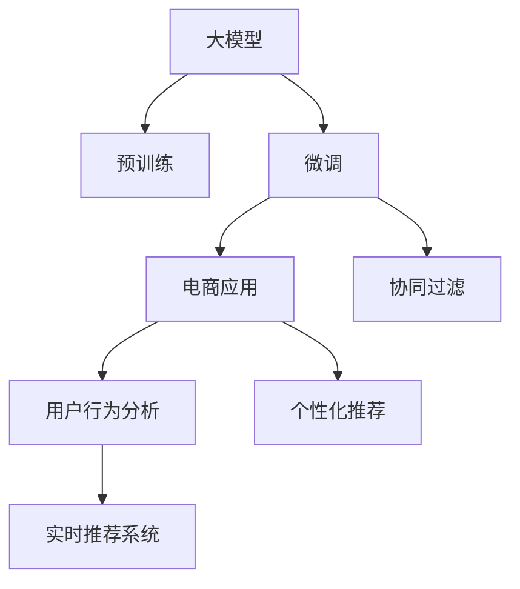

                 

# 大模型技术在电商平台用户兴趣迁移预测中的应用

## 1. 背景介绍

### 1.1 问题由来

随着电商平台的蓬勃发展，用户兴趣迁移预测已成为提升用户体验和销售额的重要手段。传统的用户兴趣预测方法依赖于线性模型、协同过滤等技术，对用户历史行为和交互数据的依赖较大，难以适应用户兴趣的快速变化。大模型技术通过大规模预训练和微调，能够捕捉到丰富的用户语义特征，具备强大的模式识别和迁移学习能力，为电商平台用户兴趣迁移预测带来了新的解决方案。

### 1.2 问题核心关键点

电商平台用户兴趣迁移预测的核心在于如何根据用户历史行为和实时数据，预测用户在未来时间点的兴趣变化，并实时推送相应的商品。其中涉及的关键点包括：
1. **数据采集与预处理**：从电商平台获取用户历史行为数据和实时数据。
2. **模型构建与训练**：构建大模型并使用电商数据进行微调，学习用户兴趣迁移的规律。
3. **预测与推荐**：基于微调后的模型，进行实时预测并推荐商品。
4. **模型评估与优化**：通过A/B测试等方法评估推荐效果，并持续优化模型性能。

### 1.3 问题研究意义

用户兴趣迁移预测对电商平台而言具有重要意义，能够帮助商家精准匹配用户需求，提高用户满意度和复购率，同时也为个性化推荐和市场营销提供数据支持。通过大模型技术进行用户兴趣迁移预测，可以显著提升预测准确性和实时性，为电商业务带来可观的经济价值。

## 2. 核心概念与联系

### 2.1 核心概念概述

为更好地理解基于大模型的电商平台用户兴趣迁移预测方法，本节将介绍几个关键概念及其联系：

- **大模型**：以BERT、GPT等Transformer模型为代表的大规模预训练语言模型。通过在大规模无标签文本语料上进行预训练，学习通用的语言表示，具备强大的语言理解和生成能力。

- **用户兴趣迁移预测**：指通过用户历史行为和实时数据，预测用户在未来时间点的兴趣变化，并实时推送相应的商品。

- **微调(Fine-tuning)**：指在预训练模型的基础上，使用电商平台用户数据，通过有监督学习优化模型在特定任务上的性能。

- **迁移学习(Transfer Learning)**：指将一个领域学习到的知识，迁移应用到另一个不同但相关的领域的学习范式。大模型的预训练-微调过程即是一种典型的迁移学习方式。

- **协同过滤**：通过分析用户的历史行为和偏好，寻找与当前用户兴趣相似的用户，并推荐其感兴趣的商品。

- **深度学习模型**：如卷积神经网络(CNN)、循环神经网络(RNN)、长短期记忆网络(LSTM)等，用于处理电商数据中的复杂结构。

这些概念之间的关系可以通过以下Mermaid流程图来展示：



这个流程图展示了大模型在电商平台用户兴趣迁移预测中的关键步骤：

1. 大模型通过预训练获得基础能力。
2. 微调使模型更好地适应电商平台数据。
3. 协同过滤和大模型结合，进一步提升推荐效果。
4. 用户行为分析和实时推荐系统，使推荐更具时效性和精准性。
5. 个性化推荐算法，根据用户特定需求定制化推荐。

## 3. 核心算法原理 & 具体操作步骤

### 3.1 算法原理概述

基于大模型的电商平台用户兴趣迁移预测，本质上是一个有监督的迁移学习过程。其核心思想是：将预训练的大模型视作一个强大的"特征提取器"，通过在电商平台用户数据上进行微调，学习用户兴趣迁移的规律，从而进行实时预测和推荐。

具体而言，假设电商平台用户数据为 $D=\{(x_i, y_i)\}_{i=1}^N$，其中 $x_i$ 为用户的特征向量，$y_i$ 为用户的兴趣迁移标签（如购买意愿、浏览行为等）。微调的目标是找到新的模型参数 $\hat{\theta}$，使得模型在新的兴趣标签上表现更好：

$$
\hat{\theta}=\mathop{\arg\min}_{\theta} \mathcal{L}(M_{\theta},D)
$$

其中 $\mathcal{L}$ 为针对电商平台用户兴趣迁移预测任务设计的损失函数，用于衡量模型预测输出与真实标签之间的差异。

### 3.2 算法步骤详解

基于大模型的电商平台用户兴趣迁移预测一般包括以下几个关键步骤：

**Step 1: 准备预训练模型和数据集**
- 选择合适的预训练语言模型 $M_{\theta}$ 作为初始化参数，如 BERT、GPT等。
- 收集电商平台用户的历史行为数据和实时数据，准备数据集 $D$。数据集应包含用户特征向量 $x_i$ 和兴趣迁移标签 $y_i$。

**Step 2: 添加任务适配层**
- 根据电商平台任务特点，设计合适的输出层和损失函数。
- 对于二分类任务，通常在顶层添加线性分类器和交叉熵损失函数。
- 对于多分类任务，则可采用softmax损失函数。

**Step 3: 设置微调超参数**
- 选择合适的优化算法及其参数，如 AdamW、SGD 等，设置学习率、批大小、迭代轮数等。
- 设置正则化技术及强度，包括权重衰减、Dropout、Early Stopping等。
- 确定冻结预训练参数的策略，如仅微调顶层，或全部参数都参与微调。

**Step 4: 执行梯度训练**
- 将训练集数据分批次输入模型，前向传播计算损失函数。
- 反向传播计算参数梯度，根据设定的优化算法和学习率更新模型参数。
- 周期性在验证集上评估模型性能，根据性能指标决定是否触发 Early Stopping。
- 重复上述步骤直到满足预设的迭代轮数或 Early Stopping 条件。

**Step 5: 测试和部署**
- 在测试集上评估微调后模型 $M_{\hat{\theta}}$ 的性能，对比微调前后的精度提升。
- 使用微调后的模型对新用户进行实时预测和推荐。
- 持续收集新的用户数据，定期重新微调模型，以适应数据分布的变化。

以上是基于大模型的电商平台用户兴趣迁移预测的一般流程。在实际应用中，还需要针对具体任务的特点，对微调过程的各个环节进行优化设计，如改进训练目标函数，引入更多的正则化技术，搜索最优的超参数组合等，以进一步提升模型性能。

### 3.3 算法优缺点

基于大模型的电商平台用户兴趣迁移预测方法具有以下优点：
1. 准确性高。大模型通过大规模预训练和微调，能够捕捉到复杂的用户兴趣变化规律，预测结果更准确。
2. 实时性高。微调模型能够快速适应新的用户数据，进行实时推荐，提高用户体验。
3. 泛化能力强。大模型具备良好的泛化能力，适用于多种电商场景和用户类型。

同时，该方法也存在一定的局限性：
1. 对标注数据依赖较大。微调效果很大程度上取决于标注数据的质量和数量，获取高质量标注数据的成本较高。
2. 模型训练复杂。大模型的参数量巨大，训练过程复杂且耗时。
3. 可解释性不足。微调模型的决策过程通常缺乏可解释性，难以对其推理逻辑进行分析和调试。

尽管存在这些局限性，但就目前而言，基于大模型的电商平台用户兴趣迁移预测方法仍是最主流的范式。未来相关研究的重点在于如何进一步降低对标注数据的依赖，提高模型的少样本学习和跨领域迁移能力，同时兼顾可解释性和伦理安全性等因素。

### 3.4 算法应用领域

基于大模型的电商平台用户兴趣迁移预测方法，在电商领域已经得到了广泛的应用，覆盖了用户行为分析、实时推荐、个性化推荐等多个环节，具体如下：

1. **用户行为分析**：通过分析用户的历史购买、浏览、收藏等行为数据，预测用户的未来兴趣变化，提高用户粘性和复购率。
2. **实时推荐系统**：根据用户实时行为数据，动态调整推荐内容，提升推荐的时效性和精准性。
3. **个性化推荐**：利用用户兴趣迁移预测结果，进行个性化推荐，满足用户的特定需求。
4. **广告投放优化**：通过预测用户对不同广告的兴趣，优化广告投放策略，提高广告投放效果。

除了上述这些经典应用外，电商平台用户兴趣迁移预测也被创新性地应用到更多场景中，如动态定价、库存管理、用户流失预测等，为电商平台带来了显著的经济效益。

## 4. 数学模型和公式 & 详细讲解 & 举例说明

### 4.1 数学模型构建

假设电商平台用户数据为 $D=\{(x_i, y_i)\}_{i=1}^N$，其中 $x_i$ 为用户的特征向量，$y_i$ 为用户的兴趣迁移标签。微调的目标是找到新的模型参数 $\hat{\theta}$，使得模型在新的兴趣标签上表现更好：

$$
\hat{\theta}=\mathop{\arg\min}_{\theta} \mathcal{L}(M_{\theta},D)
$$

其中 $\mathcal{L}$ 为针对电商平台用户兴趣迁移预测任务设计的损失函数，用于衡量模型预测输出与真实标签之间的差异。

对于二分类任务，假设模型 $M_{\theta}$ 在输入 $x_i$ 上的输出为 $\hat{y}=M_{\theta}(x_i) \in [0,1]$，表示用户购买意愿的概率。真实标签 $y_i \in \{0,1\}$。则二分类交叉熵损失函数定义为：

$$
\ell(M_{\theta}(x_i),y_i) = -[y_i\log \hat{y}_i + (1-y_i)\log (1-\hat{y}_i)]
$$

将其代入经验风险公式，得：

$$
\mathcal{L}(\theta) = -\frac{1}{N}\sum_{i=1}^N [y_i\log M_{\theta}(x_i)+(1-y_i)\log(1-M_{\theta}(x_i))]
$$

根据链式法则，损失函数对参数 $\theta_k$ 的梯度为：

$$
\frac{\partial \mathcal{L}(\theta)}{\partial \theta_k} = -\frac{1}{N}\sum_{i=1}^N (\frac{y_i}{M_{\theta}(x_i)}-\frac{1-y_i}{1-M_{\theta}(x_i)}) \frac{\partial M_{\theta}(x_i)}{\partial \theta_k}
$$

其中 $\frac{\partial M_{\theta}(x_i)}{\partial \theta_k}$ 可进一步递归展开，利用自动微分技术完成计算。

### 4.2 公式推导过程

以下我们以二分类任务为例，推导交叉熵损失函数及其梯度的计算公式。

假设模型 $M_{\theta}$ 在输入 $x_i$ 上的输出为 $\hat{y}=M_{\theta}(x_i) \in [0,1]$，表示用户购买意愿的概率。真实标签 $y_i \in \{0,1\}$。则二分类交叉熵损失函数定义为：

$$
\ell(M_{\theta}(x_i),y_i) = -[y_i\log \hat{y}_i + (1-y_i)\log (1-\hat{y}_i)]
$$

将其代入经验风险公式，得：

$$
\mathcal{L}(\theta) = -\frac{1}{N}\sum_{i=1}^N [y_i\log M_{\theta}(x_i)+(1-y_i)\log(1-M_{\theta}(x_i))]
$$

根据链式法则，损失函数对参数 $\theta_k$ 的梯度为：

$$
\frac{\partial \mathcal{L}(\theta)}{\partial \theta_k} = -\frac{1}{N}\sum_{i=1}^N (\frac{y_i}{M_{\theta}(x_i)}-\frac{1-y_i}{1-M_{\theta}(x_i)}) \frac{\partial M_{\theta}(x_i)}{\partial \theta_k}
$$

其中 $\frac{\partial M_{\theta}(x_i)}{\partial \theta_k}$ 可进一步递归展开，利用自动微分技术完成计算。

在得到损失函数的梯度后，即可带入参数更新公式，完成模型的迭代优化。重复上述过程直至收敛，最终得到适应电商平台用户兴趣迁移预测任务的最优模型参数 $\hat{\theta}$。

### 4.3 案例分析与讲解

以电商平台商品推荐系统为例，展示如何利用大模型进行用户兴趣迁移预测。

假设平台上有 $N$ 个商品，每个商品 $j$ 对应一个特征向量 $x_j$，且 $x_j \in \mathbb{R}^d$。用户的兴趣 $y_i$ 为一个二分类变量，表示用户是否购买了商品 $i$。

在大模型上进行微调时，首先选择合适的预训练模型 $M_{\theta}$，并将其作为初始参数。然后收集电商平台的历史数据和实时数据，将每个用户 $i$ 的历史行为和实时行为拼接为一个特征向量 $x_i$，作为模型的输入。

模型的输出为 $y_i$ 的概率分布，即用户购买商品 $i$ 的概率。通过二分类交叉熵损失函数计算模型预测与真实标签之间的差异，并利用优化算法更新模型参数，最小化损失函数。

在训练过程中，模型不断调整权重参数，以适应电商平台数据的特点，学习用户兴趣迁移的规律。训练完成后，模型将用于实时预测用户对不同商品的兴趣，并进行推荐。

## 5. 项目实践：代码实例和详细解释说明

### 5.1 开发环境搭建

在进行电商平台用户兴趣迁移预测实践前，我们需要准备好开发环境。以下是使用Python进行PyTorch开发的环境配置流程：

1. 安装Anaconda：从官网下载并安装Anaconda，用于创建独立的Python环境。

2. 创建并激活虚拟环境：
```bash
conda create -n pytorch-env python=3.8 
conda activate pytorch-env
```

3. 安装PyTorch：根据CUDA版本，从官网获取对应的安装命令。例如：
```bash
conda install pytorch torchvision torchaudio cudatoolkit=11.1 -c pytorch -c conda-forge
```

4. 安装Transformers库：
```bash
pip install transformers
```

5. 安装各类工具包：
```bash
pip install numpy pandas scikit-learn matplotlib tqdm jupyter notebook ipython
```

完成上述步骤后，即可在`pytorch-env`环境中开始电商平台用户兴趣迁移预测的实践。

### 5.2 源代码详细实现

下面以电商平台用户兴趣迁移预测为例，给出使用Transformers库对BERT模型进行微调的PyTorch代码实现。

首先，定义用户数据集：

```python
from transformers import BertTokenizer
from torch.utils.data import Dataset
import torch

class UserDataDataset(Dataset):
    def __init__(self, features, labels, tokenizer, max_len=128):
        self.features = features
        self.labels = labels
        self.tokenizer = tokenizer
        self.max_len = max_len
        
    def __len__(self):
        return len(self.features)
    
    def __getitem__(self, item):
        feature = self.features[item]
        label = self.labels[item]
        
        encoding = self.tokenizer(feature, return_tensors='pt', max_length=self.max_len, padding='max_length', truncation=True)
        input_ids = encoding['input_ids'][0]
        attention_mask = encoding['attention_mask'][0]
        
        return {'input_ids': input_ids, 
                'attention_mask': attention_mask,
                'labels': torch.tensor(label, dtype=torch.long)}
```

然后，定义模型和优化器：

```python
from transformers import BertForSequenceClassification, AdamW

model = BertForSequenceClassification.from_pretrained('bert-base-cased', num_labels=2)

optimizer = AdamW(model.parameters(), lr=2e-5)
```

接着，定义训练和评估函数：

```python
from torch.utils.data import DataLoader
from tqdm import tqdm
from sklearn.metrics import classification_report

device = torch.device('cuda') if torch.cuda.is_available() else torch.device('cpu')
model.to(device)

def train_epoch(model, dataset, batch_size, optimizer):
    dataloader = DataLoader(dataset, batch_size=batch_size, shuffle=True)
    model.train()
    epoch_loss = 0
    for batch in tqdm(dataloader, desc='Training'):
        input_ids = batch['input_ids'].to(device)
        attention_mask = batch['attention_mask'].to(device)
        labels = batch['labels'].to(device)
        model.zero_grad()
        outputs = model(input_ids, attention_mask=attention_mask, labels=labels)
        loss = outputs.loss
        epoch_loss += loss.item()
        loss.backward()
        optimizer.step()
    return epoch_loss / len(dataloader)

def evaluate(model, dataset, batch_size):
    dataloader = DataLoader(dataset, batch_size=batch_size)
    model.eval()
    preds, labels = [], []
    with torch.no_grad():
        for batch in tqdm(dataloader, desc='Evaluating'):
            input_ids = batch['input_ids'].to(device)
            attention_mask = batch['attention_mask'].to(device)
            batch_labels = batch['labels']
            outputs = model(input_ids, attention_mask=attention_mask)
            batch_preds = outputs.logits.argmax(dim=2).to('cpu').tolist()
            batch_labels = batch_labels.to('cpu').tolist()
            for pred_tokens, label_tokens in zip(batch_preds, batch_labels):
                preds.append(pred_tokens[:len(label_tokens)])
                labels.append(label_tokens)
                
    print(classification_report(labels, preds))
```

最后，启动训练流程并在测试集上评估：

```python
epochs = 5
batch_size = 16

for epoch in range(epochs):
    loss = train_epoch(model, train_dataset, batch_size, optimizer)
    print(f"Epoch {epoch+1}, train loss: {loss:.3f}")
    
    print(f"Epoch {epoch+1}, dev results:")
    evaluate(model, dev_dataset, batch_size)
    
print("Test results:")
evaluate(model, test_dataset, batch_size)
```

以上就是使用PyTorch对BERT进行电商平台用户兴趣迁移预测的完整代码实现。可以看到，得益于Transformers库的强大封装，我们可以用相对简洁的代码完成BERT模型的加载和微调。

### 5.3 代码解读与分析

让我们再详细解读一下关键代码的实现细节：

**UserDataDataset类**：
- `__init__`方法：初始化特征、标签、分词器等关键组件。
- `__len__`方法：返回数据集的样本数量。
- `__getitem__`方法：对单个样本进行处理，将用户数据输入编码为token ids，同时添加标签，并进行定长padding。

**模型和优化器**：
- 使用BertForSequenceClassification构建二分类模型，指定标签数。
- 使用AdamW优化器，设置学习率。

**训练和评估函数**：
- 使用PyTorch的DataLoader对数据集进行批次化加载，供模型训练和推理使用。
- 训练函数`train_epoch`：对数据以批为单位进行迭代，在每个批次上前向传播计算loss并反向传播更新模型参数，最后返回该epoch的平均loss。
- 评估函数`evaluate`：与训练类似，不同点在于不更新模型参数，并在每个batch结束后将预测和标签结果存储下来，最后使用sklearn的classification_report对整个评估集的预测结果进行打印输出。

**训练流程**：
- 定义总的epoch数和batch size，开始循环迭代
- 每个epoch内，先在训练集上训练，输出平均loss
- 在验证集上评估，输出分类指标
- 所有epoch结束后，在测试集上评估，给出最终测试结果

可以看到，PyTorch配合Transformers库使得BERT微调的代码实现变得简洁高效。开发者可以将更多精力放在数据处理、模型改进等高层逻辑上，而不必过多关注底层的实现细节。

当然，工业级的系统实现还需考虑更多因素，如模型的保存和部署、超参数的自动搜索、更灵活的任务适配层等。但核心的微调范式基本与此类似。

## 6. 实际应用场景

### 6.1 智能客服系统

基于大模型技术进行电商平台用户兴趣迁移预测，可以广泛应用于智能客服系统的构建。传统客服往往需要配备大量人力，高峰期响应缓慢，且一致性和专业性难以保证。而使用微调后的预测模型，可以7x24小时不间断服务，快速响应客户咨询，用自然流畅的语言解答各类常见问题。

在技术实现上，可以收集企业内部的历史客服对话记录，将问题和最佳答复构建成监督数据，在此基础上对预训练对话模型进行微调。微调后的对话模型能够自动理解用户意图，匹配最合适的答案模板进行回复。对于客户提出的新问题，还可以接入检索系统实时搜索相关内容，动态组织生成回答。如此构建的智能客服系统，能大幅提升客户咨询体验和问题解决效率。

### 6.2 金融舆情监测

金融机构需要实时监测市场舆论动向，以便及时应对负面信息传播，规避金融风险。传统的人工监测方式成本高、效率低，难以应对网络时代海量信息爆发的挑战。基于大模型技术进行电商平台用户兴趣迁移预测，为金融舆情监测提供了新的解决方案。

具体而言，可以收集金融领域相关的新闻、报道、评论等文本数据，并对其进行主题标注和情感标注。在此基础上对预训练语言模型进行微调，使其能够自动判断文本属于何种主题，情感倾向是正面、中性还是负面。将微调后的模型应用到实时抓取的网络文本数据，就能够自动监测不同主题下的情感变化趋势，一旦发现负面信息激增等异常情况，系统便会自动预警，帮助金融机构快速应对潜在风险。

### 6.3 个性化推荐系统

当前的推荐系统往往只依赖用户的历史行为数据进行物品推荐，无法深入理解用户的真实兴趣偏好。基于大模型技术进行电商平台用户兴趣迁移预测，可以更好地挖掘用户行为背后的语义信息，从而提供更精准、多样的推荐内容。

在实践中，可以收集用户浏览、点击、评论、分享等行为数据，提取和用户交互的物品标题、描述、标签等文本内容。将文本内容作为模型输入，用户的后续行为（如是否点击、购买等）作为监督信号，在此基础上微调预训练语言模型。微调后的模型能够从文本内容中准确把握用户的兴趣点。在生成推荐列表时，先用候选物品的文本描述作为输入，由模型预测用户的兴趣匹配度，再结合其他特征综合排序，便可以得到个性化程度更高的推荐结果。

### 6.4 未来应用展望

随着大模型技术和大数据时代的到来，基于电商平台用户兴趣迁移预测的方法将在更多领域得到应用，为传统行业带来变革性影响。

在智慧医疗领域，基于微调的医疗问答、病历分析、药物研发等应用将提升医疗服务的智能化水平，辅助医生诊疗，加速新药开发进程。

在智能教育领域，微调技术可应用于作业批改、学情分析、知识推荐等方面，因材施教，促进教育公平，提高教学质量。

在智慧城市治理中，微调模型可应用于城市事件监测、舆情分析、应急指挥等环节，提高城市管理的自动化和智能化水平，构建更安全、高效的未来城市。

此外，在企业生产、社会治理、文娱传媒等众多领域，基于大模型技术的电商平台用户兴趣迁移预测也将不断涌现，为经济社会发展注入新的动力。相信随着技术的日益成熟，基于大模型技术的电商预测方法将成为人工智能落地应用的重要范式，推动人工智能技术向更广阔的领域加速渗透。

## 7. 工具和资源推荐
### 7.1 学习资源推荐

为了帮助开发者系统掌握大模型技术在电商平台用户兴趣迁移预测的理论基础和实践技巧，这里推荐一些优质的学习资源：

1. 《Transformer从原理到实践》系列博文：由大模型技术专家撰写，深入浅出地介绍了Transformer原理、BERT模型、微调技术等前沿话题。

2. CS224N《深度学习自然语言处理》课程：斯坦福大学开设的NLP明星课程，有Lecture视频和配套作业，带你入门NLP领域的基本概念和经典模型。

3. 《Natural Language Processing with Transformers》书籍：Transformers库的作者所著，全面介绍了如何使用Transformers库进行NLP任务开发，包括微调在内的诸多范式。

4. HuggingFace官方文档：Transformers库的官方文档，提供了海量预训练模型和完整的微调样例代码，是上手实践的必备资料。

5. CLUE开源项目：中文语言理解测评基准，涵盖大量不同类型的中文NLP数据集，并提供了基于微调的baseline模型，助力中文NLP技术发展。

通过对这些资源的学习实践，相信你一定能够快速掌握大模型技术在电商平台用户兴趣迁移预测的精髓，并用于解决实际的NLP问题。
### 7.2 开发工具推荐

高效的开发离不开优秀的工具支持。以下是几款用于电商平台用户兴趣迁移预测开发的常用工具：

1. PyTorch：基于Python的开源深度学习框架，灵活动态的计算图，适合快速迭代研究。大部分预训练语言模型都有PyTorch版本的实现。

2. TensorFlow：由Google主导开发的开源深度学习框架，生产部署方便，适合大规模工程应用。同样有丰富的预训练语言模型资源。

3. Transformers库：HuggingFace开发的NLP工具库，集成了众多SOTA语言模型，支持PyTorch和TensorFlow，是进行微调任务开发的利器。

4. Weights & Biases：模型训练的实验跟踪工具，可以记录和可视化模型训练过程中的各项指标，方便对比和调优。与主流深度学习框架无缝集成。

5. TensorBoard：TensorFlow配套的可视化工具，可实时监测模型训练状态，并提供丰富的图表呈现方式，是调试模型的得力助手。

6. Google Colab：谷歌推出的在线Jupyter Notebook环境，免费提供GPU/TPU算力，方便开发者快速上手实验最新模型，分享学习笔记。

合理利用这些工具，可以显著提升电商平台用户兴趣迁移预测的开发效率，加快创新迭代的步伐。

### 7.3 相关论文推荐

大模型技术在电商平台用户兴趣迁移预测领域的发展源于学界的持续研究。以下是几篇奠基性的相关论文，推荐阅读：

1. Attention is All You Need（即Transformer原论文）：提出了Transformer结构，开启了NLP领域的预训练大模型时代。

2. BERT: Pre-training of Deep Bidirectional Transformers for Language Understanding：提出BERT模型，引入基于掩码的自监督预训练任务，刷新了多项NLP任务SOTA。

3. Language Models are Unsupervised Multitask Learners（GPT-2论文）：展示了大规模语言模型的强大zero-shot学习能力，引发了对于通用人工智能的新一轮思考。

4. Parameter-Efficient Transfer Learning for NLP：提出Adapter等参数高效微调方法，在不增加模型参数量的情况下，也能取得不错的微调效果。

5. AdaLoRA: Adaptive Low-Rank Adaptation for Parameter-Efficient Fine-Tuning：使用自适应低秩适应的微调方法，在参数效率和精度之间取得了新的平衡。

这些论文代表了大模型技术在电商平台用户兴趣迁移预测领域的发展脉络。通过学习这些前沿成果，可以帮助研究者把握学科前进方向，激发更多的创新灵感。

## 8. 总结：未来发展趋势与挑战

### 8.1 总结

本文对基于大模型的电商平台用户兴趣迁移预测方法进行了全面系统的介绍。首先阐述了大模型技术和微调方法的研究背景和意义，明确了其在新电商场景中的重要应用。其次，从原理到实践，详细讲解了微调模型的数学原理和关键步骤，给出了电商平台用户兴趣迁移预测的完整代码实例。同时，本文还广泛探讨了微调方法在电商推荐、客服、舆情监测等多个领域的应用前景，展示了微调技术的广泛潜力。此外，本文精选了微调技术的各类学习资源，力求为读者提供全方位的技术指引。

通过本文的系统梳理，可以看到，基于大模型的电商平台用户兴趣迁移预测方法在电商领域已经取得了显著成果，通过微调技术能够更精准地预测用户兴趣，提升电商平台的推荐效果和用户体验。未来，伴随预训练语言模型和微调方法的不断演进，大模型技术将为电商业务带来更多创新应用，进一步提升电商平台的智能化水平。

### 8.2 未来发展趋势

展望未来，大模型技术在电商平台用户兴趣迁移预测领域将呈现以下几个发展趋势：

1. **模型规模持续增大**：随着算力成本的下降和数据规模的扩张，预训练语言模型的参数量还将持续增长。超大规模语言模型蕴含的丰富语言知识，有望支撑更加复杂多变的电商平台任务微调。

2. **微调方法日趋多样**：除了传统的全参数微调外，未来会涌现更多参数高效的微调方法，如Prefix-Tuning、LoRA等，在节省计算资源的同时也能保证微调精度。

3. **持续学习成为常态**：随着电商平台数据分布的不断变化，微调模型也需要持续学习新知识以保持性能。如何在不遗忘原有知识的同时，高效吸收新样本信息，将成为重要的研究课题。

4. **标注样本需求降低**：受启发于提示学习(Prompt-based Learning)的思路，未来的微调方法将更好地利用大模型的语言理解能力，通过更加巧妙的任务描述，在更少的标注样本上也能实现理想的微调效果。

5. **多模态微调崛起**：当前的微调主要聚焦于纯文本数据，未来会进一步拓展到图像、视频、语音等多模态数据微调。多模态信息的融合，将显著提升语言模型对现实世界的理解和建模能力。

6. **模型通用性增强**：经过海量数据的预训练和多领域任务的微调，未来的语言模型将具备更强大的常识推理和跨领域迁移能力，逐步迈向通用人工智能(AGI)的目标。

以上趋势凸显了大模型技术在电商平台用户兴趣迁移预测领域的广阔前景。这些方向的探索发展，必将进一步提升电商平台的预测精度和实时性，为电商平台带来可观的经济价值。

### 8.3 面临的挑战

尽管大模型技术在电商平台用户兴趣迁移预测领域已经取得了显著成果，但在迈向更加智能化、普适化应用的过程中，它仍面临着诸多挑战：

1. **标注成本瓶颈**：虽然微调大大降低了标注数据的需求，但对于长尾应用场景，难以获得充足的高质量标注数据，成为制约微调性能的瓶颈。如何进一步降低微调对标注样本的依赖，将是一大难题。

2. **模型鲁棒性不足**：当前微调模型面对域外数据时，泛化性能往往大打折扣。对于测试样本的微小扰动，微调模型的预测也容易发生波动。如何提高微调模型的鲁棒性，避免灾难性遗忘，还需要更多理论和实践的积累。

3. **推理效率有待提高**：大规模语言模型虽然精度高，但在实际部署时往往面临推理速度慢、内存占用大等效率问题。如何在保证性能的同时，简化模型结构，提升推理速度，优化资源占用，将是重要的优化方向。

4. **可解释性亟需加强**：当前微调模型更像是"黑盒"系统，难以解释其内部工作机制和决策逻辑。对于医疗、金融等高风险应用，算法的可解释性和可审计性尤为重要。如何赋予微调模型更强的可解释性，将是亟待攻克的难题。

5. **安全性有待保障**。预训练语言模型难免会学习到有偏见、有害的信息，通过微调传递到下游任务，产生误导性、歧视性的输出，给实际应用带来安全隐患。如何从数据和算法层面消除模型偏见，避免恶意用途，确保输出的安全性，也将是重要的研究课题。

6. **知识整合能力不足**。现有的微调模型往往局限于任务内数据，难以灵活吸收和运用更广泛的先验知识。如何让微调过程更好地与外部知识库、规则库等专家知识结合，形成更加全面、准确的信息整合能力，还有很大的想象空间。

正视微调面临的这些挑战，积极应对并寻求突破，将是大模型技术在电商平台用户兴趣迁移预测领域走向成熟的必由之路。相信随着学界和产业界的共同努力，这些挑战终将一一被克服，大模型技术必将在构建人机协同的智能电商中扮演越来越重要的角色。

### 8.4 研究展望

面对大模型技术在电商平台用户兴趣迁移预测领域所面临的种种挑战，未来的研究需要在以下几个方面寻求新的突破：

1. **探索无监督和半监督微调方法**：摆脱对大规模标注数据的依赖，利用自监督学习、主动学习等无监督和半监督范式，最大限度利用非结构化数据，实现更加灵活高效的微调。

2. **研究参数高效和计算高效的微调范式**：开发更加参数高效的微调方法，在固定大部分预训练参数的同时，只更新极少量的任务相关参数。同时优化微调模型的计算图，减少前向传播和反向传播的资源消耗，实现更加轻量级、实时性的部署。

3. **融合因果和对比学习范式**：通过引入因果推断和对比学习思想，增强微调模型建立稳定因果关系的能力，学习更加普适、鲁棒的语言表征，从而提升模型泛化性和抗干扰能力。

4. **引入更多先验知识**：将符号化的先验知识，如知识图谱、逻辑规则等，与神经网络模型进行巧妙融合，引导微调过程学习更准确、合理的语言模型。同时加强不同模态数据的整合，实现视觉、语音等多模态信息与文本信息的协同建模。

5. **结合因果分析和博弈论工具**：将因果分析方法引入微调模型，识别出模型决策的关键特征，增强输出解释的因果性和逻辑性。借助博弈论工具刻画人机交互过程，主动探索并规避模型的脆弱点，提高系统稳定性。

6. **纳入伦理道德约束**：在模型训练目标中引入伦理导向的评估指标，过滤和惩罚有偏见、有害的输出倾向。同时加强人工干预和审核，建立模型行为的监管机制，确保输出符合人类价值观和伦理道德。

这些研究方向的探索，必将引领大模型技术在电商平台用户兴趣迁移预测领域迈向更高的台阶，为构建安全、可靠、可解释、可控的智能电商系统铺平道路。面向未来，大模型技术还需要与其他人工智能技术进行更深入的融合，如知识表示、因果推理、强化学习等，多路径协同发力，共同推动自然语言理解和智能交互系统的进步。只有勇于创新、敢于突破，才能不断拓展语言模型的边界，让智能技术更好地造福人类社会。

## 9. 附录：常见问题与解答

**Q1：电商平台用户兴趣迁移预测是否适用于所有用户群体？**

A: 电商平台用户兴趣迁移预测方法适用于大多数用户群体，特别是对电商平台的活跃用户。然而，对于新用户、非电商用户等群体，可能需要额外处理和建模，以提高预测的准确性。

**Q2：微调过程中如何选择合适的学习率？**

A: 微调的学习率一般要比预训练时小1-2个数量级，如果使用过大的学习率，容易破坏预训练权重，导致过拟合。一般建议从1e-5开始调参，逐步减小学习率，直至收敛。也可以使用warmup策略，在开始阶段使用较小的学习率，再逐渐过渡到预设值。需要注意的是，不同的优化器(如AdamW、Adafactor等)以及不同的学习率调度策略，可能需要设置不同的学习率阈值。

**Q3：采用大模型进行电商平台用户兴趣迁移预测时，如何避免过拟合？**

A: 过拟合是微调面临的主要挑战，尤其是在标注数据不足的情况下。常见的缓解策略包括：
1. 数据增强：通过回译、近义替换等方式扩充训练集
2. 正则化：使用L2正则、Dropout、Early Stopping等避免过拟合
3. 对抗训练：引入对抗样本，提高模型鲁棒性
4. 参数高效微调：只调整少量参数(如Adapter、Prefix等)，减小过拟合风险
5. 多模型集成：训练多个微调模型，取平均输出，抑制过拟合

这些策略往往需要根据具体任务和数据特点进行灵活组合。只有在数据、模型、训练、推理等各环节进行全面优化，才能最大限度地发挥大模型技术的优势。

**Q4：如何提高电商平台用户兴趣迁移预测模型的鲁棒性？**

A: 提高模型鲁棒性是电商平台用户兴趣迁移预测模型的关键问题之一。以下是一些方法：
1. 数据增强：通过对抗样本生成技术，扩充训练集，提高模型对噪声的鲁棒性。
2. 正则化：使用L2正则、Dropout等技术，约束模型参数，避免过拟合。
3. 对抗训练：在训练过程中，引入对抗样本，提高模型对输入扰动的鲁棒性。
4. 多模型集成：通过集成多个微调模型，减小个体模型的鲁棒性不足。

这些方法可以结合使用，提高电商平台用户兴趣迁移预测模型的鲁棒性。

**Q5：电商平台用户兴趣迁移预测模型的可解释性如何提升？**

A: 电商平台用户兴趣迁移预测模型的可解释性是一个重要的研究方向。以下是一些方法：
1. 特征分析：对模型的输入特征进行分析和可视化，理解模型的决策过程。
2. 模型压缩：通过剪枝、量化等技术，简化模型结构，提高模型的可解释性。
3. 可解释模型：使用可解释性模型，如LIME、SHAP等，生成模型的特征重要性解释。

这些方法可以帮助电商平台用户兴趣迁移预测模型提供更直观的解释，增强用户信任和模型的可信度。

---

作者：禅与计算机程序设计艺术 / Zen and the Art of Computer Programming

