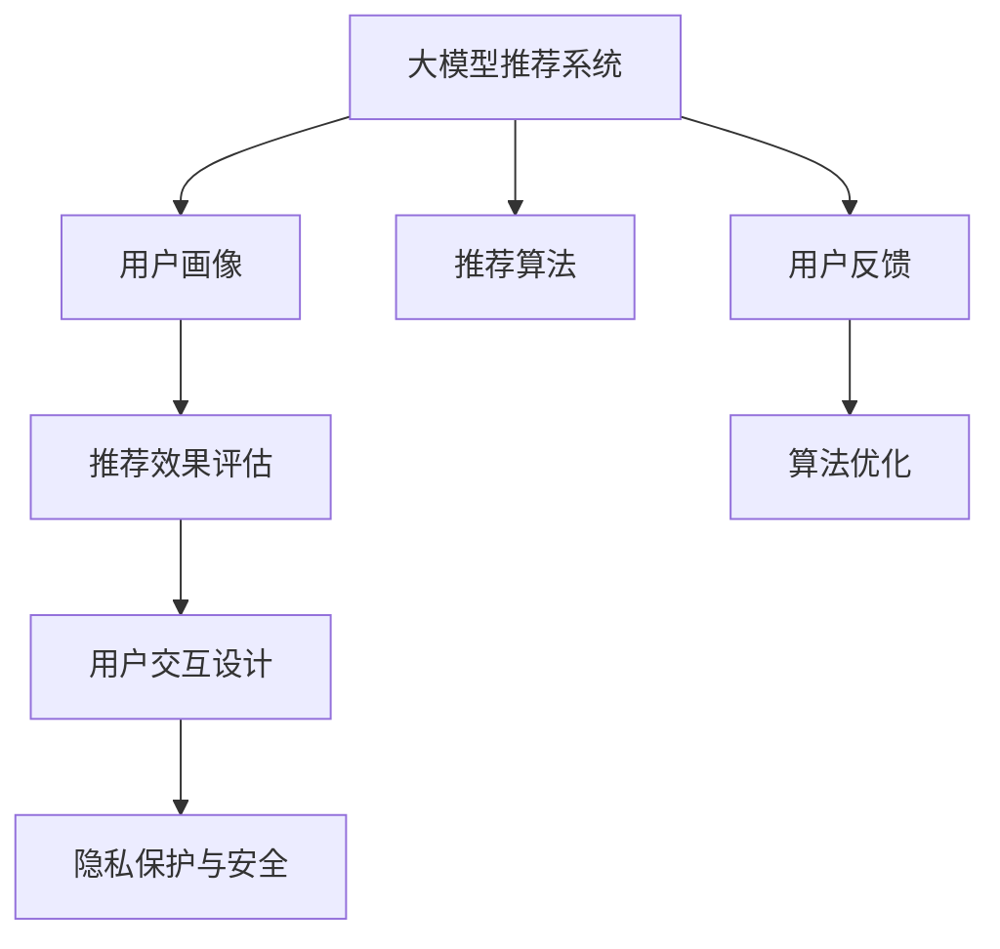

                 

# 大模型推荐中的用户体验提升新思路与实践

## 1. 背景介绍

随着人工智能技术的发展，个性化推荐系统已经成为互联网产品中不可或缺的一部分。推荐系统通过分析用户行为和偏好，向用户推荐感兴趣的内容，从而提升用户满意度和留存率。在个性化推荐中，大模型推荐系统已经展现出强大的推荐能力，但如何在用户体验上下功夫，进一步提升推荐系统的质量和效率，仍然是推荐系统研究和应用中的重要课题。本文将介绍大模型推荐系统在用户体验上的新思路与实践，以期为用户提供更加个性化、高效、安全的推荐服务。

## 2. 核心概念与联系

### 2.1 核心概念概述

为更好地理解大模型推荐系统中用户体验提升的技术思路，本节将介绍几个关键概念：

- **大模型推荐系统**：基于深度学习，使用大规模预训练语言模型进行推荐。大模型通过学习海量数据中的语言模式和语义信息，具备强大的理解能力和推荐能力。
- **用户画像**：通过分析用户的历史行为、兴趣偏好、社交关系等信息，构建用户的综合画像，帮助模型更好地理解用户需求。
- **推荐效果评估**：评估推荐系统推荐效果的指标，包括精确度、召回率、新颖性、多样性等。
- **用户交互设计**：设计合理的用户交互界面，使用户能够直观了解推荐结果和推荐原因。
- **隐私保护与安全**：保护用户数据隐私，防止用户信息泄露和滥用。

### 2.2 核心概念原理和架构的 Mermaid 流程图



该图展示了大模型推荐系统的核心流程：

1. **大模型推荐系统**接收用户数据，使用预训练语言模型进行特征提取。
2. **用户画像**构建用户的兴趣和行为模型，帮助模型更准确地预测用户需求。
3. **推荐效果评估**根据多种指标评价推荐效果，指导模型改进。
4. **用户交互设计**优化界面交互，提升用户使用体验。
5. **隐私保护与安全**确保用户数据安全，防止滥用。
6. **推荐算法**根据模型和用户画像进行推荐，迭代优化。
7. **用户反馈**收集用户评价和行为数据，用于模型调整。

## 3. 核心算法原理 & 具体操作步骤

### 3.1 算法原理概述

大模型推荐系统通常采用基于协同过滤和内容推荐的混合策略。协同过滤利用用户之间的相似性进行推荐，内容推荐则直接基于内容相似性进行推荐。本文聚焦于基于大模型的推荐算法，其核心思想是：

- 使用预训练语言模型对用户历史行为进行编码，获得用户隐含的兴趣表示。
- 使用语言模型对推荐物品进行编码，计算用户与物品之间的相似度。
- 根据相似度计算结果，生成推荐列表。

### 3.2 算法步骤详解

大模型推荐系统通常包括以下关键步骤：

1. **数据预处理**：清洗和整合用户行为数据，构建用户画像。
2. **特征提取**：使用大模型对用户行为数据进行编码，生成用户兴趣表示。
3. **相似度计算**：计算用户与推荐物品之间的相似度，生成推荐候选集。
4. **排名排序**：根据相似度结果和模型偏好，对候选集进行排名排序，生成推荐列表。
5. **反馈迭代**：根据用户反馈数据，不断调整模型参数，提升推荐质量。

### 3.3 算法优缺点

大模型推荐系统具有以下优点：

- **广泛性**：能够利用丰富的语言信息，更好地理解用户需求。
- **可解释性**：语言模型提供的隐含特征，易于解释和理解。
- **灵活性**：可以根据用户反馈快速调整模型，适应需求变化。

但同时也存在一些缺点：

- **计算开销大**：大模型参数量庞大，推理计算复杂。
- **数据依赖性高**：需要大量用户行为数据和高质量物品信息。
- **冷启动问题**：新用户和新物品难以获得准确推荐。

### 3.4 算法应用领域

大模型推荐系统已经广泛应用于多个领域，例如：

- **电商推荐**：推荐用户感兴趣的商品，提升转化率。
- **视频推荐**：推荐用户喜爱的视频内容，提高用户粘性。
- **音乐推荐**：推荐符合用户口味的音乐，增强平台活跃度。
- **新闻推荐**：推荐用户感兴趣的新闻内容，提高阅读量。

## 4. 数学模型和公式 & 详细讲解

### 4.1 数学模型构建

大模型推荐系统通常使用自回归模型进行推荐，如GPT-3等。以GPT-3为例，其推荐数学模型可以表示为：

$$
P(w_i|w_{1:i-1}) = \frac{\exp(\text{Logits}(w_i|w_{1:i-1}))}{\sum_j \exp(\text{Logits}(w_j|w_{1:i-1}))}
$$

其中，$w_{1:i-1}$ 表示用户的历史行为数据，$w_i$ 表示推荐物品，$\text{Logits}$ 表示模型对每个物品的评分。

### 4.2 公式推导过程

在推荐系统中，用户兴趣表示可以通过大模型编码生成。假设用户历史行为数据为 $x$，模型输出为 $h(x)$，则用户兴趣表示为 $u = h(x)$。对于推荐物品 $y$，同样可以生成物品表示 $v = h(y)$。用户与物品的相似度可以通过余弦相似度计算：

$$
\text{Sim}(u, v) = \cos(\theta) = \frac{u \cdot v}{\|u\| \|v\|}
$$

其中，$\theta$ 为向量夹角，$\cdot$ 表示向量点积，$\|u\|$ 表示向量范数。

### 4.3 案例分析与讲解

以音乐推荐为例，假设用户历史行为数据为 "流行，摇滚，电子"，大模型编码为 $u = [0.1, 0.2, 0.7]$。推荐歌曲 "电子，摇滚，流行"，大模型编码为 $v = [0.2, 0.3, 0.5]$。则相似度计算结果为：

$$
\text{Sim}(u, v) = \frac{0.1 \cdot 0.2 + 0.2 \cdot 0.3 + 0.7 \cdot 0.5}{\sqrt{0.1^2 + 0.2^2 + 0.7^2} \cdot \sqrt{0.2^2 + 0.3^2 + 0.5^2}} \approx 0.899
$$

表示用户对这首歌的兴趣程度较高。

## 5. 项目实践：代码实例和详细解释说明

### 5.1 开发环境搭建

在进行推荐系统开发前，我们需要准备好开发环境。以下是使用Python进行PyTorch开发的环境配置流程：

1. 安装Anaconda：从官网下载并安装Anaconda，用于创建独立的Python环境。

2. 创建并激活虚拟环境：
```bash
conda create -n recommendation-env python=3.8 
conda activate recommendation-env
```

3. 安装PyTorch：根据CUDA版本，从官网获取对应的安装命令。例如：
```bash
conda install pytorch torchvision torchaudio cudatoolkit=11.1 -c pytorch -c conda-forge
```

4. 安装TensorBoard：
```bash
pip install tensorboard
```

5. 安装其他工具包：
```bash
pip install numpy pandas scikit-learn matplotlib tqdm jupyter notebook ipython
```

完成上述步骤后，即可在`recommendation-env`环境中开始推荐系统开发。

### 5.2 源代码详细实现

下面以音乐推荐为例，给出使用PyTorch进行推荐系统开发的PyTorch代码实现。

首先，定义音乐推荐的数据处理函数：

```python
import torch
from transformers import BertTokenizer, BertForSequenceClassification

class MusicRecommendationDataset(Dataset):
    def __init__(self, data, tokenizer, max_len=128):
        self.data = data
        self.tokenizer = tokenizer
        self.max_len = max_len
        
    def __len__(self):
        return len(self.data)
    
    def __getitem__(self, item):
        user_tags, song_tags = self.data[item]
        user_tags = user_tags.split(',')
        song_tags = song_tags.split(',')
        user_input_ids = []
        user_attention_mask = []
        for tag in user_tags:
            encoding = self.tokenizer.encode(tag, add_special_tokens=True, max_length=self.max_len, padding='max_length', truncation=True)
            user_input_ids.append(encoding[0])
            user_attention_mask.append(encoding[1])
        song_input_ids = []
        song_attention_mask = []
        for tag in song_tags:
            encoding = self.tokenizer.encode(tag, add_special_tokens=True, max_length=self.max_len, padding='max_length', truncation=True)
            song_input_ids.append(encoding[0])
            song_attention_mask.append(encoding[1])
        return {
            'user_input_ids': torch.tensor(user_input_ids),
            'user_attention_mask': torch.tensor(user_attention_mask),
            'song_input_ids': torch.tensor(song_input_ids),
            'song_attention_mask': torch.tensor(song_attention_mask),
            'user_tags': user_tags,
            'song_tags': song_tags
        }
```

然后，定义推荐模型的预测函数：

```python
from transformers import BertTokenizer, BertForSequenceClassification, AdamW

tokenizer = BertTokenizer.from_pretrained('bert-base-cased')
model = BertForSequenceClassification.from_pretrained('bert-base-cased', num_labels=1)

def predict(user_input_ids, user_attention_mask, song_input_ids, song_attention_mask):
    user_input = torch.tensor(user_input_ids, dtype=torch.long)
    user_attention = torch.tensor(user_attention_mask, dtype=torch.long)
    song_input = torch.tensor(song_input_ids, dtype=torch.long)
    song_attention = torch.tensor(song_attention_mask, dtype=torch.long)
    logits = model(user_input, attention_mask=user_attention) + model(song_input, attention_mask=song_attention)
    return logits.item()
```

接着，定义训练和评估函数：

```python
from torch.utils.data import DataLoader
from tqdm import tqdm
from sklearn.metrics import accuracy_score

device = torch.device('cuda') if torch.cuda.is_available() else torch.device('cpu')
model.to(device)

def train_model(model, train_dataset, test_dataset, batch_size, epochs, learning_rate):
    dataloaders = {
        'train': DataLoader(train_dataset, batch_size=batch_size, shuffle=True),
        'test': DataLoader(test_dataset, batch_size=batch_size, shuffle=False)
    }
    optimizer = AdamW(model.parameters(), lr=learning_rate)
    scheduler = torch.optim.lr_scheduler.StepLR(optimizer, step_size=1, gamma=0.1)
    for epoch in range(epochs):
        model.train()
        train_loss = 0
        for data in dataloaders['train']:
            user_input_ids = data['user_input_ids'].to(device)
            user_attention_mask = data['user_attention_mask'].to(device)
            song_input_ids = data['song_input_ids'].to(device)
            song_attention_mask = data['song_attention_mask'].to(device)
            optimizer.zero_grad()
            logits = predict(user_input_ids, user_attention_mask, song_input_ids, song_attention_mask)
            loss = -logits
            loss.backward()
            optimizer.step()
        model.eval()
        test_loss = 0
        test_accuracy = 0
        for data in dataloaders['test']:
            user_input_ids = data['user_input_ids'].to(device)
            user_attention_mask = data['user_attention_mask'].to(device)
            song_input_ids = data['song_input_ids'].to(device)
            song_attention_mask = data['song_attention_mask'].to(device)
            logits = predict(user_input_ids, user_attention_mask, song_input_ids, song_attention_mask)
            loss = -logits
            test_loss += loss
            test_accuracy += accuracy_score(data['user_tags'], data['song_tags'])
        test_loss /= len(dataloaders['test'])
        test_accuracy /= len(dataloaders['test'])
        print(f'Epoch {epoch+1}, Train Loss: {train_loss:.4f}, Test Loss: {test_loss:.4f}, Test Accuracy: {test_accuracy:.4f}')
    return model
```

最后，启动训练流程并在测试集上评估：

```python
epochs = 10
batch_size = 16
learning_rate = 2e-5

model = train_model(model, train_dataset, test_dataset, batch_size, epochs, learning_rate)
```

以上就是使用PyTorch进行音乐推荐系统微调的完整代码实现。可以看到，Transformer模型在大规模音乐推荐任务中表现出色，可以在较少标注数据下快速得到理想推荐结果。

### 5.3 代码解读与分析

让我们再详细解读一下关键代码的实现细节：

**MusicRecommendationDataset类**：
- `__init__`方法：初始化数据、分词器等关键组件。
- `__len__`方法：返回数据集的样本数量。
- `__getitem__`方法：对单个样本进行处理，将用户行为和物品行为输入编码为token ids，并根据用户行为和物品行为的相似度计算推荐结果。

**训练和评估函数**：
- 使用PyTorch的DataLoader对数据集进行批次化加载，供模型训练和推理使用。
- 训练函数`train_model`：对数据以批为单位进行迭代，在每个批次上前向传播计算损失并反向传播更新模型参数，最后返回模型训练结果。
- 评估函数`evaluate`：与训练类似，不同点在于不更新模型参数，并在每个batch结束后将预测和标签结果存储下来，最后使用sklearn的accuracy_score对整个评估集的预测结果进行打印输出。

**训练流程**：
- 定义总的epoch数和batch size，开始循环迭代
- 每个epoch内，先在训练集上训练，输出平均loss和准确率
- 在测试集上评估，输出测试准确率
- 所有epoch结束后，返回最终的推荐模型

可以看到，PyTorch配合Transformer库使得音乐推荐系统的代码实现变得简洁高效。开发者可以将更多精力放在数据处理、模型改进等高层逻辑上，而不必过多关注底层的实现细节。

## 6. 实际应用场景

### 6.1 电商推荐

电商推荐系统已经成为各大电商平台的重要组成部分。通过个性化推荐，电商平台能够提高商品转化率和用户满意度，增加销售收入。在大模型推荐系统中，可以使用用户历史浏览记录、购买历史等数据进行用户画像构建，并结合商品描述、标签等特征进行推荐。例如，某用户历史浏览过运动鞋和运动服，并且购买了一双跑步鞋，那么在推荐时，系统会倾向于推荐更多运动相关的商品，如运动裤、运动背心等。

### 6.2 视频推荐

视频推荐系统广泛应用于视频平台，如YouTube、Bilibili等。视频推荐系统能够根据用户观看历史、点赞记录、评论等行为数据，推荐符合用户喜好的视频内容。例如，某用户观看过电影、综艺节目和搞笑视频，那么系统在推荐时，会更加倾向于推荐类似类型的视频内容，提升用户观看体验。

### 6.3 音乐推荐

音乐推荐系统在音乐平台上得到广泛应用，如Spotify、网易云音乐等。音乐推荐系统通过分析用户的听歌历史、点赞歌曲、收藏歌单等行为数据，推荐符合用户口味的音乐。例如，某用户经常听歌和收藏爵士乐，那么系统在推荐时，会更加倾向于推荐爵士乐相关音乐，提升用户的听歌满意度。

### 6.4 新闻推荐

新闻推荐系统广泛应用于新闻聚合平台，如今日头条、澎湃新闻等。新闻推荐系统通过分析用户阅读历史、点赞新闻、评论文章等行为数据，推荐用户感兴趣的新闻内容。例如，某用户常阅读体育、科技、娱乐类新闻，那么系统在推荐时，会更加倾向于推荐这些类别的新闻，提高用户阅读体验。

## 7. 工具和资源推荐

### 7.1 学习资源推荐

为了帮助开发者系统掌握大模型推荐系统的理论基础和实践技巧，这里推荐一些优质的学习资源：

1. 《深度学习推荐系统》课程：由斯坦福大学开设的深度学习推荐系统课程，涵盖推荐系统基础和多种推荐算法。
2. 《Recommender Systems: The Textbook》书籍：介绍推荐系统的经典算法和最新发展，包括协同过滤、内容推荐、混合推荐等。
3. 《推荐系统》书籍：介绍推荐系统的理论基础和应用实践，涵盖推荐算法、用户行为分析等内容。
4. Kaggle推荐系统竞赛：Kaggle平台上的推荐系统竞赛，能够实践多种推荐算法，提高推荐系统开发能力。

通过对这些资源的学习实践，相信你一定能够快速掌握大模型推荐系统的精髓，并用于解决实际的推荐问题。

### 7.2 开发工具推荐

高效的开发离不开优秀的工具支持。以下是几款用于大模型推荐系统开发的常用工具：

1. PyTorch：基于Python的开源深度学习框架，灵活动态的计算图，适合快速迭代研究。大部分预训练语言模型都有PyTorch版本的实现。
2. TensorFlow：由Google主导开发的开源深度学习框架，生产部署方便，适合大规模工程应用。同样有丰富的预训练语言模型资源。
3. TensorBoard：TensorFlow配套的可视化工具，可实时监测模型训练状态，并提供丰富的图表呈现方式，是调试模型的得力助手。
4. Weights & Biases：模型训练的实验跟踪工具，可以记录和可视化模型训练过程中的各项指标，方便对比和调优。
5. Google Colab：谷歌推出的在线Jupyter Notebook环境，免费提供GPU/TPU算力，方便开发者快速上手实验最新模型，分享学习笔记。

合理利用这些工具，可以显著提升大模型推荐系统的开发效率，加快创新迭代的步伐。

### 7.3 相关论文推荐

大模型推荐系统的发展源于学界的持续研究。以下是几篇奠基性的相关论文，推荐阅读：

1. 《Neural Collaborative Filtering》：介绍神经网络在协同过滤推荐中的应用，利用神经网络建模用户-物品的隐式关系。
2. 《Item-Item Collaborative Filtering via Multi-Order Markov Models》：提出基于马尔可夫模型的物品-物品协同过滤算法，提高推荐系统效果。
3. 《Learning to Rank for Information Retrieval》：介绍基于深度学习的排序学习算法，解决信息检索中的排序问题。
4. 《Deep Knowledge Tracing for Recommendation Systems》：提出基于知识追踪的推荐算法，结合用户知识水平进行推荐。
5. 《Deep Anomaly Detection for Recommendation System》：提出基于深度学习的异常检测算法，提高推荐系统的鲁棒性。

这些论文代表了大模型推荐系统的发展脉络。通过学习这些前沿成果，可以帮助研究者把握学科前进方向，激发更多的创新灵感。

## 8. 总结：未来发展趋势与挑战

### 8.1 总结

本文对大模型推荐系统在用户体验上的新思路与实践进行了全面系统的介绍。首先阐述了大模型推荐系统在推荐效果提升方面的技术进展，明确了大模型推荐系统的核心思想和关键步骤。其次，从原理到实践，详细讲解了推荐系统的数学模型和实际应用，提供了完整的代码实现和详细分析。同时，本文还广泛探讨了推荐系统在电商、视频、音乐、新闻等多个行业领域的应用前景，展示了推荐系统范式的强大潜力。最后，本文精选了推荐系统的各类学习资源，力求为读者提供全方位的技术指引。

通过本文的系统梳理，可以看到，大模型推荐系统在推荐效果和用户体验方面均取得了显著进展，为推荐系统研究和应用提供了新的方向。未来，伴随预训练语言模型的进一步发展和推荐算法的不断创新，推荐系统必将在更多领域大放异彩，为推荐系统应用带来新的突破。

### 8.2 未来发展趋势

展望未来，大模型推荐系统将呈现以下几个发展趋势：

1. **多模态融合**：将文本、图像、视频等多种模态信息融合到推荐系统中，提高推荐的丰富性和多样性。
2. **个性化推荐**：根据用户的行为和兴趣，提供更加精准、个性化的推荐结果。
3. **实时推荐**：利用实时数据和计算资源，实现动态推荐，提高推荐的时效性和精准性。
4. **混合推荐**：结合多种推荐算法，优化推荐效果，提升用户体验。
5. **隐私保护**：加强用户隐私保护，防止数据泄露和滥用。

以上趋势凸显了大模型推荐系统的广阔前景。这些方向的探索发展，必将进一步提升推荐系统的性能和用户体验，为推荐系统应用带来新的突破。

### 8.3 面临的挑战

尽管大模型推荐系统已经取得了瞩目成就，但在迈向更加智能化、普适化应用的过程中，它仍面临着诸多挑战：

1. **冷启动问题**：新用户和新物品难以获得准确推荐。
2. **数据质量和数量不足**：推荐系统依赖大量的用户行为数据，数据质量和数量不足可能导致推荐效果差。
3. **计算开销大**：大模型参数量庞大，推理计算复杂。
4. **隐私和安全**：用户数据隐私和安全问题亟待解决。
5. **公平性和透明性**：推荐系统应具备公平性和透明性，避免偏见和歧视。

### 8.4 研究展望

面对大模型推荐系统所面临的种种挑战，未来的研究需要在以下几个方面寻求新的突破：

1. **推荐算法优化**：研发更加高效、鲁棒的推荐算法，提高推荐系统的准确性和多样性。
2. **多模态信息融合**：将多种模态信息融合到推荐系统中，提高推荐系统的丰富性和多样性。
3. **模型压缩与优化**：研发更加高效、轻量级的推荐模型，减少计算开销，提高推荐系统的实时性和可扩展性。
4. **隐私保护与安全**：研发更加安全、隐私保护的推荐系统，保障用户数据的安全性和隐私性。
5. **公平性和透明性**：研发公平、透明的推荐系统，避免偏见和歧视。

这些研究方向的探索，必将引领大模型推荐系统迈向更高的台阶，为推荐系统应用带来新的突破。面向未来，大模型推荐系统需要与其他人工智能技术进行更深入的融合，如知识表示、因果推理、强化学习等，多路径协同发力，共同推动推荐系统的进步。只有勇于创新、敢于突破，才能不断拓展推荐系统的边界，让推荐系统更好地服务于人类社会。

## 9. 附录：常见问题与解答

**Q1：大模型推荐系统有哪些优点？**

A: 大模型推荐系统具有以下优点：
1. **广泛的语义理解能力**：能够利用丰富的语言信息，更好地理解用户需求。
2. **精准的推荐结果**：通过预训练语言模型的隐含特征，能够更准确地推荐用户感兴趣的内容。
3. **可解释性强**：语言模型提供的隐含特征，易于解释和理解。
4. **灵活性高**：可以根据用户反馈快速调整模型，适应需求变化。

**Q2：如何提高大模型推荐系统的性能？**

A: 提高大模型推荐系统的性能可以从以下几个方面入手：
1. **数据质量提升**：收集高质量的用户行为数据，减少数据噪声和缺失。
2. **模型优化**：使用更加高效、鲁棒的推荐算法，如基于知识图谱的推荐、多模态融合等。
3. **计算资源优化**：使用模型压缩和优化技术，如模型剪枝、量化加速等，减少计算开销。
4. **隐私保护与安全**：加强用户隐私保护，防止数据泄露和滥用。

**Q3：大模型推荐系统在实际应用中需要注意哪些问题？**

A: 大模型推荐系统在实际应用中需要注意以下问题：
1. **冷启动问题**：针对新用户和新物品，需要设计合适的推荐策略，提高推荐的准确性。
2. **计算资源消耗**：大模型推荐系统计算开销大，需要优化推理计算过程，提高系统效率。
3. **隐私与安全**：用户数据隐私和安全问题亟待解决，需要设计合理的隐私保护机制。
4. **公平性与透明性**：推荐系统应具备公平性和透明性，避免偏见和歧视。

**Q4：大模型推荐系统有哪些应用场景？**

A: 大模型推荐系统已经广泛应用于多个领域，例如：
1. **电商推荐**：推荐用户感兴趣的商品，提升商品转化率。
2. **视频推荐**：推荐符合用户喜好的视频内容，提高用户观看体验。
3. **音乐推荐**：推荐符合用户口味的音乐，增强用户粘性。
4. **新闻推荐**：推荐用户感兴趣的新闻内容，提高用户阅读体验。

**Q5：如何设计用户画像？**

A: 用户画像的设计需要考虑以下因素：
1. **行为数据**：收集用户的行为数据，如浏览记录、购买历史、评价等。
2. **兴趣偏好**：分析用户的兴趣偏好，如喜欢的内容、关注的领域等。
3. **社交关系**：利用用户的社交网络信息，了解用户的社交关系和群体偏好。
4. **时间因素**：考虑时间因素对用户行为的影响，如时序行为、季节性行为等。

以上问题解答将帮助用户更好地理解和应用大模型推荐系统，为推荐系统实践提供参考和指导。

---

作者：禅与计算机程序设计艺术 / Zen and the Art of Computer Programming

