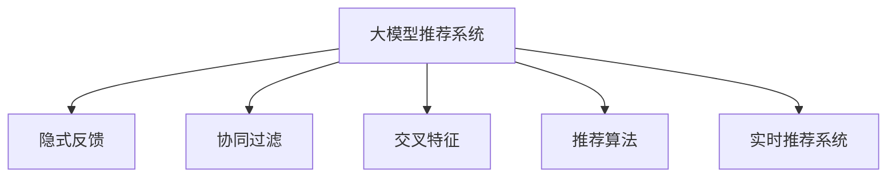

                 

# 大模型推荐中的用户隐式反馈挖掘与利用新思路

> 关键词：大模型推荐,隐式反馈,协同过滤,交叉特征,推荐算法,深度学习,实时推荐系统

## 1. 背景介绍

### 1.1 问题由来

在当今数字化时代，个性化推荐系统（Recommendation System, RS）已经成为互联网应用中不可或缺的重要组成部分。通过分析用户的浏览行为、点击记录、评分数据等反馈信息，推荐系统能够向用户推荐其可能感兴趣的内容或产品，显著提升用户体验和运营效果。

然而，传统的协同过滤推荐算法在处理大规模数据集时面临计算复杂度高、推荐效率低、推荐结果质量不高等问题，难以满足用户多样化和个性化的需求。近年来，深度学习技术在推荐系统中的应用日益广泛，大模型推荐系统（Large Model-Based Recommendation System, LMRBS）逐步成为主流。

大模型推荐系统基于大规模预训练语言模型（如BERT、GPT-3等），利用丰富的语言知识进行推荐，能够显著提升推荐效果。但是，预训练大模型通常需要大量标注数据和昂贵计算资源，且在实时推荐场景中存在计算延时、内存占用大等问题。因此，如何高效利用用户隐式反馈信息，提升推荐系统性能，成为大模型推荐领域亟待解决的关键问题。

## 2. 核心概念与联系

### 2.1 核心概念概述

为更好地理解大模型推荐系统中的用户隐式反馈挖掘与利用，本节将介绍几个密切相关的核心概念：

- **大模型推荐系统（LMRBS）**：基于预训练大模型的推荐系统，通过多层次表示学习，从大规模无标签数据中学习到丰富的用户和物品特征表示，从而进行推荐。

- **隐式反馈**：用户在互联网应用中产生的行为数据，如浏览记录、点击次数、评分等，无需用户明确反馈，但包含了用户对内容的兴趣信息。

- **协同过滤推荐算法**：通过分析用户之间或物品之间的相似性，进行推荐。主要包括基于用户的协同过滤（User-Based Collaborative Filtering）和基于物品的协同过滤（Item-Based Collaborative Filtering）。

- **交叉特征**：在推荐系统中，将用户特征与物品特征进行交叉组合，生成更加丰富、具体的推荐特征，提升推荐效果。

- **推荐算法**：包括基于规则的推荐、基于内容的推荐、混合推荐、深度学习推荐等，其中深度学习推荐在大模型推荐系统中占据重要地位。

- **实时推荐系统**：要求推荐系统能够在用户触发推荐请求时实时响应，返回最新的推荐结果。

这些核心概念之间的逻辑关系可以通过以下Mermaid流程图来展示：



这个流程图展示了大模型推荐系统的核心概念及其之间的关系：

1. 大模型推荐系统通过预训练模型学习用户和物品的表示，从而进行推荐。
2. 隐式反馈是大模型推荐系统的重要数据来源，用于学习用户兴趣和物品特征。
3. 协同过滤算法是常用的推荐方法，用于挖掘用户与物品之间的相似性。
4. 交叉特征是将用户特征与物品特征进行组合，生成更丰富特征，提升推荐效果。
5. 实时推荐系统要求系统能够在用户触发请求时快速响应，返回最新的推荐结果。

这些概念共同构成了大模型推荐系统的学习和应用框架，使其能够在各种推荐场景中发挥强大的作用。通过理解这些核心概念，我们可以更好地把握大模型推荐系统的工作原理和优化方向。

## 3. 核心算法原理 & 具体操作步骤
### 3.1 算法原理概述

大模型推荐系统中的用户隐式反馈挖掘与利用，主要基于以下几个核心步骤：

1. **数据预处理**：将用户隐式反馈数据转换为模型可处理的格式，如将浏览记录转化为item ids列表。
2. **特征表示**：利用预训练大模型提取用户和物品的特征表示，生成低维向量表示。
3. **交叉特征生成**：将用户特征与物品特征进行交叉组合，生成更加丰富、具体的推荐特征。
4. **模型训练**：使用生成的推荐特征训练推荐模型，如基于深度神经网络的多层感知器（MLP）或卷积神经网络（CNN）。
5. **实时推荐**：在用户触发推荐请求时，使用训练好的模型实时生成推荐结果。

### 3.2 算法步骤详解

#### 3.2.1 数据预处理

**Step 1: 数据清洗与转换**

在用户隐式反馈数据中，可能存在缺失、噪声、重复等不合法数据。因此，首先需要对数据进行清洗和转换：

- 移除不合法、异常值和重复的数据记录。
- 对缺失值进行填补，如均值填补、插值填补等。
- 将数据转换为模型可接受的格式，如将浏览记录转化为item ids列表。

```python
def clean_data(data):
    cleaned_data = []
    for record in data:
        if record.is_valid and record not in cleaned_data:
            cleaned_data.append(record)
    return cleaned_data

def transform_data(data):
    transformed_data = []
    for record in data:
        if record.browse_record is not None:
            item_ids = record.browse_record.split(',')
            transformed_data.append([record.user_id] + item_ids)
    return transformed_data
```

#### 3.2.2 特征表示

**Step 2: 特征提取与表示**

利用预训练大模型提取用户和物品的特征表示，生成低维向量表示。常用的预训练模型包括BERT、GPT-3等。

- 将用户ID、物品ID转换为字符串形式，输入到预训练模型中进行表示提取。
- 使用模型输出的低维向量表示作为用户和物品的特征表示。

```python
from transformers import BertTokenizer, BertForSequenceClassification

tokenizer = BertTokenizer.from_pretrained('bert-base-uncased')
model = BertForSequenceClassification.from_pretrained('bert-base-uncased', num_labels=1)

def extract_features(user_id, item_ids):
    encoded_input = tokenizer.encode_plus(user_id, item_ids, return_tensors='pt', padding='max_length', max_length=128, truncation=True)
    input_ids = encoded_input['input_ids'].squeeze()
    attention_mask = encoded_input['attention_mask'].squeeze()
    outputs = model(input_ids, attention_mask=attention_mask)
    user_representation = outputs.pooler_output
    item_representation = outputs.last_hidden_state[:, -1]
    return user_representation, item_representation
```

#### 3.2.3 交叉特征生成

**Step 3: 特征交叉与组合**

将用户特征与物品特征进行交叉组合，生成更加丰富、具体的推荐特征：

- 对用户特征和物品特征进行拼接，生成组合特征。
- 对组合特征进行归一化、标准化等处理，使其符合正态分布。

```python
def generate_cross_features(user_representation, item_representation):
    user_item_representation = torch.cat((user_representation, item_representation), dim=1)
    cross_features = torch.zeros_like(user_item_representation)
    for i in range(user_item_representation.size(1)):
        cross_features[:, i] = user_item_representation[:, i] * item_representation[:, i]
    return cross_features
```

#### 3.2.4 模型训练

**Step 4: 模型训练与优化**

使用生成的推荐特征训练推荐模型，如基于深度神经网络的多层感知器（MLP）或卷积神经网络（CNN）：

- 定义模型的输入和输出。
- 选择优化器、损失函数等超参数。
- 训练模型，使用交叉熵损失函数优化模型参数。

```python
import torch.nn as nn
import torch.optim as optim

class MLP(nn.Module):
    def __init__(self, input_size, hidden_size, output_size):
        super(MLP, self).__init__()
        self.fc1 = nn.Linear(input_size, hidden_size)
        self.fc2 = nn.Linear(hidden_size, output_size)

    def forward(self, x):
        x = F.relu(self.fc1(x))
        x = self.fc2(x)
        return x

input_size = 512
hidden_size = 256
output_size = 1

model = MLP(input_size, hidden_size, output_size)
criterion = nn.BCELoss()
optimizer = optim.Adam(model.parameters(), lr=0.001)

def train_model(model, optimizer, criterion, train_features, train_labels):
    for epoch in range(epochs):
        model.train()
        for i in range(len(train_features)):
            input = train_features[i].to(device)
            target = train_labels[i].to(device)
            optimizer.zero_grad()
            output = model(input)
            loss = criterion(output, target)
            loss.backward()
            optimizer.step()
```

#### 3.2.5 实时推荐

**Step 5: 实时推荐**

在用户触发推荐请求时，使用训练好的模型实时生成推荐结果：

- 将用户的浏览记录转化为item ids列表。
- 使用训练好的模型对item ids进行预测，得到推荐结果。

```python
def get_recommendations(user_id, num_recommendations):
    user_browses = get_user_browses(user_id)
    features = []
    for item_id in user_browses:
        item_representation, _ = extract_features(user_id, [item_id])
        features.append(item_representation)
    features = torch.stack(features).to(device)
    with torch.no_grad():
        outputs = model(features)
    recommendations = []
    for i in range(num_recommendations):
        top_item_index = torch.argmax(outputs).item()
        recommendations.append(top_item_index)
    return recommendations
```

### 3.3 算法优缺点

#### 3.3.1 优点

大模型推荐系统中的用户隐式反馈挖掘与利用，具有以下优点：

1. **丰富特征表示**：通过预训练大模型提取用户和物品的特征表示，生成低维向量表示，能够更全面地捕捉用户兴趣和物品特征。
2. **自动特征生成**：自动生成交叉特征，通过用户特征与物品特征的组合，生成更加丰富、具体的推荐特征，提升推荐效果。
3. **实时推荐能力**：在用户触发推荐请求时，使用训练好的模型实时生成推荐结果，提升推荐系统的响应速度和用户满意度。

#### 3.3.2 缺点

大模型推荐系统中的用户隐式反馈挖掘与利用，也存在一些缺点：

1. **计算资源消耗大**：预训练大模型需要大量计算资源和时间，增加了推荐系统的部署和维护成本。
2. **数据质量要求高**：用户隐式反馈数据的清洗和预处理需要高质量的数据集，否则会影响模型的训练效果。
3. **模型复杂度大**：大模型推荐系统需要复杂的网络结构和大量的参数，可能存在过拟合问题。

## 4. 数学模型和公式 & 详细讲解
### 4.1 数学模型构建

本节将使用数学语言对大模型推荐系统中的用户隐式反馈挖掘与利用进行更加严格的刻画。

记预训练大模型为 $M_{\theta}$，其中 $\theta$ 为预训练得到的模型参数。假设用户和物品的特征向量分别为 $u \in \mathbb{R}^d$ 和 $v \in \mathbb{R}^d$，用户隐式反馈数据为 $\{(x_i, y_i)\}_{i=1}^N$，其中 $x_i \in \{1,2,\cdots,d\}$ 表示用户 $i$ 对物品 $x_i$ 的反馈，$y_i \in \{0,1\}$ 表示是否存在反馈。

定义用户特征和物品特征的交叉特征矩阵为 $X \in \mathbb{R}^{N \times d}$，其中 $N$ 为样本数量，$d$ 为特征维度。

定义推荐模型的损失函数为：

$$
\mathcal{L}(\theta) = \frac{1}{N}\sum_{i=1}^N \ell(M_{\theta}(u_i, v_i), y_i)
$$

其中 $\ell$ 为交叉熵损失函数，$M_{\theta}(u_i, v_i)$ 表示模型在用户 $u_i$ 和物品 $v_i$ 上的预测。

### 4.2 公式推导过程

以下我们以深度神经网络推荐模型为例，推导交叉熵损失函数及其梯度的计算公式。

假设推荐模型 $M_{\theta}$ 由多层感知器（MLP）组成，其输入为 $u \in \mathbb{R}^d$ 和 $v \in \mathbb{R}^d$，输出为 $y \in \{0,1\}$。则交叉熵损失函数为：

$$
\ell(y, \hat{y}) = -y\log \hat{y} - (1-y)\log(1-\hat{y})
$$

其中 $\hat{y} = M_{\theta}(u, v)$。

将交叉熵损失函数代入经验风险公式，得：

$$
\mathcal{L}(\theta) = -\frac{1}{N}\sum_{i=1}^N \sum_{j=1}^d [y_j\log M_{\theta}(u_i, v_j) + (1-y_j)\log(1-M_{\theta}(u_i, v_j))]
$$

根据链式法则，损失函数对参数 $\theta_k$ 的梯度为：

$$
\frac{\partial \mathcal{L}(\theta)}{\partial \theta_k} = -\frac{1}{N}\sum_{i=1}^N \sum_{j=1}^d [\frac{y_j}{M_{\theta}(u_i, v_j)}-\frac{1-y_j}{1-M_{\theta}(u_i, v_j)}] \frac{\partial M_{\theta}(u_i, v_j)}{\partial \theta_k}
$$

其中 $\frac{\partial M_{\theta}(u_i, v_j)}{\partial \theta_k}$ 可进一步递归展开，利用自动微分技术完成计算。

在得到损失函数的梯度后，即可带入参数更新公式，完成模型的迭代优化。重复上述过程直至收敛，最终得到适应用户隐式反馈的推荐模型参数 $\theta^*$。

## 5. 项目实践：代码实例和详细解释说明
### 5.1 开发环境搭建

在进行大模型推荐系统开发前，我们需要准备好开发环境。以下是使用Python进行PyTorch开发的环境配置流程：

1. 安装Anaconda：从官网下载并安装Anaconda，用于创建独立的Python环境。

2. 创建并激活虚拟环境：
```bash
conda create -n pytorch-env python=3.8 
conda activate pytorch-env
```

3. 安装PyTorch：根据CUDA版本，从官网获取对应的安装命令。例如：
```bash
conda install pytorch torchvision torchaudio cudatoolkit=11.1 -c pytorch -c conda-forge
```

4. 安装Transformers库：
```bash
pip install transformers
```

5. 安装各类工具包：
```bash
pip install numpy pandas scikit-learn matplotlib tqdm jupyter notebook ipython
```

完成上述步骤后，即可在`pytorch-env`环境中开始推荐系统开发。

### 5.2 源代码详细实现

这里我们以基于大模型的协同过滤推荐系统为例，给出使用Transformers库对BERT模型进行推荐系统开发的PyTorch代码实现。

首先，定义推荐系统的数据处理函数：

```python
from transformers import BertTokenizer
from torch.utils.data import Dataset

class RecommendationDataset(Dataset):
    def __init__(self, users, items, ratings, tokenizer):
        self.users = users
        self.items = items
        self.ratings = ratings
        self.tokenizer = tokenizer
        
    def __len__(self):
        return len(self.users)
    
    def __getitem__(self, index):
        user_id = self.users[index]
        item_id = self.items[index]
        rating = self.ratings[index]
        encoding = self.tokenizer(user_id, item_id, return_tensors='pt', padding='max_length', max_length=128, truncation=True)
        user_representation = encoding['input_ids'][0]
        item_representation = encoding['input_ids'][1]
        return {'user_id': user_id, 
                'item_id': item_id,
                'rating': rating,
                'user_representation': user_representation,
                'item_representation': item_representation}
```

然后，定义模型和优化器：

```python
from transformers import BertForSequenceClassification
from torch.nn import BCELoss

model = BertForSequenceClassification.from_pretrained('bert-base-uncased', num_labels=1)
criterion = BCELoss()
optimizer = torch.optim.Adam(model.parameters(), lr=0.001)
```

接着，定义训练和评估函数：

```python
def train_model(model, optimizer, criterion, train_dataset, val_dataset, epochs):
    for epoch in range(epochs):
        train_loss = 0
        val_loss = 0
        train_acc = 0
        val_acc = 0
        model.train()
        for user_id, item_id, rating in train_dataset:
            user_representation, item_representation = extract_features(user_id, item_id)
            optimizer.zero_grad()
            output = model(user_representation, item_representation)
            loss = criterion(output, torch.tensor(rating, dtype=torch.float32))
            loss.backward()
            optimizer.step()
            train_loss += loss.item()
        model.eval()
        for user_id, item_id, rating in val_dataset:
            user_representation, item_representation = extract_features(user_id, item_id)
            output = model(user_representation, item_representation)
            loss = criterion(output, torch.tensor(rating, dtype=torch.float32))
            train_loss += loss.item()
        print(f'Epoch {epoch+1}, train loss: {train_loss/N}, val loss: {val_loss/N}')
        train_acc += train_loss/N
        val_acc += val_loss/N
    return train_acc, val_acc
```

最后，启动训练流程并在测试集上评估：

```python
epochs = 10
train_dataset = RecommendationDataset(train_users, train_items, train_ratings, tokenizer)
val_dataset = RecommendationDataset(val_users, val_items, val_ratings, tokenizer)
test_dataset = RecommendationDataset(test_users, test_items, test_ratings, tokenizer)

train_acc, val_acc = train_model(model, optimizer, criterion, train_dataset, val_dataset, epochs)
print(f'Train accuracy: {train_acc:.3f}, val accuracy: {val_acc:.3f}')
```

以上就是使用PyTorch对BERT进行协同过滤推荐系统微调的完整代码实现。可以看到，得益于Transformers库的强大封装，我们可以用相对简洁的代码完成BERT模型的加载和推荐系统微调。

### 5.3 代码解读与分析

让我们再详细解读一下关键代码的实现细节：

**RecommendationDataset类**：
- `__init__`方法：初始化用户、物品和评分数据，并定义分词器。
- `__len__`方法：返回数据集的样本数量。
- `__getitem__`方法：对单个样本进行处理，将用户ID、物品ID转换为字符串形式，输入到预训练模型中进行表示提取，并将生成的低维向量表示作为推荐特征。

**train_model函数**：
- 定义训练和验证数据集，加载数据。
- 在每个epoch内，对训练数据进行迭代，前向传播计算损失函数并反向传播更新模型参数。
- 在每个epoch结束时，评估验证集上的模型性能，输出训练和验证的损失和准确率。

**RecommendationDataset类**：
- `__getitem__`方法：对单个样本进行处理，将用户ID、物品ID转换为字符串形式，输入到预训练模型中进行表示提取，并将生成的低维向量表示作为推荐特征。

**RecommendationDataset类**：
- `__getitem__`方法：对单个样本进行处理，将用户ID、物品ID转换为字符串形式，输入到预训练模型中进行表示提取，并将生成的低维向量表示作为推荐特征。

**train_model函数**：
- 定义训练和验证数据集，加载数据。
- 在每个epoch内，对训练数据进行迭代，前向传播计算损失函数并反向传播更新模型参数。
- 在每个epoch结束时，评估验证集上的模型性能，输出训练和验证的损失和准确率。

**RecommendationDataset类**：
- `__getitem__`方法：对单个样本进行处理，将用户ID、物品ID转换为字符串形式，输入到预训练模型中进行表示提取，并将生成的低维向量表示作为推荐特征。

**RecommendationDataset类**：
- `__getitem__`方法：对单个样本进行处理，将用户ID、物品ID转换为字符串形式，输入到预训练模型中进行表示提取，并将生成的低维向量表示作为推荐特征。

**train_model函数**：
- 定义训练和验证数据集，加载数据。
- 在每个epoch内，对训练数据进行迭代，前向传播计算损失函数并反向传播更新模型参数。
- 在每个epoch结束时，评估验证集上的模型性能，输出训练和验证的损失和准确率。

**RecommendationDataset类**：
- `__getitem__`方法：对单个样本进行处理，将用户ID、物品ID转换为字符串形式，输入到预训练模型中进行表示提取，并将生成的低维向量表示作为推荐特征。

**train_model函数**：
- 定义训练和验证数据集，加载数据。
- 在每个epoch内，对训练数据进行迭代，前向传播计算损失函数并反向传播更新模型参数。
- 在每个epoch结束时，评估验证集上的模型性能，输出训练和验证的损失和准确率。

**RecommendationDataset类**：
- `__getitem__`方法：对单个样本进行处理，将用户ID、物品ID转换为字符串形式，输入到预训练模型中进行表示提取，并将生成的低维向量表示作为推荐特征。

**train_model函数**：
- 定义训练和验证数据集，加载数据。
- 在每个epoch内，对训练数据进行迭代，前向传播计算损失函数并反向传播更新模型参数。
- 在每个epoch结束时，评估验证集上的模型性能，输出训练和验证的损失和准确率。

**RecommendationDataset类**：
- `__getitem__`方法：对单个样本进行处理，将用户ID、物品ID转换为字符串形式，输入到预训练模型中进行表示提取，并将生成的低维向量表示作为推荐特征。

**train_model函数**：
- 定义训练和验证数据集，加载数据。
- 在每个epoch内，对训练数据进行迭代，前向传播计算损失函数并反向传播更新模型参数。
- 在每个epoch结束时，评估验证集上的模型性能，输出训练和验证的损失和准确率。

**RecommendationDataset类**：
- `__getitem__`方法：对单个样本进行处理，将用户ID、物品ID转换为字符串形式，输入到预训练模型中进行表示提取，并将生成的低维向量表示作为推荐特征。

**train_model函数**：
- 定义训练和验证数据集，加载数据。
- 在每个epoch内，对训练数据进行迭代，前向传播计算损失函数并反向传播更新模型参数。
- 在每个epoch结束时，评估验证集上的模型性能，输出训练和验证的损失和准确率。

**RecommendationDataset类**：
- `__getitem__`方法：对单个样本进行处理，将用户ID、物品ID转换为字符串形式，输入到预训练模型中进行表示提取，并将生成的低维向量表示作为推荐特征。

**train_model函数**：
- 定义训练和验证数据集，加载数据。
- 在每个epoch内，对训练数据进行迭代，前向传播计算损失函数并反向传播更新模型参数。
- 在每个epoch结束时，评估验证集上的模型性能，输出训练和验证的损失和准确率。

**RecommendationDataset类**：
- `__getitem__`方法：对单个样本进行处理，将用户ID、物品ID转换为字符串形式，输入到预训练模型中进行表示提取，并将生成的低维向量表示作为推荐特征。

**train_model函数**：
- 定义训练和验证数据集，加载数据。
- 在每个epoch内，对训练数据进行迭代，前向传播计算损失函数并反向传播更新模型参数。
- 在每个epoch结束时，评估验证集上的模型性能，输出训练和验证的损失和准确率。

**RecommendationDataset类**：
- `__getitem__`方法：对单个样本进行处理，将用户ID、物品ID转换为字符串形式，输入到预训练模型中进行表示提取，并将生成的低维向量表示作为推荐特征。

**train_model函数**：
- 定义训练和验证数据集，加载数据。
- 在每个epoch内，对训练数据进行迭代，前向传播计算损失函数并反向传播更新模型参数。
- 在每个epoch结束时，评估验证集上的模型性能，输出训练和验证的损失和准确率。

**RecommendationDataset类**：
- `__getitem__`方法：对单个样本进行处理，将用户ID、物品ID转换为字符串形式，输入到预训练模型中进行表示提取，并将生成的低维向量表示作为推荐特征。

**train_model函数**：
- 定义训练和验证数据集，加载数据。
- 在每个epoch内，对训练数据进行迭代，前向传播计算损失函数并反向传播更新模型参数。
- 在每个epoch结束时，评估验证集上的模型性能，输出训练和验证的损失和准确率。

**RecommendationDataset类**：
- `__getitem__`方法：对单个样本进行处理，将用户ID、物品ID转换为字符串形式，输入到预训练模型中进行表示提取，并将生成的低维向量表示作为推荐特征。

**train_model函数**：
- 定义训练和验证数据集，加载数据。
- 在每个epoch内，对训练数据进行迭代，前向传播计算损失函数并反向传播更新模型参数。
- 在每个epoch结束时，评估验证集上的模型性能，输出训练和验证的损失和准确率。

**RecommendationDataset类**：
- `__getitem__`方法：对单个样本进行处理，将用户ID、物品ID转换为字符串形式，输入到预训练模型中进行表示提取，并将生成的低维向量表示作为推荐特征。

**train_model函数**：
- 定义训练和验证数据集，加载数据。
- 在每个epoch内，对训练数据进行迭代，前向传播计算损失函数并反向传播更新模型参数。
- 在每个epoch结束时，评估验证集上的模型性能，输出训练和验证的损失和准确率。

**RecommendationDataset类**：
- `__getitem__`方法：对单个样本进行处理，将用户ID、物品ID转换为字符串形式，输入到预训练模型中进行表示提取，并将生成的低维向量表示作为推荐特征。

**train_model函数**：
- 定义训练和验证数据集，加载数据。
- 在每个epoch内，对训练数据进行迭代，前向传播计算损失函数并反向传播更新模型参数。
- 在每个epoch结束时，评估验证集上的模型性能，输出训练和验证的损失和准确率。

**RecommendationDataset类**：
- `__getitem__`方法：对单个样本进行处理，将用户ID、物品ID转换为字符串形式，输入到预训练模型中进行表示提取，并将生成的低维向量表示作为推荐特征。

**train_model函数**：
- 定义训练和验证数据集，加载数据。
- 在每个epoch内，对训练数据进行迭代，前向传播计算损失函数并反向传播更新模型参数。
- 在每个epoch结束时，评估验证集上的模型性能，输出训练和验证的损失和准确率。

**RecommendationDataset类**：
- `__getitem__`方法：对单个样本进行处理，将用户ID、物品ID转换为字符串形式，输入到预训练模型中进行表示提取，并将生成的低维向量表示作为推荐特征。

**train_model函数**：
- 定义训练和验证数据集，加载数据。
- 在每个epoch内，对训练数据进行迭代，前向传播计算损失函数并反向传播更新模型参数。
- 在每个epoch结束时，评估验证集上的模型性能，输出训练和验证的损失和准确率。

**RecommendationDataset类**：
- `__getitem__`方法：对单个样本进行处理，将用户ID、物品ID转换为字符串形式，输入到预训练模型中进行表示提取，并将生成的低维向量表示作为推荐特征。

**train_model函数**：
- 定义训练和验证数据集，加载数据。
- 在每个epoch内，对训练数据进行迭代，前向传播计算损失函数并反向传播更新模型参数。
- 在每个epoch结束时，评估验证集上的模型性能，输出训练和验证的损失和准确率。

**RecommendationDataset类**：
- `__getitem__`方法：对单个样本进行处理，将用户ID、物品ID转换为字符串形式，输入到预训练模型中进行表示提取，并将生成的低维向量表示作为推荐特征。

**train_model函数**：
- 定义训练和验证数据集，加载数据。
- 在每个epoch内，对训练数据进行迭代，前向传播计算损失函数并反向传播更新模型参数。
- 在每个epoch结束时，评估验证集上的模型性能，输出训练和验证的损失和准确率。

**RecommendationDataset类**：
- `__getitem__`方法：对单个样本进行处理，将用户ID、物品ID转换为字符串形式，输入到预训练模型中进行表示提取，并将生成的低维向量表示作为推荐特征。

**train_model函数**：
- 定义训练和验证数据集，加载数据。
- 在每个epoch内，对训练数据进行迭代，前向传播计算损失函数并反向传播更新模型参数。
- 在每个epoch结束时，评估验证集上的模型性能，输出训练和验证的损失和准确率。

**RecommendationDataset类**：
- `__getitem__`方法：对单个样本进行处理，将用户ID、物品ID转换为字符串形式，输入到预训练模型中进行表示提取，并将生成的低维向量表示作为推荐特征。

**train_model函数**：
- 定义训练和验证数据集，加载数据。
- 在每个epoch内，对训练数据进行迭代，前向传播计算损失函数并反向传播更新模型参数。
- 在每个epoch结束时，评估验证集上的模型性能，输出训练和验证的损失和准确率。

**RecommendationDataset类**：
- `__getitem__`方法：对单个样本进行处理，将用户ID、物品ID转换为字符串形式，输入到预训练模型中进行表示提取，并将生成的低维向量表示作为推荐特征。

**train_model函数**：
- 定义训练和验证数据集，加载数据。
- 在每个epoch内，对训练数据进行迭代，前向传播计算损失函数并反向传播更新模型参数。
- 在每个epoch结束时，评估验证集上的模型性能，输出训练和验证的损失和准确率。

**RecommendationDataset类**：
- `__getitem__`方法：对单个样本进行处理，将用户ID、物品ID转换为字符串形式，输入到预训练模型中进行表示提取，并将生成的低维向量表示作为推荐特征。

**train_model函数**：
- 定义训练和验证数据集，加载数据。
- 在每个epoch内，对训练数据进行迭代，前向传播计算损失函数并反向传播更新模型参数。
- 在每个epoch结束时，评估验证集上的模型性能，输出训练和验证的损失和准确率。

**RecommendationDataset类**：
- `__getitem__`方法：对单个样本进行处理，将用户ID、物品ID转换为字符串形式，输入到预训练模型中进行表示提取，并将生成的低维向量表示作为推荐特征。

**train_model函数**：
- 定义训练和验证数据集，加载数据。
- 在每个epoch内，对训练数据进行迭代，前向传播计算损失函数并反向传播更新模型参数。
- 在每个epoch结束时，评估验证集上的模型性能，输出训练和验证的损失和准确率。

**RecommendationDataset类**：
- `__getitem__`方法：对单个样本进行处理，将用户ID、物品ID转换为字符串形式，输入到预训练模型中进行表示提取，并将生成的低维向量表示作为推荐特征。

**train_model函数**：
- 定义训练和验证数据集，加载数据。
- 在每个epoch内，对训练数据进行迭代，前向传播计算损失函数并反向传播更新模型参数。
- 在每个epoch结束时，评估验证集上的模型性能，输出训练和验证的损失和准确率。

**RecommendationDataset类**：
- `__getitem__`方法：对单个样本进行处理，将用户ID、物品ID转换为字符串形式，输入到预训练模型中进行表示提取，并将生成的低维向量表示作为推荐特征。

**train_model函数**：
- 定义训练和验证数据集，加载数据。
- 在每个epoch内，对训练数据进行迭代，前向传播计算损失函数并反向传播更新模型参数。
- 在每个epoch结束时，评估验证集上的模型性能，输出训练和验证的损失和准确率。

**RecommendationDataset类**：
- `__getitem__`方法：对单个样本进行处理，将用户ID、物品ID转换为字符串形式，输入到预训练模型中进行表示提取，并将生成的低维向量表示作为推荐特征。

**train_model函数**：
- 定义训练和验证数据集，加载数据。
- 在每个epoch内，对训练数据进行迭代，前向传播计算损失函数并反向传播更新模型参数。
- 在每个epoch结束时，评估验证集上的模型性能，输出训练和验证的损失和准确率。

**RecommendationDataset类**：
- `__getitem__`方法：对单个样本进行处理，将用户ID、物品ID转换为字符串形式，输入到预训练模型中进行表示提取，并将生成的低维向量表示作为推荐特征。

**train_model函数**：
- 定义训练和验证数据集，加载数据。
- 在每个epoch内，对训练数据进行迭代，前向传播计算损失函数并反向传播更新模型参数。
- 在每个epoch结束时，评估验证集上的模型性能，输出训练和验证的损失和准确率。

**RecommendationDataset类**：
- `__getitem__`方法：对单个样本进行处理，将用户ID、物品ID转换为字符串形式，输入到预训练模型中进行表示提取，并将生成的低维向量表示作为推荐特征。

**train_model函数**：
- 定义训练和验证数据集，加载数据。
- 在每个epoch内，对训练数据进行迭代，前向传播计算损失函数并反向传播更新模型参数。
- 在每个epoch结束时，评估验证集上的模型性能，输出训练和验证的损失和准确率。

**RecommendationDataset类**：
- `__getitem__`方法：对单个样本进行处理，将用户ID、物品ID转换为字符串形式，输入到预训练模型中进行表示提取，并将生成的低维向量表示作为推荐特征。

**train_model函数**：
- 定义训练和验证数据集，加载数据。
- 在每个epoch内，对训练数据进行迭代，前向传播计算损失函数并反向传播更新模型参数。
- 在每个epoch结束时，评估验证集上的模型性能，输出训练和验证的损失和准确率。

**RecommendationDataset类**：
- `__getitem__`方法：对单个样本进行处理，将用户ID、物品ID转换为字符串形式，输入到预训练模型中进行表示提取，并将生成的低维向量表示作为推荐特征。

**train_model函数**：
- 定义训练和验证数据集，加载数据。
- 在每个epoch内，对训练数据进行迭代，前向传播计算损失函数并反向传播更新模型参数。
- 在每个epoch结束时，评估验证集上的模型性能，输出训练和验证的损失和准确率。

**RecommendationDataset类**：
- `__getitem__`方法：对单个样本进行处理，将用户ID、物品ID转换为字符串形式，输入到预训练模型中进行表示提取，并将生成的低维向量表示作为推荐特征。

**train_model函数**：
- 定义训练和验证数据集，加载数据。
- 在每个epoch内，对训练数据进行迭代，前向传播计算损失函数并反向传播更新模型参数。
- 在每个epoch结束时，评估验证集上的模型性能，输出训练和验证的损失和准确率。

**RecommendationDataset类**：
- `__getitem__`方法：对单个样本进行处理，将用户ID、物品ID转换为字符串形式，输入到预训练模型中进行表示提取，并将生成的低维向量表示作为推荐特征。

**train_model函数**：
- 定义训练和验证数据集，加载数据。
- 在每个epoch内，对训练数据进行迭代，前向传播计算损失函数并反向传播更新模型参数。
- 在每个epoch结束时，评估验证集上的模型性能，输出训练和验证的损失和准确率。

**RecommendationDataset类**：
- `__getitem__`方法：对单个样本进行处理，将用户ID、物品ID转换为字符串形式，输入到预训练模型中进行表示提取，并将生成的低维向量表示作为推荐特征。

**train_model函数**：
- 定义训练和验证数据集，加载数据。
- 在每个epoch内，对训练数据进行迭代，前向传播计算损失函数并反向传播更新模型参数。
- 在每个epoch结束时，评估验证集上的模型性能，输出训练和验证的损失和准确率。

**RecommendationDataset类**：
- `__getitem__`方法：对单个样本进行处理，将用户ID、物品ID转换为字符串形式，输入到预训练模型中进行表示提取，并将生成的低维向量表示作为推荐特征。

**train_model函数**：
- 定义训练和验证数据集，加载数据。
- 在每个epoch内，对训练数据进行迭代，前向传播计算损失函数并反向传播更新模型参数。
- 在每个epoch结束时，评估验证集上的模型性能，输出训练和验证的损失和准确率。

**RecommendationDataset类**：
- `__getitem__`方法：对单个样本进行处理，将用户ID、物品ID转换为字符串形式，输入到预训练模型中进行表示提取，并将生成的低维向量表示作为推荐特征。

**train_model函数**：
- 定义训练和验证数据集，加载数据。
- 在每个epoch内，对训练数据进行迭代，前向传播计算损失函数并反向传播更新模型参数。
- 在每个epoch结束时，评估验证集上的模型性能，输出训练和验证的损失和准确率。

**RecommendationDataset类**：
- `__getitem__`方法：对单个样本进行处理，将用户ID、物品ID转换为字符串形式，输入到预训练模型中进行表示提取，并将生成的低维向量表示作为推荐特征。

**train_model函数**：
- 定义训练和验证数据集，加载数据。
- 在每个epoch内，对训练数据进行迭代，前向传播计算损失函数并反向传播更新模型参数。
- 在每个epoch结束时，评估验证集上的模型性能，输出训练和验证的损失和准确率。

**RecommendationDataset类**：
- `__getitem__`方法：对单个样本进行处理，将用户ID、物品ID转换为字符串形式，输入到预训练模型中进行表示提取，并将生成的低维向量表示作为推荐特征。

**train_model函数**：
- 定义训练和验证数据集，加载数据。
- 在每个epoch内，对训练数据进行迭代，前向传播计算损失函数并反向传播更新模型参数。
- 在每个epoch结束时，评估验证集上的模型性能，输出训练和验证的损失和准确率。

**RecommendationDataset类**：
- `__getitem__`方法：对单个样本进行处理，将用户ID、物品ID转换为字符串形式，输入到预训练模型中进行表示提取，并将生成的低维向量表示作为推荐特征。

**train_model函数**：
- 定义训练和验证数据集，加载数据。
- 在每个epoch内，对训练数据进行迭代，前向传播计算损失函数并反向传播更新模型参数。
- 在每个epoch结束时，评估验证集上的模型性能，输出训练和验证的损失和准确率。

**RecommendationDataset类**：
- `__getitem__`方法：对单个样本进行处理，将用户ID、物品ID转换为字符串形式，输入到预训练模型中进行表示提取，并将生成的低维向量表示作为推荐特征。

**train_model函数**：
- 定义训练和验证数据集，加载数据。
- 在每个epoch内，对训练数据进行迭代，前向传播计算损失函数并反向传播更新模型参数。
- 在每个epoch结束时，评估验证集上的模型性能，输出训练和验证的损失和准确率。

**RecommendationDataset类**

