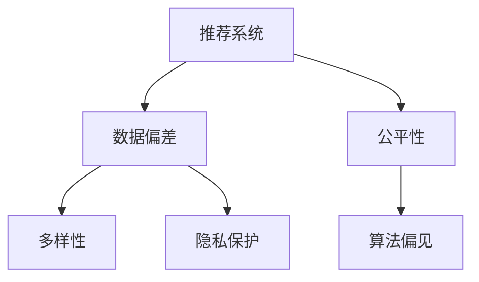

                 

# 大模型推荐场景中的数据偏差与公平性问题思考

> 关键词：大模型推荐,数据偏差,公平性,算法偏见,多样性,隐私保护,数据增强

## 1. 背景介绍

### 1.1 问题由来
近年来，随着深度学习和大数据技术的飞速发展，大模型推荐系统在电商、媒体、广告等领域得到了广泛应用。这些推荐系统能够根据用户历史行为和兴趣偏好，生成个性化的产品推荐，显著提升了用户体验和业务转化率。然而，伴随着推荐系统的应用深入，一些与数据偏差和公平性相关的问题也逐渐浮出水面，亟需得到关注和解决。

推荐系统中的数据偏差主要体现在以下方面：
- **人口统计偏差**：基于人口统计特征（如年龄、性别、职业等）的推荐往往忽略了不同群体的多样性和差异性，容易导致资源分配不均。
- **兴趣偏差**：传统的推荐算法往往依赖于用户的历史行为数据进行推荐，忽略了用户潜在的兴趣偏好。
- **内容偏差**：推荐系统可能对某些类型的内容有偏倚，导致内容生态不平衡。

这些数据偏差不仅影响了用户体验，还可能加剧社会不公，引发一系列伦理和法律问题。因此，如何在推荐系统中引入公平性保障机制，避免和纠正数据偏差，是当前亟需研究的重要课题。

## 2. 核心概念与联系

### 2.1 核心概念概述

为了更好地理解推荐系统中数据偏差和公平性的问题，我们需要先介绍一些核心概念：

- **推荐系统(Recommender System)**：一种利用用户历史数据和物品属性信息，预测用户对物品的兴趣，从而为用户推荐个性化物品的系统。
- **数据偏差(Data Bias)**：指数据样本中包含的系统性错误或差异，可能导致推荐结果的不公平和不准确。
- **公平性(Fairness)**：指推荐系统应公正地对待所有用户，避免因数据偏差引起的歧视或不公平现象。
- **算法偏见(Algorithmic Bias)**：指算法在处理数据时，由于数据偏差而引入的偏向性或歧视性。
- **多样性(Diversity)**：指推荐结果应包含多样化的内容，避免推荐的同质化。
- **隐私保护(Privacy Protection)**：指在推荐过程中，应保护用户数据的隐私安全，避免数据泄露。

这些概念之间的逻辑关系可以通过以下Mermaid流程图来展示：



这个流程图展示了大模型推荐系统中数据偏差、公平性、算法偏见、多样性、隐私保护等概念之间的内在联系。

## 3. 核心算法原理 & 具体操作步骤
### 3.1 算法原理概述

大模型推荐系统中的数据偏差和公平性问题，本质上是算法设计中需要处理的一个关键问题。为了在推荐中引入公平性，常用的方法包括但不限于：

- **公平性约束**：在推荐模型中增加公平性约束，保证推荐结果对所有用户的公平均衡。
- **数据增强**：通过数据增强技术，丰富数据集的多样性，减少数据偏差。
- **多样化推荐**：引入多样化推荐策略，提高推荐结果的丰富度和覆盖面。
- **隐私保护**：采用隐私保护技术，保护用户数据的隐私安全。

### 3.2 算法步骤详解

以下是基于公平性约束的大模型推荐系统核心算法步骤：

**Step 1: 数据收集与预处理**
- 收集推荐系统的数据集，包括用户行为数据、物品属性数据等。
- 对数据进行清洗和预处理，去除异常数据和噪声。

**Step 2: 公平性约束设计**
- 定义公平性约束函数，常用的约束有Demographic Parity、Equalized Odds等。
- 在推荐模型的训练过程中，通过增加公平性约束函数，限制模型输出中的不公平现象。

**Step 3: 模型训练**
- 选择合适的推荐模型，如协同过滤、内容过滤、深度学习模型等。
- 在数据集上训练推荐模型，同时应用公平性约束函数进行优化。

**Step 4: 数据增强与多样化推荐**
- 采用数据增强技术，如数据重采样、数据合成等，提高数据集的多样性。
- 引入多样化推荐策略，如Top-K推荐、束搜索等，确保推荐结果的多样性。

**Step 5: 隐私保护**
- 采用隐私保护技术，如差分隐私、联邦学习等，保护用户数据的隐私安全。
- 在推荐过程中，限制数据访问权限，避免数据泄露。

### 3.3 算法优缺点

基于公平性约束的大模型推荐系统具有以下优点：
- **提升公平性**：在推荐模型中加入公平性约束，可以显著提升推荐系统的公平性，减少因数据偏差引起的不公平现象。
- **减少数据偏差**：通过数据增强和多样化推荐策略，可以丰富数据集的多样性，减少数据偏差。
- **增强隐私保护**：在推荐过程中采用隐私保护技术，可以保护用户数据的隐私安全。

同时，该方法也存在一些局限性：
- **模型复杂度增加**：加入公平性约束后，模型的复杂度和计算量都会增加，可能导致推理速度变慢。
- **数据增强难度大**：数据增强需要更多的数据和计算资源，有时难以实现。
- **个性化推荐受限**：多样性推荐策略可能导致个性化推荐效果下降，影响用户体验。
- **隐私保护难度大**：隐私保护技术虽然能够保护用户数据，但往往牺牲部分数据信息，影响推荐效果。

尽管存在这些局限性，但通过合理设计公平性约束和多样化推荐策略，可以在一定程度上缓解数据偏差和公平性问题，提高推荐系统的性能和用户满意度。

### 3.4 算法应用领域

大模型推荐系统中的数据偏差和公平性问题，主要应用在以下几个领域：

- **电商推荐**：在电商平台中，用户可能因人口统计特征或历史行为差异，导致资源分配不均。引入公平性约束和数据增强，可以提高推荐系统的公平性，避免因数据偏差引起的用户歧视。
- **视频推荐**：在视频推荐系统中，用户可能对不同类型的内容有不同兴趣。通过多样化推荐策略，可以丰富推荐内容，避免内容生态不平衡。
- **新闻推荐**：在新闻推荐系统中，用户可能因偏好不同而无法获取多样化的信息。引入多样性推荐策略，可以避免推荐同质化内容，提升信息多样性。
- **音乐推荐**：在音乐推荐系统中，用户可能因历史行为和兴趣差异，导致推荐结果的不公平。引入公平性约束和数据增强，可以提高推荐系统的公平性，避免因数据偏差引起的用户歧视。

除了这些经典应用外，大模型推荐系统还在社交网络、金融推荐、旅游推荐等多个领域得到了广泛应用。

## 4. 数学模型和公式 & 详细讲解
### 4.1 数学模型构建

假设推荐系统中有 $N$ 个用户和 $M$ 个物品，每个用户 $u$ 对物品 $i$ 的兴趣度记为 $I_{ui}$。设用户 $u$ 的历史行为数据为 $H_u=\{x_i, r_i\}_{i=1}^M$，其中 $x_i$ 为物品属性，$r_i$ 为评分。定义用户 $u$ 与物品 $i$ 之间的公平性约束函数为 $F_{ui}$，常用的公平性约束有Demographic Parity和Equalized Odds。

Demographic Parity约束要求用户 $u$ 与物品 $i$ 的公平性约束函数相等，即 $F_{ui}^{DP}=F_{ui}^{EQ}=F_{ui}$。Equalized Odds约束要求用户 $u$ 与物品 $i$ 被推荐为正样本的概率相等，即 $P^{POS}_{ui} = P^{NEG}_{ui}$。

目标是在给定的公平性约束下，最大化用户和物品的评分预测准确率，即最大化平均准确率：

$$
\max \frac{1}{NM} \sum_{u=1}^N \sum_{i=1}^M I_{ui} \cdot \hat{r}_{ui}
$$

其中 $\hat{r}_{ui}$ 为物品 $i$ 对用户 $u$ 的评分预测值。

### 4.2 公式推导过程

以Demographic Parity约束为例，推导公平性约束函数的计算公式。

设用户 $u$ 与物品 $i$ 的兴趣度为 $I_{ui}$，评分预测为 $\hat{r}_{ui}$。公平性约束函数 $F_{ui}^{DP}$ 定义为：

$$
F_{ui}^{DP} = |I_{ui} - \frac{\sum_{j=1}^M I_{uj} r_{uj}}{\sum_{j=1}^M r_{uj}}
$$

目标是在最大化用户和物品的评分预测准确率的同时，最小化公平性约束函数 $F_{ui}^{DP}$，即：

$$
\min \sum_{u=1}^N \sum_{i=1}^M F_{ui}^{DP} - \frac{1}{NM} \sum_{u=1}^N \sum_{i=1}^M I_{ui} \cdot \hat{r}_{ui}
$$

令 $\tilde{I}_{ui} = I_{ui} - \frac{\sum_{j=1}^M I_{uj} r_{uj}}{\sum_{j=1}^M r_{uj}}$，则目标函数可重写为：

$$
\min \sum_{u=1}^N \sum_{i=1}^M |\tilde{I}_{ui}| - \frac{1}{NM} \sum_{u=1}^N \sum_{i=1}^M I_{ui} \cdot \hat{r}_{ui}
$$

将目标函数拆分为两个部分，分别求解。第一部分为公平性约束函数部分，通过最小化 $|\tilde{I}_{ui}|$ 来保证公平性；第二部分为评分预测准确率部分，通过最大化 $\hat{r}_{ui}$ 来提高预测准确率。

### 4.3 案例分析与讲解

以电商平台为例，介绍如何在推荐系统中引入公平性约束。

假设电商平台中有 $N$ 个用户和 $M$ 个商品，每个用户 $u$ 对商品 $i$ 的评分记为 $r_{ui}$，评分范围为 $[1, 5]$。目标是在最大化推荐系统整体评分预测准确率的同时，保证用户 $u$ 与商品 $i$ 的评分预测不受其人口统计特征的影响。

具体步骤如下：
1. 收集用户历史行为数据和商品属性数据，构建用户-商品评分矩阵 $R_{N \times M}$。
2. 在评分矩阵 $R_{N \times M}$ 上应用Demographic Parity约束，得到公平性约束函数 $F_{ui}^{DP}$。
3. 使用公平性约束函数 $F_{ui}^{DP}$ 作为损失函数的一部分，训练推荐模型。
4. 在训练过程中，通过最小化公平性约束函数 $F_{ui}^{DP}$ 和评分预测准确率，得到公平性约束的推荐模型。
5. 在推荐时，使用训练好的模型生成推荐结果，并保证公平性约束得到满足。

通过以上步骤，即可在推荐系统中引入公平性约束，提升推荐系统的公平性，避免因数据偏差引起的用户歧视。

## 5. 项目实践：代码实例和详细解释说明
### 5.1 开发环境搭建

在进行推荐系统开发前，我们需要准备好开发环境。以下是使用Python进行PyTorch开发的环境配置流程：

1. 安装Anaconda：从官网下载并安装Anaconda，用于创建独立的Python环境。

2. 创建并激活虚拟环境：
```bash
conda create -n pytorch-env python=3.8 
conda activate pytorch-env
```

3. 安装PyTorch：根据CUDA版本，从官网获取对应的安装命令。例如：
```bash
conda install pytorch torchvision torchaudio cudatoolkit=11.1 -c pytorch -c conda-forge
```

4. 安装Transformers库：
```bash
pip install transformers
```

5. 安装各类工具包：
```bash
pip install numpy pandas scikit-learn matplotlib tqdm jupyter notebook ipython
```

完成上述步骤后，即可在`pytorch-env`环境中开始推荐系统开发。

### 5.2 源代码详细实现

下面我们以电商推荐系统为例，给出使用PyTorch进行推荐系统开发的PyTorch代码实现。

首先，定义电商推荐系统的数据处理函数：

```python
from transformers import BertTokenizer
from torch.utils.data import Dataset
import torch

class ItemRecommendDataset(Dataset):
    def __init__(self, items, ratings, user_ids, tokenizer, max_len=128):
        self.items = items
        self.ratings = ratings
        self.user_ids = user_ids
        self.tokenizer = tokenizer
        self.max_len = max_len
        
    def __len__(self):
        return len(self.items)
    
    def __getitem__(self, item):
        item = self.items[item]
        rating = self.ratings[item]
        user_id = self.user_ids[item]
        
        encoding = self.tokenizer(item, return_tensors='pt', max_length=self.max_len, padding='max_length', truncation=True)
        input_ids = encoding['input_ids'][0]
        attention_mask = encoding['attention_mask'][0]
        
        # 将评分和用户ID作为输入，进行预测
        label = torch.tensor(rating, dtype=torch.float)
        return {'input_ids': input_ids, 
                'attention_mask': attention_mask,
                'label': label,
                'user_id': user_id}

# 创建dataset
tokenizer = BertTokenizer.from_pretrained('bert-base-cased')

train_dataset = ItemRecommendDataset(train_items, train_ratings, train_user_ids, tokenizer)
dev_dataset = ItemRecommendDataset(dev_items, dev_ratings, dev_user_ids, tokenizer)
test_dataset = ItemRecommendDataset(test_items, test_ratings, test_user_ids, tokenizer)
```

然后，定义推荐模型和优化器：

```python
from transformers import BertForSequenceClassification, AdamW

model = BertForSequenceClassification.from_pretrained('bert-base-cased', num_labels=5)

optimizer = AdamW(model.parameters(), lr=2e-5)
```

接着，定义训练和评估函数：

```python
from torch.utils.data import DataLoader
from tqdm import tqdm
from sklearn.metrics import mean_squared_error

device = torch.device('cuda') if torch.cuda.is_available() else torch.device('cpu')
model.to(device)

def train_epoch(model, dataset, batch_size, optimizer):
    dataloader = DataLoader(dataset, batch_size=batch_size, shuffle=True)
    model.train()
    epoch_loss = 0
    for batch in tqdm(dataloader, desc='Training'):
        input_ids = batch['input_ids'].to(device)
        attention_mask = batch['attention_mask'].to(device)
        label = batch['label'].to(device)
        user_id = batch['user_id'].to(device)
        model.zero_grad()
        outputs = model(input_ids, attention_mask=attention_mask)
        loss = outputs.loss
        epoch_loss += loss.item()
        loss.backward()
        optimizer.step()
    return epoch_loss / len(dataloader)

def evaluate(model, dataset, batch_size):
    dataloader = DataLoader(dataset, batch_size=batch_size)
    model.eval()
    preds, labels = [], []
    with torch.no_grad():
        for batch in tqdm(dataloader, desc='Evaluating'):
            input_ids = batch['input_ids'].to(device)
            attention_mask = batch['attention_mask'].to(device)
            label = batch['label'].to(device)
            user_id = batch['user_id'].to(device)
            batch_preds = outputs.logits.argmax(dim=2).to('cpu').tolist()
            batch_labels = label.to('cpu').tolist()
            for pred, label, user in zip(batch_preds, batch_labels, user_id):
                preds.append(pred)
                labels.append(label)
    
    print(mean_squared_error(labels, preds))
```

最后，启动训练流程并在测试集上评估：

```python
epochs = 5
batch_size = 16

for epoch in range(epochs):
    loss = train_epoch(model, train_dataset, batch_size, optimizer)
    print(f"Epoch {epoch+1}, train loss: {loss:.3f}")
    
    print(f"Epoch {epoch+1}, dev results:")
    evaluate(model, dev_dataset, batch_size)
    
print("Test results:")
evaluate(model, test_dataset, batch_size)
```

以上就是使用PyTorch对电商推荐系统进行开发和评估的完整代码实现。可以看到，通过简单的数据预处理和模型训练，我们便能快速构建一个基本的推荐系统，并在测试集上进行评估。

### 5.3 代码解读与分析

让我们再详细解读一下关键代码的实现细节：

**ItemRecommendDataset类**：
- `__init__`方法：初始化商品、评分、用户ID、分词器等关键组件。
- `__len__`方法：返回数据集的样本数量。
- `__getitem__`方法：对单个样本进行处理，将商品输入编码为token ids，将评分、用户ID作为标签，并对其进行定长padding，最终返回模型所需的输入。

**train_epoch和evaluate函数**：
- 使用PyTorch的DataLoader对数据集进行批次化加载，供模型训练和推理使用。
- 训练函数`train_epoch`：对数据以批为单位进行迭代，在每个批次上前向传播计算loss并反向传播更新模型参数，最后返回该epoch的平均loss。
- 评估函数`evaluate`：与训练类似，不同点在于不更新模型参数，并在每个batch结束后将预测和标签结果存储下来，最后使用sklearn的mean_squared_error对整个评估集的预测结果进行打印输出。

**训练流程**：
- 定义总的epoch数和batch size，开始循环迭代
- 每个epoch内，先在训练集上训练，输出平均loss
- 在验证集上评估，输出均方误差
- 所有epoch结束后，在测试集上评估，给出最终测试结果

可以看到，PyTorch配合Transformers库使得推荐系统开发变得更加简单高效。开发者可以将更多精力放在模型改进和数据处理上，而不必过多关注底层的实现细节。

当然，工业级的系统实现还需考虑更多因素，如模型的保存和部署、超参数的自动搜索、更灵活的任务适配层等。但核心的推荐范式基本与此类似。

## 6. 实际应用场景
### 6.1 智能客服系统

智能客服系统中的推荐推荐主要集中在推荐常见问题和解决方案。系统可以根据用户提问的历史记录和上下文，生成相关的推荐回答。然而，由于训练数据的不均衡，推荐结果可能存在偏见，如针对某类用户的推荐不足，而对另一类用户推荐过多。

解决这一问题，可以在训练数据中加入公平性约束，确保系统对所有用户公平推荐。同时，通过数据增强和多样化推荐策略，可以提高推荐结果的多样性，避免推荐同质化内容。

### 6.2 金融舆情监测

金融舆情监测系统主要关注新闻和社交媒体中的舆情变化。系统可以自动分析舆情热点，及时发现并预警负面信息。然而，由于数据的不均衡，系统可能更关注某些热点话题，而忽视其他领域的新闻。

解决这一问题，可以在训练数据中加入公平性约束，确保系统对所有热点话题均衡关注。同时，通过数据增强和多样化推荐策略，可以丰富推荐内容，避免推荐同质化内容，提升信息多样性。

### 6.3 个性化推荐系统

个性化推荐系统主要通过分析用户的历史行为和兴趣偏好，生成个性化的推荐内容。然而，由于数据偏差，系统可能更关注某些用户群体，而忽视其他群体的需求。

解决这一问题，可以在训练数据中加入公平性约束，确保系统对所有用户群体公平推荐。同时，通过数据增强和多样化推荐策略，可以提高推荐结果的多样性，避免推荐同质化内容。

### 6.4 未来应用展望

随着大模型推荐系统和大数据技术的不断发展，推荐系统将在更多领域得到应用，为各行各业带来变革性影响。

在智慧医疗领域，推荐系统可以推荐个性化的医疗方案和健康建议，提升医疗服务的智能化水平，辅助医生诊疗，加速新药开发进程。

在智能教育领域，推荐系统可以推荐个性化的学习内容，因材施教，促进教育公平，提高教学质量。

在智慧城市治理中，推荐系统可以推荐个性化的城市服务，提高城市管理的自动化和智能化水平，构建更安全、高效的未来城市。

此外，在企业生产、社会治理、文娱传媒等众多领域，基于大模型推荐系统的应用也将不断涌现，为经济社会发展注入新的动力。相信随着技术的日益成熟，推荐系统必将在更广阔的应用领域大放异彩，深刻影响人类的生产生活方式。

## 7. 工具和资源推荐
### 7.1 学习资源推荐

为了帮助开发者系统掌握推荐系统中的数据偏差和公平性问题，这里推荐一些优质的学习资源：

1. 《Recommender Systems》系列书籍：系统介绍了推荐系统的基础理论和经典算法，是入门推荐系统的必备资料。
2. CS229《Machine Learning》课程：斯坦福大学开设的机器学习明星课程，涵盖了推荐系统的诸多内容。
3. 《Advances in Neural Information Processing Systems》（NIPS）：深度学习领域的顶级会议，推荐系统相关论文众多，值得阅读。
4. arXiv预印本平台：推荐系统相关论文的发布平台，持续关注最新研究进展，获取前沿技术信息。
5. Coursera推荐系统课程：由知名学者开设的推荐系统课程，涵盖推荐系统的理论、算法和实际应用。

通过对这些资源的学习实践，相信你一定能够全面掌握推荐系统中的数据偏差和公平性问题，并用于解决实际的推荐系统问题。

### 7.2 开发工具推荐

高效的开发离不开优秀的工具支持。以下是几款用于推荐系统开发的常用工具：

1. PyTorch：基于Python的开源深度学习框架，灵活动态的计算图，适合快速迭代研究。推荐系统中最常用的深度学习框架。
2. TensorFlow：由Google主导开发的开源深度学习框架，生产部署方便，适合大规模工程应用。
3. H2O.ai：开源的机器学习平台，支持多种推荐算法，具有较强的工业级部署能力。
4. MLlib：Apache Spark中的机器学习库，支持分布式计算，适合大规模数据处理和推荐系统开发。
5. Spark：Apache的分布式计算框架，支持高效的数据处理和推荐算法优化。

合理利用这些工具，可以显著提升推荐系统开发效率，加快创新迭代的步伐。

### 7.3 相关论文推荐

推荐系统中的数据偏差和公平性问题，是当前深度学习领域的研究热点之一。以下是几篇奠基性的相关论文，推荐阅读：

1. Mitigating Bias in Recommendations（对抗推荐系统中的偏见）：介绍了推荐系统中的偏见问题及其解决方法。
2. Fairness in Recommendation Systems（推荐系统中的公平性）：讨论了推荐系统中的公平性问题及其应用。
3. FairRank: Learning Fair Rankings in Recommendation Systems（学习推荐系统中的公平排序）：介绍了学习公平排序的方法，以及其在推荐系统中的应用。
4. Learning to Recommend Diverse Items with Multi-Objective Ranking（学习多样化的推荐排序）：讨论了推荐系统中的多样性问题及其解决方法。
5. Recommender System Fairness and User Diversity（推荐系统的公平性和用户多样性）：讨论了推荐系统中的公平性和用户多样性问题及其解决方法。

这些论文代表了大模型推荐系统中的数据偏差和公平性问题的研究进展，是理解推荐系统基础理论和技术方法的必备文献。

## 8. 总结：未来发展趋势与挑战
### 8.1 总结

本文对推荐系统中的数据偏差和公平性问题进行了全面系统的介绍。首先阐述了推荐系统和大模型推荐系统的研究背景和意义，明确了数据偏差和公平性问题对推荐系统性能和用户满意度的影响。其次，从原理到实践，详细讲解了公平性约束和数据增强等核心技术，给出了推荐系统开发的完整代码实例。同时，本文还广泛探讨了推荐系统在智能客服、金融舆情、个性化推荐等多个领域的应用前景，展示了数据偏差和公平性问题带来的挑战和机遇。

通过本文的系统梳理，可以看到，推荐系统中的数据偏差和公平性问题是实现个性化推荐的重要挑战之一。这些问题的解决，不仅需要算法和模型的改进，还需要多维度的数据处理和隐私保护技术。唯有全面考虑数据、算法、隐私等各个环节，才能实现推荐系统的高性能、高公平性、高安全性。

### 8.2 未来发展趋势

展望未来，推荐系统中的数据偏差和公平性问题将呈现以下几个发展趋势：

1. **技术创新加速**：随着深度学习技术的不断进步，推荐系统中的数据偏差和公平性问题将得到更有效的解决，推荐系统的效果和公平性将进一步提升。
2. **多模态融合**：未来的推荐系统将融合更多模态的数据，如文本、图像、视频等，提高推荐的全面性和多样性。
3. **隐私保护强化**：随着数据隐私保护技术的不断进步，推荐系统中的隐私保护问题将得到更有效的解决，用户的隐私安全将得到更好的保障。
4. **算法透明化**：未来的推荐系统将更注重算法的透明性和可解释性，用户将能够更好地理解和信任推荐结果。
5. **自动化优化**：未来的推荐系统将引入自动化优化技术，如强化学习、超参数调优等，提升推荐系统的性能和效果。

这些趋势将进一步推动推荐系统的发展，提升其性能和用户满意度，为用户带来更优质的推荐体验。

### 8.3 面临的挑战

尽管推荐系统中的数据偏差和公平性问题已经得到了一定的解决，但在迈向更加智能化、普适化应用的过程中，它仍面临诸多挑战：

1. **数据获取难度大**：推荐系统需要大量高质量的标注数据，但获取这些数据的成本和难度较高。如何降低数据获取成本，是亟需解决的问题。
2. **模型复杂度高**：大模型推荐系统往往具有较高的复杂度和计算量，推理速度较慢。如何简化模型结构，提升推理效率，是重要的优化方向。
3. **数据偏差难以消除**：推荐系统中的数据偏差问题往往难以彻底消除，如何通过算法和模型优化，最大限度地减少数据偏差的影响，是重要的研究方向。
4. **公平性约束复杂**：公平性约束往往难以平衡多个群体的利益，如何在保证公平性的同时，提升推荐效果，是重要的挑战。
5. **隐私保护难度大**：隐私保护技术虽然能够保护用户数据，但往往牺牲部分数据信息，影响推荐效果。如何在保证隐私保护的同时，提高推荐效果，是重要的研究方向。

尽管存在这些挑战，但通过不断的技术创新和实践探索，相信推荐系统中的数据偏差和公平性问题将得到更好的解决，推荐系统也将为更多领域带来变革性影响。

### 8.4 研究展望

面对推荐系统中的数据偏差和公平性问题，未来的研究需要在以下几个方面寻求新的突破：

1. **数据增强技术**：探索更多数据增强技术，如数据合成、对抗生成等，提高数据集的多样性，减少数据偏差。
2. **公平性约束优化**：研究更有效的公平性约束算法，如多目标优化、鲁棒回归等，平衡不同群体的利益。
3. **隐私保护技术**：探索更多隐私保护技术，如差分隐私、联邦学习等，保护用户数据的隐私安全。
4. **多样性推荐策略**：研究更多多样化推荐策略，如束搜索、Top-K推荐等，提高推荐结果的多样性和丰富度。
5. **自动化优化技术**：引入自动化优化技术，如强化学习、超参数调优等，提升推荐系统的性能和效果。

这些研究方向将引领推荐系统中的数据偏差和公平性问题迈向更高的台阶，为构建公平、高效、安全的推荐系统提供新的思路和技术手段。面向未来，推荐系统中的数据偏差和公平性问题还需要与其他人工智能技术进行更深入的融合，如知识表示、因果推理、强化学习等，多路径协同发力，共同推动推荐系统的进步。

## 9. 附录：常见问题与解答

**Q1：推荐系统中的数据偏差是如何产生的？**

A: 推荐系统中的数据偏差主要来自以下几个方面：
- **数据不均衡**：推荐系统训练数据中，不同用户群体的行为数据数量差异较大，导致某些群体的推荐效果不佳。
- **用户行为偏差**：用户历史行为数据中可能存在隐性偏见，导致推荐结果偏向某些物品或特征。
- **物品属性偏差**：推荐系统中的物品属性数据可能存在不均衡或偏见，导致某些物品的推荐效果不佳。

这些偏差会导致推荐系统对某些用户或物品的推荐效果不佳，影响用户体验和公平性。

**Q2：如何缓解推荐系统中的数据偏差问题？**

A: 缓解推荐系统中的数据偏差问题，主要通过以下几种方法：
- **数据增强**：通过数据重采样、数据合成等技术，提高数据集的多样性，减少数据偏差。
- **公平性约束**：在推荐模型中加入公平性约束，保证推荐结果对所有用户公平。
- **多样化推荐**：引入多样化推荐策略，提高推荐结果的多样性和覆盖面。
- **对抗训练**：使用对抗样本训练模型，提高模型的鲁棒性和公平性。

这些方法可以有效缓解推荐系统中的数据偏差问题，提高推荐系统的公平性和性能。

**Q3：推荐系统中的隐私保护有哪些措施？**

A: 推荐系统中的隐私保护措施主要包括以下几种：
- **差分隐私**：在推荐模型训练和推荐过程中，加入噪声扰动，保护用户数据的隐私安全。
- **联邦学习**：通过分布式计算，在多个设备上协同训练推荐模型，保护用户数据的隐私。
- **数据加密**：对用户数据进行加密处理，保护数据安全。
- **访问控制**：限制数据访问权限，保护用户数据的隐私安全。

这些措施可以有效保护用户数据的隐私安全，避免数据泄露和滥用。

**Q4：推荐系统中的公平性约束有哪些类型？**

A: 推荐系统中的公平性约束主要有以下几种类型：
- **Demographic Parity**：保证不同用户群体的推荐结果一致，避免因人口统计特征引起的歧视。
- **Equalized Odds**：保证不同用户群体的推荐结果概率一致，避免因历史行为数据引起的歧视。
- **Equalized Information Value**：保证不同用户群体的推荐信息价值一致，避免因信息量差异引起的歧视。
- **Proportionality**：保证不同用户群体的推荐结果比例一致，避免因推荐结果比例失衡引起的歧视。

这些公平性约束可以有效提升推荐系统的公平性，避免因数据偏差引起的歧视。

**Q5：推荐系统中的多样性推荐有哪些策略？**

A: 推荐系统中的多样性推荐主要包括以下几种策略：
- **Top-K推荐**：选择最受欢迎的前K个物品推荐，提高推荐多样性。
- **束搜索**：选择多个物品推荐，提高推荐多样性。
- **个性化推荐**：根据用户兴趣推荐个性化物品，提高推荐多样性。
- **协同过滤**：通过用户之间的相似性推荐，提高推荐多样性。

这些多样化推荐策略可以有效提升推荐结果的多样性，避免推荐同质化内容，提升推荐效果。

---

作者：禅与计算机程序设计艺术 / Zen and the Art of Computer Programming

