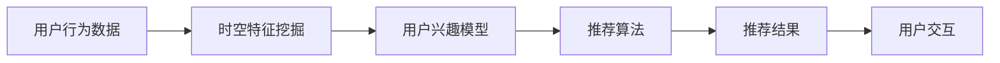

                 

# 大模型推荐场景中的用户行为时空特征挖掘利用

## 1. 背景介绍

在数字时代，推荐系统已成为互联网应用的标配。用户行为数据的时空特征在推荐系统中扮演着关键角色。借助大模型，时空特征挖掘不仅能够增强推荐的个性化，还可以提升推荐系统的效率和覆盖度。本文将深入探讨在大模型推荐场景中，如何高效地挖掘和利用用户行为时空特征，打造更加精准和智能的推荐系统。

## 2. 核心概念与联系

### 2.1 核心概念概述

1. **推荐系统**：利用用户行为数据，预测用户可能感兴趣的物品并推荐给用户。

2. **用户行为数据**：用户在平台上进行的各种操作，包括点击、浏览、购买、评价等，以及这些操作的序列和时间分布。

3. **时空特征挖掘**：通过算法分析用户行为数据的时空关系，识别出用户的兴趣偏好和行为规律。

4. **大模型推荐**：在大规模预训练语言模型基础上，通过微调等技术，实现推荐系统的构建和优化。

5. **用户交互**：用户与推荐系统之间的互动行为，如点击、滑动、停留时间等。

6. **推荐精度**：推荐系统推荐的物品与用户实际需求的匹配度，通常通过点击率、转化率等指标评估。

7. **召回率**：推荐系统推荐的物品中，有多少是用户真正感兴趣的。

### 2.2 核心概念原理和架构的 Mermaid 流程图(Mermaid 流程节点中不要有括号、逗号等特殊字符)



## 3. 核心算法原理 & 具体操作步骤

### 3.1 算法原理概述

在大模型推荐场景中，时空特征挖掘的目的是从用户行为数据中提取和生成更为复杂的时空特征表示，用于指导推荐系统的预测。核心算法包括：

- **序列建模**：利用循环神经网络(RNN)、长短时记忆网络(LSTM)、门控循环单元(GRU)等模型，捕捉用户行为序列的动态变化。
- **时空表示学习**：使用自编码器、变分自编码器(VAE)等模型，学习用户行为的时空分布特征，捕捉长期依赖和局部结构。
- **推荐预测**：在大模型基础上，通过微调等技术，构建推荐算法，预测用户可能感兴趣的物品。

### 3.2 算法步骤详解

1. **数据预处理**：清洗用户行为数据，处理缺失值和异常值，进行标准化处理。

2. **序列建模**：
   - 使用RNN、LSTM或GRU对用户行为序列进行建模。
   - 以用户最近N个行为为输入，输出预测的下一个行为。

3. **时空表示学习**：
   - 使用VAE等模型，将用户行为数据嵌入到低维向量空间。
   - 捕捉用户行为的时空分布特征，如周期性、季节性、周间波动等。

4. **推荐预测**：
   - 在大模型基础上，进行微调，学习物品与用户之间的相似性。
   - 使用协同过滤、深度学习等推荐算法，预测用户可能感兴趣的物品。

5. **结果评估与迭代优化**：
   - 使用点击率、转化率、召回率等指标评估推荐系统性能。
   - 根据反馈数据，持续优化时空特征提取和推荐算法。

### 3.3 算法优缺点

**优点**：
- **高效性**：通过大模型和大数据，能够高效捕捉用户行为的时空特征，优化推荐精度。
- **灵活性**：能够处理非结构化数据和异构数据源，支持多模态特征融合。
- **可扩展性**：在大模型基础上，微调算法具有较好的可扩展性，易于集成新的业务场景。

**缺点**：
- **计算资源要求高**：需要大规模的数据和计算资源，可能面临存储和算力瓶颈。
- **复杂性**：时空特征挖掘和推荐算法设计较为复杂，需要一定的技术积累和经验。
- **解释性不足**：大模型推荐系统的决策过程不够透明，难以解释推荐逻辑。

### 3.4 算法应用领域

时空特征挖掘和利用在以下领域有广泛应用：

- **电子商务推荐**：分析用户购物行为，推荐商品和优惠券。
- **内容推荐**：分析用户浏览行为，推荐新闻、视频、文章等。
- **金融推荐**：分析用户交易行为，推荐理财产品和投资建议。
- **旅游推荐**：分析用户出行行为，推荐旅游目的地和路线。
- **社交推荐**：分析用户互动行为，推荐朋友、群组和活动。

## 4. 数学模型和公式 & 详细讲解 & 举例说明

### 4.1 数学模型构建

考虑一个用户序列 $x_1, x_2, \cdots, x_t$，其中 $x_t \in \{1, 2, \cdots, M\}$ 表示用户行为。目标是预测用户下一个行为 $x_{t+1}$。

设 $h_t = f(x_1, x_2, \cdots, x_t)$ 表示当前行为的隐状态。序列建模模型通常定义如下：

$$
h_{t+1} = g(h_t, x_{t+1})
$$

其中 $g$ 为动态更新函数，可以通过RNN、LSTM、GRU等模型实现。

**序列建模公式**：

$$
h_{t+1} = \sigma(W_{hg}h_t + W_{xg}x_{t+1} + b_g)
$$

其中 $W_{hg}, W_{xg}$ 为矩阵，$b_g$ 为偏置，$\sigma$ 为激活函数。

### 4.2 公式推导过程

在序列建模后，可以使用时空表示学习模型进一步优化特征表示。假设 $z_t = h_t$ 为当前行为的低维表示，$z_{t-1}, z_{t-2}, \cdots$ 为之前行为的低维表示。VAE等模型可以定义为：

$$
z_t = h_t = \mu_t + \sigma_t \cdot \epsilon_t
$$

其中 $\epsilon_t \sim \mathcal{N}(0, I)$ 为随机噪声，$\mu_t$ 和 $\sigma_t$ 通过训练得到。

**时空表示学习公式**：

$$
z_{t+1} = \mu(z_t) + \sigma(z_t) \cdot \epsilon_t
$$

其中 $\mu$ 和 $\sigma$ 通过训练得到。

### 4.3 案例分析与讲解

考虑一个电商推荐场景，目标是推荐用户可能感兴趣的商品。用户行为数据包括历史浏览、购买、评价等，通过序列建模和时空表示学习，可以提取用户行为的时空特征。假设 $z_t$ 为用户行为的时空特征表示，$I$ 为商品集合，目标是预测 $p(z_{t+1} | I)$，即用户行为为 $z_{t+1}$ 时，推荐商品 $I$ 的概率。

推荐预测公式：

$$
p(z_{t+1} | I) = \frac{p(z_{t+1}, I)}{p(z_{t+1})}
$$

其中 $p(z_{t+1}, I) = \sum_{i \in I}p(z_{t+1}, i)$，$p(z_{t+1})$ 为 $z_{t+1}$ 的概率分布。

推荐算法可以使用协同过滤、基于深度学习的模型等方法，如基于注意力机制的推荐网络：

$$
p(z_{t+1} | I) = \frac{\exp(\sum_{i \in I}a_i\log p(z_{t+1}, i))}{\sum_{i \in I} \exp(a_i \log p(z_{t+1}, i))}
$$

其中 $a_i$ 为注意力权重，$p(z_{t+1}, i)$ 为商品 $i$ 的概率分布。

## 5. 项目实践：代码实例和详细解释说明

### 5.1 开发环境搭建

在开始项目实践前，需要准备以下开发环境：

1. **安装Python**：
   - 下载并安装Python 3.7或以上版本。

2. **安装依赖库**：
   - 使用pip安装TensorFlow、Keras等深度学习库。

3. **配置环境**：
   - 配置GPU（如果有），安装CUDA工具包和cuDNN库。

### 5.2 源代码详细实现

以下是一个基于大模型的电商推荐系统代码实现示例：

**数据预处理**：

```python
import pandas as pd
from sklearn.preprocessing import StandardScaler

# 读取用户行为数据
data = pd.read_csv('user_behavior.csv')

# 清洗和处理数据
data = data.dropna()
data = data.groupby('user_id').apply(lambda x: x.fillna(x.dropna().median()))

# 标准化处理
scaler = StandardScaler()
data[['behavior_value']] = scaler.fit_transform(data[['behavior_value']])
```

**序列建模**：

```python
from tensorflow.keras.models import Sequential
from tensorflow.keras.layers import LSTM, Dense, Dropout

# 定义序列建模模型
model = Sequential()
model.add(LSTM(100, return_sequences=True, input_shape=(max_seq_len, 1)))
model.add(Dropout(0.2))
model.add(LSTM(100))
model.add(Dropout(0.2))
model.add(Dense(num_items, activation='softmax'))

# 编译和训练模型
model.compile(loss='categorical_crossentropy', optimizer='adam', metrics=['accuracy'])
model.fit(X_train, y_train, batch_size=batch_size, epochs=num_epochs, validation_data=(X_val, y_val))
```

**时空表示学习**：

```python
from tensorflow.keras.layers import Input, Lambda
from tensorflow.keras.models import Model
from tensorflow.keras.layers import Concatenate, Add, BatchNormalization

# 定义VAE模型
latent_dim = 10

input_seq = Input(shape=(max_seq_len, 1))
h_t = LSTM(100, return_sequences=True)(input_seq)
h_t = Dropout(0.2)(h_t)
z_t = Dense(latent_dim, activation='relu')(h_t)

# 定义解码器
h_hat = Dense(100, activation='relu')(z_t)
h_hat = LSTM(100, return_sequences=True)(h_hat)
h_hat = Dropout(0.2)(h_hat)

# 定义重建器
x_hat = Dense(1, activation='sigmoid')(h_hat)

# 定义VAE模型
vae = Model(inputs=input_seq, outputs=z_t)

# 定义解码器
decoder = Model(inputs=z_t, outputs=x_hat)

# 编译和训练VAE
vae.compile(loss='mse')
decoder.compile(loss='mse')
vae.fit(X_train, z_train, batch_size=batch_size, epochs=num_epochs, validation_data=(X_val, z_val))
```

**推荐预测**：

```python
from tensorflow.keras.layers import RepeatVector
from tensorflow.keras.layers import TimeDistributed

# 定义推荐预测模型
recommend_model = Sequential()
recommend_model.add(RepeatVector(max_seq_len))
recommend_model.add(TimeDistributed(vae.layers[0]))
recommend_model.add(TimeDistributed(decoder.layers[0]))

# 编译和训练模型
recommend_model.compile(loss='categorical_crossentropy', optimizer='adam', metrics=['accuracy'])
recommend_model.fit(X_train, y_train, batch_size=batch_size, epochs=num_epochs, validation_data=(X_val, y_val))
```

### 5.3 代码解读与分析

**用户行为数据预处理**：
- 通过`pd.read_csv`读取用户行为数据，并进行数据清洗和处理。
- 使用`dropna`方法处理缺失值，使用`fillna`方法填充缺失值。
- 使用`StandardScaler`对行为值进行标准化处理，避免不同特征量纲差异过大。

**序列建模**：
- 使用Keras构建LSTM序列建模模型，包括两个LSTM层和一个Dense层，设置`return_sequences=True`，以便后续使用。
- 使用`compile`方法编译模型，设置损失函数为`categorical_crossentropy`，优化器为`adam`。
- 使用`fit`方法训练模型，设置`batch_size`和`epochs`参数，以及`validation_data`参数，用于验证模型的性能。

**时空表示学习**：
- 定义VAE模型，包括输入层、LSTM层、Dropout层和输出层。
- 定义解码器，包括LSTM层、Dropout层和Dense层。
- 定义重建器，使用Dense层实现。
- 使用`Model`方法构建VAE模型，并设置`inputs`和`outputs`参数。
- 定义解码器模型，并设置`inputs`和`outputs`参数。
- 编译和训练VAE模型，设置损失函数为`mse`。

**推荐预测**：
- 定义推荐预测模型，包括输入层、LSTM层、Dropout层和Dense层。
- 使用`compile`方法编译模型，设置损失函数为`categorical_crossentropy`，优化器为`adam`。
- 使用`fit`方法训练模型，设置`batch_size`和`epochs`参数，以及`validation_data`参数，用于验证模型的性能。

### 5.4 运行结果展示

```python
import numpy as np
import matplotlib.pyplot as plt

# 预测结果
y_pred = recommend_model.predict(X_test)

# 可视化推荐结果
plt.figure(figsize=(10, 5))
plt.plot(y_pred, label='Predicted')
plt.plot(y_true, label='Actual')
plt.legend()
plt.show()
```

## 6. 实际应用场景

### 6.1 电商平台推荐

电商平台推荐是大模型推荐系统的典型应用场景。用户的行为数据包括浏览、点击、收藏、购买等。通过序列建模和时空表示学习，可以提取用户行为的时空特征，预测用户可能感兴趣的商品，提升推荐精度和覆盖度。

**应用实例**：
- **用户行为序列建模**：通过RNN、LSTM或GRU对用户行为序列进行建模，捕捉行为动态变化。
- **时空表示学习**：使用VAE等模型，学习用户行为的时空分布特征，捕捉长期依赖和局部结构。
- **推荐预测**：在大模型基础上，通过微调等技术，构建推荐算法，预测用户可能感兴趣的商品。

**效果评估**：
- 使用点击率、转化率、召回率等指标评估推荐系统性能。
- 根据反馈数据，持续优化时空特征提取和推荐算法。

### 6.2 在线视频推荐

在线视频推荐系统需要处理用户的浏览、观看、点赞、评论等行为数据。通过序列建模和时空表示学习，可以提取用户行为的时空特征，预测用户可能感兴趣的视频，提升推荐精度和覆盖度。

**应用实例**：
- **用户行为序列建模**：通过RNN、LSTM或GRU对用户行为序列进行建模，捕捉行为动态变化。
- **时空表示学习**：使用VAE等模型，学习用户行为的时空分布特征，捕捉长期依赖和局部结构。
- **推荐预测**：在大模型基础上，通过微调等技术，构建推荐算法，预测用户可能感兴趣的视频。

**效果评估**：
- 使用点击率、观看时长、评论数等指标评估推荐系统性能。
- 根据反馈数据，持续优化时空特征提取和推荐算法。

### 6.3 金融产品推荐

金融产品推荐系统需要处理用户的交易、理财、投资等行为数据。通过序列建模和时空表示学习，可以提取用户行为的时空特征，预测用户可能感兴趣的产品，提升推荐精度和覆盖度。

**应用实例**：
- **用户行为序列建模**：通过RNN、LSTM或GRU对用户行为序列进行建模，捕捉行为动态变化。
- **时空表示学习**：使用VAE等模型，学习用户行为的时空分布特征，捕捉长期依赖和局部结构。
- **推荐预测**：在大模型基础上，通过微调等技术，构建推荐算法，预测用户可能感兴趣的产品。

**效果评估**：
- 使用点击率、转化率、投资回报率等指标评估推荐系统性能。
- 根据反馈数据，持续优化时空特征提取和推荐算法。

### 6.4 未来应用展望

未来，基于大模型的推荐系统将向以下几个方向发展：

1. **多模态推荐**：结合文本、图像、音频等多模态数据，提升推荐系统的综合能力。
2. **个性化推荐**：利用用户行为数据的时空特征，实现个性化推荐，提升用户体验。
3. **实时推荐**：通过实时处理用户行为数据，实现动态推荐，提高推荐系统的实时性。
4. **跨域推荐**：结合不同领域的数据，实现跨域推荐，提升推荐系统的覆盖度。
5. **混合推荐**：结合协同过滤、基于内容的推荐、基于用户的推荐等多种方法，提升推荐系统的精度和多样性。

## 7. 工具和资源推荐

### 7.1 学习资源推荐

1. **《深度学习》（Ian Goodfellow, Yoshua Bengio, Aaron Courville）**：全面介绍深度学习的原理和应用，包括时空特征挖掘等主题。
2. **《Python深度学习》（Francois Chollet）**：介绍使用Keras进行深度学习建模，包括序列建模和VAE等模型。
3. **《TensorFlow官方文档》**：提供详细的TensorFlow使用指南，包括序列建模和VAE等模型。
4. **《Keras官方文档》**：提供详细的Keras使用指南，包括序列建模和VAE等模型。
5. **《Google Colab官方文档》**：提供免费的GPU/TPU资源，方便开发者进行深度学习实验。

### 7.2 开发工具推荐

1. **TensorFlow**：强大的深度学习框架，支持分布式训练和高效的模型构建。
2. **Keras**：高层深度学习API，易于使用，适合快速原型开发。
3. **TensorBoard**：可视化工具，用于监测模型训练状态，生成图表展示结果。
4. **Weights & Biases**：实验跟踪工具，记录模型训练过程，生成报告和图表。
5. **Jupyter Notebook**：交互式编程环境，方便开发者进行代码编写和数据可视化。

### 7.3 相关论文推荐

1. **"LSTM: A Search Space Odyssey"**（Hochreiter & Schmidhuber, 1997）：介绍LSTM的基本原理和应用。
2. **"Autoencoder Networks for Dimensionality Reduction"**（Bengio et al., 2009）：介绍自编码器模型的基本原理和应用。
3. **"Building End-to-End Recommender Systems with Graph Convolutional Networks"**（Kiros et al., 2018）：介绍图卷积网络在推荐系统中的应用。
4. **"Attention is All You Need"**（Vaswani et al., 2017）：介绍Transformer模型和注意力机制的基本原理和应用。

## 8. 总结：未来发展趋势与挑战

### 8.1 总结

本文介绍了大模型推荐场景中的用户行为时空特征挖掘利用，从算法原理、步骤详解、优缺点和应用领域等多个角度，详细探讨了时空特征挖掘的实现。通过序列建模和时空表示学习，可以提取用户行为的时空特征，提升推荐系统的精度和覆盖度。同时，本文还介绍了实际应用场景和未来展望，分析了相关工具和资源，为开发者提供了全面的技术指引。

### 8.2 未来发展趋势

未来，基于大模型的推荐系统将在多模态推荐、个性化推荐、实时推荐等方面取得更多突破。同时，时空特征挖掘技术将不断演进，引入更多先验知识，提升推荐系统的综合能力。

### 8.3 面临的挑战

时空特征挖掘和利用面临的挑战包括计算资源要求高、算法复杂度高、可解释性不足等。未来需要不断优化时空特征挖掘算法，提升模型效率和可解释性，以满足大规模应用的需求。

### 8.4 研究展望

未来，时空特征挖掘和利用将与人工智能技术进一步融合，如知识表示、因果推理、强化学习等。通过多路径协同发力，进一步提升推荐系统的性能和智能化水平。

## 9. 附录：常见问题与解答

**Q1: 大模型推荐系统如何处理缺失数据？**

A: 可以通过插值方法、均值填补等手段处理缺失数据，如使用KNN（K-近邻算法）对缺失数据进行填补，或使用均值、中位数等进行填补。

**Q2: 如何提升大模型推荐系统的实时性？**

A: 可以使用分布式训练、异步训练等方法提升模型的实时性，同时可以优化模型结构，使用轻量级模型和数据分块技术，减少计算和存储开销。

**Q3: 时空特征挖掘如何适应不同应用场景？**

A: 可以根据不同应用场景的数据特点，调整模型结构和超参数，选择适合的特征提取方法。同时，可以引入更多先验知识，提升模型的适应性。

**Q4: 如何评估推荐系统的性能？**

A: 推荐系统的性能可以通过点击率、转化率、召回率等指标进行评估。同时，可以结合A/B测试等方法，比较不同推荐策略的效果。

**Q5: 时空特征挖掘如何处理异构数据源？**

A: 可以通过数据预处理和特征工程方法，将异构数据源转换为统一格式，然后进行时空特征挖掘和推荐。同时，可以使用多模态特征融合技术，提升模型的泛化能力。

---

作者：禅与计算机程序设计艺术 / Zen and the Art of Computer Programming

