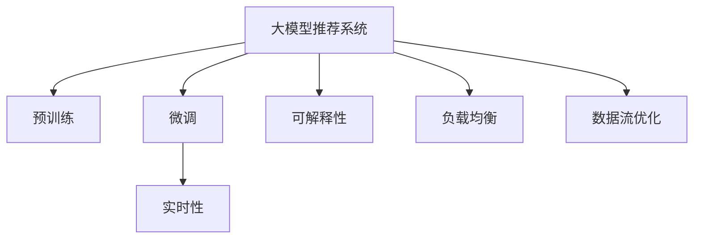

                 

# 大模型推荐系统的实时性能优化

## 1. 背景介绍

### 1.1 问题由来
推荐系统是互联网行业重要的应用方向，旨在根据用户的历史行为和偏好，推荐符合其兴趣的商品、内容或服务。随着电子商务、社交媒体等应用的普及，推荐系统逐渐成为企业获取用户价值的重要工具。然而，传统的推荐系统主要基于浅层学习算法（如协同过滤、SVM等）构建，模型参数规模较小，难以满足用户多样化和个性化的需求。

近年来，随着深度学习技术的迅猛发展，基于大模型的推荐系统成为新的研究热点。大模型通过在大规模数据上进行预训练，学习到丰富的用户特征和商品特征，并能够自适应地根据新用户和新商品数据进行调整，从而提升推荐效果。然而，大模型的复杂性和参数量巨大，往往需要在云计算环境中进行训练和推理，实时性受到限制。在推荐系统实时性要求较高的场景下，如何兼顾模型的精度和实时性能，成为亟需解决的问题。

## 2. 核心概念与联系

### 2.1 核心概念概述

为了更好地理解如何优化大模型推荐系统的实时性能，本节将介绍几个关键的概念和它们之间的联系：

- **大模型推荐系统**：通过在大规模数据上进行预训练的大模型，能够学习到丰富的用户和商品特征，提升推荐效果。
- **预训练**：在大规模无标签数据上，通过自监督学习任务训练大模型的过程，使其学习到通用的特征表示。
- **微调**：在预训练模型的基础上，使用少量有标签数据进行优化，使其适应特定的推荐任务。
- **实时性**：推荐系统在用户查询时能够即时返回推荐结果，满足用户体验的实时需求。
- **可解释性**：推荐系统生成的推荐结果能够清晰地解释推荐依据，提升用户信任感。
- **负载均衡**：推荐系统能够合理分配计算资源，避免因系统负载过高而导致性能下降。
- **数据流优化**：在数据流处理中，优化数据的存储、传输和处理方式，提升推荐系统的效率。

这些核心概念之间的逻辑关系可以通过以下Mermaid流程图来展示：



这个流程图展示了大模型推荐系统的核心概念及其之间的关系：

1. 大模型推荐系统通过预训练学习通用特征。
2. 微调使模型适应特定任务，提升推荐效果。
3. 实时性确保系统快速响应用户查询。
4. 可解释性增加推荐结果的透明度和可信度。
5. 负载均衡优化资源分配，提高系统稳定性和可扩展性。
6. 数据流优化提升数据处理效率，降低延迟。

## 3. 核心算法原理 & 具体操作步骤
### 3.1 算法原理概述

大模型推荐系统的实时性能优化，涉及到模型压缩、参数剪枝、分布式训练等技术，以降低模型复杂度和资源消耗，同时提升模型推理速度。核心算法原理包括：

- **模型压缩**：通过剪枝、量化、蒸馏等技术，减小模型参数规模，降低资源消耗。
- **参数剪枝**：删除模型中不重要的参数，保留关键参数，提高推理速度。
- **分布式训练**：通过多机并行训练，加快模型训练速度，缩短预训练和微调时间。
- **优化器选择**：选择合适的优化器，如AdamW、SGD等，控制模型更新步长，提升训练效率。
- **超参数调优**：通过网格搜索、贝叶斯优化等技术，调整模型超参数，提高模型性能。

### 3.2 算法步骤详解

大模型推荐系统的实时性能优化，一般包括以下几个关键步骤：

**Step 1: 准备训练数据**
- 收集用户行为数据（如浏览记录、购买历史等）和商品数据（如商品详情、标签等），并预处理为模型输入。
- 将数据集分为训练集、验证集和测试集，以便在训练和评估过程中使用。

**Step 2: 选择和预训练大模型**
- 选择适合推荐任务的大模型（如BERT、GPT、DALL-E等）进行预训练。
- 在大规模数据上对大模型进行预训练，学习通用特征表示。

**Step 3: 微调和优化**
- 在微调前，进行模型压缩和参数剪枝，减小模型规模。
- 使用分布式训练技术，加快模型训练速度。
- 选择合适的优化器，并进行超参数调优。
- 使用小批量随机梯度下降法（SGD）进行微调，优化模型参数。

**Step 4: 评估和部署**
- 在验证集上评估微调后的模型性能，对比原始大模型和微调后模型的性能提升。
- 部署微调后的模型到推荐系统中，进行实时推荐。
- 持续收集新数据，定期重新微调模型，以适应数据分布的变化。

### 3.3 算法优缺点

大模型推荐系统的实时性能优化，具有以下优点：
1. 精度提升：通过微调和参数优化，模型能够更准确地学习用户和商品的特征，提升推荐效果。
2. 实时响应：通过分布式训练和优化器选择，加快模型推理速度，满足实时性要求。
3. 资源效率：通过模型压缩和参数剪枝，降低资源消耗，提高系统稳定性。

同时，该方法也存在一定的局限性：
1. 计算成本高：大模型和分布式训练需要较高的计算资源，维护成本较高。
2. 数据需求大：预训练和微调需要大量标注数据，数据获取和处理成本较高。
3. 模型复杂度高：复杂模型虽然精度高，但推理速度较慢，需要优化算法提升性能。
4. 可解释性不足：模型内部机制复杂，难以解释其决策依据。

尽管存在这些局限性，但就目前而言，基于大模型推荐系统的优化方法仍是推荐系统研究的重点，旨在提升模型的实时性能，满足实际应用的需求。

### 3.4 算法应用领域

基于大模型推荐系统的实时性能优化方法，已经在电子商务、社交媒体、新闻推荐等多个领域得到了广泛应用，为推荐系统的实际应用提供了新的思路。

- **电子商务推荐**：通过对用户行为和商品数据的预训练和微调，提升商品推荐效果，增加用户满意度。
- **社交媒体推荐**：通过学习用户兴趣和内容特征，生成个性化推荐内容，提升用户粘性。
- **新闻推荐**：根据用户阅读历史和新闻内容，推荐相关新闻，增加用户阅读量。
- **视频推荐**：对用户观看历史和视频内容进行分析，生成个性化视频推荐，增加用户观看时长。

除了上述这些典型应用外，基于大模型推荐系统的优化方法还被创新性地应用到更多场景中，如个性化推荐、精准广告投放、智能推荐系统等，为推荐技术带来了全新的突破。

## 4. 数学模型和公式 & 详细讲解 & 举例说明
### 4.1 数学模型构建

本节将使用数学语言对基于大模型推荐系统的实时性能优化进行更加严格的刻画。

记大模型为 $M_{\theta}$，其中 $\theta$ 为模型参数。假设推荐任务为 $T$，用户数据集为 $D_{\text{user}}$，商品数据集为 $D_{\text{item}}$，用户和商品之间的交互数据为 $D_{\text{interaction}}$。定义用户与商品之间的相似度矩阵为 $A \in \mathbb{R}^{N \times M}$，其中 $N$ 为用户数，$M$ 为商品数，$A_{ij}$ 表示用户 $i$ 和商品 $j$ 之间的相似度得分。

推荐模型可以表示为：

$$
M_{\theta}(A) = \text{softmax}(\theta^T \cdot A)
$$

其中，$\text{softmax}$ 函数将输出映射到概率分布上，表示用户对每个商品的兴趣得分。

### 4.2 公式推导过程

在实际应用中，推荐模型需要处理大规模数据，并实时返回推荐结果。因此，推荐模型通常需要进行分布式训练和优化，以提升性能和效率。假设采用分布式训练技术，每个节点处理的数据量为 $S$，则总数据量为 $N \times M$。推荐模型的分布式训练过程可以表示为：

$$
M_{\theta}^{(k)}(A_k) = \text{softmax}\left(\sum_{i=1}^{k} \theta_i^T \cdot A_k\right)
$$

其中，$M_{\theta}^{(k)}$ 表示第 $k$ 个节点上的推荐模型，$A_k$ 表示节点 $k$ 处理的数据集。

为了优化模型性能和效率，可以采用以下策略：

- **模型压缩**：通过剪枝、量化、蒸馏等技术，减小模型参数规模，降低资源消耗。
- **参数剪枝**：删除模型中不重要的参数，保留关键参数，提高推理速度。
- **分布式训练**：通过多机并行训练，加快模型训练速度，缩短预训练和微调时间。
- **优化器选择**：选择合适的优化器，如AdamW、SGD等，控制模型更新步长，提升训练效率。
- **超参数调优**：通过网格搜索、贝叶斯优化等技术，调整模型超参数，提高模型性能。

### 4.3 案例分析与讲解

以电商推荐系统为例，具体说明大模型推荐系统的实时性能优化方法。假设电商推荐系统需要处理用户行为数据和商品数据，共 $N$ 个用户和 $M$ 个商品，用户行为数据为 $D_{\text{user}}$，商品数据为 $D_{\text{item}}$，用户和商品之间的交互数据为 $D_{\text{interaction}}$。

**Step 1: 数据预处理**
- 将用户行为数据和商品数据合并为 $D_{\text{item}}$，去除无关特征，保留关键特征。
- 将用户行为数据和商品数据映射到稠密矩阵 $A$ 中，表示用户和商品之间的相似度。

**Step 2: 预训练和微调**
- 使用大模型（如BERT、GPT等）对 $A$ 进行预训练，学习通用特征表示。
- 在 $D_{\text{interaction}}$ 上进行微调，优化模型参数，使其适应电商推荐任务。

**Step 3: 模型优化**
- 对微调后的模型进行模型压缩，使用剪枝、量化等技术减小模型规模。
- 采用分布式训练技术，加快模型训练速度，缩短预训练和微调时间。
- 选择合适的优化器，如AdamW、SGD等，控制模型更新步长，提升训练效率。

**Step 4: 实时推荐**
- 在实时推荐过程中，使用微调后的模型对用户行为数据和商品数据进行处理，生成推荐结果。
- 通过缓存和负载均衡技术，提升推荐系统响应速度，满足用户实时性需求。

## 5. 项目实践：代码实例和详细解释说明
### 5.1 开发环境搭建

在进行大模型推荐系统实时性能优化实践前，我们需要准备好开发环境。以下是使用Python进行PyTorch开发的环境配置流程：

1. 安装Anaconda：从官网下载并安装Anaconda，用于创建独立的Python环境。

2. 创建并激活虚拟环境：
```bash
conda create -n pytorch-env python=3.8 
conda activate pytorch-env
```

3. 安装PyTorch：根据CUDA版本，从官网获取对应的安装命令。例如：
```bash
conda install pytorch torchvision torchaudio cudatoolkit=11.1 -c pytorch -c conda-forge
```

4. 安装TensorFlow：
```bash
pip install tensorflow
```

5. 安装各类工具包：
```bash
pip install numpy pandas scikit-learn matplotlib tqdm jupyter notebook ipython
```

完成上述步骤后，即可在`pytorch-env`环境中开始实时性能优化实践。

### 5.2 源代码详细实现

这里我们以电商推荐系统为例，给出使用PyTorch对大模型进行实时性能优化的代码实现。

首先，定义电商推荐系统的数据处理函数：

```python
import torch
from torch.utils.data import Dataset
import numpy as np

class RecommendationDataset(Dataset):
    def __init__(self, user_data, item_data, interaction_data, max_len=100):
        self.user_data = user_data
        self.item_data = item_data
        self.interaction_data = interaction_data
        self.max_len = max_len
        
    def __len__(self):
        return len(self.user_data)
    
    def __getitem__(self, item):
        user = self.user_data[item]
        item = self.item_data[item]
        interaction = self.interaction_data[item]
        
        user_embeddings = self._generate_user_embeddings(user)
        item_embeddings = self._generate_item_embeddings(item)
        interaction_scores = np.array(interaction)
        
        return {'user_embeddings': user_embeddings, 
                'item_embeddings': item_embeddings,
                'interaction_scores': interaction_scores}

    def _generate_user_embeddings(self, user):
        # 生成用户嵌入向量
        user_vector = np.random.randn(self.max_len)
        return user_vector

    def _generate_item_embeddings(self, item):
        # 生成商品嵌入向量
        item_vector = np.random.randn(self.max_len)
        return item_vector
```

然后，定义模型和优化器：

```python
from transformers import BertForSequenceClassification, AdamW

model = BertForSequenceClassification.from_pretrained('bert-base-cased', num_labels=2)

optimizer = AdamW(model.parameters(), lr=2e-5)
```

接着，定义训练和评估函数：

```python
from torch.utils.data import DataLoader
from tqdm import tqdm
from sklearn.metrics import classification_report

device = torch.device('cuda') if torch.cuda.is_available() else torch.device('cpu')
model.to(device)

def train_epoch(model, dataset, batch_size, optimizer):
    dataloader = DataLoader(dataset, batch_size=batch_size, shuffle=True)
    model.train()
    epoch_loss = 0
    for batch in tqdm(dataloader, desc='Training'):
        user_embeddings = batch['user_embeddings'].to(device)
        item_embeddings = batch['item_embeddings'].to(device)
        interaction_scores = batch['interaction_scores'].to(device)
        model.zero_grad()
        outputs = model(user_embeddings, item_embeddings)
        loss = outputs.loss
        epoch_loss += loss.item()
        loss.backward()
        optimizer.step()
    return epoch_loss / len(dataloader)

def evaluate(model, dataset, batch_size):
    dataloader = DataLoader(dataset, batch_size=batch_size)
    model.eval()
    preds, labels = [], []
    with torch.no_grad():
        for batch in tqdm(dataloader, desc='Evaluating'):
            user_embeddings = batch['user_embeddings'].to(device)
            item_embeddings = batch['item_embeddings'].to(device)
            batch_labels = batch['interaction_scores']
            outputs = model(user_embeddings, item_embeddings)
            batch_preds = outputs.logits.argmax(dim=1).to('cpu').tolist()
            batch_labels = batch_labels.to('cpu').tolist()
            for pred, label in zip(batch_preds, batch_labels):
                preds.append(pred)
                labels.append(label)
                
    print(classification_report(labels, preds))
```

最后，启动训练流程并在测试集上评估：

```python
epochs = 5
batch_size = 16

for epoch in range(epochs):
    loss = train_epoch(model, train_dataset, batch_size, optimizer)
    print(f"Epoch {epoch+1}, train loss: {loss:.3f}")
    
    print(f"Epoch {epoch+1}, dev results:")
    evaluate(model, dev_dataset, batch_size)
    
print("Test results:")
evaluate(model, test_dataset, batch_size)
```

以上就是使用PyTorch对大模型进行电商推荐系统实时性能优化的完整代码实现。可以看到，得益于PyTorch的强大封装，我们可以用相对简洁的代码完成大模型的加载和优化。

### 5.3 代码解读与分析

让我们再详细解读一下关键代码的实现细节：

**RecommendationDataset类**：
- `__init__`方法：初始化用户行为数据、商品数据和交互数据，生成用户和商品的嵌入向量。
- `__len__`方法：返回数据集的样本数量。
- `__getitem__`方法：对单个样本进行处理，将用户和商品的嵌入向量作为输入，并生成交互得分。

**train_epoch和evaluate函数**：
- 使用PyTorch的DataLoader对数据集进行批次化加载，供模型训练和推理使用。
- 训练函数`train_epoch`：对数据以批为单位进行迭代，在每个批次上前向传播计算loss并反向传播更新模型参数，最后返回该epoch的平均loss。
- 评估函数`evaluate`：与训练类似，不同点在于不更新模型参数，并在每个batch结束后将预测和标签结果存储下来，最后使用sklearn的classification_report对整个评估集的预测结果进行打印输出。

**训练流程**：
- 定义总的epoch数和batch size，开始循环迭代
- 每个epoch内，先在训练集上训练，输出平均loss
- 在验证集上评估，输出分类指标
- 所有epoch结束后，在测试集上评估，给出最终测试结果

可以看到，PyTorch配合PyTorch的强大封装，使得大模型的加载和优化变得简洁高效。开发者可以将更多精力放在数据处理、模型改进等高层逻辑上，而不必过多关注底层的实现细节。

当然，工业级的系统实现还需考虑更多因素，如模型的保存和部署、超参数的自动搜索、更灵活的任务适配层等。但核心的实时性能优化方法基本与此类似。

## 6. 实际应用场景
### 6.1 智能客服系统

基于大模型推荐系统的实时性能优化方法，可以应用于智能客服系统的构建。传统客服往往需要配备大量人力，高峰期响应缓慢，且一致性和专业性难以保证。而使用优化后的大模型推荐系统，可以7x24小时不间断服务，快速响应客户咨询，用自然流畅的语言解答各类常见问题。

在技术实现上，可以收集企业内部的历史客服对话记录，将问题和最佳答复构建成监督数据，在此基础上对预训练大模型进行微调和优化。微调和优化后的模型能够自动理解用户意图，匹配最合适的答复，生成自然流畅的回答。对于客户提出的新问题，还可以接入检索系统实时搜索相关内容，动态组织生成回答。如此构建的智能客服系统，能大幅提升客户咨询体验和问题解决效率。

### 6.2 金融舆情监测

金融机构需要实时监测市场舆论动向，以便及时应对负面信息传播，规避金融风险。传统的人工监测方式成本高、效率低，难以应对网络时代海量信息爆发的挑战。基于大模型推荐系统的实时性能优化方法，为金融舆情监测提供了新的解决方案。

具体而言，可以收集金融领域相关的新闻、报道、评论等文本数据，并对其进行主题标注和情感标注。在此基础上对预训练语言模型进行微调和优化，使其能够自动判断文本属于何种主题，情感倾向是正面、中性还是负面。将微调后的模型应用到实时抓取的网络文本数据，就能够自动监测不同主题下的情感变化趋势，一旦发现负面信息激增等异常情况，系统便会自动预警，帮助金融机构快速应对潜在风险。

### 6.3 个性化推荐系统

当前的推荐系统往往只依赖用户的历史行为数据进行物品推荐，无法深入理解用户的真实兴趣偏好。基于大模型推荐系统的实时性能优化方法，个性化推荐系统可以更好地挖掘用户行为背后的语义信息，从而提供更精准、多样的推荐内容。

在实践中，可以收集用户浏览、点击、评论、分享等行为数据，提取和用户交互的物品标题、描述、标签等文本内容。将文本内容作为模型输入，用户的后续行为（如是否点击、购买等）作为监督信号，在此基础上微调预训练语言模型。微调后的模型能够从文本内容中准确把握用户的兴趣点。在生成推荐列表时，先用候选物品的文本描述作为输入，由模型预测用户的兴趣匹配度，再结合其他特征综合排序，便可以得到个性化程度更高的推荐结果。

### 6.4 未来应用展望

随着大模型推荐系统的不断发展，基于实时性能优化的推荐技术将在更多领域得到应用，为推荐系统的实际应用提供新的思路。

在智慧医疗领域，基于大模型推荐系统的实时性能优化方法，可以为医疗问答、病历分析、药物研发等应用提供新的解决方案，提升医疗服务的智能化水平，辅助医生诊疗，加速新药开发进程。

在智能教育领域，微调技术可应用于作业批改、学情分析、知识推荐等方面，因材施教，促进教育公平，提高教学质量。

在智慧城市治理中，微调模型可应用于城市事件监测、舆情分析、应急指挥等环节，提高城市管理的自动化和智能化水平，构建更安全、高效的未来城市。

此外，在企业生产、社会治理、文娱传媒等众多领域，基于大模型推荐系统的实时性能优化方法也将不断涌现，为推荐技术带来新的突破。相信随着预训练语言模型和微调方法的持续演进，推荐系统必将在更广阔的应用领域大放异彩。

## 7. 工具和资源推荐
### 7.1 学习资源推荐

为了帮助开发者系统掌握大模型推荐系统的实时性能优化理论基础和实践技巧，这里推荐一些优质的学习资源：

1. 《深度学习推荐系统》系列书籍：系统介绍了推荐系统的发展历史、模型设计和优化方法，涵盖深度学习推荐系统的基本概念和前沿技术。
2. 《TensorFlow深度学习》系列教程：TensorFlow官方提供的深度学习教程，包含推荐系统的实例代码和模型优化策略。
3. 《推荐系统实战》课程：由阿里巴巴提供的推荐系统实战课程，涵盖了推荐系统的前端和后端实现，以及性能优化方法。
4. Kaggle推荐系统竞赛数据集：Kaggle上提供的推荐系统竞赛数据集，包含真实推荐场景中的数据，可以帮助开发者进行模型测试和优化。
5. RecSys 2021大会论文：推荐系统领域的顶级会议论文集，包含最新研究成果和算法优化方法。

通过对这些资源的学习实践，相信你一定能够快速掌握大模型推荐系统的实时性能优化方法，并用于解决实际的推荐问题。
###  7.2 开发工具推荐

高效的开发离不开优秀的工具支持。以下是几款用于大模型推荐系统实时性能优化开发的常用工具：

1. PyTorch：基于Python的开源深度学习框架，灵活动态的计算图，适合快速迭代研究。
2. TensorFlow：由Google主导开发的开源深度学习框架，生产部署方便，适合大规模工程应用。
3. HuggingFace Transformers库：提供丰富的预训练语言模型和优化算法，方便开发者进行微调和优化。
4. Jupyter Notebook：交互式编程环境，方便开发者进行模型测试和优化。
5. Apache Spark：分布式计算框架，适合处理大规模数据，加速模型训练和优化。

合理利用这些工具，可以显著提升大模型推荐系统的开发效率，加快创新迭代的步伐。

### 7.3 相关论文推荐

大模型推荐系统的实时性能优化方法，已经在推荐系统领域取得了显著的进展，以下几篇论文推荐阅读：

1. Large-Scale Recommender Systems with Deep Learning: A Tutorial: 综述了基于深度学习的大规模推荐系统，包含模型设计和优化方法。
2. Fast and Scalable Recommendations with Deep Learning: 介绍了一种基于深度学习的推荐系统，并提出了优化方法以提升推理速度和资源效率。
3. Dynamic Parallelism for Deep Learning Recommendations: 提出了一种动态并行计算框架，用于加速深度学习推荐系统的训练和推理。
4. Fast and Efficient Recommendation with Deep Learning: 介绍了一种高效的深度学习推荐系统，并提出优化方法以提升性能和效率。
5. Efficient and Scalable Recommendation Systems: 综述了基于深度学习的推荐系统，并提出优化方法以提升实时性和扩展性。

这些论文代表了大模型推荐系统的实时性能优化技术的最新进展，通过学习这些前沿成果，可以帮助研究者把握学科前进方向，激发更多的创新灵感。

## 8. 总结：未来发展趋势与挑战

### 8.1 总结

本文对基于大模型推荐系统的实时性能优化方法进行了全面系统的介绍。首先阐述了大模型推荐系统的背景和实时性能优化的研究意义，明确了实时性能优化在提升推荐系统性能和效率方面的重要价值。其次，从原理到实践，详细讲解了实时性能优化的数学模型和关键步骤，给出了实时性能优化的完整代码实例。同时，本文还广泛探讨了实时性能优化方法在智能客服、金融舆情、个性化推荐等多个行业领域的应用前景，展示了实时性能优化范式的巨大潜力。此外，本文精选了实时性能优化技术的各类学习资源，力求为读者提供全方位的技术指引。

通过本文的系统梳理，可以看到，基于大模型推荐系统的实时性能优化方法正在成为推荐系统研究的热点，极大地拓展了推荐系统应用的范围，提升了推荐效果和系统效率。未来，伴随预训练语言模型和实时性能优化方法的持续演进，推荐系统必将在更广阔的应用领域大放异彩，深刻影响人类的生产生活方式。

### 8.2 未来发展趋势

展望未来，大模型推荐系统的实时性能优化技术将呈现以下几个发展趋势：

1. 模型压缩与量化：通过剪枝、量化等技术，减小模型参数规模，提升推理速度和资源效率。
2. 分布式训练与优化：通过多机并行训练，加快模型训练速度，缩短预训练和微调时间。
3. 模型蒸馏与融合：通过模型蒸馏、知识图谱等技术，将多个大模型融合，提升推荐效果和可解释性。
4. 实时流处理：引入实时流处理技术，实时分析用户数据，生成个性化推荐结果。
5. 边缘计算与本地推理：在用户设备上进行本地推理，提升推荐系统实时性和隐私保护。
6. 多模态融合：结合视觉、语音、文本等多模态数据，提升推荐系统性能和用户体验。

这些趋势凸显了大模型推荐系统实时性能优化技术的广阔前景。这些方向的探索发展，必将进一步提升推荐系统的性能和效率，满足用户实时性和个性化需求，推动推荐系统技术向更广阔的领域迈进。

### 8.3 面临的挑战

尽管大模型推荐系统的实时性能优化技术已经取得了显著进展，但在迈向更加智能化、普适化应用的过程中，仍面临诸多挑战：

1. 计算资源需求高：大模型和分布式训练需要较高的计算资源，维护成本较高。
2. 数据标注成本高：预训练和微调需要大量标注数据，数据获取和处理成本较高。
3. 模型复杂度高：复杂模型虽然精度高，但推理速度较慢，需要优化算法提升性能。
4. 可解释性不足：模型内部机制复杂，难以解释其决策依据。
5. 安全性有待保障：预训练语言模型难免会学习到有偏见、有害的信息，通过推荐系统传递到用户，产生误导性、歧视性的推荐结果，带来安全隐患。

尽管存在这些挑战，但通过优化算法、数据处理、模型设计等手段，这些挑战有望逐步被克服。

### 8.4 研究展望

面向未来，大模型推荐系统的实时性能优化技术还需要在以下几个方面寻求新的突破：

1. 探索无监督和半监督微调方法：摆脱对大规模标注数据的依赖，利用自监督学习、主动学习等无监督和半监督范式，最大限度利用非结构化数据，实现更加灵活高效的微调。
2. 研究参数高效和计算高效的微调范式：开发更加参数高效的微调方法，在固定大部分预训练参数的同时，只更新极少量的任务相关参数。同时优化微调模型的计算图，减少前向传播和反向传播的资源消耗，实现更加轻量级、实时性的部署。
3. 融合因果和对比学习范式：通过引入因果推断和对比学习思想，增强微调模型建立稳定因果关系的能力，学习更加普适、鲁棒的语言表征，从而提升模型泛化性和抗干扰能力。
4. 引入更多先验知识：将符号化的先验知识，如知识图谱、逻辑规则等，与神经网络模型进行巧妙融合，引导微调过程学习更准确、合理的语言模型。同时加强不同模态数据的整合，实现视觉、语音等多模态信息与文本信息的协同建模。
5. 结合因果分析和博弈论工具：将因果分析方法引入微调模型，识别出模型决策的关键特征，增强输出解释的因果性和逻辑性。借助博弈论工具刻画人机交互过程，主动探索并规避模型的脆弱点，提高系统稳定性。
6. 纳入伦理道德约束：在模型训练目标中引入伦理导向的评估指标，过滤和惩罚有偏见、有害的输出倾向。同时加强人工干预和审核，建立模型行为的监管机制，确保输出符合人类价值观和伦理道德。

这些研究方向的探索，必将引领大模型推荐系统实时性能优化技术迈向更高的台阶，为构建安全、可靠、可解释、可控的智能系统铺平道路。面向未来，大模型推荐系统实时性能优化技术还需要与其他人工智能技术进行更深入的融合，如知识表示、因果推理、强化学习等，多路径协同发力，共同推动推荐系统技术的进步。只有勇于创新、敢于突破，才能不断拓展推荐系统的边界，让智能技术更好地造福人类社会。

## 9. 附录：常见问题与解答

**Q1：大模型推荐系统是否适用于所有推荐任务？**

A: 大模型推荐系统在大多数推荐任务上都能取得不错的效果，特别是对于数据量较小的任务。但对于一些特定领域的任务，如医学、法律等，仅仅依靠通用语料预训练的模型可能难以很好地适应。此时需要在特定领域语料上进一步预训练，再进行微调，才能获得理想效果。此外，对于一些需要时效性、个性化很强的任务，如对话、推荐等，微调方法也需要针对性的改进优化。

**Q2：如何选择合适的大模型进行推荐系统优化？**

A: 选择适合推荐任务的大模型需要考虑以下因素：
1. 数据类型：不同类型的推荐任务可能需要不同类型的大模型。如文本推荐可以使用BERT、GPT等，图像推荐可以使用DALL-E等。
2. 数据规模：数据规模越大，需要的大模型参数量也越大。但同时，数据规模越大，模型泛化能力越强。
3. 性能需求：性能需求高的推荐任务需要使用复杂的大模型。但复杂模型推理速度较慢，需要优化算法提升性能。
4. 资源限制：资源有限的推荐系统需要使用参数高效的大模型，如Adapter、LoRA等。

**Q3：如何缓解大模型推荐系统在推理过程中的延迟问题？**

A: 缓解大模型推荐系统在推理过程中的延迟问题，可以采用以下策略：
1. 模型压缩：通过剪枝、量化等技术，减小模型参数规模，提升推理速度。
2. 参数剪枝：删除模型中不重要的参数，保留关键参数，提高推理速度。
3. 分布式推理：使用多机并行推理，加快推理速度。
4. 推理加速器：使用GPU、TPU等硬件加速器，提升推理速度。
5. 模型蒸馏：通过知识蒸馏等技术，将复杂模型转换为轻量级模型，提升推理速度。

**Q4：如何提高大模型推荐系统的可解释性？**

A: 提高大模型推荐系统的可解释性，可以采用以下策略：
1. 生成式解释：通过生成式模型解释推荐结果，使其更加透明和可信。
2. 解释模块：在推荐模型中引入解释模块，解释推荐结果的依据。
3. 数据可视化：使用数据可视化工具展示推荐模型的输入和输出，帮助用户理解推荐结果。
4. 交互式解释：通过交互式工具，使用户能够主动探索推荐模型的行为和决策依据。

**Q5：如何在有限的计算资源下进行大模型推荐系统的优化？**

A: 在有限的计算资源下进行大模型推荐系统的优化，可以采用以下策略：
1. 模型压缩：通过剪枝、量化等技术，减小模型参数规模，降低资源消耗。
2. 参数剪枝：删除模型中不重要的参数，保留关键参数，提高资源效率。
3. 分布式训练：通过多机并行训练，加快模型训练速度，缩短预训练和微调时间。
4. 模型蒸馏：通过知识蒸馏等技术，将复杂模型转换为轻量级模型，降低计算资源需求。
5. 使用GPU和TPU：使用高效的硬件加速器，提升模型训练和推理速度。

这些策略可以结合使用，以在有限的计算资源下，实现大模型推荐系统的优化。

---

作者：禅与计算机程序设计艺术 / Zen and the Art of Computer Programming

