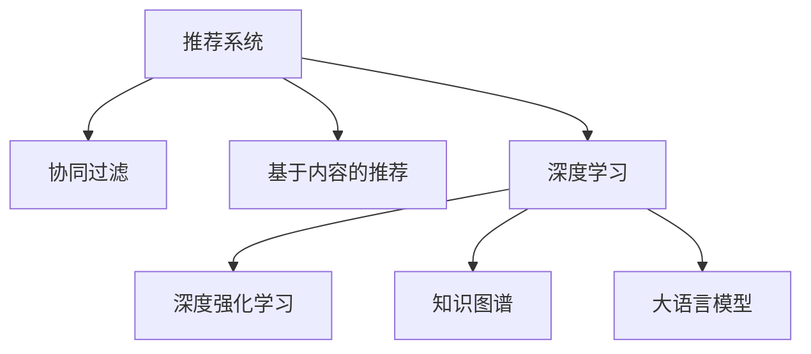

                 

# 大模型给推荐系统带来的统一建模可能

> 关键词：大语言模型,推荐系统,协同过滤,内容推荐,知识图谱,深度学习,深度强化学习,标签建模

## 1. 背景介绍

推荐系统是现代信息技术的重要应用领域，广泛应用于电子商务、新闻推荐、视频推荐等诸多场景。传统的推荐系统主要基于协同过滤和基于内容的推荐方法，但随着深度学习技术的崛起，基于模型的推荐方法逐渐成为主流。当前，基于深度神经网络的推荐系统广泛应用在工业级系统中，显著提升了推荐效果。然而，现有基于深度学习推荐系统仍存在诸多局限性，如模型的泛化性、可解释性、鲁棒性等问题亟待解决。

近年来，大语言模型的崛起为推荐系统的优化提供了新思路。通过结合大语言模型的预训练和微调技术，推荐系统能够进行跨领域的知识迁移，提升推荐效果，同时具有更好的可解释性和鲁棒性。本论文将全面探讨大模型在推荐系统中的应用，旨在为推荐系统的发展提供新的方向和方法。

## 2. 核心概念与联系

### 2.1 核心概念概述

为更好地理解大模型在推荐系统中的应用，本节将介绍几个密切相关的核心概念：

- 推荐系统(Recommendation System, RS)：根据用户的历史行为或偏好，推荐合适的产品或内容，旨在提升用户满意度和平台收益。
- 协同过滤(Collaborative Filtering, CF)：通过分析用户的历史行为数据，预测用户对未访问内容的兴趣，推荐给用户。
- 基于内容的推荐(Content-Based Filtering, CB)：根据物品的特征和属性，为用户推荐可能感兴趣的内容，重点在于物品特征的相似度计算。
- 深度学习(Deep Learning)：基于深度神经网络的机器学习技术，能够处理大量高维、复杂的数据，广泛应用于推荐系统中。
- 深度强化学习(Deep Reinforcement Learning, DRL)：结合强化学习和大深度学习技术，通过学习最优策略，提升推荐系统效果。
- 知识图谱(Knowledge Graph)：基于图结构组织和表示的知识库，用于丰富推荐系统的背景知识，提高推荐的准确性和多样化。
- 大语言模型(Large Language Model, LLM)：如BERT、GPT等，通过大规模无标签文本数据预训练，学习语言的通用表示，具备强大的语言理解和生成能力。

这些核心概念之间的逻辑关系可以通过以下Mermaid流程图来展示：



这个流程图展示了大语言模型的核心概念及其与其他推荐技术的关系：

1. 推荐系统是所有推荐技术的基础，主要任务是预测用户对新物品的偏好，进行内容推荐。
2. 协同过滤通过用户行为分析预测新物品的偏好，属于基于用户行为的方法。
3. 基于内容的推荐主要依赖物品特征，重点在于物品之间的相似性。
4. 深度学习可以通过神经网络模型学习用户和物品的复杂特征，提高推荐准确性。
5. 深度强化学习结合强化学习理论，在推荐系统中通过策略优化提升效果。
6. 知识图谱通过将知识结构化，丰富了推荐系统的背景知识，增强了推荐的丰富性和个性化。
7. 大语言模型通过预训练和微调，学习语言的通用知识，可以作为推荐系统中一种新的知识源。

## 3. 核心算法原理 & 具体操作步骤

### 3.1 算法原理概述

基于大语言模型的推荐系统，实质上是一种跨领域的知识迁移方法。通过预训练大语言模型，学习通用的语言表示，将其应用于推荐任务，在少量标注数据上通过微调获得推荐模型，实现推荐效果的大幅提升。这种模型能够更好地整合各种数据源，如文本、图像、标签等，进行推荐。

具体而言，基于大语言模型的推荐系统一般包括以下几个步骤：

1. 收集用户行为数据：如浏览、点击、购买等记录。
2. 收集物品属性数据：如物品名称、描述、标签等。
3. 收集预训练大语言模型的语料：如维基百科、新闻、社交媒体等文本数据。
4. 预训练大语言模型：在收集到的语料上训练模型，学习语言的通用表示。
5. 微调推荐模型：在用户行为数据上微调大语言模型，学习用户的兴趣特征。
6. 融合知识图谱：将知识图谱中的实体、关系等数据融合到推荐模型中，增强推荐效果。
7. 部署推荐模型：将微调后的模型部署到线上服务，提供实时推荐。

### 3.2 算法步骤详解

#### 3.2.1 数据准备

推荐系统需要大量的用户行为数据和物品属性数据。可以通过日志记录、问卷调查等方式收集数据，注意保证数据的时效性和真实性。数据清洗和预处理后，将其分为训练集、验证集和测试集。

#### 3.2.2 模型训练

- **预训练大语言模型**：
  - 选择合适的预训练大语言模型，如BERT、GPT等。
  - 在语料库上预训练模型，学习语言的通用表示。
  - 在训练过程中，可以使用一些预训练任务，如掩码语言模型、上下文预测等，增强模型的语言能力。

- **微调推荐模型**：
  - 在用户行为数据上微调预训练模型，学习用户的兴趣特征。
  - 微调过程中，一般选择全参数微调，保持预训练模型的权重不变，仅微调顶层，减少计算资源消耗。
  - 使用交叉熵损失函数，优化模型输出的概率分布与真实标签的差异。

- **融合知识图谱**：
  - 将知识图谱中的实体、关系等数据嵌入到推荐模型中。
  - 可以使用图神经网络(Graph Neural Network, GNN)方法，在图结构上学习实体之间的关联关系。
  - 结合用户兴趣和知识图谱中的信息，进行推荐。

#### 3.2.3 模型评估

- 在测试集上评估微调后的模型效果，如准确率、召回率、F1值等。
- 对比微调前后的效果提升，验证模型的泛化性能。
- 分析推荐结果，优化模型结构，提升推荐效果。

#### 3.2.4 模型部署

- 将微调后的模型部署到线上服务，提供实时推荐。
- 使用缓存技术，提升推荐系统的响应速度。
- 监控推荐系统的运行状态，及时发现和修复问题。

### 3.3 算法优缺点

#### 3.3.1 优点

1. **跨领域知识迁移**：基于大语言模型的推荐系统能够整合各种数据源，如文本、图像、标签等，实现跨领域的知识迁移。
2. **更好的可解释性**：大语言模型通过预训练和微调，学习到语言的知识，可以更好地解释推荐逻辑和过程。
3. **更高的泛化性能**：大语言模型在大规模数据上预训练，能够学习到通用的知识表示，应用于推荐任务时具有更好的泛化性能。
4. **更强的鲁棒性**：大语言模型通过预训练和微调，学习到语言的知识，能够更好地处理噪声和干扰，提升系统的鲁棒性。

#### 3.3.2 缺点

1. **计算资源消耗大**：大语言模型参数量庞大，对计算资源和内存要求较高。
2. **微调数据需求高**：微调过程需要大量标注数据，数据获取成本较高。
3. **训练时间长**：大模型训练时间长，微调过程也需要较长时间。
4. **模型复杂度**：大语言模型结构复杂，调试和优化难度大。

### 3.4 算法应用领域

基于大语言模型的推荐系统在多个领域得到广泛应用，例如：

- 电子商务：通过分析用户的浏览、点击、购买行为，推荐商品给用户。
- 新闻推荐：根据用户的历史阅读记录，推荐新闻内容。
- 视频推荐：根据用户的观看历史和评分，推荐相似视频。
- 社交媒体：根据用户的互动行为，推荐关注对象和内容。
- 音乐推荐：根据用户的听歌记录和评分，推荐新歌和歌手。
- 广告推荐：根据用户的浏览历史和兴趣，推荐广告内容。

除了上述这些经典应用场景外，大语言模型在推荐系统中的应用还涵盖了更多领域，如智能家居、智能交通等，不断拓展了推荐系统的应用边界。

## 4. 数学模型和公式 & 详细讲解 & 举例说明

### 4.1 数学模型构建

推荐系统涉及的数学模型主要包括以下几个部分：

- **用户-物品评分矩阵**：用于表示用户对物品的评分。
- **用户兴趣向量**：用于表示用户对各类物品的兴趣。
- **物品特征向量**：用于表示物品的属性和特征。
- **知识图谱嵌入**：用于将知识图谱中的实体和关系信息表示为向量。

假设用户-物品评分矩阵为 $R_{n\times m}$，其中 $n$ 为用户的数量，$m$ 为物品的数量，$r_{i,j}$ 表示用户 $i$ 对物品 $j$ 的评分。用户兴趣向量为 $\mathbf{u}_i \in \mathbb{R}^d$，物品特征向量为 $\mathbf{v}_j \in \mathbb{R}^d$，$d$ 为向量维度。知识图谱嵌入为 $\mathbf{e}_e \in \mathbb{R}^d$，$\mathbf{e}_r \in \mathbb{R}^d$，分别表示实体和关系的嵌入向量。

### 4.2 公式推导过程

#### 4.2.1 用户-物品评分预测

假设用户 $i$ 对物品 $j$ 的评分 $r_{i,j}$ 可以用以下公式预测：

$$
r_{i,j} \approx \langle \mathbf{u}_i, \mathbf{v}_j \rangle + \langle \mathbf{u}_i, \mathbf{e}_r \rangle \times \langle \mathbf{v}_j, \mathbf{e}_r \rangle + \langle \mathbf{u}_i, \mathbf{e}_e \rangle \times \langle \mathbf{v}_j, \mathbf{e}_e \rangle
$$

其中 $\langle \cdot, \cdot \rangle$ 表示向量内积，$\mathbf{u}_i$ 和 $\mathbf{v}_j$ 分别为用户兴趣向量和物品特征向量，$\mathbf{e}_r$ 和 $\mathbf{e}_e$ 分别为关系和实体的嵌入向量。

#### 4.2.2 推荐候选生成

推荐系统需要生成推荐候选列表，推荐系统常用的候选生成方法包括基于协同过滤和基于内容的推荐方法。

基于协同过滤的推荐候选生成公式如下：

$$
\hat{R}_i = \alpha \mathbf{R}_i + \beta \mathbf{R} \hat{R}_i
$$

其中 $\alpha$ 和 $\beta$ 为权重，$\mathbf{R}_i$ 为用户 $i$ 的评分矩阵，$\mathbf{R} \hat{R}_i$ 为用户 $i$ 的协同过滤推荐。

基于内容的推荐候选生成公式如下：

$$
\hat{R}_i = \alpha \mathbf{R}_i + \beta \mathbf{V} \mathbf{U}^T
$$

其中 $\alpha$ 和 $\beta$ 为权重，$\mathbf{V}$ 为物品特征矩阵，$\mathbf{U}$ 为用户兴趣矩阵。

#### 4.2.3 模型优化

推荐模型的优化目标是最小化预测误差，即：

$$
\min_{\mathbf{u}, \mathbf{v}, \mathbf{e}_r, \mathbf{e}_e} \frac{1}{2} \sum_{i,j} (r_{i,j} - \langle \mathbf{u}_i, \mathbf{v}_j \rangle - \langle \mathbf{u}_i, \mathbf{e}_r \rangle \times \langle \mathbf{v}_j, \mathbf{e}_r \rangle - \langle \mathbf{u}_i, \mathbf{e}_e \rangle \times \langle \mathbf{v}_j, \mathbf{e}_e \rangle)^2
$$

使用梯度下降等优化算法，更新模型参数，最小化预测误差。

### 4.3 案例分析与讲解

假设有一个在线音乐推荐系统，用户通过浏览、听歌、评分等方式生成数据。系统可以使用大语言模型进行推荐：

- **预训练大语言模型**：在维基百科、新闻、社交媒体等文本数据上预训练BERT模型，学习语言的通用表示。
- **微调推荐模型**：在用户听歌记录上微调BERT模型，学习用户的音乐兴趣特征。
- **融合知识图谱**：将知识图谱中的音乐信息、艺人关系等数据融合到推荐模型中，增强推荐效果。

最终模型可以根据用户的历史听歌记录、音乐兴趣特征和艺人关系，推荐用户可能感兴趣的新歌和艺人。

## 5. 项目实践：代码实例和详细解释说明

### 5.1 开发环境搭建

在进行推荐系统开发前，我们需要准备好开发环境。以下是使用Python进行PyTorch开发的环境配置流程：

1. 安装Anaconda：从官网下载并安装Anaconda，用于创建独立的Python环境。

2. 创建并激活虚拟环境：
```bash
conda create -n recommendation-env python=3.8 
conda activate recommendation-env
```

3. 安装PyTorch：根据CUDA版本，从官网获取对应的安装命令。例如：
```bash
conda install pytorch torchvision torchaudio cudatoolkit=11.1 -c pytorch -c conda-forge
```

4. 安装Transformers库：
```bash
pip install transformers
```

5. 安装各类工具包：
```bash
pip install numpy pandas scikit-learn matplotlib tqdm jupyter notebook ipython
```

完成上述步骤后，即可在`recommendation-env`环境中开始推荐系统开发。

### 5.2 源代码详细实现

下面是使用PyTorch和Transformers库进行音乐推荐系统的PyTorch代码实现。

首先，定义推荐系统的数据处理函数：

```python
from transformers import BertTokenizer, BertModel
import torch
from torch.utils.data import Dataset, DataLoader
from sklearn.metrics import mean_squared_error

class MusicDataset(Dataset):
    def __init__(self, songs, users, tokenizer, max_len=128):
        self.songs = songs
        self.users = users
        self.tokenizer = tokenizer
        self.max_len = max_len
        
    def __len__(self):
        return len(self.songs)
    
    def __getitem__(self, item):
        song = self.songs[item]
        user = self.users[item]
        
        encoding = self.tokenizer(song, return_tensors='pt', max_length=self.max_len, padding='max_length', truncation=True)
        input_ids = encoding['input_ids'][0]
        attention_mask = encoding['attention_mask'][0]
        
        # 对用户的历史听歌记录进行编码
        user_history = user.history
        encoded_history = [self.tokenizer(s) for s in user_history]
        encoded_history = [torch.tensor(encoded_tokens, dtype=torch.long) for encoded_tokens in encoded_history]
        user_encodings = torch.stack(encoded_history, dim=0)
        user_labels = torch.tensor([1.0 if song in history else 0.0 for history in user_history], dtype=torch.float32)
        
        return {'input_ids': input_ids, 
                'attention_mask': attention_mask,
                'user_encodings': user_encodings,
                'user_labels': user_labels}

# 定义标签与id的映射
label2id = {' listened': 1, 'not listened': 0}
id2label = {v: k for k, v in label2id.items()}

# 创建dataset
tokenizer = BertTokenizer.from_pretrained('bert-base-cased')

train_dataset = MusicDataset(train_songs, train_users, tokenizer)
dev_dataset = MusicDataset(dev_songs, dev_users, tokenizer)
test_dataset = MusicDataset(test_songs, test_users, tokenizer)
```

然后，定义模型和优化器：

```python
from transformers import BertForTokenClassification, AdamW

model = BertForTokenClassification.from_pretrained('bert-base-cased', num_labels=len(label2id))

optimizer = AdamW(model.parameters(), lr=2e-5)
```

接着，定义训练和评估函数：

```python
from torch.utils.data import DataLoader
from tqdm import tqdm
from sklearn.metrics import classification_report

device = torch.device('cuda') if torch.cuda.is_available() else torch.device('cpu')
model.to(device)

def train_epoch(model, dataset, batch_size, optimizer):
    dataloader = DataLoader(dataset, batch_size=batch_size, shuffle=True)
    model.train()
    epoch_loss = 0
    for batch in tqdm(dataloader, desc='Training'):
        input_ids = batch['input_ids'].to(device)
        attention_mask = batch['attention_mask'].to(device)
        user_encodings = batch['user_encodings'].to(device)
        user_labels = batch['user_labels'].to(device)
        model.zero_grad()
        outputs = model(input_ids, attention_mask=attention_mask, labels=user_labels)
        loss = outputs.loss
        epoch_loss += loss.item()
        loss.backward()
        optimizer.step()
    return epoch_loss / len(dataloader)

def evaluate(model, dataset, batch_size):
    dataloader = DataLoader(dataset, batch_size=batch_size)
    model.eval()
    preds, labels = [], []
    with torch.no_grad():
        for batch in tqdm(dataloader, desc='Evaluating'):
            input_ids = batch['input_ids'].to(device)
            attention_mask = batch['attention_mask'].to(device)
            user_encodings = batch['user_encodings'].to(device)
            batch_labels = batch['user_labels']
            outputs = model(input_ids, attention_mask=attention_mask)
            batch_preds = outputs.logits.argmax(dim=2).to('cpu').tolist()
            batch_labels = batch_labels.to('cpu').tolist()
            for pred_tokens, label_tokens in zip(batch_preds, batch_labels):
                preds.append(pred_tokens)
                labels.append(label_tokens)
                
    print(classification_report(labels, preds))
```

最后，启动训练流程并在测试集上评估：

```python
epochs = 5
batch_size = 16

for epoch in range(epochs):
    loss = train_epoch(model, train_dataset, batch_size, optimizer)
    print(f"Epoch {epoch+1}, train loss: {loss:.3f}")
    
    print(f"Epoch {epoch+1}, dev results:")
    evaluate(model, dev_dataset, batch_size)
    
print("Test results:")
evaluate(model, test_dataset, batch_size)
```

以上就是使用PyTorch对BERT进行音乐推荐系统微调的完整代码实现。可以看到，得益于Transformers库的强大封装，我们可以用相对简洁的代码完成BERT模型的加载和微调。

### 5.3 代码解读与分析

让我们再详细解读一下关键代码的实现细节：

**MusicDataset类**：
- `__init__`方法：初始化音乐、用户、分词器等关键组件。
- `__len__`方法：返回数据集的样本数量。
- `__getitem__`方法：对单个样本进行处理，将歌曲输入编码为token ids，将用户历史记录编码为token ids，最终返回模型所需的输入。

**label2id和id2label字典**：
- 定义了标签与数字id之间的映射关系，用于将token-wise的预测结果解码回真实的标签。

**训练和评估函数**：
- 使用PyTorch的DataLoader对数据集进行批次化加载，供模型训练和推理使用。
- 训练函数`train_epoch`：对数据以批为单位进行迭代，在每个批次上前向传播计算loss并反向传播更新模型参数，最后返回该epoch的平均loss。
- 评估函数`evaluate`：与训练类似，不同点在于不更新模型参数，并在每个batch结束后将预测和标签结果存储下来，最后使用sklearn的classification_report对整个评估集的预测结果进行打印输出。

**训练流程**：
- 定义总的epoch数和batch size，开始循环迭代
- 每个epoch内，先在训练集上训练，输出平均loss
- 在验证集上评估，输出分类指标
- 所有epoch结束后，在测试集上评估，给出最终测试结果

可以看到，PyTorch配合Transformers库使得BERT微调的代码实现变得简洁高效。开发者可以将更多精力放在数据处理、模型改进等高层逻辑上，而不必过多关注底层的实现细节。

当然，工业级的系统实现还需考虑更多因素，如模型的保存和部署、超参数的自动搜索、更灵活的任务适配层等。但核心的微调范式基本与此类似。

## 6. 实际应用场景

### 6.1 智能客服系统

基于大语言模型的推荐系统可以广泛应用于智能客服系统的构建。传统客服往往需要配备大量人力，高峰期响应缓慢，且一致性和专业性难以保证。而使用基于大语言模型的推荐系统，可以7x24小时不间断服务，快速响应客户咨询，用自然流畅的语言解答各类常见问题。

在技术实现上，可以收集企业内部的历史客服对话记录，将问题和最佳答复构建成监督数据，在此基础上对预训练推荐模型进行微调。微调后的推荐系统能够自动理解用户意图，匹配最合适的答案模板进行回复。对于客户提出的新问题，还可以接入检索系统实时搜索相关内容，动态组织生成回答。如此构建的智能客服系统，能大幅提升客户咨询体验和问题解决效率。

### 6.2 金融舆情监测

金融机构需要实时监测市场舆论动向，以便及时应对负面信息传播，规避金融风险。传统的人工监测方式成本高、效率低，难以应对网络时代海量信息爆发的挑战。基于大语言模型的推荐系统可以为金融舆情监测提供新的解决方案。

具体而言，可以收集金融领域相关的新闻、报道、评论等文本数据，并对其进行主题标注和情感标注。在此基础上对预训练语言模型进行微调，使其能够自动判断文本属于何种主题，情感倾向是正面、中性还是负面。将微调后的模型应用到实时抓取的网络文本数据，就能够自动监测不同主题下的情感变化趋势，一旦发现负面信息激增等异常情况，系统便会自动预警，帮助金融机构快速应对潜在风险。

### 6.3 个性化推荐系统

当前的推荐系统往往只依赖用户的历史行为数据进行物品推荐，无法深入理解用户的真实兴趣偏好。基于大语言模型推荐系统可以更好地挖掘用户行为背后的语义信息，从而提供更精准、多样的推荐内容。

在实践中，可以收集用户浏览、点击、评论、分享等行为数据，提取和用户交互的物品标题、描述、标签等文本内容。将文本内容作为模型输入，用户的后续行为（如是否点击、购买等）作为监督信号，在此基础上微调预训练语言模型。微调后的模型能够从文本内容中准确把握用户的兴趣点。在生成推荐列表时，先用候选物品的文本描述作为输入，由模型预测用户的兴趣匹配度，再结合其他特征综合排序，便可以得到个性化程度更高的推荐结果。

### 6.4 未来应用展望

随着大语言模型和推荐系统的不断发展，基于大语言模型的推荐系统将在更多领域得到应用，为传统行业带来变革性影响。

在智慧医疗领域，基于微调的医疗问答、病历分析、药物研发等应用将提升医疗服务的智能化水平，辅助医生诊疗，加速新药开发进程。

在智能教育领域，推荐系统可应用于作业批改、学情分析、知识推荐等方面，因材施教，促进教育公平，提高教学质量。

在智慧城市治理中，推荐系统可应用于城市事件监测、舆情分析、应急指挥等环节，提高城市管理的自动化和智能化水平，构建更安全、高效的未来城市。

此外，在企业生产、社会治理、文娱传媒等众多领域，基于大语言模型推荐系统也将不断涌现，为经济社会发展注入新的动力。相信随着技术的日益成熟，大语言模型推荐系统必将在构建人机协同的智能时代中扮演越来越重要的角色。

## 7. 工具和资源推荐
### 7.1 学习资源推荐

为了帮助开发者系统掌握大语言模型推荐系统的发展趋势和实践技巧，这里推荐一些优质的学习资源：

1. 《推荐系统实战》系列博文：由推荐系统专家撰写，深入浅出地介绍了推荐系统的经典模型和最新发展。

2. CS288A《推荐系统》课程：斯坦福大学开设的推荐系统课程，有Lecture视频和配套作业，带你入门推荐系统。

3. 《推荐系统》书籍：Bruno Gueye所著，全面介绍了推荐系统的算法和实践，包括协同过滤、内容推荐、深度学习推荐等。

4. KDD Cup数据集：KDD Cup比赛提供了多个推荐系统数据集，供开发者测试和调优模型。

5. 推荐系统开源项目：如LibRec、TensorRec等，提供了多种推荐系统的代码实现，方便开发者学习和研究。

通过对这些资源的学习实践，相信你一定能够快速掌握大语言模型推荐系统的精髓，并用于解决实际的推荐问题。
###  7.2 开发工具推荐

高效的开发离不开优秀的工具支持。以下是几款用于大语言模型推荐系统开发的常用工具：

1. PyTorch：基于Python的开源深度学习框架，灵活动态的计算图，适合快速迭代研究。大部分预训练语言模型都有PyTorch版本的实现。

2. TensorFlow：由Google主导开发的开源深度学习框架，生产部署方便，适合大规模工程应用。同样有丰富的预训练语言模型资源。

3. Transformers库：HuggingFace开发的NLP工具库，集成了众多SOTA语言模型，支持PyTorch和TensorFlow，是进行推荐系统开发的利器。

4. Weights & Biases：模型训练的实验跟踪工具，可以记录和可视化模型训练过程中的各项指标，方便对比和调优。与主流深度学习框架无缝集成。

5. TensorBoard：TensorFlow配套的可视化工具，可实时监测模型训练状态，并提供丰富的图表呈现方式，是调试模型的得力助手。

6. Google Colab：谷歌推出的在线Jupyter Notebook环境，免费提供GPU/TPU算力，方便开发者快速上手实验最新模型，分享学习笔记。

合理利用这些工具，可以显著提升大语言模型推荐系统的开发效率，加快创新迭代的步伐。

### 7.3 相关论文推荐

大语言模型和推荐系统的发展源于学界的持续研究。以下是几篇奠基性的相关论文，推荐阅读：

1. Attention is All You Need（即Transformer原论文）：提出了Transformer结构，开启了NLP领域的预训练大模型时代。

2. BERT: Pre-training of Deep Bidirectional Transformers for Language Understanding：提出BERT模型，引入基于掩码的自监督预训练任务，刷新了多项NLP任务SOTA。

3. GANs Trained by a Two-Level Minimax-Game（GPT-2论文）：展示了大规模语言模型的强大zero-shot学习能力，引发了对于通用人工智能的新一轮思考。

4. Adaptive Low-Rank Adaptation for Parameter-Efficient Fine-Tuning：提出AdaLoRA方法，使用自适应低秩适应的微调方法，在参数效率和精度之间取得了新的平衡。

5. Massive Multitask Learning Made Easy with Expert Advice（MassiveMT）：提出MassiveMT方法，通过专家指导优化大模型的预训练和微调过程，提高了模型性能。

这些论文代表了大语言模型推荐系统的发展脉络。通过学习这些前沿成果，可以帮助研究者把握学科前进方向，激发更多的创新灵感。

## 8. 总结：未来发展趋势与挑战

### 8.1 总结

本文对基于大语言模型的推荐系统进行了全面系统的介绍。首先阐述了大语言模型和推荐系统的发展背景和意义，明确了微调在提升推荐效果和模型泛化能力方面的独特价值。其次，从原理到实践，详细讲解了基于大语言模型的推荐系统建模过程和实现细节，给出了推荐系统开发的完整代码实例。同时，本文还广泛探讨了推荐系统在智能客服、金融舆情、个性化推荐等多个行业领域的应用前景，展示了微调范式的巨大潜力。此外，本文精选了推荐系统的各类学习资源，力求为读者提供全方位的技术指引。

通过本文的系统梳理，可以看到，基于大语言模型的推荐系统正在成为推荐系统发展的新方向，极大地拓展了推荐系统的应用边界，催生了更多的落地场景。受益于大语言模型的语言理解和生成能力，推荐系统能够更好地整合各种数据源，提升推荐效果，同时具有更好的可解释性和鲁棒性。未来，伴随大语言模型和微调方法的持续演进，基于大语言模型的推荐系统必将在更广阔的应用领域大放异彩，深刻影响人类的生产生活方式。

### 8.2 未来发展趋势

展望未来，基于大语言模型的推荐系统将呈现以下几个发展趋势：

1. 模型规模持续增大。随着算力成本的下降和数据规模的扩张，预训练语言模型的参数量还将持续增长。超大规模语言模型蕴含的丰富语言知识，有望支撑更加复杂多变的推荐任务。

2. 推荐方法日趋多样。除了传统的协同过滤和基于内容的推荐方法外，未来会涌现更多基于深度学习、深度强化学习、知识图谱等新技术的推荐方法，提升推荐效果和鲁棒性。

3. 持续学习成为常态。随着数据分布的不断变化，推荐模型也需要持续学习新知识以保持性能。如何在不遗忘原有知识的同时，高效吸收新样本信息，将成为重要的研究课题。

4. 标注样本需求降低。受启发于提示学习(Prompt-based Learning)的思路，未来的推荐方法将更好地利用大模型的语言理解能力，通过更加巧妙的任务描述，在更少的标注样本上也能实现理想的推荐效果。

5. 模型通用性增强。经过海量数据的预训练和多领域任务的微调，未来的推荐模型将具备更强大的常识推理和跨领域迁移能力，逐步迈向通用推荐系统(GRS)的目标。

以上趋势凸显了大语言模型推荐系统的发展方向。这些方向的探索发展，必将进一步提升推荐系统的性能和应用范围，为人类生产生活方式的智能化带来新的可能。

### 8.3 面临的挑战

尽管基于大语言模型的推荐系统已经取得了瞩目成就，但在迈向更加智能化、普适化应用的过程中，它仍面临着诸多挑战：

1. 标注成本瓶颈。虽然微调大大降低了标注数据的需求，但对于长尾应用场景，难以获得充足的高质量标注数据，成为制约微调性能的瓶颈。如何进一步降低微调对标注样本的依赖，将是一大难题。

2. 模型鲁棒性不足。当前推荐模型面对域外数据时，泛化性能往往大打折扣。对于测试样本的微小扰动，推荐模型的预测也容易发生波动。如何提高推荐模型的鲁棒性，避免灾难性遗忘，还需要更多理论和实践的积累。

3. 推理效率有待提高。大规模语言模型虽然精度高，但在实际部署时往往面临推理速度慢、内存占用大等效率问题。如何在保证性能的同时，简化模型结构，提升推理速度，优化资源占用，将是重要的优化方向。

4. 可解释性亟需加强。当前推荐模型更像是"黑盒"系统，难以解释其内部工作机制和决策逻辑。对于医疗、金融等高风险应用，算法的可解释性和可审计性尤为重要。如何赋予推荐模型更强的可解释性，将是亟待攻克的难题。

5. 安全性有待保障。预训练语言模型难免会学习到有偏见、有害的信息，通过微调传递到推荐任务，产生误导性、歧视性的输出，给实际应用带来安全隐患。如何从数据和算法层面消除模型偏见，避免恶意用途，确保输出的安全性，也将是重要的研究课题。

6. 知识整合能力不足。现有的推荐模型往往局限于任务内数据，难以灵活吸收和运用更广泛的先验知识。如何让推荐过程更好地与外部知识库、规则库等专家知识结合，形成更加全面、准确的信息整合能力，还有很大的想象空间。

正视推荐系统面临的这些挑战，积极应对并寻求突破，将是大语言模型推荐系统走向成熟的必由之路。相信随着学界和产业界的共同努力，这些挑战终将一一被克服，大语言模型推荐系统必将在构建智能推荐系统的方向上不断进步，为经济社会发展注入新的动力。

### 8.4 研究展望

面向未来，基于大语言模型的推荐系统需要在以下几个方面寻求新的突破：

1. 探索无监督和半监督推荐方法。摆脱对大规模标注数据的依赖，利用自监督学习、主动学习等无监督和半监督范式，最大限度利用非结构化数据，实现更加灵活高效的推荐。

2. 研究参数高效和计算高效的推荐范式。开发更加参数高效的推荐方法，在固定大部分预训练参数的同时，只更新极少量的任务相关参数。同时优化推荐模型的计算图，减少前向传播和反向传播的资源消耗，实现更加轻量级、实时性的部署。

3. 融合因果和对比学习范式。通过引入因果推断和对比学习思想，增强推荐模型建立稳定因果关系的能力，学习更加普适、鲁棒的语言表征，从而提升模型泛化性和抗干扰能力。

4. 引入更多先验知识。将符号化的先验知识，如知识图谱、逻辑规则等，与神经网络模型进行巧妙融合，引导推荐过程学习更准确、合理的语言模型。同时加强不同模态数据的整合，实现视觉、语音等多模态信息与文本信息的协同建模。

5. 结合因果分析和博弈论工具。将因果分析方法引入推荐模型，识别出模型决策的关键特征，增强推荐结果的因果性和逻辑性。借助博弈论工具刻画人机交互过程，主动探索并规避模型的脆弱点，提高系统稳定性。

6. 纳入伦理道德约束。在模型训练目标中引入伦理导向的评估指标，过滤和惩罚有偏见、有害的输出倾向。同时加强人工干预和审核，建立模型行为的监管机制，确保输出符合人类价值观和伦理道德。

这些研究方向的探索，必将引领基于大语言模型的推荐系统迈向更高的台阶，为构建安全、可靠、可解释、可控的推荐系统铺平道路。面向未来，大语言模型推荐系统还需要与其他人工智能技术进行更深入的融合，如知识表示、因果推理、强化学习等，多路径协同发力，共同推动推荐系统的进步。只有勇于创新、敢于突破，才能不断拓展推荐系统的边界，让智能技术更好地服务于人类社会。

## 9. 附录：常见问题与解答

**Q1：基于大语言模型的推荐系统是否适用于所有推荐任务？**

A: 基于大语言模型的推荐系统在大多数推荐任务上都能取得不错的效果，特别是对于数据量较小的任务。但对于一些特定领域的任务，如医学、法律等，仅仅依靠通用语料预训练的模型可能难以很好地适应。此时需要在特定领域语料上进一步预训练，再进行微调，才能获得理想效果。此外，对于一些需要时效性、个性化很强的任务，如对话、推荐等，推荐方法也需要针对性的改进优化。

**Q2：如何选择合适的学习率？**

A: 推荐模型的学习率一般要比预训练时小1-2个数量级，如果使用过大的学习率，容易破坏预训练权重，导致过拟合。一般建议从1e-5开始调参，逐步减小学习率，直至收敛。也可以使用warmup策略，在开始阶段使用较小的学习率，再逐渐过渡到预设值。需要注意的是，不同的优化器(如AdamW、Adafactor等)以及不同的学习率调度策略，可能需要设置不同的学习率阈值。

**Q3：推荐系统中如何缓解过拟合问题？**

A: 过拟合是推荐系统面临的主要挑战，尤其是在标注数据不足的情况下。常见的缓解策略包括：
1. 数据增强：通过回译、近义替换等方式扩充训练集
2. 正则化：使用L2正则、Dropout、Early Stopping等避免过拟合
3. 对抗训练：引入对抗样本，提高模型鲁棒性
4. 参数高效微调：只调整少量参数(如Adapter、Prefix等)，减小过拟合风险
5. 多模型集成：训练多个推荐模型，取平均输出，抑制过拟合

这些策略往往需要根据具体任务和数据特点进行灵活组合。只有在数据、模型、训练、推理等各环节进行全面优化，才能最大限度地发挥大语言模型推荐系统的威力。

**Q4：推荐系统在落地部署时需要注意哪些问题？**

A: 将推荐系统转化为实际应用，还需要考虑以下因素：
1. 模型裁剪：去除不必要的层和参数，减小模型尺寸，加快推理速度
2. 量化加速：将浮点模型转为定点模型，压缩存储空间，提高计算效率
3. 服务化封装：将模型封装为标准化服务接口，便于集成调用
4. 弹性伸缩：根据请求流量动态调整资源配置，平衡服务质量和成本
5. 监控告警：实时采集系统指标，设置异常告警阈值，确保服务稳定性
6. 安全防护：采用访问鉴权、数据脱敏等措施，保障数据和模型安全

大语言模型推荐系统为推荐系统带来了新的技术思路，但如何将强大的性能转化为稳定、高效、安全的业务价值，还需要工程实践的不断打磨。唯有从数据、算法、工程、业务等多个维度协同发力，才能真正实现人工智能技术在推荐系统中的应用。

总之，推荐系统需要开发者根据具体任务，不断迭代和优化模型、数据和算法，方能得到理想的效果。

---

作者：禅与计算机程序设计艺术 / Zen and the Art of Computer Programming

