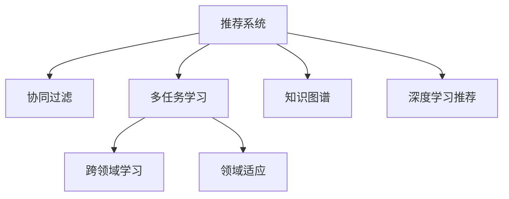

                 

# 大模型视角下推荐系统的多任务学习应用创新

> 关键词：大模型、推荐系统、多任务学习、深度学习、协同过滤、跨领域学习、领域适应、知识图谱

## 1. 背景介绍

### 1.1 问题由来
推荐系统作为互联网应用的重要组成部分，已经广泛应用于电商、视频、社交、阅读等多个领域。推荐系统通过分析用户的历史行为和偏好，为其推荐个性化的产品和服务，极大提升了用户体验和转化率。但传统的协同过滤和基于内容的推荐方法，往往只能学习用户偏好在特定领域的表现，难以充分利用用户多模态的信息和兴趣变化，推荐效果不佳。

近年来，随着深度学习技术的发展，尤其是预训练语言模型的涌现，推荐系统也开始借鉴其思想进行创新。大模型能够从海量数据中学习到丰富的知识，借助多任务学习范式，可以在不同推荐任务之间实现知识迁移，提升推荐系统的跨领域适应能力和泛化性能。

### 1.2 问题核心关键点
大模型在推荐系统中的应用，通过多任务学习实现以下创新：
- 多领域学习：基于用户在不同领域的行为数据，学习跨领域的协同推荐，推荐更多相关产品和服务。
- 多模态融合：集成用户的多模态信息，包括行为数据、评价数据、社交网络数据等，进行深度特征挖掘和推荐。
- 跨任务迁移：在推荐系统中的不同任务之间，如推荐商品、推荐视频、推荐文章等，共享学习到的知识，提升推荐效果。
- 领域适应：针对不同领域的推荐任务，重新适配预训练模型，提升其在特定领域上的表现。
- 深度知识图谱：结合知识图谱和深度学习模型，进一步提升推荐系统的理解和推理能力。

这些创新策略的融合，使得推荐系统能够更好地适应多变的用户需求和市场环境，提供更个性化、更准确的推荐服务。

### 1.3 问题研究意义
多任务学习在大模型推荐系统中的应用，不仅提升了推荐系统的精准度和效果，还带来了新的技术和方法挑战。研究多任务学习在推荐系统中的应用，对于推动推荐系统向更深层次智能化迈进，具有重要意义：

1. 提升推荐效果：通过多任务学习，推荐系统可以学习到更全面的用户兴趣和行为模式，推荐效果更精准。
2. 增强跨领域泛化：多任务学习使得推荐系统具备更强的领域泛化能力，能够推荐更多相关产品，提升用户满意度。
3. 促进技术创新：多任务学习带动了推荐系统跨学科的研究方向，推动了NLP、图论、优化算法等领域的技术进步。
4. 加速行业应用：多任务学习为推荐系统的工程落地提供了新的思路，推动了更多场景的推荐应用。
5. 带来经济效益：推荐系统通过精准推荐，降低了营销成本，提升了用户体验和满意度，为企业带来可观的经济效益。

## 2. 核心概念与联系

### 2.1 核心概念概述

为更好地理解多任务学习在推荐系统中的应用，本节将介绍几个密切相关的核心概念：

- 推荐系统(Recommendation System)：通过分析用户历史行为和偏好，为用户推荐个性化的产品或服务。常见的推荐方法包括协同过滤、基于内容的推荐、深度学习推荐等。

- 多任务学习(Multi-task Learning)：在同时训练多个相关任务的过程中，共享模型参数，提高不同任务之间的泛化能力。

- 协同过滤(Collaborative Filtering)：利用用户和物品之间的共现关系，推荐用户可能感兴趣的物品。包括基于用户的协同过滤和基于物品的协同过滤。

- 知识图谱(Knowledge Graph)：通过有向图结构表示实体、关系和属性的知识结构，用于增强推荐系统的推理和理解能力。

- 领域适应(Domain Adaptation)：将在一个领域学习到的知识迁移到另一个领域，使得模型在特定领域上表现更好。

这些核心概念之间的逻辑关系可以通过以下Mermaid流程图来展示：



这个流程图展示了大模型在推荐系统中的应用范式：

1. 推荐系统通过多任务学习从不同推荐任务中学习知识。
2. 跨领域学习使得推荐系统具备更强的泛化能力，推荐更多相关产品。
3. 领域适应使得推荐系统能够针对特定领域优化性能。
4. 知识图谱结合深度学习，进一步提升推荐系统的理解和推理能力。

## 3. 核心算法原理 & 具体操作步骤
### 3.1 算法原理概述

基于大模型的多任务学习推荐系统，通过在多个推荐任务上共享模型参数，实现知识迁移和泛化。其核心思想是：将预训练模型当作初始化参数，通过在多个推荐任务上进行有监督学习，使得模型学习到不同任务间的知识共性，从而在特定推荐任务上取得更好的性能。

形式化地，假设预训练模型为 $M_{\theta}$，其中 $\theta$ 为预训练得到的模型参数。给定多个推荐任务 $T_1, T_2, \dots, T_n$ 的标注数据集 $D=\{(x_i, y_i)\}_{i=1}^N$，多任务学习的优化目标是最小化各个任务的经验风险之和，即：

$$
\hat{\theta}=\mathop{\arg\min}_{\theta} \sum_{j=1}^n \mathcal{L}_j(M_{\theta},D_j)
$$

其中 $\mathcal{L}_j$ 为针对任务 $T_j$ 设计的损失函数，用于衡量模型预测输出与真实标签之间的差异。常见的损失函数包括交叉熵损失、均方误差损失等。

通过梯度下降等优化算法，多任务学习过程不断更新模型参数 $\theta$，最小化损失函数 $\mathcal{L}$，使得模型输出逼近真实标签。由于 $\theta$ 已经通过预训练获得了较好的初始化，因此即便在多个小规模数据集 $D_j$ 上进行多任务学习，也能较快收敛到理想的模型参数 $\hat{\theta}$。

### 3.2 算法步骤详解

基于大模型的多任务学习推荐系统一般包括以下几个关键步骤：

**Step 1: 准备预训练模型和数据集**
- 选择合适的预训练语言模型 $M_{\theta}$ 作为初始化参数，如BERT、GPT等。
- 准备各个推荐任务 $T_1, T_2, \dots, T_n$ 的标注数据集 $D=\{(x_i, y_i)\}_{i=1}^N$，划分为训练集、验证集和测试集。一般要求标注数据与预训练数据的分布不要差异过大。

**Step 2: 添加任务适配层**
- 根据任务类型，在预训练模型顶层设计合适的输出层和损失函数。
- 对于推荐商品、推荐视频等分类任务，通常在顶层添加线性分类器和交叉熵损失函数。
- 对于推荐序列、推荐路径等序列生成任务，使用语言模型的解码器输出概率分布，并以负对数似然为损失函数。

**Step 3: 设置多任务超参数**
- 选择合适的优化算法及其参数，如 AdamW、SGD 等，设置学习率、批大小、迭代轮数等。
- 设置正则化技术及强度，包括权重衰减、Dropout、Early Stopping等。
- 确定冻结预训练参数的策略，如仅微调顶层，或全部参数都参与多任务学习。

**Step 4: 执行梯度训练**
- 将训练集数据分批次输入模型，前向传播计算损失函数。
- 反向传播计算参数梯度，根据设定的优化算法和学习率更新模型参数。
- 周期性在验证集上评估模型性能，根据性能指标决定是否触发 Early Stopping。
- 重复上述步骤直到满足预设的迭代轮数或 Early Stopping 条件。

**Step 5: 测试和部署**
- 在测试集上评估多任务学习后模型 $M_{\hat{\theta}}$ 的性能，对比多任务学习前后的精度提升。
- 使用多任务学习后的模型对新样本进行推理预测，集成到实际的应用系统中。
- 持续收集新的数据，定期重新多任务学习模型，以适应数据分布的变化。

以上是基于大模型的多任务学习推荐系统的一般流程。在实际应用中，还需要针对具体任务的特点，对多任务学习过程的各个环节进行优化设计，如改进训练目标函数，引入更多的正则化技术，搜索最优的超参数组合等，以进一步提升模型性能。

### 3.3 算法优缺点

基于大模型的多任务学习推荐方法具有以下优点：
1. 提高推荐精度：通过多任务学习，模型可以学习到不同推荐任务之间的知识共性，提升推荐精准度。
2. 增强泛化能力：多任务学习使得模型具备更强的泛化能力，能够在不同推荐任务上取得一致的优化效果。
3. 降低成本：多任务学习可以减少标注数据的需求，使用少量数据训练出高性能的推荐模型。
4. 提升模型效率：多任务学习可以共享预训练模型的参数，减少重复训练的资源消耗。
5. 支持多模态融合：多任务学习可以集成用户的多模态信息，提升推荐效果。

同时，该方法也存在一定的局限性：
1. 数据依赖性强：多任务学习的效果很大程度上取决于标注数据的质量和数量，获取高质量标注数据的成本较高。
2. 参数规模大：多任务学习模型参数规模较大，训练和推理的计算成本较高。
3. 模型复杂度高：多任务学习需要同时训练多个任务，模型结构和训练过程复杂。
4. 泛化能力受限：如果推荐任务之间分布差异较大，多任务学习的性能提升有限。
5. 迁移能力不足：多任务学习主要依赖标注数据，在特定领域的迁移能力有限。

尽管存在这些局限性，但就目前而言，多任务学习在大模型推荐系统中的应用已成为主流范式。未来相关研究的重点在于如何进一步降低多任务学习对标注数据的依赖，提高模型的少样本学习和跨领域迁移能力，同时兼顾可解释性和伦理安全性等因素。

### 3.4 算法应用领域

基于大模型的多任务学习推荐方法，已经在推荐系统领域得到了广泛的应用，覆盖了电商、视频、社交、阅读等多个场景，例如：

- 商品推荐：根据用户浏览历史和点击行为，推荐可能感兴趣的商品。通过多任务学习，提升商品推荐的多样性和相关性。
- 视频推荐：根据用户观看历史和评分数据，推荐可能喜欢的视频。通过多任务学习，提升视频推荐的准确性和个性化。
- 文章推荐：根据用户阅读历史和评论数据，推荐可能感兴趣的文章。通过多任务学习，提升文章推荐的覆盖面和质量。
- 音乐推荐：根据用户听歌历史和评分数据，推荐可能喜欢的音乐。通过多任务学习，提升音乐推荐的个性化和多样性。

除了上述这些经典任务外，多任务学习在大模型推荐系统中的应用还在不断扩展，如跨平台推荐、动态推荐、实时推荐等，为推荐系统带来了更多的创新和发展。

## 4. 数学模型和公式 & 详细讲解  
### 4.1 数学模型构建

本节将使用数学语言对基于大模型的多任务学习推荐过程进行更加严格的刻画。

记预训练语言模型为 $M_{\theta}$，其中 $\theta$ 为预训练得到的模型参数。假设推荐系统中的任务数为 $n$，各个推荐任务 $T_1, T_2, \dots, T_n$ 的训练集为 $D=\{(x_i, y_i)\}_{i=1}^N$，其中 $x_i$ 为输入特征，$y_i$ 为推荐结果。

定义模型 $M_{\theta}$ 在数据样本 $(x,y)$ 上的损失函数为 $\ell(M_{\theta}(x),y)$，则在各个推荐任务上的经验风险为：

$$
\mathcal{L}(\theta) = \sum_{j=1}^n \frac{1}{N_j}\sum_{i=1}^{N_j} \ell(M_{\theta}(x_i),y_i)
$$

其中 $N_j$ 为任务 $T_j$ 的样本数量。

多任务学习的优化目标是最小化各个任务的经验风险之和，即找到最优参数：

$$
\theta^* = \mathop{\arg\min}_{\theta} \sum_{j=1}^n \mathcal{L}_j(\theta)
$$

在实践中，我们通常使用基于梯度的优化算法（如SGD、Adam等）来近似求解上述最优化问题。设 $\eta$ 为学习率，$\lambda$ 为正则化系数，则参数的更新公式为：

$$
\theta \leftarrow \theta - \eta \sum_{j=1}^n \nabla_{\theta}\mathcal{L}_j(\theta) - \eta\lambda\theta
$$

其中 $\nabla_{\theta}\mathcal{L}_j(\theta)$ 为损失函数对参数 $\theta$ 的梯度，可通过反向传播算法高效计算。

### 4.2 公式推导过程

以下我们以推荐商品任务为例，推导多任务学习损失函数及其梯度的计算公式。

假设模型 $M_{\theta}$ 在输入 $x$ 上的输出为 $\hat{y}=M_{\theta}(x) \in [0,1]$，表示商品推荐模型预测用户购买该商品的概率。真实标签 $y \in \{0,1\}$。则二分类交叉熵损失函数定义为：

$$
\ell(M_{\theta}(x),y) = -[y\log \hat{y} + (1-y)\log (1-\hat{y})]
$$

将其代入经验风险公式，得：

$$
\mathcal{L}(\theta) = -\sum_{j=1}^n \frac{1}{N_j}\sum_{i=1}^{N_j} [y_i\log M_{\theta}(x_i)+(1-y_i)\log(1-M_{\theta}(x_i))]
$$

根据链式法则，损失函数对参数 $\theta_k$ 的梯度为：

$$
\frac{\partial \mathcal{L}(\theta)}{\partial \theta_k} = -\sum_{j=1}^n \frac{1}{N_j}\sum_{i=1}^{N_j} (\frac{y_i}{M_{\theta}(x_i)}-\frac{1-y_i}{1-M_{\theta}(x_i)}) \frac{\partial M_{\theta}(x_i)}{\partial \theta_k}
$$

其中 $\frac{\partial M_{\theta}(x_i)}{\partial \theta_k}$ 可进一步递归展开，利用自动微分技术完成计算。

在得到损失函数的梯度后，即可带入参数更新公式，完成模型的迭代优化。重复上述过程直至收敛，最终得到适应多个推荐任务的最优模型参数 $\theta^*$。

## 5. 项目实践：代码实例和详细解释说明
### 5.1 开发环境搭建

在进行多任务学习推荐实践前，我们需要准备好开发环境。以下是使用Python进行PyTorch开发的环境配置流程：

1. 安装Anaconda：从官网下载并安装Anaconda，用于创建独立的Python环境。

2. 创建并激活虚拟环境：
```bash
conda create -n pytorch-env python=3.8 
conda activate pytorch-env
```

3. 安装PyTorch：根据CUDA版本，从官网获取对应的安装命令。例如：
```bash
conda install pytorch torchvision torchaudio cudatoolkit=11.1 -c pytorch -c conda-forge
```

4. 安装Transformers库：
```bash
pip install transformers
```

5. 安装各类工具包：
```bash
pip install numpy pandas scikit-learn matplotlib tqdm jupyter notebook ipython
```

完成上述步骤后，即可在`pytorch-env`环境中开始多任务学习推荐实践。

### 5.2 源代码详细实现

下面我们以推荐商品任务为例，给出使用Transformers库对BERT模型进行多任务学习的PyTorch代码实现。

首先，定义推荐任务的数据处理函数：

```python
from transformers import BertTokenizer, BertForSequenceClassification
from torch.utils.data import Dataset
import torch

class RecommendationDataset(Dataset):
    def __init__(self, items, user_ids, labels, tokenizer, max_len=128):
        self.items = items
        self.user_ids = user_ids
        self.labels = labels
        self.tokenizer = tokenizer
        self.max_len = max_len
        
    def __len__(self):
        return len(self.items)
    
    def __getitem__(self, item):
        item = self.items[item]
        user_id = self.user_ids[item]
        label = self.labels[item]
        
        encoding = self.tokenizer(item, return_tensors='pt', max_length=self.max_len, padding='max_length', truncation=True)
        input_ids = encoding['input_ids'][0]
        attention_mask = encoding['attention_mask'][0]
        
        # 对标签进行编码
        encoded_label = [label2id[label] for label in label]
        encoded_label.extend([label2id['Negative']] * (self.max_len - len(encoded_label)))
        labels = torch.tensor(encoded_label, dtype=torch.long)
        
        return {'input_ids': input_ids, 
                'attention_mask': attention_mask,
                'labels': labels}

# 标签与id的映射
label2id = {'Positive': 1, 'Negative': 0}
id2label = {v: k for k, v in label2id.items()}

# 创建dataset
tokenizer = BertTokenizer.from_pretrained('bert-base-cased')

train_dataset = RecommendationDataset(train_items, train_user_ids, train_labels, tokenizer)
dev_dataset = RecommendationDataset(dev_items, dev_user_ids, dev_labels, tokenizer)
test_dataset = RecommendationDataset(test_items, test_user_ids, test_labels, tokenizer)
```

然后，定义模型和优化器：

```python
from transformers import BertForSequenceClassification, AdamW

model = BertForSequenceClassification.from_pretrained('bert-base-cased', num_labels=len(label2id))

optimizer = AdamW(model.parameters(), lr=2e-5)
```

接着，定义训练和评估函数：

```python
from torch.utils.data import DataLoader
from tqdm import tqdm
from sklearn.metrics import accuracy_score

device = torch.device('cuda') if torch.cuda.is_available() else torch.device('cpu')
model.to(device)

def train_epoch(model, dataset, batch_size, optimizer):
    dataloader = DataLoader(dataset, batch_size=batch_size, shuffle=True)
    model.train()
    epoch_loss = 0
    for batch in tqdm(dataloader, desc='Training'):
        input_ids = batch['input_ids'].to(device)
        attention_mask = batch['attention_mask'].to(device)
        labels = batch['labels'].to(device)
        model.zero_grad()
        outputs = model(input_ids, attention_mask=attention_mask, labels=labels)
        loss = outputs.loss
        epoch_loss += loss.item()
        loss.backward()
        optimizer.step()
    return epoch_loss / len(dataloader)

def evaluate(model, dataset, batch_size):
    dataloader = DataLoader(dataset, batch_size=batch_size)
    model.eval()
    preds, labels = [], []
    with torch.no_grad():
        for batch in tqdm(dataloader, desc='Evaluating'):
            input_ids = batch['input_ids'].to(device)
            attention_mask = batch['attention_mask'].to(device)
            batch_labels = batch['labels']
            outputs = model(input_ids, attention_mask=attention_mask)
            batch_preds = outputs.logits.argmax(dim=2).to('cpu').tolist()
            batch_labels = batch_labels.to('cpu').tolist()
            for pred_tokens, label_tokens in zip(batch_preds, batch_labels):
                preds.append(pred_tokens[:len(label_tokens)])
                labels.append(label_tokens)
                
    print('Accuracy: ', accuracy_score(labels, preds))
```

最后，启动训练流程并在测试集上评估：

```python
epochs = 5
batch_size = 16

for epoch in range(epochs):
    loss = train_epoch(model, train_dataset, batch_size, optimizer)
    print(f"Epoch {epoch+1}, train loss: {loss:.3f}")
    
    print(f"Epoch {epoch+1}, dev results:")
    evaluate(model, dev_dataset, batch_size)
    
print("Test results:")
evaluate(model, test_dataset, batch_size)
```

以上就是使用PyTorch对BERT进行推荐任务多任务学习的完整代码实现。可以看到，得益于Transformers库的强大封装，我们可以用相对简洁的代码完成BERT模型的加载和训练。

### 5.3 代码解读与分析

让我们再详细解读一下关键代码的实现细节：

**RecommendationDataset类**：
- `__init__`方法：初始化商品、用户、标签、分词器等关键组件。
- `__len__`方法：返回数据集的样本数量。
- `__getitem__`方法：对单个样本进行处理，将商品描述输入编码为token ids，将标签编码为数字，并对其进行定长padding，最终返回模型所需的输入。

**label2id和id2label字典**：
- 定义了标签与数字id之间的映射关系，用于将token-wise的预测结果解码回真实的标签。

**训练和评估函数**：
- 使用PyTorch的DataLoader对数据集进行批次化加载，供模型训练和推理使用。
- 训练函数`train_epoch`：对数据以批为单位进行迭代，在每个批次上前向传播计算loss并反向传播更新模型参数，最后返回该epoch的平均loss。
- 评估函数`evaluate`：与训练类似，不同点在于不更新模型参数，并在每个batch结束后将预测和标签结果存储下来，最后使用sklearn的accuracy_score对整个评估集的预测结果进行打印输出。

**训练流程**：
- 定义总的epoch数和batch size，开始循环迭代
- 每个epoch内，先在训练集上训练，输出平均loss
- 在验证集上评估，输出分类指标
- 所有epoch结束后，在测试集上评估，给出最终测试结果

可以看到，PyTorch配合Transformers库使得BERT多任务学习的代码实现变得简洁高效。开发者可以将更多精力放在数据处理、模型改进等高层逻辑上，而不必过多关注底层的实现细节。

当然，工业级的系统实现还需考虑更多因素，如模型的保存和部署、超参数的自动搜索、更灵活的任务适配层等。但核心的多任务学习范式基本与此类似。

## 6. 实际应用场景
### 6.1 电商推荐系统

基于大模型多任务学习技术的电商推荐系统，可以显著提升用户购物体验和满意度。传统电商推荐系统主要基于协同过滤和基于内容的推荐方法，难以充分利用用户多模态信息，推荐效果有限。

在实践中，可以通过多任务学习融合用户的历史行为、评价、商品属性等多模态信息，提升推荐系统的综合理解能力。具体而言，可以收集用户历史浏览、点击、购买等行为数据，结合商品评价、标签等元数据，进行联合建模。通过多任务学习训练出的模型，能够更好地理解用户的兴趣和偏好，推荐更多相关商品，提升用户购物体验。

### 6.2 视频推荐系统

基于多任务学习的视频推荐系统，能够为用户提供更加个性化和多样化的视频内容推荐。视频推荐系统通常会面临长尾视频内容多、用户兴趣变化快等挑战，传统协同过滤方法难以应对。

多任务学习可以融合用户的观看历史、评分、互动等多种信息，学习到更加精细的用户兴趣和行为模式。在视频推荐过程中，通过多任务学习训练出的模型，能够从长尾视频内容中挖掘出更多相关视频，提升推荐效果。同时，多任务学习还能实现跨视频领域的推荐，如电影、电视剧、综艺等，为用户提供更丰富多样的观看选择。

### 6.3 文章推荐系统

基于多任务学习的文章推荐系统，能够为用户推荐更加相关、有价值的阅读内容。传统文章推荐系统主要基于用户的历史阅读行为，难以发现用户隐含的兴趣和偏好。

多任务学习可以融合用户的阅读历史、评论、分享等多种信息，学习到更加全面的用户兴趣和行为模式。在文章推荐过程中，通过多任务学习训练出的模型，能够从海量文章中挖掘出更多相关文章，提升推荐效果。同时，多任务学习还能实现跨领域的推荐，如科技、文学、生活等，为用户提供更广泛的知识和信息。

### 6.4 未来应用展望

随着大模型和微调方法的不断发展，基于多任务学习的大模型推荐系统将在更多领域得到应用，为各行各业带来变革性影响。

在智慧医疗领域，基于多任务学习的大模型推荐系统可以提供个性化的医疗咨询和诊疗建议，辅助医生诊断和治疗，提升医疗服务的智能化水平。

在智能教育领域，多任务学习推荐系统可以为用户提供个性化的学习资源和教学建议，促进教育公平，提高教学质量。

在智慧城市治理中，多任务学习推荐系统可以用于城市事件监测、舆情分析、应急指挥等环节，提高城市管理的自动化和智能化水平，构建更安全、高效的未来城市。

此外，在企业生产、社会治理、文娱传媒等众多领域，基于多任务学习的大模型推荐系统也将不断涌现，为传统行业数字化转型升级提供新的技术路径。相信随着技术的日益成熟，多任务学习范式将成为推荐系统的重要发展方向，推动人工智能技术在更多场景的落地应用。

## 7. 工具和资源推荐
### 7.1 学习资源推荐

为了帮助开发者系统掌握大模型多任务学习推荐系统的理论基础和实践技巧，这里推荐一些优质的学习资源：

1. 《深度学习推荐系统》系列博文：由深度学习领域专家撰写，深入浅出地介绍了推荐系统的经典方法和前沿技术。

2. 《Recommender Systems》课程：斯坦福大学开设的推荐系统课程，有Lecture视频和配套作业，带你入门推荐系统的基本概念和经典模型。

3. 《推荐系统实战》书籍：基于Kaggle竞赛的实战经验，结合TensorFlow和PyTorch等框架，提供了丰富的推荐系统开发案例。

4. RecSys开源项目：推荐系统开源项目，涵盖各类推荐算法和评估方法，助力推荐系统技术发展。

5. LibRec开源项目：推荐系统工具库，提供了多任务学习、协同过滤、深度学习等多种推荐算法，适合实际工程应用。

通过对这些资源的学习实践，相信你一定能够快速掌握大模型多任务学习的精髓，并用于解决实际的推荐系统问题。
### 7.2 开发工具推荐

高效的开发离不开优秀的工具支持。以下是几款用于大模型多任务学习推荐开发的常用工具：

1. PyTorch：基于Python的开源深度学习框架，灵活动态的计算图，适合快速迭代研究。大部分预训练语言模型都有PyTorch版本的实现。

2. TensorFlow：由Google主导开发的开源深度学习框架，生产部署方便，适合大规模工程应用。同样有丰富的预训练语言模型资源。

3. Transformers库：HuggingFace开发的NLP工具库，集成了众多SOTA语言模型，支持PyTorch和TensorFlow，是进行多任务学习推荐任务开发的利器。

4. Weights & Biases：模型训练的实验跟踪工具，可以记录和可视化模型训练过程中的各项指标，方便对比和调优。与主流深度学习框架无缝集成。

5. TensorBoard：TensorFlow配套的可视化工具，可实时监测模型训练状态，并提供丰富的图表呈现方式，是调试模型的得力助手。

6. Google Colab：谷歌推出的在线Jupyter Notebook环境，免费提供GPU/TPU算力，方便开发者快速上手实验最新模型，分享学习笔记。

合理利用这些工具，可以显著提升大模型多任务学习推荐任务的开发效率，加快创新迭代的步伐。

### 7.3 相关论文推荐

大模型和微调技术的发展源于学界的持续研究。以下是几篇奠基性的相关论文，推荐阅读：

1. Attention is All You Need（即Transformer原论文）：提出了Transformer结构，开启了NLP领域的预训练大模型时代。

2. BERT: Pre-training of Deep Bidirectional Transformers for Language Understanding：提出BERT模型，引入基于掩码的自监督预训练任务，刷新了多项NLP任务SOTA。

3. Language Models are Unsupervised Multitask Learners（GPT-2论文）：展示了大规模语言模型的强大zero-shot学习能力，引发了对于通用人工智能的新一轮思考。

4. Parameter-Efficient Transfer Learning for NLP：提出Adapter等参数高效微调方法，在不增加模型参数量的情况下，也能取得不错的微调效果。

5. Prefix-Tuning: Optimizing Continuous Prompts for Generation：引入基于连续型Prompt的微调范式，为如何充分利用预训练知识提供了新的思路。

6. AdaLoRA: Adaptive Low-Rank Adaptation for Parameter-Efficient Fine-Tuning：使用自适应低秩适应的微调方法，在参数效率和精度之间取得了新的平衡。

这些论文代表了大模型多任务学习推荐系统的发展脉络。通过学习这些前沿成果，可以帮助研究者把握学科前进方向，激发更多的创新灵感。

## 8. 总结：未来发展趋势与挑战
### 8.1 总结

本文对基于大模型的多任务学习推荐系统进行了全面系统的介绍。首先阐述了大模型和推荐系统研究背景和意义，明确了大模型多任务学习的创新策略和未来趋势。其次，从原理到实践，详细讲解了大模型多任务学习推荐系统的数学模型和算法流程，给出了多任务学习任务开发的完整代码实例。同时，本文还广泛探讨了大模型多任务学习推荐系统在电商、视频、文章等多个场景的应用前景，展示了多任务学习范式的广阔前景。

通过本文的系统梳理，可以看到，基于大模型的多任务学习推荐系统正在成为推荐系统的重要范式，极大地拓展了推荐系统的应用边界，催生了更多的落地场景。得益于大规模语料的预训练和多任务学习，推荐系统能够更好地适应多变的用户需求和市场环境，提供更个性化、更准确的推荐服务。未来，伴随大模型和多任务学习方法的持续演进，相信推荐系统必将在更广阔的应用领域大放异彩，深刻影响人类的生产生活方式。

### 8.2 未来发展趋势

展望未来，大模型多任务学习推荐系统将呈现以下几个发展趋势：

1. 模型规模持续增大。随着算力成本的下降和数据规模的扩张，预训练语言模型的参数量还将持续增长。超大规模语言模型蕴含的丰富语言知识，有望支撑更加复杂多变的推荐任务。

2. 多任务学习日趋多样。除了传统的协同过滤和基于内容的推荐外，未来会涌现更多多任务学习的方法，如多模态推荐、跨领域推荐、多目标推荐等，提升推荐系统的跨领域泛化能力。

3. 持续学习成为常态。随着数据分布的不断变化，多任务学习推荐系统需要持续学习新知识以保持性能。如何在不遗忘原有知识的同时，高效吸收新样本信息，将是重要的研究课题。

4. 标注样本需求降低。受启发于提示学习(Prompt-based Learning)的思路，未来的多任务学习推荐系统将更好地利用大模型的语言理解能力，通过更加巧妙的任务描述，在更少的标注样本上也能实现理想的推荐效果。

5. 多模态融合加剧。当前的多任务学习推荐系统主要聚焦于文本数据，未来会进一步拓展到图像、视频、语音等多模态数据推荐。多模态信息的融合，将显著提升推荐系统的理解和推理能力。

6. 模型通用性增强。经过海量数据的预训练和多任务学习，未来的推荐模型将具备更强大的常识推理和跨领域迁移能力，逐步迈向通用人工智能(AGI)的目标。

以上趋势凸显了大模型多任务学习推荐系统的广阔前景。这些方向的探索发展，必将进一步提升推荐系统的精准度和效果，推动推荐系统向更深层次智能化迈进。

### 8.3 面临的挑战

尽管大模型多任务学习推荐系统已经取得了瞩目成就，但在迈向更加智能化、普适化应用的过程中，它仍面临着诸多挑战：

1. 数据依赖性强。多任务学习的效果很大程度上取决于标注数据的质量和数量，获取高质量标注数据的成本较高。如何进一步降低多任务学习对标注数据的依赖，将是一大难题。

2. 模型鲁棒性不足。当前多任务学习推荐模型面对域外数据时，泛化性能往往大打折扣。对于测试样本的微小扰动，多任务学习的推荐结果也容易发生波动。如何提高多任务学习模型的鲁棒性，避免灾难性遗忘，还需要更多理论和实践的积累。

3. 推理效率有待提高。超大规模语言模型虽然精度高，但在实际部署时往往面临推理速度慢、内存占用大等效率问题。如何在保证性能的同时，简化模型结构，提升推理速度，优化资源占用，将是重要的优化方向。

4. 可解释性亟需加强。当前多任务学习推荐模型的决策过程通常缺乏可解释性，难以对其推理逻辑进行分析和调试。对于医疗、金融等高风险应用，算法的可解释性和可审计性尤为重要。如何赋予多任务学习模型更强的可解释性，将是亟待攻克的难题。

5. 安全性有待保障。多任务学习推荐模型难免会学习到有偏见、有害的信息，通过推荐传递到用户，产生误导性、歧视性的输出，给实际应用带来安全隐患。如何从数据和算法层面消除模型偏见，避免恶意用途，确保输出的安全性，也将是重要的研究课题。

6. 知识整合能力不足。现有的多任务学习推荐模型往往局限于文本数据，难以灵活吸收和运用更广泛的先验知识。如何让多任务学习过程更好地与外部知识库、规则库等专家知识结合，形成更加全面、准确的信息整合能力，还有很大的想象空间。

正视多任务学习推荐系统面临的这些挑战，积极应对并寻求突破，将是大模型多任务学习推荐系统走向成熟的必由之路。相信随着学界和产业界的共同努力，这些挑战终将一一被克服，大模型多任务学习推荐系统必将在构建安全、可靠、可解释、可控的智能推荐系统中扮演越来越重要的角色。

### 8.4 研究展望

面向未来，大模型多任务学习推荐系统的研究需要在以下几个方面寻求新的突破：

1. 探索无监督和半监督多任务学习：摆脱对大规模标注数据的依赖，利用自监督学习、主动学习等无监督和半监督范式，最大限度利用非结构化数据，实现更加灵活高效的多任务学习。

2. 研究参数高效和多模态融合的多任务学习：开发更加参数高效的多任务学习方法，在固定大部分预训练参数的同时，只更新极少量的任务相关参数。同时集成用户的多模态信息，提升推荐效果。

3. 融合因果和对比学习范式：通过引入因果推断和对比学习思想，增强多任务学习模型的建立稳定因果关系的能力，学习更加普适、鲁棒的语言表征，从而提升推荐模型的泛化性和抗干扰能力。

4. 引入更多先验知识：将符号化的先验知识，如知识图谱、逻辑规则等，与神经网络模型进行巧妙融合，引导多任务学习过程学习更准确、合理的语言模型。同时加强不同模态数据的整合，实现视觉、语音等多模态信息与文本信息的协同建模。

5. 结合因果分析和博弈论工具：将因果分析方法引入多任务学习模型，识别出模型决策的关键特征，增强输出解释的因果性和逻辑性。借助博弈论工具刻画人机交互过程，主动探索并规避模型的脆弱点，提高系统稳定性。

6. 纳入伦理道德约束：在模型训练目标中引入伦理导向的评估指标，过滤和惩罚有偏见、有害的输出倾向。同时加强人工干预和审核，建立模型行为的监管机制，确保输出符合人类价值观和伦理道德。

这些研究方向的探索，必将引领大模型多任务学习推荐系统迈向更高的台阶，为构建安全、可靠、可解释、可控的智能推荐系统铺平道路。面向未来，大模型多任务学习推荐系统还需要与其他人工智能技术进行更深入的融合，如知识表示、因果推理、强化学习等，多路径协同发力，共同推动推荐系统的进步。只有勇于创新、敢于突破，才能不断拓展推荐系统的边界，让智能技术更好地造福人类社会。

## 9. 附录：常见问题与解答

**Q1：多任务学习推荐系统是否适用于所有推荐任务？**

A: 多任务学习推荐系统在大多数推荐任务上都能取得不错的效果，特别是对于数据量较小的任务。但对于一些特定领域的任务，如医疗、法律等，仅仅依靠通用语料预训练的模型可能难以很好地适应。此时需要在特定领域语料上进一步预训练，再进行多任务学习，才能获得理想效果。此外，对于一些需要时效性、个性化很强的任务，如推荐、新闻、视频等，多任务学习方法也需要针对性的改进优化。

**Q2：多任务学习过程中如何选择合适的学习率？**

A: 多任务学习的学习率一般要比预训练时小1-2个数量级，如果使用过大的学习率，容易破坏预训练权重，导致过拟合。一般建议从1e-5开始调参，逐步减小学习率。也可以使用warmup策略，在开始阶段使用较小的学习率，再逐渐过渡到预设值。需要注意的是，不同的优化器(如AdamW、Adafactor等)以及不同的学习率调度策略，可能需要设置不同的学习率阈值。

**Q3：多任务学习推荐系统在落地部署时需要注意哪些问题？**

A: 将多任务学习推荐模型转化为实际应用，还需要考虑以下因素：
1. 模型裁剪：去除不必要的层和参数，减小模型尺寸，加快推理速度
2. 量化加速：将浮点模型转为定点模型，压缩存储空间，提高计算效率
3. 服务化封装：将模型封装为标准化服务接口，便于集成调用
4. 弹性伸缩：根据请求流量动态调整资源配置，平衡服务质量和成本
5. 监控告警：实时采集系统指标，设置异常告警阈值，确保服务稳定性
6. 安全防护：采用访问鉴权、数据脱敏等措施，保障数据和模型安全

多任务学习推荐系统为推荐系统提供了新的思路和工具，但如何将强大的性能转化为稳定、高效、安全的业务价值，还需要工程实践的不断打磨。唯有从数据、算法、工程、业务等多个维度协同发力，才能真正实现人工智能技术在推荐系统领域的落地应用。

总之，多任务学习推荐系统能够更好地适应多变的用户需求和市场环境，提供更个性化、更准确的推荐服务。未来，伴随大模型和多任务学习方法的持续演进，相信推荐系统必将在更广阔的应用领域大放异彩，深刻影响人类的生产生活方式。

