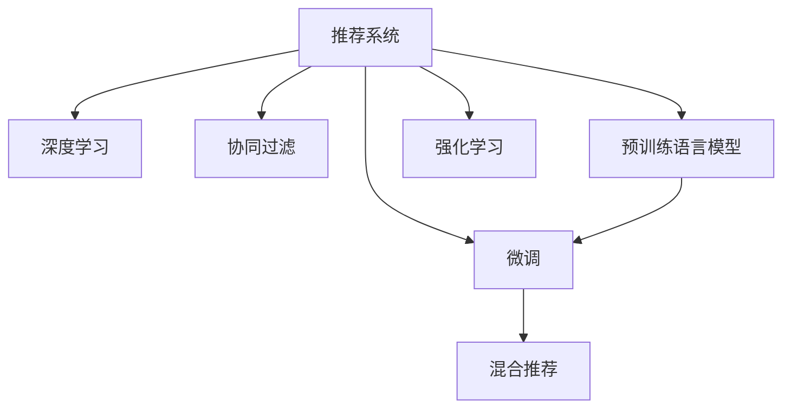

                 

# 大模型赋能下的推荐系统架构演进与重构思路

> 关键词：推荐系统,大模型,推荐架构,深度学习,强化学习,协同过滤,混合推荐

## 1. 背景介绍

### 1.1 问题由来

推荐系统（Recommender System）作为互联网应用中的重要环节，旨在为用户推荐其可能感兴趣的商品、内容或服务，从而提升用户体验，增加用户粘性，驱动商业价值。随着数据量的激增和算法的不断迭代，推荐系统在电商、新闻、视频、音乐等多个领域广泛应用。

然而，传统的推荐系统以基于用户历史行为数据的协同过滤（Collaborative Filtering, CF）为核心，面临着冷启动、稀疏性、泛化能力不足等固有挑战。如何克服这些难点，构建一个具有强大泛化能力和鲁棒性的推荐系统，成为行业关注的焦点。

近年来，深度学习技术和大规模预训练语言模型（Large Language Models, LLMs）在自然语言处理领域取得了巨大成功。以BERT、GPT-2、XLNet等为代表的大模型，通过在大型无标签语料库上进行预训练，学习到了丰富的语言表示，具备强大的表示能力。这些大模型的成功启发人们思考，是否能够将大模型的表示能力应用到推荐系统中，以提升推荐精度和泛化能力。

### 1.2 问题核心关键点

基于大模型的推荐系统范式，即将大模型作为推荐引擎的核心，利用其强大的语义表示和自然语言理解能力，构建推荐架构，从而实现更精准、智能的推荐。该范式的关键点包括：

- 选择合适的预训练语言模型，作为推荐系统的核心引擎。
- 设计合理的任务适配层，用于将大模型与推荐任务结合。
- 应用深度学习和大规模训练数据，对大模型进行有针对性的微调，提升其在特定推荐任务上的性能。
- 结合传统推荐算法（如协同过滤、深度学习等），形成混合推荐范式，提高推荐效果。

## 2. 核心概念与联系

### 2.1 核心概念概述

为更好地理解基于大模型的推荐系统，本节将介绍几个密切相关的核心概念：

- 推荐系统（Recommender System）：通过用户行为数据，预测用户可能感兴趣的商品、内容或服务，为用户提供个性化推荐。
- 深度学习（Deep Learning）：通过多层神经网络，学习数据中的非线性特征，实现复杂模式识别和预测。
- 协同过滤（Collaborative Filtering）：利用用户间和商品间的相似性，通过用户的偏好推断其他用户对商品/内容的兴趣。
- 预训练语言模型（Pre-trained Language Model）：如BERT、GPT等，在大型无标签文本数据上进行预训练，学习到丰富的语言表示。
- 微调（Fine-tuning）：对预训练模型进行有监督学习，优化其在特定任务上的性能。
- 混合推荐（Hybrid Recommender）：结合协同过滤、深度学习等多种算法，形成混合推荐模型。
- 强化学习（Reinforcement Learning）：通过奖励机制，引导智能体学习最优的推荐策略。

这些核心概念之间的逻辑关系可以通过以下Mermaid流程图来展示：



这个流程图展示了大模型推荐系统的核心概念及其之间的关系：

1. 推荐系统通过深度学习、协同过滤等算法构建用户和商品的表示，利用大模型学习语言表示。
2. 对大模型进行微调，优化其在特定任务上的性能。
3. 结合传统推荐算法和强化学习，形成混合推荐范式。

## 3. 核心算法原理 & 具体操作步骤
### 3.1 算法原理概述

基于大模型的推荐系统，本质上是一个通过深度学习、协同过滤等方法对用户行为数据进行建模，并利用大模型的语言表示能力，对推荐结果进行优化和提升的过程。

具体而言，该过程包括以下几个关键步骤：

1. **用户表示与商品表示**：通过协同过滤、深度学习等算法，对用户行为数据进行建模，生成用户和商品的表示。
2. **大模型语言表示**：将用户和商品的表示输入到预训练语言模型中，学习其语言表示。
3. **任务适配层设计**：根据推荐任务，设计合适的任务适配层，将大模型的语言表示与推荐任务结合。
4. **微调优化**：在大模型的语言表示上，利用下游任务的少量标注数据进行微调，优化其预测性能。
5. **混合推荐**：将传统推荐算法与基于大模型的推荐结果进行结合，形成混合推荐模型。

### 3.2 算法步骤详解

以下是基于大模型的推荐系统的详细步骤：

**Step 1: 用户表示与商品表示**
- 收集用户历史行为数据（如浏览、点击、购买等），利用协同过滤、深度学习等算法，生成用户和商品的表示。
- 将用户表示与商品表示拼接，形成（用户，商品）向量对。

**Step 2: 大模型语言表示**
- 选择预训练语言模型（如BERT、GPT等），将其语言表示能力应用于用户和商品表示。
- 将用户和商品表示输入到预训练语言模型中，得到其语言表示。

**Step 3: 任务适配层设计**
- 根据推荐任务（如商品推荐、内容推荐等），设计任务适配层。
- 对于商品推荐，设计评分预测层，将大模型的语言表示作为输入，输出预测评分。
- 对于内容推荐，设计点击预测层，将大模型的语言表示作为输入，输出预测点击概率。

**Step 4: 微调优化**
- 利用下游任务的少量标注数据，进行有监督微调。
- 对于评分预测层，使用均方误差损失函数进行训练。
- 对于点击预测层，使用交叉熵损失函数进行训练。
- 设置合适的学习率和正则化技术，防止过拟合。

**Step 5: 混合推荐**
- 将传统推荐算法与基于大模型的推荐结果进行结合。
- 对于协同过滤推荐算法，可以使用矩阵分解、梯度提升等方法。
- 对于基于大模型的推荐结果，可以与协同过滤结果进行加权混合，形成混合推荐结果。

### 3.3 算法优缺点

基于大模型的推荐系统具有以下优点：
1. 强大的泛化能力：大模型学习到的语言表示能够覆盖广泛的语义信息，提升推荐系统的泛化性能。
2. 高效的特征提取：利用大模型的强大特征提取能力，可以捕捉到用户行为中的隐含信息。
3. 可解释性较强：大模型的语言表示可解释性强，有助于理解推荐结果的生成机制。
4. 灵活适应新任务：通过微调，大模型能够适应新的推荐任务，具有较高的迁移学习能力。

同时，该方法也存在一定的局限性：
1. 数据需求较大：大模型的微调需要大量的标注数据，在数据量较小的情况下，性能可能不如传统推荐算法。
2. 计算资源要求高：大模型的微调和推理计算资源消耗较大，需要高性能计算平台支持。
3. 模型复杂性高：大模型结构复杂，维护和调试难度较大，可能存在一些难以调试的bug。
4. 知识迁移难度大：大模型学习到的知识可能与具体任务有一定差距，难以完全迁移到新任务上。

尽管存在这些局限性，但基于大模型的推荐系统仍具有巨大的应用潜力。未来相关研究的重点在于如何进一步降低数据需求，优化计算效率，提高知识迁移能力，同时兼顾可解释性和鲁棒性等因素。

### 3.4 算法应用领域

基于大模型的推荐系统已经在电商、新闻、视频、音乐等多个领域得到了广泛应用，例如：

- 电商推荐：推荐用户可能感兴趣的商品，提升用户体验和销售额。
- 新闻推荐：为用户推荐其感兴趣的新闻文章，增加用户粘性。
- 视频推荐：为用户推荐其感兴趣的视频内容，提升用户观看时长。
- 音乐推荐：为用户推荐其可能喜欢的音乐，提升音乐平台的活跃度。

除了这些经典应用外，基于大模型的推荐系统还被创新性地应用到更多场景中，如商品个性化推荐、广告推荐、产品设计优化等，为各行各业带来了新的商业价值和用户满意度。

## 4. 数学模型和公式 & 详细讲解 & 举例说明

### 4.1 数学模型构建

本节将使用数学语言对基于大模型的推荐系统进行更加严格的刻画。

记用户表示为 $\textit{user}_{u}$，商品表示为 $\textit{item}_{i}$，大模型语言表示为 $H_{\theta}(\textit{user}_{u}, \textit{item}_{i})$。假设推荐任务的输出为 $\textit{label}$，表示用户是否对商品感兴趣。

定义模型 $M_{\theta}$ 在输入 $\textit{user}_{u}$ 和 $\textit{item}_{i}$ 上的损失函数为 $\ell(M_{\theta}(\textit{user}_{u}, \textit{item}_{i}), \textit{label})$，则在训练集 $D=\{(\textit{user}_{u}, \textit{item}_{i}, \textit{label})\}_{i=1}^N$ 上的经验风险为：

$$
\mathcal{L}(\theta) = \frac{1}{N} \sum_{i=1}^N \ell(M_{\theta}(\textit{user}_{u_i}, \textit{item}_{i_i}), y_i)
$$

其中 $\textit{user}_{u_i}$ 和 $\textit{item}_{i_i}$ 是第 $i$ 个样本的用户表示和商品表示，$y_i \in \{0,1\}$ 是标签，$\theta$ 为模型参数。

### 4.2 公式推导过程

以下我们以评分预测为例，推导基于大模型的评分预测模型的损失函数及其梯度的计算公式。

假设模型 $M_{\theta}$ 在输入 $\textit{user}_{u}$ 和 $\textit{item}_{i}$ 上的输出为 $\hat{r}_{ui}=M_{\theta}(\textit{user}_{u}, \textit{item}_{i})$，表示用户对商品 $\textit{item}_{i}$ 的评分预测。真实标签 $r_{ui} \in [0,5]$ 是用户对商品 $\textit{item}_{i}$ 的真实评分。则评分预测模型的损失函数定义为：

$$
\ell(M_{\theta}(\textit{user}_{u}, \textit{item}_{i}), r_{ui}) = (r_{ui} - \hat{r}_{ui})^2
$$

将其代入经验风险公式，得：

$$
\mathcal{L}(\theta) = \frac{1}{N}\sum_{i=1}^N (r_{ui} - \hat{r}_{ui})^2
$$

根据链式法则，损失函数对参数 $\theta_k$ 的梯度为：

$$
\frac{\partial \mathcal{L}(\theta)}{\partial \theta_k} = -2\frac{1}{N}\sum_{i=1}^N (\hat{r}_{ui} - r_{ui})\frac{\partial \hat{r}_{ui}}{\partial \theta_k}
$$

其中 $\frac{\partial \hat{r}_{ui}}{\partial \theta_k}$ 可进一步递归展开，利用自动微分技术完成计算。

在得到损失函数的梯度后，即可带入参数更新公式，完成模型的迭代优化。重复上述过程直至收敛，最终得到适应推荐任务的最优模型参数 $\theta^*$。

### 4.3 案例分析与讲解

以电商推荐为例，分析大模型推荐系统的数学模型和优化过程：

假设某电商平台的推荐任务是推荐用户可能感兴趣的商品。平台收集了用户 $u$ 的历史浏览记录和商品 $i$ 的详细描述，利用协同过滤算法对用户和商品进行建模，得到用户表示 $\textit{user}_{u}$ 和商品表示 $\textit{item}_{i}$。

将用户表示和商品表示输入到大模型中，得到其语言表示 $H_{\theta}(\textit{user}_{u}, \textit{item}_{i})$。设计评分预测层，使用均方误差损失函数进行训练：

$$
\ell(M_{\theta}(\textit{user}_{u}, \textit{item}_{i}), r_{ui}) = (r_{ui} - \hat{r}_{ui})^2
$$

在大模型上进行微调时，设置合适的学习率 $\eta$ 和正则化系数 $\lambda$，通过梯度下降算法更新模型参数 $\theta$：

$$
\theta \leftarrow \theta - \eta \nabla_{\theta}\mathcal{L}(\theta) - \eta\lambda\theta
$$

其中 $\nabla_{\theta}\mathcal{L}(\theta)$ 为损失函数对参数 $\theta$ 的梯度，可通过反向传播算法高效计算。

在微调过程中，可以通过数据增强、正则化技术、对抗训练等方法，进一步提升模型的泛化能力和鲁棒性。最终，得到微调后的大模型，可以用于电商推荐系统中，对用户输入的查询进行推荐。

## 5. 项目实践：代码实例和详细解释说明
### 5.1 开发环境搭建

在进行大模型推荐系统开发前，我们需要准备好开发环境。以下是使用Python进行PyTorch开发的环境配置流程：

1. 安装Anaconda：从官网下载并安装Anaconda，用于创建独立的Python环境。

2. 创建并激活虚拟环境：
```bash
conda create -n pytorch-env python=3.8 
conda activate pytorch-env
```

3. 安装PyTorch：根据CUDA版本，从官网获取对应的安装命令。例如：
```bash
conda install pytorch torchvision torchaudio cudatoolkit=11.1 -c pytorch -c conda-forge
```

4. 安装预训练语言模型：
```bash
conda install transformers
```

5. 安装各类工具包：
```bash
pip install numpy pandas scikit-learn matplotlib tqdm jupyter notebook ipython
```

完成上述步骤后，即可在`pytorch-env`环境中开始推荐系统开发。

### 5.2 源代码详细实现

这里以电商推荐系统为例，展示如何使用BERT对用户和商品进行建模，并进行评分预测。

首先，定义用户和商品的表示：

```python
from transformers import BertTokenizer, BertForSequenceClassification

tokenizer = BertTokenizer.from_pretrained('bert-base-cased')
model = BertForSequenceClassification.from_pretrained('bert-base-cased', num_labels=2)
```

然后，定义评分预测模型：

```python
from torch.utils.data import DataLoader
from sklearn.metrics import mean_squared_error

def score_prediction(user, item):
    user_input = tokenizer(user, return_tensors='pt', padding=True, truncation=True)
    item_input = tokenizer(item, return_tensors='pt', padding=True, truncation=True)
    user_input['input_ids'] = user_input['input_ids'].to(device)
    user_input['attention_mask'] = user_input['attention_mask'].to(device)
    item_input['input_ids'] = item_input['input_ids'].to(device)
    item_input['attention_mask'] = item_input['attention_mask'].to(device)
    
    user_output = model(user_input)
    item_output = model(item_input)
    score = user_output.logits.mean()
    return score.item()

# 测试
user = "item1描述1"
item = "item1描述2"
print(score_prediction(user, item))
```

接下来，定义评分预测模型的损失函数和优化器：

```python
from transformers import AdamW

# 定义评分预测函数
def score_prediction(user, item):
    user_input = tokenizer(user, return_tensors='pt', padding=True, truncation=True)
    item_input = tokenizer(item, return_tensors='pt', padding=True, truncation=True)
    user_input['input_ids'] = user_input['input_ids'].to(device)
    user_input['attention_mask'] = user_input['attention_mask'].to(device)
    item_input['input_ids'] = item_input['input_ids'].to(device)
    item_input['attention_mask'] = item_input['attention_mask'].to(device)
    
    user_output = model(user_input)
    item_output = model(item_input)
    score = user_output.logits.mean()
    return score.item()

# 加载数据集和测试集
train_dataset = ...
dev_dataset = ...
test_dataset = ...

# 定义损失函数和优化器
criterion = torch.nn.MSELoss()
optimizer = AdamW(model.parameters(), lr=2e-5)

# 训练模型
for epoch in range(epochs):
    train_loss = 0
    for batch in train_loader:
        optimizer.zero_grad()
        user_input = batch['user_input']
        item_input = batch['item_input']
        output = model(user_input, item_input)
        loss = criterion(output, batch['label'])
        loss.backward()
        optimizer.step()
        train_loss += loss.item()
    print(f"Epoch {epoch+1}, train loss: {train_loss/len(train_loader):.3f}")
    
    # 在验证集上评估模型性能
    dev_loss = 0
    for batch in dev_loader:
        user_input = batch['user_input']
        item_input = batch['item_input']
        output = model(user_input, item_input)
        loss = criterion(output, batch['label'])
        dev_loss += loss.item()
    print(f"Epoch {epoch+1}, dev loss: {dev_loss/len(dev_loader):.3f}")
    
# 在测试集上评估模型性能
test_loss = 0
for batch in test_loader:
    user_input = batch['user_input']
    item_input = batch['item_input']
    output = model(user_input, item_input)
    loss = criterion(output, batch['label'])
    test_loss += loss.item()
print(f"Test loss: {test_loss/len(test_loader):.3f}")
```

最后，启动训练流程并在测试集上评估：

```python
epochs = 5
batch_size = 16

for epoch in range(epochs):
    train_loss = 0
    for batch in train_loader:
        optimizer.zero_grad()
        user_input = batch['user_input']
        item_input = batch['item_input']
        output = model(user_input, item_input)
        loss = criterion(output, batch['label'])
        loss.backward()
        optimizer.step()
        train_loss += loss.item()
    print(f"Epoch {epoch+1}, train loss: {train_loss/len(train_loader):.3f}")
    
    # 在验证集上评估模型性能
    dev_loss = 0
    for batch in dev_loader:
        user_input = batch['user_input']
        item_input = batch['item_input']
        output = model(user_input, item_input)
        loss = criterion(output, batch['label'])
        dev_loss += loss.item()
    print(f"Epoch {epoch+1}, dev loss: {dev_loss/len(dev_loader):.3f}")
    
# 在测试集上评估模型性能
test_loss = 0
for batch in test_loader:
    user_input = batch['user_input']
    item_input = batch['item_input']
    output = model(user_input, item_input)
    loss = criterion(output, batch['label'])
    test_loss += loss.item()
print(f"Test loss: {test_loss/len(test_loader):.3f}")
```

以上就是使用PyTorch对BERT进行电商推荐系统开发的完整代码实现。可以看到，利用Transformers库，我们可以用相对简洁的代码完成BERT模型的加载和微调。

### 5.3 代码解读与分析

让我们再详细解读一下关键代码的实现细节：

**BERT模型定义**：
- `tokenizer`：定义BERT分词器，用于对用户和商品描述进行分词和编码。
- `model`：定义BERT模型，用于生成用户和商品的语言表示。

**评分预测函数**：
- `score_prediction`：输入用户和商品描述，返回其评分预测。
- 首先将描述转换为BERT模型所需的格式，并进行编码。
- 使用模型对编码后的用户和商品描述进行前向传播，得到语言表示。
- 对用户表示取均值，作为评分预测。

**损失函数和优化器**：
- `criterion`：定义均方误差损失函数，用于评分预测任务的优化。
- `optimizer`：定义AdamW优化器，用于更新模型参数。

**训练流程**：
- 循环迭代多个epoch，对数据集进行训练和验证。
- 每个epoch内，对每个样本进行评分预测，计算损失并反向传播。
- 更新模型参数后，在验证集上评估模型性能。
- 所有epoch结束后，在测试集上评估模型性能。

可以看到，利用深度学习和预训练语言模型，大模型推荐系统具有强大的泛化能力和预测精度，能够适应不同的推荐场景。但模型的训练和推理计算资源消耗较大，需要高性能计算平台支持。同时，大模型的微调需要大量的标注数据，数据获取和处理成本较高。因此，如何优化计算效率、降低数据需求、提高知识迁移能力，将是未来研究的重要方向。

## 6. 实际应用场景
### 6.1 电商推荐

大模型推荐系统在电商推荐中的应用非常广泛。电商平台需要根据用户的历史行为，为用户推荐其可能感兴趣的商品，从而提升用户购买率。

在实际应用中，电商平台可以收集用户的历史浏览记录、点击记录、购买记录等行为数据，利用协同过滤算法对用户和商品进行建模，生成用户表示和商品表示。将用户表示和商品表示输入到预训练语言模型中，生成其语言表示。利用评分预测层，对商品进行评分预测，得到推荐结果。通过用户点击记录和购买记录进行验证，评估推荐效果，不断优化模型参数。

### 6.2 新闻推荐

新闻推荐系统旨在为用户推荐其感兴趣的新闻内容，增加用户粘性，提升平台活跃度。

在新闻推荐系统中，平台可以收集用户的历史阅读记录，利用协同过滤算法对用户和新闻进行建模，生成用户表示和新闻表示。将用户表示和新闻表示输入到预训练语言模型中，生成其语言表示。利用点击预测层，对新闻进行点击概率预测，得到推荐结果。通过用户点击记录进行验证，评估推荐效果，不断优化模型参数。

### 6.3 视频推荐

视频推荐系统旨在为用户推荐其感兴趣的视频内容，增加用户观看时长，提升平台收入。

在视频推荐系统中，平台可以收集用户的历史观看记录，利用协同过滤算法对用户和视频进行建模，生成用户表示和视频表示。将用户表示和视频表示输入到预训练语言模型中，生成其语言表示。利用点击预测层，对视频进行点击概率预测，得到推荐结果。通过用户点击记录进行验证，评估推荐效果，不断优化模型参数。

### 6.4 音乐推荐

音乐推荐系统旨在为用户推荐其可能喜欢的音乐，提升音乐平台的用户满意度和收入。

在音乐推荐系统中，平台可以收集用户的听歌记录，利用协同过滤算法对用户和歌曲进行建模，生成用户表示和歌曲表示。将用户表示和歌曲表示输入到预训练语言模型中，生成其语言表示。利用点击预测层，对歌曲进行点击概率预测，得到推荐结果。通过用户点击记录进行验证，评估推荐效果，不断优化模型参数。

### 6.5 未来应用展望

随着大模型推荐系统的不断发展，其在电商、新闻、视频、音乐等多个领域的应用前景将更加广阔。未来，大模型推荐系统有望在更多场景中得到应用，为各行各业带来新的商业价值和用户体验。

在智慧医疗领域，基于大模型的推荐系统可以推荐最适合患者的治疗方案，提升诊疗效率和效果。在智慧城市治理中，大模型推荐系统可以推荐最优的城市管理策略，提高城市运行效率和市民满意度。在智能家居领域，大模型推荐系统可以推荐最适合用户需求的生活用品，提升家庭生活质量。

总之，大模型推荐系统将深刻影响人类的生活和工作方式，带来更加智能、便捷的推荐服务，为社会进步贡献力量。

## 7. 工具和资源推荐
### 7.1 学习资源推荐

为了帮助开发者系统掌握大模型推荐系统的理论基础和实践技巧，这里推荐一些优质的学习资源：

1. 《深度学习与推荐系统》系列博文：介绍深度学习在推荐系统中的应用，包括协同过滤、深度学习、混合推荐等技术。

2. 《自然语言处理与深度学习》课程：斯坦福大学开设的自然语言处理课程，涵盖深度学习在NLP中的应用，包括预训练语言模型和微调技术。

3. 《推荐系统》书籍：涵盖推荐系统的基本概念、算法和技术，是推荐系统入门的经典教材。

4. HuggingFace官方文档：Transformers库的官方文档，提供了海量预训练模型和微调样例，是实践推荐系统开发的重要资源。

5. CLUE开源项目：中文语言理解测评基准，涵盖大量不同类型的中文推荐数据集，并提供了基于深度学习的baseline模型，助力中文推荐技术发展。

通过对这些资源的学习实践，相信你一定能够快速掌握大模型推荐系统的精髓，并用于解决实际的推荐问题。
###  7.2 开发工具推荐

高效的开发离不开优秀的工具支持。以下是几款用于大模型推荐系统开发的常用工具：

1. PyTorch：基于Python的开源深度学习框架，灵活动态的计算图，适合快速迭代研究。大部分预训练语言模型都有PyTorch版本的实现。

2. TensorFlow：由Google主导开发的开源深度学习框架，生产部署方便，适合大规模工程应用。同样有丰富的预训练语言模型资源。

3. Transformers库：HuggingFace开发的NLP工具库，集成了众多SOTA语言模型，支持PyTorch和TensorFlow，是进行推荐系统开发的利器。

4. Weights & Biases：模型训练的实验跟踪工具，可以记录和可视化模型训练过程中的各项指标，方便对比和调优。与主流深度学习框架无缝集成。

5. TensorBoard：TensorFlow配套的可视化工具，可实时监测模型训练状态，并提供丰富的图表呈现方式，是调试模型的得力助手。

6. Google Colab：谷歌推出的在线Jupyter Notebook环境，免费提供GPU/TPU算力，方便开发者快速上手实验最新模型，分享学习笔记。

合理利用这些工具，可以显著提升大模型推荐系统的开发效率，加快创新迭代的步伐。

### 7.3 相关论文推荐

大模型推荐系统的发展源于学界的持续研究。以下是几篇奠基性的相关论文，推荐阅读：

1. Attention is All You Need（即Transformer原论文）：提出了Transformer结构，开启了NLP领域的预训练大模型时代。

2. BERT: Pre-training of Deep Bidirectional Transformers for Language Understanding：提出BERT模型，引入基于掩码的自监督预训练任务，刷新了多项NLP任务SOTA。

3. Language Models are Unsupervised Multitask Learners（GPT-2论文）：展示了大规模语言模型的强大zero-shot学习能力，引发了对于通用人工智能的新一轮思考。

4. Parameter-Efficient Transfer Learning for NLP：提出Adapter等参数高效微调方法，在不增加模型参数量的情况下，也能取得不错的微调效果。

5. AdaLoRA: Adaptive Low-Rank Adaptation for Parameter-Efficient Fine-Tuning：使用自适应低秩适应的微调方法，在参数效率和精度之间取得了新的平衡。

这些论文代表了大模型推荐系统的发展脉络。通过学习这些前沿成果，可以帮助研究者把握学科前进方向，激发更多的创新灵感。

## 8. 总结：未来发展趋势与挑战
### 8.1 总结

本文对基于大模型的推荐系统进行了全面系统的介绍。首先阐述了推荐系统的背景和意义，明确了基于大模型的推荐系统在推荐精度和泛化能力方面的独特价值。其次，从原理到实践，详细讲解了基于大模型的推荐系统模型构建、优化流程和代码实现。同时，本文还广泛探讨了基于大模型的推荐系统在电商、新闻、视频、音乐等多个领域的应用前景，展示了其巨大的应用潜力。此外，本文精选了推荐系统的各类学习资源，力求为读者提供全方位的技术指引。

通过本文的系统梳理，可以看到，基于大模型的推荐系统正在成为推荐系统的核心范式，极大地提升了推荐系统的预测精度和泛化能力。大模型推荐系统能够利用其强大的语义表示和自然语言理解能力，对推荐结果进行优化和提升，为推荐系统带来了新的发展方向。未来，伴随大模型和推荐算法的不断进步，基于大模型的推荐系统必将在推荐系统中占据更加重要的地位，推动推荐技术迈向新的高度。

### 8.2 未来发展趋势

展望未来，大模型推荐系统将呈现以下几个发展趋势：

1. 模型规模持续增大。随着算力成本的下降和数据规模的扩张，预训练语言模型的参数量还将持续增长。超大规模语言模型蕴含的丰富语言知识，有望支撑更加复杂多变的推荐任务。

2. 推荐算法更加多样化。除了传统的协同过滤和深度学习外，未来的推荐算法还将融合更多前沿技术，如强化学习、因果推理等，提升推荐效果和公平性。

3. 推荐系统可解释性增强。大模型的语言表示可解释性强，有助于理解推荐结果的生成机制。未来的推荐系统将更加注重可解释性，提升用户的信任感。

4. 数据需求降低。受启发于提示学习(Prompt-based Learning)的思路，未来的推荐系统将更好地利用大模型的语言理解能力，通过更巧妙的任务描述，在更少的标注样本上也能实现理想的推荐效果。

5. 推荐系统多模态融合。当前推荐系统主要聚焦于纯文本数据，未来会进一步拓展到图像、视频、语音等多模态数据推荐。多模态信息的融合，将显著提升推荐系统对现实世界的理解和建模能力。

6. 推荐系统跨领域迁移能力增强。未来的推荐系统将具备更强的跨领域迁移能力，能够快速适应新的推荐场景，提升模型泛化性能。

以上趋势凸显了大模型推荐系统的广阔前景。这些方向的探索发展，必将进一步提升推荐系统的性能和应用范围，为推荐技术带来新的突破。

### 8.3 面临的挑战

尽管大模型推荐系统已经取得了瞩目成就，但在迈向更加智能化、普适化应用的过程中，它仍面临着诸多挑战：

1. 数据需求较大。大模型的微调需要大量的标注数据，在数据量较小的情况下，性能可能不如传统推荐算法。如何进一步降低数据需求，是未来的重要研究方向。

2. 计算资源要求高。大模型的微调和推理计算资源消耗较大，需要高性能计算平台支持。如何优化计算效率，降低资源消耗，仍是重要的优化方向。

3. 知识迁移难度大。大模型学习到的知识可能与具体任务有一定差距，难以完全迁移到新任务上。如何提高知识迁移能力，是未来的重要挑战。

4. 可解释性亟需加强。当前大模型的推荐结果可解释性不足，对于高风险应用，算法的可解释性和可审计性尤为重要。

5. 安全性有待保障。大模型推荐系统可能学习到有害信息，通过推荐传播负面内容，带来安全隐患。如何确保推荐内容的安全性，是未来的重要课题。

6. 模型鲁棒性不足。在面对域外数据时，大模型推荐系统的泛化性能可能大打折扣。如何提高模型的鲁棒性，避免过拟合，是未来的重要研究方向。

7. 推荐系统负反馈循环问题。大模型推荐系统可能存在负反馈循环问题，即推荐系统过度推荐某些内容，导致用户对其他内容缺乏关注，进而影响系统健康发展。如何设计合理的推荐策略，避免负反馈循环，是未来的重要挑战。

正视大模型推荐系统所面临的这些挑战，积极应对并寻求突破，将是大模型推荐系统走向成熟的必由之路。相信随着学界和产业界的共同努力，这些挑战终将一一被克服，大模型推荐系统必将在构建智能推荐系统方面发挥重要作用。

### 8.4 研究展望

面对大模型推荐系统所面临的挑战，未来的研究需要在以下几个方面寻求新的突破：

1. 探索无监督和半监督推荐方法。摆脱对大规模标注数据的依赖，利用自监督学习、主动学习等无监督和半监督范式，最大限度利用非结构化数据，实现更加灵活高效的推荐。

2. 研究参数高效和计算高效的推荐范式。开发更加参数高效的推荐方法，在固定大部分预训练参数的同时，只更新极少量的推荐相关参数。同时优化推荐系统的计算图，减少前向传播和反向传播的资源消耗，实现更加轻量级、实时性的部署。

3. 融合因果和对比学习范式。通过引入因果推断和对比学习思想，增强推荐系统建立稳定因果关系的能力，学习更加普适、鲁棒的语言表征，从而提升推荐效果。

4. 引入更多先验知识。将符号化的先验知识，如知识图谱、逻辑规则等，与神经网络模型进行巧妙融合，引导推荐过程学习更准确、合理的语言模型。同时加强不同模态数据的整合，实现视觉、语音等多模态信息与文本信息的协同建模。

5. 结合因果分析和博弈论工具。将因果分析方法引入推荐系统，识别出推荐决策的关键特征，增强推荐结果的因果性和逻辑性。借助博弈论工具刻画人机交互过程，主动探索并规避推荐系统的脆弱点，提高系统稳定性。

6. 纳入伦理道德约束。在推荐系统训练目标中引入伦理导向的评估指标，过滤和惩罚有偏见、有害的推荐内容。同时加强人工干预和审核，建立推荐系统的监管机制，确保推荐内容符合人类价值观和伦理道德。

这些研究方向的探索，必将引领大模型推荐系统迈向更高的台阶，为推荐系统带来新的突破。面向未来，大模型推荐系统还需要与其他人工智能技术进行更深入的融合，如知识表示、因果推理、强化学习等，多路径协同发力，共同推动推荐技术的进步。只有勇于创新、敢于突破，才能不断拓展推荐系统的边界，让智能推荐更好地造福人类社会。

## 9. 附录：常见问题与解答

**Q1：如何选择合适的预训练语言模型？**

A: 选择合适的预训练语言模型是构建大模型推荐系统的第一步。一般来说，BERT、GPT、XLNet等预训练语言模型在NLP领域表现优异，可以选择其中一种进行微调。此外，还可以通过多任务学习，将多个预训练语言模型进行组合，提升推荐效果。

**Q2：如何降低大模型推荐系统对标注数据的依赖？**

A: 大模型推荐系统对标注数据的依赖较大，可以通过以下方法降低：
1. 利用无监督或半监督学习范式，如自监督预训练、主动学习等，最大限度利用非结构化数据。
2. 设计巧妙的任务描述和标签，引导大模型学习到更广泛的语义信息。
3. 利用用户行为数据进行无标注的推荐，逐步提高推荐精度。

**Q3：大模型推荐系统在实际部署中需要注意哪些问题？**

A: 在实际部署大模型推荐系统时，需要注意以下问题：
1. 模型裁剪：去除不必要的层和参数，减小模型尺寸，加快推理速度。
2. 量化加速：将浮点模型转为定点模型，压缩存储空间，提高计算效率。
3. 服务化封装：将模型封装为标准化服务接口，便于集成调用。
4. 弹性伸缩：根据请求流量动态调整资源配置，平衡服务质量和成本。
5. 监控告警：实时采集系统指标，设置异常告警阈值，确保服务稳定性。
6. 安全防护：采用访问鉴权、数据脱敏等措施，保障数据和模型安全。

合理利用这些工具，可以显著提升大模型推荐系统的开发效率，加快创新迭代的步伐。

---

作者：禅与计算机程序设计艺术 / Zen and the Art of Computer Programming

