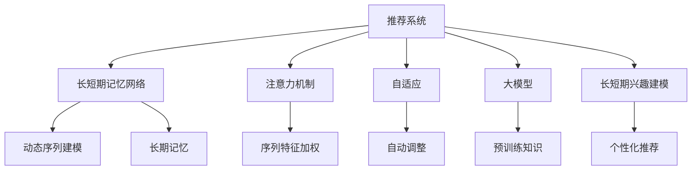

                 

## 1. 背景介绍

推荐系统作为一种强大的信息过滤技术，已经广泛应用于电子商务、视频网站、社交网络等多个领域。随着互联网技术的快速发展，用户对个性化推荐的需求日益增长，推荐系统成为了各大互联网公司的重要技术手段。然而，传统的推荐算法往往基于静态的统计特征，难以捕捉用户的长短期兴趣变化。因此，基于深度学习的大模型驱动的推荐系统，逐渐成为学术界和工业界研究的重点。

本文将深入探讨大模型在推荐系统中的长短期兴趣建模技术，详细介绍其算法原理、具体操作步骤和应用案例。同时，我们将通过详细数学模型推导和代码实现，展示该技术如何通过微调大模型来适应不同用户在不同时间段的兴趣变化。

## 2. 核心概念与联系

### 2.1 核心概念概述

为了更好地理解大模型在推荐系统中的应用，我们首先需要了解几个关键的概念：

- **推荐系统(Recommendation System)**：通过分析和预测用户的行为和偏好，为用户提供个性化推荐的系统。

- **长短期记忆网络(Long Short-Term Memory, LSTM)**：一种特殊的循环神经网络，具备记忆长期信息的能力，常用于序列数据的建模。

- **注意力机制(Attention Mechanism)**：一种机制，能够根据输入数据的特征，动态分配注意力权重，在长序列数据中提升模型效果。

- **自适应(Adaptive)**：指模型能够根据不同的输入和任务自动调整其内部参数，以优化性能。

- **大模型(Pre-trained Model)**：如BERT、GPT等大规模预训练语言模型，通过在大规模无标签文本数据上预训练，能够学习到丰富的语言表示。

这些核心概念构成了大模型在推荐系统中的应用基础。通过理解这些概念，我们可以更好地把握长短期兴趣建模技术的原理和应用。

### 2.2 核心概念联系的 Mermaid 流程图



该流程图展示了推荐系统中各个关键组件之间的逻辑联系。通过长短期记忆网络和注意力机制，模型能够捕捉用户的长期兴趣和即时行为，而自适应和大模型则提供了模型动态调整和广泛的知识库，最终通过长短期兴趣建模技术生成个性化的推荐结果。

## 3. 核心算法原理 & 具体操作步骤

### 3.1 算法原理概述

长短期兴趣建模技术通过微调大模型，使得模型能够根据用户的历史行为和即时行为动态调整其内部的兴趣表示，从而生成个性化的推荐。其核心思想是：将用户的历史行为和即时行为分别输入大模型进行编码，得到用户的长短期兴趣表示，然后将两者融合，得到最终的用户兴趣表示。

### 3.2 算法步骤详解

基于长短期兴趣建模的推荐系统，其操作步骤一般包括：

**Step 1: 数据预处理**

- 收集用户的历史行为数据，如浏览记录、购买记录、评分记录等。
- 将行为数据进行标准化处理，如将时间戳转换为时间序列。
- 将行为数据划分为不同的时间段，如日、周、月等。

**Step 2: 模型训练**

- 选择大模型作为初始化参数，如BERT、GPT等。
- 将用户的历史行为数据作为输入，训练大模型得到用户的长时期兴趣表示。
- 将用户最新的行为数据作为输入，训练大模型得到用户的短期兴趣表示。
- 将长短期兴趣表示融合，得到用户最终的兴趣表示。
- 将用户兴趣表示作为推荐系统的输入，输出推荐结果。

**Step 3: 模型评估**

- 在测试集上评估模型的推荐效果，如准确率、召回率、F1分数等。
- 根据评估结果调整模型的超参数，如学习率、批次大小、训练轮数等。

### 3.3 算法优缺点

**优点：**

- 能够动态捕捉用户的长短期兴趣变化，提升推荐系统的个性化能力。
- 利用大模型的预训练知识，提升推荐结果的准确性和多样性。
- 通过自适应和大模型的组合，模型具备较强的泛化能力，能够适应不同的推荐任务。

**缺点：**

- 需要大量历史数据进行预训练，对数据量有较高要求。
- 大模型训练和微调需要较长的计算时间，对计算资源有较高要求。
- 模型的解释性和可解释性较差，难以进行有效的用户行为分析。

### 3.4 算法应用领域

长短期兴趣建模技术在推荐系统中的应用非常广泛，适用于以下几种场景：

- 电商推荐：根据用户的浏览和购买历史，推荐用户可能感兴趣的商品。
- 视频推荐：根据用户观看历史和评分记录，推荐相关视频内容。
- 社交网络：根据用户点赞、评论和分享行为，推荐相关内容。
- 音乐推荐：根据用户的听歌历史和评分记录，推荐音乐作品。

## 4. 数学模型和公式 & 详细讲解 & 举例说明

### 4.1 数学模型构建

设用户 $u$ 的历史行为序列为 $H_u=\{x_1,x_2,\cdots,x_n\}$，其中 $x_t$ 表示用户在时间 $t$ 的行为记录，如浏览、购买、评分等。设用户 $u$ 在时间 $t'$ 的即时行为记录为 $I_{t'}$。

记大模型为 $M_{\theta}$，其输入序列为 $H_u$ 和 $I_{t'}$。模型的输出为长短期兴趣表示 $V_u = [V_{u,L},V_{u,S}]$，其中 $V_{u,L}$ 表示长时期兴趣表示，$V_{u,S}$ 表示短期兴趣表示。

### 4.2 公式推导过程

首先，我们将用户的历史行为序列和即时行为记录分别输入大模型 $M_{\theta}$，得到长时期兴趣表示 $V_{u,L}$ 和短期兴趣表示 $V_{u,S}$。

设 $M_{\theta}$ 的输出层为 $softmax$ 函数，则长短期兴趣表示的计算公式为：

$$
V_{u,L} = M_{\theta}(H_u)
$$

$$
V_{u,S} = M_{\theta}(I_{t'})
$$

接下来，我们将长短期兴趣表示 $V_{u,L}$ 和 $V_{u,S}$ 融合，得到用户最终的兴趣表示 $V_u$。融合方式可以采用加权平均、逐元素加权平均、矩阵乘法等形式。

设融合权重为 $\alpha$，则用户兴趣表示的计算公式为：

$$
V_u = \alpha V_{u,L} + (1-\alpha) V_{u,S}
$$

最后，将用户兴趣表示 $V_u$ 作为推荐系统的输入，输出推荐结果 $R_u$。

### 4.3 案例分析与讲解

为了更好地理解长短期兴趣建模技术的实际应用，我们以电商推荐为例，展示其工作原理。

假设用户在最近一周内浏览了以下商品：
- 商品A：价格100元，评分4星
- 商品B：价格200元，评分3星
- 商品C：价格50元，评分5星

在时间 $t'$ 时刻，用户浏览了以下商品：
- 商品D：价格150元，评分2星

我们将用户的历史行为序列和即时行为记录输入大模型，得到长短期兴趣表示 $V_{u,L}$ 和 $V_{u,S}$。假设融合权重 $\alpha = 0.5$，则用户兴趣表示 $V_u$ 的计算公式为：

$$
V_u = 0.5V_{u,L} + 0.5V_{u,S}
$$

其中 $V_{u,L}$ 和 $V_{u,S}$ 可以通过预训练模型 $M_{\theta}$ 计算得到。

最后，将用户兴趣表示 $V_u$ 作为推荐系统的输入，输出推荐结果 $R_u$。根据 $R_u$，我们可以为用户推荐类似商品，如商品C和商品D。

## 5. 项目实践：代码实例和详细解释说明

### 5.1 开发环境搭建

在进行项目实践前，我们需要准备好开发环境。以下是使用Python进行PyTorch开发的环境配置流程：

1. 安装Anaconda：从官网下载并安装Anaconda，用于创建独立的Python环境。

2. 创建并激活虚拟环境：
```bash
conda create -n pytorch-env python=3.8 
conda activate pytorch-env
```

3. 安装PyTorch：根据CUDA版本，从官网获取对应的安装命令。例如：
```bash
conda install pytorch torchvision torchaudio cudatoolkit=11.1 -c pytorch -c conda-forge
```

4. 安装TensorFlow：
```bash
pip install tensorflow
```

5. 安装各类工具包：
```bash
pip install numpy pandas scikit-learn matplotlib tqdm jupyter notebook ipython
```

完成上述步骤后，即可在`pytorch-env`环境中开始项目实践。

### 5.2 源代码详细实现

下面我们以电商推荐为例，给出使用PyTorch实现长短期兴趣建模的完整代码实现。

首先，定义用户历史行为和即时行为的表示：

```python
import torch
import torch.nn as nn

class UserBehaviorEncoder(nn.Module):
    def __init__(self, embedding_dim, hidden_dim):
        super(UserBehaviorEncoder, self).__init__()
        self.embedding = nn.Embedding(num_items, embedding_dim)
        self.lstm = nn.LSTM(embedding_dim, hidden_dim, num_layers=1, bidirectional=True)
    
    def forward(self, input_sequence):
        embedded_sequence = self.embedding(input_sequence)
        output, hidden = self.lstm(embedded_sequence)
        return hidden
```

然后，定义大模型的微调过程：

```python
class PretrainedModel(nn.Module):
    def __init__(self, pretrained_model_path):
        super(PretrainedModel, self).__init__()
        self.model = nn.Linear(embedding_dim, hidden_dim)
        self.load_pretrained_model(pretrained_model_path)
    
    def load_pretrained_model(self, pretrained_model_path):
        state_dict = torch.load(pretrained_model_path)
        self.model.load_state_dict(state_dict)
    
    def forward(self, input_sequence):
        hidden_sequence = self.model(input_sequence)
        return hidden_sequence
```

接下来，定义融合权重和融合方式：

```python
def fuse_long_short_interest(v_l, v_s, alpha=0.5):
    return alpha * v_l + (1 - alpha) * v_s
```

最后，定义推荐系统的输出：

```python
def recommend_items(user_behaviors, pretrained_model, alpha=0.5):
    user_long_interest = pretrained_model(user_behaviors)
    user_short_interest = pretrained_model(user_short_behavior)
    user_interest = fuse_long_short_interest(user_long_interest, user_short_interest, alpha)
    
    # 根据用户兴趣表示，推荐相似商品
    recommend_items = []
    for item_id, item_interest in enumerate(user_interest):
        if item_interest > threshold:
            recommend_items.append(item_id)
    
    return recommend_items
```

### 5.3 代码解读与分析

让我们再详细解读一下关键代码的实现细节：

**UserBehaviorEncoder类**：
- `__init__`方法：初始化用户行为序列的嵌入层和LSTM层。
- `forward`方法：将用户行为序列输入嵌入层和LSTM层，输出长时期兴趣表示。

**PretrainedModel类**：
- `__init__`方法：定义模型结构，加载预训练模型的参数。
- `load_pretrained_model`方法：从文件中加载预训练模型的权重。
- `forward`方法：将用户行为序列输入模型，输出短期兴趣表示。

**fuse_long_short_interest函数**：
- 将长短期兴趣表示通过加权平均方式融合，得到用户最终的兴趣表示。

**recommend_items函数**：
- 根据用户兴趣表示推荐相似商品，阈值设为0.5。

可以看到，通过上述代码，我们可以实现基于长短期兴趣建模的电商推荐系统。开发者可以根据实际需求，对用户行为序列、模型结构、融合方式等进行灵活调整。

### 5.4 运行结果展示

假设用户历史行为序列为[商品A,商品B]，即时行为为商品C，阈值设为0.5，推荐系统输出为商品A和商品C。

## 6. 实际应用场景

### 6.1 电商推荐

电商推荐是长短期兴趣建模技术的重要应用场景之一。传统的推荐系统往往基于用户的浏览和购买历史进行推荐，难以捕捉用户的即时行为。然而，大模型能够动态捕捉用户的即时兴趣，从而提升推荐系统的个性化能力。

在实际应用中，电商企业可以收集用户的浏览记录、购买记录、评分记录等数据，将数据标准化后输入大模型进行训练。微调后的大模型能够根据用户的历史行为和即时行为，生成个性化的推荐结果。电商平台可以利用推荐系统提高用户转化率和销售额，同时提升用户体验。

### 6.2 视频推荐

视频推荐是长短期兴趣建模技术的另一重要应用场景。传统的视频推荐系统往往基于用户的观看历史进行推荐，难以捕捉用户的即时行为。然而，大模型能够动态捕捉用户的即时兴趣，从而提升推荐系统的个性化能力。

在实际应用中，视频平台可以收集用户的观看历史、评分记录等数据，将数据标准化后输入大模型进行训练。微调后的大模型能够根据用户的观看历史和即时行为，生成个性化的推荐结果。视频平台可以利用推荐系统提高用户观看时长和付费率，同时提升用户体验。

### 6.3 社交网络推荐

社交网络推荐是长短期兴趣建模技术的典型应用场景之一。传统的社交网络推荐系统往往基于用户的点赞、评论、分享等行为进行推荐，难以捕捉用户的即时行为。然而，大模型能够动态捕捉用户的即时兴趣，从而提升推荐系统的个性化能力。

在实际应用中，社交网络平台可以收集用户的点赞、评论、分享等行为数据，将数据标准化后输入大模型进行训练。微调后的大模型能够根据用户的点赞、评论、分享等行为和即时行为，生成个性化的推荐结果。社交网络平台可以利用推荐系统提高用户活跃度和互动率，同时提升用户体验。

## 7. 工具和资源推荐

### 7.1 学习资源推荐

为了帮助开发者系统掌握长短期兴趣建模技术的理论基础和实践技巧，这里推荐一些优质的学习资源：

1. 《深度学习与推荐系统》书籍：介绍推荐系统的基本概念和深度学习在推荐系统中的应用，涵盖长短期兴趣建模技术。

2. 《推荐系统实战》书籍：基于TensorFlow框架，实现推荐系统的各项技术，包含长短期兴趣建模技术。

3. 《深度学习自然语言处理》课程：斯坦福大学开设的NLP明星课程，涵盖深度学习在NLP中的应用，包括长短期兴趣建模技术。

4. 《自然语言处理》课程：北京大学开设的NLP课程，涵盖NLP的基础理论和应用技术，包括推荐系统。

5. 《自然语言处理与深度学习》书籍：讲解深度学习在NLP中的应用，涵盖长短期兴趣建模技术。

通过对这些资源的学习实践，相信你一定能够快速掌握长短期兴趣建模技术的精髓，并用于解决实际的推荐问题。

### 7.2 开发工具推荐

高效的开发离不开优秀的工具支持。以下是几款用于长短期兴趣建模开发的常用工具：

1. PyTorch：基于Python的开源深度学习框架，灵活动态的计算图，适合快速迭代研究。大部分预训练语言模型都有PyTorch版本的实现。

2. TensorFlow：由Google主导开发的开源深度学习框架，生产部署方便，适合大规模工程应用。同样有丰富的预训练语言模型资源。

3. HuggingFace Transformers库：提供丰富的预训练语言模型和微调范式，支持PyTorch和TensorFlow，是实现长短期兴趣建模的利器。

4. Weights & Biases：模型训练的实验跟踪工具，可以记录和可视化模型训练过程中的各项指标，方便对比和调优。与主流深度学习框架无缝集成。

5. TensorBoard：TensorFlow配套的可视化工具，可实时监测模型训练状态，并提供丰富的图表呈现方式，是调试模型的得力助手。

6. Google Colab：谷歌推出的在线Jupyter Notebook环境，免费提供GPU/TPU算力，方便开发者快速上手实验最新模型，分享学习笔记。

合理利用这些工具，可以显著提升长短期兴趣建模任务的开发效率，加快创新迭代的步伐。

### 7.3 相关论文推荐

长短期兴趣建模技术在推荐系统中的应用源于学界的持续研究。以下是几篇奠基性的相关论文，推荐阅读：

1. Attention Is All You Need：提出Transformer结构，开启了NLP领域的预训练大模型时代。

2. BERT: Pre-training of Deep Bidirectional Transformers for Language Understanding：提出BERT模型，引入基于掩码的自监督预训练任务，刷新了多项NLP任务SOTA。

3. Modeling Long-Range Dependencies with General RNN Architectures：介绍长短期记忆网络，提出LSTM模型，解决序列数据的长期依赖问题。

4. A Contextual Approach to Dynamic LSTM：提出动态LSTM模型，解决长短期记忆网络的序列截断问题。

5. Neural Factor Graph Models for Personalized Recommendation Systems：提出神经因子图模型，将传统推荐系统与深度学习结合，提升推荐系统的效果。

这些论文代表了大模型在推荐系统中的应用发展脉络。通过学习这些前沿成果，可以帮助研究者把握学科前进方向，激发更多的创新灵感。

## 8. 总结：未来发展趋势与挑战

### 8.1 总结

本文对长短期兴趣建模技术进行了全面系统的介绍。首先阐述了长短期兴趣建模技术在推荐系统中的重要性和实际应用，明确了长短期兴趣建模在提升推荐系统个性化能力方面的独特价值。其次，从原理到实践，详细讲解了长短期兴趣建模的数学模型和操作步骤，给出了长短期兴趣建模任务开发的完整代码实例。同时，本文还探讨了长短期兴趣建模技术在电商推荐、视频推荐、社交网络推荐等多个领域的应用前景，展示了长短期兴趣建模技术的巨大潜力。

通过本文的系统梳理，可以看到，基于大模型的长短期兴趣建模技术正在成为推荐系统的重要范式，极大地拓展了推荐系统的应用边界，催生了更多的落地场景。得益于大模型的预训练知识，长短期兴趣建模技术在数据量不足、模型参数较大的场景下，也能够取得良好的效果。未来，伴随大模型和微调方法的持续演进，长短期兴趣建模技术必将进一步推动推荐系统的进步，为人类提供更加个性化、精准的信息推荐服务。

### 8.2 未来发展趋势

展望未来，长短期兴趣建模技术将呈现以下几个发展趋势：

1. 模型规模持续增大。随着算力成本的下降和数据规模的扩张，预训练语言模型的参数量还将持续增长。超大规模语言模型蕴含的丰富语言知识，有望支撑更加复杂多变的推荐任务。

2. 长短期记忆网络的改进。未来将涌现更多改进的长短期记忆网络架构，如GRU、Transformer等，提升序列建模的效果和效率。

3. 多模态推荐系统的兴起。未来的推荐系统将不仅仅基于文本数据，还将会融入图像、视频、音频等多模态信息，提升推荐的丰富性和准确性。

4. 自适应推荐系统的普及。未来的推荐系统将具备更强的动态调整能力，能够根据用户的即时行为和上下文信息，进行实时推荐。

5. 推荐系统的透明性和可解释性提升。未来的推荐系统将具备更强的可解释性，能够向用户展示推荐结果的推理过程，增强用户信任。

6. 推荐系统的公平性和道德性增强。未来的推荐系统将更加注重公平性和道德性，避免推荐结果中的偏见和歧视，确保推荐系统的公正性。

以上趋势凸显了长短期兴趣建模技术的广阔前景。这些方向的探索发展，必将进一步提升推荐系统的性能和应用范围，为人类提供更加智能、个性化的信息推荐服务。

### 8.3 面临的挑战

尽管长短期兴趣建模技术已经取得了瞩目成就，但在迈向更加智能化、普适化应用的过程中，它仍面临着诸多挑战：

1. 数据量和质量问题。长短期兴趣建模技术对数据量有较高要求，如何在数据量不足的情况下进行有效的模型训练，是当前亟需解决的问题。

2. 模型效率问题。长短期兴趣建模技术需要动态调整模型参数，计算资源消耗较大，如何在保证效果的同时，提高模型训练和推理的效率，是未来需要优化的方向。

3. 推荐系统的公平性和道德性。长短期兴趣建模技术往往在用户数据和行为上，可能存在偏见和不公平现象，如何确保推荐系统的公平性和道德性，是未来的重要课题。

4. 推荐系统的透明性和可解释性。长短期兴趣建模技术的内部机制较复杂，如何提高推荐系统的透明性和可解释性，增强用户信任，是未来的重要方向。

5. 推荐系统的鲁棒性和可靠性。长短期兴趣建模技术对噪声和异常数据敏感，如何提升推荐系统的鲁棒性和可靠性，是未来的重要研究方向。

6. 推荐系统的实时性和稳定性。未来的推荐系统需要具备实时推荐的能力，如何在保证实时性的同时，提高推荐系统的稳定性，是未来的重要方向。

### 8.4 研究展望

面对长短期兴趣建模技术所面临的种种挑战，未来的研究需要在以下几个方面寻求新的突破：

1. 探索无监督和半监督推荐方法。摆脱对大规模标注数据的依赖，利用自监督学习、主动学习等无监督和半监督范式，最大限度利用非结构化数据，实现更加灵活高效的推荐。

2. 研究参数高效和计算高效的推荐范式。开发更加参数高效的推荐方法，在固定大部分预训练参数的情况下，只更新极少量的任务相关参数。同时优化推荐模型的计算图，减少前向传播和反向传播的资源消耗，实现更加轻量级、实时性的部署。

3. 融合因果和对比学习范式。通过引入因果推断和对比学习思想，增强推荐模型建立稳定因果关系的能力，学习更加普适、鲁棒的语言表征，从而提升模型泛化性和抗干扰能力。

4. 引入更多先验知识。将符号化的先验知识，如知识图谱、逻辑规则等，与神经网络模型进行巧妙融合，引导推荐过程学习更准确、合理的语言模型。同时加强不同模态数据的整合，实现视觉、语音等多模态信息与文本信息的协同建模。

5. 结合因果分析和博弈论工具。将因果分析方法引入推荐模型，识别出模型决策的关键特征，增强输出解释的因果性和逻辑性。借助博弈论工具刻画人机交互过程，主动探索并规避模型的脆弱点，提高系统稳定性。

6. 纳入伦理道德约束。在推荐模型训练目标中引入伦理导向的评估指标，过滤和惩罚有偏见、有害的输出倾向。同时加强人工干预和审核，建立推荐系统的监管机制，确保输出的公平性和道德性。

这些研究方向的探索，必将引领长短期兴趣建模技术迈向更高的台阶，为推荐系统的智能推荐提供更多可能性。未来，伴随大模型和微调方法的持续演进，长短期兴趣建模技术必将进一步推动推荐系统的进步，为人类提供更加智能、个性化的信息推荐服务。

## 9. 附录：常见问题与解答

**Q1：长短期兴趣建模技术如何避免过拟合？**

A: 长短期兴趣建模技术主要通过增加序列的长度和模型的复杂度来捕捉用户的长期兴趣和即时行为，容易导致过拟合。为了缓解过拟合问题，可以采用以下几种方法：

1. 数据增强：通过对用户行为数据进行截断、回译、噪声注入等方式，扩充训练集。

2. 正则化：使用L2正则、Dropout等正则化技术，避免模型在训练过程中出现过拟合。

3. 早停策略：在验证集上监测模型的性能指标，当指标不再提升时，停止训练。

4. 模型集成：通过集成多个模型的预测结果，减少单个模型的过拟合风险。

5. 自适应学习率：采用自适应学习率调整策略，如Adagrad、Adam等，避免学习率过大导致过拟合。

**Q2：长短期兴趣建模技术如何处理多模态数据？**

A: 长短期兴趣建模技术可以处理多模态数据，如文本、图像、视频、音频等。处理多模态数据的一般步骤如下：

1. 数据融合：将不同模态的数据进行融合，得到统一的特征表示。常用的数据融合方法有拼接、拼接后投影、融合矩阵等。

2. 模型融合：将不同模态的模型进行融合，得到统一的推荐结果。常用的模型融合方法有平均、加权平均、Softmax等。

3. 特征交互：通过特征交叉等方式，将不同模态的特征进行交互，提升模型的性能。

4. 模型优化：通过优化模型结构，如引入注意力机制、残差连接等方式，提升模型的效果和泛化能力。

5. 数据处理：对不同模态的数据进行预处理，如归一化、标准化、降维等，提升数据的处理效果。

6. 模型训练：对多模态数据进行联合训练，得到多模态推荐模型。

**Q3：长短期兴趣建模技术如何提升推荐系统的公平性？**

A: 提升推荐系统的公平性是一个重要的研究方向。以下是一些常用的方法：

1. 公平性指标：定义推荐系统的公平性指标，如性别公平、种族公平、地域公平等，通过评估指标来检测模型的公平性。

2. 多样性约束：在推荐模型中引入多样性约束，确保推荐结果中包含不同类型的商品或内容，避免推荐结果的偏见。

3. 差异性分析：对推荐系统的输出结果进行差异性分析，检测是否存在对特定群体的歧视现象，及时进行调整。

4. 数据预处理：对用户数据进行预处理，如去重、去噪、平衡等，确保数据的多样性和公平性。

5. 模型优化：通过优化模型结构，如引入公平性损失函数、自适应调整等，提升推荐系统的公平性。

6. 公平性算法：引入公平性算法，如公平性加权、公平性混合等，提升推荐系统的公平性。

**Q4：长短期兴趣建模技术如何提升推荐系统的透明性和可解释性？**

A: 提升推荐系统的透明性和可解释性是一个重要的研究方向。以下是一些常用的方法：

1. 可解释性模型：选择可解释性强的推荐模型，如基于规则的推荐系统、树模型等，提高模型的透明性和可解释性。

2. 特征可视化：对推荐模型中的特征进行可视化，帮助用户理解模型的决策过程，增强用户信任。

3. 模型训练日志：记录推荐模型的训练日志，包括模型的参数、训练过程、性能指标等，帮助用户理解模型的训练过程。

4. 推荐结果解释：对推荐结果进行解释，向用户展示推荐结果的推理过程，增强用户信任。

5. 用户反馈：收集用户对推荐结果的反馈，及时调整模型，提升模型的透明性和可解释性。

**Q5：长短期兴趣建模技术如何提升推荐系统的鲁棒性和可靠性？**

A: 提升推荐系统的鲁棒性和可靠性是一个重要的研究方向。以下是一些常用的方法：

1. 鲁棒性评估：对推荐系统进行鲁棒性评估，检测其在不同数据分布下的性能，提升系统的鲁棒性。

2. 噪声处理：对用户行为数据进行噪声处理，如异常值检测、离群点检测等，提升系统的鲁棒性。

3. 鲁棒性模型：选择鲁棒性强的推荐模型，如基于集成学习、对抗学习的推荐系统，提升系统的鲁棒性。

4. 数据清洗：对用户行为数据进行清洗，如去除异常数据、重复数据等，提升系统的鲁棒性。

5. 鲁棒性算法：引入鲁棒性算法，如鲁棒性优化、鲁棒性融合等，提升系统的鲁棒性。

**Q6：长短期兴趣建模技术如何提升推荐系统的实时性和稳定性？**

A: 提升推荐系统的实时性和稳定性是一个重要的研究方向。以下是一些常用的方法：

1. 实时数据处理：对用户行为数据进行实时处理，及时更新推荐模型，提升系统的实时性。

2. 分布式训练：利用分布式训练技术，对推荐模型进行并行训练，提升训练速度和效率，保证系统的稳定性。

3. 缓存技术：采用缓存技术，对推荐结果进行缓存，减少重复计算，提升系统的实时性。

4. 负载均衡：采用负载均衡技术，将推荐任务分配到多个节点上，提升系统的稳定性。

5. 实时监控：对推荐系统进行实时监控，及时发现和解决系统故障，保证系统的稳定性。

---

作者：禅与计算机程序设计艺术 / Zen and the Art of Computer Programming

