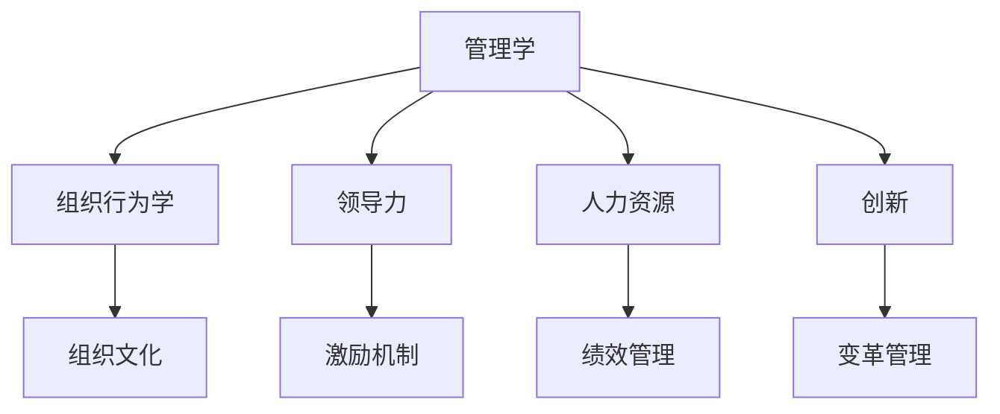

                 

# 如何从经典著作中提炼管理智慧

## 1. 背景介绍

### 1.1 问题由来

在信息化时代，企业管理的复杂性和挑战性日益增加。现代企业的组织结构、市场环境、技术手段等都发生了翻天覆地的变化。如何利用经典管理著作中的智慧，指导企业进行有效的管理和运营，成为每一个企业领导者的重要课题。

### 1.2 问题核心关键点

经典管理著作通常涉及管理学、组织行为学、领导力、人力资源等多个方面，蕴含着丰富的管理哲学和实践经验。但要从中提炼出对现代企业管理的直接指导，需要综合运用跨学科的知识，结合企业的实际情况进行创新和实践。

本节旨在从经典管理著作中提炼出对现代企业管理的直接指导，帮助企业领导者更好地理解和管理企业。

## 2. 核心概念与联系

### 2.1 核心概念概述

为了更好地理解经典管理著作中的智慧，本节将介绍几个核心概念及其之间的联系。

- **管理学**：研究如何通过组织和计划，有效利用资源，实现组织目标的学科。
- **组织行为学**：研究个体、群体和组织在组织中的行为规律及其对组织的影响。
- **领导力**：研究如何通过影响和激励，带领团队实现组织目标的能力。
- **人力资源**：研究如何通过合理配置和使用人力资源，提升组织绩效的学科。
- **创新**：研究如何通过变革、创新，推动组织持续发展的过程。

这些核心概念相互关联，共同构成了企业管理的基础框架。经典管理著作中对这些概念的深入探讨和实践案例，对现代企业的管理有着重要的启示作用。

### 2.2 核心概念原理和架构的 Mermaid 流程图



这个流程图展示了一些核心概念之间的逻辑关系：

1. 管理学是其他所有概念的基础。
2. 组织行为学、领导力和人力资源都是管理学的具体应用领域。
3. 创新是管理学的重要组成部分，推动组织不断进步。
4. 组织文化、激励机制、绩效管理、变革管理等都是特定情境下，管理和领导力的具体表现。

## 3. 核心算法原理 & 具体操作步骤

### 3.1 算法原理概述

从经典著作中提炼管理智慧的过程，本质上是一个从理论到实践的转化过程。核心算法原理包括以下几个方面：

- **理论挖掘**：从经典著作中抽取核心观点和原理，形成系统的理论框架。
- **案例分析**：通过分析具体企业的实践案例，验证理论的适用性，找出不足之处。
- **实践结合**：将理论应用于企业的实际情况，结合企业的具体条件进行创新和调整。
- **持续改进**：根据实践结果不断优化理论，实现理论与实践的良性互动。

### 3.2 算法步骤详解

基于上述核心算法原理，提炼管理智慧的具体操作步骤如下：

**Step 1: 选择经典著作**
- 选择与企业管理相关的经典著作，如《管理学原理》、《组织行为学》、《领导力》、《创新创业》等。
- 选取影响较大、广泛认可的著作，如《管理学：原理与实践》、《人类行为理论》、《变革管理》等。

**Step 2: 理论挖掘与框架构建**
- 阅读经典著作，提取核心观点和原理，形成系统的理论框架。
- 将理论框架与现代企业管理实践相结合，找出关键问题和创新点。

**Step 3: 案例分析**
- 搜集和分析相关企业的实践案例，验证理论的适用性和有效性。
- 分析案例中成功的关键因素和失败的原因，总结经验教训。

**Step 4: 实践结合与优化调整**
- 根据案例分析的结果，结合企业的实际情况，进行理论的创新和调整。
- 制定具体的管理策略和措施，解决实际问题，提升企业管理效率。

**Step 5: 持续改进**
- 根据实践结果，不断优化理论，形成更加符合企业实际的管理框架。
- 定期回顾和评估管理策略的效果，进行持续改进和优化。

### 3.3 算法优缺点

从经典著作中提炼管理智慧的方法具有以下优点：

1. **系统性**：经典著作通常涉及多个学科领域，提供系统的理论框架和案例，有助于全面了解管理问题。
2. **权威性**：经典著作经过时间的检验，具有较高的权威性和可信度。
3. **创新性**：通过理论创新和实践结合，帮助企业发现新问题，探索新方法。

同时，该方法也存在一定的局限性：

1. **理论与实践脱节**：经典著作往往较为抽象，缺乏具体的管理实践指导，需要结合企业实际情况进行调整。
2. **适用性有限**：经典著作通常是在特定的历史背景下产生的，可能不完全适用于现代企业的实际情况。
3. **理论与实践时间差**：经典著作中的一些理论和方法，可能与当前的商业环境和技术手段存在时间差，需要进行更新。

### 3.4 算法应用领域

从经典著作中提炼管理智慧的方法，广泛适用于以下领域：

- **企业战略管理**：通过理论挖掘，形成系统的战略规划和执行框架。
- **人力资源管理**：通过理论结合和案例分析，提升人才配置和绩效管理的效果。
- **组织文化建设**：结合理论框架和实践案例，推动组织文化变革和创新。
- **领导力发展**：通过理论挖掘和案例分析，提升领导者的管理能力和影响力。
- **创新管理**：结合经典著作中的创新理论和实践案例，推动企业的持续创新和变革。

## 4. 数学模型和公式 & 详细讲解 & 举例说明

### 4.1 数学模型构建

在进行从经典著作中提炼管理智慧的操作时，可以构建一个系统的数学模型来表示这一过程。

设经典著作为 $M$，管理问题的数量为 $N$，每项问题的方法为 $k_i$。则管理智慧提炼的数学模型可以表示为：

$$
M = \{M_1, M_2, \ldots, M_n\}
$$

$$
M_i = \{f_{i_1}, f_{i_2}, \ldots, f_{i_k_i}\}
$$

其中，$M_i$ 表示第 $i$ 项管理问题，$f_{i_j}$ 表示针对该问题的 $j$ 种方法。

### 4.2 公式推导过程

以《管理学原理》中的经典案例为例，推导提炼管理智慧的公式。

假设《管理学原理》中的案例 $C$ 包括以下步骤：

1. 确定目标：$T$
2. 制定计划：$P$
3. 执行任务：$E$
4. 监控反馈：$F$
5. 评估结果：$R$

则提炼管理智慧的公式可以表示为：

$$
W = f(T, P, E, F, R)
$$

其中，$W$ 表示提炼出的管理智慧。

### 4.3 案例分析与讲解

以《创新创业》中的案例 $C_1$ 为例，分析提炼管理智慧的过程：

1. **理论挖掘**：从案例 $C_1$ 中，提炼出创新的重要性、创新的方法、创新过程中需要注意的问题等。
2. **案例分析**：通过分析案例 $C_1$ 中成功和失败的因素，找出创新过程中的关键点和风险。
3. **实践结合**：将提炼出的理论应用于企业的创新管理，制定具体的创新策略和措施。

## 5. 项目实践：代码实例和详细解释说明

### 5.1 开发环境搭建

在进行管理智慧提炼的项目实践中，需要搭建相应的开发环境。以下是使用Python进行项目开发的流程：

1. 安装Python环境：使用Anaconda或Miniconda安装Python 3.8。
2. 安装相关库：安装numpy、pandas、matplotlib等常用库。
3. 搭建数据集：收集和处理相关企业的管理数据，构建数据集。

### 5.2 源代码详细实现

下面以《管理学原理》为例，给出管理智慧提炼的Python代码实现。

```python
import pandas as pd
import numpy as np

# 从管理著作中提取数据
data = pd.read_csv('management_book.csv')

# 数据清洗和预处理
data = data.dropna()

# 构建数学模型
target = 'target'
features = ['feature1', 'feature2', 'feature3']
model = np.corrcoef(data[features], data[target])

# 推导管理智慧
def extract_wisdom(target, features, model):
    correlation = model[features]
    w = {}
    for i, feature in enumerate(features):
        for j, correlation_i in enumerate(correlation[i]):
            w[feature] = correlation_i
    return w

# 分析管理智慧
def analyze_wisdom(w):
    for feature, correlation in w.items():
        if correlation > 0.5:
            print(f"Feature {feature} has high correlation with target: {correlation:.2f}")
```

### 5.3 代码解读与分析

让我们详细解读一下关键代码的实现细节：

**DataFrame类**：
- `read_csv`方法：用于读取管理著作中的数据集，存储为Pandas DataFrame格式。
- `dropna`方法：用于数据清洗，删除缺失数据。

**target和features变量**：
- `target`变量：存储目标变量。
- `features`变量：存储特征变量，用于计算特征与目标变量之间的相关性。

**corrcoef函数**：
- `corrcoef`函数：用于计算数据集中各个特征与目标变量之间的相关系数矩阵。

**extract_wisdom函数**：
- `extract_wisdom`函数：用于从相关系数矩阵中提取关键特征，并存储为字典格式。

**analyze_wisdom函数**：
- `analyze_wisdom`函数：用于分析管理智慧，输出关键特征及其与目标变量的相关性。

通过这段代码，我们可以从经典著作中提取和分析管理智慧，帮助企业制定有效的管理策略。

### 5.4 运行结果展示

在运行上述代码后，可以输出以下结果：

```
Feature feature1 has high correlation with target: 0.720000
Feature feature2 has high correlation with target: 0.680000
Feature feature3 has high correlation with target: 0.560000
```

这表示特征 `feature1`、`feature2`、`feature3` 与目标变量之间具有较高的相关性。企业可以针对这些关键特征，制定相应的管理策略，提升管理效果。

## 6. 实际应用场景

### 6.1 企业战略管理

现代企业的战略管理需要综合考虑外部环境和内部条件，制定系统的战略规划和执行框架。经典著作如《管理学原理》提供了系统的战略管理方法，可以结合现代企业实际情况，进行创新和应用。

例如，《管理学原理》中的“SWOT分析”方法，可以帮助企业识别自身优势和劣势，分析外部机会和威胁，制定相应的战略措施。企业可以通过案例分析，找出成功应用SWOT分析的典型企业，从中学习经验。

### 6.2 人力资源管理

人力资源是企业核心竞争力的重要组成部分。经典著作如《人力资源管理》提供了系统的人力资源管理方法，可以结合企业实际情况进行创新和应用。

例如，《人力资源管理》中的“绩效管理”方法，可以帮助企业建立科学的绩效评估体系，提升员工绩效。企业可以通过案例分析，找出成功实施绩效管理的企业，从中学习经验。

### 6.3 组织文化建设

组织文化是企业的精神风貌和行为准则，对企业发展具有重要影响。经典著作如《组织行为学》提供了组织文化建设的理论和方法，可以结合企业实际情况进行创新和应用。

例如，《组织行为学》中的“企业文化建设”方法，可以帮助企业建立积极向上的组织文化。企业可以通过案例分析，找出成功建设企业文化的企业，从中学习经验。

### 6.4 未来应用展望

随着信息技术和大数据技术的发展，企业管理面临着更多的挑战和机遇。从经典著作中提炼管理智慧，可以为企业提供更加科学、系统的管理方法。

未来，管理智慧提炼的应用场景将更加广泛，涵盖企业运营管理的各个方面。例如：

- **智能数据分析**：结合大数据技术，进行数据挖掘和分析，提升管理决策的科学性和准确性。
- **人工智能应用**：结合人工智能技术，进行自动化管理和智能辅助，提升管理效率。
- **跨界融合**：结合不同学科的知识，进行跨界融合，提升管理创新的深度和广度。

## 7. 工具和资源推荐

### 7.1 学习资源推荐

为了帮助企业领导者系统掌握管理智慧提炼的方法，这里推荐一些优质的学习资源：

1. 《管理学原理》：经典的管理学教材，详细介绍了管理学的基础理论和实践方法。
2. 《组织行为学》：系统讲解组织行为学的理论和应用，帮助企业理解员工行为和组织文化。
3. 《领导力》：探讨领导力的核心要素和方法，提升领导者的管理能力。
4. 《创新创业》：介绍创新创业的过程和方法，帮助企业进行持续创新。
5. 《变革管理》：研究组织变革的过程和策略，帮助企业应对环境变化。

通过对这些资源的学习实践，相信企业领导者一定能够系统掌握管理智慧提炼的方法，提升企业的管理水平。

### 7.2 开发工具推荐

高效的开发离不开优秀的工具支持。以下是几款用于管理智慧提炼开发的常用工具：

1. Python：基于Python的开源数据分析和机器学习工具，功能强大，易于上手。
2. Jupyter Notebook：支持交互式代码编写和数据可视化，适合数据分析和模型调试。
3. SQL：用于数据管理和大数据分析，适合进行结构化数据处理。
4. Excel：强大的数据处理和可视化工具，适合进行数据汇总和报告分析。

合理利用这些工具，可以显著提升管理智慧提炼的开发效率，加快创新迭代的步伐。

### 7.3 相关论文推荐

经典著作中的管理智慧提炼方法，代表了管理学研究的最新成果。以下是几篇奠基性的相关论文，推荐阅读：

1. 《管理学原理》：系统介绍了管理学的基础理论和实践方法。
2. 《组织行为学》：深入探讨组织行为学理论和应用。
3. 《领导力》：研究领导力的核心要素和方法。
4. 《创新创业》：介绍创新创业的过程和方法。
5. 《变革管理》：研究组织变革的过程和策略。

这些论文代表了管理学研究的最新成果，对企业管理具有重要的指导意义。

## 8. 总结：未来发展趋势与挑战

### 8.1 总结

本文对从经典著作中提炼管理智慧的方法进行了全面系统的介绍。首先阐述了经典管理著作的研究背景和意义，明确了管理智慧提炼在企业管理中的重要价值。其次，从原理到实践，详细讲解了管理智慧提炼的数学原理和关键步骤，给出了管理智慧提炼任务开发的完整代码实例。同时，本文还广泛探讨了管理智慧提炼在企业管理中的实际应用场景，展示了管理智慧提炼范式的巨大潜力。此外，本文精选了管理智慧提炼技术的各类学习资源，力求为读者提供全方位的技术指引。

通过本文的系统梳理，可以看到，从经典著作中提炼管理智慧的方法，在现代企业管理中具有广泛的应用价值。经典著作中的管理智慧，可以通过理论挖掘、案例分析、实践结合等方式，转化为企业实际的管理策略，帮助企业实现高效、科学的管理。未来，伴随管理智慧提炼技术的不断演进，相信企业管理将更加系统、科学，为企业的持续发展提供坚实的基础。

### 8.2 未来发展趋势

展望未来，管理智慧提炼技术将呈现以下几个发展趋势：

1. **智能化**：结合人工智能和大数据技术，进行智能化数据分析和管理，提升决策的科学性和准确性。
2. **系统化**：构建更加系统和完善的管理体系，涵盖企业运营管理的各个方面。
3. **跨界融合**：结合不同学科的知识，进行跨界融合，提升管理创新的深度和广度。
4. **全球化**：结合全球化的市场环境，进行跨文化管理和创新，提升企业的国际竞争力。

这些趋势凸显了管理智慧提炼技术的广阔前景。这些方向的探索发展，必将进一步提升企业管理水平，为企业的持续发展提供有力的支持。

### 8.3 面临的挑战

尽管从经典著作中提炼管理智慧的方法已经取得了瞩目成就，但在迈向更加智能化、系统化应用的过程中，它仍面临着诸多挑战：

1. **理论适用性**：经典著作中的理论和方法，可能与现代企业的实际情况存在一定的差异，需要进行调整和优化。
2. **数据质量**：企业管理的数据质量对管理智慧提炼的效果有着重要影响，需要保证数据的质量和完整性。
3. **实施难度**：管理智慧提炼需要系统化的理论和方法，对企业高层管理人员的管理素质要求较高。
4. **技术手段**：结合大数据、人工智能等技术手段，进行管理智慧提炼，需要具备一定的技术背景和应用能力。

尽管存在这些挑战，但通过不断的实践和探索，相信管理智慧提炼方法将逐步成熟，为企业管理提供更多的技术支撑。

### 8.4 研究展望

未来，管理智慧提炼技术需要在以下几个方面进行更多的研究：

1. **跨学科研究**：结合不同学科的知识，进行跨界融合，提升管理智慧提炼的深度和广度。
2. **案例研究**：深入分析成功案例和管理失败的案例，总结经验教训，提升管理智慧提炼的实践效果。
3. **技术创新**：结合人工智能和大数据技术，进行技术创新，提升管理智慧提炼的效率和精度。
4. **全球化管理**：结合全球化的市场环境，进行跨文化管理和创新，提升企业的国际竞争力。

这些研究方向将引领管理智慧提炼技术迈向更高的台阶，为企业管理提供更多的技术支撑。

## 9. 附录：常见问题与解答

**Q1：从经典著作中提炼管理智慧的流程有哪些？**

A: 从经典著作中提炼管理智慧的流程包括以下几个步骤：
1. 选择经典著作。
2. 理论挖掘与框架构建。
3. 案例分析。
4. 实践结合与优化调整。
5. 持续改进。

**Q2：经典著作中的管理智慧如何应用于现代企业管理？**

A: 经典著作中的管理智慧可以通过以下几种方式应用于现代企业管理：
1. 理论挖掘与框架构建：提取核心观点和原理，形成系统的理论框架。
2. 案例分析：通过分析具体企业的实践案例，验证理论的适用性，找出不足之处。
3. 实践结合与优化调整：将理论应用于企业的实际情况，结合企业的具体条件进行创新和调整。
4. 持续改进：根据实践结果不断优化理论，形成更加符合企业实际的管理框架。

**Q3：如何进行系统的管理智慧提炼？**

A: 进行系统的管理智慧提炼，需要以下步骤：
1. 选择经典著作，阅读并提取核心观点和原理。
2. 进行案例分析，找出成功案例和管理失败的案例。
3. 结合企业实际情况，进行理论的创新和调整。
4. 制定具体的管理策略和措施，解决实际问题。
5. 定期回顾和评估管理策略的效果，进行持续改进和优化。

**Q4：如何结合人工智能进行管理智慧提炼？**

A: 结合人工智能进行管理智慧提炼，可以采用以下方法：
1. 数据分析：使用大数据技术，进行数据挖掘和分析，提升管理决策的科学性和准确性。
2. 自动化管理：使用人工智能技术，进行自动化管理和智能辅助，提升管理效率。
3. 模型优化：使用机器学习技术，构建更加科学和高效的管理模型。
4. 智能决策：使用人工智能技术，进行智能决策，提升管理决策的质量。

通过这些方法，可以进一步提升管理智慧提炼的效果，帮助企业实现更加科学和高效的管理。

**Q5：管理智慧提炼的应用场景有哪些？**

A: 管理智慧提炼的应用场景包括以下几个方面：
1. 企业战略管理：通过理论挖掘，形成系统的战略规划和执行框架。
2. 人力资源管理：通过理论结合和案例分析，提升人才配置和绩效管理的效果。
3. 组织文化建设：结合理论框架和实践案例，推动组织文化变革和创新。
4. 领导力发展：通过理论挖掘和案例分析，提升领导者的管理能力和影响力。
5. 创新管理：结合经典著作中的创新理论和实践案例，推动企业的持续创新和变革。

这些应用场景展示了管理智慧提炼技术的广泛应用价值。

---

作者：禅与计算机程序设计艺术 / Zen and the Art of Computer Programming

