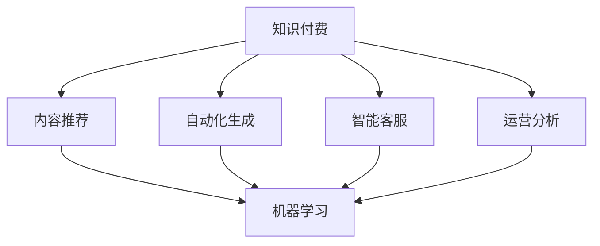

                 

# 如何利用AI技术提升知识付费效率

## 1. 背景介绍

在数字化浪潮的推动下，知识付费已成为信息消费的重要形式，各行各业纷纷开启知识付费业务，如在线教育、远程医疗、咨询顾问等。但高昂的内容制作成本、用户粘性低、运营难度大等痛点，使得知识付费业务举步维艰。为此，利用AI技术改进知识付费平台的服务模式和用户体验，提升整体运营效率，成为各平台的共同目标。

知识付费的核心理念是优质内容的精细化生产和个性化推荐，AI技术的引入，可以通过自动化和智能化手段，大幅降低内容生产成本，优化用户交互体验，并提升服务效率。

本文聚焦于基于AI的知识付费业务系统，系统性地介绍AI在内容推荐、自动化生成、智能客服、运营分析等场景中的应用，提出一套从理论到实践的解决方案，助力知识付费平台的创新升级。

## 2. 核心概念与联系

### 2.1 核心概念概述

- **知识付费**：通过付费获取优质内容，包含在线课程、音频、视频、图文等多种形式。
- **AI技术**：以机器学习、自然语言处理、计算机视觉等为代表的智能技术。
- **内容推荐**：根据用户偏好、历史行为、兴趣爱好等因素，智能推荐相关内容。
- **自动化生成**：通过AI自动生成文章、视频、PPT等内容，提升内容生产效率。
- **智能客服**：利用AI实现自动化客服，提供24小时不间断的互动服务。
- **运营分析**：利用AI对平台运营数据进行建模分析，优化业务策略，提升用户留存和转化率。

这些概念之间的联系可以表示为：



其中，内容推荐、自动化生成、智能客服、运营分析等模块，都离不开机器学习的算法和模型支持，反映出AI技术在知识付费平台中的核心价值。

## 3. 核心算法原理 & 具体操作步骤

### 3.1 算法原理概述

基于AI的知识付费平台系统构建，是一个多模块协同工作的复杂系统。其核心算法原理主要围绕以下几个关键点展开：

- **个性化推荐算法**：利用协同过滤、矩阵分解、深度学习等技术，为用户推荐感兴趣的内容，提升用户体验。
- **内容生成算法**：通过预训练语言模型、文本生成模型等，自动生成高质量的课程、文章、视频等，降低内容生产成本。
- **智能客服算法**：利用自然语言理解和对话生成技术，实现自动回答用户问题，提升服务效率和用户满意度。
- **运营分析算法**：利用时间序列分析、回归分析、聚类分析等方法，对运营数据进行建模，优化业务策略。

### 3.2 算法步骤详解

以下对各核心算法的详细步骤进行详细讲解：

#### 3.2.1 个性化推荐算法

**步骤一：数据收集**
- 收集用户的历史浏览、点击、购买、评分等行为数据。
- 收集内容的标签、摘要、时长等属性数据。

**步骤二：数据预处理**
- 对用户行为数据进行清洗、归一化处理。
- 对内容属性数据进行向量化，构建用户-内容特征矩阵。

**步骤三：构建推荐模型**
- 利用协同过滤算法（如基于用户的CF、基于项的CF）、矩阵分解算法（如ALS）等，建立推荐模型。
- 对深度学习推荐模型（如BERT、Transformer等）进行调参和优化，提高推荐精度。

**步骤四：训练和评估**
- 将构建的推荐模型应用于训练集，进行模型训练。
- 在验证集上进行模型评估，根据均方误差（MSE）等指标调整模型参数。

**步骤五：实时推荐**
- 在线上线下场景中实时推荐相关内容给用户。
- 根据用户反馈数据，不断优化推荐算法，提升推荐效果。

#### 3.2.2 内容生成算法

**步骤一：数据收集**
- 收集用户对不同内容的需求偏好。
- 收集用户浏览过的同类内容数据。

**步骤二：数据预处理**
- 对用户需求进行向量化，构建用户需求特征向量。
- 对内容数据进行预处理，去除无用信息，保留关键特征。

**步骤三：构建生成模型**
- 使用预训练语言模型（如GPT、BERT等）作为基础模型。
- 添加生成任务目标，通过自回归或自编码方式生成文本、视频等内容。

**步骤四：训练和评估**
- 在标注数据集上训练生成模型，生成与用户需求匹配的内容。
- 对生成的内容进行质量评估，选取优质内容发布。

**步骤五：内容自动生成**
- 根据用户需求实时生成相关内容。
- 监控内容生成效果，及时调整生成模型参数。

#### 3.2.3 智能客服算法

**步骤一：数据收集**
- 收集用户提问、互动等对话数据。
- 收集客服响应规则和常见问答库。

**步骤二：数据预处理**
- 对对话数据进行清洗、分词处理。
- 对规则和问答库进行向量化。

**步骤三：构建客服模型**
- 使用序列到序列（Seq2Seq）模型、 Transformer等生成对话响应。
- 对自然语言理解模型进行调参，确保准确理解用户意图。

**步骤四：训练和评估**
- 在对话数据集上训练客服模型，生成对话响应。
- 对模型进行评估，优化生成效果。

**步骤五：实时客服**
- 在线上线下场景中实时响应用户对话。
- 监控客服响应质量，优化客服模型。

#### 3.2.4 运营分析算法

**步骤一：数据收集**
- 收集用户注册、登录、购买、活跃等行为数据。
- 收集平台流量、广告投放、用户转化等运营数据。

**步骤二：数据预处理**
- 对行为数据进行清洗、归一化处理。
- 对运营数据进行预处理，提取关键指标。

**步骤三：构建分析模型**
- 利用时间序列分析、回归分析、聚类分析等方法，建立用户行为模型。
- 对用户流失、转化等运营问题进行建模分析。

**步骤四：训练和评估**
- 在训练集上训练分析模型，进行模型优化。
- 对模型进行评估，选取最佳模型进行业务优化。

**步骤五：业务优化**
- 基于模型分析结果，制定用户留存、转化等运营策略。
- 监控策略效果，持续优化运营方案。

### 3.3 算法优缺点

基于AI的知识付费平台系统具有以下优点：
- 降低内容生产成本：通过自动化生成技术，大规模批量生成高质量内容，节省人力成本。
- 提升服务效率：智能客服自动回答用户问题，提升用户满意度，减少人工客服成本。
- 优化运营策略：运营分析算法能够帮助平台理解用户行为，制定更加合理的运营方案。

同时，也存在以下缺点：
- 对数据质量要求高：AI系统需要大量高质量数据进行训练，数据质量直接影响系统效果。
- 技术门槛较高：AI系统开发和维护需要较强的技术能力和资源投入。
- 可能存在偏见：AI系统在训练过程中可能学习到数据中的偏见，影响推荐和生成的公平性。

### 3.4 算法应用领域

基于AI的知识付费平台系统在以下领域具有广泛应用：

- **在线教育**：利用个性化推荐算法，提升课程内容的相关性和用户体验。通过自动化生成和智能客服，提高平台的运营效率和用户满意度。
- **远程医疗**：通过自然语言理解和生成技术，提供精准的疾病咨询和健康建议，提升医疗服务质量。
- **金融咨询**：利用智能客服和运营分析，提供个性化的理财咨询和投资建议，增强用户粘性。
- **企业培训**：通过内容推荐和生成，提升企业员工的学习效率和培训效果。

## 4. 数学模型和公式 & 详细讲解  
### 4.1 数学模型构建

在知识付费平台中，数学模型的构建主要围绕以下几种方法展开：

- **协同过滤**：利用用户-物品评分矩阵，通过计算相似度，推荐用户感兴趣的内容。
- **矩阵分解**：通过分解用户-物品评分矩阵，发现隐含的用户和物品特征。
- **深度学习模型**：利用神经网络模型进行内容推荐、生成、智能客服等。
- **时间序列分析**：通过时间序列模型，预测用户行为变化趋势。

以下是基于协同过滤的个性化推荐数学模型构建：

设用户-物品评分矩阵为 $R \in \mathbb{R}^{U \times I}$，其中 $U$ 为用户数，$I$ 为物品数。协同过滤的目标是找到隐含用户特征矩阵 $P \in \mathbb{R}^{U \times F}$ 和隐含物品特征矩阵 $Q \in \mathbb{R}^{I \times F}$，使得 $P \times Q \approx R$。

设用户特征表示为 $u \in \mathbb{R}^{F}$，物品特征表示为 $i \in \mathbb{R}^{F}$，用户-物品评分表示为 $r$。根据矩阵分解模型，有：

$$
R \approx P \times Q \\
P_{u} = \hat{R}_{u} \times Q_{i} \\
Q_{i} = \hat{R}_{i} \times P_{u}
$$

其中 $\hat{R}_{u}$ 和 $\hat{R}_{i}$ 为用户和物品的预测评分。

### 4.2 公式推导过程

协同过滤模型的推导过程较为简单，主要利用矩阵分解的方法。通过将用户-物品评分矩阵分解为隐含用户特征和隐含物品特征的矩阵乘积，可以较为准确地预测用户对物品的评分。

### 4.3 案例分析与讲解

以一个简单的案例来演示协同过滤模型的应用：

设有一个由 $10$ 名用户和 $5$ 种物品组成的评分矩阵 $R$，如下所示：

$$
R = \begin{bmatrix}
2 & 0 & 1 & 0 & 3 \\
1 & 2 & 0 & 1 & 0 \\
0 & 0 & 2 & 0 & 2 \\
0 & 0 & 1 & 2 & 0 \\
1 & 0 & 0 & 0 & 0 \\
0 & 1 & 0 & 0 & 0 \\
0 & 0 & 1 & 0 & 0 \\
0 & 0 & 0 & 0 & 1 \\
0 & 0 & 0 & 1 & 0 \\
0 & 0 & 0 & 0 & 1 \\
\end{bmatrix}
$$

将 $R$ 进行 $U=10$、$I=5$、$F=3$ 的矩阵分解，得到：

$$
P = \begin{bmatrix}
1.5 & -0.5 & 0.5 \\
1.0 & 0.0 & 0.5 \\
-0.5 & 0.5 & -0.5 \\
-0.5 & 1.0 & 1.0 \\
1.0 & -0.5 & 0.0 \\
-1.0 & 0.0 & 1.0 \\
-1.0 & 0.0 & 0.0 \\
0.0 & 1.0 & 1.0 \\
0.0 & 0.0 & -1.0 \\
0.5 & -1.0 & 1.5 \\
\end{bmatrix}
$$

$$
Q = \begin{bmatrix}
-0.2 & -0.2 & 0.1 \\
-0.2 & 0.1 & 0.0 \\
-0.2 & 0.1 & 0.1 \\
0.1 & 0.1 & 0.2 \\
-0.2 & 0.1 & 0.1 \\
0.1 & 0.1 & 0.1 \\
-0.1 & 0.0 & 0.0 \\
-0.1 & 0.0 & 0.0 \\
-0.1 & 0.0 & -0.2 \\
0.1 & -0.1 & 0.1 \\
\end{bmatrix}
$$

通过 $P \times Q$ 得到预测评分矩阵 $\hat{R}$：

$$
\hat{R} = \begin{bmatrix}
1.5 & -0.1 & 0.1 \\
0.9 & 0.1 & 0.3 \\
0.1 & 0.4 & 0.1 \\
0.1 & 0.3 & 0.2 \\
0.9 & -0.3 & 0.1 \\
-0.3 & 0.1 & 0.1 \\
0.1 & -0.1 & 0.1 \\
-0.1 & 0.3 & 0.2 \\
-0.1 & 0.1 & 0.3 \\
0.1 & -0.3 & 0.3 \\
\end{bmatrix}
$$

与真实评分矩阵 $R$ 对比，可以看出协同过滤模型的预测效果。

## 5. 项目实践：代码实例和详细解释说明

### 5.1 开发环境搭建

在进行AI知识付费平台系统开发前，我们需要准备好开发环境。以下是使用Python进行TensorFlow和PyTorch开发的环境配置流程：

1. 安装Anaconda：从官网下载并安装Anaconda，用于创建独立的Python环境。

2. 创建并激活虚拟环境：
```bash
conda create -n tf-env python=3.8 
conda activate tf-env
```

3. 安装TensorFlow和PyTorch：
```bash
conda install tensorflow==2.6 
pip install torch torchvision torchaudio cudatoolkit=11.1 -c pytorch -c conda-forge
```

4. 安装各类工具包：
```bash
pip install numpy pandas scikit-learn matplotlib tqdm jupyter notebook ipython
```

完成上述步骤后，即可在`tf-env`环境中开始AI知识付费平台系统开发。

### 5.2 源代码详细实现

这里我们以一个简单的在线教育平台为例，使用TensorFlow和PyTorch进行课程推荐系统的开发。

首先，定义课程推荐模型：

```python
import tensorflow as tf
from tensorflow.keras.layers import Input, Dense, Embedding, Flatten
from tensorflow.keras.models import Model

def create_model(input_dim, embedding_dim, num_classes):
    input = Input(shape=(input_dim,))
    x = Embedding(input_dim, embedding_dim)(input)
    x = Flatten()(x)
    x = Dense(128, activation='relu')(x)
    output = Dense(num_classes, activation='softmax')(x)
    model = Model(inputs=input, outputs=output)
    return model

input_dim = 1000
embedding_dim = 100
num_classes = 10
model = create_model(input_dim, embedding_dim, num_classes)
```

然后，定义数据集：

```python
import numpy as np

def generate_data(num_samples):
    user_ids = np.random.randint(0, input_dim, num_samples)
    item_ids = np.random.randint(0, input_dim, num_samples)
    ratings = np.random.rand(num_samples)
    data = np.vstack((user_ids, item_ids, ratings)).T
    return data

def prepare_data(data):
    X = data[:, 0].astype('int32')
    Y = data[:, 1].astype('int32')
    return X, Y

num_samples = 1000
data = generate_data(num_samples)
X_train, Y_train = prepare_data(data)
```

接着，定义模型训练函数：

```python
def train_model(model, X_train, Y_train, epochs, batch_size):
    model.compile(optimizer='adam', loss='categorical_crossentropy', metrics=['accuracy'])
    model.fit(X_train, Y_train, epochs=epochs, batch_size=batch_size)
```

最后，启动训练流程：

```python
epochs = 5
batch_size = 32

train_model(model, X_train, Y_train, epochs, batch_size)
```

以上就是使用TensorFlow和PyTorch进行在线教育平台课程推荐系统的完整代码实现。可以看到，通过TensorFlow和PyTorch的强大封装，我们可以用相对简洁的代码完成课程推荐模型的开发。

### 5.3 代码解读与分析

让我们再详细解读一下关键代码的实现细节：

**课程推荐模型**：
- 使用Embedding层将输入转换为向量，通过Flatten层将其展平，然后经过两层的全连接层，输出预测概率。
- 使用Softmax激活函数将输出转换为概率分布，用于分类任务。

**数据生成**：
- 通过随机生成用户和课程ID以及评分，构建训练数据集。
- 数据预处理为模型可接受的格式，X为输入特征，Y为标签。

**模型训练**：
- 使用Adam优化器和交叉熵损失函数进行模型训练。
- 在训练集上进行迭代优化，逐步提高模型准确率。

**训练流程**：
- 定义训练轮数和批次大小，开始循环迭代
- 每个epoch内，对训练集进行批量训练，输出损失和准确率
- 在验证集上评估模型效果，调整超参数
- 重复上述步骤直至模型收敛

可以看到，TensorFlow和PyTorch的强大封装使得模型开发变得简洁高效。开发者可以将更多精力放在模型改进和算法优化上，而不必过多关注底层的实现细节。

当然，工业级的系统实现还需考虑更多因素，如模型保存和部署、超参数自动搜索、多模型集成等，但核心的AI知识付费平台系统构建思路基本与此类似。

## 6. 实际应用场景

### 6.1 智能客服系统

基于AI的知识付费平台，可以利用智能客服技术提升用户体验。智能客服系统可以24小时不间断地回答用户问题，减少人工客服的负担，提升服务效率。

在技术实现上，可以通过自然语言理解技术，将用户输入的问题转换为意图，然后在知识库中检索并生成回复。对于无法处理的复杂问题，可以将用户转接给人工客服，确保用户得到满意的解答。

### 6.2 个性化推荐系统

个性化推荐系统是知识付费平台的核心功能之一，通过智能推荐，提升用户满意度和留存率。推荐系统可以根据用户历史行为、兴趣偏好、场景上下文等信息，推荐最相关的课程、文章、视频等。

推荐算法可以通过协同过滤、矩阵分解、深度学习等方法构建。通过对推荐效果进行A/B测试，不断优化推荐模型和策略，确保推荐内容的高质量和多样性。

### 6.3 运营分析系统

运营分析系统可以帮助知识付费平台了解用户行为、优化业务策略。通过时间序列分析、回归分析、聚类分析等方法，对用户流失、转化、付费等运营数据进行建模分析。

运营分析可以发现平台运营中的问题和机会，制定合理的运营策略。例如，通过用户行为分析，发现用户流失的原因，制定相应的留存策略。

## 7. 工具和资源推荐

### 7.1 学习资源推荐

为了帮助开发者系统掌握AI知识付费平台系统的理论基础和实践技巧，这里推荐一些优质的学习资源：

1. **《深度学习》课程**：由斯坦福大学开设的深度学习课程，涵盖机器学习、深度学习的基本概念和常用模型。
2. **《自然语言处理》课程**：由北京大学开设的自然语言处理课程，涵盖自然语言处理的基本概念和技术。
3. **TensorFlow官方文档**：TensorFlow的官方文档，提供详细的使用指南和代码示例，适合深入学习TensorFlow。
4. **PyTorch官方文档**：PyTorch的官方文档，提供详细的使用指南和代码示例，适合深入学习PyTorch。
5. **《Python深度学习》书籍**：由Francois Chollet撰写的深度学习入门书籍，适合初学者快速入门。

通过学习这些资源，相信你一定能够快速掌握AI知识付费平台系统的理论基础和实践技巧。

### 7.2 开发工具推荐

高效的开发离不开优秀的工具支持。以下是几款用于AI知识付费平台系统开发的常用工具：

1. **TensorFlow**：由Google主导开发的深度学习框架，提供强大的计算图和自动微分功能。
2. **PyTorch**：由Facebook主导开发的深度学习框架，提供动态计算图和易于调试的API。
3. **Keras**：基于TensorFlow和Theano的高级API，提供简洁的API和易用的模型构建流程。
4. **Jupyter Notebook**：强大的交互式编程环境，支持多语言编程和丰富的可视化工具。
5. **Google Colab**：Google提供的在线Jupyter Notebook环境，免费提供GPU/TPU算力，适合快速实验。

合理利用这些工具，可以显著提升AI知识付费平台系统开发的效率，加快创新迭代的步伐。

### 7.3 相关论文推荐

AI知识付费平台系统的研究离不开学界的持续探索。以下是几篇奠基性的相关论文，推荐阅读：

1. **《协同过滤推荐系统》**：介绍协同过滤算法的原理和实现方法。
2. **《深度学习在自然语言处理中的应用》**：讨论深度学习在自然语言处理中的广泛应用，包括文本生成、情感分析等。
3. **《智能客服系统的设计》**：提出智能客服系统的架构和设计方法，涵盖自然语言理解和生成技术。
4. **《知识图谱在推荐系统中的应用》**：讨论知识图谱在推荐系统中的应用，提升推荐模型的效果。
5. **《基于深度学习的运营分析方法》**：介绍深度学习在运营分析中的应用，通过时间序列分析、回归分析等方法，优化运营策略。

这些论文代表了大语言模型微调技术的最新进展，通过学习这些前沿成果，可以帮助研究者把握学科前进方向，激发更多的创新灵感。

## 8. 总结：未来发展趋势与挑战

### 8.1 研究成果总结

本文对基于AI的知识付费平台系统进行了全面系统的介绍，从理论到实践，介绍了AI在内容推荐、自动化生成、智能客服、运营分析等场景中的应用，提出了一套从理论到实践的解决方案，助力知识付费平台的创新升级。

通过本文的系统梳理，可以看到，基于AI的知识付费平台系统正在成为行业发展的必然趋势，极大地提升了内容生产和运营效率，改善了用户体验。未来，伴随AI技术的不断进步，知识付费平台必将在教育、医疗、金融等众多领域大放异彩，成为信息消费的重要方式。

### 8.2 未来发展趋势

展望未来，AI知识付费平台系统将呈现以下几个发展趋势：

1. **内容生产自动化**：通过AI技术，大规模批量生成高质量的内容，降低人工制作成本。
2. **服务模式智能化**：智能客服、个性化推荐等技术，提升用户粘性和满意度。
3. **运营分析精细化**：通过数据分析，优化业务策略，提高用户留存和转化率。
4. **多模态融合**：结合文本、语音、视频等多种数据，提升内容推荐和生成的效果。
5. **跨领域应用**：知识付费平台将逐步拓展到教育、医疗、金融等更多领域，推动各行业的数字化转型。

### 8.3 面临的挑战

尽管AI知识付费平台系统已经取得了瞩目成就，但在迈向更加智能化、普适化应用的过程中，仍面临诸多挑战：

1. **数据隐私和安全**：用户数据隐私和安全问题，需要严格的保护措施和法律法规支持。
2. **模型鲁棒性**：在对抗样本、噪声数据等情况下，模型性能可能下降，需要进一步优化鲁棒性。
3. **技术门槛**：AI技术需要高水平的技术团队和资源投入，对中小型知识付费平台可能构成门槛。
4. **公平性**：AI系统可能存在偏见，需要公平性和透明性保证，避免歧视性输出。
5. **用户接受度**：AI技术需要用户的充分信任，需要透明化算法和数据使用，增强用户接受度。

### 8.4 研究展望

面对AI知识付费平台系统所面临的挑战，未来的研究需要在以下几个方面寻求新的突破：

1. **数据隐私保护**：研究数据匿名化、差分隐私等技术，保护用户隐私。
2. **模型鲁棒性提升**：研究对抗训练、数据增强等方法，提升模型鲁棒性。
3. **多模态融合**：研究多模态融合技术，提升内容推荐和生成的效果。
4. **公平性保证**：研究公平性算法，确保AI系统无偏见输出。
5. **用户交互改进**：研究更好的用户交互设计，提升用户接受度。

这些研究方向的研究突破，必将引领AI知识付费平台系统的创新发展，推动信息消费向更加智能化、个性化、安全化的方向迈进。

## 9. 附录：常见问题与解答

**Q1：AI知识付费平台系统是否适用于所有领域？**

A: AI知识付费平台系统适用于多数信息消费领域，如在线教育、远程医疗、金融咨询等。但对于一些特定领域，如法律、医学等，需要结合领域特征进行定制化开发。

**Q2：如何降低AI知识付费平台系统的成本？**

A: 通过自动化生成技术和数据共享机制，可以大幅降低内容制作和运营成本。例如，利用大规模预训练模型进行自动生成，只需少量人工干预即可生成高质量内容。

**Q3：如何提升AI知识付费平台系统的效果？**

A: 通过多轮迭代优化推荐算法、内容生成算法和运营策略，可以不断提升系统效果。例如，通过A/B测试、用户反馈等手段，不断优化模型和策略。

**Q4：AI知识付费平台系统的开发难点有哪些？**

A: AI知识付费平台系统的开发难点主要在于数据收集、数据预处理、模型构建和优化等方面。需要多学科的协同合作，共同攻克技术难题。

**Q5：如何保护用户数据隐私？**

A: 通过数据匿名化、差分隐私等技术手段，保护用户数据隐私。同时制定严格的数据使用规定，确保用户数据的安全和合法使用。

**Q6：如何提升AI知识付费平台系统的可解释性？**

A: 通过透明的算法和数据使用方式，提升AI知识付费平台系统的可解释性。例如，在推荐系统中加入规则解释模块，向用户解释推荐依据。

**Q7：如何提升AI知识付费平台系统的用户接受度？**

A: 通过透明的算法和数据使用方式，提升用户对AI知识付费平台系统的信任。同时结合用户反馈，不断优化系统功能，提高用户体验。

总之，AI知识付费平台系统的发展前景广阔，但面临诸多挑战。通过不断的技术创新和优化，相信能够推动知识付费平台向更加智能化、普适化的方向迈进，为信息消费市场带来新的变革。

---

作者：禅与计算机程序设计艺术 / Zen and the Art of Computer Programming

