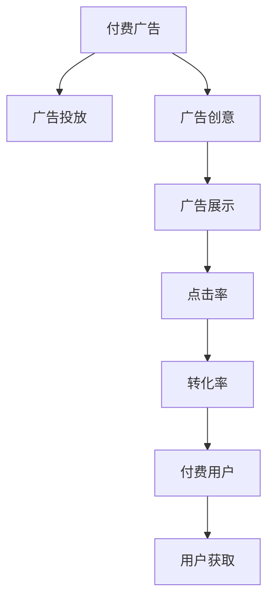

                 

# 如何利用付费广告推广知识付费产品

> 关键词：付费广告, 知识付费, 推广, 广告投放, 营销策略, 用户获取

## 1. 背景介绍

### 1.1 问题由来
在知识经济时代，知识的价值被广泛认可和重视。知识付费产品如在线课程、电子书、咨询服务、研究报告等，已经逐渐成为个人和企业获取信息、提升能力的重要渠道。然而，面对日益激烈的市场竞争，知识付费产品的推广和用户获取成为了一大难题。传统的推广方式如线下广告、官网推广等效率有限，难以在短时间内获得显著的用户增长。因此，利用付费广告进行市场推广，成为知识付费产品快速扩展用户群的重要手段。

### 1.2 问题核心关键点
利用付费广告推广知识付费产品的关键在于：
- 选择合适的广告平台和投放策略。不同平台的用户特征不同，需根据产品定位选择合适的平台。
- 设计吸引人的广告创意和投放参数。广告创意和投放参数直接影响广告的点击率和转化率。
- 精确衡量广告投放效果并进行优化。通过数据分析不断调整投放策略，提高广告投入产出比。

### 1.3 问题研究意义
通过付费广告推广知识付费产品，可以有效降低推广成本，快速提升用户注册量，缩短产品市场化进程，快速回笼资金。同时，精准的广告投放可以帮助产品触及目标用户，提升用户满意度，构建品牌信任。利用付费广告推广知识付费产品，不仅能够帮助产品快速拓展市场，还能为后续的口碑传播和品牌建设打下坚实基础。

## 2. 核心概念与联系

### 2.1 核心概念概述

为更好地理解付费广告推广知识付费产品的方法，本节将介绍几个密切相关的核心概念：

- 付费广告(Paid Advertising)：指由广告主支付一定费用，通过广告平台向目标用户展示的广告形式。常见的付费广告包括搜索引擎广告、社交媒体广告、视频平台广告等。
- 知识付费产品(Knowledge-Paying Products)：指用户需支付一定费用才能获取的知识服务产品，如在线课程、电子书、咨询服务等。
- 广告投放(Ad Placement)：指将广告展示在特定平台或媒介上的过程。需根据产品特性和目标用户选择合适的广告位和投放时机。
- 广告创意(Ad Creativity)：指广告的设计和制作，包括文案、图片、视频等内容。创意直接影响广告的吸引力和用户点击率。
- 广告投放优化(Ad Optimization)：指通过数据分析和策略调整，提升广告投放效果，降低广告成本的过程。主要包括投放策略优化、创意优化、受众定位优化等。

这些核心概念之间的逻辑关系可以通过以下Mermaid流程图来展示：



这个流程图展示了大语言模型的核心概念及其之间的关系：

1. 付费广告通过广告平台进行投放。
2. 广告创意设计直接影响广告展示效果。
3. 广告展示带来用户点击，进而影响广告转化率。
4. 广告转化率决定付费用户的数量。
5. 付费用户数量的多少直接反映广告投放的效果和用户获取的成效。

## 3. 核心算法原理 & 具体操作步骤
### 3.1 算法原理概述

利用付费广告推广知识付费产品的关键在于将付费广告的投入转化为用户注册和付费的产出。其核心思想是：根据产品的特性和目标用户群体，选择合适的广告平台和投放策略，通过精准的广告创意和投放参数设计，最大化广告点击率和转化率，从而实现高效的用户获取和推广。

形式化地，假设广告预算为$B$，广告点击率为$C$，转化率为$T$，则期望的付费用户数量$U$可以表示为：

$$
U = B \times C \times T
$$

通过优化广告投放参数，最大化$C$和$T$，即可提高$U$的值，实现广告投放的良好效果。

### 3.2 算法步骤详解

利用付费广告推广知识付费产品的步骤通常包括以下几个关键步骤：

**Step 1: 广告平台选择**
- 根据产品特性和目标用户，选择适合的广告平台。如教育类产品适合在社交媒体平台投放，而专业咨询类产品则适合在行业垂直网站投放。
- 根据平台的用户特征和广告投放效果，选择目标广告位。如搜索引擎广告位、社交媒体广告位、视频平台广告位等。

**Step 2: 广告创意设计**
- 设计吸引用户的广告文案和视觉元素，包括标题、副标题、图片、视频等。
- 制作广告视频，需注意时长和内容亮点。视频广告的点击率和转化率通常高于静态图片广告。
- 编写富有吸引力的文案，突出产品特点和用户收益。

**Step 3: 广告投放参数设置**
- 设定广告预算$B$，根据产品生命周期和市场环境进行合理分配。初期推广时预算可适当增加，后期稳定期则需控制成本。
- 设定广告投放时间、投放周期、广告展示位置等参数。根据不同平台的投放效果，合理设置广告投放时长和频率。

**Step 4: 广告投放优化**
- 监控广告展示效果，统计广告点击率$C$、展示量、点击量等数据。
- 根据投放效果数据，调整广告创意和投放参数，进行A/B测试。
- 分析广告转化率$T$，统计广告带来的实际付费用户数量。
- 持续优化投放策略，提升广告投放效果。

**Step 5: 数据统计与反馈**
- 对广告投放数据进行统计分析，如点击率、转化率、投放成本、广告ROI等。
- 根据数据分析结果，调整广告投放策略。
- 对广告投放效果进行定期评估和反馈，优化后续广告投放方案。

以上是利用付费广告推广知识付费产品的一般流程。在实际应用中，还需要根据具体产品特性和市场环境，灵活调整投放策略和优化方法。

### 3.3 算法优缺点

利用付费广告推广知识付费产品具有以下优点：
1. 高效快速。通过精准投放和创意设计，广告可以快速触达目标用户，获取大量付费用户。
2. 用户精准。付费广告的定向投放功能，可以精确锁定目标用户，提升用户注册率和付费率。
3. 数据可控。广告投放过程可控性强，可以通过数据分析和优化，持续提升广告效果。
4. 风险可控。付费广告按点击或展示付费，风险较低，适合各类预算限制下的推广。

同时，该方法也存在一些局限性：
1. 费用较高。付费广告投放需要投入一定费用，成本较高。
2. 效果依赖创意。广告创意的好坏直接影响广告效果，创意设计难度大。
3. 竞争激烈。随着广告主数量增加，广告竞争变得激烈，广告点击率可能下降。
4. 转化率受限。广告的最终转化效果受限于产品内容和用户体验，优化空间有限。

尽管存在这些局限性，但就目前而言，付费广告推广仍是知识付费产品推广的主要手段之一。未来相关研究的重点在于如何进一步降低广告成本，提高广告创意设计质量，提升广告投放效果。

### 3.4 算法应用领域

利用付费广告推广知识付费产品的方法已经广泛应用于在线教育、职业培训、财经资讯、心理咨询等诸多领域。以下是几个典型应用场景：

- **在线教育**：许多在线教育平台通过付费广告在社交媒体和搜索引擎上推广课程。广告吸引用户点击访问网站，注册课程并付费，实现快速用户获取。
- **职业培训**：职业技能培训平台如Coursera、Udemy等，通过付费广告推广实战课程和认证项目。广告精准投放至目标用户，提供高性价比课程，吸引用户付费注册。
- **财经资讯**：财经新闻和研究报告订阅平台通过付费广告推广，吸引对金融市场感兴趣的潜在用户，提升用户注册和订阅率。
- **心理咨询**：心理咨询和心理治疗平台如Talkspace、BetterHelp等，通过付费广告推广个性化服务。广告精准投放至需要心理帮助的用户，促使其进行在线咨询并付费。

除了上述这些经典应用外，付费广告推广技术也在更多领域得到应用，如社交媒体营销、SaaS产品推广、游戏广告投放等，为知识付费产品打开了更广阔的推广途径。

## 4. 数学模型和公式 & 详细讲解 & 举例说明

### 4.1 数学模型构建

为了更好地理解付费广告推广知识付费产品的原理，我们可以使用数学语言对广告投放过程进行严格描述。

假设广告预算为$B$，广告点击率为$C$，广告转化率为$T$，则期望的付费用户数量$U$可以表示为：

$$
U = B \times C \times T
$$

为了最大化$U$，我们需要优化$C$和$T$。设广告创意的预算为$C_0$，广告展示的点击量为$N_C$，广告带来的转化用户数量为$N_T$，则$C$和$T$可以表示为：

$$
C = \frac{C_0}{N_C} \\
T = \frac{N_T}{N_C}
$$

代入$U$的公式中，得：

$$
U = \frac{B \times C_0 \times N_T}{N_C}
$$

其中，$C_0$和$N_C$分别为广告创意预算和广告展示点击量。$N_T$为广告转化用户数量，可以通过后续数据分析得到。

### 4.2 公式推导过程

将上述公式展开，得到：

$$
U = \frac{B \times C_0 \times N_T}{N_C} = B \times \frac{C_0}{N_C} \times \frac{N_T}{1}
$$

其中，$\frac{C_0}{N_C}$为广告点击率，$\frac{N_T}{1}$为广告转化率。

对上述公式进行分析，可以看到$U$的值与广告预算$B$、广告点击率$C_0/N_C$、广告转化率$N_T/1$成正比。因此，我们需要通过优化广告创意和投放策略，最大化广告点击率和转化率。

### 4.3 案例分析与讲解

以下以Coursera在线教育平台的付费广告推广为例，对付费广告推广知识付费产品的具体应用进行说明。

**案例背景**：
Coursera是一家知名的在线教育平台，提供各类在线课程和认证项目。平台的目标用户群体包括对职业发展和学术研究有需求的学生和专业人士。

**推广策略**：
1. **广告平台选择**：Coursera选择在Google AdWords、Facebook Ads、LinkedIn Ads等平台上进行广告投放。这些平台拥有大量潜在的高质量用户，符合Coursera的目标用户群体。
2. **广告创意设计**：Coursera的广告文案设计简洁明了，突出课程特色和用户收益。同时制作了多段视频广告，展示了课程的教学内容、讲师介绍和学员反馈，吸引用户点击。
3. **广告投放参数设置**：Coursera设定了合理的广告预算，初期推广时预算为$10,000/天，后期稳定期预算减少至$5,000/天。广告投放时间选择周末和节假日，提高用户点击率。
4. **广告投放优化**：Coursera定期监控广告效果，对广告创意和投放参数进行调整。通过A/B测试优化广告文案和展示位置，提高广告点击率和转化率。
5. **数据统计与反馈**：Coursera对广告投放数据进行统计分析，发现Google AdWords平台带来的点击率最高。据此调整广告预算，增加Google AdWords平台的投放。

**效果评估**：
通过上述推广策略，Coursera在6个月内新增了10万名付费用户，广告ROI达到1:4。平台用户数量显著增加，课程注册量和付费率也得到了提升。

## 5. 项目实践：代码实例和详细解释说明

### 5.1 开发环境搭建

在进行付费广告推广项目开发前，我们需要准备好开发环境。以下是使用Python进行AdWords广告推广的开发环境配置流程：

1. 安装AdWords广告管理工具：访问Google Ads网站，免费注册并下载AdWords客户端软件。
2. 创建和管理广告账户：在AdWords平台上创建新的广告账户，设置预算、广告组、关键词等。
3. 安装AdWords API库：通过pip安装AdWords API库，使用Python代码进行广告投放和管理。
4. 安装Google Analytics：使用Google Analytics工具，实时监控广告投放效果，分析用户点击和转化数据。

完成上述步骤后，即可在AdWords平台上进行广告投放。

### 5.2 源代码详细实现

下面以Google AdWords为例，给出使用Python进行广告投放和优化的代码实现。

```python
from googleads import adwords
from googleads.utils import KeywordAnalytics

# 创建广告客户和广告组
customer = adwords.AdWordsCustomer()
customer.cc_name = 'Coursera Ad Account'
customer.cc_email = 'your-email@gmail.com'
customer.cc_password = 'your-password'

# 创建广告组
customer.create_ad_group(
    name='Coursera Onboarding Ads',
    bid_ceiling='5.00',
    ads=[{
        'ad_format': 'TEXT',
        'headline': 'Join Coursera Now',
        'body': 'Get Access to Top Courses and Certifications',
        'final_url': 'https://www.coursera.org/courses'
    }],
    targeting=[])

# 创建关键词
keywords = KeywordAnalytics()
keywords.cc_name = 'Coursera Ad Account'
keywords.cc_email = 'your-email@gmail.com'
keywords.cc_password = 'your-password'

keywords.create_keyword(['online courses', 'courses', 'learning'])

# 创建广告创意
customer.create_ad([
    {
        'ad_id': 'your-ad-id',
        'headline': 'Join Coursera Now',
        'body': 'Get Access to Top Courses and Certifications',
        'descriptive_title': 'Join Coursera to Unlock Your Potential',
        'link_text': 'Learn More',
        'final_url': 'https://www.coursera.org/courses'
    }
])

# 创建广告扩展
customer.create_ad_extension(
    ad_id='your-ad-id',
    ad_extension_id='your-ad-extension-id',
    ad_extension_type='STRUCTURED_URL',
    structured_url='https://www.coursera.org/courses?c=')

# 创建广告系列
customer.create_ad_series(
    name='Coursera Onboarding Series',
    ad_group_ids=['your-ad-group-id'],
    ad_ids=['your-ad-id'],
    bids=['your-bid'],
    combinations=['your-combination'])

# 创建广告计划
customer.create_ad_plan(
    name='Coursera Onboarding Plan',
    ad_series_ids=['your-ad-series-id'],
    ad_group_ids=['your-ad-group-id'],
    bids=['your-bid'],
    combinations=['your-combination'])
```

上述代码实现了创建广告客户、广告组、关键词、广告创意和广告计划的基本流程。开发者可以根据具体需求进行扩展和优化。

### 5.3 代码解读与分析

让我们再详细解读一下关键代码的实现细节：

**广告组创建**：
- 创建广告组，设定广告预算、广告格式、广告文案和目标URL。
- 添加关键词，设定目标用户群体。
- 创建广告创意，设定广告标题、副标题、正文和链接。

**广告扩展创建**：
- 创建广告扩展，增强广告的点击和转化效果。

**广告系列和广告计划创建**：
- 创建广告系列，设定广告组、广告ID、出价、出价组合。
- 创建广告计划，设定广告系列、广告组、出价、出价组合。

这些步骤构成了付费广告投放的基本流程，开发者可以根据具体需求进行进一步的调整和优化。

### 5.4 运行结果展示

在AdWords平台上运行上述代码，即可开始广告投放。监控广告效果，统计广告点击率和转化率，调整广告创意和投放参数，持续优化广告投放效果。

## 6. 实际应用场景

### 6.1 智能客服系统

智能客服系统利用付费广告推广，可以快速获取用户需求和市场反馈，提高客户服务体验。通过在线广告吸引用户访问网站，智能客服系统能够提供高效、智能的客服服务，提升用户满意度。

### 6.2 金融理财平台

金融理财平台通过付费广告推广，可以快速获取大量用户注册，降低获客成本。同时，精准的广告投放能够吸引对金融理财有需求的用户，提升平台的用户粘性和交易量。

### 6.3 医疗健康平台

医疗健康平台通过付费广告推广，可以快速获取用户健康咨询和服务的注册。精准的广告投放能够吸引对健康有需求的用户，提升平台的用户数量和服务质量。

### 6.4 未来应用展望

随着付费广告技术的不断发展和优化，其应用范围将不断拓展。未来，付费广告推广将在更多领域得到应用，为各类知识付费产品的推广提供更高效、精准的解决方案。

## 7. 工具和资源推荐
### 7.1 学习资源推荐

为了帮助开发者系统掌握付费广告推广的理论基础和实践技巧，这里推荐一些优质的学习资源：

1. 《Google Ads认证课程》：由Google官方推出的认证课程，详细介绍了AdWords平台的广告投放方法和最佳实践。
2. 《Facebook Ads官方文档》：Facebook广告平台的官方文档，提供了详细的广告投放指南和API接口。
3. 《LinkedIn Ads用户手册》：LinkedIn广告平台的官方用户手册，介绍了广告投放的各项功能和优化策略。
4. 《AdWords API文档》：AdWords平台的API文档，提供了广告投放和管理的具体实现方法。

通过对这些资源的学习实践，相信你一定能够快速掌握付费广告推广的精髓，并用于解决实际的广告投放问题。

### 7.2 开发工具推荐

高效的广告投放离不开优秀的工具支持。以下是几款用于付费广告投放开发的常用工具：

1. Google Ads：由Google提供的广告投放平台，支持Google AdWords、Google Display Network等广告位。
2. Facebook Ads Manager：Facebook提供的广告管理工具，支持Facebook Ads、Instagram Ads等广告位。
3. LinkedIn Ads：LinkedIn提供的广告投放平台，支持LinkedIn Ads等广告位。
4. Google Analytics：Google提供的网站分析工具，可以实时监控广告投放效果，分析用户点击和转化数据。
5. Hootsuite：社交媒体管理工具，支持多平台广告投放和优化。
6. AdWords API：AdWords平台的API接口，提供了广告投放和管理的具体实现方法。

合理利用这些工具，可以显著提升付费广告投放的效率和效果，加快创新迭代的步伐。

### 7.3 相关论文推荐

付费广告推广技术的发展源于学界的持续研究。以下是几篇奠基性的相关论文，推荐阅读：

1. "Improving Online Advertising with AdWords API"：介绍如何使用AdWords API进行广告投放和管理。
2. "Facebook Ads API for Python"：介绍如何使用Facebook Ads API进行广告投放和管理。
3. "Optimizing Paid Advertisements with Machine Learning"：介绍如何使用机器学习优化付费广告投放效果。
4. "LinkedIn Ads API for Python"：介绍如何使用LinkedIn Ads API进行广告投放和管理。

这些论文代表了大语言模型微调技术的发展脉络。通过学习这些前沿成果，可以帮助研究者把握学科前进方向，激发更多的创新灵感。

## 8. 总结：未来发展趋势与挑战

### 8.1 总结

本文对利用付费广告推广知识付费产品的方法进行了全面系统的介绍。首先阐述了付费广告推广的背景和意义，明确了付费广告在推广知识付费产品中的独特价值。其次，从原理到实践，详细讲解了付费广告推广的数学模型和关键步骤，给出了广告投放和优化的完整代码实例。同时，本文还广泛探讨了付费广告推广在多个行业领域的应用前景，展示了付费广告推广的巨大潜力。此外，本文精选了广告投放技术的各类学习资源，力求为读者提供全方位的技术指引。

通过本文的系统梳理，可以看到，利用付费广告推广知识付费产品的方法不仅高效快速，还能够实现精准的用户获取和推广。付费广告推广技术已经成为知识付费产品推广的重要手段之一，为产品快速拓展市场提供了有力保障。未来，伴随付费广告技术的持续演进和优化，知识付费产品必将得到更广泛的应用和发展。

### 8.2 未来发展趋势

展望未来，付费广告推广技术将呈现以下几个发展趋势：

1. 精准投放：随着数据和算法的进步，广告投放将更加精准，能够实现更加个性化的广告推送。
2. 动态优化：广告投放系统将实现实时动态优化，根据用户行为和市场变化自动调整广告投放策略。
3. 多渠道融合：未来的广告投放将不仅仅局限于单一平台，而是实现多渠道融合，提升广告覆盖面和效果。
4. 自动化管理：广告投放将更加智能化，自动完成广告创建、投放和优化，减少人工干预。
5. 用户体验优化：广告创意和投放将更加注重用户体验，提升用户点击率和转化率。

以上趋势凸显了付费广告推广技术的广阔前景。这些方向的探索发展，必将进一步提升广告投放的精准度和效果，为知识付费产品带来更广泛的用户基础和更高的市场价值。

### 8.3 面临的挑战

尽管付费广告推广技术已经取得了显著成就，但在迈向更加智能化、普适化应用的过程中，仍面临诸多挑战：

1. 用户隐私保护：广告投放需要收集用户数据，如何保护用户隐私，避免数据滥用，将是未来的重要课题。
2. 广告内容合规：广告创意需符合法律法规和平台规则，避免误导性、不实性的内容发布。
3. 技术复杂度高：广告投放涉及复杂的技术和算法，需具备较高的技术门槛。
4. 成本投入高：广告投放需要持续投入资金，且广告效果受多种因素影响，存在较高的不确定性。
5. 市场竞争激烈：广告投放需面对激烈的市场竞争，需不断创新优化广告策略，保持竞争优势。

尽管面临这些挑战，但通过不断优化广告投放技术、提升广告投放效果，付费广告推广技术必将在知识付费产品推广中发挥更大的作用。相信随着技术的发展和市场的成熟，付费广告推广技术将不断突破瓶颈，助力知识付费产品的推广和发展。

### 8.4 研究展望

未来，付费广告推广技术的研究可以从以下几个方向进行：

1. 深度学习和机器学习：利用深度学习和机器学习技术，优化广告创意和投放策略，提升广告点击率和转化率。
2. 用户行为分析：通过数据分析和行为跟踪，了解用户兴趣和行为模式，实现更加精准的广告投放。
3. 广告内容生成：利用自然语言生成技术，生成多样化的广告创意，提升广告吸引力和点击率。
4. 广告投放自动化：利用人工智能和自动化技术，实现广告投放的自动化管理，减少人工干预。
5. 广告效果评估：通过多指标综合评估广告效果，提供精准的广告投放效果分析。

这些研究方向的探索，将有助于进一步提升付费广告推广的效果和效率，推动知识付费产品的快速发展和市场推广。通过技术创新和优化，付费广告推广必将在知识付费产品推广中发挥更大的作用，助力知识经济的发展和繁荣。

## 9. 附录：常见问题与解答

**Q1：付费广告推广是否适用于所有知识付费产品？**

A: 付费广告推广在大多数知识付费产品上都能取得不错的效果，特别是对于目标用户数量较多的产品。但对于一些目标用户群体相对较小的产品，需要谨慎选择广告平台和投放策略，以确保广告投入产出比。

**Q2：如何衡量广告投放效果并进行优化？**

A: 广告投放效果可以通过广告点击率、展示量、点击量、转化率、投放成本、广告ROI等指标进行衡量。根据各项指标的数据，可以进行A/B测试和优化，调整广告创意和投放参数，提升广告效果。

**Q3：如何降低付费广告的成本？**

A: 通过优化广告创意和投放策略，降低广告点击率和展示量，可以有效降低广告成本。同时，可以利用定向投放功能，选择精准的用户群体，提升广告的转化效果，降低广告成本。

**Q4：如何保证广告创意的质量？**

A: 广告创意的质量直接影响广告的吸引力和点击率。需要精心设计广告文案、图片、视频等元素，突出产品特色和用户收益。可以通过A/B测试不断优化广告创意，提升广告效果。

**Q5：如何处理广告投放中的数据隐私问题？**

A: 在广告投放过程中，需严格遵守法律法规和平台规则，保护用户隐私。可以通过匿名化处理、数据去标识化等技术手段，确保用户数据的安全性和隐私性。

通过上述问题与解答，可以看到，付费广告推广技术在知识付费产品推广中的应用前景广阔，但也需要开发者具备较高的技术能力和良好的市场理解。相信通过不断的优化和创新，付费广告推广技术必将在知识付费产品推广中发挥更大的作用，为知识经济的发展提供有力支持。

---

作者：禅与计算机程序设计艺术 / Zen and the Art of Computer Programming

