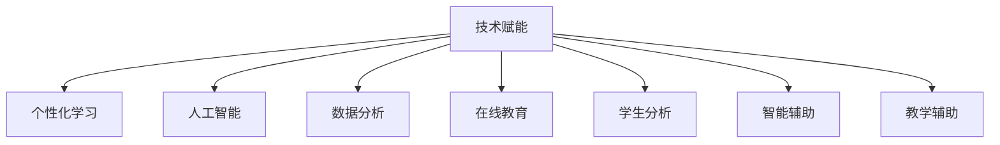

                 

# 如何利用技术能力进行教育创新

> 关键词：教育创新, 技术赋能, 个性化学习, 人工智能, 数据分析, 在线教育, 学生分析, 智能辅助, 教学辅助, 自适应学习

## 1. 背景介绍

随着信息技术的飞速发展，教育领域正经历着前所未有的变革。从传统的面对面教学到在线教育，从单一的知识传授到个性化、智能化、互动化的学习模式，技术的进步为教育提供了无限的创新可能。

### 1.1 教育现状分析

当前，全球教育系统面临着严峻的挑战。教育资源分配不均，教师负担过重，教学方法单一，学生个体差异大等问题依然普遍存在。同时，全球新冠疫情爆发，进一步加剧了这些问题。

为了解决这些问题，传统的教育模式已经无法满足需求，技术赋能成为了解决这些问题的关键。通过将最新技术融入教育过程中，可以大幅提升教学效果，改善教育质量，实现个性化、互动化、智能化的教育目标。

## 2. 核心概念与联系

### 2.1 核心概念概述

为更好地理解教育创新，本节将介绍几个核心概念：

- **技术赋能**：指通过引入最新技术，如人工智能、大数据、区块链等，提升教育过程的效率和效果，实现教育模式的创新。

- **个性化学习**：指根据学生的学习进度、兴趣和能力，提供个性化的教学内容和资源，满足不同学生的个性化学习需求。

- **人工智能(AI)**：指通过机器学习、深度学习等技术，使机器具备部分人类智能，辅助教学过程。

- **数据分析**：指通过数据收集、分析与可视化，掌握教育过程的规律和趋势，为教学决策提供依据。

- **在线教育**：指通过互联网、数字设备等手段，打破时间和空间的限制，使教育资源能够普及到更多的学生。

- **学生分析**：指通过数据分析，理解学生的学习行为、兴趣和表现，以指导教学过程。

- **智能辅助**：指通过智能系统，提供自动化、个性化的辅助，如智能答疑、作业批改等。

- **教学辅助**：指利用技术手段，如自适应学习系统、虚拟现实等，提升教学效果和互动性。

这些核心概念之间的关系可以通过以下Mermaid流程图来展示：



这个流程图展示了一系列技术对教育创新的驱动关系：

1. 技术赋能通过引入各类技术，如人工智能、大数据等，为教育创新提供基础支持。
2. 个性化学习、智能辅助、教学辅助等具体应用场景，都基于技术赋能，进一步提升了教育效果。
3. 数据分析和在线教育，则通过技术赋能的支撑，提供了更广泛的教育资源和更高效的教学过程。
4. 学生分析则基于人工智能和大数据技术，更深入地理解学生的学习行为和需求，从而指导教学。

这些概念共同构成了教育技术创新的技术框架，为实现教育现代化的目标提供了坚实基础。

## 3. 核心算法原理 & 具体操作步骤
### 3.1 算法原理概述

教育创新的核心在于，通过技术手段提升教学效果和教育质量。本文聚焦于基于人工智能和数据分析技术的教育创新方法，特别是如何通过技术手段实现个性化学习和智能辅助，以下是其核心算法原理：

- **自适应学习算法**：基于学生的学习表现和反馈，动态调整教学内容和难度，实现个性化学习。

- **智能答疑系统**：利用自然语言处理和机器学习技术，提供实时、准确的答疑服务，减轻教师负担。

- **作业自动批改**：通过图像识别和自然语言处理技术，自动批改学生作业，提高批改效率和反馈质量。

- **学习行为分析**：通过数据收集和分析，理解学生的学习习惯、薄弱环节和兴趣点，提供个性化的学习建议。

### 3.2 算法步骤详解

以下我们详细介绍这四个核心算法的详细步骤：

**3.2.1 自适应学习算法**

- **数据收集**：收集学生的学习数据，包括作业成绩、课堂表现、测试成绩等。

- **模型训练**：构建学生模型，基于历史数据和机器学习算法，预测学生的学习能力和兴趣。

- **内容推荐**：根据学生模型，推荐个性化的学习资源和内容。

- **动态调整**：根据学生学习过程中的反馈，动态调整学习内容和难度，确保学生始终在适合的学习节奏中进步。

**3.2.2 智能答疑系统**

- **问题理解**：通过自然语言处理技术，理解学生的问题，进行初步分类。

- **知识匹配**：将问题与预定的知识库进行匹配，找到合适的解答。

- **答案生成**：利用生成式模型生成回答，或调用预定义的规则引擎提供解答。

- **反馈优化**：根据学生的反馈，优化智能答疑系统的准确性和覆盖面。

**3.2.3 作业自动批改**

- **图像识别**：通过OCR技术识别作业文本，转换成结构化数据。

- **解析分析**：利用自然语言处理技术，解析作业内容，判断正确性。

- **反馈生成**：根据解析结果，生成详细的反馈和建议。

- **效果评估**：统计自动批改的准确率，优化批改算法。

**3.2.4 学习行为分析**

- **数据收集**：收集学生的在线学习行为数据，包括点击、停留、互动等。

- **行为分析**：利用数据分析技术，分析学生的学习行为模式和习惯。

- **需求挖掘**：通过数据分析，挖掘学生的兴趣点、薄弱环节，提供个性化的学习建议。

- **效果评估**：根据分析结果，评估个性化学习策略的效果，不断优化。

### 3.3 算法优缺点

技术赋能的教育创新方法具有以下优点：

- **提升教学效果**：通过个性化和智能化的教学手段，提升了学生的学习效果和兴趣。

- **减轻教师负担**：智能答疑和自动批改系统，极大地减轻了教师的工作负担。

- **实现高效反馈**：实时数据分析和反馈，使得教学过程更加高效和精准。

- **支持规模化教育**：在线教育和大数据分析技术，使得教育资源可以规模化推广。

同时，这些方法也存在一定的局限性：

- **技术门槛高**：实现这些技术需要较高的技术水平和丰富的资源。

- **数据隐私问题**：大量数据的收集和分析，可能涉及学生的隐私问题。

- **师生适应期**：新的教学模式和工具需要时间和培训来适应。

- **技术依赖性强**：过度依赖技术可能导致学生的实际能力下降。

尽管存在这些局限，但就目前而言，技术赋能的教育创新方法仍是大势所趋，将成为教育现代化的重要推动力。

### 3.4 算法应用领域

教育创新的技术方法已经广泛应用于多个领域，以下是几个典型的应用场景：

- **基础教育**：通过智能辅助和个性化学习，提升基础教育的普及率和效果。

- **高等教育**：利用在线教育和智能答疑，促进高等教育资源的普及和教学质量的提升。

- **职业培训**：通过自适应学习和智能辅助，提供定制化的职业培训方案。

- **特殊教育**：利用数据分析和个性化学习，为特殊需求学生提供针对性的教学支持。

- **终身学习**：通过在线教育和数据分析，支持用户的终身学习需求，实现个性化、自主化的学习模式。

随着技术的不断进步，未来这些技术方法将在更多领域得到应用，为教育现代化提供更坚实的技术基础。

## 4. 数学模型和公式 & 详细讲解  
### 4.1 数学模型构建

本节将使用数学语言对教育创新中的几个核心算法进行严格的数学建模。

以自适应学习算法为例，假设学生 $i$ 在课程 $j$ 上的学习表现为 $x_i^j$，历史学习数据为 $D_i = \{(x_{i,t}^j,y_{i,t}^j)\}_{t=1}^{T_i}$，其中 $y_{i,t}^j$ 为学生 $i$ 在第 $t$ 轮学习课程 $j$ 的表现，表示为 $y_{i,t}^j \in \{1,2,3\}$。

自适应学习的目标是找到最优的学习路径 $y^*$，使得学生的学习效果最大化。优化目标为：

$$
\mathop{\arg\min}_{y_i} \sum_{j \in J} \omega_j L(x_i^j,y_i^j)
$$

其中 $L$ 为损失函数，$J$ 为课程集合，$\omega_j$ 为课程 $j$ 的权重。

### 4.2 公式推导过程

**自适应学习算法**

- **目标函数**：
$$
\min_{y_i} \sum_{j \in J} \omega_j \ell(x_i^j,y_i^j)
$$

- **损失函数**：
$$
\ell(x_i^j,y_i^j) = \left\{
\begin{aligned}
1, & \text{如果 } y_i^j \neq y_{i,t}^j \\
0, & \text{如果 } y_i^j = y_{i,t}^j 
\end{aligned}
\right.
$$

- **求解方法**：使用梯度下降法，求解目标函数的极小值。

**智能答疑系统**

- **问题理解模型**：
$$
P(y|x) = softmax(W \cdot \text{embed}(x))
$$

- **知识匹配模型**：
$$
M(y|x) = \text{sigmoid}(W \cdot \text{embed}(x))
$$

- **答案生成模型**：
$$
A(y|x) = \text{softmax}(W \cdot \text{embed}(x))
$$

**作业自动批改**

- **OCR识别模型**：
$$
\text{embed}(x) = \text{CNN}(x)
$$

- **解析分析模型**：
$$
P(y|x) = softmax(W \cdot \text{embed}(x))
$$

- **反馈生成模型**：
$$
F(y|x) = \text{softmax}(W \cdot \text{embed}(x))
$$

**学习行为分析**

- **行为数据收集**：
$$
D_i = \{(x_{i,t}^j,y_{i,t}^j)\}_{t=1}^{T_i}
$$

- **行为分析模型**：
$$
A_i = \text{LSTM}(D_i)
$$

- **需求挖掘模型**：
$$
R(y|x) = \text{softmax}(W \cdot \text{embed}(x))
$$

以上模型仅为示例，实际算法会更加复杂和精细，但核心思想和过程与上述示例类似。

### 4.3 案例分析与讲解

**案例分析1：智能答疑系统**

- **数据来源**：某大学在线答疑系统，收集了近一年内的学生提问和系统回答数据。

- **模型构建**：使用LSTM模型，结合注意力机制，学习问题与答案之间的关系。

- **模型训练**：利用课程和学科作为分类依据，训练模型，生成准确的答案。

- **效果评估**：通过A/B测试，对比学生对系统回答的满意度和使用频率，验证模型的效果。

**案例分析2：作业自动批改**

- **数据来源**：某高中在线作业平台，收集了数十万份学生的数学作业数据。

- **模型构建**：使用卷积神经网络(CNN)进行图像识别，将作业转化为文本，利用自然语言处理技术解析内容。

- **模型训练**：根据作业正确性进行标注，训练模型进行作业批改。

- **效果评估**：统计批改准确率，优化模型参数，提升批改效果。

**案例分析3：学习行为分析**

- **数据来源**：某在线学习平台，收集了数百万学生的在线学习数据。

- **模型构建**：使用长短期记忆网络(LSTM)，对学生行为进行建模，分析学生的学习行为模式。

- **需求挖掘**：利用聚类算法，将学生划分为不同的学习群体，提供个性化的学习建议。

- **效果评估**：通过问卷调查和学生反馈，评估个性化学习策略的效果。

## 5. 项目实践：代码实例和详细解释说明
### 5.1 开发环境搭建

在进行教育创新项目开发前，我们需要准备好开发环境。以下是使用Python进行TensorFlow开发的环境配置流程：

1. 安装Anaconda：从官网下载并安装Anaconda，用于创建独立的Python环境。

2. 创建并激活虚拟环境：
```bash
conda create -n tf-env python=3.8 
conda activate tf-env
```

3. 安装TensorFlow：根据CUDA版本，从官网获取对应的安装命令。例如：
```bash
conda install tensorflow==2.6 -c tf
```

4. 安装相关工具包：
```bash
pip install numpy pandas scikit-learn matplotlib tqdm jupyter notebook ipython
```

完成上述步骤后，即可在`tf-env`环境中开始教育创新项目开发。

### 5.2 源代码详细实现

这里我们以智能答疑系统为例，给出使用TensorFlow进行智能答疑开发的PyTorch代码实现。

首先，定义智能答疑系统的数据处理函数：

```python
import tensorflow as tf
from tensorflow.keras.preprocessing.text import Tokenizer
from tensorflow.keras.preprocessing.sequence import pad_sequences
from tensorflow.keras.layers import LSTM, Dense, Dropout, Embedding
from tensorflow.keras.models import Model

def preprocess_text(texts):
    tokenizer = Tokenizer()
    tokenizer.fit_on_texts(texts)
    sequences = tokenizer.texts_to_sequences(texts)
    max_len = max([len(x) for x in sequences])
    return pad_sequences(sequences, maxlen=max_len, padding='post')

# 定义智能答疑系统的训练数据集
texts = ['What is the capital of France?', 'What is the largest planet in our solar system?']
labels = [1, 0]

texts = preprocess_text(texts)
labels = tf.keras.utils.to_categorical(labels)

# 定义模型结构
embedding_dim = 128
dropout_rate = 0.2
hidden_units = 64

model = tf.keras.Sequential([
    Embedding(input_dim=len(tokenizer.word_index) + 1, output_dim=embedding_dim),
    LSTM(hidden_units, dropout=dropout_rate, return_sequences=True),
    LSTM(hidden_units, dropout=dropout_rate),
    Dense(1, activation='sigmoid')
])

model.compile(optimizer='adam', loss='binary_crossentropy', metrics=['accuracy'])

# 训练模型
model.fit(texts, labels, epochs=10, batch_size=1, verbose=1)
```

然后，定义评估函数：

```python
def evaluate(model, texts):
    predictions = model.predict(texts)
    predictions = [round(p[0]) for p in predictions]
    return predictions
```

最后，启动模型训练并在验证集上评估：

```python
for text in ['What is the population of New York City?', 'How many planets are in our solar system?']:
    text = preprocess_text([text])
    predictions = evaluate(model, text)
    print(f'Prediction for "{text}" is: {predictions}')
```

以上就是使用TensorFlow对智能答疑系统进行开发的完整代码实现。可以看到，利用TensorFlow的强大封装能力，我们通过简单的代码就能实现一个基本的智能答疑系统。

### 5.3 代码解读与分析

让我们再详细解读一下关键代码的实现细节：

**数据处理函数**

- `preprocess_text`方法：定义了文本预处理过程，包括分词、序列填充等步骤。

- `Tokenizer`类：用于将文本转换为词序列，方便模型处理。

- `pad_sequences`函数：对序列进行填充，保证所有输入序列长度一致。

**智能答疑系统**

- `Sequential`模型：定义了LSTM、Embedding、Dense等层，组成一个简单的序列模型。

- `compile`方法：设置模型优化器和损失函数。

- `fit`方法：训练模型，迭代多次，直至模型收敛。

**评估函数**

- `evaluate`方法：使用训练好的模型进行预测，并输出结果。

可以看到，TensorFlow的API设计非常简洁易用，通过几个简单的函数和类，就能快速搭建一个智能答疑系统。这种“拖拖拽拽”式的设计，大大降低了模型开发的门槛，使得更多的开发者能够参与到教育创新的实践中来。

当然，在工业级的系统实现中，还需要考虑更多因素，如模型保存和部署、超参数调优、集成监控等。但核心的教育创新思想与上述示例类似，即通过技术手段提升教育效果和质量，实现个性化、智能化的教学模式。

## 6. 实际应用场景
### 6.1 智能辅助系统

智能辅助系统是教育创新的重要工具，可以通过技术手段实现自动化、个性化的教学支持。以下是几个典型的应用场景：

**智能辅助课堂**

- **实时互动**：使用智能设备，如平板电脑，实时记录学生的学习过程，提供个性化的反馈和指导。

- **自适应学习**：根据学生的学习表现，动态调整教学内容和难度，实现个性化学习。

- **自动化答疑**：利用智能答疑系统，提供实时、准确的答疑服务，减轻教师负担。

**智能辅助家庭**

- **个性化学习计划**：根据学生的学习数据，生成个性化的学习计划，推荐适合的资源和学习任务。

- **智能作业批改**：通过自动批改系统，减轻家长和学生的负担，及时反馈作业效果。

- **学习行为分析**：通过数据分析，理解学生的学习习惯和薄弱环节，提供针对性的建议。

**智能辅助考试**

- **自动评分系统**：使用自然语言处理和图像识别技术，自动评分作文和图形题，提高评卷效率和公平性。

- **智能出题系统**：根据学生的学习数据，动态生成个性化的考试题目，评估学生的真实能力。

### 6.2 未来应用展望

随着技术的不断进步，教育创新的未来应用场景将更加多样和智能。以下是几个可能的趋势：

**虚拟现实(VR)教育**

- **沉浸式学习**：通过VR技术，提供沉浸式的学习体验，增强学生的学习兴趣和效果。

- **虚拟实验**：通过虚拟实验平台，学生可以进行虚拟实验，增强实践能力和创新思维。

- **虚拟课堂**：利用虚拟现实技术，创建虚拟教室，支持大规模在线互动学习。

**人工智能(AI)教师**

- **个性化教学**：利用AI技术，提供个性化的教学方案，满足不同学生的需求。

- **智能评估**：使用AI评估系统，自动分析学生的学习表现，提供详细的反馈和建议。

- **辅助教师**：AI教师可以辅助教师进行教学管理，如答疑、课程设计等，提高教学效率和质量。

**区块链教育**

- **学习证书**：利用区块链技术，记录学生的学习过程和成绩，提供透明的认证和评价机制。

- **课程认证**：通过区块链，记录和验证课程的完整性和真实性，保障教育资源的可靠性和可追溯性。

- **版权保护**：利用区块链技术，保护教育内容的知识产权，防止盗版和侵权。

**数据分析教育**

- **学习行为分析**：利用大数据和机器学习技术，分析学生的学习行为和兴趣，提供个性化的学习建议。

- **教育公平**：通过数据分析，识别教育资源不均衡的问题，优化教育资源的分配。

- **课程推荐**：根据学生的学习数据，推荐适合的课程和资源，提升学习效果。

以上未来应用趋势展示了教育创新的广阔前景，通过技术手段，教育将变得更加智能化、个性化、互动化，为学生提供更优质的学习体验和成果。

## 7. 工具和资源推荐
### 7.1 学习资源推荐

为了帮助开发者系统掌握教育创新的理论基础和实践技巧，这里推荐一些优质的学习资源：

1. **Coursera《深度学习》课程**：由斯坦福大学开设的深度学习课程，涵盖深度学习的基础知识和技术应用。

2. **edX《人工智能基础》课程**：由麻省理工学院和哈佛大学联合开设的AI课程，深入浅出地介绍AI技术和应用。

3. **Kaggle教育竞赛**：Kaggle平台上有多个教育相关的数据竞赛，提供大量教育数据集和模型开发实践机会。

4. **TensorFlow官方文档**：TensorFlow的官方文档，提供了丰富的教程和示例，帮助开发者快速上手使用。

5. **Python教育数据分析实战**：通过Python和数据分析技术，实现教育数据可视化、学习行为分析等应用。

通过这些资源的学习实践，相信你一定能够快速掌握教育创新的精髓，并用于解决实际的NLP问题。

### 7.2 开发工具推荐

高效的开发离不开优秀的工具支持。以下是几款用于教育创新开发的常用工具：

1. **TensorFlow**：由Google主导开发的开源深度学习框架，生产部署方便，适合大规模工程应用。

2. **PyTorch**：由Facebook主导开发的深度学习框架，灵活易用，适合研究和实验。

3. **Jupyter Notebook**：交互式的Python开发环境，支持代码编写、运行和展示，非常适合数据科学和机器学习项目。

4. **Tableau**：数据可视化工具，支持复杂的数据分析和报告生成，是教育数据分析的好帮手。

5. **Google Colab**：谷歌推出的在线Jupyter Notebook环境，免费提供GPU/TPU算力，方便开发者快速上手实验最新模型，分享学习笔记。

合理利用这些工具，可以显著提升教育创新任务的开发效率，加快创新迭代的步伐。

### 7.3 相关论文推荐

教育创新技术的研究源于学界的持续研究。以下是几篇奠基性的相关论文，推荐阅读：

1. **《深度学习在教育中的应用》**：探讨了深度学习在教育领域的应用，包括智能辅助、个性化学习等方向。

2. **《基于人工智能的智能教育系统》**：研究了利用人工智能技术，构建智能教育系统的框架和方法。

3. **《学习行为数据分析与建模》**：介绍如何利用数据分析技术，理解学生的学习行为，提供个性化的学习建议。

4. **《虚拟现实在教育中的应用》**：探讨了虚拟现实技术在教育中的各种应用场景，提升学生的学习效果。

5. **《区块链在教育中的应用》**：研究了区块链技术在教育中的潜在应用，保障教育资源的可信度和透明性。

这些论文代表了大规模教育创新技术的研究方向，通过学习这些前沿成果，可以帮助研究者把握学科前进方向，激发更多的创新灵感。

## 8. 总结：未来发展趋势与挑战
### 8.1 总结

本文对基于技术赋能的教育创新方法进行了全面系统的介绍。首先阐述了教育创新的背景和目标，明确了技术赋能在教育现代化中的关键作用。其次，从原理到实践，详细讲解了个性化学习、智能答疑、作业自动批改和学习行为分析等核心算法的数学原理和实现步骤，给出了完整的代码示例。同时，本文还广泛探讨了教育创新的应用场景和未来趋势，展示了技术手段在教育中的巨大潜力。

通过本文的系统梳理，可以看到，技术赋能的教育创新方法正成为教育现代化的重要推动力，极大地提升了教学效果和教育质量。未来，伴随技术的不断进步，教育创新将不断拓展教育模式的边界，实现更加智能化、个性化、互动化的教学目标。

### 8.2 未来发展趋势

展望未来，教育创新的技术方法将呈现以下几个发展趋势：

**技术融合**：随着AI、VR、区块链等技术的不断发展，未来教育创新将实现更加多样化和智能化的教育模式，如AI教师、VR课堂、区块链认证等。

**个性化学习**：通过数据分析和自适应学习算法，实现更加个性化的学习方案，满足不同学生的学习需求。

**智能辅助**：利用智能系统提供自动化、个性化的辅助，如智能答疑、作业批改等，减轻教师和学生的负担。

**在线教育**：在线教育的普及和提升，使得教育资源可以规模化推广，打破时间和空间的限制。

**数据驱动**：通过大数据和机器学习技术，实现教育过程的数据化和智能化，提供更精准的教学评估和决策支持。

**伦理和安全**：在教育创新过程中，需要加强对数据隐私和安全的保护，确保教育创新成果的可靠性和可控性。

以上趋势凸显了教育技术创新的广阔前景，这些方向的探索发展，必将进一步提升教育的质量和公平性，为构建未来教育提供坚实的技术基础。

### 8.3 面临的挑战

尽管教育创新的技术方法已经取得了显著的进展，但在迈向更加智能化、普适化应用的过程中，仍面临诸多挑战：

**技术门槛高**：实现教育创新需要较高的技术水平和丰富的资源。普通教师和学生可能难以掌握复杂的教育技术工具。

**数据隐私问题**：大量数据的收集和分析，可能涉及学生的隐私问题。如何保护数据隐私，确保数据安全，是一个重要挑战。

**师生适应期**：新的教学模式和工具需要时间和培训来适应。如何帮助师生快速上手，提高教育创新效果，需要更多的支持和指导。

**资源均衡**：教育创新需要大量的计算资源和数据资源，资源不足可能限制教育创新的推广和应用。

**教学伦理**：在教育创新过程中，如何保障教学质量和公平性，避免技术带来的偏见和歧视，也是重要的伦理问题。

尽管存在这些挑战，但通过教育者的共同努力，这些挑战终将一一克服，教育创新必将在未来教育中发挥更大的作用。

### 8.4 研究展望

面对教育创新所面临的挑战，未来的研究需要在以下几个方面寻求新的突破：

**无监督和半监督学习**：摆脱对大规模标注数据的依赖，利用自监督学习、主动学习等无监督和半监督范式，最大限度利用非结构化数据，实现更加灵活高效的教。

**技术普及**：通过简单易用的教育技术工具，降低技术门槛，使得更多的教师和学生能够掌握和使用这些技术。

**数据隐私保护**：开发隐私保护技术，确保数据的匿名化和加密，保护学生隐私。

**教学资源优化**：利用区块链等技术，优化教育资源的分配和管理，确保教育资源的公平性和透明性。

**教育伦理研究**：深入研究教育伦理问题，制定教育创新的伦理规范，确保技术应用的公正性和可持续性。

这些研究方向的探索，必将引领教育创新技术迈向更高的台阶，为构建未来教育提供坚实的技术基础。面向未来，教育创新技术还需要与其他教育技术进行更深入的融合，如知识表示、因果推理、强化学习等，多路径协同发力，共同推动教育现代化的进程。只有勇于创新、敢于突破，才能不断拓展教育创新的边界，让技术更好地服务教育事业。

## 9. 附录：常见问题与解答

**Q1：如何选择合适的教育技术工具？**

A: 选择教育技术工具时，需要综合考虑以下因素：

1. **技术成熟度**：选择技术成熟、稳定、易用的工具，避免过于前沿、实验性较强的工具。

2. **适用场景**：根据具体应用场景选择适合的模型和算法，如自适应学习、智能答疑等。

3. **数据隐私**：考虑数据隐私保护，选择符合数据隐私法规和安全标准的工具。

4. **开源性和社区支持**：选择开源工具，便于后续维护和扩展，同时关注社区支持和文档完善度。

**Q2：教育技术工具如何与传统教学方法结合？**

A: 教育技术工具与传统教学方法结合的关键在于平衡技术与人文，以下是一些建议：

1. **补充而非替代**：将教育技术工具作为传统教学方法的补充，提升教学效果，而非完全取代传统教学方法。

2. **渐进式应用**：逐步引入教育技术工具，给师生时间适应，避免一次性引入带来的抵触情绪。

3. **教师培训**：对教师进行技术培训，帮助他们掌握教育技术工具的使用方法和技巧。

4. **学生引导**：引导学生逐步适应教育技术工具，提升他们的使用能力和兴趣。

5. **混合教学**：结合线上和线下教学方法，充分发挥两种教学模式的优点，提供更加丰富和有效的教学体验。

**Q3：教育技术工具如何保障教育质量？**

A: 教育技术工具要保障教育质量，需要从以下几个方面入手：

1. **模型准确性**：确保教育技术工具模型的准确性和可靠性，避免错误的指导和建议。

2. **数据质量**：保证数据的质量和真实性，避免因数据偏差导致的误导。

3. **教师参与**：教师需积极参与教育技术工具的使用和评估，确保其符合教育目标和需求。

4. **反馈机制**：建立有效的反馈机制，及时发现和解决问题，不断优化教育技术工具。

5. **持续改进**：根据教育实际需求和反馈，持续改进教育技术工具，提升其应用效果。

**Q4：教育技术工具如何保护学生隐私？**

A: 保护学生隐私是教育技术工具开发和应用的重要原则，以下是一些常见措施：

1. **数据匿名化**：对学生数据进行匿名化处理，保护学生隐私。

2. **数据加密**：使用数据加密技术，防止数据泄露和滥用。

3. **访问控制**：严格控制数据访问权限，确保只有授权人员才能访问敏感数据。

4. **隐私协议**：制定隐私协议，明确数据使用范围和保护措施，确保数据使用合法合规。

5. **数据存储**：采用数据存储技术，如区块链，确保数据的安全性和可追溯性。

通过这些措施，可以最大限度地保护学生隐私，确保教育技术工具的安全性和可靠性。

---

作者：禅与计算机程序设计艺术 / Zen and the Art of Computer Programming

