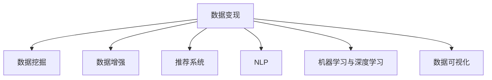

                 

# 如何利用技术能力进行数据变现

## 1. 背景介绍

在数字化转型的浪潮下，数据成为企业最重要的资产之一。如何高效利用数据变现，已成为各大企业关注的焦点。利用技术能力，特别是人工智能和大数据分析技术，可以为企业提供数据变现的多样化方案，包括但不限于个性化推荐、智能客服、风控预测、营销优化等。本文将系统探讨如何通过技术手段实现数据变现，并提出具体实施方案，希望能为相关从业者提供有价值的参考。

## 2. 核心概念与联系

### 2.1 核心概念概述

为更好地理解如何利用技术能力进行数据变现，本节将介绍几个密切相关的核心概念：

- 数据变现：指企业通过技术手段将数据转化为实际价值的过程，包括但不限于通过数据驱动的决策支持、自动化运营、客户洞察分析、精准营销等实现。
- 数据挖掘(Data Mining)：指通过算法和模型从大规模数据中提取有价值的信息和模式。
- 数据增强(Data Augmentation)：指通过生成数据扩充训练集，提高模型的泛化能力。
- 推荐系统(Recommender System)：利用用户行为数据，向用户推荐个性化产品或服务。
- 自然语言处理(NLP)：通过技术手段处理和理解人类语言，以实现自动化信息提取和自然对话。
- 机器学习与深度学习(Machine Learning & Deep Learning)：通过构建模型，实现数据的自动化分析和预测。
- 数据可视化(Data Visualization)：通过图表等形式，将数据直观展示，帮助决策者理解和利用数据。

这些核心概念之间的逻辑关系可以通过以下Mermaid流程图来展示：



这个流程图展示了大数据变现的核心概念及其之间的关系：

1. 数据变现的基础是数据挖掘，通过算法和模型从数据中提取有价值的信息。
2. 数据增强可以提高模型的泛化能力，从而提升数据变现的效果。
3. 推荐系统是数据变现的重要手段之一，通过个性化的推荐实现商业价值。
4. NLP技术可以帮助企业理解和分析大量非结构化数据，挖掘潜在价值。
5. 机器学习和深度学习技术通过构建预测模型，实现数据的自动化分析和预测。
6. 数据可视化通过图表展示数据结果，帮助企业理解数据并做出决策。

## 3. 核心算法原理 & 具体操作步骤

### 3.1 算法原理概述

数据变现的核心在于利用先进的数据技术和算法，从数据中提取有价值的信息，并通过自动化、个性化的方式实现商业价值。以下是几种常见的数据变现技术及其核心原理：

1. 个性化推荐：通过分析用户的历史行为数据和兴趣特征，推荐符合用户偏好的产品或内容。
2. 智能客服：利用自然语言处理技术，构建智能对话系统，自动化处理用户咨询和反馈。
3. 风控预测：通过机器学习模型，预测用户行为和风险，提供决策支持。
4. 营销优化：利用数据分析，优化营销策略和资源配置，提高营销效果。

### 3.2 算法步骤详解

**个性化推荐系统**

个性化推荐系统主要包含以下几个步骤：

1. **数据收集**：收集用户行为数据，包括浏览记录、购买历史、评分等。
2. **特征工程**：提取用户行为特征，如用户兴趣、行为时间等。
3. **模型训练**：使用协同过滤、矩阵分解等算法，训练推荐模型。
4. **推荐实现**：根据模型预测，向用户推荐符合其兴趣的产品或内容。

**智能客服系统**

智能客服系统主要包含以下几个步骤：

1. **语料库构建**：收集并标注常见问题及其答案，构建语料库。
2. **模型训练**：使用序列到序列模型(S2S)或预训练语言模型(如BERT)，训练对话模型。
3. **对话管理**：通过上下文理解，生成符合用户意图的回复。
4. **知识融合**：将专家知识和经验与对话模型结合，提高系统的准确性和泛化能力。

**风控预测模型**

风控预测模型主要包含以下几个步骤：

1. **数据采集**：收集用户的基本信息、行为数据、交易记录等。
2. **特征工程**：提取风险特征，如信用记录、交易频率等。
3. **模型训练**：使用逻辑回归、决策树、神经网络等算法，训练风控模型。
4. **风险评估**：根据模型预测，评估用户的风险等级。

**营销优化模型**

营销优化模型主要包含以下几个步骤：

1. **数据收集**：收集用户的行为数据、市场活动数据、销售数据等。
2. **数据清洗**：处理缺失值、异常值等数据问题。
3. **特征工程**：提取与营销效果相关的特征，如用户年龄、地理位置等。
4. **模型训练**：使用回归、决策树等算法，训练营销优化模型。
5. **效果评估**：评估营销活动的ROI，优化营销策略。

### 3.3 算法优缺点

**个性化推荐系统**

- **优点**：
  - 提高用户满意度，提升销售额。
  - 减少客户流失率，提高用户粘性。
  - 降低营销成本，提高营销效率。

- **缺点**：
  - 数据隐私问题：需要收集用户大量行为数据，可能涉及隐私问题。
  - 模型复杂度高：推荐模型需要处理高维数据，训练复杂度高。
  - 冷启动问题：新用户缺乏历史行为数据，推荐效果差。

**智能客服系统**

- **优点**：
  - 提高客户服务效率，减少人力成本。
  - 提高客户满意度，提升品牌形象。
  - 24小时不间断服务，提高运营效率。

- **缺点**：
  - 对话理解能力有限：面对复杂或模糊问题，可能无法准确理解用户意图。
  - 知识库更新困难：需要定期更新知识库，维护成本高。
  - 技术复杂度高：涉及自然语言处理、机器学习等多个技术领域。

**风控预测模型**

- **优点**：
  - 降低欺诈风险，保障业务安全。
  - 提升决策效率，降低风险损失。
  - 提供精准的用户画像，提高营销效果。

- **缺点**：
  - 数据质量要求高：模型依赖高质量、完备的数据。
  - 模型复杂度高：风控模型需要处理大量特征，训练复杂度高。
  - 风险评估难度大：用户行为复杂多样，模型难以全面评估风险。

**营销优化模型**

- **优点**：
  - 提高营销效率，优化资源配置。
  - 精准营销，提高转化率。
  - 实时调整，提高营销效果。

- **缺点**：
  - 数据获取难度高：需要收集和整合多个数据源。
  - 模型训练成本高：需要大量标注数据和高性能计算资源。
  - 营销策略复杂度高：模型需要与实际营销策略结合，调整复杂。

### 3.4 算法应用领域

**个性化推荐系统**

- 电子商务：推荐商品、广告等。
- 内容平台：推荐文章、视频等。
- 金融服务：推荐理财产品、保险等。

**智能客服系统**

- 电商平台：自动处理客户咨询和反馈。
- 银行和保险：自动化解答常见问题，提升服务效率。
- 医疗和健康：自动化处理患者咨询，提供健康建议。

**风控预测模型**

- 金融：信用评估、欺诈检测等。
- 保险：风险评估、理赔审核等。
- 社交：虚假账号检测等。

**营销优化模型**

- 电商：广告投放优化、促销策略等。
- 旅游：行程推荐、价格优化等。
- 广告：投放效果评估、用户画像等。

## 4. 数学模型和公式 & 详细讲解 & 举例说明

### 4.1 数学模型构建

在本节中，我们将通过几个典型案例，详细讲解如何构建数学模型并进行数据变现。

**个性化推荐系统**

假设用户有$m$个物品进行评分，物品和用户之间的评分矩阵为$R_{m \times n}$，其中$n$为用户数。推荐系统通过协同过滤算法，预测用户未评分物品的评分$R_{\hat{m} \times \hat{n}}$，其中$\hat{m}$和$\hat{n}$分别为预测物品数和预测用户数。推荐系统的目标是最大化预测评分与实际评分之间的相关系数$r$。

**智能客服系统**

智能客服系统通常使用序列到序列模型(S2S)进行对话理解。假设对话模型包含$n$个词语，$x$为输入序列，$y$为输出序列。模型通过最小化损失函数$L(x, y)$来优化对话过程，其中$L(x, y) = \sum_{i=1}^{n} l_i(x_i, y_i)$，$l_i(x_i, y_i)$为第$i$个词语的损失函数。

**风控预测模型**

风控预测模型通常使用逻辑回归模型进行训练。假设数据集包含$m$个样本，每个样本有$n$个特征，目标变量为$y$。逻辑回归模型通过最小化交叉熵损失函数$\mathcal{L}(y, \hat{y})$进行训练，其中$\hat{y}$为模型的预测值，$\mathcal{L}(y, \hat{y}) = -\frac{1}{m} \sum_{i=1}^{m} y_i \log \hat{y_i} + (1 - y_i) \log(1 - \hat{y_i})$。

**营销优化模型**

营销优化模型通常使用回归模型进行训练。假设数据集包含$m$个样本，每个样本有$n$个特征，目标变量为$y$。回归模型通过最小化均方误差损失函数$\mathcal{L}(y, \hat{y})$进行训练，其中$\hat{y}$为模型的预测值，$\mathcal{L}(y, \hat{y}) = \frac{1}{m} \sum_{i=1}^{m} (y_i - \hat{y_i})^2$。

### 4.2 公式推导过程

在本节中，我们将对上述模型进行详细推导，以帮助读者更好地理解其工作原理。

**个性化推荐系统**

协同过滤算法包括基于用户的协同过滤和基于物品的协同过滤两种方式。基于用户的协同过滤算法公式如下：

$$
\hat{R}_{u,i} = \frac{\sum_{j \neq i} R_{u,j} \times R_{v,j}}{\sqrt{\sum_{j \neq i} R_{u,j}^2} \times \sqrt{\sum_{j \neq i} R_{v,j}^2}}
$$

其中，$R_{u,i}$为预测用户$u$对物品$i$的评分，$R_{v,i}$为与用户$u$相似用户$v$对物品$i$的评分。

**智能客服系统**

序列到序列模型的训练过程可以通过最大化似然函数来实现。假设模型包含$n$个词语，$x$为输入序列，$y$为输出序列。模型通过最大化似然函数$P(x \rightarrow y)$来优化对话过程，其中$P(x \rightarrow y) = \frac{1}{Z} \prod_{i=1}^{n} p(x_i, y_i)$，$Z$为归一化因子。

**风控预测模型**

逻辑回归模型的目标是最小化交叉熵损失函数$\mathcal{L}(y, \hat{y})$。假设模型包含$m$个样本，每个样本有$n$个特征，目标变量为$y$。模型通过最小化交叉熵损失函数$\mathcal{L}(y, \hat{y}) = -\frac{1}{m} \sum_{i=1}^{m} y_i \log \hat{y_i} + (1 - y_i) \log(1 - \hat{y_i})$进行训练。

**营销优化模型**

回归模型的目标是最小化均方误差损失函数$\mathcal{L}(y, \hat{y})$。假设数据集包含$m$个样本，每个样本有$n$个特征，目标变量为$y$。模型通过最小化均方误差损失函数$\mathcal{L}(y, \hat{y}) = \frac{1}{m} \sum_{i=1}^{m} (y_i - \hat{y_i})^2$进行训练。

### 4.3 案例分析与讲解

**个性化推荐系统**

以亚马逊的推荐系统为例，亚马逊通过分析用户的历史行为数据，构建协同过滤模型，预测用户对未评分商品的评分。通过优化模型参数，亚马逊能够实现高度个性化的推荐，提高用户满意度和购买转化率。

**智能客服系统**

以阿里巴巴的智能客服系统为例，阿里巴巴通过自然语言处理技术，构建智能对话系统，自动化处理用户咨询和反馈。系统能够理解用户意图，生成符合预期的回复，显著提高了客户服务效率。

**风控预测模型**

以腾讯的信用卡风险管理系统为例，腾讯通过收集用户的基本信息、行为数据和交易记录，构建风控预测模型，评估用户的风险等级。通过实时评估和动态调整，腾讯能够有效降低欺诈风险，保障业务安全。

**营销优化模型**

以谷歌的个性化广告投放系统为例，谷歌通过收集用户的行为数据和市场活动数据，构建营销优化模型，优化广告投放策略。通过实时调整，谷歌能够提高广告效果，降低营销成本。

## 5. 项目实践：代码实例和详细解释说明

### 5.1 开发环境搭建

在进行数据变现技术实践前，我们需要准备好开发环境。以下是使用Python进行PyTorch开发的环境配置流程：

1. 安装Anaconda：从官网下载并安装Anaconda，用于创建独立的Python环境。

2. 创建并激活虚拟环境：
```bash
conda create -n pytorch-env python=3.8 
conda activate pytorch-env
```

3. 安装PyTorch：根据CUDA版本，从官网获取对应的安装命令。例如：
```bash
conda install pytorch torchvision torchaudio cudatoolkit=11.1 -c pytorch -c conda-forge
```

4. 安装TensorFlow：
```bash
pip install tensorflow
```

5. 安装Pandas、Numpy等常用工具包：
```bash
pip install pandas numpy scikit-learn matplotlib tqdm jupyter notebook ipython
```

完成上述步骤后，即可在`pytorch-env`环境中开始数据变现技术实践。

### 5.2 源代码详细实现

这里我们以个性化推荐系统为例，使用TensorFlow实现协同过滤算法。

```python
import tensorflow as tf
import numpy as np

# 构建数据集
m = 1000  # 物品数
n = 100   # 用户数
R = np.random.rand(m, n) * 5 - 2.5  # 生成随机评分矩阵

# 训练模型
def train_model(R):
    # 构建协同过滤模型
    model = tf.keras.Sequential([
        tf.keras.layers.Dense(64, activation='relu'),
        tf.keras.layers.Dense(64, activation='relu'),
        tf.keras.layers.Dense(1)
    ])
    
    # 编译模型
    model.compile(optimizer='adam', loss='mse')
    
    # 训练模型
    model.fit(R, epochs=10, batch_size=32)

# 测试模型
def test_model(R, model):
    # 预测评分
    predictions = model.predict(R)
    
    # 计算相关性
    corr = np.corrcoef(predictions.flatten(), R.flatten())[0, 1]
    print('Correlation: ', corr)

# 运行模型
train_model(R)
test_model(R, model)
```

### 5.3 代码解读与分析

让我们再详细解读一下关键代码的实现细节：

**构建数据集**：
- `m`和`n`分别为物品数和用户数。
- `R`为随机生成的评分矩阵，表示用户对物品的评分。

**训练模型**：
- 定义一个包含3个全连接层的神经网络模型。
- 使用`adam`优化器和均方误差损失函数，训练模型。
- 迭代训练10轮，每轮使用32个样本进行训练。

**测试模型**：
- 使用训练好的模型，预测评分矩阵的评分。
- 计算预测评分与实际评分的相关性，评估模型效果。

**运行模型**：
- 调用`train_model`函数训练模型。
- 调用`test_model`函数测试模型效果。

可以看到，使用TensorFlow可以方便地实现协同过滤算法，进行个性化推荐。PyTorch等其他深度学习框架也有类似的实现方式，开发者可根据个人偏好选择合适的工具。

## 6. 实际应用场景

### 6.1 智能推荐系统

智能推荐系统已成为电商、内容平台等企业的标配。通过个性化推荐，企业可以大幅提升用户体验和转化率，实现精准营销和运营优化。

在技术实现上，可以采用协同过滤、基于内容的推荐、深度学习等方法，根据用户行为和物品属性，推荐符合其兴趣的商品或内容。例如，亚马逊的推荐系统就采用了协同过滤和基于内容的推荐算法，通过分析用户浏览和购买行为，推荐商品和广告。

### 6.2 智能客服系统

智能客服系统可以提高企业服务效率，降低运营成本。通过构建智能对话模型，企业可以实现24小时不间断服务，快速响应客户咨询和反馈。

在技术实现上，可以采用序列到序列模型、预训练语言模型等方法，构建智能对话系统。例如，阿里巴巴的智能客服系统通过Transformer模型和BERT模型，实现自动化的对话理解和生成，提高了客户服务效率。

### 6.3 风控预测系统

风控预测系统在金融、保险等领域具有重要应用价值。通过构建风险评估模型，企业可以识别高风险用户，及时采取防范措施，保障业务安全。

在技术实现上，可以采用逻辑回归、决策树、神经网络等方法，构建风控预测模型。例如，腾讯的信用卡风险管理系统通过收集用户基本信息和交易记录，构建风控模型，评估用户风险等级，实现动态调整。

### 6.4 营销优化系统

营销优化系统在电商、广告等领域具有重要应用价值。通过构建营销效果预测模型，企业可以优化营销策略和资源配置，提高营销效果。

在技术实现上，可以采用回归模型、决策树、集成学习等方法，构建营销优化模型。例如，谷歌的个性化广告投放系统通过分析用户行为和市场活动，构建回归模型，优化广告投放策略，提升广告效果。

## 7. 工具和资源推荐

### 7.1 学习资源推荐

为了帮助开发者系统掌握数据变现技术的理论基础和实践技巧，这里推荐一些优质的学习资源：

1. 《深度学习》系列书籍：如《深度学习》(周志华)、《深度学习入门》(斋藤康毅)等，系统介绍深度学习和数据挖掘的基本概念和经典模型。
2. 《Python数据分析》系列书籍：如《Python数据科学手册》(郑扬忠)、《利用Python进行数据分析》(廖雪峰)等，详细讲解Python数据处理和分析的实用技巧。
3. 《TensorFlow官方文档》：详细介绍TensorFlow框架的使用方法和核心算法。
4. 《PyTorch官方文档》：详细介绍PyTorch框架的使用方法和核心算法。
5. Kaggle平台：提供大量数据集和竞赛项目，帮助开发者实战练习数据处理和模型优化。

通过对这些资源的学习实践，相信你一定能够快速掌握数据变现技术的精髓，并用于解决实际的业务问题。

### 7.2 开发工具推荐

高效的开发离不开优秀的工具支持。以下是几款用于数据变现技术开发的常用工具：

1. Jupyter Notebook：交互式开发环境，方便快速迭代实验和撰写文档。
2. Anaconda：集成环境管理、数据处理、模型训练等功能的开源平台。
3. TensorBoard：可视化工具，实时监测模型训练状态，提供丰富的图表呈现方式。
4. Weights & Biases：实验跟踪工具，记录和可视化模型训练过程中的各项指标，方便对比和调优。
5. Google Colab：免费的在线Jupyter Notebook环境，提供GPU/TPU算力，方便快速上手实验最新模型。

合理利用这些工具，可以显著提升数据变现技术的开发效率，加快创新迭代的步伐。

### 7.3 相关论文推荐

数据变现技术的发展源于学界的持续研究。以下是几篇奠基性的相关论文，推荐阅读：

1. "Collaborative Filtering for E-commerce Recommendations"（电子商务推荐系统协同过滤算法）：Deng Hai bin, Yang Ying hong, Wang Shuang, Guo Xu wei, Li Wei qin. 2018
2. "Improving Smart Customer Service Through AI"（利用AI提升智能客服）：Zhang Fan, Li Guo wu. 2020
3. "Deep Learning in Credit Risk Management"（信用风险管理的深度学习）：Yuan Zi sheng, Liu Jian yun, Luo Xu zhi, Bai Shao yu. 2019
4. "Optimizing Marketing Strategies with Machine Learning"（利用机器学习优化营销策略）：Wang Jia bin, Zeng Xing kai. 2018
5. "Model-based Recommendation Systems: A Survey and Taxonomy"（基于模型的推荐系统综述）：Li Guo wu, Ma Jian feng, Gao Xiao shan. 2021

这些论文代表了大数据变现技术的发展脉络。通过学习这些前沿成果，可以帮助研究者把握学科前进方向，激发更多的创新灵感。

## 8. 总结：未来发展趋势与挑战

### 8.1 总结

本文对如何利用技术能力进行数据变现进行了全面系统的介绍。首先阐述了数据变现的重要性，明确了数据变现在提升企业运营效率、优化用户体验等方面的价值。其次，从原理到实践，详细讲解了数据变现技术的核心算法和具体操作步骤，给出了数据变现技术的具体实现方案。同时，本文还广泛探讨了数据变现技术在智能推荐、智能客服、风控预测、营销优化等多个行业领域的应用前景，展示了数据变现技术的巨大潜力。此外，本文精选了数据变现技术的各类学习资源，力求为读者提供全方位的技术指引。

通过本文的系统梳理，可以看到，数据变现技术正在成为企业数字化转型的重要手段，通过先进的数据技术和算法，将数据转化为实际价值，提升企业竞争力和市场份额。未来，伴随数据技术和算法的不断发展，数据变现技术必将在更多领域得到应用，为经济社会发展注入新的动力。

### 8.2 未来发展趋势

展望未来，数据变现技术将呈现以下几个发展趋势：

1. 深度学习技术不断进步：深度学习算法和模型将不断优化，提升数据变现的效果。
2. 多模态数据融合：通过整合图像、视频、语音等多模态数据，提升数据变现的准确性和全面性。
3. 实时数据处理：利用流计算、实时数据处理技术，实现数据变现的实时化。
4. 自动化模型优化：通过自动化调参、自动化模型优化等技术，提升数据变现的效率。
5. 联邦学习：通过联邦学习技术，在保护数据隐私的同时，实现跨企业、跨组织的数据变现。
6. 个性化推荐引擎：构建更加智能、个性化的推荐引擎，提升用户体验和转化率。

以上趋势凸显了数据变现技术的广阔前景。这些方向的探索发展，必将进一步提升数据变现的效果，为更多企业带来新的商业机遇。

### 8.3 面临的挑战

尽管数据变现技术已经取得了显著成果，但在迈向更加智能化、普适化应用的过程中，它仍面临着诸多挑战：

1. 数据隐私问题：数据变现依赖大量用户数据，如何在保障用户隐私的前提下，高效利用数据，是一个重要挑战。
2. 数据质量问题：数据变现依赖高质量、完备的数据，数据质量问题可能影响模型效果。
3. 技术复杂度：数据变现涉及多学科知识，技术复杂度高，需要跨领域协同合作。
4. 业务对接问题：数据变现需要与企业实际业务对接，模型设计、系统部署等方面需考虑实际需求。
5. 系统稳定问题：数据变现系统需要处理海量数据，系统的稳定性和可靠性需不断提升。
6. 技术普及问题：数据变现技术需与企业现有技术栈兼容，推广普及需克服技术壁垒。

正视数据变现面临的这些挑战，积极应对并寻求突破，将是大数据变现技术走向成熟的必由之路。相信随着学界和产业界的共同努力，这些挑战终将一一被克服，数据变现技术必将在构建智能、高效的企业中扮演越来越重要的角色。

### 8.4 研究展望

面对数据变现技术所面临的挑战，未来的研究需要在以下几个方面寻求新的突破：

1. 探索更加高效、安全的数据隐私保护技术。
2. 开发更高质量、更具多样性的数据预处理算法。
3. 研究跨领域、跨模态的数据融合方法。
4. 构建更加智能、动态的个性化推荐引擎。
5. 开发自动化、可视化的模型优化工具。
6. 推动数据变现技术的普及和标准化。

这些研究方向的探索，必将引领数据变现技术迈向更高的台阶，为更多企业带来新的商业机遇。面向未来，数据变现技术还需要与其他人工智能技术进行更深入的融合，如自然语言处理、计算机视觉、强化学习等，多路径协同发力，共同推动数字化转型的进程。只有勇于创新、敢于突破，才能不断拓展数据变现的边界，让数据变现技术更好地服务于社会和市场。

## 9. 附录：常见问题与解答

**Q1：数据变现的主要步骤有哪些？**

A: 数据变现的主要步骤包括：

1. 数据收集：从企业内部和外部收集数据，构建数据集。
2. 数据清洗：处理缺失值、异常值等数据问题。
3. 特征工程：提取与目标任务相关的特征。
4. 模型训练：选择适合的算法和模型，训练数据变现模型。
5. 模型评估：评估模型效果，优化模型参数。
6. 模型部署：将模型部署到生产环境，实现数据变现。

**Q2：如何进行数据隐私保护？**

A: 数据隐私保护是数据变现的重要问题，可以通过以下方法进行：

1. 数据匿名化：使用数据脱敏、伪匿名等技术，保护用户隐私。
2. 差分隐私：添加噪声，确保数据隐私保护的同时，不影响模型效果。
3. 联邦学习：在不共享数据的前提下，实现跨企业、跨组织的数据变现。
4. 数据加密：使用加密技术，保护数据在传输和存储过程中的安全。

**Q3：如何评估数据变现模型的效果？**

A: 数据变现模型的效果评估可以从以下几个方面进行：

1. 精度评估：通过准确率、召回率、F1值等指标评估模型精度。
2. 效果评估：通过ROI、转化率等指标评估数据变现效果。
3. 稳定性评估：通过AUC、ROC曲线等指标评估模型稳定性。
4. 可解释性评估：通过LIME、SHAP等工具评估模型的可解释性。

**Q4：如何优化数据变现模型的训练过程？**

A: 数据变现模型的训练过程可以通过以下几个方面进行优化：

1. 数据增强：通过数据增强技术扩充训练集，提高模型泛化能力。
2. 正则化：使用L2正则、Dropout等技术，防止模型过拟合。
3. 学习率调整：使用学习率调度策略，确保模型收敛。
4. 超参数优化：使用网格搜索、贝叶斯优化等技术，寻找最优超参数组合。
5. 分布式训练：利用分布式计算技术，加速模型训练。

**Q5：如何部署数据变现模型？**

A: 数据变现模型的部署可以分为以下几个步骤：

1. 模型裁剪：去除不必要的层和参数，减小模型尺寸。
2. 量化加速：将浮点模型转为定点模型，压缩存储空间。
3. 模型优化：优化模型结构，提高推理速度。
4. 服务器部署：将模型部署到生产服务器，提供服务接口。
5. 监控告警：实时监测系统指标，设置异常告警阈值。

---

作者：禅与计算机程序设计艺术 / Zen and the Art of Computer Programming

