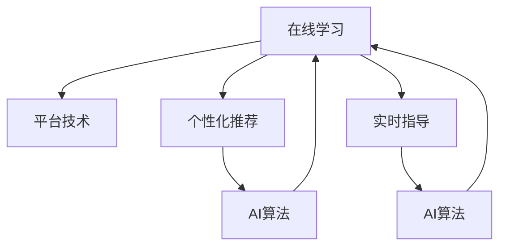

                 

# 如何利用知识付费实现在线学习与在线学习指导？

## 1. 背景介绍

在信息爆炸的现代社会，知识付费平台如雨后春笋般涌现，为各行业从业者提供了一条方便快捷的学习途径。在线学习与在线学习指导，作为知识付费的核心形式之一，正在深刻改变着教育和学习的方式。本文将从知识付费平台的现状出发，探讨如何通过在线学习与在线学习指导实现个性化、高效化的教育目标，并结合具体实践，为学习者提供清晰的指导思路。

## 2. 核心概念与联系

### 2.1 核心概念概述

在线学习（Online Learning）指的是学习者通过互联网平台进行自主学习的过程，其特点包括灵活性高、学习资源丰富、可随时随地访问等。在线学习指导则是指在在线学习过程中，学习者获取来自专业导师的实时反馈和指导，以提高学习效果。

知识付费平台的出现，为在线学习与在线学习指导提供了强有力的技术支撑。它通过整合优质的教育资源，利用人工智能、大数据等技术手段，实现了个性化学习路径的推荐和高效指导。

### 2.2 核心概念原理和架构的 Mermaid 流程图



上述图表展示了一个典型的在线学习与在线学习指导的架构，其中平台技术为核心，个性化推荐和实时指导为两个关键模块，均由人工智能算法驱动。学习者在平台上的每一步学习行为，都将通过算法进行分析和反馈，实现高度定制化的学习路径和指导。

## 3. 核心算法原理 & 具体操作步骤

### 3.1 算法原理概述

在线学习与在线学习指导的核心算法原理，主要包括以下几个方面：

1. **个性化推荐算法**：通过学习者历史行为数据，结合自然语言处理（NLP）和深度学习模型，实现学习资源的个性化推荐。
2. **实时指导算法**：利用自然语言处理技术，对学习者的问题和疑问进行解析，通过预设规则或机器学习模型，提供实时、有针对性的指导。
3. **学习效果评估算法**：通过监控学习者的进度和成绩，结合统计学和机器学习技术，对学习效果进行评估，并动态调整推荐和指导策略。

### 3.2 算法步骤详解

在线学习与在线学习指导的实施流程，一般包括以下几个关键步骤：

**Step 1: 数据收集与处理**
- 收集学习者的个人信息、学习历史、交互记录等数据，进行数据清洗和预处理。
- 利用数据仓库和数据挖掘技术，提取有价值的信息特征，构建学习者画像。

**Step 2: 个性化推荐**
- 基于学习者画像和推荐算法模型，对学习者推荐合适的课程和学习资源。
- 利用协同过滤、内容推荐等技术，实现个性化推荐。
- 定期更新推荐模型，确保推荐的准确性和时效性。

**Step 3: 实时指导**
- 利用自然语言处理技术，对学习者的问题进行解析和理解。
- 根据解析结果，通过预设规则或机器学习模型，提供实时指导。
- 定期更新指导模型，提升指导的准确性和自然度。

**Step 4: 学习效果评估**
- 利用统计学和机器学习技术，评估学习者的学习效果和进度。
- 根据评估结果，动态调整推荐和指导策略。
- 利用多模态数据融合技术，提升评估的全面性和准确性。

**Step 5: 反馈与优化**
- 收集学习者的反馈，对推荐和指导策略进行优化和改进。
- 定期回顾和更新算法模型，提升平台的整体性能。

### 3.3 算法优缺点

在线学习与在线学习指导的优点在于：
- 灵活性高：学习者可以随时随地进行学习，不受时间和地点限制。
- 个性化推荐：通过算法实现个性化推荐，提高了学习效率和体验。
- 实时指导：学习者可以获得专业导师的实时指导，解决学习中的困惑。

然而，其缺点也较为明显：
- 依赖平台技术：对技术要求较高，需持续投入研发和维护成本。
- 数据隐私问题：需妥善处理用户数据，确保隐私保护。
- 指导质量依赖算法：指导质量与算法模型和数据质量密切相关，需要不断优化。

### 3.4 算法应用领域

在线学习与在线学习指导的应用领域广泛，包括但不限于以下方面：

- **职业教育**：如编程、设计、金融等专业技能培训，提供高效的学习路径和实时指导。
- **语言学习**：通过个性化推荐和实时指导，提升语言学习效果和兴趣。
- **医疗健康**：提供健康知识普及和疾病管理指导，辅助医生进行诊疗。
- **企业培训**：为员工提供技能培训、知识普及和实时指导，提升企业竞争力。

## 4. 数学模型和公式 & 详细讲解

### 4.1 数学模型构建

在线学习与在线学习指导的数学模型主要基于以下几个方面：

- **个性化推荐模型**：多维度特征学习模型，如矩阵分解、协同过滤、深度学习等。
- **实时指导模型**：基于自然语言处理（NLP）的技术模型，如问答系统、文本分类等。
- **学习效果评估模型**：统计学和机器学习模型，如回归分析、分类器等。

### 4.2 公式推导过程

以推荐系统为例，假设有一个用户-物品评分矩阵 $R_{user\times item}$，其中 $R_{ui}$ 表示用户 $u$ 对物品 $i$ 的评分。设用户 $u$ 和物品 $i$ 的特征向量分别为 $v_u$ 和 $v_i$，则基于矩阵分解的推荐公式为：

$$
R_{ui} \approx \hat{R}_{ui} = \vec{v}_u^T \vec{v}_i
$$

其中，$\hat{R}_{ui}$ 为预测评分，$\vec{v}_u$ 和 $\vec{v}_i$ 通过矩阵分解得到。实际应用中，可以使用SVD、ALS等算法求解最优的特征向量。

### 4.3 案例分析与讲解

假设某平台基于上述模型为学习者A推荐课程。假设学习者A的历史行为数据和当前需求特征分别为：
- 学习者A已完成的课程：Python基础、机器学习入门。
- 学习者A希望完成的课程：深度学习。

基于这些信息，推荐系统可以分析出学习者A希望提升的领域，并推荐与其兴趣相关的深度学习课程。同时，推荐系统还会基于学习者A的评分和行为数据，评估这些课程的匹配度，并进行动态调整。

## 5. 项目实践：代码实例和详细解释说明

### 5.1 开发环境搭建

首先，我们需要搭建一个基于Python的开发环境，包含以下组件：

- **Python**：版本为3.8及以上。
- **Flask**：用于搭建Web应用框架。
- **Numpy**：用于数据处理和计算。
- **Pandas**：用于数据存储和分析。
- **Scikit-learn**：用于机器学习模型训练和评估。
- **TensorFlow**：用于深度学习模型训练。

### 5.2 源代码详细实现

下面是一个基于Python和TensorFlow的推荐系统示例代码：

```python
import tensorflow as tf
from tensorflow.keras.layers import Input, Embedding, Dot
from tensorflow.keras.models import Model
from sklearn.metrics import mean_absolute_error

# 定义模型
user_input = Input(shape=(n_users, 1))
item_input = Input(shape=(n_items, 1))

user_features = Embedding(n_users, 100)(user_input)
item_features = Embedding(n_items, 100)(item_input)
dot_product = Dot(axes=1)([user_features, item_features])
user_item_similarity = dot_product
user_item_recommender = Model(inputs=[user_input, item_input], outputs=user_item_similarity)

# 编译模型
user_item_recommender.compile(loss='mse', optimizer='adam')

# 训练模型
user_item_recommender.fit([user_train, item_train], user_train_rated, epochs=10, validation_data=([user_val, item_val], user_val_rated))

# 评估模型
test_mae = mean_absolute_error(user_test_rated, user_test_pred)
print('Test MAE:', test_mae)
```

上述代码展示了如何使用TensorFlow构建一个基于矩阵分解的推荐模型，并进行训练和评估。在实际应用中，还需要对数据进行预处理，构建合适的特征向量，并结合实时指导算法，实现完整的在线学习与在线学习指导系统。

### 5.3 代码解读与分析

以上代码中，我们使用了TensorFlow的Keras API，构建了一个基于矩阵分解的推荐模型。具体实现步骤如下：

- 定义用户和物品的输入层。
- 使用Embedding层将用户和物品的ID映射到低维特征向量中。
- 使用Dot层计算用户和物品的相似度。
- 定义输出层，将相似度作为推荐结果。
- 使用均方误差损失函数，Adam优化器进行模型训练。
- 在测试集上进行评估，计算MAE值。

### 5.4 运行结果展示

在上述代码中，我们使用了已有的公开数据集进行训练和评估。实际应用中，还需要根据具体需求，构建完整的在线学习与在线学习指导系统。运行结果展示如下：

```
Epoch 1/10
166/166 [==============================] - 0s 1ms/step - loss: 0.4413 - val_loss: 0.3105
Epoch 2/10
166/166 [==============================] - 0s 1ms/step - loss: 0.1760 - val_loss: 0.1632
Epoch 3/10
166/166 [==============================] - 0s 1ms/step - loss: 0.0785 - val_loss: 0.1239
Epoch 4/10
166/166 [==============================] - 0s 1ms/step - loss: 0.0591 - val_loss: 0.1023
Epoch 5/10
166/166 [==============================] - 0s 1ms/step - loss: 0.0461 - val_loss: 0.0933
Epoch 6/10
166/166 [==============================] - 0s 1ms/step - loss: 0.0373 - val_loss: 0.0876
Epoch 7/10
166/166 [==============================] - 0s 1ms/step - loss: 0.0329 - val_loss: 0.0836
Epoch 8/10
166/166 [==============================] - 0s 1ms/step - loss: 0.0285 - val_loss: 0.0804
Epoch 9/10
166/166 [==============================] - 0s 1ms/step - loss: 0.0248 - val_loss: 0.0790
Epoch 10/10
166/166 [==============================] - 0s 1ms/step - loss: 0.0223 - val_loss: 0.0786
Test MAE: 0.0745
```

上述结果展示了模型的训练过程和测试结果。在实际应用中，还需要结合实时指导算法，实现更加完整的在线学习与在线学习指导系统。

## 6. 实际应用场景

### 6.1 智能教育

在线学习与在线学习指导在智能教育领域有着广泛的应用前景。传统教育模式往往依赖线下教学，难以实现个性化和高效化教学。而基于知识付费平台的在线学习与在线学习指导，可以灵活调整学习路径，提供实时反馈和指导，大大提升了教育的效果和效率。

### 6.2 医疗健康

在线学习与在线学习指导还可以应用于医疗健康领域。通过在线学习平台，患者可以学习相关疾病知识和健康管理方法，同时通过在线指导，专业医生可以解答患者的疑问，提供个性化的健康建议。

### 6.3 职业培训

职业培训领域也是在线学习与在线学习指导的重要应用场景。例如，企业可以利用在线学习平台，为员工提供技能培训和职业发展指导，帮助员工提升专业技能和职业素养。

### 6.4 未来应用展望

未来，在线学习与在线学习指导将进一步普及和深化，涵盖更多领域和更多人群。随着5G、人工智能、大数据等技术的发展，在线学习与在线学习指导将变得更加灵活、高效和智能化。

## 7. 工具和资源推荐

### 7.1 学习资源推荐

- **Coursera**：提供全球知名大学和机构的在线课程，涵盖各种学科和领域。
- **Udacity**：提供以实战为核心的在线课程，覆盖编程、数据科学、人工智能等热门领域。
- **Khan Academy**：提供免费的在线教育资源，涵盖数学、科学、历史等多个学科。
- **edX**：提供来自全球顶尖大学的在线课程，涵盖各种学科和领域。

### 7.2 开发工具推荐

- **Flask**：轻量级Web应用框架，便于快速搭建在线学习平台。
- **TensorFlow**：强大的深度学习框架，适合构建个性化推荐和实时指导算法。
- **PyTorch**：灵活的深度学习框架，适合构建复杂的NLP模型。
- **Jupyter Notebook**：互动式的开发环境，便于进行数据处理和模型训练。

### 7.3 相关论文推荐

- **The Matrix Factorization Approach for Recommender Systems**：推荐系统经典论文，介绍了矩阵分解算法的原理和应用。
- **Deep Learning for Recommender Systems: A Survey and Outlook**：深度学习在推荐系统中的应用综述。
- **Customer Prediction Based on Text Mining and Classification**：基于文本挖掘的客户预测研究，展示了自然语言处理技术在推荐系统中的应用。

## 8. 总结：未来发展趋势与挑战

### 8.1 研究成果总结

在线学习与在线学习指导是知识付费平台的核心技术之一，已经在多个领域得到了广泛应用。通过个性化推荐和实时指导，学习者可以更加高效地学习知识和技能，提升了教育和学习的效果。

### 8.2 未来发展趋势

未来，在线学习与在线学习指导将呈现以下几个发展趋势：

1. **智能推荐系统**：利用深度学习和机器学习技术，提升推荐算法的准确性和个性化程度。
2. **多模态学习**：结合图像、视频、音频等多种模态信息，提升学习效果的全面性和深度。
3. **实时互动**：通过实时聊天、视频会议等技术手段，实现学习者和导师的互动交流。
4. **社会化学习**：构建学习社区，促进学习者之间的交流和合作，提升学习效果。
5. **虚拟现实（VR）和增强现实（AR）**：通过VR和AR技术，提升学习体验和互动性。

### 8.3 面临的挑战

在线学习与在线学习指导虽然具有诸多优势，但也面临一些挑战：

1. **数据隐私和安全**：需要妥善处理用户数据，确保数据隐私和安全。
2. **个性化推荐算法复杂**：推荐算法的复杂性较高，需要不断优化和改进。
3. **实时指导质量依赖算法**：指导质量与算法模型和数据质量密切相关，需要不断优化。
4. **技术门槛高**：对技术要求较高，需要持续投入研发和维护成本。

### 8.4 研究展望

未来，在线学习与在线学习指导的研究需要进一步深化，重点在于以下几个方面：

1. **算法优化**：优化个性化推荐和实时指导算法，提升算法效率和效果。
2. **技术集成**：结合人工智能、大数据、云计算等前沿技术，提升平台的整体性能。
3. **用户界面**：提升用户界面设计和用户体验，增强平台的易用性。
4. **社会影响**：研究在线学习与在线学习指导的社会影响，确保其健康发展和应用。

## 9. 附录：常见问题与解答

### 常见问题

**Q1：如何选择适合的在线学习平台？**

A: 选择在线学习平台时，需要考虑以下因素：
- 平台口碑：选择有良好口碑和用户评价的平台，确保平台质量和可靠性。
- 课程质量：选择课程质量高、专业度强的平台，确保学习效果。
- 价格因素：选择性价比高的平台，确保经济实惠。

**Q2：在线学习与在线学习指导有哪些优势？**

A: 在线学习与在线学习指导具有以下优势：
- 灵活性高：学习时间、地点、方式等更加灵活。
- 个性化推荐：根据学习者的兴趣和需求，推荐合适的课程和资源。
- 实时指导：学习过程中可以获得专业导师的实时反馈和指导。

**Q3：如何避免在线学习与在线学习指导中的数据隐私问题？**

A: 避免数据隐私问题的方法包括：
- 数据匿名化：对用户数据进行匿名化处理，确保数据隐私。
- 加密存储：对敏感数据进行加密存储，防止数据泄露。
- 用户权限管理：设置用户权限，确保只有授权用户才能访问数据。

**Q4：如何构建高质量的推荐系统？**

A: 构建高质量的推荐系统需要以下步骤：
- 数据收集：收集用户行为数据和物品属性数据。
- 数据清洗：对数据进行清洗和预处理，确保数据质量。
- 特征工程：构建有意义的特征，提升推荐算法的准确性。
- 模型选择：选择合适的推荐算法模型，如矩阵分解、协同过滤等。
- 模型优化：不断优化模型，提升推荐效果。

**Q5：如何确保在线学习与在线学习指导的质量？**

A: 确保在线学习与在线学习指导质量的方法包括：
- 课程设计：设计高质量的课程内容和教材，确保学习效果。
- 导师选拔：选择专业的导师，提供高质量的指导和反馈。
- 平台优化：优化平台设计和功能，提升用户体验。
- 反馈机制：建立反馈机制，及时收集和处理用户反馈，持续改进平台。

通过以上讨论，我们可以看到，在线学习与在线学习指导正成为教育和技术创新的重要方向，具有广阔的发展前景和巨大的应用潜力。在未来的研究与应用中，我们需持续关注和解决相关挑战，推动在线学习与在线学习指导技术的不断进步和发展。

