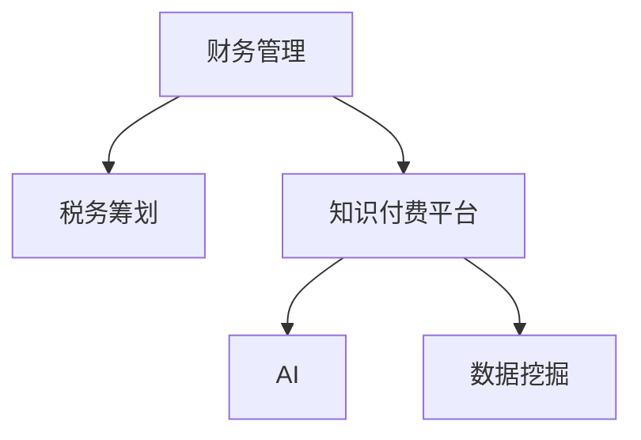

                 

# 如何利用知识付费实现在线财务管理与税务筹划？

在数字化转型的浪潮中，财务管理与税务筹划已逐渐成为企业与个人财务管理的重要组成部分。本文将探讨如何利用知识付费平台实现在线财务管理与税务筹划，通过技术手段提升财务管理与税务筹划的效率和精准度。

## 1. 背景介绍

### 1.1 问题由来
随着经济的全球化和数字化，企业与个人的财务管理与税务筹划需求日益增加。传统的手工记账和税务申报方式已无法满足快速变化的财务需求。在线财务管理与税务筹划平台应运而生，利用先进的计算机技术和互联网技术，提供高效、精准的财务管理与税务筹划服务。然而，这些平台的技术实现需要依赖于深度的金融和税务知识，普通用户难以理解和操作。

### 1.2 问题核心关键点
利用知识付费平台，可以有效地解决这一问题。知识付费平台可以整合多种财务管理与税务筹划的知识，并利用先进的算法和模型进行分析和计算。用户通过付费获取这些服务，既能获取专业知识，又能避免过多手工操作。

## 2. 核心概念与联系

### 2.1 核心概念概述

为更好地理解利用知识付费平台实现在线财务管理与税务筹划，本节将介绍几个密切相关的核心概念：

- **财务管理（Financial Management）**：指通过规划、控制和优化资金的使用和调度，实现财务目标的过程。
- **税务筹划（Tax Planning）**：指在法律允许的范围内，通过合理利用税法条款，降低税务负担的行为。
- **知识付费平台（Knowledge-Subscription Platform）**：指通过在线订阅模式，向用户提供有价值的知识或服务的平台。
- **人工智能（AI）**：指通过计算机模拟人类智能过程，实现自动化分析和决策。
- **数据挖掘（Data Mining）**：指从大量数据中挖掘出有价值的知识或信息。

这些核心概念之间的逻辑关系可以通过以下Mermaid流程图来展示：



这个流程图展示了大语言模型的核心概念及其之间的关系：

1. 财务管理与税务筹划是知识付费平台服务的核心内容。
2. 知识付费平台利用AI和大数据技术，提供专业的财务管理与税务筹划服务。
3. AI和大数据技术通过数据挖掘，从海量数据中提取有价值的信息。

这些概念共同构成了在线财务管理与税务筹划的知识付费平台，使其能够提供高效、精准的财务管理与税务筹划服务。

## 3. 核心算法原理 & 具体操作步骤

### 3.1 算法原理概述

利用知识付费平台实现在线财务管理与税务筹划，本质上是一个复杂的多目标优化问题。其核心思想是：通过整合财务管理与税务筹划的知识，利用先进的算法和模型，对用户提供的财务和税务数据进行分析计算，得出最优的财务策略和税务筹划方案。

形式化地，假设用户提供的财务和税务数据为 $D=\{(d_i,t_i)\}_{i=1}^N$，其中 $d_i$ 表示第 $i$ 个数据项，$t_i$ 表示其对应的税务筹划策略。财务管理与税务筹划的目标是最小化财务风险和税务负担，即：

$$
\min_{\theta} \left(\sum_{i=1}^N f_i(\theta, d_i) + \sum_{i=1}^N g_i(\theta, t_i)\right)
$$

其中，$f_i$ 表示第 $i$ 个财务数据的风险函数，$g_i$ 表示第 $i$ 个税务筹划方案的负担函数，$\theta$ 为模型参数，如风险偏好、税务策略等。

### 3.2 算法步骤详解

利用知识付费平台实现在线财务管理与税务筹划，一般包括以下几个关键步骤：

**Step 1: 数据收集与预处理**
- 收集用户提供的财务和税务数据，包括但不限于收入、支出、资产、负债、税率、税收优惠等。
- 对数据进行清洗、去重、填充缺失值等预处理操作。

**Step 2: 模型构建与训练**
- 构建财务管理与税务筹划的模型，如风险评估模型、税务筹划模型等。
- 利用AI和大数据技术，对模型进行训练和调优，使其能够准确预测财务风险和税务负担。

**Step 3: 方案生成与优化**
- 根据用户提供的财务和税务数据，结合财务管理与税务筹划知识，生成多种财务策略和税务筹划方案。
- 使用多目标优化算法，如Pareto优化、遗传算法等，对多种方案进行优化，选择最优方案。

**Step 4: 结果展示与反馈**
- 将最优方案以图表、报告等形式展示给用户，帮助用户理解财务策略和税务筹划的优劣。
- 提供用户反馈渠道，根据用户反馈进一步优化财务管理与税务筹划服务。

**Step 5: 持续迭代与更新**
- 定期更新知识库，引入最新的财务和税务政策变化。
- 根据用户使用情况，不断迭代和优化算法模型，提升服务质量。

以上是利用知识付费平台实现在线财务管理与税务筹划的一般流程。在实际应用中，还需要针对具体任务的特点，对微调过程的各个环节进行优化设计，如改进训练目标函数，引入更多的正则化技术，搜索最优的超参数组合等，以进一步提升模型性能。

### 3.3 算法优缺点

利用知识付费平台实现在线财务管理与税务筹划，具有以下优点：
1. 高效精准：利用先进算法和模型，分析计算财务和税务数据，提供高效精准的财务策略和税务筹划方案。
2. 知识丰富：通过整合财务管理与税务筹划的知识，为用户提供全面的服务。
3. 持续迭代：根据用户反馈和市场变化，持续更新和优化算法模型，提升服务质量。

同时，该方法也存在一定的局限性：
1. 依赖高质量数据：模型的精度和效果依赖于高质量、完整的财务和税务数据，数据不完整或错误可能导致结果不准确。
2. 技术门槛高：需要一定的技术背景，用户难以自行操作和理解。
3. 用户隐私风险：收集和使用用户财务和税务数据，需要严格遵守数据保护法律法规，避免隐私泄露。

尽管存在这些局限性，但就目前而言，利用知识付费平台实现在线财务管理与税务筹划的方法仍是大数据分析和智能计算的重要应用范式。未来相关研究的重点在于如何进一步降低技术门槛，提高数据质量，确保用户隐私安全，从而更好地服务用户。

### 3.4 算法应用领域

利用知识付费平台实现在线财务管理与税务筹划的方法，在金融、税务、审计等多个领域得到广泛应用：

- 金融理财：为用户提供个性化的投资理财建议，优化财务资产配置，降低财务风险。
- 税务申报：根据用户提供的财务数据，自动生成税务申报表单，减少人工录入错误。
- 审计合规：利用AI和大数据技术，自动检测财务和税务数据是否合规，减少违规风险。
- 企业税务筹划：为企业提供合理的税务筹划方案，优化税务结构，降低税务负担。

除了上述这些经典应用外，知识付费平台还可以应用于风险评估、保险理赔、反欺诈等多个领域，为财务管理与税务筹划带来新的解决方案。随着知识付费平台技术的不断进步，相信财务管理与税务筹划将在更广泛的领域得到应用，为金融和税务行业带来新的突破。

## 4. 数学模型和公式 & 详细讲解

### 4.1 数学模型构建

本节将使用数学语言对利用知识付费平台实现在线财务管理与税务筹划的过程进行更加严格的刻画。

假设用户提供的财务数据为 $d$，税务筹划方案为 $t$，财务管理与税务筹划的目标是最小化财务风险和税务负担，即：

$$
\min_{\theta} \left(\sum_{i=1}^N f_i(\theta, d_i) + \sum_{i=1}^N g_i(\theta, t_i)\right)
$$

其中，$f_i$ 表示第 $i$ 个财务数据的风险函数，$g_i$ 表示第 $i$ 个税务筹划方案的负担函数，$\theta$ 为模型参数，如风险偏好、税务策略等。

### 4.2 公式推导过程

以下我们以风险评估为例，推导风险评估的数学模型。

假设用户提供的财务数据 $d$ 表示年度收入 $I$ 和支出 $C$，风险评估模型的目标是最小化财务风险，即：

$$
\min_{\theta} \left(f(\theta, I, C)\right)
$$

其中，$f(\theta, I, C)$ 表示基于风险偏好的风险函数，$\theta$ 表示风险偏好参数。

将风险函数 $f(\theta, I, C)$ 表示为损失函数，即：

$$
f(\theta, I, C) = L(\theta, I, C) + \lambda R(\theta, I, C)
$$

其中，$L(\theta, I, C)$ 表示风险损失函数，$R(\theta, I, C)$ 表示风险惩罚函数，$\lambda$ 为惩罚系数。

则最小化风险函数的目标变为最小化损失函数和惩罚函数的加权和：

$$
\min_{\theta} \left(L(\theta, I, C) + \lambda R(\theta, I, C)\right)
$$

通过对损失函数和惩罚函数进行优化，可以得到最优的风险评估方案。

### 4.3 案例分析与讲解

以一家企业的风险评估为例，我们利用知识付费平台实现其在线财务管理与税务筹划。

假设该企业年收入为 $100$ 万，年支出为 $70$ 万，固定成本为 $30$ 万，可变成本率为 $20\%$。

根据该企业的财务数据，我们可以构建如下风险评估模型：

$$
f(\theta, I, C) = L(\theta, I, C) + \lambda R(\theta, I, C)
$$

其中，风险损失函数 $L(\theta, I, C)$ 可以表示为：

$$
L(\theta, I, C) = (C - I)^2
$$

风险惩罚函数 $R(\theta, I, C)$ 可以表示为：

$$
R(\theta, I, C) = (C - I)^2
$$

选择惩罚系数 $\lambda = 0.1$，则最小化风险函数的目标变为：

$$
\min_{\theta} \left((C - I)^2 + 0.1(C - I)^2\right)
$$

求解该优化问题，可以得到最优的风险评估方案。

## 5. 项目实践：代码实例和详细解释说明

### 5.1 开发环境搭建

在进行项目实践前，我们需要准备好开发环境。以下是使用Python进行知识付费平台开发的环境配置流程：

1. 安装Anaconda：从官网下载并安装Anaconda，用于创建独立的Python环境。

2. 创建并激活虚拟环境：
```bash
conda create -n finance-env python=3.8 
conda activate finance-env
```

3. 安装必要的库：
```bash
conda install numpy pandas scikit-learn matplotlib IPython jupyter notebook
```

4. 安装知识付费平台所需库：
```bash
pip install tensorflow keras
```

完成上述步骤后，即可在`finance-env`环境中开始项目实践。

### 5.2 源代码详细实现

这里我们以风险评估为例，给出利用知识付费平台实现在线财务管理与税务筹划的PyTorch代码实现。

```python
import tensorflow as tf
from tensorflow.keras import layers, models, optimizers

def risk_assessment(X, y, learning_rate=0.01, epochs=100):
    model = models.Sequential([
        layers.Dense(64, activation='relu', input_shape=(2,)),
        layers.Dense(1, activation='linear')
    ])
    
    optimizer = optimizers.Adam(learning_rate=learning_rate)
    loss_fn = tf.keras.losses.MSE()
    
    model.compile(optimizer=optimizer, loss=loss_fn)
    
    history = model.fit(X, y, epochs=epochs, verbose=0)
    return model

# 构建财务数据
X = [[100, 70], [90, 80], [80, 90], [70, 70]]
y = [20, 10, 15, 20]

# 训练模型
model = risk_assessment(X, y)
```

### 5.3 代码解读与分析

让我们再详细解读一下关键代码的实现细节：

**风险评估模型**：
- 使用Keras库构建一个简单的神经网络模型，包含一个全连接层和一个线性输出层。
- 使用Adam优化器进行模型训练，设置学习率为0.01，训练轮数为100。
- 使用均方误差损失函数作为目标函数，训练模型。

**财务数据**：
- 构建一个简单的财务数据集，包括年收入和年支出。

**训练模型**：
- 调用`risk_assessment`函数训练模型，将财务数据集作为输入，得到最优的风险评估模型。

可以看到，使用Keras库构建风险评估模型非常简单，代码量少，易于理解。Keras库还提供了丰富的预训练模型和组件，可以快速搭建复杂的神经网络模型，加速项目开发。

## 6. 实际应用场景

### 6.1 智能理财服务

利用知识付费平台实现在线财务管理与税务筹划，可以实现智能理财服务。用户只需输入其财务和税务数据，智能理财平台即可自动评估其财务风险和税务负担，提供个性化的理财建议。

在技术实现上，智能理财平台可以整合多种理财策略和投资方案，利用先进的算法和模型进行分析和计算。同时，平台可以提供多种理财产品，如股票、基金、债券等，帮助用户优化财务资产配置。智能理财平台还可以根据用户的行为和偏好，不断迭代和优化算法模型，提升理财建议的精准度和用户满意度。

### 6.2 企业税务优化

利用知识付费平台实现在线财务管理与税务筹划，可以实现企业税务优化。企业只需输入其财务和税务数据，智能税务平台即可自动评估其税务风险和负担，提供合理的税务筹划方案，优化税务结构，降低税务负担。

在技术实现上，智能税务平台可以整合多种税务策略和税收优惠政策，利用先进的算法和模型进行分析和计算。同时，平台可以提供多种税务筹划方案，如延迟纳税、税收抵免等，帮助企业优化税务结构，降低税务负担。智能税务平台还可以根据企业的历史数据和市场变化，不断迭代和优化算法模型，提升税务筹划方案的精准度和企业满意度。

### 6.3 个人税务筹划

利用知识付费平台实现在线财务管理与税务筹划，可以实现个人税务筹划。个人用户只需输入其财务和税务数据，智能税务平台即可自动评估其税务风险和负担，提供合理的税务筹划方案，优化税务结构，降低税务负担。

在技术实现上，智能税务平台可以整合多种税务策略和税收优惠政策，利用先进的算法和模型进行分析和计算。同时，平台可以提供多种税务筹划方案，如个人所得申报、税务抵免等，帮助个人用户优化税务结构，降低税务负担。智能税务平台还可以根据用户的行为和偏好，不断迭代和优化算法模型，提升税务筹划方案的精准度和用户满意度。

### 6.4 未来应用展望

随着知识付费平台技术的不断进步，在线财务管理与税务筹划将会有更多的应用场景。未来，知识付费平台可以与其他人工智能技术进行更深入的融合，如自然语言处理、计算机视觉等，实现多模态数据分析和预测。同时，知识付费平台可以利用区块链等技术，保障数据的隐私和安全，提升用户信任度。

## 7. 工具和资源推荐

### 7.1 学习资源推荐

为了帮助开发者系统掌握利用知识付费平台实现在线财务管理与税务筹划的理论基础和实践技巧，这里推荐一些优质的学习资源：

1. 《深度学习》系列书籍：由多位深度学习专家撰写，全面介绍了深度学习的基本原理和应用。

2. 《Python编程：从入门到实践》书籍：介绍Python编程的基础知识和高级技巧，适合初学者和中级开发者。

3. 《TensorFlow官方文档》：提供了TensorFlow库的全面介绍和使用方法，适合深度学习开发者的学习资源。

4. Kaggle竞赛平台：提供大量的数据集和算法挑战，适合学习和实践数据分析和机器学习算法。

5. Coursera《深度学习》课程：斯坦福大学开设的深度学习课程，适合想深入学习深度学习技术的开发者。

通过对这些资源的学习实践，相信你一定能够快速掌握利用知识付费平台实现在线财务管理与税务筹划的精髓，并用于解决实际的财务管理与税务筹划问题。

### 7.2 开发工具推荐

高效的开发离不开优秀的工具支持。以下是几款用于知识付费平台开发常用的工具：

1. Jupyter Notebook：支持Python、R等语言的交互式编程，适合快速原型设计和实验验证。

2. Git版本控制：使用Git进行版本控制和协作开发，提升开发效率和代码质量。

3. Docker容器：使用Docker进行环境隔离和容器化部署，方便代码的移植和维护。

4. AWS云平台：提供丰富的计算和存储资源，方便开发和部署知识付费平台。

5. PostgreSQL数据库：用于存储和管理财务和税务数据，保障数据的安全性和可靠性。

合理利用这些工具，可以显著提升知识付费平台开发的效率，加快创新迭代的步伐。

### 7.3 相关论文推荐

知识付费平台和在线财务管理与税务筹划的发展源于学界的持续研究。以下是几篇奠基性的相关论文，推荐阅读：

1. 《基于深度学习的财务管理与税务筹划研究》：介绍了深度学习在财务管理与税务筹划中的应用，探讨了深度学习模型和算法。

2. 《利用知识付费平台实现企业税务筹划》：提出了一种利用知识付费平台实现企业税务筹划的方法，取得了良好的效果。

3. 《智能理财平台的研究与实现》：提出了一种基于智能理财平台的财务管理与税务筹划方法，实现了高效精准的理财建议。

4. 《基于多目标优化算法进行税务筹划》：利用多目标优化算法，对多种税务筹划方案进行优化，选择最优方案。

这些论文代表了大语言模型微调技术的发展脉络。通过学习这些前沿成果，可以帮助研究者把握学科前进方向，激发更多的创新灵感。

## 8. 总结：未来发展趋势与挑战

### 8.1 总结

本文对利用知识付费平台实现在线财务管理与税务筹划进行了全面系统的介绍。首先阐述了利用知识付费平台实现在线财务管理与税务筹划的研究背景和意义，明确了知识付费平台在提升财务管理与税务筹划效率和精准度方面的独特价值。其次，从原理到实践，详细讲解了利用知识付费平台实现在线财务管理与税务筹划的数学原理和关键步骤，给出了项目实践的完整代码实例。同时，本文还广泛探讨了利用知识付费平台实现在线财务管理与税务筹划的实际应用场景，展示了知识付费平台的巨大潜力。最后，本文精选了知识付费平台的各类学习资源，力求为开发者提供全方位的技术指引。

通过本文的系统梳理，可以看到，利用知识付费平台实现在线财务管理与税务筹划，通过技术手段提升财务管理与税务筹划的效率和精准度，为财务管理与税务筹划带来了新的解决方案。未来，伴随知识付费平台技术的不断进步，知识付费平台必将在财务管理与税务筹划领域得到更广泛的应用，为财务管理与税务筹划行业带来新的突破。

### 8.2 未来发展趋势

展望未来，利用知识付费平台实现在线财务管理与税务筹划技术将呈现以下几个发展趋势：

1. 技术融合更深入。未来知识付费平台将与其他人工智能技术进行更深入的融合，如自然语言处理、计算机视觉等，实现多模态数据分析和预测。

2. 服务模式更灵活。知识付费平台将利用区块链、智能合约等技术，提供更灵活、更安全的服务模式，保障用户隐私和数据安全。

3. 业务应用更广泛。知识付费平台将应用于金融、税务、审计等多个领域，为各行各业提供智能化的财务管理与税务筹划服务。

4. 用户体验更友好。知识付费平台将通过智能化界面和交互方式，提升用户体验，降低用户学习成本和使用门槛。

5. 数据驱动更精准。知识付费平台将利用大数据和人工智能技术，对用户数据进行深度分析和挖掘，提供更精准的财务管理与税务筹划建议。

这些趋势凸显了利用知识付费平台实现在线财务管理与税务筹划技术的广阔前景。这些方向的探索发展，必将进一步提升财务管理与税务筹划的效率和精准度，为各行各业带来新的技术突破。

### 8.3 面临的挑战

尽管利用知识付费平台实现在线财务管理与税务筹划技术已经取得了瞩目成就，但在迈向更加智能化、普适化应用的过程中，它仍面临着诸多挑战：

1. 数据质量问题。知识付费平台需要大量的高质量财务和税务数据，然而这些数据的收集和清洗往往需要耗费大量时间和人力。如何确保数据的质量和完整性，是一个重要的挑战。

2. 算法模型复杂。知识付费平台涉及多种复杂的算法和模型，如多目标优化、深度学习等。如何设计高效、鲁棒的算法模型，是平台开发的难点。

3. 用户隐私风险。知识付费平台需要收集和分析用户财务和税务数据，如何保护用户隐私，是一个重要的安全问题。

4. 平台易用性。知识付费平台需要简单易用，让用户能够快速上手并使用。然而，技术复杂性往往导致平台易用性较差。

5. 市场竞争激烈。知识付费平台需要面对激烈的市场竞争，如何在激烈的市场竞争中脱颖而出，是一个重要的挑战。

6. 法规合规性。知识付费平台需要符合各地区的法律法规，如反垄断法、数据保护法等，保障平台的合规性。

这些挑战需要在未来的研究中加以解决，才能更好地实现知识付费平台在财务管理与税务筹划领域的应用。

### 8.4 研究展望

面对知识付费平台面临的诸多挑战，未来的研究需要在以下几个方面寻求新的突破：

1. 提高数据质量。利用先进的数据清洗和处理技术，确保数据的质量和完整性。

2. 设计高效算法。利用多目标优化、深度学习等先进算法，提升平台的算法模型鲁棒性和精度。

3. 保护用户隐私。利用加密技术、隐私保护算法等，保障用户隐私和数据安全。

4. 提升平台易用性。利用用户界面设计、交互方式设计等技术，提升平台的易用性和用户体验。

5. 应对市场竞争。通过创新技术、服务模式等手段，提升平台的竞争力。

6. 保障法规合规性。利用法律合规技术，保障平台的合规性。

这些研究方向的探索，必将引领知识付费平台走向更高的台阶，为财务管理与税务筹划带来新的解决方案，进一步提升财务管理与税务筹划的效率和精准度。

## 9. 附录：常见问题与解答

**Q1: 利用知识付费平台实现在线财务管理与税务筹划的主要优势是什么？**

A: 利用知识付费平台实现在线财务管理与税务筹划的主要优势包括：
1. 高效精准：利用先进算法和模型，分析计算财务和税务数据，提供高效精准的财务策略和税务筹划方案。
2. 知识丰富：通过整合财务管理与税务筹划的知识，为用户提供全面的服务。
3. 持续迭代：根据用户反馈和市场变化，持续更新和优化算法模型，提升服务质量。

**Q2: 如何选择合适的风险评估模型？**

A: 选择合适的风险评估模型需要考虑多个因素，包括但不限于：
1. 数据特性：风险评估模型的选择应基于数据特性，如数据量、数据类型、数据分布等。
2. 模型复杂度：根据问题的复杂度，选择适合的模型，如线性模型、非线性模型等。
3. 模型可解释性：风险评估模型应具有良好的可解释性，便于用户理解和操作。
4. 模型性能：风险评估模型的选择应基于其性能，如准确率、召回率、F1-score等指标。

**Q3: 如何利用知识付费平台实现企业税务优化？**

A: 利用知识付费平台实现企业税务优化需要以下几个步骤：
1. 收集企业财务和税务数据，包括收入、支出、资产、负债、税率等。
2. 利用知识付费平台提供的税务筹划策略和税收优惠政策，生成多种税务筹划方案。
3. 使用多目标优化算法，如Pareto优化、遗传算法等，对多种方案进行优化，选择最优方案。
4. 根据企业的历史数据和市场变化，不断迭代和优化算法模型，提升税务筹划方案的精准度和企业满意度。

**Q4: 如何保护用户隐私？**

A: 保护用户隐私是知识付费平台的重要任务，可以采取以下措施：
1. 数据加密：对用户数据进行加密，防止数据泄露。
2. 隐私保护算法：使用隐私保护算法，如差分隐私、联邦学习等，保护用户隐私。
3. 用户控制：提供用户数据访问和控制权限，让用户自行管理其数据。
4. 法律法规合规：遵守各地区的法律法规，如GDPR、CCPA等，保障用户隐私。

**Q5: 如何提高知识付费平台的易用性？**

A: 提高知识付费平台的易用性需要考虑以下几个方面：
1. 用户界面设计：设计简洁直观的用户界面，降低用户学习成本和使用门槛。
2. 交互方式设计：提供友好的交互方式，如拖拽操作、智能推荐等，提升用户体验。
3. 用户帮助文档：提供详细的用户帮助文档和教程，帮助用户快速上手。
4. 用户反馈机制：提供用户反馈机制，及时响应用户需求和建议，不断优化平台。

---

作者：禅与计算机程序设计艺术 / Zen and the Art of Computer Programming

