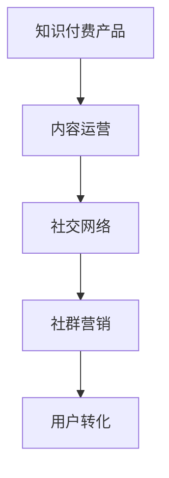

                 

# 如何利用社群营销推广知识付费产品

> 关键词：社群营销,知识付费产品,内容运营,社交网络,转化率提升,精准触达

## 1. 背景介绍

在知识付费领域，内容质量始终是核心竞争力。但仅仅依赖优质内容，已不足以支撑起产品的持续增长。如何在内容之外，构建有效的用户粘性和转化路径，是众多知识付费产品的运营挑战。

随着社交媒体和移动互联网的蓬勃发展，基于社交网络的社群营销成为新时代的营销利器。用户的朋友圈、微信群、兴趣群组等社交网络，成为新的流量来源和用户聚集体。利用社群的力量，在内容和用户间建立深度连接，实现知识付费产品的推广与转化，成为知识付费产业的新趋势。

本文将详细探讨如何利用社群营销，通过深度运营和精准触达，提升知识付费产品的推广效果和转化率，实现业务的可持续增长。

## 2. 核心概念与联系

### 2.1 核心概念概述

为了系统地理解社群营销对知识付费产品的推广作用，本节将详细讲解几个关键概念及其相互联系：

- **知识付费产品**：即通过平台或应用向用户提供付费知识的场景。知识付费产品通常以音频、视频、文章、直播等形式呈现，涵盖专业技能、行业洞察、个人成长等多个领域。

- **社群营销**：指利用社交网络，通过社群运营建立品牌信任和用户粘性，最终实现用户转化的一种营销方式。社群营销不仅关注内容输出，更注重与用户的深度互动和情感连接。

- **内容运营**：指通过策划、制作和分发内容，建立与用户的高频互动和深度连接，从而提升品牌影响力和用户忠诚度。内容运营是社群营销的核心驱动力。

- **社交网络**：指基于互联网技术的用户互动平台，如微信、微博、QQ群、豆瓣小组等，是社群营销的基础设施。

- **用户转化**：指将潜在用户转化为付费用户的过程。通常通过社群运营中的多次触达、互动和激励，最终促成用户完成支付，成为正式付费用户。

这些概念之间的联系通过以下Mermaid流程图来展示：



这个流程图展示了知识付费产品与社群营销之间的相互依存关系。内容运营提供高质量的内容，社交网络提供丰富的触达渠道，社群营销通过深度互动建立品牌信任，最终在用户转化环节达成营销目标。

## 3. 核心算法原理 & 具体操作步骤

### 3.1 算法原理概述

社群营销的推广原理可以总结如下：

- **内容差异化**：根据用户兴趣和需求，制作差异化的高质量内容，满足不同用户群体的特定需求。
- **高频互动**：通过社交网络的社群运营，持续与用户进行高频互动，建立情感连接，提升品牌信任。
- **激励机制**：设计有效的激励机制，如优惠券、会员特权、社区荣誉等，刺激用户完成转化。
- **精准触达**：利用社交网络的精准定位功能，将产品信息传递给有需求的用户群体，实现高效的转化。

### 3.2 算法步骤详解

社群营销的推广步骤主要包括：

**Step 1: 用户画像分析**

- 收集用户的基本信息（年龄、性别、职业等）、行为数据（浏览记录、互动情况等）和心理特征（兴趣、偏好等）。
- 使用数据挖掘和机器学习技术，构建用户画像，识别出高价值用户群体。

**Step 2: 内容策划与制作**

- 根据用户画像，策划出符合用户兴趣和需求的内容主题。
- 制作高质量的内容，如专业文章、视频讲解、音频课程等，确保内容的专业性和吸引力。

**Step 3: 社交网络布局**

- 选择适合的社交网络平台，建立和维护品牌官方账号，如微信公众号、微博账号、QQ群等。
- 利用社交网络的多样化功能，如朋友圈分享、微信群互动、直播等功能，提升内容的曝光率。

**Step 4: 社群运营**

- 在社交网络上创建和维护社群，吸引有需求的用户加入。
- 定期发布高质量内容，并进行互动和答疑，建立用户粘性。
- 设计互动活动和竞赛，提高社群的活跃度和用户参与度。

**Step 5: 激励机制设计**

- 设计有吸引力的激励机制，如新用户优惠券、会员特权、社区荣誉等。
- 通过社群运营，宣传和推广激励措施，吸引用户关注和参与。

**Step 6: 精准触达与转化**

- 利用社交网络的精准定位功能，选择和推荐高价值用户群体，进行有针对性的推广。
- 通过社群运营中的多次触达和互动，逐步引导用户完成支付，实现转化。

### 3.3 算法优缺点

社群营销在推广知识付费产品方面有以下优点：

- **高效触达**：社交网络的广泛覆盖和精准定位功能，能够高效地触达有需求的用户群体。
- **深度连接**：通过社群运营建立深度互动，形成品牌信任，提升用户粘性。
- **精准激励**：设计有针对性的激励机制，提高转化率。

但社群营销也存在一些缺点：

- **依赖用户参与**：社群运营需要用户积极参与，如果用户活跃度低，效果可能不佳。
- **高运营成本**：社群管理需要大量的人力投入，且对运营团队的专业性要求较高。
- **用户筛选难度**：精准定位和推荐用户需要高精度的用户画像分析，难度较大。

### 3.4 算法应用领域

社群营销在知识付费产品的推广中，适用于多种场景，如专业技能培训、行业洞察分享、个人成长指导等。具体应用如下：

- **在线课程销售**：通过社群运营推广在线课程，吸引用户报名购买。
- **线下活动组织**：利用社群管理线下活动，如讲座、沙龙等，提升用户参与度和产品曝光率。
- **会员体系建设**：在社群中构建会员体系，提供会员特权和专属内容，增加用户粘性。
- **知识社区建设**：打造知识社区，让用户交流分享知识，同时提供付费内容增值服务。

## 4. 数学模型和公式 & 详细讲解 & 举例说明

### 4.1 数学模型构建

为了更好地衡量社群营销的效果，可以使用以下数学模型：

- **内容互动率**：衡量用户在内容上的互动程度，公式为：$P = \frac{互动次数}{内容曝光次数}$。
- **转化率**：衡量用户从潜在用户到付费用户的转化效果，公式为：$R = \frac{付费用户数}{潜在用户数}$。
- **用户留存率**：衡量用户在一定时间内的留存情况，公式为：$L = \frac{留存用户数}{总用户数}$。

### 4.2 公式推导过程

以内容互动率公式为例，推导其计算过程：

设内容曝光次数为 $N$，互动次数为 $P$，则内容互动率 $P$ 计算公式为：

$$
P = \frac{P}{N}
$$

在实际应用中，可以通过数据分析工具，如Google Analytics、微信公众号统计工具等，统计并计算出具体数值。

### 4.3 案例分析与讲解

假设某知识付费平台通过社群营销推广在线课程，收集到以下数据：

- 内容曝光次数：10000次
- 互动次数：500次

则内容互动率为：

$$
P = \frac{500}{10000} = 0.05
$$

该数值表示每100次内容曝光，有5次与用户的互动。通过进一步分析，可以发现互动次数的来源和分布，从而优化内容策划和互动策略，提升转化率。

## 5. 项目实践：代码实例和详细解释说明

### 5.1 开发环境搭建

进行社群营销推广，需要搭建专门的开发环境。以下是Python开发环境搭建流程：

1. 安装Anaconda：从官网下载并安装Anaconda，用于创建独立的Python环境。

2. 创建并激活虚拟环境：
```bash
conda create -n pythongroup python=3.8 
conda activate pythongroup
```

3. 安装必要的工具包：
```bash
pip install pandas numpy matplotlib scikit-learn jupyter notebook ipython
```

4. 设置Python路径：
```bash
export PYTHONPATH=~/codes/{project_name}
```

完成上述步骤后，即可在`pythongroup`环境中开始代码实现。

### 5.2 源代码详细实现

下面是一个Python代码实例，展示如何利用社交网络平台（如微信）进行社群营销推广。

```python
import pandas as pd
from wechatpy import WeChatOfficialAccount
from wechatpy import WeChatPrivateAccount
from wechatpy.tool.conversion import TextMsg, NewsMsg
from wechatpy.tool.masssend import sendmass

# 创建微信官方账号
official_account = WeChatOfficialAccount(appid='your_appid', secret='your_secret')
official_account.addhandler(NewsMsg())

# 创建微信个人账号
private_account = WeChatPrivateAccount(openid='your_openid', appid='your_appid', secret='your_secret')
private_account.addhandler(TextMsg())

# 发布文章
def post_article(article_title, article_content):
    title = article_title
    content = article_content
    msg = NewsMsg媒体文章标题=title,媒体文章内容=content,图片链接='',展示卡片图=0)
    return official_account.sendmsg(msg)

# 发布图文消息
def send_news(news_title, news_content):
    title = news_title
    content = news_content
    msg = NewsMsg媒体文章标题=title,媒体文章内容=content,图片链接='',展示卡片图=0)
    return official_account.sendmsg(msg)

# 推送消息
def send_message(text):
    msg = TextMsg文本消息=文本)
    return private_account.sendmsg(msg)

# 调用上述函数进行实际推广
post_article('高效沟通技巧', '掌握高效沟通技巧，成为职场达人')
send_news('Python编程技巧', '掌握Python编程技巧，成为编程高手')
send_message('立即报名，享受早鸟价！')
```

通过上述代码，可以在微信平台发布高质量的文章、图文消息，进行精准推送，吸引用户关注和参与，最终实现社群营销的目标。

### 5.3 代码解读与分析

代码中使用了Python的wechatpy库，用于与微信平台进行接口调用。具体步骤如下：

- **创建微信账号**：通过appid和secret配置官方账号和个人账号，利用官方账号发布文章和图文消息，利用个人账号推送即时消息。
- **发布文章**：使用NewsMsg对象创建文章消息，通过官方账号发送。
- **发布图文消息**：使用NewsMsg对象创建图文消息，通过官方账号发送。
- **推送消息**：使用TextMsg对象创建文本消息，通过个人账号发送。

通过这些步骤，可以构建完整的社群营销推广流程，有效提升知识付费产品的曝光率和用户参与度。

### 5.4 运行结果展示

运行上述代码后，可以在微信平台看到发布的文章、图文消息和即时消息，吸引用户关注和参与，实现社群营销的目标。例如，发布一篇关于高效沟通技巧的文章后，可以在微信朋友圈、微信群等渠道看到该文章，吸引用户点击阅读，参与互动。通过这些互动和反馈，可以进一步优化推广策略，提升社群营销的效果。

## 6. 实际应用场景

### 6.1 在线教育平台

在线教育平台可以利用社群营销推广各类在线课程，如编程课程、语言学习、职业技能培训等。通过在社交网络平台创建学习社群，定期发布高质量的学习资料和互动活动，吸引用户加入社群并持续参与，最终实现课程的销售和转化。

例如，某在线编程平台可以创建Python编程学习社群，定期发布Python编程技巧、案例分析和编程挑战等文章，吸引Python爱好者加入社群，并提供免费试听课、会员特权等激励措施，引导用户付费订阅高级课程。

### 6.2 专业技能培训

专业技能培训公司可以借助社群营销推广各类专业技能课程，如财务分析、市场营销、项目管理等。通过在社交网络平台创建专业技能学习社群，定期发布行业动态、专业文章和专家讲座，吸引专业人士加入社群并持续参与，最终实现课程的销售和转化。

例如，某财务分析培训公司可以创建财务分析学习社群，定期发布财务分析案例、行业报告和专家讲座，吸引财务分析师加入社群，并提供财务分析工具、会员资格等激励措施，引导用户付费订阅高级课程。

### 6.3 个人成长指导

个人成长指导类知识付费产品，如心理辅导、生活管理、职业规划等，也可以通过社群营销进行推广。在社交网络平台创建成长指导学习社群，定期发布心理自助、生活建议和职业规划等文章，吸引用户加入社群并持续参与，最终实现课程的销售和转化。

例如，某心理辅导平台可以创建心理健康学习社群，定期发布心理自助技巧、心理健康案例和专家讲座，吸引心理健康爱好者加入社群，并提供心理咨询服务、会员资格等激励措施，引导用户付费订阅高级课程。

## 7. 工具和资源推荐

### 7.1 学习资源推荐

为了帮助开发者掌握社群营销的理论基础和实践技巧，这里推荐一些优质的学习资源：

1. **《社交媒体营销实战》**：该书详细介绍了社交媒体营销的基本概念、工具和策略，适合初学者入门。
2. **《社群运营的商业价值》**：该书从商业角度分析了社群运营的价值和实践方法，适合有一定运营经验的读者。
3. **《社群营销案例分析》**：该书精选了多个成功的社群营销案例，提供了详细的分析和实战技巧。
4. **《社群营销工具大集合》**：该书介绍了多款社群运营工具的使用方法和应用场景，适合需要提升工作效率的运营人员。
5. **《社群营销实战指南》**：该书系统讲解了社群营销的各个环节和运营技巧，适合全面了解和掌握社群营销的运营人员。

通过对这些资源的学习实践，相信你一定能够快速掌握社群营销的理论基础和实践技巧，并将其应用于知识付费产品的推广中。

### 7.2 开发工具推荐

高效的开发离不开优秀的工具支持。以下是几款用于社群营销开发的常用工具：

1. **微信公众平台**：提供了社交网络的基础设施，方便进行内容发布和用户互动。
2. **微博平台**：提供了社交网络的广泛覆盖和精准定位功能，方便进行用户触达和互动。
3. **豆瓣小组**：提供了兴趣群组的聚合平台，方便进行社群管理和用户运营。
4. **知乎专栏**：提供了专业领域的知识分享平台，方便进行内容发布和用户互动。
5. **Instagram**：提供了社交网络的多样化功能，适合进行图文消息的发布和推广。

合理利用这些工具，可以显著提升社群营销的开发效率，加快创新迭代的步伐。

### 7.3 相关论文推荐

社群营销在知识付费产品中的应用已有多项研究成果。以下是几篇具有代表性的论文，推荐阅读：

1. **《社交媒体与用户行为：理论、方法和应用》**：探讨了社交媒体对用户行为的影响和营销效果。
2. **《社群营销的效果评估与优化》**：介绍了社群营销的效果评估方法和优化策略。
3. **《知识付费平台的社群营销策略》**：分析了知识付费平台的社群营销策略和用户转化路径。
4. **《在线教育平台的社群运营实践》**：介绍了在线教育平台的社群运营实践和案例分析。
5. **《社群营销的未来展望》**：探讨了社群营销的未来发展趋势和研究方向。

这些论文代表了社群营销的研究进展，通过学习这些前沿成果，可以帮助研究者把握学科前进方向，激发更多的创新灵感。

## 8. 总结：未来发展趋势与挑战

### 8.1 总结

本文对利用社群营销推广知识付费产品的过程进行了详细探讨。首先介绍了社群营销的核心概念和关键步骤，明确了社群营销在推广知识付费产品中的重要作用。其次，从算法原理到具体操作步骤，详细讲解了社群营销的推广流程，提供了完整的代码实例和分析解读。最后，从实际应用场景和工具推荐等方面，展望了社群营销的广阔前景和未来发展趋势。

通过本文的系统梳理，可以看到，社群营销为知识付费产品的推广提供了新的渠道和方法，利用社交网络的力量，可以显著提升内容的曝光率和用户参与度，实现产品的快速增长和转化。未来，随着社交媒体和移动互联网技术的不断进步，社群营销将在知识付费产品推广中发挥更大的作用。

### 8.2 未来发展趋势

展望未来，社群营销将在知识付费产品推广中呈现以下几个发展趋势：

1. **多渠道融合**：社交媒体平台之间的融合将成为趋势，多渠道协同推广将大幅提升推广效果。
2. **个性化推荐**：利用数据分析和机器学习技术，进行个性化内容推荐和用户触达，提高推广精准度。
3. **实时互动**：引入实时互动功能，如直播、短视频等，提升用户参与度和互动效果。
4. **智能化运营**：利用AI和大数据分析技术，实现社群运营的智能化管理，提高运营效率。
5. **多模态内容**：结合文本、音频、视频等多模态内容，提供更丰富的用户体验，提升用户粘性。

以上趋势凸显了社群营销的广阔前景。这些方向的探索发展，必将进一步提升知识付费产品的推广效果，实现业务的可持续增长。

### 8.3 面临的挑战

尽管社群营销在知识付费产品推广中已经展现出巨大潜力，但在实际应用中仍面临诸多挑战：

1. **用户活跃度**：社群运营需要用户积极参与，如果用户活跃度低，效果可能不佳。
2. **运营成本高**：社群管理需要大量的人力投入，且对运营团队的专业性要求较高。
3. **数据隐私问题**：社交网络平台对用户数据的收集和处理，需要严格遵守数据隐私法规。
4. **内容同质化**：内容运营需要不断创新，避免内容同质化导致的用户流失。
5. **激励机制设计**：设计有吸引力的激励机制，刺激用户完成转化，需要慎重考虑。

### 8.4 研究展望

面对社群营销面临的这些挑战，未来的研究需要在以下几个方面寻求新的突破：

1. **自动化运营**：利用AI和大数据分析技术，实现社群运营的自动化和智能化，减少人工干预。
2. **多模态内容**：结合文本、音频、视频等多模态内容，提供更丰富的用户体验，提升用户粘性。
3. **跨平台协同**：实现不同社交媒体平台之间的协同推广，提高推广效果。
4. **数据隐私保护**：研究数据隐私保护技术，确保用户数据的安全性和隐私性。
5. **激励机制优化**：设计更加精准和个性化的激励机制，提升用户转化率。

这些研究方向的探索，必将引领社群营销技术迈向更高的台阶，为知识付费产品推广提供更高效、更精准、更智能的解决方案。

## 9. 附录：常见问题与解答

**Q1: 社群营销和内容运营有什么区别？**

A: 社群营销和内容运营都是知识付费产品推广的重要手段，但侧重点不同。内容运营主要关注内容的生产、发布和互动，通过高质量的内容吸引用户关注和参与；而社群营销则更注重利用社交网络的力量，通过社群运营建立品牌信任和用户粘性，最终实现用户转化。

**Q2: 如何判断社群运营的效果？**

A: 社群运营的效果可以通过以下几个指标进行衡量：
- 内容互动率：衡量用户在内容上的互动程度，公式为：$P = \frac{互动次数}{内容曝光次数}$。
- 转化率：衡量用户从潜在用户到付费用户的转化效果，公式为：$R = \frac{付费用户数}{潜在用户数}$。
- 用户留存率：衡量用户在一定时间内的留存情况，公式为：$L = \frac{留存用户数}{总用户数}$。
通过这些指标的监控和分析，可以及时调整运营策略，提升社群营销的效果。

**Q3: 社群运营需要哪些资源投入？**

A: 社群运营需要以下资源投入：
- 人力投入：社群管理需要大量的人力投入，包括社群运营、内容策划、互动答疑等。
- 技术投入：需要利用数据分析和机器学习技术，进行用户画像分析、内容推荐等。
- 资金投入：需要设计有吸引力的激励机制，如优惠券、会员特权等，吸引用户关注和参与。

**Q4: 社群营销的潜在风险有哪些？**

A: 社群营销的潜在风险包括：
- 用户流失：用户流失率较高，社群管理需要持续优化。
- 内容同质化：内容运营需要不断创新，避免内容同质化导致的用户流失。
- 激励机制失效：激励机制设计不当，可能影响用户转化。
- 用户数据隐私：社交网络平台对用户数据的收集和处理，需要严格遵守数据隐私法规。

通过了解这些潜在风险，可以提前制定应对策略，减少运营风险。

**Q5: 社群营销的未来展望是什么？**

A: 社群营销的未来展望包括：
- 多渠道融合：社交媒体平台之间的融合将成为趋势，多渠道协同推广将大幅提升推广效果。
- 个性化推荐：利用数据分析和机器学习技术，进行个性化内容推荐和用户触达，提高推广精准度。
- 实时互动：引入实时互动功能，如直播、短视频等，提升用户参与度和互动效果。
- 智能化运营：利用AI和大数据分析技术，实现社群运营的智能化管理，提高运营效率。
- 多模态内容：结合文本、音频、视频等多模态内容，提供更丰富的用户体验，提升用户粘性。

这些方向的发展将进一步提升社群营销的效果，为知识付费产品推广提供更高效、更精准、更智能的解决方案。

---

作者：禅与计算机程序设计艺术 / Zen and the Art of Computer Programming

