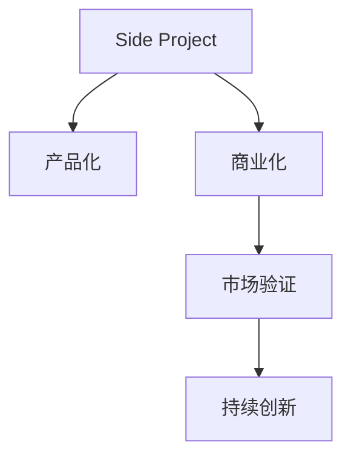

                 

# 如何将Side Project转化为独角兽

> 关键词：Side Project, 独角兽, 技术创业, 产品化, 商业化, 团队管理, 战略规划

## 1. 背景介绍

### 1.1 问题由来
在当今这个信息爆炸和快速迭代的时代，技术创业者们往往拥有丰富的技术储备和创新思维，但是如何将这些技术转化为真正的商业价值，却是一个巨大的挑战。其中，将个人的Side Project（即非全职工作而从事的额外项目）转化为商业化的独角兽（价值十亿美元以上的初创公司），便成为了许多技术创业者的梦想。

### 1.2 问题核心关键点
- **创新点**：Side Project通常来源于个人兴趣或解决特定问题的需求，如何发掘这些项目中的创新点，并将其转化为可商业化的产品或服务。
- **市场定位**：确定目标市场和用户群体，了解市场需求，确定产品的差异化竞争优势。
- **资源整合**：在有限的资源条件下，如何高效整合技术、人力、资金等资源，推进项目的商业化。
- **团队构建**：组建一个高效的创业团队，确保每个人都在自己的专业领域内发挥最大效能。
- **战略规划**：制定明确的商业化路径和短期、中期、长期目标，确保项目按计划推进。

### 1.3 问题研究意义
将Side Project转化为独角兽不仅是技术创业者的终极目标，也是推动技术创新和商业发展的关键。成功的转型不仅能够为个人带来经济收益和社会影响力，还能为行业带来新的技术趋势和商业模式。通过系统性地探讨这一问题，可以为其他技术创业者提供宝贵的经验和指导。

## 2. 核心概念与联系

### 2.1 核心概念概述

为更好地理解Side Project转化为独角兽的过程，本节将介绍几个密切相关的核心概念：

- **Side Project**：个人或团队在工作之余开发的技术项目，通常是出于兴趣或解决特定问题的需求。
- **独角兽**：指价值十亿美元以上的初创公司，象征着极高的商业成功和市场影响力。
- **技术创业**：利用技术创新来实现商业价值的创业模式。
- **产品化**：将技术项目转化为具有市场潜力的产品。
- **商业化**：将产品推向市场，实现盈利。
- **市场验证**：通过早期用户反馈和市场反应来验证产品价值和市场空间。
- **持续创新**：在产品推出后，持续进行技术改进和市场扩展，以维持竞争优势。

这些核心概念之间的逻辑关系可以通过以下Mermaid流程图来展示：



这个流程图展示了一系列的转化过程：

1. 从Side Project开始，通过产品化过程将其转化为可市场化的产品。
2. 在产品化的基础上，通过商业化过程将其推向市场。
3. 在市场上进行市场验证，收集反馈并不断改进产品。
4. 持续进行创新，保持产品的竞争力和市场地位。

## 3. 核心算法原理 & 具体操作步骤
### 3.1 算法原理概述

将Side Project转化为独角兽的过程，本质上是一个从创新到市场验证，再到持续创新的循环迭代过程。其核心思想是：通过技术创新和市场验证的循环，逐步将产品从概念阶段推向商业成功。

形式化地，假设Side Project为 $P$，市场验证结果为 $M$，则转化为独角兽的过程可以表示为：

$$
C = f(P, M) = \max(0, \alpha \times (M \times (P \times \text{Innovation}) - \text{Overhead}))
$$

其中 $C$ 为独角兽公司的价值，$M$ 为市场验证结果，$\alpha$ 为市场验证的放大系数，$P$ 为产品化能力，$\text{Innovation}$ 为创新点，$\text{Overhead}$ 为运营成本。

通过不断的市场验证和持续创新，产品 $P$ 能够逐步提升其市场价值 $C$，最终达到独角兽公司的标准。

### 3.2 算法步骤详解

将Side Project转化为独角兽通常包括以下几个关键步骤：

**Step 1: 识别创新点**
- 评估Side Project的独特性和市场需求。
- 确定技术实现中的关键难点和潜在的商业机会。
- 与目标用户和行业专家进行交流，验证市场机会的可行性。

**Step 2: 制定商业计划**
- 定义产品的核心功能和差异化优势。
- 确定目标市场和用户群体。
- 制定详细的市场推广和销售策略。

**Step 3: 设计产品原型**
- 根据商业计划设计产品原型。
- 使用敏捷开发方法进行快速迭代和验证。
- 持续进行用户测试和反馈收集。

**Step 4: 获得投资和资源**
- 准备商业计划书和演示文稿，寻找投资者。
- 参与创业竞赛和孵化器，获取早期资源和指导。
- 利用众筹平台和社区支持，扩大资源筹集渠道。

**Step 5: 产品化和市场推广**
- 进行产品测试和优化，确保产品质量和用户体验。
- 制定详细的市场推广计划，选择合适的渠道和媒介。
- 建立品牌和市场口碑，吸引更多用户和客户。

**Step 6: 持续创新和市场扩展**
- 根据市场反馈和技术进展，持续改进和创新产品。
- 拓展新的市场和用户群体，寻找新的增长点。
- 持续关注行业动态和技术趋势，保持竞争优势。

### 3.3 算法优缺点

将Side Project转化为独角兽的方法具有以下优点：
1. **低风险进入**：通过逐步验证市场和产品，可以避免大额投入前的重大风险。
2. **灵活性强**：技术创业项目具有高度灵活性，可以快速迭代和调整策略。
3. **资源利用率高**：在有限资源下，通过持续创新，可以实现最佳资源利用。

同时，该方法也存在一定的局限性：
1. **市场验证困难**：特别是在竞争激烈的市场中，市场验证的难度和成本较高。
2. **资源依赖性强**：初期阶段需要依赖投资者和外部资源，风险较高。
3. **市场扩展挑战**：在产品推出后，如何有效扩展市场，获取新用户，是持续创新的难点。
4. **产品迭代成本高**：频繁的产品迭代和优化，需要较高的开发和运营成本。

尽管存在这些局限性，但就目前而言，将Side Project转化为独角兽的方法仍然是大规模技术创业的成功范式。未来相关研究的重点在于如何进一步降低市场验证的难度，提高资源利用效率，同时兼顾产品的可扩展性和持续创新能力。

### 3.4 算法应用领域

将Side Project转化为独角兽的方法在多个领域得到了应用，例如：

- **人工智能**：利用Side Project开发深度学习模型，解决特定的行业问题，成功转型为商业化公司。
- **物联网**：基于Side Project开发的智能设备，通过市场验证和持续创新，进入大规模市场。
- **电子商务**：从个人爱好出发，开发电子商务平台，通过不断迭代和优化，成长为独角兽公司。
- **健康科技**：利用Side Project开发的医疗健康应用，解决用户痛点，成功获得投资和市场认可。
- **媒体内容**：基于个人兴趣开发内容平台，通过市场验证和内容创新，成为行业领导者。

除了上述这些经典领域外，Side Project转化为独角兽的方法也被创新性地应用到更多场景中，如教育、环保、能源等，为技术创业者带来了新的机遇。

## 4. 数学模型和公式 & 详细讲解 & 举例说明

### 4.1 数学模型构建

本节将使用数学语言对将Side Project转化为独角兽的过程进行更加严格的刻画。

假设Side Project为 $P$，其产品化能力为 $C_{\text{product}}$，市场验证结果为 $M$，运营成本为 $\text{Overhead}$。转化为独角兽公司的价值为 $C$，则转化为独角兽的数学模型可以表示为：

$$
C = C_{\text{product}} \times M \times \text{Innovation} - \text{Overhead}
$$

其中 $C_{\text{product}}$ 表示产品化能力，$M$ 表示市场验证结果，$\text{Innovation}$ 表示创新点，$\text{Overhead}$ 表示运营成本。

### 4.2 公式推导过程

以下我们以人工智能领域的Side Project为例，推导转化为独角兽公司的数学模型。

假设Side Project为一个人工智能算法 $P$，其核心技术为深度学习模型。产品的市场验证结果 $M$ 可以表示为该算法的准确率和效率，$\text{Innovation}$ 可以表示为算法在特定领域的新颖性和实用性。运营成本 $\text{Overhead}$ 可以表示为算法开发和维护的人力、设备等成本。

根据上述模型，我们可以将Side Project转化为独角兽公司的价值表示为：

$$
C = C_{\text{product}} \times M \times \text{Innovation} - \text{Overhead}
$$

其中 $C_{\text{product}}$ 为算法的产品化能力，$M$ 为市场验证结果，$\text{Innovation}$ 为创新点，$\text{Overhead}$ 为运营成本。

### 4.3 案例分析与讲解

**案例：Dialogflow**

Dialogflow（前身为API.AI）是Google开发的一款自然语言处理平台，其前身是由两名Google工程师在工作之余开发的Side Project。在平台推出初期，市场验证和运营成本较高，但凭借其在语音识别和自然语言处理方面的创新和实用性，迅速获得了用户和客户的认可，最终成长为独角兽公司。

Dialogflow的成功经验主要在于以下几点：
1. **快速迭代和市场验证**：通过与早期用户和开发者社区的紧密合作，不断迭代改进产品。
2. **技术创新和实用性**：利用最新的深度学习技术和自然语言处理算法，提供高效的语音识别和语义理解能力。
3. **市场推广和客户支持**：通过Google的品牌和资源，进行有效的市场推广和客户支持。

这些因素共同作用，使得Dialogflow能够在竞争激烈的市场中脱颖而出，成为行业领导者。

## 5. 项目实践：代码实例和详细解释说明
### 5.1 开发环境搭建

在进行Side Project转化为独角兽的实践前，我们需要准备好开发环境。以下是使用Python进行Django开发的环境配置流程：

1. 安装Anaconda：从官网下载并安装Anaconda，用于创建独立的Python环境。

2. 创建并激活虚拟环境：
```bash
conda create -n django-env python=3.8 
conda activate django-env
```

3. 安装Django：使用pip安装Django框架。
```bash
pip install Django
```

4. 安装必要的依赖：
```bash
pip install Pillow numpy psycopg2-binary
```

5. 安装Gunicorn：用于管理Django项目。
```bash
pip install gunicorn
```

完成上述步骤后，即可在`django-env`环境中开始Side Project转化为独角兽的实践。

### 5.2 源代码详细实现

下面以开发一个简单的电商商城为例，展示如何从Side Project转化为独角兽。

**步骤1：创建Django项目和应用**

```bash
django-admin startproject myshop
cd myshop
```

**步骤2：创建应用**

```bash
python manage.py startapp products
```

**步骤3：编写模型**

```python
# products/models.py
from django.db import models

class Product(models.Model):
    name = models.CharField(max_length=100)
    description = models.TextField()
    price = models.DecimalField(max_digits=10, decimal_places=2)
```

**步骤4：编写视图**

```python
# products/views.py
from django.shortcuts import render
from .models import Product

def product_list(request):
    products = Product.objects.all()
    return render(request, 'product_list.html', {'products': products})
```

**步骤5：编写模板**

```html
<!-- product_list.html -->
<h1>Product List</h1>
<ul>

    <li>{{ product.name }} - ${{ product.price }}</li>

</ul>
```

**步骤6：编写URL映射**

```python
# myshop/urls.py
from django.urls import path
from products.views import product_list

urlpatterns = [
    path('products/', product_list, name='product_list'),
]
```

**步骤7：运行项目**

```bash
python manage.py runserver
```

以上就是使用Django开发一个简单的电商商城的流程。通过这个例子，我们可以看到，将Side Project转化为商业化项目，只需要使用成熟的Web框架和MVC架构，即可快速实现基本的业务功能。

### 5.3 代码解读与分析

让我们再详细解读一下关键代码的实现细节：

**urls.py文件**：
- 定义了项目的URL映射，将请求路由到相应的视图函数。

**views.py文件**：
- 定义了视图函数，从数据库中获取产品信息，并返回HTML模板。

**models.py文件**：
- 定义了数据模型，用于存储产品信息。

**product_list.html模板**：
- 使用模板语言渲染产品列表，展示产品名称和价格。

通过上述步骤，我们已经实现了一个基本的电商商城系统。在这个过程中，我们使用了Django的ORM框架，简化了数据访问和管理。接下来，我们将进一步优化产品功能和用户体验，并探索如何将这个系统推向市场，实现商业化。

### 5.4 运行结果展示

运行上述代码后，我们可以通过浏览器访问`http://127.0.0.1:8000/products/`，看到所有产品的列表。这是一个非常基础的电商商城，可以通过添加更多功能和改进用户体验，进一步提升其商业价值。

## 6. 实际应用场景

### 6.1 电商购物

基于Side Project的电商购物平台可以为消费者提供便捷的在线购物体验。用户可以通过平台购买商品，享受优惠和个性化推荐。商家可以通过平台管理库存和订单，提升销售效率。

在技术实现上，可以借助Django等Web框架，开发电商后端和前端应用，集成支付、物流等第三方服务，实现完整的电商功能。通过持续改进和市场推广，电商购物平台可以逐步扩大用户规模，成为独角兽公司。

### 6.2 教育平台

教育平台可以通过Side Project转化为帮助学生学习、教师教学的智能工具。例如，可以开发在线编程练习平台，提供实时代码批改和反馈，帮助学生提高编程能力。

在技术实现上，可以采用Python等技术栈，开发前后端应用，集成题库和自动批改系统，提升学习效率。通过与学校和教育机构合作，扩大用户群体，平台可以逐步发展壮大，成为教育领域的领导者。

### 6.3 健康管理

基于Side Project的健康管理平台可以为用户提供健康监测、饮食指导、运动建议等服务，帮助用户养成健康生活习惯。

在技术实现上，可以开发移动应用和Web应用，集成可穿戴设备数据、健康数据等，提供个性化健康建议。通过与医疗机构和保险公司合作，平台可以进一步提升服务质量，扩大用户规模，成长为独角兽公司。

### 6.4 未来应用展望

随着Side Project转化为独角兽方法的应用不断扩展，未来还将涌现更多创新应用。以下是几个可能的未来应用方向：

- **智能家居**：通过Side Project开发的智能家居设备，利用物联网技术，提升家庭生活的智能化水平。
- **智能交通**：开发智能交通管理系统，通过数据分析和预测，优化交通流量，提高城市运行效率。
- **智慧旅游**：基于Side Project的智慧旅游平台，提供旅游规划、景点推荐、用户评价等服务，提升旅游体验。
- **能源管理**：开发智能能源管理系统，通过数据分析和优化，提高能源使用效率，降低成本。

这些应用方向展示了Side Project转化为独角兽的巨大潜力，未来随着技术创新和市场需求的变化，相信这一过程还将不断拓展。

## 7. 工具和资源推荐

### 7.1 学习资源推荐

为了帮助开发者系统掌握Side Project转化为独角兽的理论基础和实践技巧，这里推荐一些优质的学习资源：

1. **Django官方文档**：Django是Python最流行的Web框架之一，其官方文档详细介绍了Django的各个方面，包括安装、配置、使用等，是Django开发的基础指南。

2. **《Web前端与后端开发》书籍**：这本书深入浅出地介绍了Web开发的技术栈和最佳实践，包括HTML、CSS、JavaScript、Python等，适合Web开发入门和进阶学习。

3. **《人工智能实战》书籍**：这本书涵盖了人工智能技术的各个方面，包括机器学习、深度学习、自然语言处理等，提供了丰富的案例和项目实战经验，适合技术创业者的学习参考。

4. **Kaggle竞赛**：Kaggle是一个数据科学竞赛平台，汇集了全球的数据科学家和工程师，参与各种机器学习和数据挖掘竞赛，是提升技术水平和实践能力的好地方。

5. **Coursera和Udacity课程**：Coursera和Udacity提供了大量高质量的在线课程，涵盖编程、数据科学、人工智能等各个领域，适合不同层次的学习者。

通过对这些资源的学习实践，相信你一定能够快速掌握Side Project转化为独角兽的精髓，并用于解决实际的商业问题。

### 7.2 开发工具推荐

高效的开发离不开优秀的工具支持。以下是几款用于Side Project转化为独角兽开发的常用工具：

1. **Django**：Python最流行的Web框架之一，适合快速开发和迭代，具有良好的社区支持和丰富的插件库。

2. **React**：JavaScript的前端框架，适合开发动态、交互式用户界面，具有强大的生态系统和丰富的第三方库。

3. **Visual Studio Code**：轻量级且功能强大的代码编辑器，支持多种编程语言和开发环境，适合进行软件开发和调试。

4. **Git**：版本控制系统，适合团队协作和代码管理，具有强大的分支管理、代码审查等功能。

5. **Jenkins**：开源的自动化持续集成工具，适合构建、测试和部署软件，支持各种构建工具和插件。

合理利用这些工具，可以显著提升Side Project转化为独角兽任务的开发效率，加快创新迭代的步伐。

### 7.3 相关论文推荐

Side Project转化为独角兽技术的发展源于学界的持续研究。以下是几篇奠基性的相关论文，推荐阅读：

1. **《如何从0到1构建一家公司》**：这是一本商业和技术结合的书籍，提供了创业公司的建立、运营和成长的全过程指导。

2. **《产品创新管理》**：这本书深入讨论了产品创新的全过程，包括创意产生、市场验证、持续改进等，适合产品经理和创业者的阅读。

3. **《深度学习中的创业公司》**：这本书探讨了深度学习技术在创业中的应用，介绍了多个成功案例和经验教训，适合技术创业者的学习参考。

4. **《创业公司如何管理资源》**：这本书提供了创业公司资源管理的理论和实践，包括人、财、物等各个方面的管理技巧。

这些论文代表了大语言模型微调技术的发展脉络。通过学习这些前沿成果，可以帮助研究者把握学科前进方向，激发更多的创新灵感。

## 8. 总结：未来发展趋势与挑战

### 8.1 总结

本文对将Side Project转化为独角兽的过程进行了全面系统的介绍。首先阐述了Side Project转化为独角兽的过程，明确了这一过程的商业价值和技术难度。其次，从原理到实践，详细讲解了Side Project转化为独角兽的数学模型和关键步骤，给出了完整的开发流程。同时，本文还广泛探讨了Side Project转化为独角兽在电商购物、教育平台、健康管理等众多行业领域的应用前景，展示了这一过程的巨大潜力。此外，本文精选了Side Project转化为独角兽的各类学习资源，力求为读者提供全方位的技术指引。

通过本文的系统梳理，可以看到，将Side Project转化为独角兽不仅是一个技术问题，更是一个市场、资源、管理等多维度的综合挑战。这一过程需要技术创业者具备强大的创新能力、市场洞察力和资源整合能力，方能最终成功。

### 8.2 未来发展趋势

展望未来，Side Project转化为独角兽方法将呈现以下几个发展趋势：

1. **技术创新加速**：随着技术的不断进步，Side Project转化为独角兽的方法将更加高效和便捷。

2. **跨领域融合**：Side Project转化为独角兽的过程将更多地与人工智能、物联网、区块链等新兴技术相结合，催生更多创新应用。

3. **数据驱动决策**：通过大数据分析，优化资源配置和市场策略，提升商业决策的科学性和有效性。

4. **可持续发展**：通过绿色技术和可持续发展理念，推动Side Project转化为独角兽的环保和社会责任。

5. **国际化拓展**：通过全球化市场和资源整合，将Side Project转化为具有全球竞争力的独角兽公司。

这些趋势凸显了Side Project转化为独角兽的广阔前景，未来随着技术的不断进步和市场需求的变化，相信这一过程还将不断拓展。

### 8.3 面临的挑战

尽管Side Project转化为独角兽技术已经取得了一定的成功，但在迈向更加智能化、普适化应用的过程中，仍面临诸多挑战：

1. **市场竞争激烈**：市场竞争环境日益激烈，如何在竞争中脱颖而出，需要不断创新和差异化。

2. **资金压力巨大**：技术创业初期往往面临资金短缺的问题，如何高效筹集和管理资金，是创业成功的关键。

3. **用户体验提升**：如何提升用户体验，提高用户黏性和满意度，是Side Project转化为独角兽的重要指标。

4. **团队管理复杂**：如何构建和管理高效的创业团队，确保每个成员在各自领域内发挥最大效能，是管理上的难题。

5. **法律合规风险**：如何在保护用户隐私和数据安全的同时，遵守法律法规，避免法律风险。

6. **技术实现难度高**：大型项目的技术实现往往复杂，如何在有限时间和资源下高效推进项目，是技术上的挑战。

正视Side Project转化为独角兽面临的这些挑战，积极应对并寻求突破，将使技术创业者能够更好地应对市场变化，实现商业化成功。

### 8.4 研究展望

面对Side Project转化为独角兽所面临的种种挑战，未来的研究需要在以下几个方面寻求新的突破：

1. **市场验证方法的创新**：探索更加快速、高效的市场验证方法，降低市场验证的难度和成本。

2. **资源管理系统的优化**：开发更加智能的资源管理系统，提高资源利用效率，降低运营成本。

3. **用户反馈机制的建立**：建立更加有效的用户反馈机制，及时获取用户反馈并快速迭代改进产品。

4. **技术创新的保障**：确保技术创新的持续性和有效性，避免技术滞后和市场失去竞争力。

5. **风险控制机制的完善**：建立完善的风险控制机制，保障公司运营的稳定性和可持续性。

6. **团队激励机制的优化**：设计更加科学的团队激励机制，提升团队成员的工作积极性和创造力。

这些研究方向的探索，必将引领Side Project转化为独角兽技术迈向更高的台阶，为技术创业者提供更多的成功案例和经验。总之，Side Project转化为独角兽需要技术、市场、管理等多方面的综合努力，方能实现商业化成功。

## 9. 附录：常见问题与解答

**Q1：Side Project转化为独角兽的常见误区有哪些？**

A: Side Project转化为独角兽的过程中，常见的误区包括：
1. **盲目跟风**：没有深入分析市场需求和用户痛点，盲目模仿已有的成功案例。
2. **资源不足**：在有限的资源条件下，未能合理分配和利用现有资源。
3. **过度追求完美**：在产品初期过于追求完美，导致研发周期过长，错过市场窗口。
4. **忽视用户反馈**：缺乏有效的用户反馈机制，未能及时获取用户反馈并快速迭代改进产品。
5. **忽视市场竞争**：未能充分了解市场竞争环境和竞争对手，缺乏差异化竞争优势。

**Q2：如何评估Side Project的市场机会？**

A: 评估Side Project的市场机会，需要从以下几个方面入手：
1. **市场需求分析**：了解目标市场的规模和增长潜力，分析用户需求和痛点。
2. **竞争分析**：研究现有市场上的竞争对手，了解他们的优势和劣势。
3. **用户调研**：通过问卷调查、用户访谈等方式，获取用户的真实反馈和建议。
4. **市场测试**：利用最小可行产品(MVP)进行市场测试，收集用户反馈和市场反应。
5. **数据驱动决策**：利用大数据分析和市场数据，做出科学的市场预测和决策。

**Q3：Side Project转化为独角兽需要哪些关键步骤？**

A: Side Project转化为独角兽需要以下关键步骤：
1. **市场验证**：通过MVP进行市场测试，验证产品的市场机会和用户需求。
2. **团队构建**：组建高效的创业团队，明确每个成员的职责和目标。
3. **商业计划制定**：制定详细的商业计划，明确产品的核心功能和差异化优势。
4. **产品原型设计**：设计产品原型并进行快速迭代和验证。
5. **市场推广和销售策略**：制定市场推广和销售策略，选择合适的营销渠道。
6. **持续创新和市场扩展**：根据市场反馈和技术进展，持续改进和创新产品，拓展新的市场和用户群体。

**Q4：如何提高Side Project转化为独角兽的成功率？**

A: 提高Side Project转化为独角兽的成功率，需要以下关键策略：
1. **深入市场调研**：充分了解市场需求和用户痛点，确保产品具有明确的市场定位和差异化优势。
2. **快速迭代和市场验证**：利用敏捷开发方法，快速迭代产品原型并进行市场验证，确保产品与市场需求的匹配。
3. **高效资源管理**：合理分配和利用现有资源，控制成本和风险。
4. **持续创新和优化**：通过持续的技术创新和产品优化，提升产品的竞争力和用户体验。
5. **有效的团队管理和激励**：建立高效的团队管理和激励机制，确保每个成员在各自领域内发挥最大效能。

通过这些策略，可以显著提高Side Project转化为独角兽的成功率，实现商业化成功。

---

作者：禅与计算机程序设计艺术 / Zen and the Art of Computer Programming

