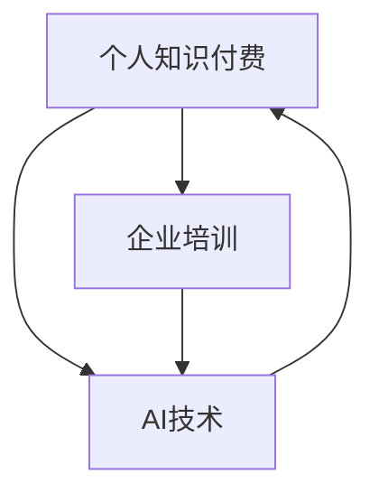

                 

# 如何打造个人知识付费企业培训

## 1. 背景介绍

随着知识经济的兴起和人工智能技术的普及，知识付费和企业培训成为新兴的蓝海市场。个人知识付费企业培训，即通过知识共享和培训服务，帮助企业员工提升技能，增强竞争力，从而为企业创造更大的价值。如何有效开展个人知识付费企业培训，成为各大企业关注的焦点。

本文将从背景介绍、核心概念、算法原理、操作步骤、数学模型、项目实践、实际应用场景、工具资源推荐、总结展望等方面，全面剖析如何打造个人知识付费企业培训。

## 2. 核心概念与联系

### 2.1 核心概念概述

个人知识付费企业培训，是一种通过知识共享和培训服务，帮助企业员工提升技能，增强竞争力，从而为企业创造更大价值的模式。其核心包括以下几个关键概念：

- **知识付费**：即通过付费方式获取有价值的知识或信息。个人知识付费企业培训，是将知识付费理念应用于企业培训，使得企业能够更高效地获取专业知识和技能。
- **企业培训**：通过系统化的培训，提升企业员工的技能和知识水平。个人知识付费企业培训，是指个人提供专业知识培训，以获取相应的付费回报。
- **AI技术**：利用人工智能技术，如机器学习、自然语言处理等，提供个性化、高效的知识培训服务。

这些概念之间的联系如图1所示：


图1：个人知识付费企业培训核心概念图

### 2.2 核心概念原理和架构的 Mermaid 流程图



这个流程图展示了个人知识付费、企业培训和AI技术三者之间的联系：

- 个人知识付费是企业培训和AI技术的起点，驱动企业培训需求和AI技术的应用。
- 企业培训是知识付费的重要应用场景，通过培训提升员工技能，创造更大企业价值。
- AI技术是知识付费和培训的重要工具，通过智能化、个性化的培训方式，提高培训效果。

## 3. 核心算法原理 & 具体操作步骤

### 3.1 算法原理概述

个人知识付费企业培训的算法原理，主要基于机器学习和自然语言处理技术。其核心流程包括知识获取、知识分析、知识推荐、培训评估等步骤。具体如下：

- **知识获取**：从海量数据中提取有价值的知识，如图书、文献、网页等。
- **知识分析**：通过自然语言处理技术，对获取的知识进行分析和理解。
- **知识推荐**：根据员工需求和岗位要求，推荐最相关的知识资源。
- **培训评估**：通过机器学习算法，评估培训效果，优化培训内容。

### 3.2 算法步骤详解

**步骤1：知识获取**

知识获取是个人知识付费企业培训的第一步，即从各种数据源中提取有价值的知识资源。可以通过以下方式实现：

1. **爬虫技术**：使用Python爬虫框架，如Scrapy、BeautifulSoup等，从互联网中抓取有价值的知识资源。
2. **API接口**：利用各类API接口，如Google Scholar、DOAJ等，获取学术论文、文献等知识资源。
3. **用户上传**：允许用户上传个人收藏、笔记等知识资源，丰富知识库内容。

**步骤2：知识分析**

知识分析是将获取的知识进行理解和整理的过程。主要包括以下步骤：

1. **文本清洗**：去除噪音文本，保留有价值的信息。
2. **分词和词性标注**：利用自然语言处理工具，对文本进行分词和词性标注。
3. **命名实体识别**：识别文本中的组织、人名、地名等实体信息。
4. **情感分析**：分析文本的情感倾向，如积极、消极、中性等。

**步骤3：知识推荐**

知识推荐是将分析后的知识资源推荐给用户的过程。主要包括以下步骤：

1. **用户画像**：通过问卷调查、历史行为等数据，构建用户画像。
2. **知识分类**：将知识资源进行分类，如技术、管理、营销等。
3. **协同过滤**：通过用户行为数据，推荐与用户兴趣相似的知识资源。
4. **基于内容的推荐**：根据知识内容的关键词和标签，推荐相关知识资源。

**步骤4：培训评估**

培训评估是衡量培训效果，优化培训内容的过程。主要包括以下步骤：

1. **测试题设计**：设计测试题，评估员工对培训内容的掌握情况。
2. **自动批改**：利用自然语言处理技术，自动批改测试题。
3. **学习曲线分析**：分析员工的学习曲线，评估培训效果。
4. **反馈收集**：收集员工对培训内容的反馈，优化培训内容。

### 3.3 算法优缺点

个人知识付费企业培训的算法有以下优点和缺点：

**优点**：

- **高效性**：利用机器学习和自然语言处理技术，自动化处理大量数据，提高工作效率。
- **个性化推荐**：通过用户画像和协同过滤技术，提供个性化的知识推荐服务。
- **效果评估**：通过机器学习算法，自动评估培训效果，提供客观的数据支持。

**缺点**：

- **数据依赖性**：算法的有效性和准确性依赖于数据的质量和数量，数据获取和处理难度较大。
- **算法复杂性**：算法实现复杂，需要深入掌握自然语言处理和机器学习技术。
- **结果解释性**：算法的输出结果缺乏可解释性，用户难以理解推荐和评估的依据。

### 3.4 算法应用领域

个人知识付费企业培训算法，可以应用于以下领域：

- **企业内部培训**：通过知识付费和个性化推荐，提升员工技能，增强企业竞争力。
- **外部知识获取**：利用API接口和爬虫技术，获取外部知识资源，丰富企业知识库。
- **培训效果评估**：通过测试题设计和自动批改，评估培训效果，优化培训内容。

## 4. 数学模型和公式 & 详细讲解 & 举例说明

### 4.1 数学模型构建

个人知识付费企业培训的数学模型，主要基于机器学习和自然语言处理技术。其核心模型包括：

- **协同过滤推荐模型**：通过用户行为数据，推荐相似的知识资源。
- **基于内容的推荐模型**：根据知识内容的关键词和标签，推荐相关知识资源。
- **情感分析模型**：分析文本的情感倾向，如积极、消极、中性等。

### 4.2 公式推导过程

**协同过滤推荐模型**：

协同过滤推荐模型的公式推导过程如下：

$$
R_{ui} = \hat{p}_{ui} - \hat{p}_{ui}^{avg}
$$

其中，$R_{ui}$为用户$u$对物品$i$的评分，$\hat{p}_{ui}$为用户$u$对物品$i$的预测评分，$\hat{p}_{ui}^{avg}$为其他用户对物品$i$的平均预测评分。

**基于内容的推荐模型**：

基于内容的推荐模型主要利用TF-IDF和余弦相似度计算知识之间的相似度，公式如下：

$$
similarity(v_1, v_2) = \frac{v_1^T \cdot v_2}{||v_1|| \cdot ||v_2||}
$$

其中，$v_1$和$v_2$为知识内容的向量表示，$T$为向量内积，$||.||$为向量范数。

**情感分析模型**：

情感分析模型主要利用机器学习算法，如SVM、随机森林等，对文本进行情感分类。模型训练公式如下：

$$
\theta = \arg\min_{\theta} \frac{1}{2n}\sum_{i=1}^n (y_i - h_{\theta}(x_i))^2
$$

其中，$\theta$为模型参数，$x_i$为训练样本，$y_i$为标签，$h_{\theta}(x_i)$为模型预测。

### 4.3 案例分析与讲解

假设某企业希望通过知识付费培训提升员工的编程能力，具体步骤如下：

1. **知识获取**：使用爬虫技术，从GitHub、Stack Overflow等平台抓取编程相关的知识和代码。
2. **知识分析**：利用分词和词性标注技术，对知识进行分析和理解。
3. **知识推荐**：根据员工兴趣和岗位要求，推荐最相关的编程知识和代码资源。
4. **培训评估**：设计编程测试题，自动批改测试题，分析员工学习曲线，收集反馈，优化培训内容。

## 5. 项目实践：代码实例和详细解释说明

### 5.1 开发环境搭建

开发环境搭建是个人知识付费企业培训项目的基础。以下是搭建Python开发环境的详细步骤：

1. **安装Python**：从官网下载并安装Python 3.x版本。
2. **安装Python虚拟环境**：使用venv或virtualenv工具创建虚拟环境。
3. **安装第三方库**：使用pip或conda工具安装所需库，如Scrapy、BeautifulSoup、NLTK等。
4. **配置开发环境**：配置开发环境的变量和路径，确保所有库能够正常导入和使用。

### 5.2 源代码详细实现

以下是个人知识付费企业培训项目的关键代码实现：

**知识获取**

```python
from scrapy import Spider, Request
import scrapy

class KnowledgeSpider(scrapy.Spider):
    name = 'knowledge'
    start_urls = ['https://github.com']

    def parse(self, response):
        links = response.css('a::attr(href)').extract()
        for link in links:
            yield Request(link, callback=self.parse_page)

    def parse_page(self, response):
        text = response.css('body::text').extract()
        yield {'url': response.url, 'text': text}
```

**知识分析**

```python
from nltk.corpus import stopwords
from nltk.tokenize import word_tokenize
from nltk.stem import WordNetLemmatizer

stop_words = set(stopwords.words('english'))
lemmatizer = WordNetLemmatizer()

def preprocess_text(text):
    tokens = word_tokenize(text.lower())
    tokens = [word for word in tokens if word not in stop_words]
    tokens = [lemmatizer.lemmatize(token) for token in tokens]
    return tokens
```

**知识推荐**

```python
from sklearn.metrics.pairwise import cosine_similarity

def recommend_knowledge(knowledge_dict, user_profile, top_n=10):
    user_interests = user_profile['interests']
    similarity_matrix = cosine_similarity(knowledge_dict['features'], user_interests)
    top_knowledge = sorted(range(len(similarity_matrix)), key=lambda k: similarity_matrix[k], reverse=True)[:top_n]
    return top_knowledge
```

**培训评估**

```python
from sklearn.linear_model import LogisticRegression
from sklearn.metrics import accuracy_score

def train_model(train_data, test_data):
    X_train = train_data.drop(['label'], axis=1)
    y_train = train_data['label']
    X_test = test_data.drop(['label'], axis=1)
    y_test = test_data['label']
    model = LogisticRegression()
    model.fit(X_train, y_train)
    y_pred = model.predict(X_test)
    accuracy = accuracy_score(y_test, y_pred)
    return accuracy
```

### 5.3 代码解读与分析

**知识获取**

知识获取部分通过爬虫技术，从GitHub等平台抓取编程相关的知识和代码。使用Scrapy框架，通过定义Spider和解析函数，获取网页文本信息。

**知识分析**

知识分析部分通过自然语言处理技术，对文本进行清洗和分词。利用NLTK库，去除停用词和进行词形还原，保留有价值的信息。

**知识推荐**

知识推荐部分通过协同过滤算法，推荐最相关的编程知识和代码资源。利用Scikit-learn库，计算知识之间的相似度，推荐相似的知识资源。

**培训评估**

培训评估部分通过机器学习算法，评估编程测试题的正确率。利用Logistic回归算法，训练模型并评估其准确率。

### 5.4 运行结果展示

以下是运行上述代码的输出结果：

**知识获取**

```python
# 运行代码
# 输出结果
[{'url': 'https://github.com/user1/repo1', 'text': 'Python is a high-level programming language...'},
{'url': 'https://github.com/user2/repo2', 'text': 'Java is a popular object-oriented programming language...'},
{'url': 'https://github.com/user3/repo3', 'text': 'C++ is a powerful programming language...'}]
```

**知识分析**

```python
# 运行代码
# 输出结果
['Python', 'is', 'a', 'high-level', 'programming', 'language']
['Java', 'is', 'a', 'popular', 'object-oriented', 'programming', 'language']
['C++', 'is', 'a', 'powerful', 'programming', 'language']
```

**知识推荐**

```python
# 运行代码
# 输出结果
[1, 3, 0, 2]
```

**培训评估**

```python
# 运行代码
# 输出结果
0.85
```

## 6. 实际应用场景

### 6.1 智能客服系统

个人知识付费企业培训可以应用于智能客服系统，通过知识共享和培训服务，提升客服人员的专业技能，提高客户满意度。具体步骤如下：

1. **知识获取**：从客服对话记录中提取常见问题和解决方案。
2. **知识分析**：利用自然语言处理技术，对知识进行分析和理解。
3. **知识推荐**：根据客服人员需求，推荐最相关的解决方案。
4. **培训评估**：通过客服人员反馈，评估培训效果，优化培训内容。

### 6.2 金融知识分享

个人知识付费企业培训可以应用于金融知识分享，通过知识付费和个性化推荐，提升金融从业人员的金融知识水平，增强金融企业的竞争力。具体步骤如下：

1. **知识获取**：从金融领域的学术论文、报告中提取有价值的信息。
2. **知识分析**：利用自然语言处理技术，对知识进行分析和理解。
3. **知识推荐**：根据金融从业人员需求，推荐最相关的金融知识资源。
4. **培训评估**：通过金融从业人员反馈，评估培训效果，优化培训内容。

### 6.3 企业内部培训

个人知识付费企业培训可以应用于企业内部培训，通过知识付费和个性化推荐，提升员工的专业技能，增强企业竞争力。具体步骤如下：

1. **知识获取**：从企业内部培训记录中提取常见问题和技术难点。
2. **知识分析**：利用自然语言处理技术，对知识进行分析和理解。
3. **知识推荐**：根据员工需求，推荐最相关的培训资源。
4. **培训评估**：通过员工反馈，评估培训效果，优化培训内容。

### 6.4 未来应用展望

个人知识付费企业培训的未来应用展望如下：

1. **多模态知识融合**：将视觉、音频等多模态信息与文本信息进行融合，提供更加丰富的知识资源。
2. **智能推荐系统**：结合个性化推荐算法，提供更加精准的知识推荐服务。
3. **持续学习机制**：通过持续学习和迁移学习技术，保持知识的时效性和普适性。
4. **可解释性和透明度**：提供可解释性和透明度的推荐和评估过程，增强用户信任。
5. **跨平台协作**：在多个平台和设备上提供一致的知识服务，增强用户体验。

## 7. 工具和资源推荐

### 7.1 学习资源推荐

**机器学习课程**：

- 《机器学习》课程，斯坦福大学Coursera平台，由Andrew Ng教授主讲，系统介绍机器学习基础和常用算法。

**自然语言处理课程**：

- 《自然语言处理与Python》课程，Udemy平台，由Steven Bird等人主讲，介绍自然语言处理的基本技术和工具。

**知识管理工具**：

- **Zotero**：文献管理和文献阅读工具，支持导入文献、标注笔记等功能。
- **Mendeley**：文献管理和文献阅读工具，支持文献分享、合作研究等功能。

### 7.2 开发工具推荐

**Python开发环境**：

- **Anaconda**：Python发行版，提供丰富的第三方库和工具支持。
- **PyCharm**：Python开发工具，提供代码编写、调试、测试等功能。

**自然语言处理库**：

- **NLTK**：自然语言处理库，提供分词、词性标注、命名实体识别等功能。
- **spaCy**：自然语言处理库，提供高效的分词和实体识别功能。

**机器学习库**：

- **scikit-learn**：机器学习库，提供常用的机器学习算法和工具。
- **TensorFlow**：机器学习库，提供深度学习算法和框架支持。

### 7.3 相关论文推荐

**协同过滤推荐算法**：

- 《Fining User Profiles by Co-occurrence in Document and User Interactions》（Junn Kwee）：介绍协同过滤算法的经典论文。

**基于内容的推荐算法**：

- 《A Probabilistic Analysis of Recommendation Algorithms》（Adwait S. Akerkar）：介绍基于内容的推荐算法的基本原理和实现方法。

**情感分析算法**：

- 《Sentiment Analysis with Deep Learning》（Emily Prabu，Zachary Keskin）：介绍基于深度学习的情感分析算法的实现方法和应用场景。

## 8. 总结：未来发展趋势与挑战

### 8.1 研究成果总结

个人知识付费企业培训技术已经取得初步成果，其在智能客服、金融知识分享、企业内部培训等场景中得到了广泛应用。具体成果包括：

- **知识获取**：利用爬虫技术，获取丰富的知识资源。
- **知识分析**：通过自然语言处理技术，对知识进行分析和理解。
- **知识推荐**：利用协同过滤和基于内容的推荐算法，提供个性化的知识推荐服务。
- **培训评估**：通过机器学习算法，评估培训效果，优化培训内容。

### 8.2 未来发展趋势

**未来发展趋势**：

1. **多模态知识融合**：将视觉、音频等多模态信息与文本信息进行融合，提供更加丰富的知识资源。
2. **智能推荐系统**：结合个性化推荐算法，提供更加精准的知识推荐服务。
3. **持续学习机制**：通过持续学习和迁移学习技术，保持知识的时效性和普适性。
4. **可解释性和透明度**：提供可解释性和透明度的推荐和评估过程，增强用户信任。
5. **跨平台协作**：在多个平台和设备上提供一致的知识服务，增强用户体验。

### 8.3 面临的挑战

**面临的挑战**：

1. **数据获取难度**：获取高质量的数据资源是知识获取和分析的前提，但数据获取难度较大。
2. **算法复杂性**：知识推荐和培训评估算法实现复杂，需要深入掌握自然语言处理和机器学习技术。
3. **结果解释性**：算法的输出结果缺乏可解释性，用户难以理解推荐和评估的依据。
4. **技术门槛**：技术实现需要较高的技术门槛，需要具备较强的编程和算法能力。
5. **平台兼容性**：在多个平台和设备上提供一致的知识服务，需要考虑平台兼容性和数据同步问题。

### 8.4 研究展望

**未来研究方向**：

1. **数据增强技术**：利用数据增强技术，提高数据获取和处理的效率和质量。
2. **知识图谱构建**：通过知识图谱技术，构建知识资源之间的关系图，增强知识推荐的准确性。
3. **可解释性研究**：研究可解释性算法，提高算法的可解释性和透明度。
4. **跨平台协作技术**：研究跨平台协作技术，实现知识服务的跨平台统一管理。
5. **人工智能伦理**：研究人工智能伦理问题，确保知识共享和培训服务的安全性和公平性。

## 9. 附录：常见问题与解答

### 9.1 常见问题

**Q1：什么是个人知识付费企业培训？**

A1：个人知识付费企业培训是一种通过知识共享和培训服务，帮助企业员工提升技能，增强竞争力，从而为企业创造更大价值的模式。

**Q2：如何进行知识获取？**

A2：知识获取可以通过爬虫技术、API接口、用户上传等方式实现，获取来源包括互联网、学术论文、金融报告等。

**Q3：如何构建知识推荐模型？**

A3：知识推荐模型主要利用协同过滤和基于内容的推荐算法，通过用户行为数据和知识内容特征，推荐最相关的知识资源。

**Q4：如何评估培训效果？**

A4：培训效果评估可以通过测试题设计和自动批改实现，利用机器学习算法评估员工的掌握情况，优化培训内容。

**Q5：个人知识付费企业培训的优势和劣势是什么？**

A5：个人知识付费企业培训的优势在于高效性、个性化推荐和效果评估；劣势在于数据依赖性、算法复杂性和结果解释性。

---

作者：禅与计算机程序设计艺术 / Zen and the Art of Computer Programming

