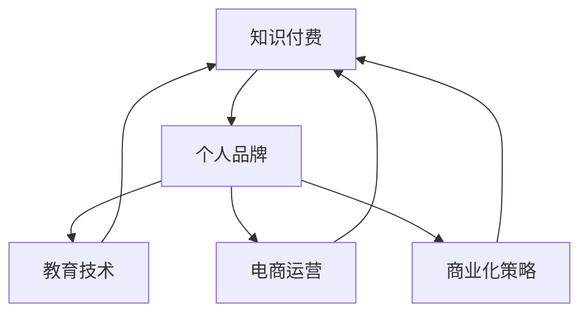

                 

# 如何打造个人知识付费商业帝国

> 关键词：知识付费, 个人品牌, 教育技术, 电商运营, 商业化策略

## 1. 背景介绍

### 1.1 问题由来

在数字经济蓬勃发展的今天，知识付费成为个人品牌打造与商业变现的重要途径。凭借高质量的内容输出、精准的目标受众定位和高效的商业运营策略，知识付费平台如得到、知乎live、小鹅通等获得了巨大的市场成功。然而，成功的知识付费商业帝国的构建绝非易事，它需要开发者对知识付费的全流程有深刻的理解，从内容策划、用户运营到商业变现的各个环节进行全面的系统思考和优化。本文将系统性地探讨如何通过打造个人知识付费商业帝国，实现知识变现与品牌价值双提升。

### 1.2 问题核心关键点

构建个人知识付费商业帝国的核心关键点包括以下几个方面：

- **内容质量**：内容是知识付费的基石。高质量、有深度、有价值的内容才能吸引用户并转化为付费用户。
- **用户定位**：明确目标用户群体，了解他们的需求和痛点，并据此进行内容生产。
- **运营策略**：构建高效的运营策略，实现内容的精准推送、互动维护和用户转化。
- **商业变现**：通过多元化的变现模式，实现知识变现，如课程销售、会员制、广告分成等。
- **品牌建设**：打造独特的个人品牌，增强用户粘性和忠诚度。

通过深入研究这些问题，本文将为开发者提供一套完整的个人知识付费商业帝国构建指南。

## 2. 核心概念与联系

### 2.1 核心概念概述

为更好地理解个人知识付费商业帝国的构建，本节将介绍几个密切相关的核心概念：

- **知识付费**：指通过互联网平台，以付费方式向用户提供专业知识、经验、技能等形式的商业行为。
- **个人品牌**：指个人在特定领域内建立的知名度、影响力、权威性等综合形象，通常基于个人的专业知识和独特视角。
- **教育技术**：指利用信息技术手段，提升教育过程的效率和质量，涵盖在线课程、互动学习平台、智能导师等形式。
- **电商运营**：指通过有效的市场推广、用户运营、转化策略等手段，实现商品或服务的销售转化，提升商业效率和收益。
- **商业化策略**：指将产品或服务商业化的策略与规划，涵盖定价策略、营销策略、客户关系管理等。

这些核心概念之间的逻辑关系可以通过以下Mermaid流程图来展示：



这个流程图展示了一个个人知识付费商业帝国的核心概念及其之间的关系：

1. 知识付费平台通过高质量的内容吸引用户。
2. 个人品牌提升内容的可信度和吸引力，增强用户粘性。
3. 教育技术手段提升学习效率，增强用户转化率。
4. 电商运营策略优化销售和用户体验，实现商业变现。
5. 商业化策略指导整体运营，提升商业效率和盈利能力。

## 3. 核心算法原理 & 具体操作步骤

### 3.1 算法原理概述

个人知识付费商业帝国的构建，本质上是一个多因素、多目标的复杂优化问题。其核心算法原理包括以下几个方面：

- **用户需求分析**：通过市场调研和用户反馈，分析目标用户的需求和偏好。
- **内容规划与生产**：基于用户需求，规划内容主题、形式和更新频率。
- **运营策略设计**：设计有效的用户运营策略，如社区互动、课程推广、会员权益等。
- **商业变现模式**：选择适合的知识付费变现模式，并设计相应的营销策略。
- **品牌建设与传播**：构建个人品牌，并通过多渠道传播增强品牌影响力。

### 3.2 算法步骤详解

基于上述算法原理，个人知识付费商业帝国的构建步骤如下：

**Step 1: 市场调研与需求分析**
- 使用问卷调查、用户访谈等方式，收集目标用户群体的需求和痛点。
- 分析市场趋势和竞争态势，确定内容的差异化定位。
- 根据需求分析结果，制定内容主题和形式规划。

**Step 2: 内容策划与生产**
- 组建专业的内容团队，负责内容的策划、撰写、审核等工作。
- 确定内容的更新频率和发布渠道，确保内容的时效性和覆盖面。
- 引入先进的教育技术手段，如互动式教学、智能推荐等，提升用户体验。

**Step 3: 运营策略设计与实施**
- 设计多渠道用户运营策略，如社交媒体推广、邮件营销、社区互动等。
- 实施精准的用户画像分析，实现内容的个性化推荐和推送。
- 构建会员制等用户忠诚计划，提升用户粘性和转化率。

**Step 4: 商业变现模式选择与设计**
- 评估不同的商业变现模式，如课程销售、会员制、广告分成等。
- 设计多渠道的营销策略，实现流量引入和用户转化。
- 实施精准的定价策略，确保合理的收益和用户体验。

**Step 5: 品牌建设与传播**
- 确定品牌调性和定位，构建独特的个人品牌形象。
- 通过多渠道传播手段，如博客、社交媒体、视频平台等，增强品牌影响力。
- 建立社区和互动机制，增强用户粘性和品牌忠诚度。

### 3.3 算法优缺点

构建个人知识付费商业帝国的方法具有以下优点：
1. 高效利用知识资源。高质量的内容产出能够吸引大量用户，实现知识变现。
2. 多渠道变现。通过多元化变现模式，提升商业收益和用户价值。
3. 品牌建设强化。独特品牌形象能够增强用户粘性和忠诚度。
4. 用户精准运营。精准的运营策略能够实现高效的用户转化和流失率控制。

同时，该方法也存在一定的局限性：
1. 内容创作成本高。高质量内容需要投入大量人力和时间成本。
2. 市场竞争激烈。知识付费市场竞争激烈，需持续创新和优化才能保持竞争力。
3. 用户获取难度大。获取精准用户需花费大量时间和精力。
4. 品牌建设周期长。需要长期的积累和维护才能建立和提升品牌影响力。

尽管存在这些局限性，但就目前而言，通过高质量内容输出、精准用户运营和品牌建设相结合的方式，是构建个人知识付费商业帝国的最主流范式。未来相关研究的重点在于如何进一步降低内容创作成本，提高品牌建设效率，同时兼顾用户粘性和商业收益。

### 3.4 算法应用领域

个人知识付费商业帝国构建的方法，已经在知识付费、教育技术、电商运营等多个领域得到了广泛应用，以下是几个典型应用场景：

- **在线课程**：知识付费平台如得到、好未来等，通过销售在线课程，实现知识变现。
- **专业咨询**：如心理咨询、财务咨询等，通过提供一对一的专业咨询服务，实现知识变现。
- **教育平台**：如网易云课堂、慕课网等，通过提供各类课程和培训服务，实现教育技术变现。
- **个性化教育**：如Knewton、Squirrel AI等，通过AI技术实现个性化教育，提升教育效果和转化率。
- **社交电商**：如微商、社群电商等，通过社群运营和社交互动，实现商品销售和知识变现。

## 4. 数学模型和公式 & 详细讲解 & 举例说明

### 4.1 数学模型构建

本节将使用数学语言对个人知识付费商业帝国的构建过程进行更加严格的刻画。

假设平台的目标是最大化商业收益，设定收益函数为 $R$，用户总人数为 $N$，内容的质量为 $Q$，运营策略的效果为 $E$，商业化策略的效率为 $S$。则收益函数可以表示为：

$$
R = f(Q, E, S)
$$

其中，内容质量 $Q$ 可以通过用户满意度、内容深度等指标来衡量；运营策略效果 $E$ 可以通过用户留存率、转化率等指标来衡量；商业化策略效率 $S$ 可以通过课程销售量、会员续费率等指标来衡量。

### 4.2 公式推导过程

为了最大化收益 $R$，需要综合考虑上述因素的影响。我们定义目标函数为：

$$
\max R = f(Q, E, S)
$$

约束条件为：

$$
\begin{cases}
Q \geq 0 \\
E \geq 0 \\
S \geq 0 \\
\end{cases}
$$

即内容质量、运营策略效果和商业化策略效率均应大于等于0。

基于上述目标函数和约束条件，我们可以使用优化算法求解最大化收益 $R$ 的策略组合。常用的优化算法包括线性规划、非线性规划、整数规划等。

### 4.3 案例分析与讲解

以下以在线课程为例，给出收益最大化的案例分析：

假设某在线课程平台的收益函数为：

$$
R = Q \times E \times S
$$

其中，内容质量 $Q$ 为课程评分；运营策略效果 $E$ 为课程推广效果；商业化策略效率 $S$ 为课程销售量。

设课程评分 $Q=4.5$，课程推广效果 $E=0.8$，课程销售量 $S=1000$，则平台收益为：

$$
R = 4.5 \times 0.8 \times 1000 = 3600
$$

如果我们将课程评分提升至 $Q=4.8$，课程推广效果提升至 $E=0.9$，课程销售量提升至 $S=1500$，则平台收益提升为：

$$
R = 4.8 \times 0.9 \times 1500 = 6480
$$

由此可见，通过提升内容质量、运营策略效果和商业化策略效率，可以有效提升平台收益。

## 5. 项目实践：代码实例和详细解释说明

### 5.1 开发环境搭建

在进行知识付费商业帝国的构建实践前，我们需要准备好开发环境。以下是使用Python进行Flask开发的环境配置流程：

1. 安装Python：从官网下载并安装Python，选择3.x版本。
2. 安装Flask：使用pip命令安装Flask框架，命令如下：
   ```bash
   pip install Flask
   ```
3. 安装相关库：安装Flask相关的扩展库，如WTForms、Flask-RESTful等，命令如下：
   ```bash
   pip install Flask-WTF Flask-RESTful
   ```
4. 创建虚拟环境：使用venv命令创建虚拟环境，命令如下：
   ```bash
   python -m venv myenv
   source myenv/bin/activate
   ```
5. 安装项目依赖：使用requirements.txt文件安装项目所需的所有依赖包，命令如下：
   ```bash
   pip install -r requirements.txt
   ```

完成上述步骤后，即可在myenv环境中开始知识付费商业帝国的构建实践。

### 5.2 源代码详细实现

下面我们以在线课程为例，给出使用Flask构建知识付费平台的核心代码实现。

首先，定义Flask应用：

```python
from flask import Flask, render_template, request, jsonify
from flask_sqlalchemy import SQLAlchemy
from flask_login import LoginManager, login_user, logout_user, login_required, current_user

app = Flask(__name__)
app.config['SQLALCHEMY_DATABASE_URI'] = 'sqlite:///courses.db'
app.config['SECRET_KEY'] = 'secret_key'

db = SQLAlchemy(app)
login_manager = LoginManager(app)

@login_manager.user_loader
def load_user(user_id):
    return User.query.get(int(user_id))

@app.route('/')
def index():
    courses = Course.query.all()
    return render_template('index.html', courses=courses)

@app.route('/login', methods=['GET', 'POST'])
def login():
    if request.method == 'POST':
        username = request.form['username']
        password = request.form['password']
        user = User.query.filter_by(username=username).first()
        if user and user.check_password(password):
            login_user(user)
            return redirect('/')
        else:
            return render_template('login.html', error='Invalid credentials')
    else:
        return render_template('login.html')
```

然后，定义用户、课程等数据模型：

```python
class User(db.Model):
    id = db.Column(db.Integer, primary_key=True)
    username = db.Column(db.String(64), unique=True)
    password_hash = db.Column(db.String(128))

    def set_password(self, password):
        self.password_hash = generate_password_hash(password)

    def check_password(self, password):
        return check_password_hash(self.password_hash, password)

class Course(db.Model):
    id = db.Column(db.Integer, primary_key=True)
    title = db.Column(db.String(128))
    description = db.Column(db.Text)
    price = db.Column(db.Float)
    instructor = db.Column(db.String(64))
    published_at = db.Column(db.DateTime)

    def __repr__(self):
        return f'<Course {self.title}>'
```

最后，定义课程注册、购买等页面：

```python
@app.route('/course/register', methods=['GET', 'POST'])
@login_required
def course_register():
    if request.method == 'POST':
        title = request.form['title']
        description = request.form['description']
        price = float(request.form['price'])
        instructor = request.form['instructor']
        published_at = datetime.datetime.now()
        course = Course(title=title, description=description, price=price, instructor=instructor, published_at=published_at)
        db.session.add(course)
        db.session.commit()
        return redirect('/')
    else:
        return render_template('course_register.html')

@app.route('/course/purchase', methods=['GET', 'POST'])
@login_required
def course_purchase():
    if request.method == 'POST':
        course_id = request.form['course_id']
        course = Course.query.get(course_id)
        if course:
            current_user.purchased_courses.append(course)
            db.session.commit()
            return redirect('/')
        else:
            return render_template('course_purchase.html', error='Course not found')
    else:
        courses = current_user.purchased_courses
        return render_template('course_purchase.html', courses=courses)
```

以上代码实现了知识付费平台的基本功能，包括用户登录、课程注册和购买等。开发者可以根据实际需求，进一步扩展平台的功能，如用户管理、订单管理、课程评价等。

### 5.3 代码解读与分析

让我们再详细解读一下关键代码的实现细节：

**Flask应用**：
- 通过Flask框架创建应用实例，并设置数据库连接、密钥等参数。
- 定义SQLAlchemy模型和用户认证管理器，用于管理用户和课程数据，并提供用户登录功能。

**用户模型**：
- 使用SQLAlchemy定义用户模型，包含用户名、密码哈希值等字段。
- 实现密码加密和验证功能，确保用户密码的安全性。

**课程模型**：
- 定义课程模型，包含课程标题、描述、价格、讲师等字段。
- 定义课程注册和购买逻辑，将购买记录存储在用户模型中。

**用户登录和注册页面**：
- 实现用户登录和注册页面，包含表单验证和错误处理。
- 使用Flask-Login扩展库，实现用户认证和授权。

**课程注册和购买页面**：
- 实现课程注册页面，包含课程信息输入和验证。
- 实现课程购买页面，展示用户已购课程列表。

**代码优化**：
- 使用Flask的路由装饰器和模板引擎，简化代码实现。
- 使用SQLAlchemy的数据库操作，提高数据访问的效率和安全性。
- 使用Flask-Login扩展库，简化用户认证和授权过程。

## 6. 实际应用场景

### 6.1 在线教育平台

在线教育平台如Coursera、edX等，通过销售在线课程和证书，实现知识变现。平台通常提供多种课程形式，如视频讲座、互动练习、作业批改等，提升学习效果和用户满意度。通过精准的用户运营策略和商业化策略，平台能够实现课程的快速推广和销售，提升用户转化率和平台收益。

### 6.2 专业咨询平台

专业咨询平台如咨询中国、智联招聘等，通过提供一对一的专业咨询服务，实现知识变现。平台通常根据用户需求，提供法律咨询、财务咨询、心理咨询等服务。通过高效的运营策略和精准的营销推广，平台能够吸引大量用户，实现高收益。

### 6.3 在线写作平台

在线写作平台如知乎、简书等，通过提供专业文章和知识分享，实现知识变现。平台通常根据用户贡献的文章质量和阅读量，进行收入分成和奖励。通过有效的用户运营和内容推荐机制，平台能够提升用户粘性和转化率，实现高收益。

### 6.4 未来应用展望

随着技术的不断发展，未来知识付费商业帝国的应用场景将更加广泛，涵盖更多领域和行业。以下列举几个未来应用方向：

- **医疗健康**：通过在线健康咨询和远程医疗服务，实现健康知识的普及和变现。
- **金融投资**：通过金融课程和投资咨询，实现金融知识的普及和变现。
- **创业指导**：通过创业课程和咨询服务，实现创业知识的普及和变现。
- **文化教育**：通过在线课程和电子书销售，实现文化知识的普及和变现。
- **技术研发**：通过技术教程和开源项目支持，实现技术知识的普及和变现。

## 7. 工具和资源推荐

### 7.1 学习资源推荐

为了帮助开发者系统掌握知识付费商业帝国的构建方法，这里推荐一些优质的学习资源：

1. **《知识付费商业模式》系列博文**：由知名知识付费平台运营专家撰写，深入浅出地介绍了知识付费商业模式的核心要素和运营策略。
2. **《教育技术导论》课程**：多所高校和研究机构联合开设的教育技术在线课程，涵盖教育技术的基本概念和前沿技术。
3. **《电商运营实战》书籍**：电商平台运营专家所著，全面介绍了电商运营的各个环节和实战技巧。
4. **《商业模式画布》书籍**：商业模式设计专家所著，系统讲解了如何通过商业模式画布设计，优化商业模型和提升盈利能力。
5. **Coursera、edX等在线课程平台**：提供大量的课程和学习资源，涵盖知识付费、教育技术、电商运营等多个领域。

通过对这些资源的学习实践，相信你一定能够快速掌握知识付费商业帝国的构建精髓，并用于解决实际的商业问题。

### 7.2 开发工具推荐

高效的开发离不开优秀的工具支持。以下是几款用于知识付费商业帝国构建开发的常用工具：

1. **Flask框架**：轻量级的Python Web框架，易于上手和使用，适合快速开发和迭代。
2. **SQLAlchemy**：Python的ORM库，提供高效的数据库操作接口，支持多种数据库。
3. **Flask-Login**：用户认证扩展库，简化用户登录和授权过程。
4. **WTForms**：表单验证库，提供丰富的表单字段和验证功能。
5. **Flask-RESTful**：RESTful API开发扩展库，简化API开发和测试过程。

合理利用这些工具，可以显著提升知识付费商业帝国的开发效率，加快创新迭代的步伐。

### 7.3 相关论文推荐

知识付费商业帝国的构建源于学界的持续研究。以下是几篇奠基性的相关论文，推荐阅读：

1. **《在线教育平台用户行为分析》**：研究在线教育平台用户行为和转化策略，提出基于用户画像的个性化推荐方法。
2. **《知识付费平台用户运营策略》**：分析知识付费平台用户运营的策略和效果，提出用户互动和社区管理的最佳实践。
3. **《电商运营数据分析与优化》**：研究电商平台的运营数据分析和优化方法，提出流量引入和用户转化的数据驱动策略。
4. **《商业化策略设计》**：分析不同行业和领域的商业化策略，提出适合的知识付费商业模型。
5. **《个人品牌建设与传播》**：研究个人品牌建设和传播的方法和工具，提出打造个人品牌影响力的策略。

这些论文代表了大规模知识付费商业帝国的构建路径和发展方向，为开发者提供了宝贵的理论基础和实践指导。

## 8. 总结：未来发展趋势与挑战

### 8.1 研究成果总结

本文对知识付费商业帝国的构建方法进行了全面系统的介绍。首先阐述了知识付费的重要性及其在个人品牌建设与商业变现中的关键作用，明确了内容质量、用户定位、运营策略、商业变现和品牌建设等关键要素。其次，从算法原理到具体操作步骤，详细讲解了知识付费商业帝国的构建流程和方法。通过系统性地介绍知识付费商业帝国的构建方法，本文旨在为开发者提供一套完整的构建指南。

通过本文的系统梳理，可以看到，通过高质量内容输出、精准用户运营和品牌建设相结合的方式，是构建知识付费商业帝国的最主流范式。这些方法不仅能够提升内容质量和用户体验，还能实现商业变现和品牌价值双提升。

### 8.2 未来发展趋势

展望未来，知识付费商业帝国将呈现以下几个发展趋势：

1. **技术创新加速**：人工智能、大数据、区块链等新兴技术的不断进步，将为知识付费平台提供更多创新应用场景和工具。
2. **内容多样化**：知识付费内容将更加多样化，涵盖视频、音频、互动式课程等多种形式，满足用户多样化需求。
3. **运营策略精细化**：通过大数据和AI技术，实现更加精准的用户画像和运营策略，提升用户转化率和留存率。
4. **商业变现多元化**：除了课程销售和会员制，还将探索更多元化的变现模式，如众筹、广告分成等。
5. **品牌建设全球化**：通过全球化布局和跨文化推广，构建国际化的个人品牌，提升全球用户粘性。

这些趋势凸显了知识付费商业帝国的广阔前景。技术创新、内容多样化、运营精细化和商业多元化，将是未来知识付费商业帝国构建的重要方向。

### 8.3 面临的挑战

尽管知识付费商业帝国的构建已经取得了显著成就，但在迈向更加智能化、全球化应用的过程中，它仍面临着诸多挑战：

1. **内容创作成本高**：高质量内容需要投入大量人力和时间成本，如何降低创作成本将是重要研究方向。
2. **市场竞争激烈**：知识付费市场竞争激烈，需持续创新和优化才能保持竞争力。
3. **用户获取难度大**：获取精准用户需花费大量时间和精力，如何提高用户获取效率将是重要研究方向。
4. **品牌建设周期长**：品牌建设需要长期的积累和维护，如何缩短品牌建设周期将是重要研究方向。
5. **用户留存率低**：用户留存率低是知识付费平台面临的普遍问题，如何提升用户留存率将是重要研究方向。

尽管存在这些挑战，但通过技术创新、内容多样化、运营精细化和商业多元化相结合的方式，知识付费商业帝国必将在未来实现更大的发展。

### 8.4 研究展望

面对知识付费商业帝国所面临的种种挑战，未来的研究需要在以下几个方面寻求新的突破：

1. **内容自动化创作**：通过自然语言处理和生成技术，实现内容自动化创作，降低内容创作成本。
2. **多渠道内容分发**：通过社交媒体、视频平台等多渠道分发内容，提升内容的传播效率和覆盖面。
3. **智能化运营策略**：利用AI和大数据技术，实现更加精准的用户运营和个性化推荐。
4. **全球化品牌建设**：通过多语言支持和国际化推广，构建全球化的个人品牌形象。
5. **区块链技术应用**：探索区块链技术在知识付费中的应用，实现内容版权保护和透明交易。

这些研究方向的探索，必将引领知识付费商业帝国构建技术迈向更高的台阶，为构建知识付费生态系统提供新的解决方案。面向未来，知识付费商业帝国需要与其他新技术和新模式进行更深入的融合，共同推动知识经济的发展和繁荣。

## 9. 附录：常见问题与解答

**Q1：知识付费平台如何实现用户留存率提升？**

A: 提升用户留存率是知识付费平台的核心目标之一，以下是一些有效的策略：
1. **内容质量**：高质量、有深度、有价值的内容能够提升用户粘性和留存率。
2. **用户互动**：构建社区和互动机制，增强用户之间的交流和互动。
3. **个性化推荐**：根据用户行为和偏好，实现个性化内容推荐，提升用户满意度和留存率。
4. **用户激励**：通过会员制、积分奖励、课程免费试听等方式，激励用户持续消费。
5. **数据驱动运营**：利用大数据和AI技术，实现精准的用户画像和运营策略，提升用户留存率。

通过这些策略的综合应用，可以有效地提升知识付费平台的用户留存率。

**Q2：知识付费平台如何选择适合的变现模式？**

A: 知识付费平台应根据自身的商业模式和用户需求，选择适合的变现模式。以下是几种常见的变现模式：
1. **课程销售**：通过销售在线课程，实现知识变现。
2. **会员制**：通过提供会员服务，如课程优先访问、专属咨询等，提升用户粘性和付费意愿。
3. **广告分成**：通过广告分成，实现平台盈利。
4. **众筹**：通过众筹平台，筹集课程开发资金。
5. **订阅服务**：通过订阅服务，实现持续收入。

选择适合的变现模式，需要综合考虑平台定位、用户需求、课程质量等多个因素，并进行详细的市场调研和商业分析。

**Q3：知识付费平台如何进行精准的用户运营？**

A: 精准的用户运营是知识付费平台成功的关键，以下是一些有效的策略：
1. **用户画像分析**：通过用户行为数据分析，构建详细的用户画像，了解用户需求和痛点。
2. **个性化推荐**：根据用户画像和行为数据，实现个性化内容推荐，提升用户满意度。
3. **社区互动**：构建社区和互动机制，增强用户之间的交流和互动。
4. **用户反馈机制**：通过用户反馈机制，及时了解用户需求和意见，优化内容和运营策略。
5. **数据驱动运营**：利用大数据和AI技术，实现精准的用户运营和个性化推荐。

通过这些策略的综合应用，可以有效地提升知识付费平台的用户运营效率和效果。

**Q4：知识付费平台如何进行品牌建设？**

A: 品牌建设是知识付费平台成功的关键之一，以下是一些有效的策略：
1. **内容质量**：高质量、有深度、有价值的内容是品牌建设的基石。
2. **用户口碑**：通过优质内容和良好用户体验，提升用户口碑和品牌影响力。
3. **社交媒体推广**：通过社交媒体平台推广品牌，提升品牌知名度和影响力。
4. **品牌合作**：与其他品牌合作，共同推广品牌，扩大品牌影响力。
5. **内容创新**：通过内容创新和多样化，保持品牌活力和竞争力。

通过这些策略的综合应用，可以有效地提升知识付费平台品牌建设的效果和效果。

---

作者：禅与计算机程序设计艺术 / Zen and the Art of Computer Programming

