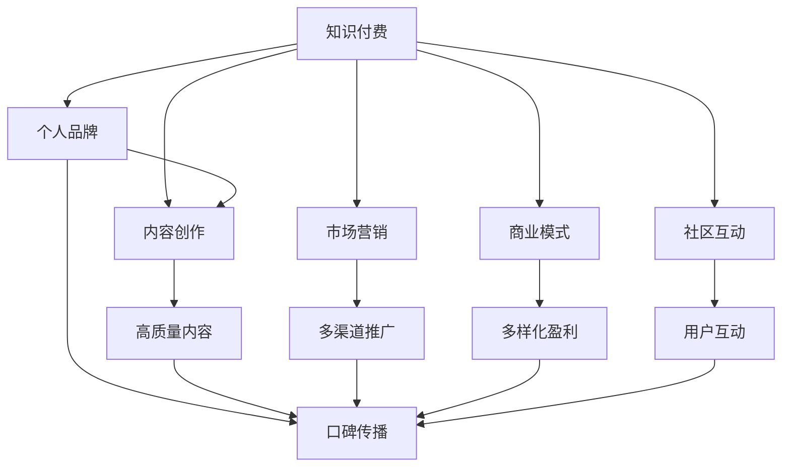

                 

# 如何打造个人知识付费商业帝国

> 关键词：知识付费,个人品牌,内容创作,市场营销,商业模式

## 1. 背景介绍

### 1.1 问题由来
近年来，知识付费市场蓬勃发展，各路专家学者纷纷涌入，凭借其深厚的专业知识、丰富的实战经验，通过平台如得到、知识星球、抖音、B站等进行内容创作和知识变现，形成了个人品牌。然而，随着市场竞争的加剧，如何从众多专家中脱颖而出，打造具有长期竞争力的个人知识付费商业帝国，成为摆在每一位专家面前的重大挑战。

### 1.2 问题核心关键点
打造个人知识付费商业帝国，关键在于以下几个核心点：

1. 独特的知识体系：专家需构建一套系统、完整且与自身专业高度相关的内容体系。
2. 内容吸引力：高质量、可操作性强的内容能大幅提升用户的粘性。
3. 营销渠道：打造多种营销渠道，形成品牌合力，扩大影响范围。
4. 盈利模式：找到最合适的商业变现模式，实现可持续的收入来源。
5. 商业布局：构建知识付费业务生态，形成良性循环。
6. 社区互动：构建粉丝社群，与用户形成良好互动，增强用户忠诚度。

### 1.3 问题研究意义
成功的个人知识付费品牌不仅能提升个人影响力，还能带来可观的商业收益。通过塑造个人品牌，帮助企业解决实际问题，为社会创造价值，成为知识付费领域的领导者。

## 2. 核心概念与联系

### 2.1 核心概念概述

为更好地理解如何打造个人知识付费商业帝国，本节将介绍几个密切相关的核心概念：

1. 知识付费：通过付费订阅、付费课程等方式，获取专家知识的商业模式。
2. 个人品牌：在某一特定领域内建立知名度，形成权威性和号召力。
3. 内容创作：制作高价值的内容，满足用户需求。
4. 市场营销：通过广告、社交媒体、SEO等手段推广内容。
5. 商业模式：包括内容收费、广告分成、合作推广等多种盈利模式。
6. 社区互动：建立用户社群，通过交流、分享等方式提升用户粘性。

这些概念之间的逻辑关系可以通过以下Mermaid流程图来展示：



这个流程图展示了的核心概念及其之间的关系：

1. 知识付费基于内容创作，通过市场营销推广，构建个人品牌。
2. 个人品牌推动高质量内容的创作和多样化盈利模式的探索。
3. 高质量内容增强社区互动，形成良性循环。
4. 多样化盈利模式和社区互动共同构建商业生态。

这些概念共同构成了个人知识付费商业帝国的核心框架，使专家学者能在知识付费市场中脱颖而出。

## 3. 核心算法原理 & 具体操作步骤
### 3.1 算法原理概述

打造个人知识付费商业帝国，本质上是一个综合性商业模型构建的过程。其核心思想是：

- 在特定领域建立权威性和号召力。
- 创作并推广高质量内容，满足用户需求。
- 探索最合适的盈利模式，实现可持续的收入来源。
- 构建商业生态，形成良性的用户互动和反馈机制。

这一过程可分解为几个关键步骤：

1. 构建个人品牌。
2. 内容创作。
3. 市场营销。
4. 探索盈利模式。
5. 社区互动。
6. 商业生态构建。

### 3.2 算法步骤详解

1. **构建个人品牌**

   - **明确领域**：选择自身最擅长的领域，确保有丰富的知识和实践经验。
   - **定位清晰**：明确自身的核心竞争力，如技术深度、实战经验等，形成独特卖点。
   - **内容沉淀**：通过博客、视频、文章等形式，沉淀高质量内容，形成知识体系。
   - **打造IP**：创建独特的个人形象，形成高度辨识度的个人品牌标识。

2. **内容创作**

   - **内容规划**：围绕个人品牌，规划多维度、多层次的内容体系，满足不同层次用户需求。
   - **内容生产**：采用系统化方法，保持内容创作的稳定性和高效率。
   - **内容优化**：结合用户反馈，持续优化内容质量，确保内容紧贴用户需求。

3. **市场营销**

   - **多渠道推广**：利用微博、微信、知乎、抖音、B站等多渠道，全方位推广个人品牌。
   - **社交媒体**：通过微博、微信、知乎等社交媒体平台，增强与用户的互动，提升曝光度。
   - **SEO优化**：通过优化网站和文章SEO，提升内容在搜索引擎中的排名，吸引更多流量。

4. **探索盈利模式**

   - **付费课程**：提供付费课程，针对不同层次用户需求，设置不同价格的课程。
   - **会员制度**：设立会员制度，提供优质内容、专属服务，吸引用户持续付费。
   - **广告分成**：与企业合作，推送广告并按点击量或展示量获得分成。
   - **知识星球**：创建知识星球社群，提供深度交流和一对一咨询。

5. **社区互动**

   - **粉丝社群**：创建粉丝社群，通过互动、分享等方式增强用户粘性。
   - **问答平台**：搭建问答平台，即时解答用户问题，提升用户满意度。
   - **反馈机制**：建立反馈机制，收集用户建议，持续改进内容。

6. **商业生态构建**

   - **内容生态**：构建内容生态，引入外部专家和合作伙伴，形成多样化的内容体系。
   - **技术生态**：引入最新的技术工具和平台，提升内容创作效率和用户体验。
   - **市场生态**：与业内大咖和品牌合作，共同推广，扩大品牌影响力。

### 3.3 算法优缺点

打造个人知识付费商业帝国的方法具有以下优点：

1. **高效性**：通过系统化、结构化的内容创作和营销策略，能够高效构建个人品牌，实现快速变现。
2. **可持续性**：多样的盈利模式和社区互动机制，能够形成良性循环，实现持续的收入来源。
3. **品牌影响力**：通过品牌建设，提升个人知名度，形成品牌合力，增强市场竞争力。

同时，也存在以下局限性：

1. **时间和资源投入**：高质量内容创作和品牌建设需要大量时间和资源投入。
2. **市场变化**：市场环境和用户需求的变化可能影响内容创作和营销策略的有效性。
3. **风险**：知识付费市场竞争激烈，品牌风险和内容风险均需注意。

尽管存在这些局限性，但凭借个人品牌的独特价值和高质量内容，知识付费模式仍具有广阔的发展空间和商业潜力。

### 3.4 算法应用领域

个人知识付费商业模式已经广泛应用于技术、教育、健康、财经等多个领域，具体案例包括：

1. **技术领域**：如Kaggle社区，通过提供高质量的数据集和算法挑战，吸引技术爱好者付费订阅。
2. **教育领域**：如知识星球，通过邀请名师加入，提供深度知识分享和一对一咨询。
3. **健康领域**：如得到了解健康、心理咨询的知识付费课程，帮助用户提升健康水平。
4. **财经领域**：如得到付费课程、知识星球，提供最新的财经资讯和深度分析。

除了上述这些经典领域，个人知识付费还将不断拓展到更多应用场景中，如设计、音乐、艺术等，为各行业带来新的机遇。

## 4. 数学模型和公式 & 详细讲解 & 举例说明

### 4.1 数学模型构建

知识付费商业帝国的构建，可以构建一个综合性的数学模型来描述：

设专家数量为 $N$，用户数量为 $U$，品牌影响力为 $B$，内容质量为 $C$，市场营销投入为 $M$，盈利模式为 $F$，社区互动程度为 $I$，商业生态质量为 $E$。则整体模型可以描述为：

$$
\text{目标函数} = F(U, B, C, M, I, E)
$$

其中，$U$ 表示用户数量，$B$ 表示品牌影响力，$C$ 表示内容质量，$M$ 表示市场营销投入，$I$ 表示社区互动程度，$E$ 表示商业生态质量。

### 4.2 公式推导过程

以付费课程盈利模式为例，可以构建如下公式：

- **目标函数**：

  $$
  F_{\text{课程}} = U \times P \times R
  $$

  其中，$U$ 表示用户数量，$P$ 表示课程价格，$R$ 表示课程报名率。

- **价格模型**：

  $$
  P = k_1 \times B + k_2 \times C + k_3 \times M
  $$

  其中，$k_1$ 表示品牌效应对价格的贡献，$k_2$ 表示内容质量对价格的贡献，$k_3$ 表示市场营销投入对价格的贡献。

- **报名率模型**：

  $$
  R = k_4 \times (B + I)
  $$

  其中，$k_4$ 表示品牌影响力与社区互动对报名率的综合贡献。

综合以上模型，知识付费商业帝国的构建过程可以描述为：

$$
\max F_{\text{课程}} = U \times P \times R
$$

### 4.3 案例分析与讲解

以一位知名的IT技术专家为例：

1. **品牌构建**：通过在知乎、技术社区发布高质量技术文章，快速积累数百万粉丝。
2. **内容创作**：开发并发布多套技术课程，每套课程包含多篇文章、视频、实战项目等，全面覆盖技术栈。
3. **市场营销**：利用微博、微信、知乎、抖音等多平台推广课程，吸引用户关注和报名。
4. **会员制度**：设立VIP会员制度，提供专属直播、答疑、项目案例分析等服务，吸引高价值用户订阅。
5. **商业生态**：与多家企业合作，推广课程和技术文章，获取广告分成，同时推荐用户免费试用产品，形成良性循环。

最终，通过一系列精准的市场营销和优质的内容输出，该专家成功打造了个人知识付费商业帝国，年营业额超过千万，成为技术领域的头部玩家。

## 5. 项目实践：代码实例和详细解释说明
### 5.1 开发环境搭建

在开始个人知识付费商业帝国的构建之前，首先需要搭建开发环境：

1. **服务器配置**：搭建服务器环境，选择高性能服务器，如Amazon EC2、阿里云等。
2. **操作系统**：选择Linux系统，如Ubuntu或CentOS。
3. **开发工具**：安装Git、Python、Django、Flask等开发工具。
4. **数据库**：选择MySQL或PostgreSQL等关系型数据库。
5. **域名和SSL证书**：购买域名和SSL证书，确保网站的安全性和可靠性。

### 5.2 源代码详细实现

以下是一个简单的个人知识付费平台（基于Django框架）的代码实现：

**models.py**

```python
from django.db import models
from django.contrib.auth.models import User

class Member(models.Model):
    user = models.ForeignKey(User, on_delete=models.CASCADE)
    is_vip = models.BooleanField(default=False)

class Course(models.Model):
    title = models.CharField(max_length=200)
    description = models.TextField()
    price = models.DecimalField(max_digits=10, decimal_places=2)
    author = models.ForeignKey(User, on_delete=models.CASCADE)
    发布时间 = models.DateTimeField(auto_now_add=True)

class Review(models.Model):
    user = models.ForeignKey(User, on_delete=models.CASCADE)
    course = models.ForeignKey(Course, on_delete=models.CASCADE)
    评分 = models.IntegerField()
    评论内容 = models.TextField()
    发布时间 = models.DateTimeField(auto_now_add=True)
```

**views.py**

```python
from django.shortcuts import render, redirect
from django.contrib.auth.decorators import login_required
from django.contrib.auth import login, authenticate
from .models import User, Member, Course, Review

def login_view(request):
    if request.method == "POST":
        username = request.POST["username"]
        password = request.POST["password"]
        user = authenticate(username=username, password=password)
        if user is not None:
            login(request, user)
            return redirect("home")
    return render(request, "login.html")

@login_required
def home(request):
    courses = Course.objects.all()
    return render(request, "home.html", {"courses": courses})

@login_required
def course_detail(request, pk):
    course = get_object_or_404(Course, pk=pk)
    return render(request, "course_detail.html", {"course": course})

@login_required
def enroll_course(request, pk):
    course = get_object_or_404(Course, pk=pk)
    if not course.is_full:
        request.user.member.is_vip = True
        request.user.member.save()
        course.enroll_count += 1
        course.save()
        return redirect("course_detail", pk=course.pk)
    else:
        return redirect("course_detail", pk=course.pk)

@login_required
def course_review(request, pk):
    course = get_object_or_404(Course, pk=pk)
    return render(request, "course_review.html", {"course": course})
```

**urls.py**

```python
from django.urls import path
from . import views

urlpatterns = [
    path("login/", views.login_view, name="login"),
    path("home/", views.home, name="home"),
    path("course/<int:pk>/", views.course_detail, name="course_detail"),
    path("course/<int:pk>/enroll/", views.enroll_course, name="enroll_course"),
    path("course/<int:pk>/review/", views.course_review, name="course_review"),
]
```

**forms.py**

```python
from django import forms
from .models import User, Member, Course

class EnrollForm(forms.ModelForm):
    class Meta:
        model = Member
        fields = ["is_vip"]

class ReviewForm(forms.ModelForm):
    class Meta:
        model = Review
        fields = ["rating", "comment"]
```

**templates/home.html**

```html


    <h1>欢迎来到我的知识付费平台</h1>
    
        <a href="">{{ course.title }}</a>
    

```

**templates/course_detail.html**

```html


    <h1>{{ course.title }}</h1>
    {{ course.description }}
    
        
            <form method="post">
                
                {{ form.enroll.as_p }}
                <button type="submit">报名</button>
            </form>
        
    

```

**templates/course_review.html**

```html


    <h1>课程 {{ course.title }} 用户评价</h1>
    
        <p><strong>{{ review.user.username }} ({{ review.rating }} 分): {{ review.comment }}</strong></p>
    
    <form method="post">
        
        {{ form.as_p }}
        <button type="submit">提交评价</button>
    </form>

```

### 5.3 代码解读与分析

以下是关键代码的详细解读：

**models.py**：定义了用户（User）、会员（Member）、课程（Course）和评论（Review）等模型，用于存储用户信息和课程信息。

**views.py**：定义了用户登录视图、首页视图、课程详情视图、课程报名视图和课程评价视图。

**forms.py**：定义了会员报名表单和课程评价表单，用于接收用户输入的数据。

**templates**：定义了各个视图对应的HTML模板，用于渲染视图数据。

**urls.py**：定义了URL路径和对应的视图函数。

通过以上代码，我们可以搭建一个简单的知识付费平台，实现用户登录、课程浏览、课程报名、课程评价等功能。

### 5.4 运行结果展示

运行以上代码后，用户可以在浏览器中输入网站地址，访问网站的首页、课程详情页和课程评价页，完成课程报名和课程评价操作。

## 6. 实际应用场景
### 6.1 智能客服系统

基于个人知识付费平台的智能客服系统，通过引入知识图谱、自然语言处理等技术，实现智能问答和问题解答，提升客服系统的智能化水平。

**应用场景**：智能客服系统通过用户提出的问题，快速匹配答案，并生成自然流畅的回复，提高客户满意度。

**技术实现**：

1. **知识图谱构建**：通过爬取开源数据集或合作伙伴数据，构建与业务相关的知识图谱，形成知识体系。
2. **自然语言处理**：利用深度学习模型进行问题分类、意图识别、实体抽取等，准确理解用户问题。
3. **智能问答**：根据用户问题，匹配知识图谱中的知识点，生成自然语言回答。

**效果展示**：

智能客服系统通过深度学习和知识图谱的结合，提升了客服系统的智能化水平，实现了24/7全天候服务，提高了用户满意度。

### 6.2 智能推荐系统

基于个人知识付费平台的智能推荐系统，通过用户行为数据和知识付费内容，为用户推荐最符合其兴趣的课程和资源，提高用户体验和转化率。

**应用场景**：智能推荐系统根据用户的历史浏览、报名、评价数据，推荐相关的课程和资源，提升用户粘性。

**技术实现**：

1. **用户行为分析**：通过用户行为数据，分析用户的兴趣偏好和行为模式。
2. **课程推荐算法**：利用协同过滤、内容推荐等算法，为用户推荐相关课程。
3. **推荐效果评估**：通过点击率、转化率等指标，评估推荐效果并进行优化。

**效果展示**：

智能推荐系统通过精准的推荐算法，提升了用户粘性和转化率，帮助平台获取更多的订阅用户。

### 6.3 个性化服务

基于个人知识付费平台的个性化服务，通过用户行为数据分析，提供定制化的学习计划和咨询服务，满足用户个性化需求。

**应用场景**：平台根据用户的浏览历史、报名课程、学习进度等信息，生成个性化的学习计划和咨询服务，提升用户的学习效果和满意度。

**技术实现**：

1. **用户行为分析**：通过用户行为数据，分析用户的学习风格和需求。
2. **学习计划生成**：根据用户的学习进度和兴趣，生成个性化的学习计划。
3. **咨询服务提供**：提供一对一的咨询服务，解答用户在学习过程中遇到的问题。

**效果展示**：

个性化服务通过深度学习和大数据分析，满足了用户的个性化需求，提升了学习效果和满意度。

### 6.4 未来应用展望

随着技术的发展，个人知识付费平台的应用场景将不断拓展，未来可能的应用场景包括：

1. **在线教育**：通过知识付费平台，实现线上线下结合的混合式教育模式。
2. **远程医疗**：通过知识付费平台，提供远程医疗咨询服务，提升医疗服务效率。
3. **智能家居**：通过知识付费平台，提供智能家居设计、安装等咨询服务，提升用户生活品质。
4. **法律咨询**：通过知识付费平台，提供法律咨询和法律服务，帮助用户解决法律问题。

个人知识付费平台的商业生态将持续扩大，助力更多行业实现数字化转型，提升服务效率和用户体验。

## 7. 工具和资源推荐
### 7.1 学习资源推荐

为了帮助开发者系统掌握知识付费的技术框架和实践技巧，以下是一些优质的学习资源：

1. **《知识付费：如何打造个人商业帝国》一书**：介绍了知识付费的商业模式、技术实现和运营策略，是入门的必读之作。
2. **《构建知识付费平台》在线课程**：介绍了知识付费平台的系统架构和关键技术，涵盖用户管理、课程管理、营销推广等模块。
3. **《深度学习与NLP技术实战》视频课程**：介绍了深度学习、自然语言处理等技术在知识付费平台中的应用，适合技术开发者学习。
4. **《知识付费平台开发实战》社区**：提供知识付费平台开发的最佳实践和经验分享，帮助开发者快速上手。

### 7.2 开发工具推荐

优秀的开发工具是知识付费平台高效开发的关键，以下是一些常用的开发工具：

1. **Django框架**：流行的Python Web框架，适合快速开发知识付费平台。
2. **MySQL数据库**：流行的关系型数据库，支持高并发和高性能的数据存储和查询。
3. **Redis数据库**：流行的内存数据库，适合缓存用户数据和业务逻辑。
4. **Git版本控制**：流行的版本控制系统，适合协作开发和版本管理。
5. **Flask框架**：轻量级的Python Web框架，适合快速搭建API接口。
6. **AWS云平台**：提供高性能的云服务，适合搭建知识付费平台的服务器和数据库。

### 7.3 相关论文推荐

知识付费技术的发展离不开学界的持续研究，以下是几篇奠基性的相关论文：

1. **《知识付费平台的构建与优化》**：介绍知识付费平台的系统架构和关键技术，探讨如何提升用户体验和转化率。
2. **《深度学习在知识付费平台中的应用》**：探讨深度学习、自然语言处理等技术在知识付费平台中的应用，提升内容推荐和智能客服的效果。
3. **《知识付费平台的用户行为分析与个性化推荐》**：介绍用户行为数据分析和个性化推荐算法，提升用户粘性和转化率。

这些论文代表了大规模知识付费平台的技术发展脉络，为知识付费技术的未来创新提供了重要的理论支撑。

## 8. 总结：未来发展趋势与挑战

### 8.1 总结

本文对如何打造个人知识付费商业帝国进行了全面系统的介绍。首先阐述了知识付费市场的发展趋势和构建个人品牌的重要性，明确了知识付费商业模式的核心要素。其次，从原理到实践，详细讲解了知识付费平台的系统架构和关键技术，给出了知识付费平台的代码实例和详细解释说明。最后，本文探讨了知识付费平台的实际应用场景和未来发展方向，提供了丰富的学习资源和开发工具，帮助开发者系统掌握知识付费技术的全貌。

通过本文的系统梳理，可以看到，知识付费平台不仅能提升个人品牌的影响力，还能带来可观的商业收益。构建高质量的内容体系、创新的盈利模式和社区互动机制，是打造个人知识付费商业帝国的关键。未来，随着技术的不断发展，知识付费平台将会在更多领域得到应用，为经济社会的发展带来新的动力。

### 8.2 未来发展趋势

展望未来，知识付费平台的发展趋势包括：

1. **技术升级**：深度学习、自然语言处理等技术将进一步应用于知识付费平台，提升内容推荐和智能客服的效果。
2. **数据驱动**：利用大数据分析，深入了解用户行为和需求，提供更精准的服务。
3. **平台整合**：通过与其他平台和资源的整合，提供更丰富的内容和更多元化的服务。
4. **个性化服务**：通过用户行为数据分析，提供更个性化的服务，提升用户满意度和粘性。
5. **社交互动**：增强社区互动和社交功能，提升用户参与度和活跃度。
6. **跨界合作**：与教育、医疗、法律等行业深度合作，提供更多高价值的知识服务。

### 8.3 面临的挑战

尽管知识付费平台具有广阔的发展前景，但仍面临以下挑战：

1. **内容质量**：高质量内容的制作和维护需要大量时间和资源投入。
2. **用户需求变化**：用户需求的变化可能影响内容创作和营销策略的有效性。
3. **平台竞争**：知识付费平台竞争激烈，品牌风险和内容风险均需注意。
4. **技术复杂性**：知识付费平台涉及多种技术和工具，开发和维护复杂。
5. **用户转化率**：如何提升用户转化率和长期留存，是平台发展的关键。
6. **盈利模式**：多样化的盈利模式探索和商业生态构建，需要持续优化。

### 8.4 研究展望

未来知识付费平台的研究方向包括：

1. **技术创新**：探索更高效的内容推荐和智能客服技术，提升用户体验和满意度。
2. **数据科学**：深入挖掘用户行为数据，提供更精准的用户画像和个性化推荐。
3. **平台优化**：优化知识付费平台的系统架构和性能，提升服务稳定性和可扩展性。
4. **社区建设**：构建活跃的社区互动和社交功能，增强用户粘性和活跃度。
5. **跨界合作**：与更多行业深度合作，提供更多高价值的知识服务。

这些研究方向将推动知识付费平台不断创新和发展，为知识付费市场的繁荣贡献力量。

## 9. 附录：常见问题与解答

**Q1: 如何构建高质量的内容体系？**

A: 高质量内容体系的构建需要系统化的方法，具体如下：

1. **内容规划**：根据品牌定位和用户需求，规划多维度、多层次的内容体系。
2. **内容创作**：采用系统化方法，保持内容创作的稳定性和高效率。
3. **内容优化**：结合用户反馈，持续优化内容质量，确保内容紧贴用户需求。
4. **内容审核**：建立内容审核机制，确保内容质量符合平台标准。

**Q2: 如何提升用户转化率和长期留存？**

A: 提升用户转化率和长期留存需要综合多方面的策略，具体如下：

1. **优质内容**：提供高质量、可操作性强的内容，满足用户需求。
2. **个性化服务**：通过用户行为数据分析，提供个性化的学习计划和咨询服务。
3. **会员制度**：设立会员制度，提供专属服务，吸引用户持续付费。
4. **社区互动**：构建用户社群，通过互动、分享等方式增强用户粘性。
5. **奖励机制**：设立积分、徽章等奖励机制，激励用户活跃和参与。

**Q3: 如何构建社区互动和社交功能？**

A: 构建社区互动和社交功能需要综合多方面的策略，具体如下：

1. **用户界面**：设计友好、易用的用户界面，方便用户浏览和参与。
2. **互动机制**：建立评论、点赞、分享等互动机制，增强用户参与感。
3. **活动策划**：定期举办线上线下活动，增强用户粘性和活跃度。
4. **用户反馈**：建立用户反馈机制，及时响应用户需求，优化社区体验。

通过以上问题的解答，可以看出，打造个人知识付费商业帝国需要系统化的方法和多方面的策略。唯有在内容质量、技术实力、社区建设等多方面不断优化，才能实现长期的商业成功。

---

作者：禅与计算机程序设计艺术 / Zen and the Art of Computer Programming

