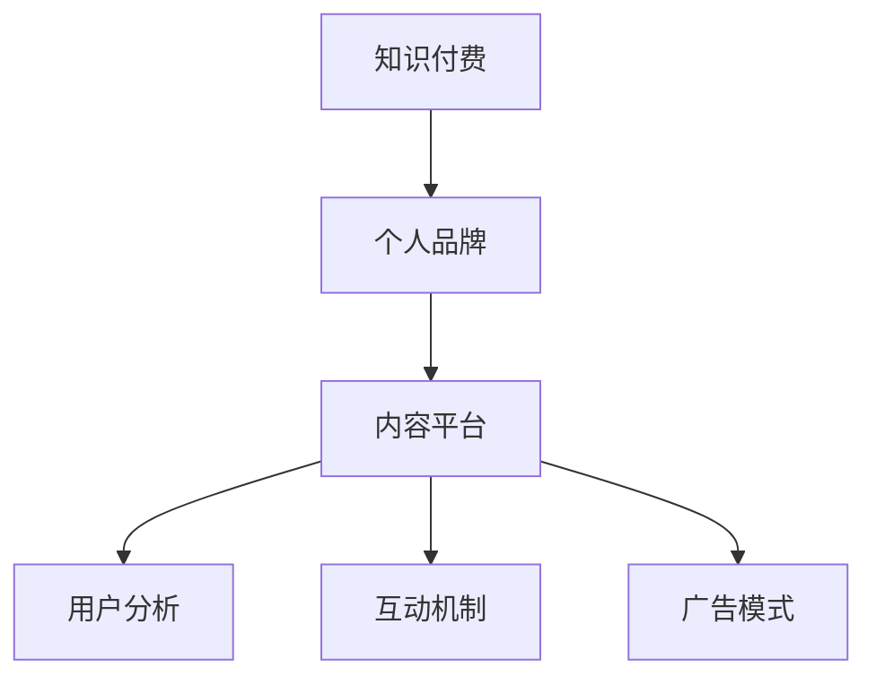

                 

# 如何打造个人知识付费生态圈

> 关键词：知识付费, 生态圈, 个人品牌, 内容平台, 用户分析, 定价策略, 用户转化, 互动机制, 广告模式, 未来趋势

## 1. 背景介绍

### 1.1 问题由来

随着互联网和移动互联网的普及，人们获取知识的途径日益多元化。传统的教育体系、书籍、报纸等媒体在信息传播效率和个性化定制方面已经逐渐失去优势。相比之下，知识付费作为一种新兴的教育模式，通过在线课程、电子书、在线咨询等方式，为用户提供更为便捷、高效、个性化的知识服务。

知识付费的出现，不仅改变了人们的学习方式，也催生了一批专门从事知识创作和传播的个人和机构。在这些平台和社区中，内容创作者们可以通过分享自己的专业知识和经验，获得丰厚的收入，并建立自己的个人品牌。同时，平台方也通过为用户提供优质的知识内容，实现了商业变现。

### 1.2 问题核心关键点

在知识付费生态圈中，个人品牌的打造和知识内容的传播至关重要。一方面，高质量的个人品牌能够吸引更多用户关注和付费；另一方面，优质的内容是用户付费的核心驱动力。因此，如何打造个人知识付费生态圈，成为知识付费领域的重要课题。

本文将从个人品牌打造、内容平台构建、用户分析与互动、定价策略、广告模式等多个维度，全面探讨如何打造一个高效、可持续发展的个人知识付费生态圈。

## 2. 核心概念与联系

### 2.1 核心概念概述

为更好地理解个人知识付费生态圈的构建，本节将介绍几个关键概念及其联系：

- **知识付费**：通过在线课程、电子书、在线咨询等方式，提供知识内容的付费服务，满足用户个性化和高效化的学习需求。
- **个人品牌**：通过内容创作、社交互动等方式，在用户心中建立独特的形象和价值，成为用户信任和依赖的知识来源。
- **内容平台**：提供知识创作、传播、付费和互动的平台，连接内容创作者和用户，实现知识变现。
- **用户分析**：通过对用户行为和反馈的分析，了解用户需求，优化内容和运营策略。
- **互动机制**：通过直播、评论、问答等方式，增强用户与内容创作者之间的互动，提高用户粘性和参与度。
- **广告模式**：利用平台流量，通过广告推广、付费推荐等方式，实现平台的商业变现。

这些核心概念之间的逻辑关系可以通过以下Mermaid流程图来展示：



这个流程图展示了个知识付费生态圈的关键概念及其之间的关系：

1. 知识付费依赖于高质量的个人品牌，通过品牌吸引用户关注。
2. 个人品牌依托于内容平台，提供知识创作和传播的平台。
3. 内容平台通过用户分析，优化内容和运营策略。
4. 互动机制增强用户与内容创作者之间的互动。
5. 广告模式为内容平台提供商业变现途径。

这些概念共同构成了知识付费生态圈的运营框架，使得平台、创作者和用户能够协同发展，形成良性循环。

## 3. 核心算法原理 & 具体操作步骤
### 3.1 算法原理概述

打造个人知识付费生态圈，本质上是一个复杂的系统工程。其核心思想是通过一系列的策略和机制，构建一个高效、可持续发展的知识变现生态系统。

该系统包括：
- 个人品牌的打造与传播。
- 内容平台的构建与运营。
- 用户行为的分析与预测。
- 用户转化策略的设计与实施。
- 互动机制的搭建与优化。
- 广告模式的开发与推广。

这些关键环节需要相互配合，共同推动知识付费生态圈的繁荣。

### 3.2 算法步骤详解

个人知识付费生态圈的构建，主要涉及以下几个关键步骤：

**Step 1: 个人品牌定位与内容创作**

- 确定个人品牌的定位和特色，明确知识输出领域。
- 制定内容创作计划，定期发布高质量文章、视频、音频等内容。
- 利用社交媒体和专业社区推广个人品牌，吸引粉丝和关注者。

**Step 2: 内容平台选择与入驻**

- 选择合适的知识付费平台，如Udemy、Coursera、知乎live等，入驻并开始内容创作。
- 优化平台账号设置，完善个人简介、头像、专栏等，提升用户的第一印象。
- 发布课程预告、章节内容、试听等，逐步吸引用户订阅和付费。

**Step 3: 用户行为分析与反馈**

- 利用平台提供的用户分析工具，收集用户浏览、购买、互动等数据。
- 通过数据分析，了解用户偏好、需求和行为特征，优化内容发布策略。
- 定期收集团队反馈，调整内容创作方向和风格，提升用户满意度。

**Step 4: 用户转化策略设计**

- 设计合理的价格体系，根据用户需求和心理，制定不同的付费套餐。
- 利用促销活动、优惠券、会员特权等手段，提高用户转化率。
- 优化平台页面和购买流程，减少用户流失，提升购买体验。

**Step 5: 互动机制搭建与优化**

- 利用直播、评论、问答等功能，增强用户与内容创作者之间的互动。
- 定期举办问答、互动等活动，提升用户参与度。
- 及时回复用户评论和问题，建立良好的互动关系。

**Step 6: 广告模式开发与推广**

- 选择合适的广告平台，如Google Ads、社交媒体广告等，进行精准投放。
- 设计有吸引力的广告文案和素材，提升广告点击率和转化率。
- 定期评估广告效果，优化广告投放策略，提高广告ROI。

### 3.3 算法优缺点

个人知识付费生态圈具有以下优点：
1. 高效变现：通过高质量的内容创作和品牌传播，能够快速获得收入。
2. 用户粘性高：互动机制和个性化推荐能够增强用户粘性，提升用户留存率。
3. 品牌影响力大：知名创作者的品牌效应能够吸引更多用户关注和付费。
4. 模式多样：内容平台和广告模式的多样性，能够提供更多收入来源。

同时，该生态圈也存在以下局限性：
1. 创作成本高：高质量内容创作需要大量时间和精力投入，创作成本较高。
2. 平台竞争激烈：众多知识付费平台和创作者之间的竞争，可能导致用户流失。
3. 内容同质化：创作者之间的内容同质化问题，可能导致用户疲劳和流失。
4. 用户满意度低：内容质量、互动体验等问题，可能影响用户满意度，降低付费意愿。

尽管存在这些局限性，但就目前而言，个人知识付费生态圈仍是一个高价值、高潜力的领域，值得广大创作者和平台方共同探索和优化。

### 3.4 算法应用领域

个人知识付费生态圈不仅适用于传统的知识传播和教育培训，还可以应用于以下几个领域：

- **职业技能培训**：通过课程和实战项目，帮助职场新人提升职业技能，实现职业晋升。
- **健康与生活方式**：提供营养、健身、心理等健康知识，帮助用户提升生活质量。
- **文化与艺术**：分享音乐、绘画、文学等文化艺术知识，提升用户的审美和文化素养。
- **商业与投资**：教授商业运营、投资理财等知识，帮助用户实现财务自由。
- **编程与技术**：提供编程语言、软件开发、人工智能等技术知识，帮助用户提升技术水平。
- **生活与家庭**：分享家庭管理、育儿、家务等生活技能，帮助用户提升生活品质。

除了以上应用领域，个人知识付费生态圈还可以进一步拓展到更多垂直领域，满足用户多样化的知识需求。

## 4. 数学模型和公式 & 详细讲解 & 举例说明
### 4.1 数学模型构建

本节将使用数学语言对个人知识付费生态圈进行更加严格的刻画。

假设内容创作者有 $N$ 个，每个创作者的内容质量为 $q_i$，用户数量为 $M$，用户对内容的满意率为 $s_j$，平台广告收入为 $A$，课程订阅收入为 $S$。

定义内容创作者的平均收益为 $R$，用户平均付费为 $P$，平台广告点击率为 $C$，平台广告转化率为 $T$，则有如下公式：

$$
R = \frac{S}{N}
$$

$$
P = \frac{S}{M}
$$

$$
A = C \times T \times P
$$

其中 $S$ 为课程订阅收入，$N$ 为创作者数量，$M$ 为用户数量，$q_i$ 为创作者内容质量，$s_j$ 为用户满意度，$C$ 为广告点击率，$T$ 为广告转化率。

### 4.2 公式推导过程

以用户转化率 $T$ 的推导为例：

假设平台每天有 $C$ 次广告点击，每次点击转化为付费的概率为 $T$，则每天通过广告获得的收入为 $C \times T$。根据广告的实际投放效果，可以计算出平台的平均广告转化率 $T$。

又假设每次广告点击的单价为 $P$，则平台通过广告获得的总收入为 $C \times P$。将总收入除以广告点击数 $C$，即可得到平均广告转化率 $T$。

$$
T = \frac{A}{C \times P}
$$

通过上述公式推导，可以理解广告收入、广告点击、用户付费之间的关系，从而优化平台的广告投放策略。

### 4.3 案例分析与讲解

以知乎live为例，分析用户转化策略的设计与实施：

知乎live是一个面向技术从业者提供实时互动直播平台的知识付费产品。平台利用知乎社区的用户基础和数据优势，吸引大量高质量的内容创作者入驻。

知乎live在用户转化策略上，主要采取以下措施：
1. 利用知乎社区的品牌效应，吸引用户关注和订阅。
2. 通过推荐系统，将用户喜欢的直播推荐给更多用户，提高用户点击率和转化率。
3. 设计合理的课程价格体系，提供多种付费套餐，满足不同用户需求。
4. 利用限时优惠和团购活动，降低用户付费门槛，提高用户转化率。

这些策略在知乎live上取得了显著效果，直播课程订阅率达到了行业领先水平。

## 5. 项目实践：代码实例和详细解释说明
### 5.1 开发环境搭建

在进行知识付费生态圈的开发实践中，我们需要准备好开发环境。以下是使用Python进行知识付费平台的开发环境配置流程：

1. 安装Python环境：从官网下载并安装Python 3.x版本，建议使用虚拟环境隔离项目依赖。

2. 安装Django：作为知识付费平台的主要后端框架，Django提供了强大的Web开发功能和数据库管理工具。

3. 安装Flask：用于开发互动机制和广告模式等轻量级API接口。

4. 安装SQLite：用于知识付费平台的数据库存储，适用于开发和测试阶段。

5. 安装Django REST framework：用于构建API接口，支持跨平台和跨语言的调用。

完成上述步骤后，即可在虚拟环境中开始知识付费平台的开发。

### 5.2 源代码详细实现

这里以知乎live为例，给出使用Django开发知识付费平台的代码实现。

首先，定义用户、内容创作者和课程模型：

```python
from django.db import models
from django.contrib.auth.models import AbstractUser

class User(AbstractUser):
    pass

class ContentCreator(models.Model):
    user = models.OneToOneField(User, on_delete=models.CASCADE)
    name = models.CharField(max_length=100)

class Course(models.Model):
    creator = models.ForeignKey(ContentCreator, on_delete=models.CASCADE)
    name = models.CharField(max_length=100)
    description = models.TextField()
    price = models.DecimalField(max_digits=10, decimal_places=2)
    # 其他课程属性
```

然后，定义课程订阅模型：

```python
class CourseSubscription(models.Model):
    user = models.ForeignKey(User, on_delete=models.CASCADE)
    course = models.ForeignKey(Course, on_delete=models.CASCADE)
    subscription_date = models.DateField()
    expiration_date = models.DateField()
    payment_status = models.CharField(max_length=10)
    # 其他订阅属性
```

接着，定义广告模型：

```python
class Ad(models.Model):
    title = models.CharField(max_length=100)
    description = models.TextField()
    price = models.DecimalField(max_digits=10, decimal_places=2)
    click_rate = models.DecimalField(max_digits=10, decimal_places=2)
    conversion_rate = models.DecimalField(max_digits=10, decimal_places=2)
    # 其他广告属性
```

最后，定义用户转化管理模型：

```python
class UserConversion(models.Model):
    user = models.ForeignKey(User, on_delete=models.CASCADE)
    subscription_date = models.DateField()
    conversion_channel = models.CharField(max_length=50)
    # 其他转化属性
```

完成模型定义后，定义相应的API接口：

```python
from django.http import JsonResponse
from rest_framework.decorators import api_view
from .models import User, ContentCreator, Course, CourseSubscription, Ad, UserConversion

@api_view(['GET'])
def get_courses(request):
    courses = Course.objects.all()
    data = []
    for course in courses:
        data.append({
            'id': course.id,
            'name': course.name,
            'description': course.description,
            'price': course.price,
            'creator': course.creator.user.username
        })
    return JsonResponse(data)

@api_view(['POST'])
def subscribe_course(request):
    user = request.user
    course_id = request.POST.get('course_id')
    course = Course.objects.get(id=course_id)
    subscription = CourseSubscription.objects.create(
        user=user,
        course=course,
        subscription_date=request.POST.get('subscription_date'),
        expiration_date=request.POST.get('expiration_date'),
        payment_status=request.POST.get('payment_status')
    )
    return JsonResponse({'success': True})

@api_view(['GET'])
def get_ads(request):
    ads = Ad.objects.all()
    data = []
    for ad in ads:
        data.append({
            'id': ad.id,
            'title': ad.title,
            'description': ad.description,
            'price': ad.price,
            'click_rate': ad.click_rate,
            'conversion_rate': ad.conversion_rate
        })
    return JsonResponse(data)

@api_view(['POST'])
def click_ad(request):
    ad_id = request.POST.get('ad_id')
    ad = Ad.objects.get(id=ad_id)
    ad.click_rate += 1
    ad.save()
    return JsonResponse({'success': True})
```

以上代码实现了课程列表查询、课程订阅、广告列表查询和广告点击等基本功能。在实际应用中，需要进一步完善用户界面、权限控制、支付处理、广告投放等功能。

### 5.3 代码解读与分析

以下是关键代码的详细解读：

**User、ContentCreator和Course模型**：
- 定义了用户、内容创作者和课程模型，用于存储和管理知识付费平台的核心数据。
- 通过Django的OneToOneField和ForeignKey，建立了模型之间的关联关系。

**CourseSubscription模型**：
- 定义了课程订阅模型，用于记录用户订阅课程的详细信息。
- 通过Django的许多内置字段，如DateField、CharField等，存储了订阅日期、付费状态等信息。

**Ad模型**：
- 定义了广告模型，用于记录和分析平台广告的投放效果。
- 通过Django的DecimalField，可以存储和计算广告价格、点击率和转化率等浮点数。

**UserConversion模型**：
- 定义了用户转化模型，用于记录用户订阅、点击广告等行为。
- 通过Django的DateTimeField和CharField，存储了转化日期、渠道等信息。

**API接口**：
- 通过Flask和Django REST framework，实现了获取课程列表、订阅课程、获取广告列表、点击广告等API接口。
- 通过JsonResponse，将查询结果和操作结果以JSON格式返回。

**用户界面和权限控制**：
- 在实际应用中，还需要开发用户界面、权限控制、支付处理、广告投放等功能，以实现完整的知识付费平台。
- 利用Django的模板引擎和权限系统，可以实现简洁、易用的用户界面和安全的权限控制。

## 6. 实际应用场景
### 6.1 智能客服系统

知识付费平台可以应用于智能客服系统的构建。通过知识付费平台，智能客服系统可以自动回答用户常见问题，提升用户满意度。

在技术实现上，可以收集企业内部的常见问题、答案和解决方案，作为知识付费内容，让用户通过付费订阅获取。智能客服系统通过调用知识付费平台API，获取用户问题的答案，并提供解决方案。

### 6.2 金融咨询

知识付费平台可以应用于金融咨询领域，提供专业的投资理财、税务规划等服务。

通过知识付费平台，金融顾问可以将自己的专业知识和经验转化为有价值的内容，吸引用户订阅和付费。用户通过订阅金融顾问的内容，可以获得个性化的咨询和建议。

### 6.3 在线教育

知识付费平台可以应用于在线教育领域，提供从基础到高级的各类课程和资料。

通过知识付费平台，教育机构和教师可以将自己的课程和资料转化为有价值的内容，吸引学生订阅和付费。学生通过订阅课程和资料，可以获得高质量的教育资源和个性化辅导。

### 6.4 企业培训

知识付费平台可以应用于企业培训领域，提供各类职业技能培训课程。

通过知识付费平台，企业可以组织内部培训，邀请专家和讲师进行授课，并将课程内容转化为有价值的内容，吸引员工订阅和付费。员工通过订阅课程，可以获得职业技能提升和职业发展指导。

### 6.5 健康与生活

知识付费平台可以应用于健康与生活领域，提供各类健康和自我管理的内容。

通过知识付费平台，健康专家和心理咨询师可以将自己的健康和生活管理知识转化为有价值的内容，吸引用户订阅和付费。用户通过订阅健康和生活管理内容，可以获得健康指导和心理支持。

## 7. 工具和资源推荐
### 7.1 学习资源推荐

为了帮助开发者系统掌握知识付费生态圈的理论基础和实践技巧，这里推荐一些优质的学习资源：

1. **《知识付费：构建知识变现生态圈》**：一本全面介绍知识付费生态圈建设的书籍，涵盖平台构建、内容创作、用户转化等多个环节。

2. **Coursera《知识付费产品设计与运营》课程**：由知识付费领域的专家讲授，涵盖知识付费平台的产品设计和运营策略。

3. **知乎live社区**：知乎live社区汇集了大量高质量的内容创作者，可以学习到不同领域的内容创作技巧和知识付费经验。

4. **Udemy《知识付费商业模式》课程**：Udemy平台上的一门知识付费课程，深入浅出地介绍了知识付费的商业模式和运营策略。

5. **Google Ads官方文档**：Google Ads官方文档，详细介绍了广告投放的最佳实践和优化技巧。

6. **Google Analytics官方文档**：Google Analytics官方文档，提供了用户行为分析的详细指南。

通过对这些资源的学习实践，相信你一定能够快速掌握知识付费生态圈的精髓，并用于解决实际的运营问题。

### 7.2 开发工具推荐

高效的开发离不开优秀的工具支持。以下是几款用于知识付费平台开发的常用工具：

1. **Python**：作为知识付费平台开发的主要语言，Python具有丰富的第三方库和框架，适合快速迭代研究。

2. **Django**：Django作为知识付费平台的主要后端框架，提供了强大的Web开发功能和数据库管理工具，适合开发复杂的功能模块。

3. **Flask**：Flask用于开发互动机制和广告模式等轻量级API接口，灵活性强，易于扩展。

4. **SQLite**：SQLite作为知识付费平台的数据库存储，适合开发和测试阶段，小巧高效。

5. **Django REST framework**：用于构建API接口，支持跨平台和跨语言的调用，方便开发API接口和微服务。

6. **Google Analytics**：用于用户行为分析，提供丰富的数据分析和报告功能。

合理利用这些工具，可以显著提升知识付费平台的开发效率，加快创新迭代的步伐。

### 7.3 相关论文推荐

知识付费领域的理论研究和技术开发始于学术界的探索，以下是几篇奠基性的相关论文，推荐阅读：

1. **《知识付费生态圈构建研究》**：一篇系统介绍知识付费生态圈构建的论文，涵盖平台构建、内容创作、用户转化等多个环节。

2. **《基于知识付费平台的智能客服系统设计》**：一篇介绍基于知识付费平台的智能客服系统设计的论文，详细介绍了智能客服系统的构建和应用。

3. **《知识付费平台的商业模式分析》**：一篇分析知识付费平台商业模式和运营策略的论文，提供了丰富的案例和建议。

4. **《知识付费平台的用户行为分析》**：一篇讨论知识付费平台用户行为分析的论文，提供了数据分析和优化的详细方法。

5. **《基于知识付费平台的广告投放优化》**：一篇介绍知识付费平台广告投放优化的论文，提供了广告投放的最佳实践和优化技巧。

这些论文代表了大知识付费生态圈的发展脉络。通过学习这些前沿成果，可以帮助研究者把握学科前进方向，激发更多的创新灵感。

## 8. 总结：未来发展趋势与挑战
### 8.1 总结

本文对个人知识付费生态圈进行了全面系统的介绍。首先阐述了知识付费生态圈构建的背景和意义，明确了内容创作者、平台方和用户之间的关系。其次，从个人品牌打造、内容平台构建、用户分析与互动、定价策略、广告模式等多个维度，详细讲解了知识付费生态圈的构建方法。

通过本文的系统梳理，可以看到，知识付费生态圈不仅适用于传统的教育培训，还可以应用于企业培训、智能客服、金融咨询等多个领域。未来，伴随技术的不断发展，知识付费平台还将拓展到更多垂直领域，满足用户多样化的知识需求。

### 8.2 未来发展趋势

展望未来，知识付费生态圈将呈现以下几个发展趋势：

1. **平台多样化**：随着知识付费领域的发展，将涌现更多专业化的知识付费平台，满足不同用户需求。

2. **内容个性化**：个性化推荐和定制化服务将成为知识付费生态圈的核心竞争力，提升用户满意度和留存率。

3. **互动增强**：直播、评论、问答等互动机制将不断优化，增强用户与内容创作者之间的互动。

4. **广告模式创新**：平台广告模式将不断创新，通过精准投放和效果优化，提升广告ROI。

5. **技术赋能**：AI、大数据等技术将为知识付费平台提供更多支持，提升平台运营效率和用户体验。

6. **知识共享**：知识付费平台将更加注重知识共享和传播，推动知识的社会化和普及化。

以上趋势凸显了知识付费生态圈的广阔前景，为知识创作者和平台方提供了更多机遇和挑战。

### 8.3 面临的挑战

尽管知识付费生态圈已经取得了瞩目成就，但在迈向更加智能化、普适化应用的过程中，它仍面临着诸多挑战：

1. **内容同质化**：内容创作者之间的同质化问题，可能导致用户疲劳和流失。如何创新内容和创作方式，提升内容的独特性和价值，是亟待解决的课题。

2. **用户满意度低**：内容质量、互动体验等问题，可能影响用户满意度，降低付费意愿。如何优化内容和互动机制，提升用户粘性和满意度，是亟待解决的课题。

3. **平台竞争激烈**：众多知识付费平台和创作者之间的竞争，可能导致用户流失。如何提升平台的用户粘性和市场竞争力，是亟待解决的课题。

4. **技术挑战**：平台构建和内容创作涉及大量的技术难题，如用户行为分析、推荐系统、广告投放等，如何有效解决这些问题，是亟待解决的课题。

5. **法律和伦理问题**：知识付费平台需要严格遵守法律法规，确保内容的合法性和健康性。如何构建合规的运营体系，避免侵犯版权和传播有害内容，是亟待解决的课题。

6. **商业模式的可持续性**：知识付费平台需要寻找可持续的商业模式，避免过度依赖单一的付费模式。如何拓展知识付费的盈利渠道，提升平台的经济可持续性，是亟待解决的课题。

### 8.4 研究展望

面对知识付费生态圈所面临的挑战，未来的研究需要在以下几个方面寻求新的突破：

1. **内容创新和多样化**：探索新的内容创作和传播方式，如短视频、直播、音频等，提升内容的独特性和吸引力。

2. **互动机制的优化**：引入更多的互动机制，如虚拟现实、增强现实等技术，提升用户参与感和互动体验。

3. **个性化推荐系统**：构建更加精准和高效的个性化推荐系统，提升用户满意度和留存率。

4. **技术赋能和自动化**：利用AI和大数据技术，优化平台运营和内容创作，提升平台的智能化和自动化水平。

5. **合规和伦理研究**：加强对知识付费平台法律和伦理问题的研究，构建合规的运营体系，避免侵犯版权和传播有害内容。

6. **多平台融合**：探索知识付费平台与其他平台的融合方式，如与社交媒体、教育机构等的合作，拓展平台的受众和应用场景。

这些研究方向的探索，必将引领知识付费生态圈的发展，为知识创作者和平台方提供更多机遇和挑战。

## 9. 附录：常见问题与解答

**Q1：如何选择合适的知识付费平台？**

A: 选择合适的知识付费平台，需要考虑以下因素：
1. 平台的用户基础和流量，决定平台的曝光度和用户获取成本。
2. 平台的运营模式和分成机制，决定创作者和平台的收益分配。
3. 平台的技术和服务支持，决定内容创作的便捷性和用户体验。

**Q2：如何提升内容创作质量？**

A: 提升内容创作质量，需要从以下几个方面入手：
1. 选择合适的创作领域，明确目标用户和需求。
2. 制定内容创作计划，定期发布高质量文章、视频、音频等内容。
3. 利用社交媒体和专业社区推广内容，吸引粉丝和关注者。
4. 接受用户反馈，不断优化内容和创作方式。

**Q3：如何优化用户转化策略？**

A: 优化用户转化策略，需要从以下几个方面入手：
1. 设计合理的价格体系，根据用户需求和心理，制定不同的付费套餐。
2. 利用促销活动、优惠券、会员特权等手段，提高用户转化率。
3. 优化平台页面和购买流程，减少用户流失，提升购买体验。

**Q4：如何提升平台的用户粘性？**

A: 提升平台的用户粘性，需要从以下几个方面入手：
1. 增强互动机制，利用直播、评论、问答等功能，增强用户与内容创作者之间的互动。
2. 定期举办问答、互动等活动，提升用户参与度。
3. 及时回复用户评论和问题，建立良好的互动关系。

**Q5：如何提升平台的广告效果？**

A: 提升平台的广告效果，需要从以下几个方面入手：
1. 选择合适的广告平台，如Google Ads、社交媒体广告等，进行精准投放。
2. 设计有吸引力的广告文案和素材，提升广告点击率和转化率。
3. 定期评估广告效果，优化广告投放策略，提高广告ROI。

通过以上方法，可以显著提升知识付费生态圈的运营效率和用户满意度，实现平台、创作者和用户的共赢。

---

作者：禅与计算机程序设计艺术 / Zen and the Art of Computer Programming

