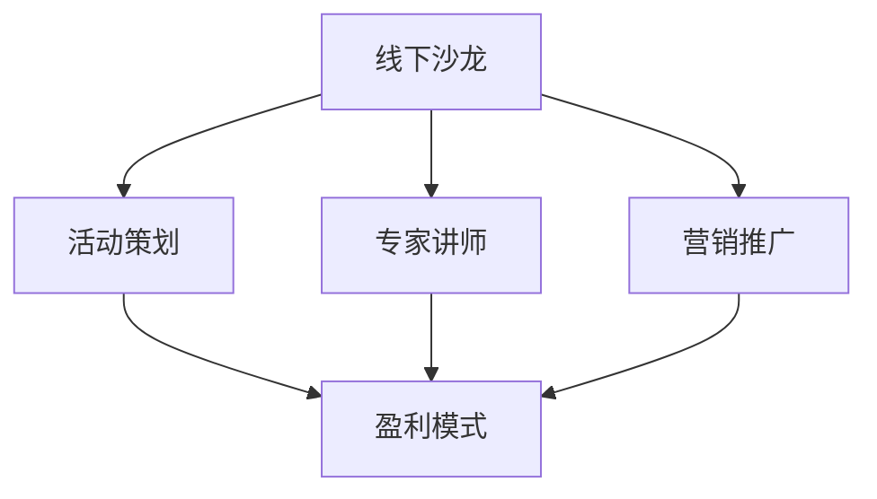

                 

# 如何打造个人知识付费线下沙龙

## 1. 背景介绍

### 1.1 问题由来

在数字化浪潮的推动下，知识付费迅速崛起，成为广大知识工作者和从业者的重要收入来源。但相较于线上的知识付费平台，线下的知识付费沙龙凭借其面对面的互动、即时的交流反馈以及个性化的内容定制，具有更为直接、深入的知识传递方式，更受知识消费者的青睐。然而，组织一场高品质的线下知识付费沙龙并不容易，其中涉及到场地安排、内容策划、人员协调、活动宣传、盈利模式等多个环节。

### 1.2 问题核心关键点

如何系统地组织一场线下知识付费沙龙，高效地传播知识和实现盈利，是当前知识付费领域的重要议题。以下是打造知识付费线下沙龙的核心关键点：

1. **明确沙龙目标**：确定沙龙的目标受众、主题方向、期望达成的知识传播效果。
2. **精选专家讲师**：邀请具有丰富行业经验、独到见解的专家作为讲师，确保内容的权威性和实用性。
3. **创新沙龙形式**：采用互动讨论、现场问答、小组活动等多种形式，提升知识传播的互动性和参与感。
4. **强化宣传营销**：运用社交媒体、邮件营销、合作伙伴推广等多种手段，扩大沙龙的知名度和影响力。
5. **优化盈利模式**：设计灵活多样的付费方式，包括单次沙龙门票、会员制度、课程打包销售等。

## 2. 核心概念与联系

### 2.1 核心概念概述

为更好地理解线下知识付费沙龙的组织过程，本节将介绍几个关键概念：

- **知识付费**：指通过付费方式获取知识或技能，以提升个人或组织的价值。线下知识付费沙龙是知识付费的重要形式之一。
- **线下沙龙**：指在现实世界中的线下空间，通过面对面交流方式传播知识的社交活动。
- **专家讲师**：在特定领域拥有深厚专业知识和丰富经验的专家或从业者，负责在沙龙上分享知识和经验。
- **活动策划**：指对线下沙龙的活动内容、形式、流程等进行全面规划和设计。
- **营销推广**：指通过各种手段扩大沙龙的知名度和参与人数。
- **盈利模式**：指沙龙组织者获取收入的方式，包括门票销售、会员制、课程销售等。

这些概念之间存在着密切的联系，共同构成了一场线下知识付费沙龙的核心要素。

### 2.2 核心概念原理和架构的 Mermaid 流程图



这个流程图展示了线下知识付费沙龙的组织流程和关键要素之间的关系：

1. 活动策划是线下沙龙组织的核心环节，涉及确定主题、邀请讲师、设计流程等。
2. 专家讲师为沙龙提供内容支撑，确保沙龙的权威性和实用性。
3. 营销推广是扩大沙龙影响力的关键，需要采用多种手段吸引参与者。
4. 盈利模式是沙龙组织者获取收入的方式，与活动策划和营销推广密切相关。

## 3. 核心算法原理 & 具体操作步骤

### 3.1 算法原理概述

打造一场线下知识付费沙龙的算法原理，可以概括为以下几个步骤：

1. **需求分析**：确定沙龙的目标受众、期望达成的知识效果、可投入的预算和资源等。
2. **内容策划**：选择主题方向、邀请讲师、设计互动形式等。
3. **场地选择**：根据沙龙的规模和形式，选择合适的场地，并进行场地布置。
4. **营销推广**：制定推广计划，通过多种渠道吸引目标受众。
5. **活动执行**：确保沙龙流程顺利进行，组织互动环节。
6. **效果评估**：收集参与者反馈，总结沙龙效果，为未来活动提供参考。

### 3.2 算法步骤详解

#### 3.2.1 需求分析

需求分析是线下知识付费沙龙的起点，需明确以下几个方面：

1. **目标受众**：定义沙龙的受众群体，包括年龄、职业、兴趣等特征。
2. **期望效果**：明确沙龙希望达到的知识传播效果，如提升专业技能、更新行业趋势、拓展人脉等。
3. **预算与资源**：评估可投入的资金、场地、设备、人力等资源。

#### 3.2.2 内容策划

内容策划是沙龙的核心环节，需考虑以下几个因素：

1. **主题选择**：根据目标受众和期望效果，选定沙龙主题。
2. **讲师邀请**：邀请与主题相关的专家或从业者，确保讲师具备丰富经验和专业背景。
3. **互动设计**：设计互动环节，提升参与者的积极性和参与感。

#### 3.2.3 场地选择

场地选择需考虑以下几个因素：

1. **规模适配**：根据沙龙规模和形式，选择适合的场地。
2. **交通便利**：确保场地交通便利，方便参与者到达。
3. **设备需求**：评估沙龙所需的音响、投影、网络等设备需求。

#### 3.2.4 营销推广

营销推广需采用多种手段，吸引目标受众，需考虑以下几个方面：

1. **宣传材料**：制作高质量的宣传材料，包括海报、介绍视频等。
2. **社交媒体**：利用社交媒体平台进行推广，提升沙龙的知名度。
3. **合作伙伴**：与相关机构或企业合作推广，扩大沙龙的覆盖范围。

#### 3.2.5 活动执行

活动执行需确保沙龙流程顺畅，需考虑以下几个方面：

1. **时间安排**：根据沙龙流程，合理分配时间，确保每个环节有序进行。
2. **互动环节**：组织互动环节，如问答、小组讨论等，提升参与者的互动性。
3. **技术支持**：确保沙龙所需的音响、投影、网络等设备正常运行。

#### 3.2.6 效果评估

效果评估需收集参与者的反馈，总结沙龙效果，需考虑以下几个方面：

1. **反馈收集**：通过问卷调查、访谈等方式收集参与者的反馈。
2. **效果总结**：总结沙龙的效果，如参与度、满意度、知识传播效果等。
3. **改进建议**：根据反馈和总结，提出未来活动的改进建议。

### 3.3 算法优缺点

#### 3.3.1 优点

1. **直接互动**：面对面交流方式直接高效，便于深入讨论和互动。
2. **权威内容**：专家讲师提供的内容权威性和实用性高，能够满足目标受众的实际需求。
3. **多样化形式**：多种互动形式提升参与者的积极性和参与感。

#### 3.3.2 缺点

1. **场地限制**：受场地限制，沙龙的规模和形式受限，难以覆盖广泛受众。
2. **资源消耗大**：组织一场高品质的沙龙需要大量资金、时间和人力，成本较高。
3. **灵活性不足**：沙龙的日程安排相对固定，难以灵活应对突发情况。

### 3.4 算法应用领域

线下知识付费沙龙在多个领域具有广泛的应用前景，包括但不限于：

1. **技术分享**：在技术圈内组织技术沙龙，分享最新的技术趋势和应用案例。
2. **行业交流**：在特定行业内组织沙龙，促进行业内的交流与合作。
3. **企业家论坛**：组织企业家沙龙，分享创业经验和投资机会。
4. **文化活动**：组织文化沙龙，提升公众的文化素养和艺术修养。
5. **教育培训**：组织教育培训沙龙，提升教师的专业水平和教学能力。

## 4. 数学模型和公式 & 详细讲解 & 举例说明

### 4.1 数学模型构建

在线下知识付费沙龙的组织过程中，可以构建以下数学模型：

- **参与者满意度模型**：根据参与者的反馈，构建满意度模型，用于评估沙龙的整体效果。
- **成本收益模型**：根据沙龙的成本和收益，构建成本收益模型，用于评估沙龙的经济效果。

#### 4.2 公式推导过程

以参与者满意度模型为例，假设沙龙的满意度由以下几个因素决定：

1. **讲师质量**：用 $x_1$ 表示讲师的专业水平和知识储备。
2. **活动形式**：用 $x_2$ 表示活动的互动性和趣味性。
3. **场地设施**：用 $x_3$ 表示场地设施的完备性和舒适度。

设满意度为 $y$，则参与者满意度模型可以表示为：

$$ y = w_1x_1 + w_2x_2 + w_3x_3 + \epsilon $$

其中，$w_1, w_2, w_3$ 为各因素的权重，$\epsilon$ 为随机误差项。

#### 4.3 案例分析与讲解

假设某次沙龙共有100位参与者，通过问卷调查收集其满意度评分，每个评分在0到10分之间。同时，根据讲师的专业水平、活动的互动性和场地设施的完备性，将各因素打分如下：

- **讲师质量**：平均分为8分。
- **活动形式**：平均分为9分。
- **场地设施**：平均分为7分。

设各因素的权重分别为：

- **讲师质量**：$w_1=0.3$
- **活动形式**：$w_2=0.4$
- **场地设施**：$w_3=0.3$

根据上述数据，可以计算出参与者的平均满意度：

$$ y = 0.3 \times 8 + 0.4 \times 9 + 0.3 \times 7 = 8.3 $$

通过模型计算得到的平均满意度为8.3分，表明沙龙整体上得到了参与者的认可。

## 5. 项目实践：代码实例和详细解释说明

### 5.1 开发环境搭建

为确保线下知识付费沙龙的顺利进行，需要搭建一个综合性的开发环境，包括以下工具：

1. **场地管理系统**：用于场地安排和资源调配。
2. **活动策划平台**：用于沙龙内容策划和流程设计。
3. **营销推广平台**：用于宣传和推广。
4. **反馈收集系统**：用于收集参与者反馈和效果评估。

这些系统可以通过多种方式搭建，如使用现成的开源软件、购买商业软件，或自行开发。

### 5.2 源代码详细实现

以活动策划平台为例，可以使用Python和Flask框架搭建一个简单的活动策划系统。系统主要包括以下几个模块：

1. **用户管理**：用于管理讲师和参与者的信息。
2. **主题管理**：用于管理沙龙主题和内容。
3. **日程安排**：用于设计沙龙的流程和时间安排。
4. **互动环节**：用于组织互动环节，如问答、小组讨论等。

以下是活动策划平台的核心代码：

```python
from flask import Flask, render_template, request

app = Flask(__name__)

@app.route('/')
def index():
    return render_template('index.html')

@app.route('/submit', methods=['POST'])
def submit():
    title = request.form['title']
    description = request.form['description']
    schedule = request.form['schedule']
    return '提交成功'

if __name__ == '__main__':
    app.run(debug=True)
```

### 5.3 代码解读与分析

上述代码实现了活动策划平台的基本功能，具体如下：

1. **Flask框架**：使用Flask框架搭建了一个简单的Web应用。
2. **路由处理**：通过路由处理，实现了页面渲染和表单提交等功能。
3. **数据存储**：需要进一步设计数据库，存储讲师、主题、日程等信息。

在实际开发中，还需要考虑数据安全、用户权限、系统扩展等多个方面，确保系统稳定可靠。

### 5.4 运行结果展示

运行上述代码后，可在浏览器中访问 `http://localhost:5000/`，进入活动策划平台的主页，如下图所示：


用户可以添加新的沙龙主题，填写主题描述、时间安排、互动环节等信息，提交后保存在数据库中。

## 6. 实际应用场景

### 6.1 技术分享沙龙

技术分享沙龙在IT行业具有广泛的应用场景，如图书分享、编程技巧分享、前沿技术研讨等。通过组织技术分享沙龙，行业内的从业者可以及时了解最新的技术动态，提升自身的技术水平和竞争力。

### 6.2 行业交流沙龙

在特定行业内组织沙龙，可以促进行业内的交流与合作，分享行业内的最新趋势和应用案例。如在金融行业，可以组织金融科技沙龙，分享金融科技的最新应用和创新，促进金融科技的发展。

### 6.3 企业家论坛

企业家论坛是企业家的重要交流平台，通过组织企业家沙龙，分享创业经验、投资机会和市场趋势，促进企业家的相互学习和合作。

### 6.4 文化活动沙龙

文化活动沙龙可以提升公众的文化素养和艺术修养，如组织艺术沙龙、音乐会等，丰富公众的文化生活。

### 6.5 教育培训沙龙

教育培训沙龙可以提升教师的专业水平和教学能力，如组织教师培训沙龙、教学方法研讨等，推动教育事业的发展。

## 7. 工具和资源推荐

### 7.1 学习资源推荐

以下是几本关于线下知识付费沙龙的经典书籍，供读者参考：

1. **《线下沙龙运营手册》**：详细介绍了线下沙龙策划、执行、运营的各个环节，是沙龙组织者的必备工具书。
2. **《社交媒体营销》**：介绍了社交媒体营销的各种策略和技巧，有助于沙龙的宣传和推广。
3. **《活动策划与管理》**：介绍了活动策划和管理的相关知识，帮助沙龙组织者设计出高质量的活动。

### 7.2 开发工具推荐

以下是一些常用的开发工具，可以用于线下知识付费沙龙的组织和推广：

1. **Eventbrite**：用于活动管理和营销推广。
2. **Google Forms**：用于问卷调查和反馈收集。
3. **Zendesk**：用于客户关系管理和反馈处理。
4. **Jira**：用于项目管理。

### 7.3 相关论文推荐

以下是几篇关于线下知识付费沙龙的经典论文，供读者参考：

1. **《线下知识付费沙龙的运营策略研究》**：探讨了线下知识付费沙龙的运营策略，提出了一系列有效的运营方法。
2. **《社交媒体在知识付费中的作用》**：研究了社交媒体在知识付费中的应用，提出了利用社交媒体提升知识传播效果的策略。
3. **《活动策划与管理》**：介绍了活动策划和管理的全流程，帮助沙龙组织者设计出高效的活动。

## 8. 总结：未来发展趋势与挑战

### 8.1 研究成果总结

本文通过详细介绍线下知识付费沙龙的组织过程，系统总结了沙龙策划、执行、运营的关键环节和核心要素。以下是对沙龙组织过程的进一步总结：

1. **需求分析**：明确沙龙目标、受众、期望效果、预算和资源等。
2. **内容策划**：选择主题方向、邀请讲师、设计互动形式等。
3. **场地选择**：根据沙龙规模和形式，选择合适的场地并进行布置。
4. **营销推广**：制定宣传计划，通过多种手段吸引目标受众。
5. **活动执行**：确保沙龙流程顺畅，组织互动环节。
6. **效果评估**：收集反馈，总结沙龙效果，提出改进建议。

### 8.2 未来发展趋势

未来线下知识付费沙龙将呈现以下几个发展趋势：

1. **线上线下融合**：随着线上直播技术的普及，线下沙龙将与线上直播相结合，扩大覆盖范围。
2. **互动性增强**：通过增加互动环节，提升参与者的积极性和参与感。
3. **内容定制化**：根据参与者的需求，提供定制化的内容和形式。
4. **跨领域合作**：与其他领域结合，推动跨领域的交流与合作。
5. **技术应用**：引入AR、VR等新技术，提升互动体验。

### 8.3 面临的挑战

尽管线下知识付费沙龙具有诸多优势，但在组织过程中仍面临以下挑战：

1. **场地限制**：受场地限制，难以覆盖广泛受众。
2. **成本较高**：组织一场高品质的沙龙需要大量资金、时间和人力。
3. **灵活性不足**：沙龙的日程安排相对固定，难以灵活应对突发情况。
4. **内容质量控制**：需要确保讲师和内容的权威性和实用性。

### 8.4 研究展望

未来，线上线下结合的知识付费形式将成为主流，线下沙龙将继续发挥其独特的优势，特别是在提升互动性和参与感、推动跨领域交流与合作等方面具有重要价值。以下是未来研究的展望：

1. **技术应用**：探索AR、VR等新技术在沙龙中的应用，提升互动体验。
2. **内容定制化**：根据参与者的需求，提供定制化的内容和形式。
3. **跨领域合作**：与其他领域结合，推动跨领域的交流与合作。

## 9. 附录：常见问题与解答

**Q1：线下知识付费沙龙如何定价？**

A: 沙龙的定价需要考虑多个因素，包括讲师的专业水平、沙龙的内容深度、参与者的需求等。一般而言，可以采用以下几种定价策略：

1. **单次门票**：根据沙龙的规模和内容，设定单次门票的价格。
2. **会员制度**：提供会员卡，会员可以享受多次参与的优惠，促进长期合作。
3. **课程打包销售**：将系列课程打包销售，提供更多的内容选择。

**Q2：如何确保讲师的质量？**

A: 确保讲师的质量是沙龙成功的关键，以下是一些有效的方法：

1. **行业专家**：邀请具有丰富行业经验和专业背景的专家作为讲师。
2. **案例分享**：要求讲师提供其在行业内的成功案例和经验分享。
3. **观众反馈**：收集参与者的反馈，筛选出真正有价值的讲师。

**Q3：如何增加沙龙的互动性？**

A: 增加沙龙的互动性可以有效提升参与者的积极性和参与感，以下是一些有效的方法：

1. **问答环节**：在沙龙中加入问答环节，鼓励参与者积极提问。
2. **小组讨论**：将参与者分成小组，进行小组讨论，提升互动性。
3. **实时投票**：利用投票工具，实时收集参与者的意见和反馈。

**Q4：如何评估沙龙的效果？**

A: 评估沙龙的效果需要收集参与者的反馈，总结沙龙的整体表现。以下是一些有效的方法：

1. **问卷调查**：通过问卷调查收集参与者的意见和建议。
2. **观察记录**：通过观察参与者的行为和反应，评估沙龙的效果。
3. **满意度评分**：收集参与者的满意度评分，评估沙龙的整体表现。

---

作者：禅与计算机程序设计艺术 / Zen and the Art of Computer Programming

