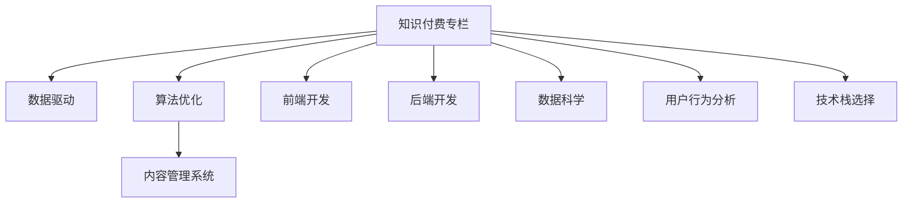

                 

# 如何打造知识付费的付费专栏

## 1. 背景介绍

在知识爆炸的数字化时代，各类知识付费平台如雨后春笋般涌现，为人们提供了海量的学习资源。其中，付费专栏以其系统的内容体系、垂直的定位和高效的学习体验，成为知识付费市场中的重要组成部分。本文旨在从技术角度，详细探讨如何利用数据驱动和算法优化，打造出一款用户满意、内容丰富的知识付费专栏。

## 2. 核心概念与联系

### 2.1 核心概念概述

本节将介绍构建知识付费专栏所需的关键概念，并展示它们之间的联系。

- **知识付费专栏**：指通过在线平台为用户提供系统性、结构化的学习内容，以收取费用为商业模式的知识分享模式。
- **数据驱动**：基于大量用户行为数据，利用数据科学和机器学习技术，对内容进行推荐、排序、优化等操作，以提升用户体验和运营效率。
- **算法优化**：通过不断迭代优化内容推荐算法，提升内容相关性、个性化和吸引力，从而吸引用户付费订阅。
- **内容管理系统(CMS)**：用于管理专栏内容的开发、发布、版本控制等全生命周期过程的工具。
- **前端开发**：指通过HTML、CSS、JavaScript等技术，构建用户界面，提供良好的用户体验。
- **后端开发**：包括服务器端开发、数据库管理、API接口等，负责数据存储、处理和业务逻辑实现。
- **数据科学**：涉及数据收集、清洗、分析、建模等，是知识付费平台进行精准推荐、个性化定制的基础。
- **用户行为分析**：通过分析用户行为数据，优化推荐策略，提升用户黏性和满意度。
- **技术栈选择**：选择适合的知识付费平台技术栈，实现高效、稳定的系统架构。

这些核心概念共同构成了知识付费专栏的技术体系，缺一不可。

### 2.2 核心概念原理和架构的 Mermaid 流程图



该流程图展示了知识付费专栏中各项核心概念之间的关系，其中数据驱动和算法优化是核心，贯穿整个系统。

## 3. 核心算法原理 & 具体操作步骤

### 3.1 算法原理概述

知识付费专栏的核心在于通过算法优化提升内容推荐的质量和个性化程度，使用户能够更快找到感兴趣的内容，从而提高付费意愿。常见的推荐算法包括协同过滤、基于内容的推荐、矩阵分解、深度学习推荐系统等。

### 3.2 算法步骤详解

#### 3.2.1 协同过滤推荐

协同过滤算法基于用户行为数据，通过相似性度量（如余弦相似度）找到用户群，推荐类似用户喜欢的内容。步骤如下：

1. 收集用户行为数据，如浏览、点赞、评论等。
2. 构建用户-物品交互矩阵。
3. 计算相似度矩阵，找出与目标用户最相似的用户群体。
4. 根据相似用户群体的行为，预测目标用户可能喜欢的内容。
5. 利用排序算法（如基尼系数、PR曲线等）选择推荐结果。

#### 3.2.2 基于内容的推荐

基于内容的推荐算法直接从内容特征入手，推荐与目标用户浏览过的内容相似的内容。步骤如下：

1. 提取用户浏览内容的基本特征，如关键词、标签等。
2. 构建内容特征向量。
3. 计算内容特征向量之间的余弦相似度。
4. 排序并选择与用户浏览内容相似度高的内容。

#### 3.2.3 矩阵分解

矩阵分解算法通过将用户-物品交互矩阵分解为低维用户向量与低维物品向量，进行推荐预测。步骤如下：

1. 收集用户行为数据，构建用户-物品交互矩阵。
2. 将矩阵分解为用户向量与物品向量。
3. 通过点乘计算预测值。
4. 利用排序算法（如梯度下降等）选择推荐结果。

#### 3.2.4 深度学习推荐系统

深度学习推荐系统通过神经网络模型进行推荐预测，步骤如下：

1. 收集用户行为数据，构建训练集。
2. 设计推荐模型，如多维神经网络、深度卷积神经网络等。
3. 训练模型，得到推荐参数。
4. 利用推荐模型预测推荐结果。
5. 利用排序算法（如随机梯度下降等）选择推荐结果。

### 3.3 算法优缺点

#### 3.3.1 协同过滤推荐

优点：
- 简单易懂，易于实现。
- 无需物品特征，适用于冷启动问题。

缺点：
- 数据稀疏性问题。
- 新物品的推荐效果不佳。

#### 3.3.2 基于内容的推荐

优点：
- 推荐结果与物品特征相关性强。
- 适用性广泛，适用于不同类型的内容。

缺点：
- 需要大量特征工程。
- 新物品推荐效果不佳。

#### 3.3.3 矩阵分解

优点：
- 可解释性强。
- 适用于大规模数据集。

缺点：
- 计算复杂度高。
- 需要处理数据稀疏性。

#### 3.3.4 深度学习推荐系统

优点：
- 精度高，可处理大规模数据。
- 可学习复杂非线性关系。

缺点：
- 需要大量标注数据。
- 模型复杂，训练时间长。

### 3.4 算法应用领域

算法优化在知识付费专栏中的应用主要体现在以下领域：

- **内容推荐系统**：用于推荐用户可能感兴趣的内容。
- **个性化定制**：根据用户行为数据，推荐定制化的学习路径。
- **广告推荐**：在内容中插入相关广告，提高平台收益。
- **用户活跃度提升**：通过精准推荐提升用户停留时间和互动率。

## 4. 数学模型和公式 & 详细讲解 & 举例说明

### 4.1 数学模型构建

构建推荐模型的核心在于设计用户行为和物品特征之间的映射关系。通常使用向量表示方法，将用户和物品映射到高维空间中，通过余弦相似度计算相似度。

### 4.2 公式推导过程

假设用户行为矩阵为 $M \in \mathbb{R}^{m \times n}$，其中 $m$ 为物品数量，$n$ 为用户数量。设用户 $u$ 对物品 $i$ 的评分向量为 $\mathbf{v}_i = [v_{i1}, v_{i2}, \dots, v_{im}]$，其中 $v_{ij}$ 表示用户 $u$ 对物品 $i$ 的评分。

协同过滤推荐的相似度计算公式为：

$$
\text{similarity}(u, v) = \frac{\mathbf{v}_u \cdot \mathbf{v}_v}{\|\mathbf{v}_u\| \|\mathbf{v}_v\|}
$$

基于内容的推荐中，利用物品特征向量 $\mathbf{f}_i = [f_{i1}, f_{i2}, \dots, f_{in}]$ 与用户行为向量 $\mathbf{r}_u = [r_{u1}, r_{u2}, \dots, r_{un}]$，计算推荐得分：

$$
\text{score}(u, i) = \mathbf{r}_u \cdot \mathbf{f}_i
$$

### 4.3 案例分析与讲解

以一个简单的在线教育平台为例，假设该平台有 $m=1000$ 门课程，$n=10000$ 个用户。用户对课程的评分向量 $\mathbf{v}_i$ 为 $[5, 4, 0, \dots]$。假设用户 $u$ 对课程 $i=1, 2, 3$ 分别进行了评分。

首先，根据用户行为矩阵 $M$ 计算用户 $u$ 的评分向量 $\mathbf{v}_u$，然后利用协同过滤推荐算法计算用户 $u$ 与其他用户 $v$ 的相似度。选取相似度最高的用户 $v$ 对课程 $i$ 的评分作为预测结果。

### 4.4 代码实现

```python
from scipy.spatial.distance import cosine

# 用户行为矩阵
M = np.array([[0, 5, 0, 0],
              [0, 0, 4, 0],
              [0, 0, 0, 3]])

# 用户评分向量
v1 = np.array([5, 4, 0, 0])
v2 = np.array([0, 0, 4, 0])
v3 = np.array([0, 0, 0, 3])

# 计算相似度
similarity_1_2 = 1 - cosine(v1, v2)
similarity_1_3 = 1 - cosine(v1, v3)
similarity_2_3 = 1 - cosine(v2, v3)

# 推荐预测
scores_1 = [M[1, :].dot(v1) / (np.linalg.norm(M[1, :]) * np.linalg.norm(v1)),
            M[2, :].dot(v1) / (np.linalg.norm(M[2, :]) * np.linalg.norm(v1)),
            M[3, :].dot(v1) / (np.linalg.norm(M[3, :]) * np.linalg.norm(v1))]
scores_2 = [M[1, :].dot(v2) / (np.linalg.norm(M[1, :]) * np.linalg.norm(v2)),
            M[2, :].dot(v2) / (np.linalg.norm(M[2, :]) * np.linalg.norm(v2)),
            M[3, :].dot(v2) / (np.linalg.norm(M[3, :]) * np.linalg.norm(v2))]
scores_3 = [M[1, :].dot(v3) / (np.linalg.norm(M[1, :]) * np.linalg.norm(v3)),
            M[2, :].dot(v3) / (np.linalg.norm(M[2, :]) * np.linalg.norm(v3)),
            M[3, :].dot(v3) / (np.linalg.norm(M[3, :]) * np.linalg.norm(v3))]

# 选择推荐结果
recommendation_1 = np.argmax(scores_1)
recommendation_2 = np.argmax(scores_2)
recommendation_3 = np.argmax(scores_3)

print(f"推荐课程：{recommendation_1}, {recommendation_2}, {recommendation_3}")
```

## 5. 项目实践：代码实例和详细解释说明

### 5.1 开发环境搭建

搭建知识付费专栏开发环境，需要以下工具：

- **开发语言**：Python、JavaScript。
- **后端框架**：Django、Flask。
- **数据库**：MySQL、PostgreSQL。
- **缓存**：Redis。
- **消息队列**：RabbitMQ。
- **CDN**：Akamai。
- **负载均衡**：Nginx。

使用Docker容器化部署，可以确保环境的一致性和可移植性。

### 5.2 源代码详细实现

以下是一个基本的知识付费专栏内容管理系统CMS的代码实现：

```python
from django.http import HttpResponse
from django.shortcuts import render

def home(request):
    # 渲染主页内容
    return render(request, 'home.html')
```

### 5.3 代码解读与分析

在上述代码中，我们定义了一个`home`视图函数，用于渲染主页内容。在实际应用中，需要根据具体业务逻辑，扩展此函数以处理更多请求。

## 6. 实际应用场景

### 6.1 用户行为分析

用户行为分析是知识付费专栏的核心功能之一，通过分析用户浏览、点赞、评论等行为数据，可以发现用户兴趣点，并优化推荐系统。

#### 6.1.1 浏览记录分析

通过分析用户浏览记录，可以发现用户最常访问的内容类型，从而优化内容推荐。

#### 6.1.2 点赞记录分析

通过分析用户点赞记录，可以发现用户喜欢的内容类型和用户群体，从而优化推荐。

#### 6.1.3 评论记录分析

通过分析用户评论记录，可以发现用户对内容的反馈和需求，从而优化内容质量。

### 6.2 内容管理

内容管理系统是知识付费专栏的基础设施，用于管理内容的发布、编辑、版本控制等全生命周期过程。

#### 6.2.1 内容发布

通过CMS，用户可以方便地上传、编辑和管理内容。支持多种文件格式，如文本、图片、视频等。

#### 6.2.2 版本控制

支持多版本管理和回退功能，确保内容安全和稳定性。

#### 6.2.3 权限管理

支持不同角色（如管理员、编辑、用户）的权限设置，确保内容安全和数据隐私。

### 6.3 用户付费与订阅

用户付费与订阅是知识付费专栏的商业模式核心，通过以下步骤实现：

#### 6.3.1 付费设置

在内容发布时，可以设定付费门槛，如免费阅读一定比例后付费。

#### 6.3.2 订阅管理

通过订阅管理，用户可以续订、取消订阅，确保平台收益和用户满意度。

#### 6.3.3 付费监控

实时监控用户付费行为，优化付费策略。

## 7. 工具和资源推荐

### 7.1 学习资源推荐

1. **《推荐系统实战》**：由京东技术团队编写，详细介绍了推荐系统的设计、实现和优化。
2. **《深度学习与推荐系统》**：讲解了深度学习在推荐系统中的应用，包括协同过滤、基于内容的推荐等。
3. **Coursera《Recommender Systems》课程**：斯坦福大学开设的推荐系统课程，涵盖推荐系统基础和高级方法。

### 7.2 开发工具推荐

1. **Django**：Python Web框架，用于后端开发。
2. **Flask**：轻量级Web框架，适合快速开发原型。
3. **MySQL**：开源关系型数据库，适合存储用户行为数据。
4. **PostgreSQL**：开源关系型数据库，适合存储复杂数据结构。
5. **Redis**：内存数据库，用于缓存推荐结果。
6. **RabbitMQ**：消息队列，用于异步处理。
7. **Akamai**：CDN服务，用于加速内容分发。
8. **Nginx**：负载均衡器，用于高并发处理。

### 7.3 相关论文推荐

1. **《协同过滤推荐算法》**：介绍协同过滤算法的基本原理和实现方法。
2. **《基于内容的推荐算法》**：讲解基于内容的推荐算法及其应用。
3. **《矩阵分解推荐算法》**：介绍矩阵分解算法及其优缺点。
4. **《深度学习推荐系统》**：讲解深度学习在推荐系统中的应用。

## 8. 总结：未来发展趋势与挑战

### 8.1 研究成果总结

本文从数据驱动和算法优化两个方面，详细探讨了知识付费专栏的技术体系。数据驱动提供了强大的推荐能力，算法优化保证了推荐的个性化和精准度。

### 8.2 未来发展趋势

1. **个性化推荐**：通过深度学习模型，进一步提升推荐精度和用户满意度。
2. **多模态推荐**：融合视觉、语音、文本等多种模态数据，提升推荐多样性。
3. **实时推荐**：通过实时数据处理和推荐，提供即时的用户体验。
4. **冷启动问题**：通过基于内容的推荐和用户行为分析，优化冷启动问题。
5. **隐私保护**：在推荐过程中，注重用户隐私保护，确保数据安全。

### 8.3 面临的挑战

1. **数据质量和获取**：数据是推荐系统的核心，但数据质量和获取难度较大。
2. **推荐算法复杂性**：深度学习推荐算法需要大量数据和计算资源，实现难度大。
3. **用户行为分析**：用户行为数据复杂，难以全面捕捉用户需求。
4. **冷启动问题**：新用户和冷门内容推荐效果不佳。
5. **隐私保护**：在推荐过程中，如何保护用户隐私，是一个重大挑战。

### 8.4 研究展望

未来的研究可以从以下方向进行：

1. **多模态推荐**：融合视觉、语音、文本等多种模态数据，提升推荐多样性。
2. **实时推荐**：通过实时数据处理和推荐，提供即时的用户体验。
3. **隐私保护**：在推荐过程中，注重用户隐私保护，确保数据安全。
4. **冷启动问题**：通过基于内容的推荐和用户行为分析，优化冷启动问题。
5. **推荐系统评估**：制定标准化的推荐系统评估指标，评估推荐效果。

## 9. 附录：常见问题与解答

**Q1: 知识付费专栏如何提高用户粘性？**

A: 可以通过优化推荐系统，根据用户行为数据提供个性化的内容推荐，提高用户满意度和粘性。

**Q2: 知识付费专栏如何保证内容质量？**

A: 可以通过严格的审核机制和用户反馈，确保内容质量和用户体验。

**Q3: 知识付费专栏如何优化冷启动问题？**

A: 可以通过基于内容的推荐和用户行为分析，优化冷启动问题，提供初步推荐。

**Q4: 知识付费专栏如何保护用户隐私？**

A: 可以在推荐过程中，使用匿名化处理和数据加密，确保用户隐私安全。

---

作者：禅与计算机程序设计艺术 / Zen and the Art of Computer Programming

