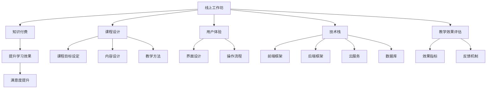

                 

# 如何打造知识付费的线上工作坊

> 关键词：线上工作坊,知识付费,课程设计,用户体验,技术栈,教学效果评估

## 1. 背景介绍

在知识付费日益普及的今天，线上工作坊因其灵活性和互动性，成为了用户获取知识的重要方式。如何设计一门优质的线上工作坊，让其既能吸引学员参与，又能获得良好的学习效果，是知识付费平台关注的重点。本文将从课程设计、技术栈选择、用户体验优化、教学效果评估等多个维度出发，系统介绍如何打造出受欢迎的知识付费线上工作坊。

## 2. 核心概念与联系

### 2.1 核心概念概述

为更好地理解线上工作坊的构建流程，本节将介绍几个密切相关的核心概念：

- **线上工作坊(Online Workshop)**：通过网络平台，面向在线学员提供的集中教学和互动活动。通常由一系列主题明确、时长固定的课程组成。
- **知识付费(Knowledge-Paying)**：用户通过付费获取高质量知识内容的服务模式。线上工作坊作为知识付费的一种形式，强调内容的价值和服务的体验。
- **课程设计(Course Design)**：围绕既定目标，规划工作坊的课程结构、内容安排、教学方法等。科学合理的课程设计能提升学习效果。
- **用户体验(User Experience, UX)**：从学员的角度出发，设计简洁直观、互动性强的工作坊界面和操作流程，提升用户参与感和满意度。
- **技术栈(Tech Stack)**：工作坊开发过程中涉及的各种技术和工具，包括前后端框架、云服务、数据库等。
- **教学效果评估(Teaching Effect Evaluation)**：通过科学方法测量学员的学习成果和满意度，为课程迭代提供依据。

这些核心概念之间的逻辑关系可以通过以下Mermaid流程图来展示：



这个流程图展示了大语言模型微调的核心概念及其之间的关系：

1. 线上工作坊作为知识付费的载体，以课程设计为核心，辅以用户体验和技术栈支持，并最终通过教学效果评估反馈迭代。
2. 课程设计需明确工作坊的目标、内容、教学方法，从而规划课程结构。
3. 用户体验涉及界面设计和操作流程，提升学员的参与感。
4. 技术栈的选择影响前后端性能、扩展性和可维护性。
5. 教学效果评估通过指标和反馈，不断优化课程设计，提升教学效果。

这些概念共同构成了线上工作坊的知识付费体系，使其能够在各种场景下提供优质的学习体验。通过理解这些核心概念，我们可以更好地把握线上工作坊的工作原理和优化方向。

## 3. 核心算法原理 & 具体操作步骤

### 3.1 算法原理概述

设计一门线上工作坊的核心在于融合优质内容和科学教学方法，打造高互动性和高参与感的课程。具体来说，通过以下几个关键步骤，可以将线上工作坊落到实处：

1. **课程目标设定**：明确工作坊旨在解决的问题、希望学员达到的成果。
2. **内容设计**：选择适合学员水平和需求的知识模块，设计符合教学目标的课程内容。
3. **教学方法设计**：选择合适的教学方法，如互动讨论、案例分析、小组合作等，提升学习效果。
4. **用户体验设计**：优化界面设计，确保操作流畅，提高学员的参与感。
5. **技术栈选择与开发**：根据工作坊的设计要求，选择合适的技术栈，实现课程的在线互动和评估功能。
6. **教学效果评估**：设计科学的评估指标和反馈机制，评估学员的学习效果和满意度，为课程迭代提供依据。

### 3.2 算法步骤详解

#### 3.2.1 课程目标设定

工作坊的目标应具体、明确，如“掌握XXX技能”、“了解XXX领域的最新发展”等。根据目标，设计相应的课程大纲和教学内容。

#### 3.2.2 内容设计

选择适合学员水平和需求的知识模块，设计符合教学目标的课程内容。课程内容应包含理论讲解和实践操作，确保学员能够理解和应用所学知识。

#### 3.2.3 教学方法设计

选择合适的教学方法，如互动讨论、案例分析、小组合作等，提升学习效果。同时，合理分配课堂时间，确保理论讲解与实践操作的平衡。

#### 3.2.4 用户体验设计

优化界面设计，确保操作流畅，提高学员的参与感。界面设计应简洁直观，互动元素丰富，确保学员能顺畅地参与和反馈。

#### 3.2.5 技术栈选择与开发

根据工作坊的设计要求，选择合适的技术栈，实现课程的在线互动和评估功能。常用的技术栈包括但不限于：

- **前端框架**：如React、Vue.js等，实现互动界面和操作逻辑。
- **后端框架**：如Node.js、Django等，处理数据和逻辑业务。
- **云服务**：如AWS、阿里云等，提供稳定的运行环境和扩展性。
- **数据库**：如MySQL、MongoDB等，存储和管理课程数据。

#### 3.2.6 教学效果评估

设计科学的评估指标和反馈机制，评估学员的学习效果和满意度，为课程迭代提供依据。常用的评估指标包括：

- **知识掌握度**：通过测试题、项目作业等评估学员对知识的掌握情况。
- **参与度**：统计学员的互动次数、发言次数等，评估其参与度。
- **满意度**：通过问卷调查、反馈表等收集学员的满意度信息，了解课程的优缺点。

### 3.3 算法优缺点

线上工作坊作为一种灵活的教学形式，具有以下优点：

1. **灵活性**：学员可以根据自己的时间安排参与课程，不受地域限制。
2. **互动性**：通过互动讨论、案例分析等方式，提升学习效果。
3. **低成本**：相对于传统线下工作坊，线上工作坊的成本较低，学员无需舟车劳顿。

同时，线上工作坊也存在以下缺点：

1. **技术要求高**：需要较高的技术栈选择和开发能力，确保课程的稳定性和用户体验。
2. **自律性要求高**：学员需要较强的自律能力，遵循课程安排和要求。
3. **技术问题多**：网络延迟、设备问题等可能影响课程的正常进行。

尽管存在这些缺点，但就目前而言，线上工作坊作为一种灵活高效的教学方式，仍然具有广泛的应用前景。

### 3.4 算法应用领域

线上工作坊不仅适用于技能培训、技术学习等领域，还可以应用于知识传播、兴趣爱好培养等多个场景。例如：

- **编程技能培训**：提供代码编写、算法设计等编程技能培训。
- **设计思维课程**：通过案例分析和项目实践，提升学员的设计思维能力。
- **市场营销讲座**：邀请行业专家讲解市场营销知识，分享实战经验。
- **艺术创作指导**：提供绘画、音乐、舞蹈等艺术创作技巧的指导。

除了这些经典应用场景，线上工作坊还可以创新性地应用于更多领域，如教育普及、职业规划、心理辅导等，为学员提供全方位的学习和发展机会。

## 4. 数学模型和公式 & 详细讲解 & 举例说明

### 4.1 数学模型构建

假设一个线上工作坊有$N$门课程，每门课程的课时长度为$T$分钟，学员在课程中的参与度为$p_i$（$i=1,2,\dots,N$）。工作坊的总时长为$T_{total}$。

设每门课程的知识点数为$K_i$，学员在每门课程上掌握的知识掌握度为$s_i$，则整个工作坊的知识掌握度为：

$$
s = \sum_{i=1}^N s_i = \sum_{i=1}^N \frac{K_i}{T} p_i
$$

其中，$K_i$和$T$为固定值，$p_i$随课程的不同而变化。

### 4.2 公式推导过程

根据上述定义，我们可以得到以下公式：

$$
s = \sum_{i=1}^N \frac{K_i}{T} p_i
$$

其中，$K_i$和$T$为固定值，$p_i$随课程的不同而变化。

通过最大化$s$，我们可以找到最优的课程安排和教学方法，以提升整体知识掌握度。

### 4.3 案例分析与讲解

假设一个编程技能培训线上工作坊有3门课程，每门课程的课时长度为2小时。设第一门课程的知识点数为10，学员在第一门课程的参与度为80%；第二门课程的知识点数为20，学员在第二门课程的参与度为90%；第三门课程的知识点数为30，学员在第三门课程的参与度为70%。

则整个工作坊的知识掌握度为：

$$
s = \frac{10}{2} \times 0.8 + \frac{20}{2} \times 0.9 + \frac{30}{2} \times 0.7 = 17.2
$$

这意味着整个工作坊的知识掌握度为82.4%，其中第二门课程的贡献最大，第一门课程次之，第三门课程最小。

## 5. 项目实践：代码实例和详细解释说明

### 5.1 开发环境搭建

在进行线上工作坊开发前，我们需要准备好开发环境。以下是使用Python进行Flask开发的环境配置流程：

1. 安装Anaconda：从官网下载并安装Anaconda，用于创建独立的Python环境。

2. 创建并激活虚拟环境：
```bash
conda create -n workshop_env python=3.8 
conda activate workshop_env
```

3. 安装Flask：
```bash
pip install flask
```

4. 安装相关库：
```bash
pip install markdown django rest_framework 
```

完成上述步骤后，即可在`workshop_env`环境中开始线上工作坊的开发。

### 5.2 源代码详细实现

下面我们以编程技能培训为例，给出使用Flask实现线上工作坊的PyTorch代码实现。

首先，定义课程信息类：

```python
from flask import Flask, request, jsonify

app = Flask(__name__)

class Course:
    def __init__(self, title, content, target_skills):
        self.title = title
        self.content = content
        self.target_skills = target_skills

    def to_dict(self):
        return {
            'title': self.title,
            'content': self.content,
            'target_skills': self.target_skills
        }
```

然后，定义学员信息类：

```python
class Student:
    def __init__(self, name, email):
        self.name = name
        self.email = email

    def to_dict(self):
        return {
            'name': self.name,
            'email': self.email
        }
```

接下来，定义课程表信息类：

```python
class CourseSchedule:
    def __init__(self, courses, start_time, end_time):
        self.courses = courses
        self.start_time = start_time
        self.end_time = end_time

    def to_dict(self):
        return {
            'courses': [course.to_dict() for course in self.courses],
            'start_time': self.start_time,
            'end_time': self.end_time
        }
```

最后，实现Flask应用的主页和课程页面：

```python
@app.route('/')
def index():
    return "Welcome to the Online Workshop!"

@app.route('/courses')
def courses():
    courses = [
        Course('Python Basics', 'This course covers the fundamentals of Python programming.', ['Basic Python', 'Data Structures', 'Control Flow']),
        Course('Object-Oriented Programming', 'This course covers the principles of OOP in Python.', ['Inheritance', 'Polymorphism', 'Encapsulation']),
        Course('Web Development with Flask', 'This course teaches Flask basics and web development practices.', ['Flask Framework', 'RESTful APIs', 'Database Management'])
    ]
    return jsonify([course.to_dict() for course in courses])

if __name__ == '__main__':
    app.run(debug=True)
```

以上就是使用Flask实现线上工作坊的完整代码实现。可以看到，通过Flask的封装，我们可以用相对简洁的代码完成课程信息的展示和API接口的实现。

### 5.3 代码解读与分析

让我们再详细解读一下关键代码的实现细节：

**Course类**：
- `__init__`方法：初始化课程的标题、内容和目标技能。
- `to_dict`方法：将课程信息转换为字典格式，方便API返回。

**Student类**：
- `__init__`方法：初始化学员的名称和邮箱。
- `to_dict`方法：将学员信息转换为字典格式，方便API返回。

**CourseSchedule类**：
- `__init__`方法：初始化课程表、开始时间和结束时间。
- `to_dict`方法：将课程表信息转换为字典格式，方便API返回。

**Flask应用**：
- `index`方法：展示欢迎页面。
- `courses`方法：通过API返回课程信息列表。
- `if __name__ == '__main__':`：启动Flask应用。

在Flask中，我们通过定义路由和处理函数，实现了课程信息的展示和API接口的返回。通过Flask的路由机制，可以方便地实现前后端数据的交互，提升用户的操作体验。

当然，工业级的系统实现还需考虑更多因素，如课程交互、作业提交、测试评估等。但核心的线上工作坊流程基本与此类似。

## 6. 实际应用场景

### 6.1 编程技能培训

通过线上工作坊，可以提供灵活高效的编程技能培训，帮助学员掌握各种编程语言和技术。例如，组织为期两周的Python编程线上工作坊，涵盖Python基础、数据结构、Web开发等主题，邀请资深工程师授课，提供实机编程环境，使学员能够边学边练，提升实战能力。

### 6.2 设计思维课程

设计思维是一种以用户为中心的创新方法，通过线上工作坊，可以帮助学员系统学习设计思维的各个环节，如用户研究、原型设计、迭代改进等。例如，组织为期四周的设计思维线上工作坊，结合具体案例，进行深入讲解和实践，使学员能够掌握设计思维的核心技能，应用于实际项目中。

### 6.3 市场营销讲座

市场营销是一个充满挑战的领域，线上工作坊可以帮助学员系统学习市场营销的理论和实践。例如，邀请知名市场营销专家授课，涵盖市场分析、品牌建设、数字营销等多个主题，提供实战案例，使学员能够了解市场营销的最新动态，提升职业竞争力。

### 6.4 未来应用展望

随着在线教育技术的不断进步，线上工作坊将在更多领域得到应用，为教育、培训、娱乐等领域带来新的发展机遇。

在教育领域，线上工作坊可以提供灵活多样的学习形式，满足不同学员的学习需求，推动教育公平和普及。

在培训领域，线上工作坊可以提供高效低成本的培训服务，提升企业员工的职业技能，推动企业的技术升级和创新。

在娱乐领域，线上工作坊可以结合游戏、直播等形式，提供有趣、互动的学习体验，提升用户粘性，促进文化消费。

## 7. 工具和资源推荐

### 7.1 学习资源推荐

为了帮助开发者系统掌握线上工作坊的理论基础和实践技巧，这里推荐一些优质的学习资源：

1. Coursera《How to Teach Online》课程：斯坦福大学开设的在线教育课程，讲解线上教学的设计和实施方法。
2. Udemy《Creating an Online Workshop》课程：Udemy平台上详细介绍线上工作坊设计、开发和管理的课程。
3. Coursera《Design Thinking for Managers》课程：斯坦福大学开设的设计思维课程，涵盖设计思维的多个环节。
4. Udacity《Data Science on Coursera》课程：Udacity平台上讲解数据科学基础和实践的课程。
5. edX《Coding and Software Development》课程：edX平台上讲解编程技能和软件开发实践的课程。

通过对这些资源的学习实践，相信你一定能够快速掌握线上工作坊的精髓，并用于解决实际的培训问题。

### 7.2 开发工具推荐

高效的开发离不开优秀的工具支持。以下是几款用于线上工作坊开发的常用工具：

1. Flask：基于Python的开源Web框架，灵活高效，适合快速迭代研究。可以用于构建课程页面和API接口。
2. React：基于JavaScript的前端库，构建互动性强、用户体验好的课程页面。
3. Django：基于Python的后端框架，提供丰富的扩展库，适合构建复杂的课程管理系统。
4. AWS：提供云服务器、数据库等基础设施，支持大规模课程部署。
5. Docker：容器化技术，提供稳定的运行环境，方便课程的部署和迁移。
6. TensorBoard：TensorFlow配套的可视化工具，可实时监测模型训练状态，优化性能。

合理利用这些工具，可以显著提升线上工作坊的开发效率，加快创新迭代的步伐。

### 7.3 相关论文推荐

线上工作坊的设计和开发涉及多个领域的技术和理论。以下是几篇经典的相关论文，推荐阅读：

1. "Online Learning: Principles and Practice" by Andrew Ng：Andrew Ng关于在线教育的经典文章，介绍了在线学习的原理和实践。
2. "Design Thinking for Design Thinking" by Tim Brown：Tim Brown关于设计思维的权威著作，讲解设计思维的各个环节。
3. "Teaching Large-Scale Online Courses" by Jim Doyle：Jim Doyle关于大规模在线课程设计和管理的经验分享。
4. "Online Teaching: Learning from the Best Practices" by Steven Dash：Steven Dash关于在线教学的最佳实践总结。
5. "Design and Development of Web-Based Training for Employees in the Construction Industry" by S. J. Patel：S. J. Patel关于Web培训系统设计的论文。

这些论文代表了线上工作坊设计和开发的重要研究成果，通过学习这些前沿成果，可以帮助研究者把握学科前进方向，激发更多的创新灵感。

## 8. 总结：未来发展趋势与挑战

### 8.1 研究成果总结

本文对线上工作坊的构建流程进行了系统介绍。首先阐述了线上工作坊在知识付费中的重要地位，明确了课程设计在其中的核心作用。其次，从课程设计、技术栈选择、用户体验优化、教学效果评估等多个维度，详细讲解了线上工作坊的构建方法。最后，通过实际应用场景和未来展望，展示了线上工作坊的广阔前景。

通过本文的系统梳理，可以看到，线上工作坊作为一种灵活高效的教学方式，在知识付费领域具有广泛的应用前景。未来，伴随在线教育技术的不断进步，线上工作坊必将在更多领域得到应用，为教育、培训、娱乐等领域带来新的发展机遇。

### 8.2 未来发展趋势

展望未来，线上工作坊作为一种灵活高效的教学方式，将呈现以下几个发展趋势：

1. **技术融合**：线上工作坊将与其他新兴技术，如AI、VR、AR等融合，提供更沉浸式、互动性的学习体验。
2. **个性化学习**：通过数据分析，提供个性化推荐和定制化课程，提升学习效果。
3. **社会化学习**：鼓励学员之间的互动和合作，构建社交化学习社区，增强学习的参与感和动力。
4. **跨领域整合**：与其他领域的知识进行整合，如心理学、经济学等，提供跨学科的课程内容。
5. **终身学习**：为学员提供终身学习的平台，不断更新课程内容，适应技术进步和行业变化。

以上趋势凸显了线上工作坊的巨大潜力和发展方向。这些方向的探索发展，必将进一步提升线上工作坊的适应性和灵活性，推动知识付费平台的发展和创新。

### 8.3 面临的挑战

尽管线上工作坊作为一种高效的教学方式，但在推广应用的过程中，仍面临诸多挑战：

1. **技术壁垒**：高质量的线上工作坊需要较高的技术栈选择和开发能力，这对技术团队提出了较高的要求。
2. **学员自律性**：在线学习需要较强的自律性，学员需要自我管理和约束，才能保证学习效果。
3. **网络稳定性**：网络延迟、带宽不足等问题可能影响课程的正常进行，需要可靠的网络保障。
4. **内容质量**：线上工作坊需要高质量的课程内容和教学方法，避免课程流于形式，无法提供实际价值。
5. **市场竞争**：知识付费平台众多，如何通过差异化策略和优质服务，吸引和留住学员，是平台面临的重要挑战。

尽管存在这些挑战，但线上工作坊作为一种灵活高效的教学方式，仍然具有广阔的应用前景。未来，随着技术的进步和市场的成熟，线上工作坊必将在更多领域得到推广和应用，为知识传播和教育普及提供新的解决方案。

### 8.4 研究展望

面对线上工作坊所面临的挑战，未来的研究需要在以下几个方面寻求新的突破：

1. **技术标准化**：制定线上工作坊的技术标准，提升课程开发和管理的规范性。
2. **内容多样化**：丰富课程内容和形式，涵盖多种学科和领域，提升课程的多样性和实用性。
3. **学习数据分析**：通过大数据分析，提供个性化的学习建议和优化方案，提升学习效果。
4. **社会化互动**：构建社交化学习社区，促进学员之间的交流和合作，提升学习动力和参与感。
5. **多平台整合**：整合多种教学平台和工具，提供一站式学习体验，提升学习便利性。

这些研究方向将推动线上工作坊的不断创新和优化，提升其适应性和灵活性，为知识付费平台的可持续发展提供坚实的基础。总之，线上工作坊作为一种灵活高效的教学方式，具有广阔的应用前景，需要在技术、内容、管理等多个维度不断创新和优化，才能真正实现其价值和潜力。

## 9. 附录：常见问题与解答

**Q1：线上工作坊是否适用于所有学科和领域？**

A: 线上工作坊适用于大多数学科和领域，特别是适合需要灵活教学和互动性的课程。例如，编程技能、设计思维、市场营销等，非常适合采用线上工作坊形式。但对于一些需要现场实验和实操的课程，线上工作坊可能存在局限性。

**Q2：如何设计科学的教学效果评估指标？**

A: 科学的教学效果评估指标应该能够全面反映学员的学习成果和满意度。常用的指标包括：
- 知识掌握度：通过测试题、项目作业等评估学员对知识的掌握情况。
- 参与度：统计学员的互动次数、发言次数等，评估其参与度。
- 满意度：通过问卷调查、反馈表等收集学员的满意度信息，了解课程的优缺点。

**Q3：线上工作坊如何保证学员的参与感和互动性？**

A: 保证学员的参与感和互动性是线上工作坊成功的关键。可以通过以下方式实现：
- 互动讨论：通过论坛、聊天室等工具，鼓励学员之间的交流和讨论。
- 案例分析：结合具体案例，进行深入讲解和互动。
- 小组合作：将学员分组进行项目合作，共同解决问题，增强互动和协作。
- 实时反馈：提供实时反馈和评价，及时调整课程内容和方法。

**Q4：线上工作坊如何保证课程的质量和规范性？**

A: 线上工作坊的质量和规范性需要制度保障。可以通过以下方式实现：
- 课程认证：制定严格的课程认证标准，确保课程质量。
- 教学评估：定期进行教学评估，收集反馈，持续改进课程内容和方法。
- 标准化流程：制定标准化课程开发和实施流程，确保课程规范性和一致性。

**Q5：线上工作坊如何适应不同学员的学习需求？**

A: 线上工作坊需要灵活适应不同学员的学习需求。可以通过以下方式实现：
- 个性化推荐：通过数据分析，提供个性化的学习建议和优化方案，提升学习效果。
- 自主学习：提供自主学习路径和资源，学员可以根据自己的需求和时间安排学习。
- 多样化内容：丰富课程内容和形式，涵盖多种学科和领域，提升课程的多样性和实用性。

通过这些策略，线上工作坊可以更好地满足不同学员的学习需求，提升学习效果和满意度。

---

作者：禅与计算机程序设计艺术 / Zen and the Art of Computer Programming

