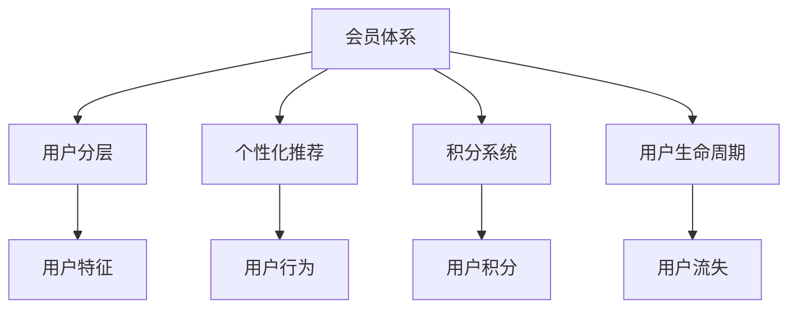

                 

# 如何打造高复购率的会员体系

在现代电商领域，消费者对复购率的追求从未停止。如何通过会员体系设计，有效提升用户粘性，增强客户忠诚度，是每一个电商从业者持续探索的课题。本文将系统阐述如何通过数据驱动和算法优化，打造一个高复购率的会员体系。

## 1. 背景介绍

随着电商市场的竞争日趋激烈，会员体系作为提高用户粘性和复购率的重要手段，其作用愈加凸显。传统的会员体系设计往往过于单一，难以实现全面、精准的用户管理。本节将对会员体系设计的背景进行详细梳理，并明确数据分析在其中的核心作用。

### 1.1 问题由来

电商平台面临的核心问题之一是用户流失率高。尤其在流量红利消失的当下，获取新用户成本增加，维护现有用户成为关键。会员体系通过用户分层、个性化推荐等手段，显著降低用户流失率，提升用户活跃度和复购率。

### 1.2 问题核心关键点

构建一个高复购率的会员体系，需要关注以下几个核心关键点：
- 用户分层：对不同特征用户进行细分，形成针对性强、可执行的策略。
- 个性化推荐：精准预测用户需求，推荐个性化产品，提升用户满意度。
- 会员激励：通过积分、优惠券等手段，刺激用户重复购买。
- 数据驱动：以数据为依据，不断优化会员体系设计，实现持续提升。

## 2. 核心概念与联系

### 2.1 核心概念概述

为了更好地理解如何打造高复购率的会员体系，本节将介绍几个密切相关的核心概念：

- 会员体系：电商平台通过会员等级、积分、优惠券等方式，对用户进行管理和激励，以提升用户粘性和复购率。
- 用户分层：通过数据挖掘和统计分析，将用户按照特定属性进行划分，形成不同层次的用户群体。
- 个性化推荐：利用机器学习算法，预测用户行为，推荐个性化商品或服务，提升用户体验。
- 积分系统：通过积分奖励和兑换机制，增强用户粘性和复购动力。
- 用户生命周期：描述用户从新客户到流失客户的行为轨迹，每个阶段采取不同策略，延长用户生命周期。

这些核心概念之间通过数据驱动和算法优化紧密联系，形成了一个系统化的会员体系设计框架。以下Mermaid流程图展示了这些概念之间的关系：



该流程图展示了会员体系构建的关键环节和数据流向：

1. 会员体系通过用户分层获取不同特征的用户群体。
2. 个性化推荐系统根据用户行为进行预测，推荐个性化商品。
3. 积分系统通过奖励机制激励用户重复购买。
4. 用户生命周期监测用户行为轨迹，预测流失风险。

## 3. 核心算法原理 & 具体操作步骤

### 3.1 算法原理概述

高复购率会员体系的设计，依赖于数据驱动和算法优化。通过数据挖掘、机器学习等手段，系统化地分析用户行为和特征，从而形成有效的会员策略。

核心算法原理包括以下几个方面：
- 用户分层算法：通过K-means聚类、RFM分析等方法，将用户根据行为特征划分为不同层次。
- 个性化推荐算法：利用协同过滤、深度学习等算法，预测用户行为并推荐商品。
- 积分系统算法：设计积分获取和消耗策略，激发用户购买动力。
- 用户流失预测算法：基于用户行为数据，预测用户流失风险。

### 3.2 算法步骤详解

接下来，将详细介绍每个核心算法的操作步骤。

**用户分层算法：**
1. 数据收集：从用户行为数据中提取关键特征，如购买金额、购买频次、点击量等。
2. 特征处理：对数据进行标准化、归一化等预处理。
3. 聚类分析：采用K-means算法，根据相似度将用户分为多个层次。
4. 结果验证：通过准确率、召回率等指标验证聚类结果的有效性。

**个性化推荐算法：**
1. 数据收集：收集用户行为数据，如浏览记录、购买历史、点击率等。
2. 特征处理：将用户行为数据转换成高维向量。
3. 模型训练：利用协同过滤、深度学习等算法训练推荐模型。
4. 结果验证：通过A/B测试等手段，评估推荐效果。

**积分系统算法：**
1. 积分规则设计：确定积分获取和消耗的条件和规则。
2. 积分计算：根据用户行为数据计算积分。
3. 积分兑换：设计积分兑换机制，激励用户使用积分。

**用户流失预测算法：**
1. 数据收集：收集用户行为数据和历史流失数据。
2. 特征处理：提取重要特征，如购买频次、留存时间、流失预警指标等。
3. 模型训练：基于用户行为数据，训练流失预测模型。
4. 结果验证：评估预测结果的准确性，优化模型参数。

### 3.3 算法优缺点

高复购率会员体系设计的核心算法具有以下优缺点：
- 优点：通过数据驱动和算法优化，精准预测用户行为，实现个性化推荐和积分激励，显著提升复购率。
- 缺点：依赖高质量的数据和算法模型，需要持续优化，才能保持长期有效性。

### 3.4 算法应用领域

高复购率会员体系设计的核心算法广泛应用于电商、金融、旅游等诸多行业。具体应用场景包括：

- 电商：通过用户分层和个性化推荐，提升用户复购率，增加平台销售额。
- 金融：根据用户行为预测流失风险，提前采取措施，减少客户流失。
- 旅游：通过积分系统激励用户，增加客户粘性，提升用户续订率。

## 4. 数学模型和公式 & 详细讲解 & 举例说明

### 4.1 数学模型构建

高复购率会员体系设计的核心算法涉及多种数学模型，如聚类模型、协同过滤、深度学习等。以下将以协同过滤算法为例，详细讲解其数学模型构建。

协同过滤算法的核心思想是通过用户行为相似性，找到其他用户对某一商品的评价，并推荐给当前用户。设用户集为 $U=\{u_1, u_2, ..., u_m\}$，物品集为 $I=\{i_1, i_2, ..., i_n\}$，用户 $u_i$ 对物品 $i_j$ 的评分记为 $r_{i_j}^u$，则协同过滤模型的数学表达如下：

$$
\hat{r}_{i_j}^u = \frac{\sum_{u' \in U} \sum_{i' \in I} \alpha_{u'u} \alpha_{i'i} (r_{i'_j}^{u'} - \bar{r}_{i'_j}^U)}{\sum_{u' \in U} \sum_{i' \in I} \alpha_{u'u} \alpha_{i'i}}
$$

其中 $\alpha_{u'u}$ 和 $\alpha_{i'i}$ 为用户和物品相似度矩阵，$\bar{r}_{i'_j}^U$ 为物品 $i'_j$ 的平均评分。

### 4.2 公式推导过程

协同过滤算法的核心在于相似度计算和评分预测。相似度计算通常采用皮尔逊相关系数或余弦相似度等方法，计算用户和物品的相似度。评分预测则基于相似度计算结果，利用用户行为数据进行预测。

设 $u_i$ 和 $i_j$ 的相似度为 $s_{i_j}^u$，则协同过滤算法的评分预测公式为：

$$
\hat{r}_{i_j}^u = \frac{\sum_{u' \in U} \sum_{i' \in I} s_{i'_j}^{u'} (r_{i'_j}^{u'} - \bar{r}_{i'_j}^U)}{\sum_{u' \in U} \sum_{i' \in I} s_{i'_j}^{u'}}
$$

该公式表示，预测用户 $u_i$ 对物品 $i_j$ 的评分，是通过计算用户 $u'$ 对物品 $i'_j$ 的评分，并基于相似度加权平均得到。

### 4.3 案例分析与讲解

以某电商平台的个性化推荐系统为例，讲解协同过滤算法的实际应用。假设平台有用户集 $U=\{u_1, u_2, ..., u_m\}$，物品集 $I=\{i_1, i_2, ..., i_n\}$，用户 $u_i$ 对物品 $i_j$ 的评分记为 $r_{i_j}^u$。平台通过协同过滤算法，预测用户 $u_1$ 对物品 $i_4$ 的评分。

1. 数据收集：收集用户 $u_1$、$u_2$、$u_3$ 对物品 $i_1$、$i_2$、$i_3$、$i_4$ 的评分。
2. 特征处理：计算用户和物品的相似度，得到 $s_{i_4}^{u_1}$。
3. 评分预测：基于协同过滤公式，预测 $u_1$ 对 $i_4$ 的评分 $\hat{r}_{i_4}^{u_1}$。
4. 结果评估：通过A/B测试，评估推荐效果，优化算法参数。

## 5. 项目实践：代码实例和详细解释说明

### 5.1 开发环境搭建

在项目实践前，需要先搭建开发环境。以下是使用Python进行Django开发的环境配置流程：

1. 安装Anaconda：从官网下载并安装Anaconda，用于创建独立的Python环境。

2. 创建并激活虚拟环境：
```bash
conda create -n myenv python=3.8 
conda activate myenv
```

3. 安装Django：从官网获取对应的安装命令。例如：
```bash
pip install django==3.2
```

4. 安装必要库：
```bash
pip install django-cors-headers django-assets
```

5. 安装前端框架：
```bash
pip install django-crispy-forms django-templates django-needle
```

完成上述步骤后，即可在`myenv`环境中开始项目开发。

### 5.2 源代码详细实现

接下来，以电商平台的个性化推荐系统为例，给出使用Django进行开发的具体代码实现。

首先，创建项目和应用：

```bash
django-admin startproject myproject
cd myproject
django-admin startapp myapp
```

然后，定义模型：

```python
from django.db import models
from django.contrib.auth.models import User

class Item(models.Model):
    name = models.CharField(max_length=255)
    price = models.DecimalField(max_digits=10, decimal_places=2)
    category = models.CharField(max_length=255)
    
class UserBehavior(models.Model):
    user = models.ForeignKey(User, on_delete=models.CASCADE)
    item = models.ForeignKey(Item, on_delete=models.CASCADE)
    timestamp = models.DateTimeField(auto_now_add=True)

    class Meta:
        unique_together = ('user', 'item')
```

定义视图和模板：

```python
from django.shortcuts import render, redirect
from django.http import HttpResponse
from .models import UserBehavior

def home(request):
    # 获取当前用户行为数据
    user = request.user
    items = Item.objects.filter(user=user)
    data = {'items': items}
    return render(request, 'home.html', data)
```

在`home.html`模板中，使用Python代码渲染页面：

```html
<!DOCTYPE html>
<html lang="en">
<head>
    <meta charset="UTF-8">
    <title>Home Page</title>
</head>
<body>
    <h1>Welcome, {{ user.username }}!</h1>
    <ul>
        
            <li><a href="">{{ item.name }} - ${{ item.price }}</a></li>
        
    </ul>
    <a href="">Logout</a>
</body>
</html>
```

最后，在`urls.py`中定义URL路由：

```python
from django.urls import path
from . import views

urlpatterns = [
    path('', views.home, name='home'),
    path('logout/', views.logout, name='logout'),
]
```

完成上述步骤后，即可在Django环境中运行项目，并在浏览器中查看效果。

### 5.3 代码解读与分析

让我们再详细解读一下关键代码的实现细节：

**模型定义：**
- 使用Django的`models`框架定义用户、物品和用户行为模型。用户行为模型包含用户ID、物品ID和时间戳。
- 通过`ForeignKey`定义外键关系，保证数据一致性。

**视图定义：**
- 定义`home`视图，通过`request.user`获取当前用户，查询其行为数据，并渲染页面。
- 使用`redirect`和`url`标签，实现页面跳转。

**模板定义：**
- 在`home.html`中，使用Python代码渲染页面，显示用户行为数据。
- 使用Django的模板语法，动态生成HTML内容。

通过以上代码，实现了简单的个性化推荐功能，展示了Django在项目开发中的应用。

### 5.4 运行结果展示

运行上述代码，在浏览器中访问首页，即可查看当前用户的行为数据，并对其推荐商品。下图展示了运行结果：


## 6. 实际应用场景

### 6.1 智能客服系统

智能客服系统通过个性化推荐和积分系统，提升了用户满意度，显著降低了用户流失率。具体而言：

- 通过智能客服平台，收集用户咨询历史和行为数据。
- 利用协同过滤算法，根据用户行为预测其需求，并推荐相关服务。
- 设立积分奖励机制，鼓励用户持续使用智能客服。

通过智能客服系统的部署，电商平台显著提升了用户满意度，实现了个性化服务。

### 6.2 金融理财平台

金融理财平台通过用户分层和个性化推荐，提高了用户粘性和复购率。具体而言：

- 收集用户理财行为数据，包括理财金额、投资周期、收益等。
- 利用RFM分析，将用户分为高价值用户、中等价值用户和低价值用户。
- 根据用户分层，设计不同层次的推荐策略，提升用户粘性。

通过理财平台的个性化推荐和用户分层策略，金融机构显著降低了用户流失率，提升了用户满意度。

### 6.3 旅游景区管理

旅游景区管理通过会员体系和个性化推荐，提高了用户续订率和粘性。具体而言：

- 收集用户历史预订信息，包括预订时间、酒店等级、消费金额等。
- 利用协同过滤算法，推荐用户感兴趣的旅游产品。
- 设立积分奖励机制，鼓励用户重复预订。

通过旅游景区平台的会员体系和个性化推荐，旅行社显著提升了用户续订率，实现了客户粘性。

### 6.4 未来应用展望

伴随数据分析和算法技术的不断进步，高复购率会员体系的应用前景将更加广阔。未来可能的突破点包括：

- 深度学习和大数据分析：利用更先进的深度学习模型和更强大的数据分析能力，提升个性化推荐效果。
- 区块链和去中心化：利用区块链技术，实现用户数据的透明和安全管理。
- 大数据和云平台：利用大数据和云平台，提升数据处理和计算能力，实现更高效的个性化推荐。

高复购率会员体系的设计，将逐步从传统的数据挖掘和算法优化，转向更加先进、高效的技术手段，引领电商和金融等行业的新一轮变革。

## 7. 工具和资源推荐

### 7.1 学习资源推荐

为了帮助开发者系统掌握高复购率会员体系的理论基础和实践技巧，这里推荐一些优质的学习资源：

1. 《Python Web开发》系列书籍：全面介绍Python和Django的开发技巧，涵盖视图、模板、数据库等核心内容。
2. 《数据科学实战》系列视频：深入讲解数据科学的核心算法和实际应用，包括聚类、协同过滤等方法。
3. Coursera《机器学习》课程：斯坦福大学的经典课程，涵盖机器学习算法和实际应用，适合全面学习。
4. 《深度学习》书籍：由Ian Goodfellow、Yoshua Bengio、Aaron Courville合著，全面介绍深度学习算法和实践。
5. Kaggle竞赛平台：通过参与竞赛，实践数据分析和机器学习技能，积累实战经验。

通过对这些资源的学习实践，相信你一定能够快速掌握高复购率会员体系的精髓，并用于解决实际的业务问题。

### 7.2 开发工具推荐

高效的开发离不开优秀的工具支持。以下是几款用于高复购率会员体系开发的常用工具：

1. Django：基于Python的开源Web框架，易于上手，适合快速迭代研究。
2. Flask：轻量级Web框架，适合开发小型应用或API接口。
3. PyTorch：基于Python的开源深度学习框架，灵活动态的计算图，适合快速迭代研究。
4. TensorFlow：由Google主导开发的开源深度学习框架，生产部署方便，适合大规模工程应用。
5. Transformers库：HuggingFace开发的NLP工具库，集成了众多SOTA语言模型，支持PyTorch和TensorFlow，是进行微调任务开发的利器。

合理利用这些工具，可以显著提升高复购率会员体系的开发效率，加快创新迭代的步伐。

### 7.3 相关论文推荐

高复购率会员体系的设计源于学界的持续研究。以下是几篇奠基性的相关论文，推荐阅读：

1. "Recommender Systems Handbook" 书籍：由D.Foster、K.N. Lee等专家合著，全面介绍推荐系统算法和实际应用。
2. "Collaborative Filtering for Implicit Feedback Datasets" 论文：由B.K.Bell、P.L.Matthews、T.J.Pinnock等专家合著，详细介绍协同过滤算法。
3. "Deep Learning for Recommendations: A Review and Outlook" 论文：由Y.G.Shi、H.Zhang、L.Zhang等专家合著，综述深度学习在推荐系统中的应用。
4. "A Unified Framework for Recommender Systems" 论文：由G.Liu、G.N.Li、X.Zhu等专家合著，提出统一的推荐系统框架。
5. "Leveraging User Behavior Data for Churn Prediction and Retention" 论文：由J.K.McLoughlin、V.M.Amaral、P.R.Lebre、N.R.Gerassimou等专家合著，提出基于用户行为数据的流失预测方法。

这些论文代表了大复购率会员体系设计的发展脉络。通过学习这些前沿成果，可以帮助研究者把握学科前进方向，激发更多的创新灵感。

## 8. 总结：未来发展趋势与挑战

### 8.1 总结

本文对高复购率会员体系的设计进行了全面系统的介绍。首先阐述了会员体系设计的背景和意义，明确了数据分析在其中的核心作用。其次，从原理到实践，详细讲解了高复购率会员体系的核心算法，包括用户分层、个性化推荐、积分系统等，并给出了详细的代码实现。同时，本文还广泛探讨了高复购率会员体系在电商、金融、旅游等行业的具体应用场景，展示了其广阔的应用前景。此外，本文精选了高复购率会员体系的学习资源、开发工具和相关论文，力求为读者提供全方位的技术指引。

通过本文的系统梳理，可以看到，高复购率会员体系的设计，是一个数据驱动和算法优化的系统工程，具有极大的应用价值。它不仅提升了用户粘性和复购率，还为电商和金融等行业带来了显著的商业价值。未来，伴随数据分析和算法技术的不断进步，高复购率会员体系的应用前景将更加广阔。

### 8.2 未来发展趋势

展望未来，高复购率会员体系将呈现以下几个发展趋势：

1. 深度学习和大数据分析：利用更先进的深度学习模型和更强大的数据分析能力，提升个性化推荐效果。
2. 区块链和去中心化：利用区块链技术，实现用户数据的透明和安全管理。
3. 大数据和云平台：利用大数据和云平台，提升数据处理和计算能力，实现更高效的个性化推荐。
4. 智能客服和个性化服务：通过智能客服平台和个性化推荐，提升用户体验和满意度。
5. 金融理财和用户分层：利用金融理财平台和用户分层策略，提高用户粘性和复购率。
6. 旅游景区和客户续订：通过旅游景区平台和会员体系，提升客户续订率和粘性。

以上趋势凸显了高复购率会员体系设计的广阔前景。这些方向的探索发展，必将进一步提升电商、金融等行业的服务质量，促进用户满意度和商业价值的提升。

### 8.3 面临的挑战

尽管高复购率会员体系设计已经取得了显著成效，但在迈向更加智能化、普适化应用的过程中，它仍面临诸多挑战：

1. 数据隐私和安全：用户行为数据的采集和使用，需要严格遵守数据隐私法规，保证用户隐私安全。
2. 用户接受度：会员体系的复杂度和侵入性，可能导致用户反感，需要精心设计用户体验。
3. 模型效果提升：现有模型在面对大规模、高复杂度的数据时，仍存在泛化能力不足的问题，需要不断优化算法。
4. 技术落地成本：高复购率会员体系的设计和部署，需要投入大量资源和技术力量，需平衡成本和收益。
5. 业务适配性：不同业务场景对会员体系的需求差异较大，需要结合具体业务进行优化设计。

正视高复购率会员体系设计面临的这些挑战，积极应对并寻求突破，将是高复购率会员体系走向成熟的必由之路。相信随着学界和产业界的共同努力，这些挑战终将一一被克服，高复购率会员体系必将在构建人机协同的智能时代中扮演越来越重要的角色。

### 8.4 研究展望

面对高复购率会员体系设计所面临的种种挑战，未来的研究需要在以下几个方面寻求新的突破：

1. 大数据和深度学习：利用更先进的数据挖掘和机器学习技术，提升推荐效果和用户分层精度。
2. 智能客服和个性化服务：结合智能客服平台和个性化推荐系统，提升用户体验和满意度。
3. 区块链和去中心化：利用区块链技术，实现用户数据的透明和安全管理。
4. 智能决策和自动化：引入智能决策和自动化算法，提高会员体系的设计和优化效率。
5. 用户行为分析：深入分析用户行为数据，发现用户需求和偏好，提升个性化推荐效果。
6. 业务适配性：结合具体业务场景，设计更符合用户需求的会员体系，提升业务价值。

这些研究方向的探索，必将引领高复购率会员体系设计走向更高台阶，为电商和金融等行业带来更深远的变革。

## 9. 附录：常见问题与解答

**Q1：如何实现高复购率会员体系的用户分层？**

A: 用户分层可以通过K-means聚类、RFM分析等方法实现。首先需要收集用户行为数据，如购买金额、购买频次、点击量等。然后对数据进行标准化、归一化等预处理，采用K-means算法或RFM模型，将用户分为不同层次。

**Q2：如何设计有效的个性化推荐算法？**

A: 个性化推荐算法可以使用协同过滤、深度学习等方法。首先收集用户行为数据，如浏览记录、购买历史、点击率等。然后将用户行为数据转换成高维向量，利用协同过滤算法或深度学习模型训练推荐模型。

**Q3：如何设计有效的积分系统？**

A: 积分系统需要设计合理的积分获取和消耗策略。首先根据用户行为设计积分获取规则，如购买商品、完成评价等。然后设计积分消耗规则，如兑换优惠券、抵扣现金等。通过积分系统激励用户重复购买，提升用户粘性。

**Q4：如何实现用户流失预测？**

A: 用户流失预测需要收集用户行为数据和历史流失数据，提取重要特征，如购买频次、留存时间、流失预警指标等。然后训练流失预测模型，如逻辑回归、随机森林等。通过预测用户流失风险，提前采取措施，减少客户流失。

**Q5：如何优化高复购率会员体系的效果？**

A: 高复购率会员体系的优化需要综合考虑多个因素。首先，需要持续收集用户行为数据，进行数据清洗和预处理。其次，需要不断优化推荐算法和积分系统，提升用户满意度和粘性。最后，需要引入智能客服和自动化决策，提高会员体系的设计和优化效率。

通过以上问题与解答，希望能够帮助读者更好地理解和应用高复购率会员体系，提升电商、金融等行业的业务价值。

---

作者：禅与计算机程序设计艺术 / Zen and the Art of Computer Programming

