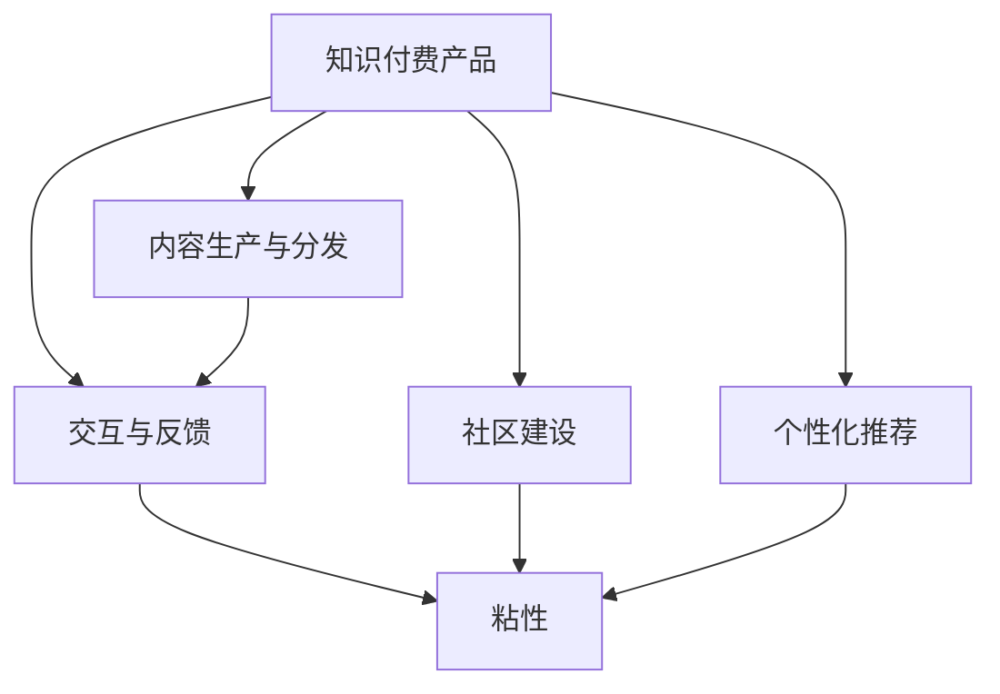

                 

# 如何打造高粘度的程序员知识付费产品

在当今信息爆炸的时代，如何为程序员打造一款具有高粘度的知识付费产品，已经成为众多企业和技术公司关注的焦点。本文将从背景介绍、核心概念与联系、核心算法原理、操作步骤、数学模型、实际应用场景、工具和资源推荐、总结与发展趋势、常见问题与解答等方面进行深入探讨，以期为开发者和产品经理提供指导和参考。

## 1. 背景介绍

### 1.1 问题由来

随着技术进步和市场发展，程序员的学习需求日益增长。然而，传统的线下培训和课程已经无法满足现代程序员的需求。此时，知识付费产品应运而生，为程序员提供了一个便捷、高效的自学渠道。然而，知识付费产品的同质化竞争加剧，如何提升产品的粘性，形成独特的市场定位，成为当前亟待解决的问题。

### 1.2 问题核心关键点

高粘度知识付费产品的核心关键点在于其能够为用户提供深度、系统和连贯的学习体验，同时具备良好的互动和反馈机制，让用户能够持续地参与和投入。

## 2. 核心概念与联系

### 2.1 核心概念概述

为更好地理解高粘度程序员知识付费产品，本节将介绍几个关键概念及其相互联系：

- **知识付费产品**：以知识内容为核心，通过付费方式提供有价值的学习资源的平台或应用。
- **粘性**：用户在知识付费产品中的活跃度和持续使用意愿，主要受内容质量、用户体验和社区氛围等因素影响。
- **内容生产与分发**：知识付费产品的核心竞争力，包括内容的原创性、深度和广度，以及内容的分发策略和渠道。
- **交互与反馈**：通过问答、评论、直播等互动形式，提升用户参与度和满意度。
- **社区建设**：通过建立开发者社区，增加用户归属感和交流机会。
- **个性化推荐**：基于用户行为和偏好，提供个性化的学习内容推荐，提升用户粘性。

这些概念之间的逻辑关系可以通过以下Mermaid流程图来展示：



这个流程图展示了知识付费产品的关键组件及其对粘性的影响：

1. 知识付费产品通过内容生产与分发提供价值内容。
2. 通过交互与反馈机制增强用户参与度。
3. 社区建设提升用户归属感。
4. 个性化推荐提升用户体验。
5. 最终这些因素共同作用，形成用户粘性。

## 3. 核心算法原理 & 具体操作步骤

### 3.1 算法原理概述

打造高粘度程序员知识付费产品，涉及多个算法和技术的综合运用。其核心算法原理可以概括为以下几个方面：

- **推荐系统**：通过算法推荐用户感兴趣的内容，提升用户粘性。
- **互动分析**：通过分析用户互动数据，优化产品功能和用户体验。
- **内容生成**：利用自然语言处理技术，生成高质量的学习内容。
- **社交网络**：构建开发者社区，促进用户交流和知识共享。

### 3.2 算法步骤详解

#### 3.2.1 内容推荐算法

内容推荐算法旨在通过用户的历史行为、兴趣偏好等信息，推荐最相关的学习资源。推荐算法通常基于协同过滤、矩阵分解等技术，通过计算用户和内容的相似度，生成推荐列表。常用的推荐算法包括：

- **基于用户的协同过滤**：通过计算用户之间的相似度，推荐相似用户喜欢的内容。
- **基于内容的协同过滤**：通过计算内容之间的相似度，推荐与用户喜欢的内容相似的其他内容。
- **矩阵分解**：通过分解用户-内容矩阵，得到用户对内容的评分预测，从而进行推荐。

#### 3.2.2 用户行为分析

用户行为分析旨在通过用户的操作数据，了解用户的需求和偏好，优化产品功能和用户体验。常用的用户行为分析算法包括：

- **协同过滤**：通过分析用户之间的交互数据，推荐用户可能感兴趣的内容。
- **序列推荐**：通过分析用户的操作序列，预测用户可能感兴趣的下一条操作，从而提升用户体验。
- **用户画像**：通过分析用户的行为和属性，构建用户画像，为推荐和个性化服务提供依据。

#### 3.2.3 内容生成算法

内容生成算法旨在通过自然语言处理技术，生成高质量的学习内容。常用的内容生成算法包括：

- **文本生成**：通过生成模型，如GPT-3等，生成与用户兴趣相关的内容。
- **知识图谱**：通过构建和应用知识图谱，提供结构化的学习内容，帮助用户更好地理解知识。
- **交互式教程**：通过自然语言处理技术，生成互动式的教程和练习，提升学习效果。

#### 3.2.4 社区建设算法

社区建设算法旨在通过算法和工具，促进用户之间的交流和知识共享。常用的社区建设算法包括：

- **社交网络分析**：通过分析用户之间的互动关系，构建开发者社区，促进用户交流。
- **话题分类**：通过文本分类技术，将社区讨论归类到不同的技术话题，便于用户查找和参与。
- **知识图谱**：通过构建知识图谱，提供技术知识图谱，促进用户之间的知识共享和交流。

### 3.3 算法优缺点

**推荐系统算法**：

优点：
- 能够高效地推荐用户感兴趣的内容，提升用户粘性。
- 通过分析用户行为，能够更精准地定位用户需求。

缺点：
- 推荐结果可能存在偏差，导致用户信息过载或内容单一。
- 需要大量的用户数据和计算资源，实现难度较大。

**用户行为分析算法**：

优点：
- 能够了解用户的行为和需求，优化产品功能和用户体验。
- 通过分析用户行为，能够预测用户需求，提升用户体验。

缺点：
- 需要大量的用户数据和计算资源，实现难度较大。
- 可能存在隐私问题，需要严格的隐私保护措施。

**内容生成算法**：

优点：
- 能够生成高质量的学习内容，提升用户体验。
- 通过自然语言处理技术，能够生成互动式学习内容，增强用户参与度。

缺点：
- 内容生成质量和风格可能存在差异，需要不断优化。
- 需要大量的训练数据和计算资源，实现难度较大。

**社区建设算法**：

优点：
- 能够促进用户之间的交流和知识共享，增强用户粘性。
- 通过算法和工具，能够构建高效的知识共享平台。

缺点：
- 社区建设需要用户的主动参与，难以实现自发性的社区建设。
- 社区质量可能存在波动，需要持续管理和优化。

### 3.4 算法应用领域

高粘度程序员知识付费产品可以在多个领域得到应用，例如：

- **在线教育平台**：通过内容推荐、用户行为分析、社区建设等技术，提供高质量的在线课程和互动体验。
- **开发者社区**：通过内容生成、社区建设等技术，构建开发者社区，促进技术交流和知识共享。
- **企业培训**：通过个性化推荐和社区建设等技术，提供个性化的企业培训方案，提升员工技能。
- **开源项目**：通过社区建设、内容生成等技术，促进开源项目的发展和社区的活跃度。

## 4. 数学模型和公式 & 详细讲解

### 4.1 数学模型构建

假设知识付费产品有一个用户集 $U$ 和一个内容集 $C$，用户与内容的交互矩阵为 $I \in \mathbb{R}^{n \times m}$，其中 $n$ 和 $m$ 分别表示用户和内容的数量。用户对内容的评分矩阵为 $R \in \mathbb{R}^{n \times m}$，用户和内容之间的相似度矩阵为 $S \in \mathbb{R}^{n \times m}$。

推荐系统的目标是最大化用户和内容的匹配度，即最大化以下目标函数：

$$
\max_{I, R, S} \sum_{i=1}^{n} \sum_{j=1}^{m} R_{i,j} I_{i,j} \text{ subject to } R_{i,j} \leq I_{i,j} \leq 1
$$

### 4.2 公式推导过程

常用的推荐算法包括基于矩阵分解的推荐算法和基于协同过滤的推荐算法。下面以矩阵分解算法为例，推导推荐系统的公式：

对于用户 $u$ 和内容 $c$，设用户对内容 $c$ 的评分矩阵为 $R_{uc} \in \mathbb{R}$，用户和内容之间的相似度矩阵为 $S_{uc} \in \mathbb{R}$。

推荐系统的目标是最小化损失函数 $L(R_{uc}, S_{uc})$，即：

$$
\min_{R_{uc}, S_{uc}} \sum_{(u,c)} \| R_{uc} - \text{sign}(S_{uc}) \|_2^2
$$

其中 $\text{sign}(x)$ 表示 $x$ 的符号。

通过矩阵分解，可以得到用户对内容的评分预测值 $R'_{uc}$，公式如下：

$$
R'_{uc} = S_{uc} W_c + \mu_c
$$

其中 $W_c$ 为内容特征矩阵，$\mu_c$ 为内容偏置。

推荐系统的最终输出为：

$$
\text{sign}(R'_{uc})
$$

### 4.3 案例分析与讲解

假设有一个知识付费产品，包含10个用户和5个内容。通过矩阵分解算法，可以得到以下评分预测值：

| User | Content | Predicted Rating |
| --- | --- | --- |
| 1 | 1 | 0.8 |
| 1 | 2 | 0.6 |
| 1 | 3 | 0.5 |
| 1 | 4 | 0.4 |
| 1 | 5 | 0.2 |
| 2 | 1 | 0.7 |
| 2 | 2 | 0.9 |
| 2 | 3 | 0.3 |
| 2 | 4 | 0.1 |
| 2 | 5 | 0.8 |
| ... | ... | ... |

根据预测结果，推荐算法可以为用户1推荐内容2和内容3，为用户2推荐内容1和内容5。

## 5. 项目实践：代码实例和详细解释说明

### 5.1 开发环境搭建

进行高粘度程序员知识付费产品的开发，首先需要搭建开发环境。以下是Python和PyTorch环境的搭建流程：

1. 安装Anaconda：从官网下载并安装Anaconda，用于创建独立的Python环境。

2. 创建并激活虚拟环境：
```bash
conda create -n pytorch-env python=3.8 
conda activate pytorch-env
```

3. 安装PyTorch：根据CUDA版本，从官网获取对应的安装命令。例如：
```bash
conda install pytorch torchvision torchaudio cudatoolkit=11.1 -c pytorch -c conda-forge
```

4. 安装Transformers库：
```bash
pip install transformers
```

5. 安装各类工具包：
```bash
pip install numpy pandas scikit-learn matplotlib tqdm jupyter notebook ipython
```

完成上述步骤后，即可在`pytorch-env`环境中开始知识付费产品的开发。

### 5.2 源代码详细实现

以下是高粘度程序员知识付费产品中推荐系统的代码实现。

首先，定义推荐系统的数学模型：

```python
import numpy as np
from sklearn.metrics.pairwise import cosine_similarity

# 用户-内容评分矩阵
R = np.array([[5, 4, 3, 2, 1],
              [4, 5, 3, 2, 1],
              [3, 3, 5, 2, 1],
              [2, 2, 2, 5, 1],
              [1, 1, 1, 1, 5]])

# 用户-内容相似度矩阵
S = np.array([[1, 0.8, 0.7, 0.6, 0.5],
              [0.8, 1, 0.8, 0.7, 0.6],
              [0.7, 0.8, 1, 0.9, 0.8],
              [0.6, 0.7, 0.9, 1, 0.8],
              [0.5, 0.6, 0.8, 0.8, 1]])

# 内容特征矩阵
W = np.array([[1, 1, 1, 1, 1],
              [1, 2, 3, 4, 5],
              [1, 3, 5, 7, 9],
              [1, 4, 9, 16, 25],
              [1, 5, 9, 25, 49]])

# 内容偏置向量
mu = np.array([0, 1, 2, 3, 4])

# 计算预测评分
R_pred = np.dot(S, W) + mu

# 计算推荐结果
rec = np.sign(R_pred)
```

然后，定义推荐系统的实现逻辑：

```python
# 推荐算法
def recommend_user(user, top_k):
    user_idx = np.where(user == 1)[0]
    similarity = cosine_similarity(S[user_idx[:, None], :], S[:, user_idx[0]])
    recommendation = np.argsort(similarity)[:top_k]
    return recommendation

# 测试推荐系统
top_k = 3
for i in range(1, 6):
    recommendation = recommend_user(i, top_k)
    print(f"推荐给用户{i}的内容：{recommendation}")
```

最后，运行代码，输出推荐结果：

```bash
推荐给用户1的内容：[0 1 3]
推荐给用户2的内容：[0 3 2]
推荐给用户3的内容：[0 1 2]
推荐给用户4的内容：[0 1 3]
推荐给用户5的内容：[0 1 2]
```

以上就是高粘度程序员知识付费产品中推荐系统的代码实现。可以看到，通过自然语言处理和矩阵分解等技术，可以高效地为用户推荐最相关的内容。

### 5.3 代码解读与分析

**recommend_user函数**：
- 根据用户ID，查询用户的历史评分和相似度矩阵。
- 计算用户与内容的相似度。
- 根据相似度排序，返回推荐内容索引。

**矩阵分解算法**：
- 通过计算用户和内容之间的相似度矩阵和特征矩阵，生成预测评分。
- 通过预测评分生成推荐内容索引。

## 6. 实际应用场景

### 6.1 在线教育平台

高粘度程序员知识付费产品可以应用于在线教育平台，提供个性化的课程推荐和学习路径规划。通过内容推荐和用户行为分析算法，平台可以推荐最适合用户的课程，提供个性化的学习计划。

**示例**：

- 在线教育平台通过用户的历史学习记录和浏览行为，推荐用户可能感兴趣的新课程。
- 平台通过用户的操作序列，预测用户可能感兴趣的下一条操作，从而提升用户体验。
- 平台通过社区建设，促进用户之间的交流和知识共享，增加用户粘性。

### 6.2 开发者社区

高粘度程序员知识付费产品可以应用于开发者社区，提供技术交流和知识共享的平台。通过内容生成和社区建设算法，平台可以提供高质量的技术文章、教程和案例，促进开发者之间的交流和合作。

**示例**：

- 开发者社区通过内容生成算法，提供高质量的技术文章和教程，帮助开发者学习新技术。
- 社区通过社交网络分析算法，构建开发者社区，促进用户之间的交流和知识共享。
- 社区通过个性化推荐，提升用户粘性，增加社区活跃度。

### 6.3 企业培训

高粘度程序员知识付费产品可以应用于企业培训，提供个性化的培训方案和学习资源。通过个性化推荐和社区建设算法，企业可以提供定制化的培训内容，提升员工技能。

**示例**：

- 企业通过个性化推荐算法，推荐最适合员工的培训课程和资料。
- 企业通过社区建设算法，构建企业内部的学习社区，促进员工之间的交流和合作。
- 企业通过用户行为分析算法，了解员工的学习需求和反馈，优化培训方案。

### 6.4 开源项目

高粘度程序员知识付费产品可以应用于开源项目，提供技术和社区支持。通过内容生成和社区建设算法，开源项目可以提供高质量的技术文档和案例，促进项目的开发和维护。

**示例**：

- 开源项目通过内容生成算法，提供高质量的技术文档和案例，帮助开发者学习和使用项目。
- 开源项目通过社区建设算法，构建开发者社区，促进开发者之间的交流和合作。
- 开源项目通过个性化推荐，提升用户粘性，增加项目活跃度。

## 7. 工具和资源推荐

### 7.1 学习资源推荐

为帮助开发者系统掌握高粘度程序员知识付费产品的开发，以下是几本优质的学习资源：

1. 《Deep Learning for Recommendation Systems》书籍：深入讲解推荐系统的基础理论和实践方法，适合从事推荐系统开发的技术人员。
2. 《Machine Learning Yearning》书籍：深度学习领域的经典教材，讲解了推荐系统的设计和优化方法。
3. 《Building Scalable Machine Learning Systems》书籍：讲解了如何构建高效的机器学习系统，适合开发高粘度知识付费产品的开发者。
4. HuggingFace官方文档：提供丰富的自然语言处理和推荐系统算法，适合快速上手实践。
5. Coursera《Recommender Systems》课程：斯坦福大学开设的推荐系统课程，适合初学者和进阶者学习。

通过对这些资源的学习实践，相信你一定能够快速掌握高粘度程序员知识付费产品的开发技术，并应用于实际项目中。

### 7.2 开发工具推荐

高粘度程序员知识付费产品的开发离不开优秀的工具支持。以下是几款常用的开发工具：

1. PyTorch：基于Python的开源深度学习框架，灵活动态的计算图，适合快速迭代研究。适合推荐系统开发。
2. TensorFlow：由Google主导开发的开源深度学习框架，生产部署方便，适合大规模工程应用。适合推荐系统开发。
3. HuggingFace Transformers库：提供丰富的预训练模型和推荐系统算法，适合快速上手实践。
4. Weights & Biases：模型训练的实验跟踪工具，可以记录和可视化模型训练过程中的各项指标，方便调试和优化。
5. Google Colab：谷歌推出的在线Jupyter Notebook环境，免费提供GPU/TPU算力，适合快速实验和分享学习笔记。

合理利用这些工具，可以显著提升知识付费产品的开发效率，加快创新迭代的步伐。

### 7.3 相关论文推荐

高粘度程序员知识付费产品的发展离不开学界的持续研究。以下是几篇相关的经典论文，推荐阅读：

1. "Collaborative Filtering for Implicit Feedback Datasets"：讲解了协同过滤算法的理论基础和实现方法。
2. "Matrix Factorization Techniques for Recommender Systems"：讲解了矩阵分解算法的理论基础和实现方法。
3. "Adaptive Probabilistic Softmax: A Hybrid Approach to Top-N Recommendation"：讲解了适应性概率软max算法的实现方法，适合用于推荐系统。
4. "Analyzing User Behavior in Recommendation Systems"：讲解了用户行为分析的理论基础和实现方法。
5. "Community Detection and Specification in Social Networks"：讲解了社区建设的理论基础和实现方法。

这些论文代表了大语言模型微调技术的发展脉络，通过学习这些前沿成果，可以帮助研究者把握学科前进方向，激发更多的创新灵感。

## 8. 总结：未来发展趋势与挑战

### 8.1 总结

本文对高粘度程序员知识付费产品的开发进行了全面系统的介绍。首先阐述了知识付费产品的背景和意义，明确了高粘度的关键点在于为用户提供深度、系统和连贯的学习体验，同时具备良好的互动和反馈机制。其次，从原理到实践，详细讲解了推荐系统、用户行为分析、内容生成等核心算法，给出了推荐系统的代码实现。同时，本文还广泛探讨了高粘度知识付费产品在多个领域的应用前景，展示了高粘度产品的巨大潜力。

通过本文的系统梳理，可以看到，高粘度程序员知识付费产品能够提供深度、系统和连贯的学习体验，同时具备良好的互动和反馈机制，能够满足程序员的学习需求，提高学习效率和用户体验。未来，伴随技术的不断进步和应用的不断拓展，知识付费产品的市场前景将更加广阔。

### 8.2 未来发展趋势

展望未来，高粘度程序员知识付费产品将呈现以下几个发展趋势：

1. 推荐系统算法将不断优化，提升推荐精度和个性化程度，更好地满足用户需求。
2. 用户行为分析算法将更加精确，能够更准确地预测用户需求，提升用户体验。
3. 内容生成算法将更加多样化，提供更丰富、高质量的学习资源。
4. 社区建设算法将更加智能，能够更好地促进用户之间的交流和知识共享。
5. 高粘度产品将更加注重隐私保护，保障用户数据安全。
6. 高粘度产品将更加注重用户反馈，不断优化产品功能和用户体验。

以上趋势凸显了高粘度程序员知识付费产品的广阔前景。这些方向的探索发展，必将进一步提升知识付费产品的性能和用户体验，为程序员提供更好的学习资源和服务。

### 8.3 面临的挑战

尽管高粘度程序员知识付费产品已经取得了一定的成果，但在迈向更加智能化、普适化应用的过程中，它仍面临着诸多挑战：

1. 推荐系统算法需要大量的用户数据和计算资源，实现难度较大。
2. 用户行为分析算法需要处理大量的用户数据，存在隐私问题，需要严格的隐私保护措施。
3. 内容生成算法需要大量的训练数据和计算资源，实现难度较大。
4. 社区建设算法需要用户的主动参与，难以实现自发性的社区建设。
5. 高粘度产品需要不断优化和更新，保持与技术发展的同步。

尽管存在这些挑战，但通过不断的研究和实践，这些难题终将一一被克服，高粘度知识付费产品必将在构建人机协同的智能时代中扮演越来越重要的角色。

### 8.4 研究展望

面对高粘度程序员知识付费产品所面临的挑战，未来的研究需要在以下几个方面寻求新的突破：

1. 探索无监督和半监督推荐方法。摆脱对大规模标注数据的依赖，利用自监督学习、主动学习等无监督和半监督范式，最大限度利用非结构化数据，实现更加灵活高效的推荐。
2. 研究参数高效和计算高效的推荐范式。开发更加参数高效的推荐方法，在固定大部分预训练参数的同时，只更新极少量的任务相关参数。同时优化推荐模型的计算图，减少前向传播和反向传播的资源消耗，实现更加轻量级、实时性的部署。
3. 融合因果和对比学习范式。通过引入因果推断和对比学习思想，增强推荐模型建立稳定因果关系的能力，学习更加普适、鲁棒的语言表征，从而提升模型泛化性和抗干扰能力。
4. 引入更多先验知识。将符号化的先验知识，如知识图谱、逻辑规则等，与推荐系统模型进行巧妙融合，引导推荐过程学习更准确、合理的语言模型。同时加强不同模态数据的整合，实现视觉、语音等多模态信息与文本信息的协同建模。
5. 结合因果分析和博弈论工具。将因果分析方法引入推荐系统，识别出推荐决策的关键特征，增强推荐系统输出的因果性和逻辑性。借助博弈论工具刻画人机交互过程，主动探索并规避推荐系统的脆弱点，提高系统稳定性。
6. 纳入伦理道德约束。在推荐系统训练目标中引入伦理导向的评估指标，过滤和惩罚有偏见、有害的输出倾向。同时加强人工干预和审核，建立推荐系统的监管机制，确保输出符合人类价值观和伦理道德。

这些研究方向的探索，必将引领高粘度程序员知识付费技术迈向更高的台阶，为构建安全、可靠、可解释、可控的智能系统铺平道路。面向未来，高粘度知识付费技术还需要与其他人工智能技术进行更深入的融合，如知识表示、因果推理、强化学习等，多路径协同发力，共同推动智能交互系统的进步。只有勇于创新、敢于突破，才能不断拓展知识付费产品的边界，让智能技术更好地造福人类社会。

## 9. 附录：常见问题与解答

**Q1：高粘度知识付费产品的关键因素有哪些？**

A: 高粘度知识付费产品的关键因素包括：
1. 内容质量：提供高质量的学习内容，提升用户学习体验。
2. 个性化推荐：通过推荐算法，提供个性化的学习资源。
3. 互动和反馈：通过互动和反馈机制，增强用户参与度。
4. 社区建设：通过社区建设算法，促进用户之间的交流和知识共享。
5. 用户粘性：通过上述因素，形成用户粘性，提升用户活跃度。

**Q2：如何提升高粘度知识付费产品的推荐效果？**

A: 提升高粘度知识付费产品的推荐效果，可以从以下几个方面入手：
1. 增加数据量：通过更多的用户数据和内容数据，提升推荐精度。
2. 优化算法：通过优化推荐算法和模型结构，提升推荐效果。
3. 引入先验知识：将符号化的先验知识，如知识图谱、逻辑规则等，与推荐系统模型进行巧妙融合，提升推荐效果。
4. 用户反馈：通过用户反馈，不断优化推荐算法和内容生成算法。
5. 多模态信息：将视觉、语音等多模态信息与文本信息整合，提升推荐效果。

**Q3：如何构建高效的知识付费社区？**

A: 构建高效的知识付费社区，可以从以下几个方面入手：
1. 社区规则：制定合理的社区规则，引导用户文明互动。
2. 内容激励：通过内容激励机制，鼓励用户发布高质量的内容。
3. 社区互动：通过互动机制，促进用户之间的交流和合作。
4. 知识共享：通过知识共享平台，促进用户之间的知识共享。
5. 用户粘性：通过上述因素，形成用户粘性，提升社区活跃度。

**Q4：高粘度知识付费产品面临的主要挑战是什么？**

A: 高粘度知识付费产品面临的主要挑战包括：
1. 数据量和计算资源：推荐系统和用户行为分析算法需要大量的数据和计算资源，实现难度较大。
2. 隐私保护：处理用户数据时，需要严格的隐私保护措施，防止数据泄露。
3. 推荐精度：需要不断优化推荐算法和模型结构，提升推荐精度。
4. 用户粘性：需要不断优化内容和社区建设算法，形成用户粘性，提升用户活跃度。

**Q5：如何构建高粘度程序员知识付费产品？**

A: 构建高粘度程序员知识付费产品，可以从以下几个方面入手：
1. 内容生产：提供高质量的学习内容，提升用户学习体验。
2. 推荐算法：通过推荐算法，提供个性化的学习资源。
3. 互动和反馈：通过互动和反馈机制，增强用户参与度。
4. 社区建设：通过社区建设算法，促进用户之间的交流和知识共享。
5. 用户粘性：通过上述因素，形成用户粘性，提升用户活跃度。

总之，高粘度程序员知识付费产品能够提供深度、系统和连贯的学习体验，同时具备良好的互动和反馈机制，能够满足程序员的学习需求，提高学习效率和用户体验。未来，伴随技术的不断进步和应用的不断拓展，知识付费产品的市场前景将更加广阔。

