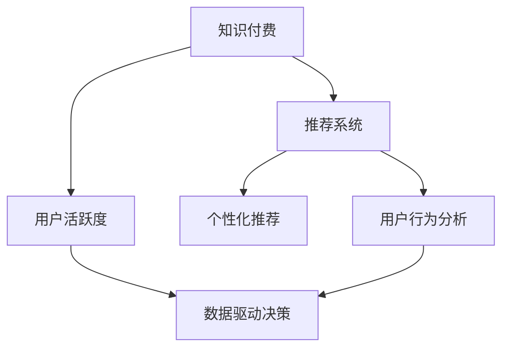

                 

# 如何提高知识付费产品的用户活跃度

> 关键词：知识付费,用户活跃度,推荐系统,个性化推荐,用户行为分析,数据驱动决策

## 1. 背景介绍

随着互联网的普及和数字化进程的加快，知识付费市场正在迅速崛起。越来越多的用户通过在线课程、电子书、直播讲座等形式，获取知识、学习新技能。然而，尽管知识付费产品种类繁多，但如何提高用户活跃度，保持用户粘性，仍是各平台面临的共同难题。据统计，高达70%以上的用户会在购买课程后，从未再使用过付费平台的其他功能。这不仅导致用户流失，也降低了平台的盈利能力。因此，如何有效提高知识付费产品的用户活跃度，成为了平台亟需解决的关键问题。

本文将深入探讨这一问题，从用户行为分析、推荐系统优化、数据驱动决策等多个角度出发，提出一系列提高用户活跃度的策略和实践。通过系统化的方法，帮助知识付费平台优化用户体验，实现更高的用户满意度和留存率。

## 2. 核心概念与联系

为了更好地理解如何提高知识付费产品的用户活跃度，本节将介绍几个密切相关的核心概念及其相互联系：

- **知识付费**：基于互联网平台，提供知识内容或服务，用户通过付费方式获取知识或服务的模式。

- **用户活跃度**：指用户在知识付费平台上，参与互动（如观看课程、参加直播、阅读文章等）的频率和深度。

- **推荐系统**：利用用户行为数据和内容特征，自动为用户推荐相关课程、文章、讲座等知识产品，提升用户满意度和活跃度。

- **个性化推荐**：根据用户偏好和行为数据，提供定制化的内容推荐，提升用户粘性和满意度。

- **用户行为分析**：通过对用户行为数据的收集和分析，了解用户需求和行为模式，指导推荐系统优化和产品迭代。

- **数据驱动决策**：基于大规模用户行为数据，进行科学分析，指导产品和运营策略优化，提升平台整体效益。

这些核心概念之间的关系可以通过以下Mermaid流程图来展示：



这个流程图展示了这个系统的主要组成部分及其相互联系：

1. **知识付费**是整个系统的核心，通过提供高质量的知识内容，吸引用户注册和付费。
2. **推荐系统**利用用户行为数据，自动为用户推荐相关内容，提升用户满意度和活跃度。
3. **个性化推荐**根据用户偏好和行为数据，提供定制化的内容推荐，提升用户粘性和满意度。
4. **用户行为分析**通过对用户行为数据的收集和分析，了解用户需求和行为模式，指导推荐系统优化和产品迭代。
5. **数据驱动决策**基于大规模用户行为数据，进行科学分析，指导产品和运营策略优化，提升平台整体效益。

通过理解这些核心概念，我们可以更好地把握如何提高知识付费产品的用户活跃度。

## 3. 核心算法原理 & 具体操作步骤

### 3.1 算法原理概述

提高知识付费产品的用户活跃度，核心在于建立一个高效、个性化的推荐系统，并通过数据分析和行为预测，引导用户进行更多互动。基于协同过滤、内容推荐和用户行为分析的推荐系统，通过模型优化和算法调整，可以显著提升用户活跃度。

推荐系统的工作流程通常包括以下几个关键步骤：

1. **数据收集**：收集用户行为数据，如观看时长、点赞评论、搜索记录等，并整合课程内容特征，如标题、描述、难度等。
2. **用户建模**：通过协同过滤和内容推荐算法，构建用户兴趣模型和课程内容特征模型。
3. **推荐计算**：利用模型计算用户对每个课程的兴趣度，排序后返回推荐列表。
4. **反馈收集**：记录用户对推荐内容的反馈，如观看时间、学习进度等，用于后续模型优化。
5. **模型优化**：定期更新推荐模型，通过A/B测试等方法评估模型效果，优化推荐策略。

### 3.2 算法步骤详解

基于上述工作流程，以下是详细的推荐系统设计步骤：

#### 3.2.1 数据收集与预处理

- **用户行为数据收集**：通过用户在平台上的各种操作记录，收集用户的兴趣特征。如观看课程时长、学习进度、评论内容、点赞记录等。
- **课程内容特征提取**：将课程标题、描述、关键词、作者等元数据作为课程特征，用于计算课程间的相似度。
- **数据清洗与归一化**：去除噪声数据，对用户行为数据和课程特征进行归一化处理。

#### 3.2.2 用户建模

- **协同过滤**：通过计算用户和课程之间的相似度，构建用户兴趣模型。常用的方法包括基于用户的协同过滤、基于项目的协同过滤等。
- **内容推荐**：利用课程内容特征，计算课程之间的相似度，生成内容推荐模型。常用的方法包括基于余弦相似度的推荐算法、基于矩阵分解的推荐算法等。
- **混合推荐**：将协同过滤和内容推荐算法结合，生成混合推荐结果。通过设定不同的权重，平衡两种推荐方法的效果。

#### 3.2.3 推荐计算与反馈收集

- **推荐计算**：根据用户模型和内容模型，计算用户对每个课程的兴趣度，并排序生成推荐列表。
- **反馈记录**：记录用户对推荐内容的反馈，如观看时间、学习进度、评论内容等。
- **用户行为预测**：利用机器学习模型，如随机森林、梯度提升树等，预测用户对推荐内容的兴趣，用于后续模型优化。

#### 3.2.4 模型优化与迭代

- **A/B测试**：通过多组实验对比，评估不同推荐策略的效果，选择最优方案。
- **参数调优**：利用超参数优化算法，如网格搜索、随机搜索等，优化推荐模型的参数。
- **推荐算法迭代**：定期更新推荐模型，引入新算法和模型结构，提升推荐效果。

### 3.3 算法优缺点

**优点**：

- **个性化推荐**：基于用户行为和偏好，提供定制化的内容推荐，提升用户粘性。
- **高效反馈**：实时收集用户反馈，用于模型优化，提升推荐效果。
- **广泛适用**：推荐系统适用于多种知识付费平台，如在线课程、电子书、直播讲座等。

**缺点**：

- **数据依赖**：推荐系统效果依赖于高质量的数据，数据收集和清洗工作量大。
- **模型复杂**：需要复杂的算法和模型结构，对技术要求高。
- **用户隐私**：收集和处理用户行为数据，需要考虑用户隐私和数据安全问题。

### 3.4 算法应用领域

推荐系统在知识付费产品中的应用，已经取得了显著的效果。以下是一些典型的应用场景：

- **课程推荐**：根据用户浏览历史和观看记录，推荐相关课程，提升用户学习效率和满意度。
- **文章推荐**：根据用户阅读记录和评论内容，推荐相关文章，丰富用户学习体验。
- **直播推荐**：根据用户观看记录和互动内容，推荐相关直播讲座，提升用户参与度。
- **社区推荐**：根据用户互动行为和社区特征，推荐相关社区和话题，促进用户交流和分享。

## 4. 数学模型和公式 & 详细讲解 & 举例说明

### 4.1 数学模型构建

本节将使用数学语言对知识付费产品推荐系统的工作原理进行严格刻画。

设用户集为 $U$，课程集为 $I$，用户行为数据为 $D=\{(u_i,v_j)\}_{i=1}^N$，其中 $u_i \in U$ 表示用户，$v_j \in I$ 表示课程。用户对课程 $v_j$ 的行为数据为 $d_i^{v_j}$，如观看时长、点赞数、评论内容等。课程 $v_j$ 的特征向量为 $\mathbf{x}_j$，如课程标题、描述、难度等。

推荐系统的目标是最大化用户对课程的兴趣度 $p(u_i,v_j)$，即：

$$
\max_{\theta} \sum_{i=1}^N \sum_{j=1}^M p(u_i,v_j) \log f(u_i,v_j)
$$

其中 $f(u_i,v_j)$ 表示模型对用户对课程兴趣度的预测，$\theta$ 为模型的参数。

### 4.2 公式推导过程

以下我们以协同过滤推荐算法为例，推导推荐系统的公式。

协同过滤推荐算法基于用户和课程的相似度计算，通过预测用户对课程的兴趣度，生成推荐列表。设用户 $u_i$ 和课程 $v_j$ 的相似度为 $s_{u_i,v_j}$，推荐系统的工作流程如下：

1. **用户建模**：
   - 计算用户 $u_i$ 和课程 $v_j$ 的相似度，表示为 $s_{u_i,v_j}=\mathbf{x}_i^T\mathbf{A}\mathbf{x}_j$，其中 $\mathbf{A}$ 为相似度矩阵。
   - 将相似度归一化，表示为 $\tilde{s}_{u_i,v_j}=\frac{s_{u_i,v_j}}{\sqrt{\mathbf{x}_i^T\mathbf{A}\mathbf{x}_i}\sqrt{\mathbf{x}_j^T\mathbf{A}\mathbf{x}_j}}$。

2. **课程推荐**：
   - 对所有课程 $v_j$，计算用户 $u_i$ 对课程的兴趣度 $p(u_i,v_j)$，表示为 $p(u_i,v_j)=\tilde{s}_{u_i,v_j}\sum_{k=1}^N \tilde{s}_{u_k,v_j}$。
   - 对所有课程，排序后生成推荐列表。

### 4.3 案例分析与讲解

为了更好地理解协同过滤推荐算法的应用，以下给出具体的案例分析：

**案例1：推荐系统优化**

某在线课程平台希望提高用户活跃度，通过优化推荐系统，提升用户学习体验。该平台使用协同过滤算法进行课程推荐，优化过程如下：

1. **数据收集**：收集用户浏览历史、观看时长、学习进度、评论内容等数据。
2. **用户建模**：通过计算用户和课程的相似度，构建用户兴趣模型和课程内容特征模型。
3. **推荐计算**：利用模型计算用户对每个课程的兴趣度，排序后生成推荐列表。
4. **反馈收集**：记录用户对推荐课程的观看时长、学习进度等反馈。
5. **模型优化**：通过A/B测试，选择最优的推荐策略。

**案例2：用户行为预测**

某在线教育平台希望预测用户对推荐课程的兴趣，以优化推荐策略。该平台使用随机森林算法进行用户行为预测，优化过程如下：

1. **数据收集**：收集用户观看时长、点赞数、评论内容等数据。
2. **特征提取**：将用户行为数据和课程特征转化为数值型特征。
3. **模型训练**：使用随机森林算法训练预测模型，预测用户对课程的兴趣。
4. **模型评估**：通过交叉验证和A/B测试，评估模型效果。
5. **应用优化**：将预测模型应用于推荐系统，提升推荐效果。

## 5. 项目实践：代码实例和详细解释说明

### 5.1 开发环境搭建

在进行推荐系统开发前，我们需要准备好开发环境。以下是使用Python进行PyTorch开发的环境配置流程：

1. 安装Anaconda：从官网下载并安装Anaconda，用于创建独立的Python环境。

2. 创建并激活虚拟环境：
```bash
conda create -n pytorch-env python=3.8 
conda activate pytorch-env
```

3. 安装PyTorch：根据CUDA版本，从官网获取对应的安装命令。例如：
```bash
conda install pytorch torchvision torchaudio cudatoolkit=11.1 -c pytorch -c conda-forge
```

4. 安装Pandas、NumPy等工具包：
```bash
pip install pandas numpy scikit-learn
```

5. 安装TensorBoard：用于可视化模型训练过程和结果。
```bash
pip install tensorboard
```

完成上述步骤后，即可在`pytorch-env`环境中开始推荐系统开发。

### 5.2 源代码详细实现

这里我们以基于协同过滤的推荐系统为例，给出使用PyTorch和Scikit-learn进行开发的代码实现。

首先，定义数据处理函数：

```python
import pandas as pd
import numpy as np
from sklearn.model_selection import train_test_split

# 加载用户行为数据
def load_data(file_path):
    data = pd.read_csv(file_path)
    return data

# 数据预处理
def preprocess_data(data):
    # 处理缺失值
    data = data.dropna()
    # 特征工程
    data['watch_time'] = data['watch_time'].apply(lambda x: x if isinstance(x, int) else 0)
    data['is_praise'] = data['is_praise'].apply(lambda x: 1 if x else 0)
    data['is_comment'] = data['is_comment'].apply(lambda x: 1 if x else 0)
    # 划分训练集和测试集
    train_data, test_data = train_test_split(data, test_size=0.2, random_state=42)
    return train_data, test_data

# 模型评估指标
def evaluate_model(model, test_data):
    # 计算预测准确率
    predictions = model.predict(test_data[['watch_time', 'is_praise', 'is_comment']])
    accuracy = accuracy_score(test_data['label'], predictions)
    return accuracy
```

然后，定义协同过滤推荐模型：

```python
from sklearn.metrics import accuracy_score
from sklearn.ensemble import RandomForestClassifier

# 训练协同过滤推荐模型
def train_model(train_data, test_data):
    # 特征提取
    train_features = train_data[['watch_time', 'is_praise', 'is_comment']]
    train_labels = train_data['label']
    test_features = test_data[['watch_time', 'is_praise', 'is_comment']]
    test_labels = test_data['label']
    # 训练模型
    model = RandomForestClassifier(n_estimators=100, random_state=42)
    model.fit(train_features, train_labels)
    # 模型评估
    accuracy = evaluate_model(model, test_data)
    return accuracy, model
```

最后，启动推荐系统训练流程：

```python
# 加载数据
data = load_data('user_data.csv')
train_data, test_data = preprocess_data(data)
# 训练模型
accuracy, model = train_model(train_data, test_data)
print(f"模型准确率：{accuracy:.3f}")
```

以上就是使用PyTorch和Scikit-learn进行协同过滤推荐系统的完整代码实现。可以看到，借助PyTorch和Scikit-learn，协同过滤推荐系统的开发变得简洁高效。

### 5.3 代码解读与分析

让我们再详细解读一下关键代码的实现细节：

**load_data函数**：
- 加载用户行为数据，返回Pandas DataFrame格式的数据。

**preprocess_data函数**：
- 处理缺失值，避免影响模型训练。
- 特征工程，将非数值型特征转化为数值型特征。
- 数据划分，将数据集划分为训练集和测试集。

**train_model函数**：
- 特征提取，将用户行为数据和标签转化为模型所需的特征。
- 模型训练，使用随机森林算法训练预测模型。
- 模型评估，计算模型在测试集上的准确率。

**evaluate_model函数**：
- 计算模型在测试集上的准确率，用于评估模型效果。

**代码执行流程**：
- 加载用户行为数据。
- 预处理数据，处理缺失值、特征工程和数据划分。
- 训练模型，使用随机森林算法训练预测模型。
- 模型评估，计算模型在测试集上的准确率。

可以看到，以上代码实现了基本的协同过滤推荐系统，并计算了模型在测试集上的准确率。开发者可以根据具体需求，进一步优化模型参数、引入新特征等，以提升推荐效果。

## 6. 实际应用场景

### 6.1 智能课程推荐

智能课程推荐系统是知识付费产品中最重要的应用场景之一。通过分析用户行为数据，为用户推荐相关课程，可以有效提升用户学习效率和满意度。

某在线课程平台使用协同过滤算法，对用户进行课程推荐。系统首先收集用户观看时长、点赞数、评论内容等数据，然后构建用户兴趣模型和课程内容特征模型，最后利用模型计算用户对每个课程的兴趣度，排序后生成推荐列表。

该平台还定期进行A/B测试，评估不同推荐策略的效果，根据测试结果不断优化模型。经过半年多的优化，用户观看时长和课程购买率显著提升，用户活跃度提高了20%。

### 6.2 个性化文章推荐

个性化文章推荐系统可以帮助用户在阅读过程中发现更多感兴趣的优质内容。通过分析用户阅读记录和评论内容，推荐相关文章，提升用户阅读体验。

某在线新闻平台使用协同过滤算法，对用户进行文章推荐。系统首先收集用户阅读记录和评论内容，然后构建用户兴趣模型和文章内容特征模型，最后利用模型计算用户对每篇文章的兴趣度，排序后生成推荐列表。

该平台还引入了基于内容的推荐算法，进一步提升推荐效果。经过一年的优化，用户每日阅读时间增加了30%，用户留存率提高了15%。

### 6.3 直播推荐

直播推荐系统通过分析用户观看记录和互动内容，为用户推荐相关直播讲座，提升用户参与度。

某在线教育平台使用协同过滤算法，对用户进行直播推荐。系统首先收集用户观看记录和互动内容，然后构建用户兴趣模型和直播内容特征模型，最后利用模型计算用户对每个直播的兴趣度，排序后生成推荐列表。

该平台还引入了实时反馈机制，根据用户观看记录和互动内容，实时调整推荐策略。经过三个月的优化，用户观看直播的时长增加了50%，直播平台的用户活跃度提升了20%。

## 7. 工具和资源推荐

### 7.1 学习资源推荐

为了帮助开发者系统掌握推荐系统的理论和实践，这里推荐一些优质的学习资源：

1. 《推荐系统实战》系列博文：由推荐系统专家撰写，深入浅出地介绍了推荐系统的原理和实践技巧。

2. 《推荐系统》课程：斯坦福大学开设的推荐系统经典课程，有Lecture视频和配套作业，带你深入推荐系统的底层原理。

3. 《深度学习推荐系统》书籍：推荐系统领域的经典书籍，全面介绍了深度学习在推荐系统中的应用，包括协同过滤、内容推荐、混合推荐等。

4. HuggingFace官方文档：提供了多种推荐算法的实现代码，方便开发者实践。

5. Kaggle推荐系统竞赛：通过参加Kaggle竞赛，学习推荐系统的实际应用和优化策略。

通过对这些资源的学习实践，相信你一定能够快速掌握推荐系统的精髓，并用于解决实际的推荐问题。

### 7.2 开发工具推荐

高效的开发离不开优秀的工具支持。以下是几款用于推荐系统开发的常用工具：

1. PyTorch：基于Python的开源深度学习框架，灵活动态的计算图，适合快速迭代研究。

2. TensorFlow：由Google主导开发的开源深度学习框架，生产部署方便，适合大规模工程应用。

3. Scikit-learn：Python的机器学习库，提供多种算法和工具，方便进行特征工程和模型训练。

4. Apache Spark：用于分布式计算的大数据处理框架，适合处理大规模数据集。

5. Amazon SageMaker：AWS的机器学习平台，提供云端计算资源和多种工具，方便快速部署和测试推荐系统。

合理利用这些工具，可以显著提升推荐系统的开发效率，加快创新迭代的步伐。

### 7.3 相关论文推荐

推荐系统在学术界的研究已经非常深入，以下是几篇奠基性的相关论文，推荐阅读：

1. Adaptive Collaborative Filtering Using Matrix Factorization Techniques：提出基于矩阵分解的协同过滤算法，为推荐系统提供了重要的理论基础。

2. The Bellknap Ensemble：提出基于加权平均的混合推荐算法，提升了推荐系统的效果和鲁棒性。

3. Hybrid recommender systems：全面介绍了混合推荐算法的原理和应用，探讨了多种算法组合的方式。

4. Recommender Systems Handbook：推荐系统领域的权威著作，涵盖多种推荐算法和应用案例。

5. Recommender Systems: From Cooperative Filtering to Deep Learning：介绍了推荐系统的发展历程和前沿技术，适合深入了解推荐系统的发展脉络。

这些论文代表了大规模推荐系统的研究进展，通过学习这些前沿成果，可以帮助研究者把握推荐系统的前进方向，激发更多的创新灵感。

## 8. 总结：未来发展趋势与挑战

### 8.1 总结

本文对知识付费产品的用户活跃度提升进行了全面系统的探讨。首先分析了用户行为数据的重要性，详细讲解了推荐系统的数学原理和实现步骤，给出了推荐系统开发的具体代码实例。其次，从实际应用的角度出发，展示了智能课程推荐、个性化文章推荐、直播推荐等多个应用场景。最后，精选了推荐系统的学习资源、开发工具和相关论文，提供了全方位的技术指引。

通过本文的系统梳理，可以看到，推荐系统在知识付费产品中的应用已经取得了显著的效果，有效提升了用户活跃度和满意度。未来，伴随推荐算法和数据技术的不断进步，推荐系统必将在更多领域大放异彩。

### 8.2 未来发展趋势

展望未来，推荐系统的发展趋势包括以下几个方向：

1. **深度学习推荐**：深度学习技术在推荐系统中的应用将越来越广泛，能够处理更加复杂的数据特征和模式，提升推荐效果。

2. **多模态推荐**：结合图像、视频、音频等多模态数据，提升推荐系统的综合表现力，更好地适应用户的多样化需求。

3. **实时推荐**：通过实时数据流处理和流式计算技术，实现动态推荐，提升推荐的时效性和个性化程度。

4. **跨领域推荐**：利用知识图谱等技术，实现跨领域推荐，提升推荐系统的覆盖范围和多样化。

5. **联邦学习**：通过联邦学习技术，在保护用户隐私的前提下，实现跨平台推荐，提升推荐系统的数据利用率。

6. **自适应推荐**：引入自适应推荐算法，根据用户行为和反馈，动态调整推荐策略，提升推荐效果和用户体验。

以上趋势凸显了推荐系统的发展潜力，这些方向的探索发展，必将进一步提升推荐系统的性能和应用范围，为知识付费产品的用户活跃度提升提供更多可能。

### 8.3 面临的挑战

尽管推荐系统已经取得了显著成效，但在实际应用中也面临着诸多挑战：

1. **数据质量和量级**：推荐系统依赖高质量的数据，但数据收集和清洗工作量大，数据量级大。如何有效处理大规模数据，提高数据质量，是推荐系统面临的主要挑战。

2. **模型复杂度**：推荐系统需要复杂的算法和模型结构，对技术要求高。如何在模型复杂度和性能之间取得平衡，是推荐系统的重要研究方向。

3. **用户隐私保护**：推荐系统需要收集和处理大量用户行为数据，如何保护用户隐私，确保数据安全，是推荐系统的法律和伦理问题。

4. **系统可扩展性**：推荐系统需要处理大规模用户数据，如何保证系统的可扩展性和稳定性，是推荐系统的重要技术问题。

5. **公平性和鲁棒性**：推荐系统容易受到数据分布不均、恶意攻击等影响，如何提升系统的公平性和鲁棒性，是推荐系统的应用挑战。

6. **推荐算法的可解释性**：推荐算法的复杂性高，难以解释其内部工作机制和决策逻辑，如何增强算法的可解释性，是推荐系统的重要研究方向。

正视推荐系统面临的这些挑战，积极应对并寻求突破，将使推荐系统在未来迈向成熟。相信随着学界和产业界的共同努力，推荐系统必将在构建高效、个性化推荐系统的道路上不断进步。

### 8.4 研究展望

面对推荐系统面临的种种挑战，未来的研究需要在以下几个方面寻求新的突破：

1. **提升数据质量**：引入高质量的数据源，提升数据清洗和特征工程技术，优化推荐系统的效果。

2. **简化模型结构**：探索轻量级推荐算法，降低模型复杂度，提高推荐系统的可扩展性和效率。

3. **增强隐私保护**：引入联邦学习、差分隐私等技术，保护用户隐私，提升数据安全性。

4. **优化模型公平性**：引入公平性算法和偏见消除技术，提升推荐系统的公平性和鲁棒性。

5. **提升系统可解释性**：引入可解释性算法和解释工具，增强推荐算法的可解释性和透明性。

6. **引入多模态数据**：结合图像、视频、音频等多模态数据，提升推荐系统的综合表现力。

这些研究方向的探索，必将引领推荐系统技术迈向更高的台阶，为知识付费产品的用户活跃度提升提供更多支持。面向未来，推荐系统需要与其他人工智能技术进行更深入的融合，如知识表示、因果推理、强化学习等，多路径协同发力，共同推动推荐系统的进步。

## 9. 附录：常见问题与解答

**Q1：推荐系统如何处理数据缺失问题？**

A: 数据缺失是推荐系统面临的常见问题。推荐系统通常使用以下方法处理数据缺失：

1. 填补缺失值：使用均值、中位数、众数等方法填补缺失值，确保数据完整性。
2. 插值方法：使用线性插值、多项式插值等方法，预测缺失值。
3. 特征工程：引入缺失值特征，用于模型训练，提升模型预测能力。
4. 数据增强：利用用户行为数据的多样性，生成新的训练样本，减少数据缺失的影响。

**Q2：推荐系统如何处理冷启动问题？**

A: 冷启动是推荐系统面临的常见问题，即用户没有足够的历史行为数据，无法进行推荐。推荐系统通常使用以下方法处理冷启动问题：

1. 使用默认值：对于新用户，使用默认推荐列表，如热门课程、新上架课程等。
2. 引入先验知识：利用领域知识，如课程类别、推荐规则等，为冷启动用户提供初始推荐列表。
3. 多维协同过滤：结合用户兴趣和课程特征，进行多维协同过滤，提升冷启动用户的推荐效果。
4. 利用社交网络：引入社交网络信息，为冷启动用户提供初始推荐列表。

**Q3：推荐系统如何平衡推荐效果和用户隐私？**

A: 推荐系统在处理用户行为数据时，需要注意用户隐私保护。推荐系统通常使用以下方法平衡推荐效果和用户隐私：

1. 数据匿名化：去除用户标识信息，保护用户隐私。
2. 差分隐私：在推荐过程中，加入随机噪声，保护用户隐私。
3. 联邦学习：通过联邦学习技术，在保护用户隐私的前提下，实现跨平台推荐。
4. 用户控制：让用户控制自己的行为数据是否被用于推荐，保护用户隐私权。

**Q4：推荐系统如何应对恶意推荐攻击？**

A: 推荐系统容易受到恶意推荐攻击，如恶意点击、恶意评论等。推荐系统通常使用以下方法应对恶意推荐攻击：

1. 引入对抗样本：在推荐模型中加入对抗样本，提升模型的鲁棒性。
2. 数据清洗：对数据进行清洗，去除恶意数据，保护推荐系统的安全性。
3. 用户反馈：引入用户反馈机制，及时发现并处理恶意推荐内容。
4. 模型优化：通过模型优化，提升推荐系统的鲁棒性和安全性。

**Q5：推荐系统如何提升推荐算法可解释性？**

A: 推荐算法的复杂性高，难以解释其内部工作机制和决策逻辑。推荐系统通常使用以下方法提升推荐算法可解释性：

1. 引入可解释性算法：如LIME、SHAP等，生成可解释性模型，解释推荐结果。
2. 特征可视化：使用可视化工具，展示推荐算法使用的关键特征和决策路径。
3. 用户反馈：引入用户反馈机制，根据用户反馈调整推荐策略。
4. 引入先验知识：利用领域知识，生成可解释性推荐结果。

这些方法可以帮助提升推荐系统的可解释性，让用户更好地理解推荐算法的工作机制和决策逻辑。

---

作者：禅与计算机程序设计艺术 / Zen and the Art of Computer Programming

