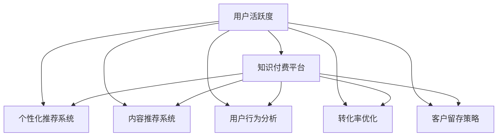

                 

# 如何提高知识付费产品的用户活跃度

> 关键词：用户活跃度,知识付费,个性化推荐,内容推荐系统,用户行为分析,转化率优化,客户留存策略

## 1. 背景介绍

### 1.1 问题由来
随着在线教育的兴起，知识付费产品逐渐成为一种新的内容消费模式。其核心在于通过付费获取优质学习资源，实现高效、个性化的知识获取。然而，在实际应用中，知识付费产品的用户活跃度（User Engagement）成为了一个重要的问题。用户活跃度不仅影响产品的收入，也是衡量产品质量和用户满意度的重要指标。如何提升用户活跃度，成为知识付费企业持续关注的焦点。

### 1.2 问题核心关键点
用户活跃度的高低，取决于用户对产品的兴趣、内容质量、互动体验等因素。具体来说，可以通过以下几个关键点来分析用户活跃度：
1. 用户的日均使用时长和频率：反映用户对产品的依赖程度。
2. 内容的浏览、收藏、购买和观看等行为：衡量用户对内容的关注和需求。
3. 用户与产品之间的互动频率：如问答、评论、课程讨论等，反映用户的参与度和社交需求。
4. 用户留存率和流失率：衡量产品的长期吸引力。
5. 用户转介绍率：反映用户对产品的满意度和信任度。

### 1.3 问题研究意义
提升知识付费产品的用户活跃度，对于企业的发展至关重要。它不仅能提高用户的粘性，增加收入，还能提升品牌的认知度和美誉度。具体来说，通过系统化的用户行为分析和个性化推荐，可以有效提升内容的质量和用户的满意度，从而实现用户留存和转介绍的目标。

## 2. 核心概念与联系

### 2.1 核心概念概述

为更好地理解如何提升知识付费产品的用户活跃度，本节将介绍几个密切相关的核心概念：

- 用户活跃度(User Engagement)：反映用户对产品的关注和参与程度，通常通过日活跃用户数(DAU)、月活跃用户数(MAU)、用户留存率等指标来衡量。
- 知识付费平台(Knowledge Paywall Platform)：提供在线付费课程、视频、文章等知识内容的平台，用户通过付费获取学习资源。
- 个性化推荐系统(Personalized Recommendation System)：根据用户行为和兴趣，动态推荐相关内容，提升用户体验和满意度。
- 内容推荐系统(Content Recommendation System)：利用算法技术，为不同用户推荐其可能感兴趣的内容，提高内容的曝光度和点击率。
- 用户行为分析(User Behavior Analysis)：通过数据分析技术，深入理解用户的行为习惯和需求偏好，以指导产品的优化和改进。
- 转化率优化(Conversion Rate Optimization, CRO)：通过优化产品页面、流程和营销策略，提高用户的付费转化率。
- 客户留存策略(Customer Retention Strategy)：通过产品优化、促销活动等手段，提高用户的长期留存率。

这些核心概念之间的逻辑关系可以通过以下Mermaid流程图来展示：



这个流程图展示了我们要探讨的核心概念及其之间的关系：

1. 用户活跃度是评估产品性能的核心指标。
2. 知识付费平台是提供内容和服务的基础。
3. 个性化推荐系统和内容推荐系统是提升用户活跃度的关键技术。
4. 用户行为分析用于理解用户需求，指导系统的优化。
5. 转化率优化和客户留存策略是提高用户长期留存率的具体手段。

## 3. 核心算法原理 & 具体操作步骤
### 3.1 算法原理概述

提升知识付费产品的用户活跃度，本质上是一个多目标优化问题。其核心思想是：通过分析用户行为，构建个性化推荐模型，优化产品功能，最终提升用户对产品的兴趣和粘性。

具体来说，用户活跃度的提升可以分为以下几个步骤：
1. 数据收集：收集用户的行为数据，如浏览、收藏、观看、评分等，用于分析和模型训练。
2. 特征提取：从用户行为数据中提取有意义的特征，如兴趣偏好、观看时长、购买历史等，作为推荐模型的输入。
3. 模型训练：使用推荐算法，如协同过滤、内容基推荐、深度学习推荐等，训练个性化推荐模型。
4. 个性化推荐：根据用户当前行为和历史数据，动态推荐其感兴趣的内容，提升用户体验。
5. 反馈优化：根据用户对推荐结果的反馈，持续优化推荐模型和策略。

### 3.2 算法步骤详解

下面详细介绍提升知识付费产品用户活跃度的算法步骤：

**Step 1: 数据收集与预处理**
- 数据来源：收集用户在平台上的行为数据，包括课程浏览记录、收藏夹、观看时长、评分等。
- 数据清洗：去除无效数据，处理缺失值和异常值，确保数据的质量和完整性。
- 数据划分：将数据划分为训练集和测试集，用于模型训练和效果评估。

**Step 2: 特征工程**
- 用户画像：构建用户画像，提取用户的兴趣偏好、观看时长、学习进度等信息。
- 内容特征：提取课程的分类、难度、更新时间、教师声誉等信息。
- 行为特征：提取用户的访问频次、观看时长、付费行为等行为特征。
- 特征选择：使用特征选择方法，如卡方检验、信息增益等，选择对用户活跃度影响较大的特征。

**Step 3: 模型训练与优化**
- 推荐算法选择：选择合适的推荐算法，如协同过滤、内容基推荐、深度学习推荐等。
- 训练集划分：将数据集划分为训练集和验证集，用于模型训练和参数调优。
- 模型训练：使用优化算法，如梯度下降、随机梯度下降等，训练推荐模型。
- 模型评估：使用测试集评估模型性能，选择合适的评估指标，如精确率、召回率、F1值等。
- 参数调优：根据模型评估结果，调整模型参数，提升模型性能。

**Step 4: 个性化推荐**
- 实时推荐：根据用户当前行为和历史数据，动态生成个性化推荐结果。
- 推荐结果展示：将推荐结果展示给用户，提升其对内容的曝光度和点击率。
- 反馈循环：收集用户对推荐结果的反馈，持续优化推荐模型和策略。

**Step 5: 用户行为分析**
- 用户行为建模：使用机器学习或深度学习模型，建立用户行为模型，预测用户活跃度。
- 行为分析：分析用户行为数据，识别用户流失和留存的关键因素。
- 用户画像更新：根据行为分析结果，更新用户画像，优化个性化推荐。

**Step 6: 转化率优化与客户留存策略**
- 转化率优化：优化产品页面、购物流程、营销策略等，提高用户的付费转化率。
- 客户留存策略：设计激励机制、会员特权、定期优惠等，提高用户长期留存率。

### 3.3 算法优缺点

个性化推荐系统在提升知识付费产品用户活跃度方面，具有以下优点：
1. 提升内容曝光度：通过推荐算法，将优质内容精准推送给用户，提升内容的曝光率和点击率。
2. 提升用户满意度：根据用户兴趣和偏好，推荐相关内容，提升用户对产品的满意度和粘性。
3. 提升用户留存率：通过精准推荐和个性化服务，提高用户留存率，减少流失。
4. 提升转化率：通过优化推荐和转化流程，提高用户的付费转化率。

同时，个性化推荐系统也存在以下局限性：
1. 数据隐私问题：用户行为数据涉及个人隐私，如何保护用户数据安全是一个重要问题。
2. 冷启动问题：新用户无历史数据，推荐效果可能不理想。
3. 算法复杂度：高维数据和复杂推荐模型，对算力和计算资源的要求较高。
4. 推荐公平性：个性化推荐可能导致内容偏差，一些边缘用户可能被忽略。

尽管存在这些局限性，但个性化推荐系统仍是大规模知识付费平台用户活跃度提升的重要手段。未来相关研究的重点在于如何进一步优化推荐算法，降低数据隐私风险，提高推荐公平性，更好地服务用户需求。

### 3.4 算法应用领域

个性化推荐系统已经在多个领域得到广泛应用，包括电子商务、社交网络、新闻推荐、知识付费等。在知识付费领域，个性化推荐系统已经取得了显著的效果，具体应用场景如下：

- 课程推荐：根据用户兴趣和历史行为，推荐感兴趣的课程。
- 习题推荐：根据学习进度和成绩，推荐适合用户能力的习题。
- 教师推荐：根据课程评分和教师声誉，推荐优质教师。
- 学习路径规划：根据用户学习目标和兴趣，推荐最优学习路径。

除了这些经典应用外，个性化推荐系统还被创新性地应用于更多场景中，如智能问答、个性化学习资料推荐等，为知识付费产品带来了全新的突破。

## 4. 数学模型和公式 & 详细讲解  
### 4.1 数学模型构建

本节将使用数学语言对提升知识付费产品用户活跃度的个性化推荐过程进行更加严格的刻画。

记用户为 $U=\{u_1, u_2, \dots, u_n\}$，课程为 $I=\{i_1, i_2, \dots, i_m\}$，用户对课程的评分向量为 $R_{ui} \in \mathbb{R}^m$，其中 $R_{ui}=1$ 表示用户 $u$ 对课程 $i$ 进行了评分，否则为0。目标为最大化用户活跃度，即最大化用户对课程的评分和观看时长。

定义用户行为矩阵 $B \in \mathbb{R}^{n \times m}$，其中 $b_{ui}=r_{ui}$ 表示用户 $u$ 对课程 $i$ 的评分，否则为0。则用户活跃度 $L$ 可以定义为：

$$
L=\frac{1}{n}\sum_{u=1}^n \sum_{i=1}^m r_{ui}
$$

目标为最大化 $L$，即最大化用户对课程的评分和观看时长。

### 4.2 公式推导过程

以下我们以协同过滤算法为例，推导其评分预测公式。

假设用户 $u$ 对课程 $i$ 的评分 $r_{ui}$ 由其他用户的评分预测得出，即：

$$
r_{ui}=p_u(i)
$$

其中 $p_u(i)$ 为预测函数，用于预测用户 $u$ 对课程 $i$ 的评分。常见的预测函数包括基于用户-物品相似性的矩阵分解模型和基于用户-物品交互的协同过滤模型。

以矩阵分解模型为例，假设用户 $u$ 和课程 $i$ 的评分可以表示为低秩矩阵分解形式：

$$
\begin{align*}
r_{ui} & = \hat{r}_{ui} + \epsilon_{ui} \\
\hat{r}_{ui} & = \sum_{k=1}^K \hat{p}_{uk} \hat{q}_{ki}
\end{align*}
$$

其中 $\hat{r}_{ui}$ 为预测评分，$\epsilon_{ui}$ 为误差项，$K$ 为低秩分解的维度，$\hat{p}_{uk}$ 和 $\hat{q}_{ki}$ 分别为用户和课程的低秩分解向量。

根据上述公式，可以定义损失函数 $L=\frac{1}{n}\sum_{u=1}^n \sum_{i=1}^m (r_{ui}-\hat{r}_{ui})^2$，通过优化该损失函数，可以得到用户 $u$ 对课程 $i$ 的评分预测值 $\hat{r}_{ui}$。

### 4.3 案例分析与讲解

下面以一个具体的案例，展示如何通过协同过滤算法进行个性化推荐：

假设某知识付费平台有1000名用户，每名用户有100门课程可供选择。通过用户行为数据，可以构建用户-课程评分矩阵 $B \in \mathbb{R}^{1000 \times 100}$，其中 $b_{ui}=r_{ui}$。

使用协同过滤算法，可以计算用户 $u$ 对课程 $i$ 的预测评分 $\hat{r}_{ui}$，然后根据预测评分进行排序，推荐给用户。

具体来说，假设用户 $u$ 对课程 $i$ 的评分向量为 $R_u$，课程 $i$ 的平均评分为 $\bar{R}_i$，则用户 $u$ 对课程 $i$ 的预测评分为：

$$
\hat{r}_{ui}=\frac{\sum_{j=1}^{1000} \frac{r_{uj} r_{ji}}{\sqrt{\sum_{k=1}^{1000} r_{uj}^2} \sqrt{\sum_{k=1}^{1000} r_{jk}^2}}
$$

其中 $j$ 表示用户 $u$ 对课程 $j$ 的评分，$k$ 表示课程 $j$ 对课程 $i$ 的评分。

根据预测评分，可以计算每门课程对用户 $u$ 的排序值，推荐前 $k$ 门课程。

## 5. 项目实践：代码实例和详细解释说明
### 5.1 开发环境搭建

在进行个性化推荐系统的开发前，我们需要准备好开发环境。以下是使用Python进行Scikit-learn开发的环境配置流程：

1. 安装Anaconda：从官网下载并安装Anaconda，用于创建独立的Python环境。

2. 创建并激活虚拟环境：
```bash
conda create -n recsys-env python=3.8 
conda activate recsys-env
```

3. 安装Scikit-learn：从官网下载并安装Scikit-learn。

4. 安装其他工具包：
```bash
pip install numpy pandas joblib tqdm
```

完成上述步骤后，即可在`recsys-env`环境中开始开发。

### 5.2 源代码详细实现

这里我们以协同过滤算法为例，给出使用Scikit-learn进行个性化推荐系统开发的Python代码实现。

首先，定义数据处理函数：

```python
import pandas as pd
import numpy as np

def read_data(file_path):
    data = pd.read_csv(file_path)
    return data
```

然后，定义评分预测函数：

```python
from sklearn.metrics.pairwise import cosine_similarity

def predict_ratings(X, Y, top_n=10):
    R = pd.merge(X, Y, left_index=True, right_index=True, how='left').fillna(0)
    R = R.dropna().reset_index()
    X = R['sid'].tolist()
    Y = R['rid'].tolist()
    
    scores = []
    for x, y in zip(X, Y):
        similarities = cosine_similarity(X, Y)[:, y]
        scores.append((x, np.mean(similarities)))
    scores = sorted(scores, key=lambda x: x[1], reverse=True)
    return scores[:top_n]
```

接着，定义模型训练和评估函数：

```python
from sklearn.model_selection import train_test_split
from sklearn.metrics import mean_squared_error
from sklearn.linear_model import SGDRegressor

def train_model(X_train, Y_train, X_test, Y_test):
    model = SGDRegressor()
    model.fit(X_train, Y_train)
    y_pred = model.predict(X_test)
    mse = mean_squared_error(Y_test, y_pred)
    return mse
```

最后，启动训练流程并在测试集上评估：

```python
from tqdm import tqdm

# 准备数据
data = read_data('ratings.csv')
train_X, test_X = train_test_split(data[['uid']], data['sid'], test_size=0.2)
train_Y, test_Y = train_test_split(data['rid'], data['course_id'], test_size=0.2)

# 模型训练与评估
mse = train_model(train_X, train_Y, test_X, test_Y)
print(f'Mean Squared Error: {mse:.4f}')
```

以上就是使用Scikit-learn进行协同过滤算法个性化推荐系统的完整代码实现。可以看到，Scikit-learn提供了丰富的机器学习工具，可以方便地实现协同过滤等算法。

### 5.3 代码解读与分析

让我们再详细解读一下关键代码的实现细节：

**read_data函数**：
- 定义了读取数据文件的方法，返回一个Pandas DataFrame，包含用户和课程的评分信息。

**predict_ratings函数**：
- 根据用户行为数据，使用余弦相似度计算用户对课程的评分预测，返回预测评分最高的前 $top_n$ 门课程。

**train_model函数**：
- 定义了使用随机梯度下降算法训练评分预测模型的方法。

**训练流程**：
- 首先，将数据划分为训练集和测试集。
- 然后，使用训练集训练评分预测模型。
- 最后，在测试集上评估模型的性能，输出均方误差。

可以看到，Scikit-learn提供了方便易用的API，使得个性化推荐系统的开发更加快捷高效。

当然，工业级的系统实现还需考虑更多因素，如模型的保存和部署、超参数的自动搜索、多模型集成等。但核心的算法实现基本与此类似。

## 6. 实际应用场景
### 6.1 智能客服系统

智能客服系统可以应用个性化推荐算法，提高用户的满意度和服务效率。通过分析用户的历史咨询记录，推荐常见问题和答案，帮助用户快速解决问题。同时，系统可以记录用户的行为和反馈，持续优化推荐模型，提高推荐的准确性。

### 6.2 金融舆情监测

金融舆情监测系统可以应用个性化推荐算法，及时发现市场舆情的变化趋势。通过分析用户对不同财经新闻的兴趣和反馈，推荐相关新闻和分析报告，帮助用户更好地理解市场动态。同时，系统可以记录用户的浏览和评价数据，持续优化推荐策略，提高用户的留存率。

### 6.3 个性化学习资料推荐

个性化学习资料推荐系统可以应用协同过滤等算法，为学生推荐最适合其学习风格和进度的内容。通过分析学生的学习行为数据，推荐适合的课程、习题和资料，提高学习效果。同时，系统可以记录学生的反馈和成绩，持续优化推荐模型，提高推荐的个性化程度。

### 6.4 未来应用展望

随着个性化推荐技术的发展，未来将有更多的应用场景可以受益。

在智慧医疗领域，个性化推荐系统可以应用到病历分析、药物推荐等任务中，为医生和患者提供更精准的医疗服务。

在智能教育领域，个性化推荐系统可以应用到智能作业批改、学习路径规划等任务中，为学生提供个性化的学习方案。

在智慧城市治理中，个性化推荐系统可以应用到城市事件监测、舆情分析等任务中，为城市管理提供更智能的服务。

此外，在电子商务、新闻推荐、旅游规划等众多领域，个性化推荐系统也将发挥重要作用，为行业带来新的发展机会。

## 7. 工具和资源推荐
### 7.1 学习资源推荐

为了帮助开发者系统掌握个性化推荐技术的理论基础和实践技巧，这里推荐一些优质的学习资源：

1. 《推荐系统实战》书籍：由推荐系统领域的专家撰写，系统介绍了推荐系统的基本原理和实现技术，适合初学者入门。

2. 《协同过滤推荐系统》课程：由斯坦福大学开设的推荐系统课程，深入讲解协同过滤等推荐算法，适合进阶学习。

3. Kaggle推荐系统竞赛：通过参与竞赛，可以实践和测试推荐算法的效果，积累实际经验。

4. GitHub推荐系统开源项目：GitHub上有大量的推荐系统开源项目，可以学习和借鉴其代码实现。

5. 《深度学习推荐系统》论文：详细介绍了深度学习推荐系统的原理和实践，适合研究者深入研究。

通过对这些资源的学习实践，相信你一定能够快速掌握个性化推荐技术的精髓，并用于解决实际的推荐问题。

### 7.2 开发工具推荐

高效的开发离不开优秀的工具支持。以下是几款用于个性化推荐系统开发的常用工具：

1. Scikit-learn：基于Python的机器学习库，提供了丰富的推荐算法和评估工具，适合推荐系统开发。

2. TensorFlow：由Google主导开发的深度学习框架，适合大规模推荐系统的开发。

3. Hadoop和Spark：分布式计算框架，可以处理大规模数据，适合推荐系统的分布式部署。

4. Redis：内存数据库，可以存储和快速查询用户的兴趣和行为数据，适合推荐系统的实时推荐。

5. Elasticsearch：搜索引擎，可以存储和搜索用户的历史行为数据，适合推荐系统的用户画像构建。

合理利用这些工具，可以显著提升个性化推荐系统的开发效率，加快创新迭代的步伐。

### 7.3 相关论文推荐

个性化推荐技术的发展源于学界的持续研究。以下是几篇奠基性的相关论文，推荐阅读：

1. A Factorization Approach to Personalized Information Access：提出矩阵分解方法，用于推荐系统开发。

2. Amazon Personalization Through Multiple Recommendations：介绍亚马逊的推荐系统实现，包含协同过滤、基于内容的推荐等算法。

3. Deep Learning for Recommender Systems：介绍深度学习在推荐系统中的应用，包含神经网络推荐、神经协同过滤等算法。

4. Sequential Neural Recommendations for Video Streaming：提出序列神经网络推荐方法，用于视频流推荐系统。

5. Collaborative Filtering in Recommendation Systems：详细介绍了协同过滤推荐系统的原理和实现。

这些论文代表了个性化推荐技术的发展脉络。通过学习这些前沿成果，可以帮助研究者把握学科前进方向，激发更多的创新灵感。

## 8. 总结：未来发展趋势与挑战

### 8.1 总结

本文对提升知识付费产品用户活跃度的个性化推荐方法进行了全面系统的介绍。首先阐述了用户活跃度的核心概念及其对知识付费产品的重要性，明确了个性化推荐系统的关键作用。其次，从原理到实践，详细讲解了个性化推荐算法的数学模型和关键步骤，给出了推荐系统开发的完整代码实例。同时，本文还广泛探讨了个性化推荐系统在知识付费产品中的实际应用场景，展示了个性化推荐技术的前景。最后，本文精选了推荐技术的各类学习资源，力求为读者提供全方位的技术指引。

通过本文的系统梳理，可以看到，个性化推荐技术正在成为知识付费产品用户活跃度提升的重要手段。这些技术的广泛应用，使得知识付费产品能够更好地满足用户的个性化需求，提高用户的满意度和忠诚度，实现更高的商业价值。

### 8.2 未来发展趋势

展望未来，个性化推荐技术将呈现以下几个发展趋势：

1. 深度学习推荐：随着深度学习技术的发展，未来的推荐系统将更多地采用神经网络、深度学习等技术，提高推荐的准确性和个性化程度。

2. 跨领域推荐：通过跨领域数据融合，提高推荐的丰富度和多样性，增强用户的兴趣体验。

3. 实时推荐：通过分布式计算和流数据处理技术，实现实时推荐，提高用户的互动体验和满意度。

4. 多模态推荐：将文本、图像、语音等多模态数据整合，提升推荐的深度和广度。

5. 用户行为理解：通过更深入的用户行为建模，捕捉用户的兴趣和需求，提高推荐的准确性和鲁棒性。

6. 推荐公平性：引入推荐公平性算法，确保推荐结果的公平性和透明性，避免用户偏好的歧视。

以上趋势凸显了个性化推荐技术的广阔前景。这些方向的探索发展，必将进一步提升推荐系统的性能和应用范围，为知识付费产品带来更多的创新可能。

### 8.3 面临的挑战

尽管个性化推荐技术已经取得了显著的进展，但在迈向更加智能化、普适化应用的过程中，仍面临诸多挑战：

1. 数据隐私保护：用户行为数据涉及个人隐私，如何保护数据安全和用户隐私是一个重要问题。

2. 数据冷启动问题：新用户无历史数据，推荐效果可能不理想，如何降低冷启动的影响，提高新用户的推荐效果。

3. 数据计算效率：个性化推荐系统涉及大量数据计算，对算力和计算资源的要求较高，如何提高计算效率，降低计算成本。

4. 推荐公平性：个性化推荐可能导致内容偏差，一些边缘用户可能被忽略，如何确保推荐结果的公平性，是一个需要深入研究的问题。

5. 系统可扩展性：个性化推荐系统需要处理大规模数据，如何实现系统的可扩展性，是一个需要解决的问题。

正视推荐系统面临的这些挑战，积极应对并寻求突破，将是个性化推荐技术走向成熟的必由之路。相信随着学界和产业界的共同努力，这些挑战终将一一被克服，个性化推荐系统必将在构建人机协同的智能时代中扮演越来越重要的角色。

### 8.4 研究展望

面对个性化推荐系统所面临的种种挑战，未来的研究需要在以下几个方面寻求新的突破：

1. 探索无监督和半监督推荐方法。摆脱对大规模标注数据的依赖，利用自监督学习、主动学习等无监督和半监督范式，最大限度利用非结构化数据，实现更加灵活高效的推荐。

2. 研究参数高效和计算高效的推荐范式。开发更加参数高效的推荐方法，在固定大部分推荐模型参数的同时，只更新极少量的用户相关参数。同时优化推荐模型的计算图，减少前向传播和反向传播的资源消耗，实现更加轻量级、实时性的部署。

3. 引入更多先验知识。将符号化的先验知识，如知识图谱、逻辑规则等，与神经网络模型进行巧妙融合，引导推荐过程学习更准确、合理的用户模型。同时加强不同模态数据的整合，实现视觉、语音等多模态信息与文本信息的协同建模。

4. 结合因果分析和博弈论工具。将因果分析方法引入推荐模型，识别出推荐决策的关键特征，增强推荐结果的因果性和逻辑性。借助博弈论工具刻画人机交互过程，主动探索并规避推荐系统的脆弱点，提高系统稳定性。

5. 纳入伦理道德约束。在推荐目标中引入伦理导向的评估指标，过滤和惩罚有偏见、有害的推荐内容。同时加强人工干预和审核，建立推荐行为的监管机制，确保推荐结果符合人类价值观和伦理道德。

这些研究方向的探索，必将引领个性化推荐技术迈向更高的台阶，为构建安全、可靠、可解释、可控的智能系统铺平道路。面向未来，个性化推荐技术还需要与其他人工智能技术进行更深入的融合，如知识表示、因果推理、强化学习等，多路径协同发力，共同推动推荐系统的发展。只有勇于创新、敢于突破，才能不断拓展推荐系统的边界，让智能技术更好地造福人类社会。

## 9. 附录：常见问题与解答

**Q1：如何理解用户活跃度的概念？**

A: 用户活跃度（User Engagement）是指用户对产品的关注和参与程度，通常通过日活跃用户数(DAU)、月活跃用户数(MAU)、用户留存率等指标来衡量。它反映用户对产品的依赖程度和使用频率，是衡量产品性能和用户体验的重要指标。

**Q2：个性化推荐系统有哪些算法？**

A: 个性化推荐系统常见的算法包括协同过滤、内容基推荐、基于深度学习的推荐等。协同过滤算法根据用户的历史行为和相似用户的兴趣，推荐相关内容。内容基推荐根据内容的特征，推荐与用户兴趣相似的内容。深度学习推荐通过神经网络模型，学习用户和内容的复杂关系，提高推荐的准确性和个性化程度。

**Q3：推荐系统的评估指标有哪些？**

A: 推荐系统的评估指标包括准确率、召回率、F1值、均方误差等。准确率反映推荐的精确度，召回率反映推荐的覆盖率，F1值综合了准确率和召回率。均方误差用于评估协同过滤推荐系统的性能，衡量预测评分与真实评分的差异。

**Q4：推荐系统的数据处理流程是什么？**

A: 推荐系统的数据处理流程包括数据收集、数据清洗、特征提取、数据划分等。数据收集指的是收集用户和内容的交互数据，如浏览、评分、点击等。数据清洗用于去除无效数据和处理缺失值。特征提取用于从数据中提取有意义的特征，如用户兴趣、内容特征等。数据划分用于将数据分为训练集、验证集和测试集，用于模型训练和效果评估。

**Q5：如何构建用户画像？**

A: 用户画像是指通过分析用户的行为数据，构建用户的兴趣偏好、学习进度等信息，用于个性化推荐。构建用户画像的步骤包括数据收集、特征提取、聚类分析等。通过分析用户的历史行为数据，提取用户的行为特征，如浏览历史、评分记录、点击行为等。然后使用聚类分析算法，将用户分为不同的兴趣群体，构建用户画像。

总之，个性化推荐系统在提升知识付费产品用户活跃度方面具有重要意义，通过系统化的数据处理和模型优化，可以有效提升推荐的效果和用户体验。未来，随着推荐技术的不断进步和应用场景的拓展，相信个性化推荐系统将在更多领域发挥作用，带来更多的创新可能。

