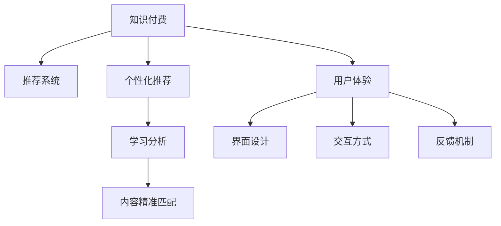

                 

# 如何提高知识付费产品的用户满意度

## 1. 背景介绍

### 1.1 问题由来
随着互联网技术的发展，知识付费作为一种新型的教育消费形式，逐渐成为教育行业的重要组成部分。近年来，知识付费平台如雨后春笋般涌现，涉及内容涵盖编程、法律、金融、心理等多个领域。然而，用户满意度不高、内容质量参差不齐等问题依然困扰着知识付费市场的发展。用户如何精准筛选高质量内容，提升学习体验，已经成为平台运营商面临的重要挑战。

### 1.2 问题核心关键点
为有效提升知识付费产品的用户满意度，需关注以下核心问题：
- 如何保证内容的精准性和实用性。
- 如何构建高效的推荐系统，为用户推荐其感兴趣的内容。
- 如何提供个性化、沉浸式的学习体验。
- 如何保障平台的安全性、可靠性和稳定性。
- 如何获取用户反馈，不断优化产品功能。

## 2. 核心概念与联系

### 2.1 核心概念概述

为更好地理解如何提高知识付费产品的用户满意度，需首先梳理与该主题相关的核心概念：

- 知识付费（Knowledge Paywall）：通过付费方式获取特定知识资源，如电子书、在线课程、音频讲座等，强调知识的价值和知识获取的效率。
- 推荐系统（Recommender System）：使用算法为用户推荐感兴趣的内容，提升用户满意度。
- 个性化推荐（Personalized Recommendation）：通过分析用户行为，推荐符合其兴趣偏好的内容，增强用户体验。
- 学习分析（Learning Analytics）：通过收集、分析用户学习数据，优化教学内容和推荐算法。
- 内容精准匹配（Content Precision Matching）：确保内容与用户需求精准匹配，提高学习效率。
- 用户体验（User Experience）：涵盖界面设计、交互方式、反馈机制等多方面，直接影响用户对知识付费产品的满意度。

这些核心概念之间的关系可以通过以下Mermaid流程图来展示：



这个流程图展示了知识付费产品的核心组件及其之间的关系：

1. 知识付费是产品的基础，推荐系统通过分析用户行为，为用户推荐高质量内容。
2. 个性化推荐通过学习分析，获取用户兴趣偏好，进一步提升内容匹配精准度。
3. 内容精准匹配确保了用户对推荐内容的高满意度。
4. 用户体验涵盖了界面设计、交互方式、反馈机制等多个层面，直接影响用户对产品的感知和满意度。

## 3. 核心算法原理 & 具体操作步骤
### 3.1 算法原理概述

提升知识付费产品的用户满意度，主要依赖于推荐系统、个性化推荐和用户体验等核心算法和技术。这些算法和技术的原理如下：

1. **推荐系统**：通过分析用户行为数据，预测用户可能感兴趣的内容。常用的算法包括协同过滤、基于内容的推荐、混合推荐等。

2. **个性化推荐**：利用机器学习算法，如深度学习、集成学习等，分析用户历史行为、兴趣标签，预测其潜在需求。

3. **学习分析**：通过收集和分析用户学习数据，优化推荐模型和内容匹配策略。

4. **内容精准匹配**：通过信息检索技术，如倒排索引、向量空间模型等，确保推荐内容与用户需求精准匹配。

5. **用户体验**：通过界面设计、交互方式、反馈机制等，提升用户的学习体验和满意度。

### 3.2 算法步骤详解

以下详细讲解提升知识付费产品用户满意度的关键算法步骤：

**Step 1: 数据收集与预处理**
- 收集用户行为数据（如浏览记录、评分、收藏、购买行为等）。
- 对数据进行清洗、去重、归一化等预处理，以提高算法模型的准确性。

**Step 2: 用户行为建模**
- 利用协同过滤、基于内容的推荐算法，建立用户兴趣模型。
- 利用深度学习模型，如神经协同过滤（Neural Collaborative Filtering），分析用户行为，预测用户兴趣。

**Step 3: 内容推荐**
- 基于协同过滤、基于内容的推荐等算法，构建推荐系统，为每位用户推荐内容。
- 结合学习分析，动态调整推荐策略，提升推荐精度。

**Step 4: 个性化推荐**
- 利用深度学习模型，如循环神经网络（RNN）、长短期记忆网络（LSTM），对用户行为进行分析。
- 根据分析结果，对用户进行分群，建立个性化推荐模型。

**Step 5: 内容精准匹配**
- 通过信息检索技术，如倒排索引、向量空间模型等，对内容进行建模。
- 使用余弦相似度等指标，计算用户和内容之间的相似度，推荐相关内容。

**Step 6: 用户体验优化**
- 对界面进行设计优化，确保界面简洁、美观、易用。
- 提供丰富的交互方式，如交互式问答、讨论区等，增强用户互动。
- 引入反馈机制，如评分系统、评论功能等，及时获取用户反馈。

**Step 7: 持续优化**
- 根据用户反馈，不断优化推荐算法和内容匹配策略。
- 定期更新用户兴趣模型和内容库，保持内容的时效性和相关性。

### 3.3 算法优缺点

提升知识付费产品用户满意度的算法和步骤具有以下优点：
- 提升用户满意度：通过推荐系统、个性化推荐等技术，提升用户对知识付费产品的满意度。
- 降低用户流失率：推荐符合用户兴趣的内容，减少用户流失。
- 优化用户体验：通过界面设计、交互方式、反馈机制等，提升用户体验。
- 动态调整：根据用户行为和反馈，动态调整推荐策略，提高推荐精度。

同时，这些算法和步骤也存在一些局限性：
- 数据依赖：推荐系统的准确性和个性化推荐的效果，很大程度上取决于数据质量和数据量。
- 算法复杂度：深度学习模型和信息检索技术的计算复杂度高，需要高性能计算资源支持。
- 动态变化：用户兴趣和内容库的动态变化，可能影响推荐效果。

尽管存在这些局限性，但通过合理设计和优化，这些算法和步骤仍能在知识付费产品的用户满意度提升方面发挥重要作用。

### 3.4 算法应用领域

提升知识付费产品用户满意度的算法和步骤，广泛应用于以下领域：

1. **在线教育**：通过个性化推荐和内容精准匹配，为学生提供高质量的在线课程和学习资源。
2. **职业培训**：利用推荐系统，为职业培训者推荐适合的培训课程，提升培训效果。
3. **金融理财**：通过推荐系统，为金融理财用户推荐投资策略、市场分析等内容。
4. **健康医疗**：为医疗用户推荐健康知识、疾病预防等内容，提升健康意识和医疗知识水平。
5. **企业培训**：为企业的员工培训部门，推荐适合的培训课程和资料，提高培训效果。

## 4. 数学模型和公式 & 详细讲解  
### 4.1 数学模型构建

以下将使用数学语言对推荐系统和个性化推荐算法的构建进行详细讲解。

记用户集合为 $U=\{u_1,u_2,\dots,u_m\}$，内容集合为 $I=\{i_1,i_2,\dots,i_n\}$。假设用户对内容的评分矩阵为 $R\in\mathbb{R}^{m\times n}$，其中 $R_{ui}$ 表示用户 $u_i$ 对内容 $i_j$ 的评分。用户和内容的交互行为表示为 $\{(u_1,i_1),(u_2,i_2),\dots,(u_m,i_n)\}$，其中 $u_i$ 表示用户，$i_j$ 表示内容。

定义用户兴趣向量 $u_i\in\mathbb{R}^d$，内容特征向量 $i_j\in\mathbb{R}^d$，用户与内容的评分 $r_{ui}=\langle u_i,i_j\rangle$。推荐目标是通过训练推荐模型，预测用户对内容的评分，即最大化：

$$
\max\limits_{\theta} \sum\limits_{i\in I} \sum\limits_{j\in I} r_{ij} \log \sigma(\langle u_i,\theta \rangle)
$$

其中 $\sigma(x)=1/(1+e^{-x})$ 为sigmoid函数，$\theta$ 为模型的参数。

### 4.2 公式推导过程

基于协同过滤算法的推荐模型，假设有 $k$ 个用户-内容交互样本 $\{(u_1,i_1),(u_2,i_2),\dots,(u_k,i_k)\}$，每个用户对内容的评分 $r_{ui}$，定义用户兴趣向量 $u_i\in\mathbb{R}^d$，内容特征向量 $i_j\in\mathbb{R}^d$，用户与内容的评分 $r_{ui}=\langle u_i,i_j\rangle$。

推荐模型通过最大化以下目标函数：

$$
\max\limits_{\theta} \sum\limits_{i\in I} \sum\limits_{j\in I} r_{ij} \log \sigma(\langle u_i,\theta \rangle)
$$

其中 $\sigma(x)=1/(1+e^{-x})$ 为sigmoid函数，$\theta$ 为模型的参数。

求解上述目标函数，可以得到用户兴趣向量 $u_i$ 和内容特征向量 $i_j$。推荐算法通过余弦相似度计算用户和内容的相似度，推荐相关内容。

### 4.3 案例分析与讲解

以B站（哔哩哔哩）视频推荐为例，B站通过协同过滤算法为用户推荐其可能感兴趣的视频内容。具体实现步骤如下：

1. 收集用户观看行为数据，如观看时长、点赞、收藏等。
2. 对数据进行清洗和归一化，去除重复和异常数据。
3. 使用协同过滤算法，建立用户兴趣模型。
4. 对新视频内容进行特征提取，建立内容特征向量。
5. 通过余弦相似度计算用户和内容之间的相似度，推荐相关内容。

## 5. 项目实践：代码实例和详细解释说明
### 5.1 开发环境搭建

为进行知识付费产品推荐系统的开发，需搭建开发环境：

1. 安装Python 3.x版本：确保Python的最新版本，避免兼容性问题。
2. 安装相关库：使用pip安装numpy、pandas、scikit-learn等库。
3. 配置环境变量：确保能够正常导入和使用第三方库。
4. 搭建测试环境：使用Docker或Kubernetes搭建测试环境，模拟实际运行环境。

### 5.2 源代码详细实现

以下是使用PyTorch实现基于协同过滤算法的推荐系统的代码示例：

```python
import torch
import torch.nn as nn
import torch.optim as optim
from sklearn.metrics import mean_absolute_error

# 定义协同过滤模型
class CollaborativeFiltering(nn.Module):
    def __init__(self, n_users, n_items, hidden_dim):
        super(CollaborativeFiltering, self).__init__()
        self.hidden_dim = hidden_dim
        self.user_bias = nn.Parameter(torch.randn(n_users))
        self.item_bias = nn.Parameter(torch.randn(n_items))
        self.user_embed = nn.EmbeddingBag(n_users, hidden_dim)
        self.item_embed = nn.EmbeddingBag(n_items, hidden_dim)
        self.fc = nn.Linear(hidden_dim*2, 1)
    
    def forward(self, users, items):
        user_embed = self.user_embed(users)
        item_embed = self.item_embed(items)
        bias = self.user_bias + self.item_bias
        return torch.sigmoid(self.fc(torch.cat([user_embed, item_embed], dim=1) + bias))

# 加载数据
user_ids = torch.tensor([1, 2, 3, 4, 5], dtype=torch.long)
item_ids = torch.tensor([1, 2, 3, 4, 5], dtype=torch.long)
ratings = torch.tensor([4.5, 3.0, 5.0, 2.0, 3.5], dtype=torch.float)
model = CollaborativeFiltering(n_users=5, n_items=5, hidden_dim=32)
criterion = nn.BCELoss()
optimizer = optim.Adam(model.parameters(), lr=0.01)

# 训练模型
for epoch in range(100):
    optimizer.zero_grad()
    predictions = model(user_ids, item_ids)
    loss = criterion(predictions, ratings)
    loss.backward()
    optimizer.step()
    print(f'Epoch {epoch+1}, Loss: {loss.item()}')

# 评估模型
test_user_ids = torch.tensor([1, 2, 3, 4, 5], dtype=torch.long)
test_item_ids = torch.tensor([6, 7, 8, 9, 10], dtype=torch.long)
test_ratings = torch.tensor([4.0, 3.5, 4.5, 2.0, 3.0], dtype=torch.float)
test_predictions = model(test_user_ids, test_item_ids)
print(f'Test MAE: {mean_absolute_error(test_ratings, test_predictions)}.')
```

### 5.3 代码解读与分析

上述代码实现了基于协同过滤算法的推荐模型，其核心步骤包括：

1. 定义模型：包括用户和内容的嵌入层、全连接层等。
2. 加载数据：定义用户、内容、评分数据，并准备模型训练。
3. 训练模型：使用Adam优化器进行参数更新，最小化损失函数。
4. 评估模型：在测试集上评估模型性能，输出均方误差（MAE）。

## 6. 实际应用场景
### 6.1 在线教育

在线教育平台如Coursera、Udemy等，利用推荐系统为用户推荐其感兴趣和适合的课程内容，提升学习体验和效果。以Coursera为例，用户可以通过填写兴趣问卷、浏览历史数据、学习进度等，生成个性化推荐列表，提升学习效率。

### 6.2 职业培训

企业内部培训平台如LinkedIn Learning，通过推荐系统为用户推荐适合的培训课程和资料，提升培训效果。以LinkedIn Learning为例，用户可以通过评分、学习进度、课程评价等数据，生成个性化推荐列表，加速技能提升。

### 6.3 金融理财

金融理财平台如Mint，通过推荐系统为用户推荐投资策略、市场分析等内容，提升理财效果。以Mint为例，用户可以通过历史交易记录、风险偏好、投资目标等数据，生成个性化推荐列表，优化投资决策。

### 6.4 健康医疗

健康医疗平台如Apple Health，通过推荐系统为用户推荐健康知识、疾病预防等内容，提升健康意识和医疗知识水平。以Apple Health为例，用户可以通过健康数据、饮食偏好、生活习惯等数据，生成个性化推荐列表，促进健康管理。

## 7. 工具和资源推荐
### 7.1 学习资源推荐

为帮助开发者系统掌握知识付费产品的推荐系统，推荐以下学习资源：

1. 《推荐系统》一书：由Wikipedia推荐系统条目团队编写，系统介绍推荐系统的理论基础和算法实现。
2. Coursera《Recommender Systems》课程：斯坦福大学开设的推荐系统课程，涵盖协同过滤、基于内容的推荐、混合推荐等算法。
3. Kaggle《Recommender System》竞赛：通过实际数据集，练习和优化推荐系统算法。
4. Arxiv推荐系统论文集：阅读最新的推荐系统算法论文，掌握前沿技术动态。

通过对这些资源的学习实践，相信你一定能够快速掌握推荐系统的精髓，并用于解决实际的推荐问题。

### 7.2 开发工具推荐

高效的开发离不开优秀的工具支持。以下是几款用于知识付费产品推荐系统开发的常用工具：

1. PyTorch：基于Python的开源深度学习框架，灵活动态的计算图，适合快速迭代研究。
2. TensorFlow：由Google主导开发的开源深度学习框架，生产部署方便，适合大规模工程应用。
3. Scikit-learn：基于Python的机器学习库，提供丰富的模型和工具，适合快速原型开发。
4. Scrapy：开源爬虫框架，用于收集和清洗推荐系统所需的数据。
5. Apache Spark：分布式计算框架，支持大规模数据处理和推荐系统的计算。

合理利用这些工具，可以显著提升知识付费产品推荐系统的开发效率，加快创新迭代的步伐。

### 7.3 相关论文推荐

推荐系统技术的发展源于学界的持续研究。以下是几篇奠基性的相关论文，推荐阅读：

1. BPR: Bayesian Personalized Ranking from Implicit Feedback（即BPR算法）：提出基于梯度下降的贝叶斯个性化排序算法，广泛用于协同过滤推荐系统。
2. CF: Collaborative Filtering for Implicit Feedback Datasets：提出协同过滤推荐算法，通过分析用户行为，预测用户兴趣。
3. Matrix Factorization Techniques for Recommender Systems：介绍矩阵分解技术，用于协同过滤和基于内容的推荐系统。
4. Deep Feature Extraction Using Deep Neural Networks：提出深度学习模型用于特征提取和推荐系统。
5. Recommender Systems with Matrix Factorization Techniques：介绍矩阵分解技术在推荐系统中的应用，涵盖协同过滤和基于内容的推荐。

这些论文代表了大语言模型微调技术的发展脉络。通过学习这些前沿成果，可以帮助研究者把握学科前进方向，激发更多的创新灵感。

## 8. 总结：未来发展趋势与挑战

### 8.1 总结

本文对如何提高知识付费产品的用户满意度进行了全面系统的介绍。首先阐述了推荐系统、个性化推荐和用户体验等核心概念，明确了提升用户满意度的关键点。其次，从原理到实践，详细讲解了推荐系统和个性化推荐算法的构建和实现。最后，本文还广泛探讨了推荐系统在在线教育、职业培训、金融理财等领域的实际应用场景，展示了推荐系统的巨大潜力。

通过本文的系统梳理，可以看到，推荐系统为知识付费产品的用户满意度提升提供了有力的技术支持。推荐系统通过分析用户行为，精准匹配内容，实现了个性化推荐，显著提升了用户的学习效率和满意度。未来，随着推荐算法的不断优化和推荐系统的广泛应用，知识付费产品必将在教育、培训、理财等多个领域带来深刻变革。

### 8.2 未来发展趋势

展望未来，推荐系统的用户满意度提升将呈现以下几个发展趋势：

1. 推荐算法的多样化：推荐算法将从传统的协同过滤和基于内容的推荐，向深度学习、强化学习等新兴算法发展，提升推荐精度和用户满意度。
2. 推荐系统的跨领域应用：推荐系统将从单一领域应用，向多领域、跨领域的融合发展，提供更为全面和精准的推荐服务。
3. 推荐系统的实时性：随着实时计算技术的进步，推荐系统将具备更高的实时性，能够快速响应用户需求，提供即时的推荐内容。
4. 推荐系统的智能化：推荐系统将引入自然语言处理、计算机视觉等技术，实现更为智能的推荐，提升用户体验。
5. 推荐系统的可解释性：推荐系统将更加注重算法可解释性，提供透明、可理解的推荐机制，增强用户信任。
6. 推荐系统的社会化：推荐系统将引入社会化推荐机制，利用社交网络数据，提升推荐效果和用户满意度。

以上趋势凸显了推荐系统技术的发展方向，将进一步提升知识付费产品的用户满意度，为用户提供更为智能、个性化、实时、可解释的推荐服务。

### 8.3 面临的挑战

尽管推荐系统在用户满意度提升方面取得了显著进展，但仍面临诸多挑战：

1. 数据隐私和安全：推荐系统需要收集和分析大量用户数据，如何保护用户隐私和安全，防止数据滥用，是重要的问题。
2. 数据质量和多样性：推荐系统的效果很大程度上取决于数据质量和多样性，如何获取高质量、多样化的数据，是推荐系统的重要挑战。
3. 算法复杂度和资源消耗：深度学习等算法的计算复杂度高，资源消耗大，如何优化算法，降低资源消耗，是推荐系统的关键问题。
4. 动态变化和适应性：用户兴趣和内容库的动态变化，如何及时更新推荐模型，保持推荐效果，是推荐系统的技术挑战。
5. 推荐效果的公平性：推荐系统需要确保公平性，避免算法偏见，推荐效果需要满足不同群体的需求。

这些挑战将需要学界和产业界共同努力，不断探索和优化推荐系统技术，才能更好地服务于知识付费产品的用户满意度提升。

### 8.4 研究展望

面对推荐系统面临的诸多挑战，未来的研究需要在以下几个方面寻求新的突破：

1. 探索无监督和半监督推荐方法：摆脱对大量标注数据的依赖，利用自监督学习、主动学习等无监督和半监督范式，最大化利用非结构化数据，实现更加灵活高效的推荐。
2. 研究参数高效和计算高效的推荐范式：开发更加参数高效的推荐算法，在固定大部分预训练参数的情况下，只更新极少量的推荐参数。同时优化推荐模型的计算图，减少前向传播和反向传播的资源消耗，实现更加轻量级、实时性的推荐。
3. 引入因果分析和博弈论工具：将因果分析方法引入推荐系统，识别出推荐决策的关键特征，增强推荐系统的可解释性。借助博弈论工具，刻画用户与推荐系统的交互过程，主动探索并规避推荐系统的脆弱点，提高系统稳定性。
4. 结合多模态信息进行推荐：结合视觉、语音等多模态信息，提升推荐系统对用户需求的理解和预测能力。
5. 引入伦理道德约束：在推荐系统的训练目标中引入伦理导向的评估指标，过滤和惩罚有偏见、有害的输出倾向。加强人工干预和审核，建立推荐系统的监管机制，确保推荐内容符合用户价值观和伦理道德。

这些研究方向的探索，将引领推荐系统技术迈向更高的台阶，为知识付费产品的用户满意度提升提供更为全面、可靠、智能的推荐服务。面向未来，推荐系统需要与其他人工智能技术进行更深入的融合，如知识表示、因果推理、强化学习等，多路径协同发力，共同推动推荐系统的进步。

## 9. 附录：常见问题与解答

**Q1：如何衡量推荐系统的推荐效果？**

A: 推荐系统的效果通常通过以下几个指标来衡量：
1. 准确性（Accuracy）：推荐系统推荐的物品与用户实际兴趣的匹配度，如准确率、精确率、召回率等。
2. 多样性（Diversity）：推荐系统推荐物品的多样性，避免重复推荐相同物品。
3. 新颖性（Novelty）：推荐系统推荐物品的新颖性，避免推荐过多用户已经熟悉的内容。
4. 覆盖率（Coverage）：推荐系统推荐的物品覆盖用户兴趣空间的比例，避免推荐过于集中。
5. 满意度（User Satisfaction）：用户对推荐系统的整体满意度，通过用户反馈、评分等数据评估。

**Q2：推荐系统如何处理长尾物品？**

A: 长尾物品是指用户需求稀疏、销量较少的物品。推荐系统可以通过以下方法处理长尾物品：
1. 协同过滤算法：通过分析用户历史行为，预测用户对长尾物品的兴趣，提升推荐效果。
2. 基于内容的推荐：利用长尾物品的特征信息，建立物品与用户的兴趣模型，提高推荐精度。
3. 融合推荐：结合协同过滤和基于内容的推荐算法，综合多方面的信息，提升推荐效果。
4. 动态调整：根据用户反馈和行为数据，动态调整推荐策略，提高长尾物品的推荐效果。

**Q3：推荐系统如何处理用户兴趣变化？**

A: 用户兴趣可能会随着时间变化，推荐系统可以通过以下方法处理用户兴趣变化：
1. 时间衰减：对用户历史行为进行时间衰减，减小历史行为的权重，增强实时行为的影响。
2. 学习分析：通过学习分析用户行为数据，动态调整推荐策略，适应用户兴趣变化。
3. 交互反馈：通过用户交互反馈，及时调整推荐算法，优化推荐效果。
4. 多模态融合：结合用户的多模态数据（如社交网络、搜索历史等），全面了解用户兴趣变化，提高推荐效果。

**Q4：推荐系统如何优化用户体验？**

A: 推荐系统可以通过以下方法优化用户体验：
1. 界面设计：设计简洁、美观、易用的界面，提升用户的操作体验。
2. 交互方式：提供丰富的交互方式，如交互式问答、讨论区等，增强用户互动。
3. 反馈机制：引入评分系统、评论功能等，及时获取用户反馈，优化推荐算法。
4. 个性化推荐：根据用户历史行为和兴趣，提供个性化的推荐内容，提高用户满意度。
5. 实时推荐：利用实时计算技术，实现实时推荐，提升用户体验。

通过本文的系统梳理，相信你一定能够掌握推荐系统的核心原理和实践技巧，为知识付费产品的用户满意度提升提供有力支持。面向未来，推荐系统将在更多领域得到应用，为各行各业带来新的机遇和挑战。通过不断探索和优化，推荐系统必将在提升用户体验、推动知识付费产品发展方面发挥重要作用。

---

作者：禅与计算机程序设计艺术 / Zen and the Art of Computer Programming

