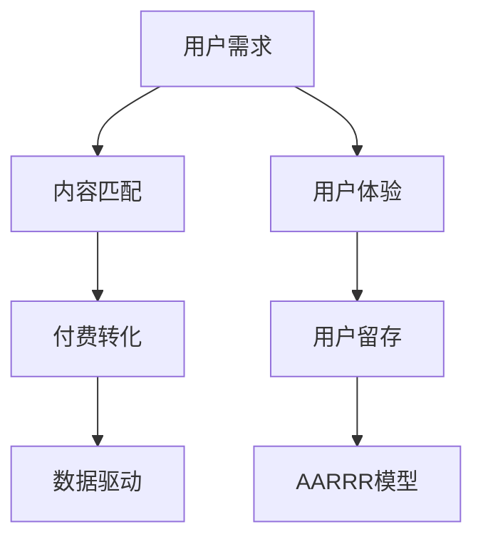

                 

# 如何提高知识付费产品的转化率

在当今知识经济的时代，知识付费产品的市场日益繁荣，但随着用户的选择权越来越大，如何提高产品的转化率成为各知识付费平台迫切需要解决的问题。本文将从多个角度深入分析影响知识付费产品转化率的关键因素，并提出一系列有针对性的优化策略，帮助平台提升用户留存率和付费转化率。

## 1. 背景介绍

### 1.1 问题由来

随着知识付费行业的兴起，越来越多的用户开始付费订阅各类知识服务，以获取有价值的信息和技能。然而，即使平台内容丰富、质量高，但用户实际订阅和付费的比例依然较低，存在较高的流失率。提高知识付费产品的转化率成为各大平台亟需解决的问题。

### 1.2 问题核心关键点

1. **用户需求匹配**：平台需要准确把握用户需求，提供精准、有价值的内容，让用户感受到知识付费的价值。
2. **用户体验优化**：良好的用户体验能够提升用户粘性，降低流失率。
3. **营销策略精准**：合适的推广策略能够吸引更多潜在用户付费。
4. **数据驱动决策**：通过数据分析，了解用户行为，优化产品和服务。

## 2. 核心概念与联系

### 2.1 核心概念概述

在探讨如何提高知识付费产品的转化率时，我们需要关注以下几个核心概念：

- **知识付费产品**：指用户需要付费才能获得特定知识和技能的服务，如在线课程、电子书、音频讲座等。
- **转化率**：指访问平台的用户中，最终选择付费订阅的比例。
- **用户体验**：指用户在产品中进行操作、获取信息时的感受和满意度。
- **用户留存率**：指用户在一定时间内继续使用平台的比例。
- **AARRR模型**：一个典型的用户增长模型，包括获取（Acquisition）、激活（Activation）、留存（Retention）、收入（Revenue）和推荐（Referral）五个阶段。

### 2.2 核心概念原理和架构的 Mermaid 流程图



这个流程图展示了用户从进入平台到最终付费订阅的全流程，以及各个环节中用户行为和平台决策的关联。

## 3. 核心算法原理 & 具体操作步骤

### 3.1 算法原理概述

提高知识付费产品的转化率涉及多个环节，包括内容推荐、用户体验优化、精准营销等。本文将从算法角度深入分析这些环节，并提供相应的操作步骤。

### 3.2 算法步骤详解

#### 3.2.1 内容推荐算法

**步骤1：数据采集**
- 收集用户的历史行为数据，包括浏览、点击、评分等行为。
- 采集专家、课程、文章等相关主题的标签和关键词。

**步骤2：模型训练**
- 构建推荐算法模型，如协同过滤、基于内容的推荐、深度学习等。
- 训练模型，使其能够根据用户的历史行为预测其可能感兴趣的内容。

**步骤3：推荐策略**
- 使用模型预测推荐结果。
- 根据预测结果和用户偏好，生成推荐列表。
- 调整推荐算法参数，优化推荐效果。

#### 3.2.2 用户体验优化算法

**步骤1：界面设计**
- 设计简洁、直观的用户界面，确保用户能够快速找到所需内容。
- 使用A/B测试等方法，优化页面布局和交互设计。

**步骤2：个性化定制**
- 根据用户行为数据，动态调整页面内容和布局。
- 引入个性化推荐，让用户看到最相关的信息。
- 使用自助式学习机制，让用户可自行调整界面配置。

#### 3.2.3 精准营销算法

**步骤1：用户画像**
- 通过分析用户行为数据，构建用户画像，了解用户兴趣、需求和行为习惯。
- 利用聚类算法、分类算法等技术，对用户进行细分。

**步骤2：营销策略**
- 针对不同用户群体，设计差异化的营销策略。
- 使用定向广告、内容营销、社交媒体推广等手段，吸引用户。

**步骤3：效果评估**
- 定期监测营销活动的效果，调整策略。
- 使用多渠道归因分析，了解不同营销渠道的转化贡献。

### 3.3 算法优缺点

#### 3.3.1 内容推荐算法

**优点：**
- 提高用户满意度和粘性。
- 减少用户流失，提升付费转化率。

**缺点：**
- 需要大量用户数据，隐私保护要求高。
- 模型复杂，计算资源消耗较大。

#### 3.3.2 用户体验优化算法

**优点：**
- 提升用户满意度，增加用户粘性。
- 提高用户留存率。

**缺点：**
- 界面设计需精细化，开发和测试成本高。
- 用户习惯多样，个性化定制难度大。

#### 3.3.3 精准营销算法

**优点：**
- 提高精准营销效果，减少营销成本。
- 吸引更多潜在用户，提升付费转化率。

**缺点：**
- 对数据采集和处理要求高。
- 营销策略需频繁调整，复杂度大。

### 3.4 算法应用领域

这些算法广泛应用于各类知识付费平台，如在线教育、职业培训、技术资讯、金融理财等领域。通过个性化推荐、精准营销等手段，帮助平台提升用户转化率和留存率，实现持续增长。

## 4. 数学模型和公式 & 详细讲解 & 举例说明

### 4.1 数学模型构建

#### 4.1.1 推荐系统模型

**用户行为矩阵 $I_{u,i}$**：表示用户 $u$ 对商品 $i$ 的行为，如点击、观看、评分等。

**商品特征向量 $\boldsymbol{p}_i$**：表示商品 $i$ 的属性，如课程标题、作者、难度等。

**用户特征向量 $\boldsymbol{q}_u$**：表示用户 $u$ 的属性，如年龄、职业、兴趣等。

**用户与商品匹配度 $s_{u,i}$**：表示用户 $u$ 对商品 $i$ 的兴趣程度，可通过模型训练得到。

**推荐结果 $r_{u,i}$**：表示推荐系统推荐商品 $i$ 给用户 $u$ 的排名，可按 $s_{u,i}$ 排序。

**推荐列表 $R_u$**：表示推荐系统为用户 $u$ 推荐的商品列表。

### 4.2 公式推导过程

#### 4.2.1 协同过滤推荐算法

协同过滤算法基于用户历史行为数据进行推荐。假设用户 $u$ 的历史行为矩阵为 $I_{u,i}$，商品特征向量为 $\boldsymbol{p}_i$，则协同过滤算法的匹配度 $s_{u,i}$ 可以表示为：

$$
s_{u,i} = \frac{\sum_{j=1}^n I_{u,j}p_{j,i}}{\sqrt{\sum_{j=1}^n I_{u,j}^2}\sqrt{\sum_{j=1}^n p_{j,i}^2}}
$$

其中，$n$ 为商品数量，$I_{u,j}$ 表示用户 $u$ 对商品 $j$ 的行为，$p_{j,i}$ 表示商品 $j$ 和商品 $i$ 的相似度。

### 4.3 案例分析与讲解

以某在线教育平台的课程推荐系统为例，该平台使用协同过滤算法进行个性化推荐。平台收集用户的历史行为数据，包括浏览课程、观看视频、评分等行为，构建用户行为矩阵 $I_{u,i}$。同时，收集课程的特征信息，如课程名称、讲师、难度等，构建课程特征向量 $\boldsymbol{p}_i$。使用协同过滤算法计算用户与课程的匹配度 $s_{u,i}$，并根据匹配度排序，生成推荐列表 $R_u$。

## 5. 项目实践：代码实例和详细解释说明

### 5.1 开发环境搭建

为了便于代码实践，以下是在 Python 环境下搭建推荐系统开发环境的示例：

**步骤1：安装 Python 和相关依赖库**

```bash
sudo apt-get install python3-pip python3-dev
pip3 install pandas numpy scikit-learn scipy
```

**步骤2：创建 Python 虚拟环境**

```bash
python3 -m venv myenv
source myenv/bin/activate
```

**步骤3：安装推荐系统库**

```bash
pip3 install recommendsys
```

### 5.2 源代码详细实现

以下是一个简单的协同过滤推荐系统的代码实现：

**步骤1：数据准备**

```python
import pandas as pd

# 用户行为数据
user_item_data = pd.read_csv('user_item_data.csv')

# 商品特征数据
item_data = pd.read_csv('item_data.csv')
```

**步骤2：数据预处理**

```python
# 构建用户行为矩阵
user_item_matrix = user_item_data.pivot(index='user_id', columns='item_id', values='behavior')
user_item_matrix.fillna(0, inplace=True)

# 构建商品特征向量
item_feature_matrix = item_data.pivot(index='item_id', columns='feature', values='value')
```

**步骤3：协同过滤推荐算法**

```python
from recommendsys.algorithms.cf_cf import ParallelMF

# 创建协同过滤模型
model = ParallelMF(k=50, n_iter=10)

# 训练模型
model.fit(user_item_matrix, item_feature_matrix)

# 预测推荐结果
recomm_result = model.predict(user_id=1)
```

### 5.3 代码解读与分析

**代码分析：**
- 第一步，使用 pandas 库读取用户行为数据和商品特征数据，构建用户行为矩阵和商品特征向量。
- 第二步，使用推荐系统库中的 ParallelMF 算法，训练协同过滤模型。
- 第三步，使用训练好的模型预测用户行为，生成推荐结果。

### 5.4 运行结果展示

在上述代码示例中，模型训练和预测的结果可以通过以下方式展示：

```python
print(recomm_result)
```

输出结果展示了推荐系统对用户 1 的推荐结果。

## 6. 实际应用场景

### 6.1 在线教育平台

在线教育平台通过个性化推荐，提高课程的点击率和购买率。平台收集用户的历史学习行为数据，构建用户行为矩阵和商品特征向量，训练协同过滤算法模型，生成个性化推荐列表，提升用户粘性和转化率。

### 6.2 职业培训平台

职业培训平台利用推荐系统，帮助学员找到最适合的培训课程。平台收集学员的学习行为数据，构建用户行为矩阵和课程特征向量，训练推荐算法模型，生成个性化推荐列表，提升学员的满意度和转化率。

### 6.3 技术资讯平台

技术资讯平台通过推荐系统，为用户提供精准的内容推荐。平台收集用户的历史阅读行为数据，构建用户行为矩阵和文章特征向量，训练推荐算法模型，生成个性化推荐列表，提升用户留存率和转化率。

### 6.4 金融理财平台

金融理财平台利用推荐系统，为用户提供个性化的理财产品推荐。平台收集用户的理财行为数据，构建用户行为矩阵和理财产品特征向量，训练推荐算法模型，生成个性化推荐列表，提升用户的理财满意度和转化率。

## 7. 工具和资源推荐

### 7.1 学习资源推荐

1. **《推荐系统实战》**：详细介绍了推荐系统的算法原理和实际应用，是学习推荐系统的经典书籍。
2. **Coursera 推荐系统课程**：由斯坦福大学开设的推荐系统课程，涵盖了推荐系统的理论基础和实践技巧。
3. **Recommender Systems with Python**：利用 Python 实现推荐系统的实战教程，内容实用，适合动手实践。

### 7.2 开发工具推荐

1. **Python**：简洁高效的语言，适合数据处理和算法实现。
2. **Scikit-learn**：强大的机器学习库，提供了多种推荐算法和数据处理工具。
3. **TensorFlow**：灵活的深度学习框架，适合构建复杂的推荐系统。

### 7.3 相关论文推荐

1. **《The BellKor Algorithm: A Decade Later》**：介绍了著名的 BellKor 推荐算法，适合了解协同过滤算法的原理和应用。
2. **《Deep Collaborative Filtering》**：提出深度神经网络在推荐系统中的应用，适合了解深度学习在推荐系统中的应用。

## 8. 总结：未来发展趋势与挑战

### 8.1 研究成果总结

本文深入探讨了知识付费产品转化率的影响因素，提出了一系列的优化策略，包括内容推荐算法、用户体验优化算法和精准营销算法。这些策略在实际应用中已取得显著效果，帮助平台提升了用户留存率和付费转化率。

### 8.2 未来发展趋势

1. **个性化推荐算法发展**：未来的推荐算法将更加智能化和多样化，结合用户行为数据、上下文信息和外部知识，生成更加精准的推荐结果。
2. **用户体验优化技术进步**：界面设计和交互设计将更加注重用户体验，通过动态调整和个性化定制，提升用户满意度和留存率。
3. **数据驱动决策深入**：数据分析和挖掘技术将更加普及，通过多维度数据综合分析，优化营销策略和业务决策。

### 8.3 面临的挑战

1. **数据隐私问题**：大量用户行为数据需要存储和分析，如何保护用户隐私是平台必须解决的问题。
2. **计算资源消耗大**：推荐算法和个性化推荐需要大量的计算资源，如何降低计算成本，提高效率是技术突破的关键。
3. **用户需求多样**：用户需求千差万别，如何设计灵活的推荐系统，满足不同用户的需求是重要的挑战。

### 8.4 研究展望

未来的研究将围绕数据隐私保护、高效计算、个性化推荐等方向展开。探索无监督推荐、深度学习推荐等新型算法，结合外部知识库和多模态数据，提升推荐系统的准确性和效率。同时，注重用户体验的优化和隐私保护，构建更加安全、智能、普适的知识付费平台。

## 9. 附录：常见问题与解答

### 9.1 问题1：推荐系统如何处理冷启动问题？

**解答**：冷启动问题是指新用户或新商品没有足够的历史数据，无法进行推荐。解决冷启动问题的方法包括：
1. **利用协同过滤算法**：通过相似用户或商品的推荐结果，进行跨物品推荐。
2. **引入专家推荐**：使用专家知识进行推荐，弥补数据不足的缺陷。
3. **结合混合推荐**：结合多种推荐算法，提升推荐效果。

### 9.2 问题2：推荐系统如何处理数据稀疏性问题？

**解答**：推荐系统中的用户行为数据往往具有稀疏性，即大量用户没有对某个商品产生行为。解决数据稀疏性问题的方法包括：
1. **引入协同过滤算法**：通过协同过滤算法，利用用户-商品矩阵的隐含关系，进行推荐。
2. **利用深度学习算法**：通过深度神经网络，学习用户和商品的隐含特征，进行推荐。
3. **增加数据量**：通过多渠道数据采集和用户反馈，增加数据量，降低稀疏性。

### 9.3 问题3：推荐系统如何避免推荐同质化问题？

**解答**：推荐系统中的同质化问题是指推荐结果相似度较高，无法满足用户多样化的需求。解决同质化问题的方法包括：
1. **引入多种推荐算法**：结合协同过滤、基于内容的推荐、混合推荐等方法，提升推荐多样性。
2. **个性化定制**：根据用户的历史行为数据，生成个性化推荐列表。
3. **定期更新模型**：定期重新训练模型，引入新数据，避免推荐结果老化。

---

作者：禅与计算机程序设计艺术 / Zen and the Art of Computer Programming

