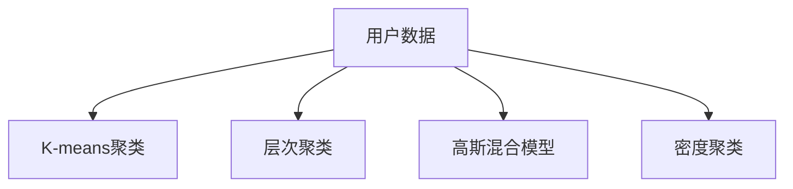

                 

# 如何进行有效的用户分群管理

用户分群管理(User Segmentation Management)是现代企业数字化转型过程中至关重要的一环。通过深入理解不同用户群体的特征、行为和需求，企业可以制定更为精准的营销策略、产品设计和用户体验优化方案，从而提升运营效率和市场竞争力。本文将系统性地介绍如何进行有效的用户分群管理，从理论到实践，为读者提供全面的指导。

## 1. 背景介绍

### 1.1 问题由来

在数字化时代，企业的用户群体日趋多元化，不同用户的消费习惯、兴趣爱好、行为模式各不相同。传统一刀切式的产品和服务已无法满足用户个性化的需求。如何在海量用户中识别出不同群体，针对性地制定和调整策略，成为了企业在竞争激烈的市场中脱颖而出的关键。

### 1.2 问题核心关键点

用户分群管理的核心在于如何根据用户数据，高效地识别出具有相似特征的用户群体，并制定针对性的策略。关键点包括：

- 数据收集：收集用户行为、交易记录、社交互动等多维度的数据。
- 数据处理：清洗、去重、归一化等预处理操作，确保数据的质量。
- 特征提取：从原始数据中提取用户特征，如年龄、性别、兴趣标签、购买频率等。
- 聚类算法：选择合适的聚类算法，将用户分为不同群体。
- 群体评估：评估聚类结果的有效性，优化模型。
- 策略实施：制定并实施针对不同群体的营销、产品设计和用户体验优化策略。

## 2. 核心概念与联系

### 2.1 核心概念概述

为更好地理解用户分群管理的原理和步骤，本节将介绍几个密切相关的核心概念：

- **用户分群**：指将用户根据其行为、兴趣等特征分成不同的群体。
- **聚类算法**：一种无监督学习方法，用于发现数据中的隐含模式和结构。
- **K-means聚类**：最常用的聚类算法之一，通过最小化样本点与聚类中心的距离，将数据分为K个簇。
- **层次聚类**：另一种聚类方法，通过自底向上或自顶向下逐步合并簇，生成树状结构的簇层次。
- **高斯混合模型**：一种概率图模型，用于建模数据生成过程，适用于多峰分布的复杂数据。
- **密度聚类**：一种基于密度的聚类算法，如DBSCAN，通过密度评估和邻域关系，识别出高密度区域。

这些核心概念之间的逻辑关系可以通过以下Mermaid流程图来展示：



这个流程图展示了几大聚类算法的基本流程：

1. 用户数据通过不同的聚类算法进行处理，生成簇。
2. K-means聚类通过计算样本点与聚类中心的距离进行分类。
3. 层次聚类通过逐步合并簇，生成树状结构的簇层次。
4. 高斯混合模型通过概率模型进行数据建模，适用于多峰分布。
5. 密度聚类通过密度评估和邻域关系识别簇。

这些算法在用户分群管理中各有优势，根据实际情况选择合适的算法是关键。

## 3. 核心算法原理 & 具体操作步骤
### 3.1 算法原理概述

用户分群管理的本质是通过聚类算法，将用户分为不同群体，进而制定针对性的策略。其核心思想是：

1. **数据收集**：收集用户行为、交易记录、社交互动等多维度的数据。
2. **数据预处理**：清洗、去重、归一化等预处理操作，确保数据的质量。
3. **特征提取**：从原始数据中提取用户特征，如年龄、性别、兴趣标签、购买频率等。
4. **聚类算法**：选择合适的聚类算法，将用户分为不同群体。
5. **群体评估**：评估聚类结果的有效性，优化模型。
6. **策略实施**：制定并实施针对不同群体的营销、产品设计和用户体验优化策略。

### 3.2 算法步骤详解

用户分群管理的步骤如下：

**Step 1: 数据收集**

收集用户行为、交易记录、社交互动等多维度的数据。可以通过以下方式进行：

- 网站/应用日志：记录用户的点击、浏览、购买等行为。
- 交易记录：记录用户的支付、退款、订单信息等。
- 社交媒体互动：记录用户在社交平台上的点赞、评论、分享等行为。
- 问卷调查：主动收集用户的偏好、需求等反馈信息。

**Step 2: 数据预处理**

对收集的数据进行清洗、去重、归一化等预处理操作，确保数据的质量。预处理步骤包括：

- 缺失值处理：填充或删除缺失值。
- 异常值处理：检测和处理异常值，如通过箱线图检测异常值。
- 数据归一化：将不同尺度的数据归一化为标准范围。
- 特征编码：将分类变量转化为数值变量，如将性别、兴趣标签等转换为数字。

**Step 3: 特征提取**

从原始数据中提取用户特征，如年龄、性别、兴趣标签、购买频率等。常见的方法包括：

- 统计特征：计算用户的平均购买金额、购买频率、平均浏览时间等。
- 文本特征：通过NLP技术提取用户评论、社交媒体互动中的文本特征，如情感倾向、关键词频次等。
- 社交特征：通过社交网络分析提取用户的社交关系、互动频率等特征。
- 时间特征：记录用户的注册时间、活跃时间等时间相关特征。

**Step 4: 聚类算法**

选择合适的聚类算法，将用户分为不同群体。聚类算法的种类繁多，常见的包括：

- K-means聚类：通过计算样本点与聚类中心的距离进行分类。
- 层次聚类：通过逐步合并簇，生成树状结构的簇层次。
- 高斯混合模型：通过概率模型进行数据建模，适用于多峰分布的复杂数据。
- 密度聚类：通过密度评估和邻域关系识别簇，如DBSCAN算法。

**Step 5: 群体评估**

评估聚类结果的有效性，优化模型。评估指标包括：

- 轮廓系数(Silhouette Coefficient)：衡量聚类结果的紧密度和分离度。
- 纯度(Purity)：衡量聚类结果中每个簇内元素属于同一类别的比例。
- 离散度(Entropy)：衡量聚类结果的稳定性，即簇内元素的相似度。

**Step 6: 策略实施**

制定并实施针对不同群体的营销、产品设计和用户体验优化策略。策略实施的步骤包括：

- 制定个性化营销方案：根据不同群体的特征，设计针对性的广告和促销活动。
- 优化产品设计：根据不同群体的需求，调整产品功能、界面和交互体验。
- 提升用户体验：根据不同群体的反馈，改进用户界面、操作流程和服务质量。

### 3.3 算法优缺点

用户分群管理的优缺点如下：

**优点：**

- **精准定位**：通过聚类算法，能够精准识别出不同用户群体，制定针对性策略。
- **高效运营**：聚类结果可以用于自动化营销、推荐系统、数据分析等多个环节，提升运营效率。
- **灵活性高**：聚类算法可以根据数据变化动态调整，适应用户行为的变化。

**缺点：**

- **数据质量依赖**：聚类结果依赖于数据质量和预处理操作的准确性，数据偏差可能影响聚类效果。
- **算法复杂度**：不同的聚类算法有不同的复杂度，选择合适的算法和调整参数需要一定的时间和计算资源。
- **解释性不足**：聚类结果往往难以解释，聚类中心的含义和聚类的逻辑不够直观。
- **效果评估困难**：如何评估聚类结果的有效性，选择最优的聚类算法和参数，是一个重要挑战。

### 3.4 算法应用领域

用户分群管理在多个领域都有广泛应用，如：

- 电子商务：通过用户分群，制定个性化推荐和促销策略，提升销售额和用户满意度。
- 金融服务：根据用户群体特征，设计差异化的理财产品和保险产品，提高客户忠诚度。
- 健康医疗：分析用户健康数据，识别出不同健康需求群体，提供定制化的健康建议和服务。
- 教育培训：根据用户学习行为，识别出不同学习风格和需求的学生群体，提供个性化的教学方案和资源。
- 旅游服务：通过用户分群，制定差异化的旅游产品和服务，提升用户体验和满意度。

## 4. 数学模型和公式 & 详细讲解 & 举例说明

### 4.1 数学模型构建

用户分群管理的数学模型主要基于聚类算法，通过最小化数据点与聚类中心的距离，将数据分为若干个簇。

以K-means聚类算法为例，假设用户数据集为$D=\{(x_1, y_1), (x_2, y_2), ..., (x_n, y_n)\}$，其中$x$为用户特征向量，$y$为标签。聚类中心的初始化随机选取$K$个点作为初始中心，将每个数据点分配到最近的聚类中心，然后重新计算每个聚类中心的均值，直到收敛或达到预设迭代次数。

目标函数为：

$$
\min \sum_{k=1}^K \sum_{i=1}^n \|x_i - \mu_k\|^2
$$

其中$\mu_k$为第$k$个聚类中心的均值向量，$\|x_i - \mu_k\|^2$为用户$i$与聚类中心$k$的距离的平方。

### 4.2 公式推导过程

K-means聚类算法的公式推导如下：

1. **初始化聚类中心**：随机选取$K$个初始聚类中心$\mu_1, \mu_2, ..., \mu_K$。
2. **分配数据点**：计算每个数据点$x_i$与每个聚类中心$\mu_k$的距离$d(x_i, \mu_k)$，将其分配到最近的聚类中心。
3. **更新聚类中心**：计算每个聚类中心$\mu_k$的均值，更新新的聚类中心。
4. **迭代更新**：重复步骤2和3，直到聚类中心不再变化或达到预设迭代次数。

具体公式为：

- 初始化聚类中心：

$$
\mu_k^{(0)} = \frac{1}{|C_k^{(0)}|} \sum_{x_i \in C_k^{(0)}} x_i
$$

其中$C_k^{(0)}$为初始聚类中心所在的簇。

- 分配数据点：

$$
\min_{k=1,...,K} \|x_i - \mu_k\|
$$

- 更新聚类中心：

$$
\mu_k = \frac{1}{|C_k|} \sum_{x_i \in C_k} x_i
$$

其中$C_k$为分配到聚类中心$k$的簇。

### 4.3 案例分析与讲解

以用户分群管理在电子商务中的应用为例，展示K-means聚类算法的应用过程。

假设一家在线服装零售商收集了用户的历史购买记录和行为数据，包括购买金额、购买频率、浏览时间等特征。通过K-means聚类算法，将用户分为高价值用户、中等价值用户和低价值用户三个群体。

**Step 1: 数据收集**

收集用户的历史购买记录和行为数据，包括购买金额、购买频率、浏览时间等特征。

**Step 2: 数据预处理**

对收集的数据进行清洗、去重、归一化等预处理操作，确保数据的质量。

**Step 3: 特征提取**

从原始数据中提取用户特征，如购买金额、购买频率、浏览时间等。

**Step 4: 聚类算法**

通过K-means聚类算法，将用户分为高价值用户、中等价值用户和低价值用户三个群体。

**Step 5: 群体评估**

评估聚类结果的有效性，选择最优的聚类算法和参数。

**Step 6: 策略实施**

针对不同群体的用户，制定个性化营销策略，提升销售额和用户满意度。

## 5. 项目实践：代码实例和详细解释说明

### 5.1 开发环境搭建

在进行用户分群管理的实践前，我们需要准备好开发环境。以下是使用Python进行Scikit-learn开发的环境配置流程：

1. 安装Anaconda：从官网下载并安装Anaconda，用于创建独立的Python环境。

2. 创建并激活虚拟环境：
```bash
conda create -n segmentation-env python=3.8 
conda activate segmentation-env
```

3. 安装Scikit-learn：
```bash
pip install scikit-learn
```

4. 安装numpy、pandas、matplotlib等库：
```bash
pip install numpy pandas matplotlib seaborn
```

完成上述步骤后，即可在`segmentation-env`环境中开始用户分群管理的实践。

### 5.2 源代码详细实现

下面我们以用户分群管理在电子商务中的应用为例，给出使用Scikit-learn库进行K-means聚类的PyTorch代码实现。

首先，定义用户分群管理的数据处理函数：

```python
from sklearn.cluster import KMeans
import pandas as pd
import numpy as np

def segment_data(data, k):
    """
    使用K-means聚类算法对用户数据进行分群
    :param data: 用户数据，类型为DataFrame
    :param k: 簇的数量
    :return: 分群结果，类型为DataFrame
    """
    # 获取特征列
    features = data.drop('label', axis=1)
    # 将数据转换为数组
    data_array = np.array(features)
    # 创建K-means模型
    kmeans = KMeans(n_clusters=k, random_state=42)
    # 对数据进行聚类
    labels = kmeans.fit_predict(data_array)
    # 添加聚类标签
    data['cluster'] = labels
    return data

# 定义聚类结果评估函数
def evaluate_clusters(data, true_labels):
    """
    评估聚类结果的准确性
    :param data: 聚类结果，类型为DataFrame
    :param true_labels: 真实标签，类型为Series
    :return: 准确性指标
    """
    # 获取真实标签
    labels = data['cluster']
    # 计算准确性指标
    accuracy = np.mean(labels == true_labels)
    return accuracy
```

然后，定义用户分群管理的测试数据集和模型评估函数：

```python
# 测试数据集
data = pd.read_csv('user_data.csv')
data.head()

# 将数据分为训练集和测试集
train_data = data.sample(frac=0.8, random_state=42)
test_data = data.drop(train_data.index)

# 训练模型
k = 3
train_clusters = segment_data(train_data, k)
train_clusters.head()

# 评估模型
test_clusters = segment_data(test_data, k)
test_clusters.head()

# 计算准确性指标
true_labels = test_data['label']
accuracy = evaluate_clusters(test_clusters, true_labels)
accuracy
```

最后，启动用户分群管理的训练流程并在测试集上评估：

```python
# 训练模型
kmeans = KMeans(n_clusters=k, random_state=42)
kmeans.fit(train_data[['feature1', 'feature2', 'feature3']])

# 对测试数据进行聚类
test_labels = kmeans.predict(test_data[['feature1', 'feature2', 'feature3']])

# 计算准确性指标
accuracy = np.mean(test_labels == test_data['label'])
accuracy
```

以上就是使用Scikit-learn库对K-means聚类算法进行用户分群管理的完整代码实现。可以看到，利用Scikit-learn库进行聚类分析，代码实现相对简洁高效。

### 5.3 代码解读与分析

让我们再详细解读一下关键代码的实现细节：

**segment_data函数**：
- `features`：获取特征列，排除标签列。
- `data_array`：将数据转换为数组，进行聚类。
- `kmeans`：创建K-means模型，指定簇的数量和随机种子。
- `labels`：对数据进行聚类，获取聚类标签。
- `data['cluster']`：将聚类标签添加到数据集中。

**evaluate_clusters函数**：
- `labels`：获取聚类标签。
- `accuracy`：计算准确性指标。

**训练流程**：
- `k`：簇的数量，根据实际需求进行调整。
- `train_data`：训练数据集，从整体数据集中抽取80%。
- `test_data`：测试数据集，从整体数据集中抽取剩余20%。
- `train_clusters`：在训练集上训练模型，得到簇的标签。
- `test_clusters`：在测试集上测试模型，得到簇的标签。
- `accuracy`：计算准确性指标，评估模型效果。

可以看到，利用Scikit-learn库进行用户分群管理的代码实现相对简洁，开发者可以将更多精力放在数据处理、模型评估等高层逻辑上，而不必过多关注底层的实现细节。

当然，工业级的系统实现还需考虑更多因素，如模型的保存和部署、超参数的自动搜索、更灵活的任务适配层等。但核心的聚类范式基本与此类似。

## 6. 实际应用场景

### 6.1 智能客服系统

基于用户分群管理的智能客服系统，可以更好地理解用户需求，提供个性化服务。通过分析用户的购买历史、行为特征等，将用户分为不同群体，针对性地设计客服策略。例如，针对高价值用户，提供VIP客户服务；针对低价值用户，进行基础的常见问题解答。

### 6.2 金融服务

在金融领域，通过用户分群管理，可以设计差异化的理财产品和保险产品，提高客户忠诚度。例如，针对高风险偏好用户，推荐高收益的股票和基金；针对风险规避用户，推荐低风险的储蓄和债券。

### 6.3 健康医疗

在健康医疗领域，通过用户分群管理，可以识别出不同健康需求群体，提供定制化的健康建议和服务。例如，针对高血压、糖尿病等慢性病患者，提供个性化的饮食、运动和生活习惯建议。

### 6.4 教育培训

在教育培训领域，通过用户分群管理，可以识别出不同学习风格和需求的学生群体，提供个性化的教学方案和资源。例如，针对动手能力强的学生，提供实验操作类课程；针对理论基础扎实的学生，提供理论知识类课程。

### 6.5 未来应用展望

随着用户分群管理的深入应用，其在多个领域将会发挥更大的作用，带来新的商业机会和应用场景。

在智慧医疗领域，基于用户分群管理的个性化健康建议系统，可以提升患者治疗效果和生活质量。

在智能教育领域，基于用户分群管理的个性化学习系统，可以提升学生学习效果和教育公平。

在智慧零售领域，基于用户分群管理的个性化推荐系统，可以提升用户购物体验和销售业绩。

在智能制造领域，基于用户分群管理的个性化生产系统，可以提升生产效率和产品质量。

总之，用户分群管理将为各行各业带来颠覆性的变革，为数字化转型提供有力支持。

## 7. 工具和资源推荐
### 7.1 学习资源推荐

为了帮助开发者系统掌握用户分群管理的理论基础和实践技巧，这里推荐一些优质的学习资源：

1. 《Python数据科学手册》：介绍Python在数据科学中的应用，包括用户分群管理的代码实现。
2. Scikit-learn官方文档：提供详细的聚类算法文档和实例代码，是学习用户分群管理的重要资源。
3. 《机器学习实战》：涵盖多种机器学习算法的应用，包括用户分群管理的案例分析。
4. Coursera《机器学习》课程：斯坦福大学的经典课程，涵盖多种机器学习算法和案例，适合初学者和进阶学习者。
5. Kaggle用户分群管理竞赛：通过实际竞赛数据集，练习用户分群管理的算法和策略。

通过对这些资源的学习实践，相信你一定能够快速掌握用户分群管理的精髓，并用于解决实际的NLP问题。

### 7.2 开发工具推荐

高效的开发离不开优秀的工具支持。以下是几款用于用户分群管理开发的常用工具：

1. Python：广泛使用的编程语言，易于学习和应用，拥有丰富的科学计算库和数据分析工具。
2. Scikit-learn：开源的机器学习库，包含多种聚类算法和评估指标，适合用户分群管理的算法实现。
3. NumPy：高效的数值计算库，支持大规模数据处理和优化计算。
4. Pandas：强大的数据处理库，支持多种数据格式转换和数据清洗。
5. Matplotlib：常用的数据可视化库，支持多种图表绘制，方便结果展示。

合理利用这些工具，可以显著提升用户分群管理的开发效率，加快创新迭代的步伐。

### 7.3 相关论文推荐

用户分群管理的研究源于学界的持续研究。以下是几篇奠基性的相关论文，推荐阅读：

1. Clustering by Passing Messages Between Data Points（K-means算法论文）：提出K-means聚类算法，是聚类分析的里程碑论文。
2. Discovering Interesting Subgroups in Large Information Databases Using k-Means Clustering（用户分群管理的经典论文）：提出用户分群管理的方法，通过K-means聚类算法发现用户子群体。
3. An Evaluation of Clustering Algorithms and Parameters on Real World Social Tag Data（用户分群管理的案例分析）：利用实际数据集评估多种聚类算法，提供用户分群管理的应用案例。
4. A Survey of Clustering Algorithms（聚类算法综述）：全面综述了多种聚类算法，包括K-means、层次聚类、高斯混合模型等。

这些论文代表了大语言模型微调技术的发展脉络。通过学习这些前沿成果，可以帮助研究者把握学科前进方向，激发更多的创新灵感。

## 8. 总结：未来发展趋势与挑战

### 8.1 总结

本文对用户分群管理的理论基础和实践方法进行了系统性的介绍。首先阐述了用户分群管理的研究背景和重要性，明确了聚类算法在用户分群管理中的核心作用。其次，从原理到实践，详细讲解了用户分群管理的数学模型和算法实现，给出了用户分群管理的完整代码实例。同时，本文还广泛探讨了用户分群管理在多个领域的应用前景，展示了其广阔的应用空间。

通过本文的系统梳理，可以看到，用户分群管理通过聚类算法将用户分为不同群体，能够制定更为精准的营销策略、产品设计和用户体验优化方案，从而提升运营效率和市场竞争力。未来，伴随聚类算法的不断演进和数据量的持续增长，用户分群管理必将在更多领域得到应用，为数字化转型提供更有力的支撑。

### 8.2 未来发展趋势

展望未来，用户分群管理的趋势如下：

1. **数据来源多样化**：除了传统的数据源，未来的用户分群管理将更多地利用社交媒体、物联网、传感器等新型数据源，进行更加精准的聚类分析。
2. **算法复杂度提升**：未来的聚类算法将更加复杂，如深度学习聚类、强化学习聚类等，通过更强大的模型提升聚类效果。
3. **多维度数据融合**：未来的用户分群管理将更多地融合多维度数据，如文本、图像、声音等，进行更全面的聚类分析。
4. **动态聚类与实时更新**：未来的用户分群管理将实现动态聚类和实时更新，适应数据分布的变化，提升聚类效果。
5. **自动化与智能化**：未来的用户分群管理将更加自动化和智能化，通过机器学习、深度学习等技术实现聚类算法的自动调参和优化。

### 8.3 面临的挑战

尽管用户分群管理已经取得了不少进展，但在迈向更加智能化、自动化应用的过程中，它仍面临着诸多挑战：

1. **数据质量与预处理**：聚类结果依赖于数据质量和预处理操作的准确性，数据偏差可能影响聚类效果。
2. **算法复杂度**：不同的聚类算法有不同的复杂度，选择合适的算法和调整参数需要一定的时间和计算资源。
3. **解释性不足**：聚类结果往往难以解释，聚类中心的含义和聚类的逻辑不够直观。
4. **效果评估困难**：如何评估聚类结果的有效性，选择最优的聚类算法和参数，是一个重要挑战。

### 8.4 研究展望

面对用户分群管理所面临的种种挑战，未来的研究需要在以下几个方面寻求新的突破：

1. **探索无监督和半监督聚类方法**：摆脱对大规模标注数据的依赖，利用自监督学习、主动学习等无监督和半监督范式，最大限度利用非结构化数据，实现更加灵活高效的聚类。
2. **研究参数高效和计算高效的聚类范式**：开发更加参数高效的聚类方法，在固定大部分数据的情况下，只更新极少量的任务相关参数。同时优化聚类算法的计算图，减少前向传播和反向传播的资源消耗，实现更加轻量级、实时性的部署。
3. **融合因果和对比学习范式**：通过引入因果推断和对比学习思想，增强聚类模型建立稳定因果关系的能力，学习更加普适、鲁棒的数据表征，从而提升模型泛化性和抗干扰能力。
4. **引入更多先验知识**：将符号化的先验知识，如知识图谱、逻辑规则等，与神经网络模型进行巧妙融合，引导聚类过程学习更准确、合理的聚类结果。同时加强不同模态数据的整合，实现视觉、语音等多模态信息与文本信息的协同建模。
5. **结合因果分析和博弈论工具**：将因果分析方法引入聚类模型，识别出模型决策的关键特征，增强输出解释的因果性和逻辑性。借助博弈论工具刻画人机交互过程，主动探索并规避模型的脆弱点，提高系统稳定性。
6. **纳入伦理道德约束**：在聚类目标中引入伦理导向的评估指标，过滤和惩罚有偏见、有害的聚类结果，确保聚类过程的公正性和伦理性。

这些研究方向的探索，必将引领用户分群管理技术迈向更高的台阶，为构建安全、可靠、可解释、可控的智能系统铺平道路。面向未来，用户分群管理技术还需要与其他人工智能技术进行更深入的融合，如知识表示、因果推理、强化学习等，多路径协同发力，共同推动智能交互系统的进步。只有勇于创新、敢于突破，才能不断拓展聚类模型的边界，让智能技术更好地造福人类社会。

## 9. 附录：常见问题与解答

**Q1：用户分群管理是否适用于所有企业应用场景？**

A: 用户分群管理在大多数企业应用场景中都适用，特别是对于用户群体多元化的领域，如电子商务、金融服务、健康医疗、教育培训等。但对于一些不需要个性化服务的场景，如基础设施、公共服务等，用户分群管理的价值可能有限。

**Q2：聚类算法有哪些优缺点？**

A: 聚类算法的优缺点如下：

- **优点**：
  - **高效处理大数据**：聚类算法通常不需要标注数据，适用于大数据集。
  - **适应性强**：聚类算法适用于多种数据类型，如数值、文本、图像等。
  - **可解释性强**：聚类算法通常具有良好的可解释性，容易理解聚类结果的含义。

- **缺点**：
  - **结果依赖于数据**：聚类结果依赖于数据质量和预处理操作的准确性，数据偏差可能影响聚类效果。
  - **参数调参困难**：不同的聚类算法有不同的参数，选择合适的算法和调整参数需要一定的时间和计算资源。
  - **效果评估困难**：如何评估聚类结果的有效性，选择最优的聚类算法和参数，是一个重要挑战。

**Q3：如何提高聚类算法的准确性？**

A: 提高聚类算法的准确性可以通过以下方法：

- **数据预处理**：对数据进行清洗、去重、归一化等预处理操作，确保数据的质量。
- **特征选择**：选择对聚类结果影响较大的特征，去除噪声和冗余特征。
- **算法优化**：选择适合的聚类算法和调整参数，避免算法选择和参数调优带来的偏差。
- **多模型集成**：结合多种聚类算法的优点，提高聚类结果的准确性。
- **样本平衡**：确保数据集中不同类别的样本数量均衡，避免聚类结果偏向多数类别。

这些方法需要根据实际数据和场景进行灵活组合，才能最大限度地提高聚类算法的准确性。

**Q4：聚类算法在实际应用中需要注意哪些问题？**

A: 聚类算法在实际应用中需要注意以下问题：

- **数据量大小**：聚类算法的性能与数据量大小密切相关，数据量过大会增加计算资源消耗。
- **特征维度**：高维数据会增加聚类复杂度，需要进行特征降维或选择重要特征。
- **簇的数目**：聚类算法需要选择合适的簇数目，过多或过少的簇数目都会影响聚类效果。
- **算法调参**：不同的聚类算法有不同的参数，需要根据实际情况进行调整，找到最优参数组合。
- **结果解释**：聚类结果往往难以解释，需要结合业务场景进行解读，提高结果的可理解性。

聚类算法在实际应用中需要综合考虑多方面因素，才能获得理想的聚类效果。

**Q5：聚类算法在电商中的应用有哪些？**

A: 聚类算法在电商中的应用包括：

- **用户分群**：通过聚类算法，将用户分为高价值用户、中等价值用户和低价值用户三个群体，制定针对性的营销策略。
- **商品推荐**：通过聚类算法，将商品分为不同类别，提供个性化的推荐服务。
- **库存管理**：通过聚类算法，预测不同用户群体的购买行为，优化库存管理。
- **供应链优化**：通过聚类算法，识别出不同供应商的供应链风险，优化供应链管理。
- **客户细分**：通过聚类算法，对客户进行细分，制定差异化的客户服务策略。

聚类算法在电商中具有广泛的应用前景，通过精准识别用户和商品特征，可以提升电商企业的运营效率和市场竞争力。

---

作者：禅与计算机程序设计艺术 / Zen and the Art of Computer Programming

