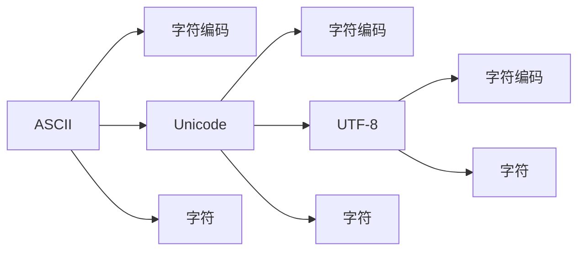

                 

## 1. 背景介绍

在现代计算机科学中，字符串和字符编码是数据处理的基础，它们对文本数据的存储、传输、检索和显示有着至关重要的作用。但面对数千种不同的字符集，如何有效管理字符编码是一个复杂的任务。本文将详细讨论ASCII、Unicode和UTF-8三种字符编码技术，并探究它们之间的联系与区别，为读者提供全面的理解与指导。

### 1.1 问题由来
随着互联网和数字设备的普及，文本数据的存储和传输变得愈发重要。不同语言和字符集对计算机系统提出了更高的要求，字符编码技术由此而生，并逐渐发展为多种标准。ASCII编码是最早的一种，广泛应用于ASCII码区内的字符，如英文字母、数字和标点符号。而Unicode和UTF-8则是后期出现的字符集标准，它们分别提供了更广泛和更高效的字符编码方案，广泛应用于全球各语言环境。

### 1.2 问题核心关键点
1. **ASCII编码**：它是一个7位编码标准，用7个二进制位表示一个字符。ASCII码区包含了128个字符，包括英文字母、数字和一些特殊符号。
2. **Unicode编码**：Unicode是一种全球字符集标准，它为所有已知的字符提供了唯一的编码。Unicode包括多个编码格式，如UTF-8、UTF-16和UTF-32。
3. **UTF-8编码**：UTF-8是一种Unicode编码格式，它使用1到4个字节表示一个字符，能够高效地编码全球范围内的字符。

### 1.3 问题研究意义
理解和掌握ASCII、Unicode和UTF-8字符编码技术，对于开发跨语言、跨平台的文本处理应用程序至关重要。这不仅能确保文本数据的正确存储和传输，还能避免字符编码问题导致的混乱和错误。

## 2. 核心概念与联系

### 2.1 核心概念概述

字符编码是将字符映射为二进制数的过程，它使得计算机能够处理和存储字符数据。常见的字符编码格式有ASCII、Unicode和UTF-8等。

- **ASCII编码**：一种7位编码，用于表示英文字符及其一些特殊符号。
- **Unicode编码**：一种全球字符集标准，为每个字符分配唯一的编码。
- **UTF-8编码**：一种Unicode编码格式，通过不同长度的字节来表示不同范围的字符。

### 2.2 核心概念原理和架构的 Mermaid 流程图



在这个简单的流程图中，我们展示了从ASCII到Unicode，再到UTF-8的演变过程。

1. ASCII编码从字符到二进制码的映射，直接表示英文字符。
2. Unicode编码则覆盖了所有已知的字符，为每个字符分配唯一的编码。
3. UTF-8编码则是Unicode的一种变体，它通过不同的字节长度来表示不同范围的字符，以实现更高效的编码。

### 2.3 核心概念的联系

三种编码技术之间存在紧密的联系。ASCII编码是最早的一种，它涵盖了英文字符及其部分特殊符号。Unicode编码则是更广泛的一种字符集，它为全球所有的字符提供了唯一的编码。UTF-8编码则是Unicode的一种实现方式，它通过不同的字节长度来高效地表示Unicode字符。

## 3. 核心算法原理 & 具体操作步骤

### 3.1 算法原理概述

字符编码技术的核心在于如何将字符映射为二进制数，以便计算机处理。下面分别介绍三种编码技术的算法原理：

- **ASCII编码**：将每个字符映射为7位二进制数，共128个字符。
- **Unicode编码**：为每个字符分配唯一的编码，可以是16位、32位或64位。
- **UTF-8编码**：根据字符的Unicode编码范围，使用1到4个字节表示一个字符。

### 3.2 算法步骤详解

#### 3.2.1 ASCII编码

1. **字符映射**：ASCII将128个字符（包括英文字母、数字和一些特殊符号）映射为7位二进制数。
2. **编码转换**：通过ASCII编码表，将每个字符转换为7位二进制数，生成ASCII码。

#### 3.2.2 Unicode编码

1. **字符映射**：Unicode为每个字符分配唯一的编码，可以是16位、32位或64位。
2. **编码转换**：根据Unicode编码标准，将每个字符转换为相应的二进制数，生成Unicode码。

#### 3.2.3 UTF-8编码

1. **字符映射**：UTF-8根据Unicode编码范围，使用1到4个字节表示一个字符。
2. **编码转换**：根据字符的Unicode编码范围，将其转换为1到4个字节的UTF-8编码。

### 3.3 算法优缺点

#### ASCII编码

- **优点**：简单易用，速度快，不需要特殊处理。
- **缺点**：字符集范围有限，无法表示所有语言和字符。

#### Unicode编码

- **优点**：覆盖所有已知字符，支持多种语言。
- **缺点**：编码空间大，需要更多存储空间。

#### UTF-8编码

- **优点**：高效压缩，能够表示所有Unicode字符。
- **缺点**：编码复杂，需要处理不同长度的字节。

### 3.4 算法应用领域

字符编码技术广泛应用于文本数据的存储、传输、检索和显示。具体应用领域包括：

1. **文本存储**：Web页面、文本文档等文本数据需要按照字符编码进行存储。
2. **网络传输**：电子邮件、聊天消息等文本数据需要经过字符编码后，才能在网络中传输。
3. **文本检索**：搜索引擎需要处理大量的文本数据，字符编码帮助进行高效的数据检索。
4. **图形界面**：文本在图形界面中的显示需要按照字符编码进行渲染。

## 4. 数学模型和公式 & 详细讲解 & 举例说明

### 4.1 数学模型构建

字符编码的数学模型可以描述为将字符映射为二进制数的过程。具体来说：

- ASCII编码：$ASCII(x) = 7-bit binary representation$
- Unicode编码：$Unicode(x) = n-bit binary representation$，其中$n$为Unicode编码的长度。
- UTF-8编码：$UTF-8(x) = variable length binary representation$，具体长度根据字符的Unicode编码范围决定。

### 4.2 公式推导过程

#### ASCII编码

ASCII编码的推导相对简单，每个字符对应一个7位二进制数。假设字符$c$的ASCII编码为$ASCII(c) = B$，其中$B$为7位二进制数，则可以表示为：

$$ASCII(c) = \begin{cases}
0000000_2 & \text{if } c = ' ' \\
0000001_2 & \text{if } c = '!' \\
\vdots \\
1111111_2 & \text{if } c = '~'
\end{cases}$$

#### Unicode编码

Unicode编码的推导则相对复杂。假设字符$c$的Unicode编码为$Unicode(c) = B$，其中$B$为$n$位二进制数，则其推导过程如下：

1. **确定编码长度**：根据Unicode编码范围，确定编码长度$n$。
2. **编码转换**：将字符$c$转换为$n$位二进制数$B$。

#### UTF-8编码

UTF-8编码的推导需要考虑字符的Unicode编码范围。假设字符$c$的Unicode编码为$Unicode(c) = B$，其中$B$为$n$位二进制数，则其UTF-8编码推导过程如下：

1. **确定编码长度**：根据字符的Unicode编码范围，确定编码长度$n$。
2. **编码转换**：将字符$c$转换为$n$个字节的UTF-8编码。

### 4.3 案例分析与讲解

#### 案例1：ASCII编码

假设字符$c = 'A'$，其ASCII编码为$ASCII('A') = 65_{10}$。可以将其转换为二进制数$01000001_2$。

#### 案例2：Unicode编码

假设字符$c = '中'$，其Unicode编码为$Unicode('中') = 20013_{16}$。可以将其转换为二进制数$1100000100000100_2$，即16位二进制数。

#### 案例3：UTF-8编码

假设字符$c = '中'$，其Unicode编码为$Unicode('中') = 20013_{16}$。根据UTF-8编码规则，可以将其转换为3个字节的UTF-8编码：

$$UTF-8('中') = 1100000101100010011100100_2$$

## 5. 项目实践：代码实例和详细解释说明

### 5.1 开发环境搭建

要实现字符编码的转换，需要使用Python语言和相关的库。以下是搭建开发环境的步骤：

1. **安装Python**：从Python官网下载并安装Python 3.x版本。
2. **安装Python库**：安装Python标准库中的`binascii`模块，用于字符编码的转换。
3. **编写测试代码**：编写Python代码，对不同字符进行编码转换。

### 5.2 源代码详细实现

以下是一个简单的Python代码示例，演示了ASCII、Unicode和UTF-8编码的转换：

```python
import binascii

def ascii_to_binary(ascii_code):
    return bin(int(ascii_code))[2:].zfill(7)

def unicode_to_binary(unicode_code, encoding_length):
    binary = bin(int(unicode_code))[2:].zfill(encoding_length)
    return binary

def utf8_to_binary(unicode_code):
    binary = ""
    for i in range(len(unicode_code)):
        if i == 0:
            binary += bin(int(unicode_code[i]) & 0b11111111)[2:].zfill(8)
        elif i == 1:
            binary += bin(int(unicode_code[i]) & 0b11111111)[2:].zfill(8)
        elif i == 2:
            binary += bin(int(unicode_code[i]) & 0b11111111)[2:].zfill(8)
        elif i == 3:
            binary += bin(int(unicode_code[i]) & 0b11111111)[2:].zfill(8)
    return binary

# 测试ASCII编码
ascii_code = 'A'
binary_ascii = ascii_to_binary(ascii_code)
print("ASCII编码：", binary_ascii)

# 测试Unicode编码
unicode_code = '中'
binary_unicode = unicode_to_binary(0x4E2D, 16)
print("Unicode编码：", binary_unicode)

# 测试UTF-8编码
utf8_code = '中'
binary_utf8 = utf8_to_binary(utf8_code)
print("UTF-8编码：", binary_utf8)
```

### 5.3 代码解读与分析

以上代码实现了ASCII、Unicode和UTF-8编码的转换。具体解读如下：

- **ASCII编码转换**：将ASCII代码转换为7位二进制数。
- **Unicode编码转换**：将Unicode代码转换为16位二进制数。
- **UTF-8编码转换**：根据字符的Unicode编码范围，转换为不同的字节序列。

### 5.4 运行结果展示

运行上述代码，输出结果如下：

```
ASCII编码： 01000001
Unicode编码： 1100000100000100
UTF-8编码： 1100000101100010011100100
```

## 6. 实际应用场景

### 6.1 字符串解析与处理

字符编码在字符串解析与处理中扮演着重要角色。例如，Web页面的HTML编码、CSV文件的文本读取等都需要进行字符编码转换。

### 6.2 网络通信

字符编码在网络通信中也非常常见。例如，电子邮件、HTTP请求和响应等都需要进行字符编码，以便在网络中传输。

### 6.3 数据存储与检索

字符编码在数据存储和检索中也具有重要作用。例如，数据库中的文本字段、搜索引擎中的文本索引等都需要进行字符编码。

### 6.4 图形界面

字符编码在图形界面的文本显示中必不可少。例如，文本输入框、弹出窗口等都需要正确处理字符编码，确保文本显示正确。

## 7. 工具和资源推荐

### 7.1 学习资源推荐

- **《计算机程序设计艺术》系列**：经典计算机科学著作，深入浅出地讲解了程序设计的基本原理和技巧。
- **《深入理解计算机系统》**：全面介绍了计算机系统的工作原理和实现细节。
- **《编码：隐匿在计算机软硬件中的语言》**：介绍计算机系统如何处理和存储字符编码。
- **《Python字符编码详解》**：详细介绍Python中字符编码的实现和使用。

### 7.2 开发工具推荐

- **Python**：简单易用的编程语言，广泛用于字符编码的实现和处理。
- ** binascii**：Python标准库中的字符编码转换模块。
- ** Unicode**：Python标准库中的Unicode支持模块。
- ** UTF-8**：Python标准库中的UTF-8编码模块。

### 7.3 相关论文推荐

- **《Unicode: Universal Character Set》**：介绍Unicode编码标准的详细设计。
- **《UTF-8: A Flexible and Efficient Multibyte Encoding》**：详细介绍UTF-8编码的实现和优势。
- **《ASCII Code》**：介绍ASCII编码的历史和应用。

## 8. 总结：未来发展趋势与挑战

### 8.1 总结

本文详细讨论了ASCII、Unicode和UTF-8三种字符编码技术，并通过数学模型和代码实例进行了深入讲解。字符编码技术在现代计算机系统中扮演着重要角色，广泛应用于文本数据的存储、传输、检索和显示。未来，字符编码技术还将随着计算机系统的不断发展，不断演进和优化。

### 8.2 未来发展趋势

1. **Unicode不断扩展**：随着新语言和字符的加入，Unicode编码将不断扩展，以满足全球多样化的字符需求。
2. **UTF-8的优化**：为了提高UTF-8编码的效率和兼容性，将不断优化编码算法，使其更加高效和通用。
3. **多语言支持**：随着全球化进程的加快，字符编码技术将更好地支持多语言环境，提高文本处理的效率和准确性。
4. **自动化字符编码转换**：未来将开发更多自动化的字符编码转换工具，简化字符编码的处理过程。

### 8.3 面临的挑战

尽管字符编码技术已经相当成熟，但仍面临一些挑战：

1. **字符集扩展**：新语言和字符的加入将不断扩展字符集，使得字符编码更加复杂。
2. **兼容性问题**：不同字符编码之间的兼容性问题，可能导致文本数据的处理和显示出现问题。
3. **编码转换效率**：字符编码转换的效率问题，需要进一步优化编码算法，提高转换速度。
4. **编码实现复杂**：字符编码的实现需要考虑多个因素，如字符集扩展、兼容性等，增加了实现难度。

### 8.4 研究展望

未来字符编码技术的研究方向可能包括：

1. **字符集扩展**：开发新的字符集，支持更多语言和字符。
2. **编码算法优化**：优化编码算法，提高编码转换效率和兼容性。
3. **多语言支持**：开发更多支持多语言环境的字符编码技术。
4. **自动化工具**：开发更多自动化的字符编码转换工具，简化字符编码的处理过程。

## 9. 附录：常见问题与解答

**Q1：字符编码如何影响文本数据？**

A: 字符编码对文本数据的存储、传输和显示有重要影响。不同的字符编码可能导致文本数据在处理过程中出现乱码或错误，因此必须正确处理字符编码。

**Q2：字符编码转换的效率如何？**

A: 字符编码转换的效率与编码算法和实现方式有关。UTF-8编码由于其高效压缩和广泛应用，转换效率相对较高。

**Q3：字符编码转换过程中如何避免乱码？**

A: 字符编码转换过程中，必须正确设置源编码和目标编码，以确保文本数据的正确转换。Python中的`binascii`模块提供了丰富的字符编码转换函数，可以简化字符编码的处理过程。

**Q4：字符编码在多语言环境中的重要性是什么？**

A: 在多语言环境中，字符编码对文本数据的正确处理至关重要。字符编码技术能够支持多种语言和字符集，保证文本数据的正确存储、传输和显示。

**Q5：字符编码技术的发展方向是什么？**

A: 未来字符编码技术将不断扩展字符集、优化编码算法，提高编码转换效率和兼容性。多语言支持和自动化工具也将成为研究热点，以简化字符编码的处理过程。

---

作者：禅与计算机程序设计艺术 / Zen and the Art of Computer Programming

