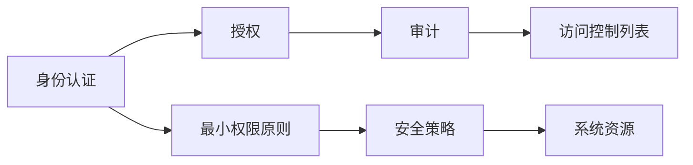

                 

# 安全和访问控制：保护应用程序

## 1. 背景介绍

随着现代信息技术的发展，应用程序在人们的生活和工作中的应用越来越广泛。应用程序的安全性和访问控制成为了保护用户数据和隐私，维护系统稳定的关键因素。然而，由于应用程序的复杂性和多样性，安全和访问控制面临的威胁也愈发严峻。因此，本文将系统性地介绍安全和访问控制的核心概念与技术，帮助读者深入理解这一领域，并掌握其实际应用。

## 2. 核心概念与联系

### 2.1 核心概念概述

安全和访问控制（Security and Access Control）是计算机安全领域的重要组成部分，主要目的是保障系统资源的安全性，防止未授权的访问和数据泄露。其核心概念包括：

- **身份认证**：验证用户的身份是否真实合法。
- **授权**：根据用户的身份和权限，决定其能否访问特定资源。
- **审计**：记录用户的行为，追踪并分析潜在的威胁。
- **访问控制列表(ACL)**：指定哪些用户或组可以访问某个对象。
- **最小权限原则**：用户只能访问完成其任务所需的最小权限。

这些核心概念之间存在紧密联系，共同构成了一个完整的安全和访问控制系统。通过身份认证和授权，确保用户访问的合法性和安全性；审计和访问控制列表则提供了有效的监控和追溯手段，保障系统的完整性和保密性。

### 2.2 核心概念原理和架构的 Mermaid 流程图



### 2.3 核心概念之间的联系

安全和访问控制的各个概念之间互相支撑，形成一个完整的安全体系。身份认证和授权是前置条件，决定用户是否能访问资源；审计和访问控制列表则用于监督和记录用户行为，最小权限原则则确保系统资源的安全性。安全策略则是对各个环节的统一管理和协调，确保整体安全目标的实现。

## 3. 核心算法原理 & 具体操作步骤

### 3.1 算法原理概述

安全和访问控制的算法原理主要基于访问控制模型，其中最著名的当属基于角色的访问控制模型(RBAC)。RBAC模型将用户、角色和权限三者之间的关系进行抽象，通过定义角色和权限的映射关系，实现用户权限的管理。其基本思想是：用户被分配到一个或多个角色，角色则拥有对资源的访问权限，从而控制用户对资源的访问。

### 3.2 算法步骤详解

#### 3.2.1 角色定义

角色是RBAC模型的核心，用于描述系统中具有特定权限的抽象实体。角色通常以部门、职位或功能模块为单位进行定义，如管理员、普通员工、审计员等。

#### 3.2.2 权限定义

权限是角色能够访问的资源和操作。如读取、写入、删除、修改等。权限定义需要具体、详细，以确保角色和权限的映射关系清晰明确。

#### 3.2.3 用户角色映射

将用户分配到不同的角色中，确保用户只能访问其角色所拥有的权限资源。

#### 3.2.4 审计和监控

记录用户的行为，并追踪潜在的威胁。审计信息可以用于安全事件分析、合规性检查等。

#### 3.2.5 最小权限原则

确保用户只能访问完成其任务所需的最小权限，避免权限滥用和安全隐患。

### 3.3 算法优缺点

#### 3.3.1 优点

- **可扩展性**：RBAC模型具有良好的可扩展性，易于适应系统的复杂变化。
- **灵活性**：角色和权限的映射关系可以根据需要动态调整，适应不同的业务场景。
- **简化管理**：通过角色和权限的映射，简化了权限管理的复杂性。

#### 3.3.2 缺点

- **角色冲突**：角色和权限的映射关系较为复杂，容易出现冲突和重叠。
- **权限粒度限制**：细粒度的权限管理会增加管理和配置的复杂度。
- **安全策略复杂**：安全策略的制定和管理较为复杂，需要考虑多方面的因素。

### 3.4 算法应用领域

安全和访问控制在各个领域都有广泛的应用，包括：

- **企业级应用**：如HR系统、ERP系统、OA系统等。
- **政府机构**：如公共安全系统、税务系统、医疗系统等。
- **云服务**：如AWS、Azure等云平台的安全控制。
- **物联网设备**：如智能家居、智能车辆等。

安全和访问控制在大规模应用中显得尤为重要，需要根据不同的应用场景进行灵活配置和调整。

## 4. 数学模型和公式 & 详细讲解 & 举例说明

### 4.1 数学模型构建

安全和访问控制的核心数学模型通常基于图结构，用户、角色、权限分别对应图中的节点，角色和权限之间的关系对应图的边。具体来说，可以定义一个有向图 $G=(U,R)$，其中：

- $U$：用户集合。
- $R$：角色集合。

权限 $P$ 可以通过角色集合 $R$ 来描述，即 $P \subseteq R$。角色 $r$ 和权限 $p$ 之间的关系通过访问控制列表(ACL)来表示，即 $ACL(r,p)$。最小权限原则可以表示为：

$$
\min_{p \in P(r)} \{p\} \leq p
$$

其中 $P(r)$ 表示角色 $r$ 的权限集合，$\min_{p \in P(r)} \{p\}$ 表示角色 $r$ 的最小权限。

### 4.2 公式推导过程

根据最小权限原则，可以推导出：

$$
\min_{p \in P(r)} \{p\} \leq p \Leftrightarrow \min_{p \in P(r)} \{p\} = p \Leftrightarrow p \in P(r)
$$

这意味着，如果角色 $r$ 拥有权限 $p$，则最小权限原则成立。否则，需要进一步调整角色和权限的映射关系，以确保最小权限原则的实现。

### 4.3 案例分析与讲解

假设在一个企业系统中，有以下角色和权限定义：

- 管理员角色 $R_{admin}$，拥有所有权限 $P_{admin}$。
- 普通员工角色 $R_{employee}$，拥有读取权限 $P_{read}$。
- 审计员角色 $R_{auditor}$，拥有写入权限 $P_{write}$。

根据最小权限原则，管理员 $R_{admin}$ 只能访问其职责范围内所需的权限，而普通员工 $R_{employee}$ 和审计员 $R_{auditor}$ 也只能访问其职责范围内所需的权限。即：

$$
P_{admin} \cap P_{employee} = \emptyset
$$

$$
P_{employee} \cap P_{auditor} = \emptyset
$$

通过以上分析和推导，可以看出，最小权限原则是安全和访问控制的核心，确保了系统的安全性和完整性。

## 5. 项目实践：代码实例和详细解释说明

### 5.1 开发环境搭建

为了进行安全和访问控制的实践，我们需要搭建一个开发环境。具体步骤如下：

1. 安装Python环境，如Anaconda或Miniconda。
2. 安装Python安全库，如Flask、Flask-Security等。
3. 搭建开发服务器，如使用Flask框架搭建API接口。
4. 编写安全控制代码，实现身份认证、授权、审计等功能。

### 5.2 源代码详细实现

以下是一个基于Flask-Security库的安全控制示例代码：

```python
from flask import Flask
from flask_security import Security, SQLAlchemyUserDatastore, UserMixin, RoleMixin, login_required

app = Flask(__name__)

# 配置数据库连接
app.config['SQLALCHEMY_DATABASE_URI'] = 'sqlite:////tmp/test.db'
app.config['SECRET_KEY'] = 'some-secret-key'

# 配置角色和权限
roles_users = db.Table('roles_users',
                      db.Column('user_id', db.Integer(), db.ForeignKey('user.id')),
                      db.Column('role_id', db.Integer(), db.ForeignKey('role.id'))
                      )

class Role(db.Model, RoleMixin):
    id = db.Column(db.Integer(), primary_key=True)
    name = db.Column(db.String(80), unique=True)

class User(db.Model, UserMixin):
    id = db.Column(db.Integer(), primary_key=True)
    email = db.Column(db.String(255), unique=True)
    password = db.Column(db.String(255))
    active = db.Column(db.Boolean())
    roles = db.relationship('Role', secondary=roles_users, backref=db.backref('users', lazy='dynamic'))

# 创建用户和角色
user1 = User(email='user1@example.com', password='password1')
user2 = User(email='user2@example.com', password='password2')
admin = Role(name='admin')
employee = Role(name='employee')
auditor = Role(name='auditor')

db.session.add_all([user1, user2, admin, employee, auditor])
db.session.commit()

# 配置Flask-Security
user_datastore = SQLAlchemyUserDatastore(db, User, Role)
security = Security(app, user_datastore)

# 定义API接口
@app.route('/')
@login_required
def index():
    return 'Hello, %s!' % current_user.email

if __name__ == '__main__':
    app.run(debug=True)
```

### 5.3 代码解读与分析

以上代码实现了一个基于Flask-Security库的安全控制示例，包括以下关键组件：

- `app.config`：配置数据库连接和秘钥。
- `Role`和`User`类：定义角色和用户的数据库模型。
- `roles_users`表：存储角色和用户的关系。
- `user_datastore`：配置Flask-Security的用户数据存储。
- `security`：配置Flask-Security的安全控制。
- `index`函数：定义登录后的页面。

在实际应用中，需要根据具体的业务场景，进一步配置权限、审计、日志等功能。

### 5.4 运行结果展示

运行以上代码，访问`http://127.0.0.1:5000`，可以看到登录后的欢迎页面。输入正确的用户名和密码，即可访问API接口，确保了系统的安全性和访问控制。

## 6. 实际应用场景

### 6.1 企业级应用

在企业级应用中，安全和访问控制至关重要。例如，HR系统需要保护员工的个人信息和薪酬信息，OA系统需要保护文档和邮件等敏感信息。通过安全和访问控制，可以确保这些信息的安全性和机密性，防止未授权的访问和数据泄露。

### 6.2 政府机构

政府机构的信息系统通常涉及大量的敏感数据，如个人隐私、税务记录等。通过安全和访问控制，可以保障这些数据的安全性，防止数据泄露和滥用。

### 6.3 云服务

云服务提供商需要保护用户的数据和应用，防止未授权的访问和数据泄露。通过安全和访问控制，可以保障云平台的安全性，增强用户的信任。

### 6.4 物联网设备

物联网设备通常部署在公共环境中，容易受到攻击和破坏。通过安全和访问控制，可以防止未授权的访问和攻击，保护设备和数据的安全性。

## 7. 工具和资源推荐

### 7.1 学习资源推荐

1. **《网络安全基础》**：系统地介绍了网络和系统安全的基础知识和实践技能。
2. **《Flask-Security官方文档**》：详细介绍了Flask-Security库的使用方法和最佳实践。
3. **《访问控制模型与安全策略》**：系统地介绍了访问控制模型和安全策略的理论和实践。
4. **《Python网络安全编程》**：介绍了Python在网络安全领域的应用，包括身份认证、授权、审计等。
5. **《网络安全案例分析》**：通过具体案例，分析了网络安全的威胁和防护措施。

### 7.2 开发工具推荐

1. **Flask-Security**：Python网络安全的库，提供了基于RBAC模型的身份认证和授权功能。
2. **Flask**：Python的轻量级Web框架，易于使用和扩展。
3. **SQLAlchemy**：Python的ORM框架，方便数据库操作。
4. **Scrapy**：Python的爬虫框架，用于数据收集和分析。
5. **Gunicorn**：Python的Web服务器，支持Flask应用。

### 7.3 相关论文推荐

1. **《基于角色的访问控制模型研究》**：介绍了RBAC模型的理论基础和应用实践。
2. **《网络安全中的身份认证和授权技术》**：介绍了身份认证和授权技术的现状和发展。
3. **《基于机器学习的访问控制技术》**：介绍了机器学习在访问控制中的应用。
4. **《物联网设备的安全和访问控制》**：介绍了物联网设备的安全和访问控制技术。

## 8. 总结：未来发展趋势与挑战

### 8.1 未来发展趋势

未来安全和访问控制将呈现以下几个发展趋势：

1. **自动化和智能化**：通过机器学习和人工智能技术，自动进行身份认证和授权，提高安全性和效率。
2. **多因素认证**：结合多种认证方式，提高身份认证的准确性和安全性。
3. **细粒度权限管理**：实现更细粒度的权限管理，提高系统的灵活性和安全性。
4. **区块链技术**：通过区块链技术实现去中心化的身份认证和授权，增强系统的透明性和可信度。
5. **分布式身份认证**：实现分布式身份认证，支持跨系统和跨平台的用户访问。

### 8.2 面临的挑战

安全和访问控制在发展过程中，仍然面临诸多挑战：

1. **攻击手段多样化**：黑客攻击手段不断变化，需要持续更新和升级安全措施。
2. **隐私保护困难**：在保护数据隐私的同时，需要保证系统的可用性和高效性。
3. **管理复杂度高**：权限管理复杂，需要专业的管理和维护人员。
4. **设备多样性**：不同的设备和平台需要不同的安全措施，增加了管理的复杂度。
5. **技术更新快**：安全和访问控制技术更新快，需要持续学习和跟进最新的技术。

### 8.3 研究展望

未来的研究和应用将主要集中在以下几个方面：

1. **自动化和智能化**：实现自动化的身份认证和授权，提高系统的安全性和效率。
2. **多因素认证**：结合多种认证方式，增强身份认证的准确性和安全性。
3. **细粒度权限管理**：实现更细粒度的权限管理，提高系统的灵活性和安全性。
4. **区块链技术**：通过区块链技术实现去中心化的身份认证和授权，增强系统的透明性和可信度。
5. **分布式身份认证**：实现分布式身份认证，支持跨系统和跨平台的用户访问。

## 9. 附录：常见问题与解答

### Q1: 如何防止暴力破解攻击？

A: 暴力破解攻击是一种常见的攻击手段，可以通过以下方法进行防范：

- 实施密码策略，如密码长度、复杂度等。
- 使用双因素认证。
- 定期更换密码。
- 限制登录尝试次数。
- 引入验证码机制。

### Q2: 什么是零信任架构？

A: 零信任架构是一种安全模型，认为“永远不信任，始终验证”。无论用户处于内部还是外部，都需要通过严格的身份认证和授权才能访问资源。零信任架构可以有效防止未授权的访问和数据泄露。

### Q3: 如何实施最小权限原则？

A: 实施最小权限原则的关键在于定义明确的权限范围和角色，通过严格的访问控制和审计机制，确保用户只能访问其职责范围内所需的权限。具体实施步骤如下：

- 定义角色和权限。
- 将用户分配到合适的角色。
- 实施访问控制，确保用户只能访问其角色所拥有的权限。
- 进行审计和监控，及时发现和应对安全威胁。

### Q4: 如何处理跨域访问问题？

A: 跨域访问问题通常出现在Web应用中，可以通过以下方法解决：

- 使用CORS（跨域资源共享）技术。
- 使用代理服务器。
- 限制跨域请求的源地址。
- 使用JSONP技术。
- 使用反向代理。

## 结论

安全和访问控制在现代信息技术中具有重要的地位和作用，保障了系统的安全性和用户数据的隐私。通过身份认证、授权、审计和最小权限原则等核心概念，构建了完整的安全和访问控制体系。未来的研究和应用将不断引入新的技术手段，如自动化、智能化、多因素认证等，进一步提升系统和用户的安全性和可靠性。

作者：禅与计算机程序设计艺术 / Zen and the Art of Computer Programming

