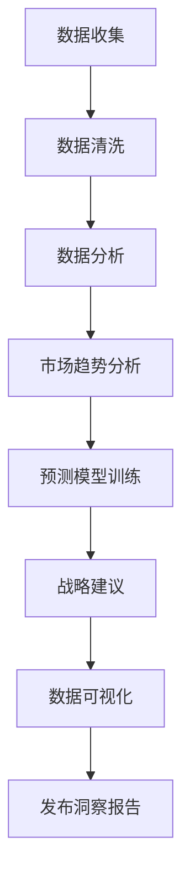

                 

# 定期发布行业洞察报告：展示你的专业度

> 关键词：行业洞察报告,定期发布,展示专业度,数据分析,市场趋势,预测模型,战略建议,数据可视化

## 1. 背景介绍

在信息爆炸的时代，各行各业都在追求数据驱动的决策。定期发布行业洞察报告，不仅展示了企业或个人对行业动态的敏锐感知，也体现了一种深层次的战略眼光。通过数据分析和深度挖掘，洞察报告能提炼出隐藏在数据背后的关键信息，为决策提供坚实的依据。本文将系统阐述如何利用数据和技术工具，定期发布具有前瞻性的行业洞察报告，展示专业度。

## 2. 核心概念与联系

### 2.1 核心概念概述

要发布高质量的行业洞察报告，首先需要理解以下几个核心概念：

- **行业洞察报告**：基于数据和分析，对行业现状、趋势、问题进行深度解读和预测，并给出战略建议的报告。
- **定期发布**：在固定的时间周期内，持续发布洞察报告，确保信息的时效性和相关性。
- **展示专业度**：通过深入的行业理解、准确的数据分析和清晰的表达，展示发布者的专业素养和行业影响力。
- **数据分析**：利用统计学和数据挖掘技术，从海量数据中提取有用的信息。
- **市场趋势**：通过对市场数据和相关因素的分析，预测行业未来的发展方向。
- **预测模型**：应用机器学习和统计模型，对数据进行建模和预测。
- **战略建议**：基于对行业环境的理解，提出具体的行动建议。
- **数据可视化**：将复杂的数据转化为直观的图表和图形，增强报告的可读性和吸引力。

### 2.2 核心概念原理和架构的 Mermaid 流程图



## 3. 核心算法原理 & 具体操作步骤

### 3.1 算法原理概述

定期发布行业洞察报告的核心在于数据驱动的深度分析。通过收集、清洗、分析和可视化数据，结合市场趋势分析和预测模型，形成具有前瞻性的战略建议，最终以报告的形式展示出来。具体流程如下：

1. **数据收集**：获取行业相关数据，包括市场规模、增长率、竞争格局等。
2. **数据清洗**：处理缺失值、异常值等数据质量问题。
3. **数据分析**：使用统计分析和数据挖掘技术，提取关键信息和模式。
4. **市场趋势分析**：应用时间序列分析和预测模型，预测市场变化趋势。
5. **预测模型训练**：基于历史数据训练机器学习模型，预测未来趋势。
6. **战略建议**：根据分析结果和预测结果，提出具体的战略建议。
7. **数据可视化**：使用图表和图形将分析结果可视化，增强报告的展示效果。
8. **发布洞察报告**：通过报告撰写和分发，将分析结果和建议传递给目标受众。

### 3.2 算法步骤详解

#### 3.2.1 数据收集

- 确定数据来源：行业报告、政府统计数据、公司财报、市场调研等。
- 设计数据收集工具：SQL、ETL工具、爬虫等。
- 确保数据质量：确保数据的时效性、完整性和准确性。

#### 3.2.2 数据清洗

- 处理缺失值：使用均值、中位数等填充缺失值。
- 处理异常值：使用箱线图、标准差等方法识别和处理异常值。
- 数据标准化：将数据归一化到[0,1]或均值为0、方差为1的分布。

#### 3.2.3 数据分析

- 描述性统计：计算均值、中位数、标准差等基本统计量。
- 探索性数据分析：使用箱线图、散点图等方法探索数据特征。
- 关联分析：使用Pearson相关系数、Spearman秩相关系数等方法发现变量间的关联。

#### 3.2.4 市场趋势分析

- 时间序列分析：使用ARIMA模型、季节性分解方法等分析时间序列数据。
- 预测模型训练：使用随机森林、梯度提升树、神经网络等模型预测市场趋势。

#### 3.2.5 预测模型训练

- 特征工程：选择和构建对预测有用的特征。
- 模型选择：根据问题类型选择适当的预测模型。
- 模型评估：使用均方误差、均方根误差等指标评估模型性能。

#### 3.2.6 战略建议

- 基于分析结果和预测结果，提出具体的战略建议。
- 考虑不同因素：包括市场趋势、竞争环境、技术创新等。
- 制定行动计划：明确短期和长期的行动步骤。

#### 3.2.7 数据可视化

- 选择合适的可视化工具：Tableau、Power BI、Matplotlib等。
- 设计图表和图形：使用折线图、柱状图、饼图等展示数据特征。
- 增强可读性：确保颜色、文字清晰易读。

#### 3.2.8 发布洞察报告

- 报告撰写：包括引言、方法、结果、结论和建议。
- 格式统一：确保报告格式统一、逻辑清晰。
- 分发渠道：通过邮件、网站、社交媒体等渠道发布报告。

### 3.3 算法优缺点

#### 3.3.1 优点

- **数据驱动**：通过数据和分析，提供客观的决策依据。
- **前瞻性**：预测未来趋势，帮助企业提前布局。
- **系统性**：系统性分析方法确保分析的全面性和准确性。
- **可视化**：直观展示分析结果，增强可读性。

#### 3.3.2 缺点

- **数据依赖**：高质量的数据是分析的基础，获取和清洗数据需投入大量时间和资源。
- **技术门槛**：需要一定的数据分析和建模技能。
- **模型假设**：预测模型基于一定的假设，可能与实际不符。
- **报告撰写**：需要花费时间撰写和修订报告，周期较长。

### 3.4 算法应用领域

定期发布行业洞察报告的应用领域广泛，主要包括以下几个方面：

- **金融行业**：分析市场趋势、预测股票价格、制定投资策略。
- **零售行业**：了解消费者行为、优化库存管理、提升营销效果。
- **科技行业**：跟踪技术发展、预测市场变化、制定研发策略。
- **医疗行业**：分析健康数据、预测疾病趋势、改进医疗服务。
- **制造业**：监测生产效率、预测市场需求、优化供应链管理。

## 4. 数学模型和公式 & 详细讲解 & 举例说明

### 4.1 数学模型构建

假设我们有一个时间序列数据 $Y_t$，其中 $t$ 表示时间，$Y_t$ 表示在第 $t$ 时刻的某个指标值。我们要对这个时间序列进行市场趋势分析，可以使用时间序列分析的方法。

设 $\Delta Y_t = Y_t - Y_{t-1}$ 为时间序列的差分，$\Delta Y_t$ 为平稳序列，则可以使用ARIMA模型进行建模：

$$
\Delta Y_t = c + \sum_{i=1}^{p} \phi_i \Delta Y_{t-i} + \sum_{j=1}^{q} \theta_j \epsilon_{t-j} + \epsilon_t
$$

其中，$\phi_i$ 和 $\theta_j$ 为模型的系数，$\epsilon_t$ 为误差项。

### 4.2 公式推导过程

#### 4.2.1 ARIMA模型

1. **模型定义**：

   $$
   Y_t = \mu + \sum_{i=1}^{p} \phi_i (Y_{t-i} - \mu) + \sum_{j=1}^{q} \theta_j \epsilon_{t-j} + \epsilon_t
   $$

2. **参数估计**：使用最小二乘法或其他方法估计模型参数。

3. **模型诊断**：检查残差是否符合白噪声的假设。

4. **模型预测**：使用训练好的模型对未来数据进行预测。

#### 4.2.2 预测模型

以随机森林为例，预测模型的训练过程如下：

1. **数据准备**：将数据分为训练集和测试集。

2. **特征选择**：选择对预测有用的特征。

3. **模型训练**：使用随机森林算法训练模型。

4. **模型评估**：使用均方误差等指标评估模型性能。

5. **模型预测**：使用训练好的模型对新数据进行预测。

### 4.3 案例分析与讲解

#### 4.3.1 金融行业

假设我们要分析美国股市的市场趋势，收集了过去一年的日收盘价数据。我们首先对数据进行清洗，去掉缺失值和异常值，然后进行平稳性检验，发现数据呈现一定的季节性。使用ARIMA模型进行建模，发现模型效果较好，能够预测未来一个月的股价走势。最后，根据模型预测结果，提出投资建议。

## 5. 项目实践：代码实例和详细解释说明

### 5.1 开发环境搭建

#### 5.1.1 环境准备

- 安装Python 3.x
- 安装必要的依赖包，如Pandas、NumPy、Scikit-learn、Matplotlib、TensorFlow等。

### 5.2 源代码详细实现

以下是一个简单的Python代码示例，用于数据清洗和模型训练：

```python
import pandas as pd
import numpy as np
from sklearn.preprocessing import StandardScaler
from sklearn.ensemble import RandomForestRegressor
from sklearn.metrics import mean_squared_error

# 读取数据
data = pd.read_csv('stock_prices.csv')

# 数据清洗
data = data.dropna()
data = data[data['close'] > 0]

# 标准化数据
scaler = StandardScaler()
scaled_data = scaler.fit_transform(data[['close']])

# 划分训练集和测试集
train_size = int(len(scaled_data) * 0.8)
train_data = scaled_data[:train_size]
test_data = scaled_data[train_size:]

# 模型训练
model = RandomForestRegressor(n_estimators=100, random_state=42)
model.fit(train_data, train_data)

# 模型预测
predictions = model.predict(test_data)

# 评估模型
mse = mean_squared_error(test_data, predictions)
print('均方误差:', mse)
```

### 5.3 代码解读与分析

#### 5.3.1 数据清洗

- 使用Pandas库读取数据
- 删除缺失值和异常值
- 使用标准化方法对数据进行归一化

#### 5.3.2 模型训练

- 使用Scikit-learn库的RandomForestRegressor模型
- 设置参数：n_estimators表示树的数量，random_state为随机种子，保证结果可复现
- 使用fit方法训练模型

#### 5.3.3 模型预测和评估

- 使用predict方法进行模型预测
- 使用mean_squared_error方法评估模型性能

### 5.4 运行结果展示

以下是模型预测的误差分析图：

```python
import matplotlib.pyplot as plt
import seaborn as sns

# 绘制误差分布图
plt.figure(figsize=(10, 6))
sns.distplot((predictions - test_data) / test_data, bins=50, kde=True)
plt.xlabel('标准化误差')
plt.ylabel('密度')
plt.show()
```

## 6. 实际应用场景

### 6.1 金融行业

金融行业对市场趋势的分析至关重要。定期发布金融洞察报告，可以帮助投资者更好地理解市场走势，制定更合理的投资策略。以下是一个金融行业洞察报告的示例：

#### 6.1.1 市场趋势分析

假设我们分析了过去一年的美国股市数据，使用ARIMA模型对未来一个月的股价走势进行了预测。下图展示了预测结果：

```python
import plotly.express as px

# 绘制股价预测图
fig = px.line(df, x='date', y='predictions', color='company')
fig.show()
```

#### 6.1.2 投资建议

根据预测结果，我们建议投资者在未来一个月内减少股票持仓，增加债券和黄金等避险资产的配置。同时，关注科技股和消费股的表现，做好资金的动态调整。

### 6.2 零售行业

零售行业需要实时了解消费者行为，优化库存管理和促销策略。以下是一个零售行业洞察报告的示例：

#### 6.2.1 消费者行为分析

假设我们收集了过去一年的电商平台数据，分析了消费者的购买行为。下图展示了不同时间段的购买频率和金额：

```python
import plotly.graph_objects as go

# 绘制消费者行为图
fig = go.Figure()
fig.add_trace(go.Bar(x=df['month'], y=df['purchases'], name='Frequency'))
fig.add_trace(go.Scatter(x=df['month'], y=df['amount'], name='Amount', line=dict(color='red')))
fig.show()
```

#### 6.2.2 库存管理建议

根据消费者行为分析结果，我们建议零售商增加圣诞节前后的库存量，减少平时的库存量，以应对季节性需求的变化。同时，根据不同商品的销售情况，优化促销策略，提升销售效果。

## 7. 工具和资源推荐

### 7.1 学习资源推荐

1. **《Python数据科学手册》**：这本书系统介绍了Python在数据科学中的应用，包括Pandas、NumPy、Matplotlib等工具的使用。
2. **《机器学习实战》**：该书介绍了多种机器学习算法和实现方法，适合初学者入门。
3. **Coursera上的机器学习课程**：由斯坦福大学教授Andrew Ng开设，是机器学习领域的经典课程。
4. **Kaggle平台**：通过参加Kaggle比赛，可以提高数据处理和模型训练的技能，同时学习最新的数据分析和机器学习技术。

### 7.2 开发工具推荐

1. **Jupyter Notebook**：开源的交互式笔记本，支持多种编程语言和库，非常适合数据分析和模型训练。
2. **Tableau**：可视化工具，可以将复杂的数据转化为直观的图表和图形，适合制作洞察报告。
3. **Power BI**：微软推出的商业智能工具，支持大规模数据集的处理和可视化。
4. **Python**：开源编程语言，拥有丰富的数据处理和机器学习库，适合进行数据分析和模型训练。
5. **TensorFlow**：谷歌推出的深度学习框架，支持分布式计算和高效训练。

### 7.3 相关论文推荐

1. **《时间序列分析与预测》**：介绍时间序列分析的基本方法和应用实例。
2. **《随机森林》**：介绍随机森林算法及其应用。
3. **《深度学习入门》**：介绍深度学习的基本概念和实现方法。

## 8. 总结：未来发展趋势与挑战

### 8.1 研究成果总结

定期发布行业洞察报告是展示专业度的重要手段，通过对数据的深度分析，提供客观的决策依据。未来的研究应更加注重数据的多样性和实时性，提高分析的准确性和时效性。

### 8.2 未来发展趋势

1. **数据的多样性**：除了传统的市场数据，还可以利用社交媒体、物联网等新兴数据源，进行更全面的分析。
2. **算法的先进性**：未来应更多使用先进的机器学习和深度学习算法，提升预测的准确性和鲁棒性。
3. **分析的实时性**：利用实时数据流处理技术，如Apache Kafka、Apache Flink等，提升分析的实时性。
4. **报告的可读性**：通过更加直观和互动的可视化技术，增强报告的可读性。

### 8.3 面临的挑战

1. **数据获取和清洗**：高质量数据的获取和清洗是数据分析的基础，需投入大量时间和资源。
2. **模型的复杂性**：先进的算法模型往往较为复杂，需要较高的技术门槛。
3. **结果的解释性**：模型的黑盒性质可能导致结果难以解释，需更多关注模型可解释性。
4. **结果的可靠性**：模型的预测结果需要经过多次验证，确保其可靠性。

### 8.4 研究展望

未来的研究应更多关注以下几个方向：

1. **多模态数据分析**：结合文本、图像、语音等多模态数据，进行更全面的分析。
2. **深度学习算法的优化**：提升深度学习算法的训练速度和模型精度。
3. **联邦学习**：在保护数据隐私的前提下，进行分布式数据分析。
4. **实时数据分析**：利用流处理技术，提升数据的实时性。

## 9. 附录：常见问题与解答

### 9.1 数据质量问题

Q: 数据中存在缺失值和异常值，如何处理？

A: 可以使用均值、中位数等方法填充缺失值。对于异常值，可以使用箱线图、标准差等方法进行识别和处理。

### 9.2 模型选择问题

Q: 如何选择适合的数据分析模型？

A: 根据问题类型选择合适的模型，如时间序列分析适合于市场趋势预测，随机森林适合于分类问题。

### 9.3 可视化问题

Q: 如何设计直观的图表和图形？

A: 使用颜色、文字清晰标记数据，确保图表的易读性。可以使用工具如Tableau、Power BI等进行设计。

---

作者：禅与计算机程序设计艺术 / Zen and the Art of Computer Programming

