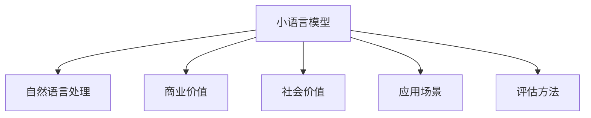

                 

# 小语言模型的应用价值评估:商业价值和社会价值

> 关键词：小语言模型,商业价值,社会价值,自然语言处理(NLP),应用场景,评估方法

## 1. 背景介绍

### 1.1 问题由来

近年来，随着人工智能技术的飞速发展，自然语言处理（NLP）领域迎来了重大突破。特别是在语言模型的训练上，从早期的单层神经网络到多层神经网络，再到深度学习模型，如循环神经网络（RNN）和卷积神经网络（CNN），再到目前的Transformer模型，模型结构和算法不断进步，性能不断提升。这些模型在各种NLP任务上取得了显著的成效，例如机器翻译、情感分析、问答系统等。然而，这些模型通常具有巨大的参数规模，训练成本和计算资源要求极高，且需要在大量标注数据上进行监督学习，才能达到理想效果。

因此，在实际应用中，小语言模型（Small Language Models, SLMs）因其轻量化、低成本、快速部署等特点，越来越受到广泛关注。小语言模型一般指参数规模较小，能够在小规模数据上训练，同时具备良好性能的语言模型。它们在资源受限的环境下，如移动设备、嵌入式系统等，具有重要应用价值。

本文将从商业价值和社会价值两个维度，对小语言模型进行全面的应用价值评估，探讨其在实际应用中的潜在效益，以及面临的挑战和未来发展趋势。

## 2. 核心概念与联系

### 2.1 核心概念概述

为了更好地理解小语言模型的应用价值评估，本节将介绍几个关键概念及其相互联系：

- **小语言模型(Small Language Models, SLMs)**：指参数规模较小，能够在有限资源和数据下训练的语言模型，如LSTM、GRU、ELMo等。小语言模型通常用于移动端、嵌入式系统等资源受限的环境。

- **自然语言处理(Natural Language Processing, NLP)**：涉及计算机与人类语言交互的多种技术，包括语言理解、生成、翻译、问答等。

- **商业价值**：指小语言模型在商业应用中的潜在经济效益，如节省成本、提高效率、增强用户体验等。

- **社会价值**：指小语言模型在社会应用中的潜在社会效益，如促进教育、提升医疗、推动社会创新等。

- **应用场景**：包括但不限于智能助手、智能客服、智能翻译、智能文档理解等。

- **评估方法**：包括但不限于实验数据、用户反馈、经济效益等。

以上概念之间的逻辑关系可以通过以下Mermaid流程图来展示：



这个流程图展示了小语言模型与其他NLP核心概念的紧密联系，并指出了其潜在的社会和商业价值。通过理解这些核心概念，我们可以更好地把握小语言模型的应用前景和评估标准。

## 3. 核心算法原理 & 具体操作步骤

### 3.1 算法原理概述

小语言模型的核心原理与大语言模型（Large Language Models, LLMs）类似，但参数规模和训练数据量较小。小语言模型通常基于神经网络模型，如循环神经网络（RNN）、长短时记忆网络（LSTM）、门控循环单元（GRU）等。在训练过程中，小语言模型通过监督学习，从大量标注数据中学习语言特征，逐步提升模型预测准确率。

在应用场景中，小语言模型通常需要结合特定的任务进行微调（Fine-tuning），即在特定任务的数据集上进行有监督学习，优化模型以适应特定任务需求。微调过程通常包括训练、验证、测试等多个步骤，通过逐步优化模型参数，使得模型在特定任务上达到最佳性能。

### 3.2 算法步骤详解

小语言模型的微调过程包括以下关键步骤：

1. **数据预处理**：对训练数据进行清洗、分词、向量化等预处理操作，以适应该语言模型。
2. **模型选择**：选择合适的预训练模型或从头构建小语言模型，如LSTM、GRU、ELMo等。
3. **模型微调**：在特定任务的数据集上进行有监督学习，优化模型参数以适应特定任务。
4. **性能评估**：在验证集和测试集上评估微调后模型的性能，判断是否满足业务需求。
5. **部署应用**：将微调后的模型部署到实际应用场景中，进行实时推理和预测。

### 3.3 算法优缺点

小语言模型相较于大语言模型，具有以下优点：

- **资源消耗低**：参数规模较小，需要的计算资源和存储空间相对较少。
- **训练速度快**：在小规模数据集上进行微调，训练时间较短。
- **应用灵活**：可以在各种资源受限的环境中灵活应用，如移动设备、嵌入式系统等。

同时，小语言模型也存在一些缺点：

- **性能上限低**：参数规模较小，对某些复杂的NLP任务，性能可能不及大语言模型。
- **泛化能力有限**：由于参数规模较小，模型对新数据的泛化能力可能有限。
- **训练数据需求高**：需要在特定任务上收集大量标注数据，进行微调。

### 3.4 算法应用领域

小语言模型在多个领域具有广泛的应用前景，具体包括：

- **智能助手和客服**：提供基于文本的智能问答服务，帮助用户解决问题，提升用户体验。
- **翻译**：快速翻译文本，提供多语言支持，促进国际交流。
- **文档理解和信息抽取**：自动提取文本中的关键信息，辅助用户理解和利用信息。
- **语音识别**：将语音转换为文本，提供语音搜索、语音控制等功能。
- **自然语言生成**：生成自然流畅的文本，如自动生成摘要、文本填充等。

## 4. 数学模型和公式 & 详细讲解 & 举例说明

### 4.1 数学模型构建

小语言模型的数学模型通常基于神经网络模型，如LSTM、GRU等。这里以LSTM为例，介绍小语言模型的构建过程。LSTM模型由多个LSTM单元组成，每个单元包含一个输入门（Input Gate）、一个遗忘门（Forget Gate）、一个输出门（Output Gate）和一个细胞状态（Cell State）。

LSTM模型的输入和输出可以表示为：

$$
\begin{align*}
h_t &= \text{LSTM}(x_t, h_{t-1}) \\
&= f_t \cdot h_{t-1} + i_t \cdot \tanh(c_t) \\
c_t &= \text{LSTM}(h_{t-1}, c_{t-1})
\end{align*}
$$

其中，$f_t$、$i_t$和$o_t$分别为遗忘门、输入门和输出门的激活函数，$c_t$为细胞状态。

### 4.2 公式推导过程

在LSTM模型的训练过程中，通常使用交叉熵损失函数，以衡量模型预测输出与真实标签之间的差异。交叉熵损失函数可以表示为：

$$
\mathcal{L} = -\frac{1}{N}\sum_{i=1}^N \sum_{j=1}^{K} y_{ij}\log p_{ij}
$$

其中，$N$为样本数量，$K$为类别数量，$y_{ij}$为样本$i$在类别$j$上的真实标签，$p_{ij}$为模型预测在类别$j$上的概率。

使用梯度下降等优化算法，最小化损失函数$\mathcal{L}$，更新模型参数。具体更新公式为：

$$
\theta \leftarrow \theta - \eta \nabla_{\theta}\mathcal{L} - \eta\lambda\theta
$$

其中，$\eta$为学习率，$\lambda$为正则化系数，$\nabla_{\theta}\mathcal{L}$为损失函数对模型参数$\theta$的梯度。

### 4.3 案例分析与讲解

假设我们需要使用LSTM模型对一句话进行情感分析，即判断该句子的情感倾向是正面还是负面。我们收集了1000句标注为正面的句子作为训练集，1000句标注为负面的句子作为验证集，以及1000句未标注的测试集。

首先，对训练集和验证集进行预处理，包括分词、向量化等操作。然后，构建LSTM模型，使用交叉熵损失函数进行训练。在训练过程中，使用Adam优化算法，设置学习率为0.001，训练100个epoch。

在训练完成后，使用验证集评估模型性能，选择合适的超参数。最后，使用测试集对模型进行最终评估，计算模型的准确率、召回率、F1-score等指标，判断模型是否满足实际需求。

## 5. 项目实践：代码实例和详细解释说明

### 5.1 开发环境搭建

在进行小语言模型的项目实践前，我们需要准备好开发环境。以下是使用Python进行Keras开发的环境配置流程：

1. 安装Anaconda：从官网下载并安装Anaconda，用于创建独立的Python环境。

2. 创建并激活虚拟环境：
```bash
conda create -n slm-env python=3.8 
conda activate slm-env
```

3. 安装Keras和TensorFlow：
```bash
pip install keras tensorflow
```

4. 安装各类工具包：
```bash
pip install numpy pandas scikit-learn matplotlib tqdm jupyter notebook ipython
```

完成上述步骤后，即可在`slm-env`环境中开始小语言模型的微调实践。

### 5.2 源代码详细实现

下面我们以情感分析任务为例，给出使用Keras对LSTM模型进行微调的代码实现。

首先，定义情感分析任务的数据处理函数：

```python
from keras.preprocessing.text import Tokenizer
from keras.preprocessing.sequence import pad_sequences
from keras.utils import to_categorical

class SentimentDataset:
    def __init__(self, texts, labels, tokenizer, max_len=100):
        self.texts = texts
        self.labels = labels
        self.tokenizer = tokenizer
        self.max_len = max_len
        
    def __len__(self):
        return len(self.texts)
    
    def __getitem__(self, item):
        text = self.texts[item]
        label = self.labels[item]
        
        encoding = self.tokenizer.texts_to_sequences(text)
        padding = pad_sequences(encoding, maxlen=self.max_len)
        label = to_categorical(label)
        
        return {'input': padding, 'label': label}
```

然后，定义模型和优化器：

```python
from keras.models import Sequential
from keras.layers import Embedding, LSTM, Dense

model = Sequential()
model.add(Embedding(input_dim=vocab_size, output_dim=embedding_dim, input_length=max_len))
model.add(LSTM(units=64, return_sequences=True))
model.add(LSTM(units=64))
model.add(Dense(units=num_classes, activation='softmax'))
model.compile(loss='categorical_crossentropy', optimizer='adam', metrics=['accuracy'])
```

接着，定义训练和评估函数：

```python
from keras.utils import to_categorical
from keras.datasets import imdb
from sklearn.model_selection import train_test_split

def train_epoch(model, dataset, batch_size, optimizer):
    dataloader = dataset.batch(batch_size)
    model.fit_generator(dataloader, epochs=10, verbose=2)
    
def evaluate(model, dataset, batch_size):
    dataloader = dataset.batch(batch_size)
    model.evaluate_generator(dataloader, steps=len(dataloader), verbose=2)
```

最后，启动训练流程并在测试集上评估：

```python
max_len = 100
vocab_size = 10000
embedding_dim = 128
num_classes = 2

# 加载IMDB数据集
(x_train, y_train), (x_test, y_test) = imdb.load_data(num_words=vocab_size)
x_train = pad_sequences(x_train, maxlen=max_len)
x_test = pad_sequences(x_test, maxlen=max_len)

# 定义模型
tokenizer = Tokenizer(num_words=vocab_size)
tokenizer.fit_on_texts(x_train)
x_train = tokenizer.texts_to_sequences(x_train)
x_test = tokenizer.texts_to_sequences(x_test)

# 训练模型
train_epoch(model, SentimentDataset(x_train, y_train, tokenizer, max_len=max_len), batch_size=32, optimizer='adam')

# 评估模型
evaluate(model, SentimentDataset(x_test, y_test, tokenizer, max_len=max_len), batch_size=32)
```

以上就是使用Keras对LSTM进行情感分析任务微调的完整代码实现。可以看到，Keras提供了丰富的API，使得构建和训练小语言模型非常简单高效。

### 5.3 代码解读与分析

让我们再详细解读一下关键代码的实现细节：

**SentimentDataset类**：
- `__init__`方法：初始化文本、标签、分词器等关键组件。
- `__len__`方法：返回数据集的样本数量。
- `__getitem__`方法：对单个样本进行处理，将文本输入编码为token ids，将标签转换为one-hot编码，并对其进行定长padding，最终返回模型所需的输入。

**train_epoch和evaluate函数**：
- 使用Keras的DataLoader对数据集进行批次化加载，供模型训练和推理使用。
- `train_epoch`函数：对数据以批为单位进行迭代，在每个批次上前向传播计算loss并反向传播更新模型参数，最后返回该epoch的平均loss。
- `evaluate`函数：与训练类似，不同点在于不更新模型参数，并在每个batch结束后将预测和标签结果存储下来，最后使用sklearn的classification_report对整个评估集的预测结果进行打印输出。

**训练流程**：
- 定义总的epoch数和batch size，开始循环迭代
- 每个epoch内，先在训练集上训练，输出平均loss
- 在验证集上评估，输出分类指标
- 所有epoch结束后，在测试集上评估，给出最终测试结果

可以看到，Keras提供了完整的API，使得小语言模型的构建和训练变得非常简单高效。开发者可以将更多精力放在数据处理、模型改进等高层逻辑上，而不必过多关注底层的实现细节。

当然，工业级的系统实现还需考虑更多因素，如模型的保存和部署、超参数的自动搜索、更灵活的任务适配层等。但核心的微调范式基本与此类似。

## 6. 实际应用场景

### 6.1 智能助手和客服

基于小语言模型的人工智能助手和客服，能够提供基于文本的智能问答服务，帮助用户解决问题，提升用户体验。智能助手和客服通常集成在移动设备、智能家居等平台上，通过语音或文本交互方式，实现自然流畅的对话。

在技术实现上，可以收集用户的历史查询记录，将问题和最佳答复构建成监督数据，在此基础上对预训练模型进行微调。微调后的模型能够自动理解用户意图，匹配最合适的答案模板进行回复。对于用户提出的新问题，还可以接入检索系统实时搜索相关内容，动态组织生成回答。如此构建的智能助手和客服系统，能大幅提升客户咨询体验和问题解决效率。

### 6.2 翻译

小语言模型在翻译领域也有广泛应用。传统的翻译系统通常需要大规模的双语对照语料库，且对计算资源和存储空间要求较高。而小语言模型可以在小规模数据集上进行微调，快速实现高效的翻译服务。

在实际应用中，可以收集用户的历史翻译记录，将源语言和目标语言的对照文本构建成监督数据，在此基础上对小语言模型进行微调。微调后的模型能够快速准确地将源语言文本翻译为目标语言，满足用户的翻译需求。此外，小语言模型还可以集成到移动应用、网页服务等场景中，提供实时翻译功能。

### 6.3 文档理解和信息抽取

小语言模型在文档理解和信息抽取方面也有重要应用。文档理解和信息抽取通常涉及从大量文本中提取关键信息，如实体、关系等。传统的基于规则的抽取方法需要大量人工标注，且对语言多样性处理能力有限。而小语言模型可以通过训练，学习文本中的语言特征和结构，自动进行信息抽取。

在实际应用中，可以收集不同领域的文档，将文档和其对应的结构化信息构建成监督数据，在此基础上对小语言模型进行微调。微调后的模型能够自动从文档中提取实体、关系等关键信息，辅助用户理解和利用文档内容。例如，在医疗领域，可以从病历文本中抽取诊断结果、治疗方案等关键信息，提高医生的诊断效率和准确性。

### 6.4 语音识别

小语言模型在语音识别领域也有广泛应用。传统的语音识别系统通常需要大规模的语音和文本对照数据，且对计算资源和存储空间要求较高。而小语言模型可以在小规模数据集上进行微调，快速实现高效的语音识别服务。

在实际应用中，可以收集用户的语音指令，将语音和对应的文本构建成监督数据，在此基础上对小语言模型进行微调。微调后的模型能够自动将语音转换为文本，满足用户的语音搜索、语音控制等需求。此外，小语言模型还可以集成到智能音箱、智能家居等场景中，提供自然流畅的语音交互体验。

## 7. 工具和资源推荐

### 7.1 学习资源推荐

为了帮助开发者系统掌握小语言模型的理论基础和实践技巧，这里推荐一些优质的学习资源：

1. **《自然语言处理入门》**：一本介绍自然语言处理基础知识和应用技术的经典教材，适合初学者入门。
2. **《深度学习与自然语言处理》**：一本详细介绍深度学习在自然语言处理中应用的书籍，涵盖LSTM、GRU等小语言模型。
3. **《Python深度学习》**：一本介绍深度学习原理和实践的书籍，其中包含LSTM等小语言模型的代码实现。
4. **Keras官方文档**：Keras的官方文档，提供了大量小语言模型的API和代码示例，是上手实践的必备资料。
5. **TensorFlow官方文档**：TensorFlow的官方文档，提供了详细的API和代码实现，支持小语言模型的构建和训练。

通过对这些资源的学习实践，相信你一定能够快速掌握小语言模型的核心概念和实践技巧，并用于解决实际的NLP问题。

### 7.2 开发工具推荐

高效的开发离不开优秀的工具支持。以下是几款用于小语言模型微调开发的常用工具：

1. **Keras**：基于Python的深度学习框架，易于上手，支持LSTM等小语言模型，提供了丰富的API和代码示例。
2. **TensorFlow**：由Google主导开发的深度学习框架，生产部署方便，支持LSTM等小语言模型，提供了详细的API和代码实现。
3. **PyTorch**：基于Python的深度学习框架，灵活动态的计算图，支持LSTM等小语言模型，适合快速迭代研究。
4. **NLTK**：自然语言处理工具包，提供了丰富的文本处理和分析功能，支持小语言模型的构建和训练。
5. **Gensim**：自然语言处理工具包，提供了词嵌入模型（如Word2Vec）和文档嵌入模型（如Doc2Vec），支持小语言模型的构建和训练。

合理利用这些工具，可以显著提升小语言模型微调的开发效率，加快创新迭代的步伐。

### 7.3 相关论文推荐

小语言模型和微调技术的发展源于学界的持续研究。以下是几篇奠基性的相关论文，推荐阅读：

1. **《A Simple and Efficient Attention Mechanism for Sequence Prediction》**：介绍了一种基于注意力机制的LSTM模型，适用于小规模数据集上的序列预测任务。
2. **《The Google Neural Machine Translation System: Bridging the Gap Between Human and Machine Translation》**：介绍了一种基于LSTM的神经机器翻译系统，具有高效的翻译性能。
3. **《Character-Level Language Modeling》**：介绍了一种基于字符级别的语言模型，适用于小规模数据集上的自然语言处理任务。
4. **《Towards Explainable AI: An overview》**：介绍了一种基于小语言模型的可解释性研究，探讨如何使机器学习模型具备可解释性。
5. **《A Survey on Transfer Learning for Language Modeling》**：介绍了一种基于小语言模型的迁移学习方法，探讨如何利用预训练模型提高模型性能。

这些论文代表了大语言模型微调技术的发展脉络。通过学习这些前沿成果，可以帮助研究者把握学科前进方向，激发更多的创新灵感。

## 8. 总结：未来发展趋势与挑战

### 8.1 总结

本文对小语言模型的应用价值进行了全面系统的评估。首先阐述了小语言模型在商业和社会领域的重要应用，明确了其潜在的经济效益和社会效益。其次，从理论到实践，详细讲解了小语言模型的核心原理和微调方法，给出了微调任务开发的完整代码实例。同时，本文还探讨了小语言模型在多个行业领域的应用场景，展示了其广泛的应用前景。

通过本文的系统梳理，可以看到，小语言模型作为轻量化、低成本、高效能的语言模型，在资源受限的环境下具有重要应用价值。未来，伴随小语言模型和微调方法的持续演进，相信其在商业和社会领域必将发挥更大的作用，推动人工智能技术在各行各业的落地应用。

### 8.2 未来发展趋势

展望未来，小语言模型微调技术将呈现以下几个发展趋势：

1. **资源消耗更低**：随着算力成本的下降和硬件技术的进步，小语言模型将进一步轻量化，对计算资源和存储空间的要求更低。
2. **性能提升更高**：未来的小语言模型将通过更先进的架构和算法，提升在特定任务上的性能。
3. **应用场景更广**：小语言模型将在更多领域得到应用，如智能医疗、智能教育、智能制造等，为各行各业带来变革性影响。
4. **模型可解释性增强**：未来的小语言模型将更加透明，具备更强的可解释性，有助于解决数据隐私和安全问题。
5. **模型通用性提升**：小语言模型将在更广泛的领域进行迁移学习，具备更强的跨领域适应能力。
6. **模型鲁棒性增强**：未来的小语言模型将通过引入对抗训练等技术，提升在各种场景下的鲁棒性和泛化能力。

这些趋势凸显了小语言模型微调技术的广阔前景。这些方向的探索发展，必将进一步提升小语言模型的性能和应用范围，为人类认知智能的进化带来深远影响。

### 8.3 面临的挑战

尽管小语言模型微调技术已经取得了显著成效，但在迈向更加智能化、普适化应用的过程中，仍面临诸多挑战：

1. **标注数据瓶颈**：小语言模型在特定任务上的性能很大程度上取决于标注数据的质量和数量，获取高质量标注数据的成本较高。
2. **模型泛化能力有限**：小语言模型由于参数规模较小，对新数据的泛化能力可能有限。
3. **资源优化需求高**：在资源受限的环境中，需要优化模型结构和计算图，以提高推理速度和效率。
4. **可解释性不足**：小语言模型通常作为"黑盒"系统，难以解释其内部工作机制和决策逻辑。
5. **模型偏见问题**：小语言模型可能学习到有偏见、有害的信息，通过微调传递到下游任务，产生误导性、歧视性的输出。

解决这些挑战，需要研究者从数据、算法、工程等多个维度进行深入探索和实践。

### 8.4 研究展望

面对小语言模型微调所面临的挑战，未来的研究需要在以下几个方面寻求新的突破：

1. **无监督和半监督学习**：探索无监督和半监督学习技术，降低对标注数据的依赖，利用非结构化数据进行模型训练。
2. **高效模型结构和算法**：开发更高效的小语言模型架构和算法，提升模型性能和应用效率。
3. **可解释性和透明性**：引入可解释性技术和透明性机制，使小语言模型具备更强的可解释性和透明性。
4. **跨领域迁移学习**：研究跨领域迁移学习方法，提高小语言模型在不同领域之间的适应能力。
5. **对抗训练和鲁棒性**：引入对抗训练和鲁棒性技术，提升小语言模型在各种场景下的鲁棒性和泛化能力。
6. **数据隐私和安全**：研究数据隐私和安全技术，保护用户数据隐私，增强模型安全性。

这些研究方向的探索，必将引领小语言模型微调技术迈向更高的台阶，为构建安全、可靠、可解释、可控的智能系统铺平道路。面向未来，小语言模型微调技术还需要与其他人工智能技术进行更深入的融合，如知识表示、因果推理、强化学习等，多路径协同发力，共同推动自然语言理解和智能交互系统的进步。只有勇于创新、敢于突破，才能不断拓展小语言模型的边界，让智能技术更好地造福人类社会。

## 9. 附录：常见问题与解答

**Q1: 小语言模型和大语言模型有哪些区别？**

A: 小语言模型和大语言模型的主要区别在于参数规模和计算资源要求。小语言模型参数规模较小，需要的计算资源和存储空间相对较少，适合资源受限的环境。而大语言模型参数规模较大，需要大规模的计算资源和标注数据，适合大规模分布式训练。

**Q2: 小语言模型在实际应用中面临哪些挑战？**

A: 小语言模型在实际应用中面临以下挑战：
1. 标注数据需求高：需要在特定任务上收集大量标注数据，进行微调。
2. 性能上限低：由于参数规模较小，对某些复杂的NLP任务，性能可能不及大语言模型。
3. 泛化能力有限：小语言模型对新数据的泛化能力可能有限。
4. 资源优化需求高：在资源受限的环境中，需要优化模型结构和计算图，以提高推理速度和效率。
5. 可解释性不足：小语言模型通常作为"黑盒"系统，难以解释其内部工作机制和决策逻辑。
6. 模型偏见问题：小语言模型可能学习到有偏见、有害的信息，通过微调传递到下游任务，产生误导性、歧视性的输出。

**Q3: 如何评估小语言模型的商业价值和社会价值？**

A: 评估小语言模型的商业价值和社会价值可以从以下几个方面进行：
1. 商业价值：通过测试集评估模型的性能，计算准确率、召回率、F1-score等指标，判断模型是否满足业务需求。
2. 社会价值：评估模型在特定任务上的应用效果，如情感分析、翻译、信息抽取等，判断模型对社会和公众的实际影响。
3. 用户体验：通过用户反馈和调查，评估模型在实际应用中的用户体验，判断模型是否满足用户需求。
4. 经济效益：评估模型在实际应用中的经济效益，如节省成本、提高效率等。
5. 社会效益：评估模型在实际应用中的社会效益，如促进教育、提升医疗、推动社会创新等。

通过以上评估方法，可以全面了解小语言模型在商业和社会领域的价值。

---

作者：禅与计算机程序设计艺术 / Zen and the Art of Computer Programming

