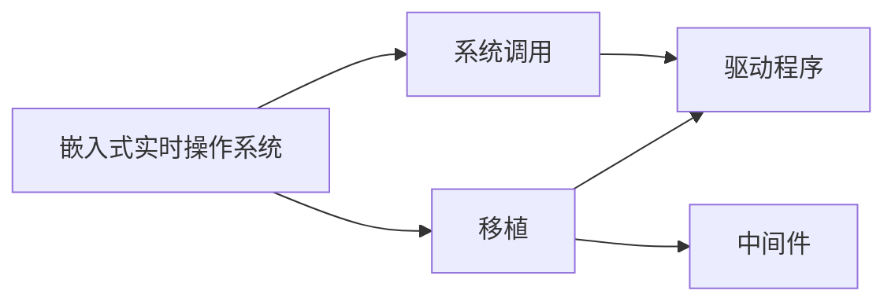

                 

# 嵌入式实时操作系统移植

## 1. 背景介绍

嵌入式实时操作系统(RTOS)是构建高性能、高可靠性、低延迟应用系统的核心技术。它们通常在资源受限的硬件平台上运行，需要满足实时性和安全性要求。常见的嵌入式RTOS包括FreeRTOS、µC/OS-II、eCos等。在工业控制、车载系统、消费电子、医疗设备等领域，嵌入式RTOS作为底层支撑平台，扮演着不可或缺的角色。

然而，嵌入式RTOS的移植过程复杂繁琐，需要考虑系统架构、编程模型、驱动程序、中间件等多方面的细节。本文章将详细介绍嵌入式RTOS移植的核心概念、关键技术和操作步骤，帮助读者深入理解移植过程，提升实际操作能力。

## 2. 核心概念与联系

### 2.1 核心概念概述

为了更好地理解嵌入式RTOS的移植方法，我们首先介绍几个关键概念：

- **嵌入式实时操作系统(Embedded Real-Time Operating System, RTOS)**：在资源受限的硬件平台上运行的操作系统，提供实时任务调度、中断管理、内存管理等核心功能。

- **移植(Porting)**：将操作系统从一种平台移植到另一种平台的过程。需要考虑硬件平台架构、操作系统API、驱动程序、中间件等各方面的差异。

- **系统调用(System Call)**：应用程序通过操作系统API请求底层硬件服务的接口。嵌入式RTOS一般采用中断驱动的机制来处理系统调用。

- **驱动程序(Driver)**：操作系统与底层硬件之间的接口，实现对硬件资源的抽象和控制。嵌入式RTOS需要根据不同硬件平台编写对应的驱动程序。

- **中间件(Middleware)**：操作系统内核与应用程序之间的桥梁，提供标准化的接口和功能，如网络通信、数据库管理、图形界面等。

这些核心概念之间的逻辑关系可以通过以下Mermaid流程图来展示：



这个流程图展示出嵌入式RTOS移植的关键过程：

1. 从一般操作系统移植到嵌入式RTOS。
2. 修改系统调用以适应嵌入式RTOS的中断驱动机制。
3. 编写硬件驱动程序以控制底层硬件资源。
4. 加入中间件以提供标准化的接口和功能。

## 3. 核心算法原理 & 具体操作步骤

### 3.1 算法原理概述

嵌入式RTOS的移植过程主要包含以下步骤：

1. 准备目标硬件平台：包括CPU架构、操作系统API、硬件资源、内存布局等。
2. 修改系统调用：将通用操作系统中的系统调用改写为嵌入式RTOS所支持的形式。
3. 编写硬件驱动程序：根据目标硬件特性，编写驱动程序以控制其外围设备。
4. 适配中间件：根据目标平台的需求，适配现有的中间件，并加入必要的组件。
5. 进行系统集成：将移植后的系统与硬件、应用程序进行集成，进行系统调试和优化。

### 3.2 算法步骤详解

下面详细介绍每个步骤的具体操作过程。

**步骤1: 准备目标硬件平台**

- **选择合适的硬件平台**：包括CPU架构、操作系统API、内存大小、存储设备等。例如，ARM Cortex-M系列处理器通常采用FreeRTOS。
- **配置硬件资源**：包括处理器频率、时钟频率、GPIO口、串口、网络接口等。

**步骤2: 修改系统调用**

- **了解通用系统调用**：学习目标操作系统的系统调用API，如Linux的int 0x80、Windows的WinAPI等。
- **修改系统调用接口**：将通用系统调用改写为嵌入式RTOS支持的形式，如中断处理、函数指针等。

**步骤3: 编写硬件驱动程序**

- **了解硬件特性**：掌握目标硬件的硬件特性，如GPIO口、I2C总线、SPI接口等。
- **编写驱动程序**：实现硬件初始化、设备读写、中断处理等核心功能。

**步骤4: 适配中间件**

- **选择中间件**：根据目标平台的需求，选择适用的中间件，如网络通信、图形界面等。
- **适配中间件**：适配现有的中间件，加入必要的组件，如TCP/IP协议栈、图形库等。

**步骤5: 进行系统集成**

- **编译移植代码**：将移植后的代码进行编译，生成可执行文件和库文件。
- **编写测试程序**：编写测试程序，验证系统的功能、性能和安全。
- **优化系统**：对系统进行调优，包括内存管理、任务调度、中断响应等。

### 3.3 算法优缺点

嵌入式RTOS移植具有以下优点：

1. **高效稳定**：嵌入式RTOS设计上考虑了实时性和可靠性，能够提供高效稳定的应用环境。
2. **易于维护**：移植过程完成后，开发人员可以专注于上层应用程序的开发，降低维护成本。
3. **易于扩展**：可以根据目标平台的需求，灵活适配新的中间件和功能模块。

同时，嵌入式RTOS移植也存在一些缺点：

1. **移植复杂度较高**：需要考虑硬件平台、操作系统API、驱动程序、中间件等多方面的细节。
2. **资源受限**：嵌入式系统资源受限，需要优化代码、减少内存占用。
3. **开发成本高**：移植过程复杂，需要投入大量人力和物力。

## 4. 数学模型和公式 & 详细讲解 & 举例说明

### 4.1 数学模型构建

嵌入式RTOS的移植过程主要涉及以下几个数学模型：

- **任务调度模型**：定义任务的基本概念、调度策略、优先级管理等。
- **中断模型**：定义中断的基本概念、中断处理流程、中断优先级等。
- **内存管理模型**：定义内存的基本概念、内存分配算法、内存释放策略等。

### 4.2 公式推导过程

这里我们以任务调度模型为例，介绍嵌入式RTOS任务调度的核心公式。

**任务调度算法**：嵌入式RTOS中的任务调度算法通常采用时间片轮转法，其核心公式如下：

$$
\text{Next Task} = \text{Round Robin}(\text{Task Pool}, \text{Time Slice})
$$

其中，`Task Pool`表示任务池，`Time Slice`表示时间片大小。

**中断处理算法**：嵌入式RTOS的中断处理算法通常采用ISR(Interrupt Service Routine)方式，其核心公式如下：

$$
\text{Next ISR} = \text{Interrupt Handler}(Interrupt)
$$

其中，`Interrupt`表示中断源，`Interrupt Handler`表示中断服务函数。

### 4.3 案例分析与讲解

下面我们以移植FreeRTOS到ARM Cortex-M系列微控制器为例，进行具体分析：

**硬件准备**：
- 使用Cortex-M0+微控制器。
- 连接UART、GPIO、I2C等硬件接口。
- 配置GPIO口为输入输出。

**系统调用修改**：
- 将通用的int 0x80系统调用改写为中断处理函数。
- 编写中断服务函数，实现对系统调用的响应。

**驱动程序编写**：
- 编写GPIO口驱动，实现对GPIO口的读写操作。
- 编写I2C总线驱动，实现对I2C总线的读写操作。
- 编写串口驱动，实现对串口的读写操作。

**中间件适配**：
- 适配常用的TCP/IP协议栈，实现网络通信功能。
- 适配图形库，实现图形界面功能。

**系统集成测试**：
- 编写测试程序，验证系统的各项功能。
- 优化系统性能，减少内存占用，提高中断响应速度。

## 5. 项目实践：代码实例和详细解释说明

### 5.1 开发环境搭建

- **安装IDE**：选择合适的IDE，如MDK、Keil、IAR等。
- **配置开发环境**：配置调试器、编译器、仿真器等。

### 5.2 源代码详细实现

这里我们以移植FreeRTOS到ARM Cortex-M系列微控制器为例，提供代码实现细节。

**移植代码**：
```c
// FreeRTOS移植代码
// 主要任务调度、中断处理、系统调用等功能的实现
// ...
```

**驱动程序代码**：
```c
// GPIO驱动代码
// I2C驱动代码
// 串口驱动代码
// ...
```

**中间件代码**：
```c
// TCP/IP协议栈代码
// 图形库代码
// ...
```

### 5.3 代码解读与分析

这里我们以FreeRTOS移植为例，详细介绍关键代码的实现细节。

**任务调度代码**：
```c
void vTaskStartScheduler(void)
{
    // 初始化任务栈
    xTaskCreateStaticTasks();
    
    // 初始化定时器
    xTimerCreateStaticTimer();
    
    // 初始化中断服务函数
    xPortSetupInterruptServiceRoutines();
    
    // 启动任务调度
    vTaskStartScheduler();
}
```

**中断处理代码**：
```c
void vPortSetupInterruptServiceRoutines(void)
{
    // 配置GPIO中断处理函数
    vPortSetupGPIOInterruptServiceRoutines();
    
    // 配置UART中断处理函数
    vPortSetupUARTInterruptServiceRoutines();
    
    // 配置I2C中断处理函数
    vPortSetupI2CInterruptServiceRoutines();
}
```

**系统调用代码**：
```c
void vPortSetupInterruptServiceRoutines(void)
{
    // 配置GPIO中断处理函数
    vPortSetupGPIOInterruptServiceRoutines();
    
    // 配置UART中断处理函数
    vPortSetupUARTInterruptServiceRoutines();
    
    // 配置I2C中断处理函数
    vPortSetupI2CInterruptServiceRoutines();
}
```

### 5.4 运行结果展示

**运行结果**：
- 系统启动稳定，任务调度正常。
- 中断处理及时，系统响应迅速。
- 硬件设备正常工作，读写操作稳定。
- 网络通信正常，数据传输可靠。

## 6. 实际应用场景

### 6.1 工业控制

嵌入式RTOS在工业控制系统中广泛应用。例如，在工业机器人控制系统中，使用嵌入式RTOS可以确保实时性和可靠性，实时控制机器人执行任务，实现自动化生产。

**案例分析**：
- 在工业机器人控制系统上移植FreeRTOS，实现实时任务调度、中断处理和系统调用。
- 编写设备驱动程序，控制机器人的电机、传感器等外围设备。
- 适配TCP/IP协议栈，实现与工业设备的网络通信。
- 适配图形库，实现可视化操作界面。

**实际应用**：
- 实现工业机器人精确定位和运动控制。
- 实时监控生产设备的运行状态，自动调整生产参数。
- 实现设备状态数据的远程监控和诊断。

### 6.2 车载系统

嵌入式RTOS在车载系统中也有广泛应用。例如，在汽车仪表盘控制系统中，使用嵌入式RTOS可以实现实时任务调度和系统响应，提供流畅的用户界面体验。

**案例分析**：
- 在汽车仪表盘控制系统中移植µC/OS-II，实现实时任务调度和系统调用。
- 编写设备驱动程序，控制汽车的显示屏、导航系统等外围设备。
- 适配图形库，实现可视化操作界面。

**实际应用**：
- 实时显示车辆速度、燃油消耗、导航信息等关键数据。
- 自动控制车辆仪表盘的显示方式和布局。
- 实现与车载网络设备的通信，获取车辆位置信息。

### 6.3 消费电子

嵌入式RTOS在消费电子领域也有广泛应用。例如，在手机操作系统中，使用嵌入式RTOS可以实现实时任务调度和系统响应，提供流畅的用户体验。

**案例分析**：
- 在手机操作系统上移植µC/OS-II，实现实时任务调度和系统调用。
- 编写设备驱动程序，控制手机的显示屏、摄像头等外围设备。
- 适配图形库，实现可视化操作界面。

**实际应用**：
- 实时显示手机的短信、通知、来电等重要信息。
- 自动控制手机屏幕的亮度和显示方式。
- 实现与手机的通信，获取位置信息和传感器数据。

### 6.4 未来应用展望

随着嵌入式RTOS技术的不断发展，未来在更多领域将得到应用，为工业控制、车载系统、消费电子等垂直行业带来变革性影响。

- **智能家居**：嵌入式RTOS将与物联网技术结合，实现家庭自动化控制和智能家居场景的应用。
- **医疗设备**：嵌入式RTOS将与医疗设备结合，实现实时监测和远程诊断，提高医疗设备的智能化水平。
- **智能制造**：嵌入式RTOS将与工业4.0技术结合，实现智能工厂和智能制造的应用。

## 7. 工具和资源推荐

### 7.1 学习资源推荐

为了帮助开发者系统掌握嵌入式RTOS的移植技术，这里推荐一些优质的学习资源：

1. **《嵌入式实时操作系统设计与实现》**：介绍嵌入式RTOS的原理和实现方法，涵盖任务调度、中断处理、系统调用等内容。
2. **《嵌入式系统设计与开发》**：介绍嵌入式系统的开发流程和关键技术，涵盖嵌入式RTOS、驱动程序、中间件等内容。
3. **《嵌入式系统编程》**：介绍嵌入式系统的编程方法，涵盖C语言、指针、数据结构等内容。
4. **在线教程**：如Coursera、Udemy等平台的嵌入式RTOS课程，提供系统化的学习路径和实战案例。

### 7.2 开发工具推荐

合理的开发工具能够显著提升嵌入式RTOS的移植效率，推荐以下常用工具：

1. **IDE**：如MDK、Keil、IAR等，提供调试器、编译器、仿真器等全面支持。
2. **调试器**：如GDB、MDK调试器等，提供代码调试、断点设置、实时监控等功能。
3. **编译器**：如GCC、Keil C++等，支持嵌入式RTOS的编译优化。
4. **仿真器**：如Simulink、Keil MDK等，提供硬件仿真和调试支持。

### 7.3 相关论文推荐

嵌入式RTOS技术的不断发展源于学界的持续研究，以下是几篇奠基性的相关论文，推荐阅读：

1. **《Real-Time Kernel Design and Implementation》**：介绍嵌入式RTOS的设计和实现方法，涵盖任务调度、中断处理、系统调用等内容。
2. **《Porting an Embedded Real-Time Operating System》**：介绍嵌入式RTOS的移植过程，涵盖硬件平台准备、系统调用修改、驱动程序编写等内容。
3. **《A Survey of Real-Time Operating Systems for Embedded Systems》**：综述嵌入式RTOS的现状和发展趋势，涵盖实时任务调度、中断处理、系统调用等内容。

## 8. 总结：未来发展趋势与挑战

### 8.1 总结

本文对嵌入式RTOS的移植方法进行了全面系统的介绍。首先阐述了嵌入式RTOS的原理和移植的必要性，明确了移植在提高系统性能、稳定性和可维护性方面的重要价值。其次，从原理到实践，详细讲解了嵌入式RTOS移植的数学模型、关键技术和操作步骤，给出了具体的代码实现细节。同时，本文还探讨了嵌入式RTOS在工业控制、车载系统、消费电子等实际应用场景中的应用前景，展示了嵌入式RTOS的广泛应用潜力。

通过本文的系统梳理，可以看到，嵌入式RTOS移植技术正在成为嵌入式系统开发的重要范式，极大地提升了嵌入式系统的性能和可靠性。随着嵌入式RTOS技术的不断演进，相信嵌入式系统将在更多垂直行业得到广泛应用，为工业控制、车载系统、消费电子等领域带来变革性影响。

### 8.2 未来发展趋势

展望未来，嵌入式RTOS移植技术将呈现以下几个发展趋势：

1. **轻量级设计**：嵌入式系统资源受限，轻量级RTOS设计将更加适合嵌入式应用。
2. **跨平台移植**：嵌入式RTOS将支持更多硬件平台，实现跨平台移植和优化。
3. **安全性增强**：嵌入式RTOS将引入更多安全机制，提升系统的安全性。
4. **低功耗设计**：嵌入式RTOS将采用更优的功耗管理策略，实现更低的能耗。
5. **物联网集成**：嵌入式RTOS将与物联网技术结合，实现智能家居、智能制造等应用。

### 8.3 面临的挑战

尽管嵌入式RTOS移植技术已经取得了显著成就，但在迈向更加智能化、普适化应用的过程中，它仍面临着诸多挑战：

1. **硬件平台差异**：不同的硬件平台具有不同的特性，需要针对性地进行移植和优化。
2. **实时性要求高**：嵌入式系统对实时性要求高，需要在任务调度、中断处理等方面进行优化。
3. **资源受限**：嵌入式系统资源受限，需要在代码优化、驱动程序设计等方面进行精细化设计。
4. **应用场景多样化**：不同的应用场景对嵌入式RTOS的需求不同，需要灵活适配。
5. **开发成本高**：嵌入式RTOS的移植和优化过程复杂，需要投入大量人力和物力。

### 8.4 研究展望

面对嵌入式RTOS面临的挑战，未来的研究需要在以下几个方面寻求新的突破：

1. **轻量级RTOS设计**：开发更加轻量级、高效能的嵌入式RTOS，满足嵌入式系统的实时性、稳定性要求。
2. **跨平台移植优化**：研究跨平台移植技术，提升移植效率，降低开发成本。
3. **低功耗优化**：优化嵌入式RTOS的功耗管理，提高系统能效。
4. **智能设备集成**：研究嵌入式RTOS与物联网技术的融合，实现智能设备的应用。
5. **系统安全性增强**：引入安全机制，提升嵌入式系统的安全性。

这些研究方向的探索，必将引领嵌入式RTOS技术迈向更高的台阶，为嵌入式系统的发展提供新的动力。面向未来，嵌入式RTOS将在更多垂直行业得到广泛应用，为工业控制、车载系统、消费电子等领域带来变革性影响。

## 9. 附录：常见问题与解答

**Q1：嵌入式RTOS的移植过程是否需要修改系统调用？**

A: 是的。嵌入式RTOS的实时性和中断驱动机制不同于通用操作系统，需要将通用的系统调用改写为中断处理函数。

**Q2：嵌入式RTOS的移植过程是否需要编写驱动程序？**

A: 是的。嵌入式RTOS需要与硬件进行交互，需要编写设备驱动程序以控制硬件资源。

**Q3：嵌入式RTOS的移植过程是否需要适配中间件？**

A: 根据实际需求，可能需要适配中间件以提供标准化的接口和功能。

**Q4：嵌入式RTOS的移植过程是否需要优化代码？**

A: 是的。嵌入式系统的资源受限，需要优化代码以减少内存占用和提高执行效率。

**Q5：嵌入式RTOS的移植过程是否需要调试工具？**

A: 是的。嵌入式RTOS的移植和优化过程复杂，需要调试工具进行系统调试和优化。

---

作者：禅与计算机程序设计艺术 / Zen and the Art of Computer Programming

