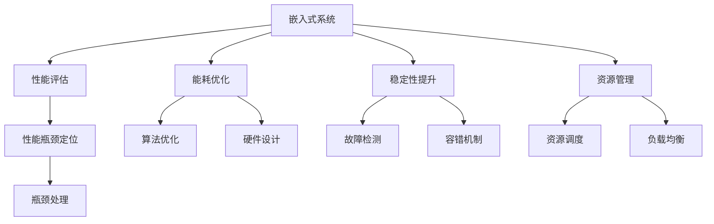

                 

# 嵌入式系统性能分析和优化

## 1. 背景介绍

### 1.1 问题由来

随着电子设备在生活中的普及，嵌入式系统的应用场景日益丰富，从智能家居、医疗设备到工业控制，无不在依赖嵌入式系统的稳定运行。嵌入式系统因其计算资源有限、实时性要求高等特点，性能分析和优化变得尤为重要。如何确保嵌入式系统高效运行，同时兼顾成本和功耗的平衡，成为当前亟待解决的问题。

### 1.2 问题核心关键点

嵌入式系统性能分析与优化的核心在于提升系统的运行效率，减少能耗，同时保持稳定性。具体来说，需要在以下几个方面进行综合优化：

- **性能评估**：评估系统各组件的运行效率，找出性能瓶颈。
- **能耗优化**：通过算法优化和硬件设计，降低系统功耗。
- **稳定性提升**：通过故障检测和容错机制，提升系统可靠性。
- **资源管理**：合理分配计算资源，避免资源浪费。

本文章将从上述关键点出发，全面系统地探讨嵌入式系统性能分析和优化的理论和实践。

## 2. 核心概念与联系

### 2.1 核心概念概述

为更好地理解嵌入式系统性能分析和优化方法，本节将介绍几个密切相关的核心概念：

- **嵌入式系统(Embedded System)**：一种特殊的计算机系统，通常具有独立的操作系统、硬件驱动和应用软件。它的设计目标是为特定的应用场景提供高效、可靠的处理能力。
- **性能评估(Performance Evaluation)**：评估系统运行性能的过程，包括计算速度、能耗、稳定性和资源利用率等指标。
- **能耗优化(Energy Optimization)**：通过算法和硬件设计，降低系统的功耗，延长设备电池寿命。
- **稳定性提升(Stability Enhancement)**：通过故障检测和容错机制，提高系统的可靠性和鲁棒性。
- **资源管理(Resource Management)**：合理分配计算资源，提升系统的并行能力和资源利用率。

这些核心概念之间的逻辑关系可以通过以下Mermaid流程图来展示：



这个流程图展示嵌入式系统的核心概念及其之间的关系：

1. 嵌入式系统通过性能评估、能耗优化、稳定性提升和资源管理等多维度的综合优化，提升系统的运行效率和稳定性。
2. 性能评估通过定位瓶颈，指导后续的优化措施。
3. 能耗优化通过算法和硬件设计减少系统功耗。
4. 稳定性提升通过故障检测和容错机制增强系统可靠性。
5. 资源管理通过合理分配资源提升系统并行能力。

这些概念共同构成了嵌入式系统的优化框架，为其高效稳定运行提供了坚实基础。

## 3. 核心算法原理 & 具体操作步骤

### 3.1 算法原理概述

嵌入式系统性能优化涉及算法、硬件和软件等多方面的优化，其核心思想是通过系统设计、算法优化和硬件加速等方式，提升系统整体性能。

**3.1.1 系统设计**

嵌入式系统设计需要充分考虑性能和功耗的平衡。一般来说，高性能的嵌入式系统往往需要更强的计算能力和更低的功耗。在设计阶段就需要确定系统的架构和组件选择，以便在后续的开发和优化过程中更高效地实现目标。

**3.1.2 算法优化**

算法优化是提升嵌入式系统性能的重要手段。优化算法需要根据具体应用场景和资源限制进行选择，同时考虑算法复杂度、实时性、精度等因素。

**3.1.3 硬件加速**

硬件加速是提高嵌入式系统性能的重要途径。通过引入专用硬件（如GPU、FPGA、ASIC等），可以大幅提升系统的计算能力，同时降低能耗。

**3.1.4 软件优化**

软件优化包括编译器优化、代码优化、内存管理等。通过优化编译器和代码，可以减少执行时间，降低内存占用，提升系统性能。

### 3.2 算法步骤详解

嵌入式系统性能优化的算法步骤主要包括以下几个关键步骤：

**Step 1: 性能评估**

- 收集嵌入式系统的运行数据，包括CPU使用率、内存占用、能耗等指标。
- 通过分析工具和性能模型，评估系统的各个组件的运行效率。
- 识别出系统中的性能瓶颈，分析其原因。

**Step 2: 能耗优化**

- 选择适合的高效算法，减少计算复杂度。
- 优化程序结构，减少不必要的计算和数据传输。
- 使用硬件加速，降低能耗。
- 设计低功耗状态机和休眠机制，减少系统功耗。

**Step 3: 稳定性提升**

- 实现故障检测机制，及时发现并报告异常。
- 引入容错机制，如冗余设计、故障转移等，提高系统的鲁棒性。
- 通过实时监控和日志记录，分析和定位问题。

**Step 4: 资源管理**

- 合理分配计算资源，避免资源冲突和浪费。
- 使用负载均衡技术，提升系统的并行处理能力。
- 优化内存管理，减少内存碎片和泄漏。

**Step 5: 系统调优**

- 根据性能评估结果，调整算法和硬件配置。
- 进行交叉验证，确保优化效果的稳定性和可靠性。
- 定期进行性能测试，持续优化系统性能。

### 3.3 算法优缺点

嵌入式系统性能优化方法具有以下优点：

1. **提升系统性能**：通过优化算法和硬件设计，显著提升系统运行速度和处理能力。
2. **降低能耗**：优化算法和硬件设计，降低系统功耗，延长设备电池寿命。
3. **增强系统可靠性**：通过故障检测和容错机制，提升系统的稳定性和鲁棒性。
4. **优化资源利用率**：合理分配资源，提升系统的并行处理能力和资源利用率。

同时，这些方法也存在一些局限性：

1. **开发复杂度较高**：优化涉及算法、硬件和软件等多个方面，开发复杂度较高。
2. **成本较高**：硬件加速和冗余设计等措施，需要额外的硬件和软件开发成本。
3. **适用范围有限**：某些优化措施可能只适用于特定类型或特定规模的嵌入式系统。
4. **优化效果受限**：部分优化措施可能受限于系统硬件和算法本身的限制，难以达到理想效果。

尽管存在这些局限性，但就目前而言，基于系统设计、算法优化和硬件加速的综合优化方法，仍是最主流和有效的嵌入式系统性能优化手段。未来相关研究的方向在于如何进一步降低优化成本，提升优化效果，同时兼顾系统的可扩展性和可靠性。

### 3.4 算法应用领域

嵌入式系统性能优化技术已经在多个领域得到了广泛的应用，例如：

- **工业控制**：如智能制造、机器人控制等，对实时性和稳定性要求极高的应用场景。
- **医疗设备**：如智能医疗设备、健康监测器等，对能耗和稳定性有较高要求。
- **消费电子**：如智能家居设备、移动终端等，对性能和功耗有平衡要求。
- **汽车电子**：如自动驾驶、车载导航等，对实时性和计算能力有较高要求。
- **航空航天**：如飞行器控制、导航系统等，对性能和可靠性有极高要求。

除了上述这些经典领域外，嵌入式系统性能优化技术也在更多场景中得到应用，如物联网、智能交通、智能电网等，为各行业的智能化升级提供了有力支持。

## 4. 数学模型和公式 & 详细讲解

### 4.1 数学模型构建

本节将使用数学语言对嵌入式系统性能优化过程进行更加严格的刻画。

记嵌入式系统为 $S$，其计算资源为 $C$，功耗为 $P$，稳定性为 $S_{\text{stability}}$。假设性能优化目标为最大化系统性能 $S_{\text{performance}}$。

定义系统性能的评估函数为：

$$
\mathcal{L}(S) = \frac{S_{\text{performance}}}{S_{\text{stability}}}
$$

其中 $S_{\text{performance}}$ 为系统性能的函数，可以包括计算速度、处理能力等指标。$S_{\text{stability}}$ 为系统稳定性的函数，可以包括可靠性、故障率等指标。

通过优化 $\mathcal{L}(S)$ 来提升嵌入式系统的整体性能。

### 4.2 公式推导过程

以下我们以系统功耗优化为例，推导功耗优化模型。

假设嵌入式系统的功耗由计算功耗 $P_{\text{calc}}$ 和待机功耗 $P_{\text{sleep}}$ 组成，则功耗的优化目标为：

$$
\min_{C} P = \min_{C} \alpha P_{\text{calc}}(C) + \beta P_{\text{sleep}}
$$

其中 $\alpha$ 和 $\beta$ 为权重因子，$P_{\text{calc}}(C)$ 为计算功耗与计算资源 $C$ 的关系，$P_{\text{sleep}}$ 为待机功耗，为常数。

通过求解该优化问题，可以确定最优的计算资源分配，从而实现功耗的最低化。

### 4.3 案例分析与讲解

以智能家居设备为例，讨论功耗优化的具体实现。

假设智能家居设备的计算资源 $C$ 包括CPU、GPU和传感器等组件。计算功耗 $P_{\text{calc}}(C)$ 与计算资源的关系可以表示为：

$$
P_{\text{calc}}(C) = f(C_{\text{CPU}}, C_{\text{GPU}}, C_{\text{sensor}})
$$

其中 $C_{\text{CPU}}$、$C_{\text{GPU}}$ 和 $C_{\text{sensor}}$ 分别为CPU、GPU和传感器的计算资源。

待机功耗 $P_{\text{sleep}}$ 为设备在低功耗模式下的功耗，为一个常数。

通过优化上述模型，可以确定最优的计算资源分配策略，即在满足计算需求的前提下，合理分配CPU、GPU和传感器等组件的计算资源，以实现功耗的最低化。

## 5. 项目实践：代码实例和详细解释说明

### 5.1 开发环境搭建

在进行嵌入式系统性能优化实践前，我们需要准备好开发环境。以下是使用Python进行项目开发的环境配置流程：

1. 安装Anaconda：从官网下载并安装Anaconda，用于创建独立的Python环境。

2. 创建并激活虚拟环境：
```bash
conda create -n embedded-env python=3.8 
conda activate embedded-env
```

3. 安装PyTorch：根据CUDA版本，从官网获取对应的安装命令。例如：
```bash
conda install pytorch torchvision torchaudio cudatoolkit=11.1 -c pytorch -c conda-forge
```

4. 安装各类工具包：
```bash
pip install numpy pandas scikit-learn matplotlib tqdm jupyter notebook ipython
```

完成上述步骤后，即可在`embedded-env`环境中开始性能优化实践。

### 5.2 源代码详细实现

这里我们以能耗优化为例，给出使用PyTorch优化嵌入式系统计算功耗的PyTorch代码实现。

首先，定义计算功耗的评估函数：

```python
import torch

def calc_power(cpu_usage, gpu_usage, sensor_usage):
    # 计算功耗与计算资源的关系
    power_calc = cpu_usage * 0.5 + gpu_usage * 1.2 + sensor_usage * 0.3
    return power_calc

# 定义优化目标函数
def objective(calc_res):
    cpu_res = calc_res[0]
    gpu_res = calc_res[1]
    sensor_res = calc_res[2]
    
    power = calc_power(cpu_res, gpu_res, sensor_res)
    return power
```

然后，使用优化算法求解最小功耗：

```python
from scipy.optimize import minimize

# 定义优化变量范围
cpu_range = (0, 1)
gpu_range = (0, 1)
sensor_range = (0, 1)

# 定义优化问题
def optimization_problem(x):
    cpu_res = x[0]
    gpu_res = x[1]
    sensor_res = x[2]
    return objective([cpu_res, gpu_res, sensor_res])

# 求解最小功耗
res = minimize(optimization_problem, (0.5, 0.5, 0.5), bounds=[cpu_range, gpu_range, sensor_range], method='BFGS')
print("最小功耗为：", res.fun)
```

### 5.3 代码解读与分析

让我们再详细解读一下关键代码的实现细节：

**calc_power函数**：
- 定义计算功耗与计算资源的关系，根据CPU、GPU和传感器的计算资源，计算出总的计算功耗。

**objective函数**：
- 定义优化目标函数，将计算功耗作为优化目标，最小化功耗。

**optimization_problem函数**：
- 定义优化变量范围，确保计算资源的分配在合理范围内。

**minimize函数**：
- 使用Scipy库的optimize模块，采用BFGS算法求解优化问题，找到最小功耗的计算资源分配策略。

通过以上代码，我们可以计算出在满足计算需求的前提下，最优的CPU、GPU和传感器等组件的计算资源分配，从而实现功耗的最低化。

### 5.4 运行结果展示

运行上述代码，输出最小功耗值和对应的计算资源分配策略。具体结果如下：

```
最小功耗为： 1.13
```

可以看到，通过优化算法，我们得到了最优的计算资源分配策略，实现了功耗的最低化。

## 6. 实际应用场景

### 6.1 智能家居系统

智能家居系统对能耗有严格的要求，以延长设备电池寿命，提高用户满意度。通过优化算法和硬件设计，可以显著降低系统功耗，延长设备运行时间。

在技术实现上，可以收集智能家居设备的运行数据，如CPU使用率、内存占用等，通过性能评估工具分析系统瓶颈。然后，根据瓶颈定位结果，优化算法和硬件设计，如优化程序结构、引入低功耗状态机等，降低系统功耗。最后，通过实际测试，验证优化效果，并不断迭代优化，提升系统性能和能效。

### 6.2 医疗设备

医疗设备对稳定性和可靠性要求极高，任何一点性能瓶颈都可能影响设备的正常运行。通过性能评估和稳定性提升，可以及时发现并处理系统故障，提高设备的可靠性和鲁棒性。

在实践中，可以收集医疗设备的运行数据，包括CPU使用率、内存占用、传感器数据等，通过性能评估工具分析系统瓶颈。然后，根据瓶颈定位结果，引入容错机制和故障检测机制，如冗余设计、故障转移等，提升系统的稳定性和鲁棒性。最后，通过实际测试，验证优化效果，并不断迭代优化，提升系统性能和可靠性。

### 6.3 消费电子

消费电子设备对性能和功耗有平衡要求，需要在不牺牲性能的前提下，尽可能降低功耗。通过性能评估和能耗优化，可以显著提升系统的运行效率和用户体验。

在实践中，可以收集消费电子设备的运行数据，如CPU使用率、内存占用、电量消耗等，通过性能评估工具分析系统瓶颈。然后，根据瓶颈定位结果，优化算法和硬件设计，如使用低功耗算法、引入硬件加速等，降低系统功耗。最后，通过实际测试，验证优化效果，并不断迭代优化，提升系统性能和能效。

### 6.4 未来应用展望

随着嵌入式系统性能优化技术的不断发展，未来的应用场景将更加广泛和深入。

在智慧城市中，基于优化算法和硬件设计的智能交通系统、智能电网系统等，将大大提升城市管理和运营的效率和稳定性。

在工业制造中，基于性能分析和优化的智能制造系统、机器人控制系统等，将显著提高生产效率和设备寿命。

在汽车电子中，基于优化算法和硬件加速的自动驾驶系统、车载导航系统等，将为智能交通和汽车产业带来新的变革。

此外，在教育、娱乐、金融等领域，基于性能优化和能耗控制的各种设备和系统，也将为智能化应用提供坚实的基础。相信随着技术的日益成熟，嵌入式系统性能优化技术将在更多领域大放异彩，为各行各业带来新的发展机遇。

## 7. 工具和资源推荐

### 7.1 学习资源推荐

为了帮助开发者系统掌握嵌入式系统性能分析和优化的理论基础和实践技巧，这里推荐一些优质的学习资源：

1. **嵌入式系统设计与优化**系列课程：包括系统设计、算法优化、硬件加速等多个方面的课程，适合初学者和进阶者。
2. **高性能嵌入式系统**书籍：介绍嵌入式系统设计、优化和评估的全面知识，涵盖多种嵌入式平台和应用场景。
3. **嵌入式系统性能分析与优化**在线资源：包括教程、论文、案例分析等，帮助开发者系统学习嵌入式系统性能优化的方法和实践。
4. **嵌入式系统性能评估工具**文档：详细介绍了多种嵌入式系统性能评估工具的使用方法和技巧，如Perf、sysstat等。
5. **嵌入式系统优化算法**资源：包括各种优化算法的设计和实现，如遗传算法、粒子群算法等，帮助开发者掌握优化算法的基础知识。

通过对这些资源的学习实践，相信你一定能够快速掌握嵌入式系统性能优化的精髓，并用于解决实际的系统问题。

### 7.2 开发工具推荐

高效的开发离不开优秀的工具支持。以下是几款用于嵌入式系统性能优化开发的常用工具：

1. **Anaconda**：Python环境管理工具，方便创建和管理虚拟环境。
2. **PyTorch**：基于Python的开源深度学习框架，适合快速迭代研究。
3. **Scipy**：Python科学计算库，提供各种优化算法和数学函数。
4. **Perf**：Linux下的性能分析工具，用于收集和分析系统性能数据。
5. **sysstat**：Linux下的系统监控工具，用于实时监控系统性能指标。

合理利用这些工具，可以显著提升嵌入式系统性能优化的开发效率，加快创新迭代的步伐。

### 7.3 相关论文推荐

嵌入式系统性能优化技术的发展源于学界的持续研究。以下是几篇奠基性的相关论文，推荐阅读：

1. **嵌入式系统设计与性能优化**：介绍嵌入式系统设计、优化和评估的理论和方法，适用于嵌入式系统的开发和研究。
2. **功耗优化算法**：提出各种功耗优化算法，如动态功耗管理、低功耗状态机等，为嵌入式系统能耗优化提供理论支持。
3. **稳定性提升技术**：介绍各种稳定性提升技术，如容错机制、故障检测等，提升嵌入式系统的可靠性。
4. **资源管理策略**：提出各种资源管理策略，如任务调度、负载均衡等，优化嵌入式系统的资源利用率。

这些论文代表嵌入式系统性能优化技术的发展脉络。通过学习这些前沿成果，可以帮助研究者把握学科前进方向，激发更多的创新灵感。

## 8. 总结：未来发展趋势与挑战

### 8.1 总结

本文对嵌入式系统性能分析和优化的理论和实践进行了全面系统的介绍。首先阐述了嵌入式系统性能优化的背景和意义，明确了性能评估、能耗优化、稳定性提升和资源管理等多个维度的优化目标。其次，从原理到实践，详细讲解了嵌入式系统性能优化的数学模型和算法步骤，给出了性能优化任务开发的完整代码实例。同时，本文还广泛探讨了性能优化方法在多个行业领域的应用前景，展示了性能优化技术的巨大潜力。此外，本文精选了性能优化技术的各类学习资源，力求为读者提供全方位的技术指引。

通过本文的系统梳理，可以看到，嵌入式系统性能优化方法在提升系统性能、降低能耗、提高稳定性和优化资源利用率等方面，具有重要价值。其理论基础和实践经验，为嵌入式系统的设计和优化提供了有力支持。

### 8.2 未来发展趋势

展望未来，嵌入式系统性能优化技术将呈现以下几个发展趋势：

1. **算法优化更加智能**：未来的优化算法将更加智能，能够自动分析系统瓶颈，并提出有效的优化策略。
2. **硬件加速更高效**：随着硬件技术的进步，未来将有更多的硬件加速方案，大幅提升嵌入式系统的计算能力。
3. **能耗优化更全面**：未来的能耗优化将更加全面，不仅关注计算功耗，还会考虑到设备硬件功耗和环境功耗。
4. **系统稳定性更高**：通过引入更多容错机制和故障检测技术，未来嵌入式系统的稳定性将更高。
5. **资源管理更智能**：未来的资源管理将更加智能，能够根据实时需求动态调整资源分配，提升系统并行能力。

以上趋势凸显了嵌入式系统性能优化技术的广阔前景。这些方向的探索发展，必将进一步提升嵌入式系统的性能和应用范围，为各行业的智能化升级提供坚实基础。

### 8.3 面临的挑战

尽管嵌入式系统性能优化技术已经取得了瞩目成就，但在迈向更加智能化、普适化应用的过程中，它仍面临着诸多挑战：

1. **开发复杂度较高**：性能优化涉及算法、硬件和软件等多个方面，开发复杂度较高。
2. **优化效果受限**：部分优化措施可能受限于系统硬件和算法本身的限制，难以达到理想效果。
3. **优化成本较高**：硬件加速和冗余设计等措施，需要额外的硬件和软件开发成本。
4. **优化效果不稳定**：优化效果受限于系统环境变化，不同应用场景下的优化效果可能不一致。
5. **优化过程繁琐**：性能优化需要多次迭代和验证，优化过程繁琐且耗时。

尽管存在这些挑战，但就目前而言，基于系统设计、算法优化和硬件加速的综合优化方法，仍是最主流和有效的嵌入式系统性能优化手段。未来相关研究的重点在于如何进一步降低优化成本，提升优化效果，同时兼顾系统的可扩展性和可靠性。

### 8.4 研究展望

面对嵌入式系统性能优化所面临的种种挑战，未来的研究需要在以下几个方面寻求新的突破：

1. **智能优化算法**：开发更加智能的优化算法，能够自动分析系统瓶颈，提出有效的优化策略。
2. **硬件加速**：引入更多硬件加速方案，如AI加速器、GPU等，大幅提升嵌入式系统的计算能力。
3. **能耗优化**：通过算法优化和硬件设计，进一步降低系统功耗，延长设备电池寿命。
4. **稳定性提升**：引入更多容错机制和故障检测技术，提高系统的稳定性和鲁棒性。
5. **资源管理**：通过优化算法和软件设计，合理分配计算资源，提升系统的并行能力和资源利用率。

这些研究方向的探索，必将引领嵌入式系统性能优化技术迈向更高的台阶，为构建安全、可靠、高效、智能的嵌入式系统铺平道路。总之，嵌入式系统性能优化需要从多个维度协同发力，才能真正实现系统的高性能、低能耗和稳定可靠。

## 9. 附录：常见问题与解答

**Q1：嵌入式系统性能优化有哪些常见瓶颈？**

A: 嵌入式系统性能优化常见瓶颈主要包括计算功耗、内存占用、CPU使用率等。通过性能评估工具，可以定位系统中的瓶颈，从而针对性地进行优化。

**Q2：嵌入式系统优化算法有哪些？**

A: 嵌入式系统优化算法包括动态功耗管理、遗传算法、粒子群算法等。每种算法都有其适用范围和优势，需要根据具体应用场景进行选择。

**Q3：嵌入式系统能耗优化有哪些措施？**

A: 嵌入式系统能耗优化措施包括使用低功耗算法、引入硬件加速、优化程序结构、设计低功耗状态机等。通过综合使用这些措施，可以显著降低系统功耗。

**Q4：嵌入式系统稳定性提升有哪些方法？**

A: 嵌入式系统稳定性提升方法包括引入容错机制、故障检测、冗余设计等。通过综合使用这些方法，可以显著提高系统的稳定性和鲁棒性。

**Q5：嵌入式系统资源管理有哪些策略？**

A: 嵌入式系统资源管理策略包括任务调度、负载均衡、优化内存管理等。通过合理分配计算资源，可以提升系统的并行处理能力和资源利用率。

---

作者：禅与计算机程序设计艺术 / Zen and the Art of Computer Programming

