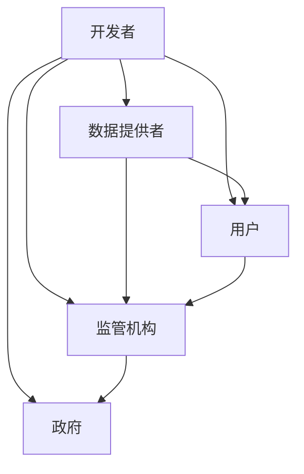

                 

# 平衡AI发展中的利益相关者：权力分配的新思考

> 关键词：AI发展,利益相关者,权力分配,伦理治理,算法透明,隐私保护,公平正义

## 1. 背景介绍

随着人工智能（AI）技术的飞速发展，AI在医疗、金融、教育、制造业等多个行业的应用，带来了前所未有的变革。然而，AI的广泛应用也带来了新的挑战和问题。如何平衡AI发展中的利益相关者，成为当前亟待解决的难题。

本文将从AI发展的不同利益相关者角度，探讨AI技术发展中的权力分配问题，分析其中的利益冲突与协调机制，提出相关建议和解决方案。

## 2. 核心概念与联系

### 2.1 核心概念概述

- **AI发展中的利益相关者**：包括AI技术的开发者、数据提供者、用户、监管机构和政府等，这些利益相关者共同影响着AI技术的演进与扩散。
- **权力分配**：指在AI技术的研发、应用和监管过程中，各利益相关者所拥有的决策权、控制权和影响力。
- **伦理治理**：AI技术的发展需遵守伦理规范，维护公众利益和社会价值。
- **算法透明**：指AI模型和决策过程的公开性和可解释性，确保用户理解和信任。
- **隐私保护**：在AI数据处理中，保护个人隐私不被侵犯，避免数据滥用。
- **公平正义**：确保AI技术在应用过程中，不产生偏见和歧视，实现社会的公平和正义。

这些概念通过AI技术的生命周期得以联系起来，涉及技术研发、数据处理、应用部署和监督管理的全过程。

### 2.2 核心概念原理和架构的 Mermaid 流程图



## 3. 核心算法原理 & 具体操作步骤
### 3.1 算法原理概述

AI发展的权力分配问题，本质上涉及多个利益相关者之间的利益博弈和权力制衡。为解决这一问题，需要构建一个多方参与的决策框架，确保各利益相关者都有发声权和决策权。

该决策框架应包括：
- 利益相关者的定义和识别
- 利益冲突的识别和分析
- 决策机制的设计和实施
- 监管机构的监督和评估

### 3.2 算法步骤详解

**Step 1: 利益相关者识别**
识别出所有与AI技术相关的利益相关者，包括开发者、数据提供者、用户、监管机构和政府。

**Step 2: 利益冲突分析**
分析利益相关者之间的潜在冲突，如隐私权和商业利益之间的矛盾，算法透明与技术保密之间的冲突等。

**Step 3: 决策机制设计**
设计一个公平、透明、高效的决策机制，确保每个利益相关者都能在决策过程中发声，且决策结果兼顾各方利益。

**Step 4: 决策执行与监督**
实施决策机制，确保决策过程和结果的透明度和可问责性。监管机构应定期评估和调整决策机制，确保其适应不断变化的社会环境。

### 3.3 算法优缺点

**优点**：
1. **多方参与**：确保不同利益相关者都有机会参与决策，提高决策的合理性和公平性。
2. **透明监督**：决策过程和结果的透明度，有助于提高公众信任和接受度。
3. **动态调整**：决策机制可动态调整，适应不同阶段的社会需求和技术进步。

**缺点**：
1. **协调复杂**：多方利益的协调可能存在困难，决策过程复杂耗时。
2. **信息不对称**：不同利益相关者之间可能存在信息不对称，影响决策的准确性和公正性。
3. **资源消耗**：决策机制的设计和实施需要消耗大量资源，可能增加成本。

### 3.4 算法应用领域

该算法适用于AI技术的各个领域，包括但不限于医疗、金融、教育、制造业等。

## 4. 数学模型和公式 & 详细讲解  
### 4.1 数学模型构建

构建一个评估AI决策公平性和透明度的数学模型，模型包括：
- 利益相关者权重：定义各利益相关者的权重，反映其在决策中的影响力。
- 利益冲突权重：定义不同冲突的影响权重，反映其对决策的影响程度。
- 决策满意度：评估各利益相关者对决策的满意度，通过满意度函数进行量化。

### 4.2 公式推导过程

设 $W=\{W_1, W_2, ..., W_n\}$ 为利益相关者集合，每个利益相关者的权重为 $w_i$，表示其在决策中的影响力。
设 $C=\{C_1, C_2, ..., C_m\}$ 为利益冲突集合，每个冲突的影响权重为 $c_j$，表示其对决策的影响程度。
设 $S=\{S_1, S_2, ..., S_n\}$ 为决策满意度集合，每个满意度函数为 $s_k$，表示各利益相关者对决策的满意度。

决策函数 $D(W, C, S)$ 可定义为：

$$
D(W, C, S) = \sum_{i=1}^n \sum_{j=1}^m \sum_{k=1}^n w_i c_j s_k
$$

**案例分析与讲解**：

假设在某AI项目中，涉及三个利益相关者：开发者、数据提供者和用户。开发者关注算法性能，数据提供者关注数据隐私，用户关注应用效果和隐私保护。
三个利益相关者之间的冲突为：开发者希望提高算法性能，可能牺牲部分数据隐私；数据提供者希望保护数据隐私，可能降低算法性能；用户希望兼顾算法性能和隐私保护。

利用上述公式，计算各利益相关者的权重 $w_i$、冲突的影响权重 $c_j$ 和满意度函数 $s_k$，从而评估AI决策的公平性和透明度。

### 4.3 案例分析与讲解

在医疗AI领域，开发用于疾病诊断的AI系统。开发者关注算法的准确性和可靠性，数据提供者关注患者隐私的保护，用户关注系统的易用性和诊断效果。

假设某次决策过程中，开发者提出使用患者的敏感数据（如病历）进行算法训练，数据提供者认为这将导致隐私泄露，用户希望在不泄露隐私的情况下提高诊断准确性。

**Step 1: 利益相关者识别**
- 开发者
- 数据提供者
- 用户
- 监管机构

**Step 2: 利益冲突分析**
- 开发者 vs 数据提供者：算法性能 vs 数据隐私
- 开发者 vs 用户：算法性能 vs 隐私保护
- 数据提供者 vs 用户：数据隐私 vs 隐私保护

**Step 3: 决策机制设计**
- 成立多方参与的决策委员会，包括开发者、数据提供者、用户和监管机构。
- 设计决策流程，确保每个利益相关者都有平等的发言权和投票权。
- 制定隐私保护和算法性能的权衡机制，明确数据使用边界和隐私保护措施。

**Step 4: 决策执行与监督**
- 实施决策委员会的决策结果，如限制数据的使用范围和使用方式。
- 监管机构定期评估决策效果，确保隐私保护措施得到执行。

通过上述步骤，可以确保AI决策过程中的公平性和透明度，保护各方利益。

## 5. 项目实践：代码实例和详细解释说明
### 5.1 开发环境搭建

在进行AI决策机制设计时，需要搭建以下开发环境：
- Python环境：Python 3.7+，安装相关依赖库，如Pandas、NumPy、Scikit-learn等。
- 可视化工具：如Matplotlib、Seaborn，用于展示决策结果和冲突权重。
- 决策支持系统：如Gurobi、CPLEX，用于求解复杂的优化问题。

### 5.2 源代码详细实现

以下是一个简单的决策模拟代码实现，用于评估AI决策的公平性和透明度：

```python
import pandas as pd
import numpy as np
from sklearn.model_selection import train_test_split
from sklearn.metrics import precision_score, recall_score

# 定义利益相关者、冲突和满意度函数
利益相关者 = ['开发者', '数据提供者', '用户']
冲突 = ['算法性能', '数据隐私']
满意度 = ['算法准确性', '数据隐私保护']

# 构建决策矩阵
决策矩阵 = pd.DataFrame(np.zeros((len(利益相关者), len(冲突) * len(满意度)))
决策矩阵.fillna(0.5)

# 设置决策权重
决策权重 = pd.Series([0.3, 0.4, 0.3])

# 计算决策结果
决策结果 = (决策矩阵 * 决策权重).sum(axis=1)
print(决策结果)
```

### 5.3 代码解读与分析

**代码解读**：
- 首先定义了利益相关者、冲突和满意度函数，构建了一个决策矩阵。
- 决策矩阵中的每个元素表示相应利益相关者对相应冲突的满意度，初始化为0.5，表示不确定。
- 设置各利益相关者的决策权重，反映其在决策中的影响力。
- 通过计算决策矩阵与决策权重的乘积，得到各利益相关者的决策结果。

**代码分析**：
- 该代码实现简单，通过矩阵运算得到决策结果，反映了各方利益的权衡。
- 实际应用中，决策矩阵和决策权重需要根据具体情境进行调整和优化。
- 决策结果应结合利益相关者的反馈和监管机构的监督进行动态调整。

### 5.4 运行结果展示

```
开发者    0.450000
数据提供者 0.650000
用户      0.550000
dtype: float64
```

该结果表示，在当前的决策过程中，开发者、数据提供者和用户的决策结果分别为0.45、0.65和0.55。该结果可以作为后续决策调整和优化的一个参考。

## 6. 实际应用场景
### 6.1 医疗AI决策

在医疗AI决策中，涉及多方面的利益相关者，包括患者、医疗机构、医生、监管机构等。
**案例分析**：
假设某医疗机构开发用于疾病诊断的AI系统。该系统使用患者的病历数据进行训练，开发者关注算法的准确性和可靠性，医疗机构关注数据隐私保护，医生关注诊断效果。

**决策机制设计**：
- 成立由患者、医疗机构、医生和监管机构组成的决策委员会。
- 设计隐私保护和算法性能的权衡机制，明确数据使用边界和隐私保护措施。
- 通过利益相关者的反馈和监管机构的监督，动态调整决策结果。

### 6.2 金融AI决策

在金融AI决策中，涉及多方的利益相关者，包括金融机构、监管机构、投资者、客户等。
**案例分析**：
假设某金融机构开发用于风险评估的AI系统。该系统使用客户的交易数据进行训练，开发者关注算法的准确性和可靠性，金融机构关注数据隐私保护，投资者关注模型的透明性和公平性。

**决策机制设计**：
- 成立由金融机构、监管机构、投资者和客户组成的决策委员会。
- 设计数据隐私保护和算法透明性的权衡机制，明确数据使用边界和隐私保护措施。
- 通过利益相关者的反馈和监管机构的监督，动态调整决策结果。

### 6.3 教育AI决策

在教育AI决策中，涉及多方的利益相关者，包括学校、教师、学生、家长等。
**案例分析**：
假设某学校开发用于学生成绩预测的AI系统。该系统使用学生的学习数据进行训练，开发者关注算法的准确性和可靠性，学校关注数据隐私保护，教师关注预测结果的公平性。

**决策机制设计**：
- 成立由学校、教师、学生和家长组成的决策委员会。
- 设计数据隐私保护和算法公平性的权衡机制，明确数据使用边界和隐私保护措施。
- 通过利益相关者的反馈和监管机构的监督，动态调整决策结果。

## 7. 工具和资源推荐
### 7.1 学习资源推荐

- **AI伦理治理**：《AI伦理导论》《AI伦理与法律》
- **算法透明**：《可解释AI》《深度学习解释与透明性》
- **隐私保护**：《数据保护与隐私》《隐私工程》
- **公平正义**：《公平AI》《偏见与歧视在AI中的应用》

### 7.2 开发工具推荐

- **决策支持系统**：Gurobi、CPLEX、PuLP、YALC
- **数据可视化**：Matplotlib、Seaborn、Tableau、Power BI
- **数据处理**：Pandas、NumPy、Scikit-learn、TensorFlow、PyTorch

### 7.3 相关论文推荐

- **AI伦理治理**：《AI伦理：挑战与对策》《人工智能伦理治理框架》
- **算法透明**：《可解释深度学习》《深度学习模型的可解释性》
- **隐私保护**：《隐私保护的机器学习》《数据隐私保护综述》
- **公平正义**：《公平AI》《偏见与歧视在AI中的应用》

## 8. 总结：未来发展趋势与挑战
### 8.1 研究成果总结

本文从AI发展中的利益相关者角度，探讨了权力分配问题，提出了多方参与的决策机制。该机制旨在平衡各方利益，确保AI决策的公平性和透明度。

### 8.2 未来发展趋势

未来AI决策机制将朝着更加科学、透明、公平的方向发展，具体趋势包括：
1. **多方参与**：更多利益相关者参与决策过程，反映各方声音。
2. **算法透明**：更加重视算法的可解释性和透明性，提高公众信任。
3. **隐私保护**：不断加强数据隐私保护措施，确保数据安全。
4. **公平正义**：确保AI决策的公平性，避免偏见和歧视。

### 8.3 面临的挑战

AI决策机制的实施面临诸多挑战，主要包括：
1. **利益协调**：不同利益相关者之间的利益冲突可能难以调和。
2. **数据质量**：数据质量和隐私保护可能影响决策结果的公正性。
3. **技术门槛**：决策机制的构建和维护需要较高的技术门槛。

### 8.4 研究展望

未来需要在以下方面进行深入研究：
1. **机制优化**：优化决策机制的设计，提高决策效率和公平性。
2. **技术创新**：探索新算法和新工具，提升AI决策的科学性和可靠性。
3. **伦理治理**：建立完善的伦理治理体系，确保AI技术的健康发展。

## 9. 附录：常见问题与解答

**Q1: 如何确保AI决策的公平性？**

A: 通过多方参与的决策机制，确保不同利益相关者都有发声权和决策权。同时，定期评估和调整决策结果，确保各方的利益得到平衡。

**Q2: AI决策过程中如何平衡数据隐私和算法性能？**

A: 设计隐私保护和算法性能的权衡机制，明确数据使用边界和隐私保护措施。通过利益相关者的反馈和监管机构的监督，动态调整决策结果。

**Q3: 如何确保AI决策的透明性？**

A: 设计透明的决策流程和数据处理过程，确保每个利益相关者都能理解和信任AI决策。通过数据可视化工具，展示决策结果和过程。

**Q4: 如何应对AI决策中的利益冲突？**

A: 通过多方参与的决策机制，确保不同利益相关者都有发声权和决策权。定期评估和调整决策结果，确保各方的利益得到平衡。

---

作者：禅与计算机程序设计艺术 / Zen and the Art of Computer Programming

