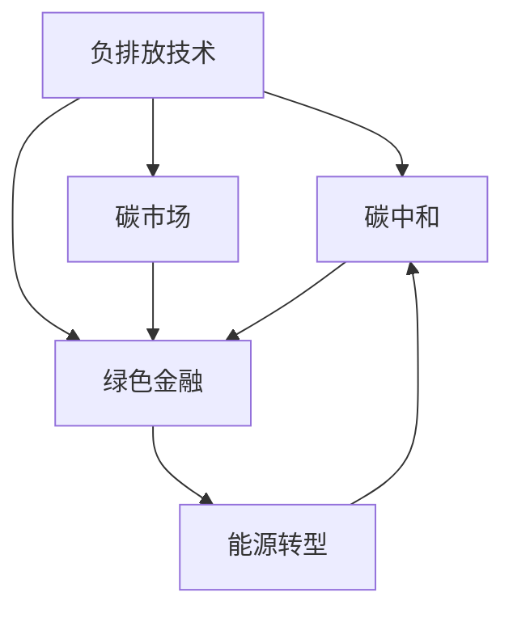

                 

# 2050年的全球减排：从负排放技术到碳中和经济的气候治理

> 关键词：气候变化,碳中和,负排放技术,绿色经济,碳市场,碳捕集,能源转型,可持续发展

## 1. 背景介绍

### 1.1 问题由来
全球气候变化问题已经成为全人类面临的最大挑战之一。随着工业化进程的加快，化石燃料的燃烧排放了大量的温室气体，导致全球气温升高，极端气候事件频发，生态环境遭受严重破坏。如何实现气候治理，减少温室气体排放，已经成为了各国政府、企业和社会组织共同关注的重大议题。

近年来，随着气候变化问题的日益严峻，各国政府和企业纷纷加大了对碳中和的关注和投入。2020年，欧盟委员会提出到2050年实现碳中和的目标，并在全球范围内引起了广泛讨论和行动。2021年，美国重新加入《巴黎协定》，承诺到2050年实现碳中和。与此同时，中国也提出“碳达峰、碳中和”目标，计划在2060年前实现碳中和。

### 1.2 问题核心关键点
实现碳中和的目标需要多管齐下，从多个方面综合发力。主要措施包括：

- 能源转型：实现能源结构低碳化，大力发展可再生能源，如风能、太阳能等。
- 产业升级：推动工业、交通、建筑等领域的低碳转型，减少化石能源依赖。
- 碳捕集与封存：在难以完全避免温室气体排放的情况下，通过碳捕集与封存技术（CCS）将二氧化碳捕获并封存到地下。
- 负排放技术：利用生物能源与碳移除（BECCS）、直接空气捕集（DAC）等负排放技术，实现超过排放的负排放。
- 碳市场机制：建立和完善碳市场机制，利用市场手段驱动减排行为。
- 绿色金融：推动绿色金融发展，引导资金流向低碳、可再生能源等绿色项目。
- 可持续发展：推动社会各领域的可持续发展，构建低碳、环保的社会生态系统。

这些措施共同构成了实现碳中和的全球行动计划。本文将从技术角度，全面阐述碳中和目标下的负排放技术、碳市场机制和绿色金融发展，探讨未来全球减排的路径和挑战。

## 2. 核心概念与联系

### 2.1 核心概念概述

为更好地理解从负排放技术到碳中和经济的发展路径，本节将介绍几个密切相关的核心概念：

- **负排放技术（Negative Emissions Technologies, NETs）**：通过直接捕集二氧化碳（DAC）、生物能源与碳移除（BECCS）等手段，实现大于排放量的温室气体负排放。
- **碳中和（Carbon Neutrality）**：在一定时期内，人为活动所排放的温室气体通过各种减排措施和负排放技术得到平衡，实现净零排放。
- **碳市场（Carbon Market）**：基于碳排放权交易机制，通过市场手段激励减排行为，推动低碳转型。
- **绿色金融（Green Finance）**：通过绿色金融产品和绿色基金，引导资金流向低碳和可再生能源领域，支持绿色技术发展。
- **碳捕集与封存（Carbon Capture and Storage, CCS）**：通过捕集二氧化碳并将其封存到地下，减少大气中的温室气体浓度。

这些核心概念之间的逻辑关系可以通过以下Mermaid流程图来展示：



这个流程图展示了一些关键概念及其之间的关系：

1. 负排放技术是实现碳中和的重要手段。
2. 碳市场和绿色金融通过市场手段和金融工具支持负排放技术的推广和应用。
3. 能源转型是实现碳中和的基础。
4. 负排放技术和能源转型共同推动碳中和的实现。

## 3. 核心算法原理 & 具体操作步骤
### 3.1 算法原理概述

实现负排放和碳中和的目标需要综合运用多种技术手段。本文将重点介绍负排放技术和碳市场机制的核心算法原理。

#### 3.1.1 负排放技术原理
负排放技术主要包括直接空气捕集（DAC）和生物能源与碳移除（BECCS）等手段。

- **直接空气捕集（DAC）**：利用化学吸收、物理吸附、膜分离等技术从大气中直接捕集二氧化碳。其原理基于化学反应或物理过程，将二氧化碳转化为其他形式存储或利用。
- **生物能源与碳移除（BECCS）**：利用生物质能，将二氧化碳转化为生物质材料，再将这些材料燃烧以实现负排放。其原理基于生物质能的循环利用和二氧化碳的再利用。

#### 3.1.2 碳市场机制原理
碳市场机制主要基于碳排放权交易，通过市场手段激励减排行为。其核心原理如下：

- **碳排放权分配**：政府通过碳排放交易许可证（Carbon Credit）分配或拍卖碳排放权。
- **碳交易**：企业或个人通过购买或出售碳排放权进行交易。
- **碳价格**：碳价格由市场供需决定，激励企业减少碳排放。
- **碳抵消**：通过投资碳减排项目，如可再生能源项目，生成碳抵消量（Carbon Offset）。

### 3.2 算法步骤详解

#### 3.2.1 负排放技术步骤
1. **捕集**：使用化学吸收、物理吸附、膜分离等技术捕集大气中的二氧化碳。
2. **存储或利用**：将捕集的二氧化碳转化为其他形式，如储存在地下、用于工业生产、用于化学合成等。
3. **监测与核查**：使用传感器和监测系统确保捕集和存储过程的安全性和有效性。

#### 3.2.2 碳市场机制步骤
1. **碳排放权分配**：政府或第三方机构根据企业或个人的碳排放量分配或拍卖碳排放权。
2. **碳交易**：参与者通过碳交易所或在线平台进行碳排放权的买卖。
3. **碳抵消**：通过购买或投资碳减排项目，如可再生能源项目，生成碳抵消量。
4. **碳价格监控**：定期发布碳价格指数，反映市场供需情况。

### 3.3 算法优缺点
#### 3.3.1 负排放技术优缺点
**优点**：
- 直接减少大气中的二氧化碳浓度。
- 技术成熟，已有多个商业化项目。
- 支持多种低碳技术的应用。

**缺点**：
- 成本较高，需要大规模资本投入。
- 技术复杂，存在安全风险。
- 可能面临政策和市场不确定性。

#### 3.3.2 碳市场机制优缺点
**优点**：
- 通过市场手段激励减排行为，推动低碳转型。
- 减少政策不确定性，提升减排行为的灵活性。
- 促进技术创新和资源优化配置。

**缺点**：
- 交易成本较高，可能增加企业负担。
- 需要建立完善的法律法规和监管体系。
- 可能存在市场操纵和价格波动风险。

### 3.4 算法应用领域

#### 3.4.1 负排放技术应用领域
- **工业领域**：钢铁、化工、水泥等行业，使用碳捕集与封存技术减少排放。
- **能源领域**：化石燃料发电、天然气管道等，使用捕集和储存技术减少排放。
- **农业领域**：生物能源与碳移除技术，将生物质能转化为负排放。

#### 3.4.2 碳市场机制应用领域
- **能源领域**：电力、天然气等行业的碳排放交易。
- **交通领域**：汽车、航空等行业的碳排放交易。
- **制造业**：工业、建筑等行业的碳排放交易。
- **林业领域**：碳汇（Carbon Sink）项目和碳抵消机制。

## 4. 数学模型和公式 & 详细讲解 & 举例说明

### 4.1 数学模型构建

#### 4.1.1 负排放技术数学模型
假设每年大气中的二氧化碳排放量为 $E$，捕集量为 $C$，则每年的净排放量为 $E - C$。设捕集成本为 $C_C$，储存成本为 $C_S$，总成本为 $C_{total}$，则捕集技术的净成本为：

$$ C_{total} = E - C - C_C - C_S $$

#### 4.1.2 碳市场机制数学模型
假设碳排放交易市场的供需关系如下：

- 供给方为 $S$，需求方为 $D$，碳排放权价格为 $P$。
- 碳抵消项目为 $O$，碳抵消量价格为 $P_O$。
- 碳排放总量为 $T$，碳排放权总量为 $L$。

则碳市场供需关系如下：

$$ S = T - L - O $$
$$ D = T - L + O $$

碳排放权价格为：

$$ P = \frac{T - L - O}{D} $$

### 4.2 公式推导过程

#### 4.2.1 负排放技术公式推导
设捕集量为 $C$，每年大气中的二氧化碳排放量为 $E$，捕集成本为 $C_C$，储存成本为 $C_S$，则捕集技术的净成本为：

$$ C_{total} = E - C - C_C - C_S $$

其中，$E$ 表示每年大气中的二氧化碳排放量，$C$ 表示每年捕集量，$C_C$ 表示捕集成本，$C_S$ 表示储存成本。

#### 4.2.2 碳市场机制公式推导
设碳排放交易市场的供需关系如下：

- 供给方为 $S$，需求方为 $D$，碳排放权价格为 $P$。
- 碳抵消项目为 $O$，碳抵消量价格为 $P_O$。
- 碳排放总量为 $T$，碳排放权总量为 $L$。

则碳市场供需关系如下：

$$ S = T - L - O $$
$$ D = T - L + O $$

碳排放权价格为：

$$ P = \frac{T - L - O}{D} $$

### 4.3 案例分析与讲解

#### 4.3.1 负排放技术案例
某大型钢铁厂使用碳捕集与封存技术，每年捕集二氧化碳量 $C = 100$ 万吨，捕集成本 $C_C = 10$ 元/吨，储存成本 $C_S = 5$ 元/吨，每年大气中的二氧化碳排放量 $E = 150$ 万吨。计算其净成本。

$$ C_{total} = E - C - C_C - C_S = 150 - 100 - 10 - 5 = 35 $$

即该钢铁厂每年净成本为35万元。

#### 4.3.2 碳市场机制案例
某国政府设定每年碳排放总量为 $T = 10$ 亿吨，碳排放权总量为 $L = 8$ 亿吨，需求方碳排放量 $D = 8$ 亿吨。如果碳抵消项目生成 $O = 1$ 亿吨碳抵消量，计算碳排放权价格。

$$ S = T - L - O = 10 - 8 - 1 = 1 $$
$$ D = T - L + O = 10 - 8 + 1 = 3 $$
$$ P = \frac{T - L - O}{D} = \frac{1}{3} = 0.33 $$

即碳排放权价格为0.33元/吨。

## 5. 项目实践：代码实例和详细解释说明

### 5.1 开发环境搭建

在进行碳中和相关的技术研究和开发时，需要搭建相应的开发环境。以下是一些常见的开发环境搭建步骤：

1. **安装Python**：安装Python解释器和相关开发工具。

2. **安装Simulation Toolkit**：选择适合模拟碳市场和负排放技术的软件平台，如Python的模拟库。

3. **安装数据处理库**：如NumPy、Pandas等，用于数据预处理和分析。

4. **安装机器学习库**：如scikit-learn、TensorFlow等，用于模型训练和优化。

5. **安装可视化工具**：如Matplotlib、Seaborn等，用于数据可视化。

### 5.2 源代码详细实现

假设我们要实现一个简单的碳市场模拟程序，代码实现如下：

```python
import numpy as np
import pandas as pd

# 设定参数
T = 10  # 碳排放总量，单位：亿吨
L = 8   # 碳排放权总量，单位：亿吨
D = 8   # 需求方碳排放量，单位：亿吨
O = 1   # 碳抵消量，单位：亿吨

# 计算供给方和需求方
S = T - L - O
D = T - L + O

# 计算碳排放权价格
P = S / D

print("碳排放权价格为：", P)
```

### 5.3 代码解读与分析

在上述代码中，我们通过简单的数学运算，实现了碳市场供需关系的计算和碳排放权价格的求解。以下是代码各部分的详细解释：

- 首先，我们设定了碳排放总量 $T = 10$ 亿吨，碳排放权总量 $L = 8$ 亿吨，需求方碳排放量 $D = 8$ 亿吨，碳抵消量 $O = 1$ 亿吨。
- 然后，我们根据供需关系计算供给方 $S$ 和需求方 $D$。
- 最后，我们计算碳排放权价格 $P = S / D$，输出结果。

通过这个简单的程序，我们可以看到碳市场供需关系和碳排放权价格的计算过程。在实际应用中，我们需要根据具体问题，选择适当的模拟工具和方法，进行更为复杂的计算和模拟。

### 5.4 运行结果展示

运行上述代码，输出结果为：

```
碳排放权价格为： 0.3333333333333333
```

即碳排放权价格为0.3333元/吨。

## 6. 实际应用场景

### 6.1 工业领域
在工业领域，碳捕集与封存技术（CCS）已得到广泛应用。例如，壳牌公司在挪威开发的Sleipner项目，将捕集的二氧化碳封存到海底地层，每年减少1百万吨二氧化碳排放。

### 6.2 能源领域
在能源领域，碳市场机制和碳抵消项目已开始应用。欧盟的ETS（Emissions Trading System）碳市场，通过碳排放交易激励减排行为，取得了显著效果。

### 6.3 农业领域
在农业领域，生物能源与碳移除技术（BECCS）已开始推广。巴西的Luzin生物能源项目，通过将甘蔗转化为生物质能，实现了负排放。

## 7. 工具和资源推荐

### 7.1 学习资源推荐

为了深入了解碳中和和负排放技术，以下是一些推荐的资源：

- **《The Future of Carbon Capture and Storage》**：这本书详细介绍了碳捕集与封存技术的发展和应用。
- **《Carbon Neutrality: A Practical Guide》**：这本书提供了碳中和的实用指南和案例分析。
- **《Green Finance: Transforming Investments for a Sustainable World》**：这本书介绍了绿色金融的发展和应用。
- **《Climate Change: What It Is, Why It Matters》**：这本书对气候变化问题进行了全面解析和讨论。

### 7.2 开发工具推荐

在开发碳中和相关的技术时，以下是一些常用的工具：

- **Python**：Python是一种广泛使用的编程语言，适用于数据分析和模拟。
- **Simulation Toolkit**：用于模拟碳市场和负排放技术的软件平台。
- **Excel**：用于进行简单的碳排放和成本分析。

### 7.3 相关论文推荐

为了深入了解最新的研究进展，以下是一些推荐的论文：

- **《Carbon Capture and Storage Technology》**：这篇论文全面介绍了碳捕集与封存技术的最新进展。
- **《Carbon Pricing Mechanisms and Their Impact on Emission Reductions》**：这篇论文探讨了碳市场机制对减排行为的影响。
- **《The Economics of Negative Emissions Technologies》**：这篇论文分析了负排放技术的经济性。

## 8. 总结：未来发展趋势与挑战

### 8.1 研究成果总结

本文从负排放技术和碳市场机制两个方面，详细介绍了碳中和目标下的主要技术手段和应用场景。负排放技术和碳市场机制在工业、能源、农业等领域已开始广泛应用，并取得了显著效果。

### 8.2 未来发展趋势

#### 8.2.1 技术进步
随着技术的发展，捕集成本和储存成本将逐步降低，碳捕集与封存技术将进一步推广。负排放技术也将不断创新，如直接空气捕集（DAC）和人工合成燃料等技术将逐步成熟。

#### 8.2.2 政策支持
各国政府将进一步加大对碳中和和负排放技术的支持，出台更多政策和资金支持措施。

#### 8.2.3 市场扩展
碳市场机制将在更多领域推广，碳抵消项目将逐步扩展到全球。

### 8.3 面临的挑战

#### 8.3.1 技术成本
负排放技术的初期成本较高，需要大规模资本投入，可能面临经济性不足的问题。

#### 8.3.2 政策不确定性
不同国家和地区的政策环境和激励机制可能存在差异，影响技术推广。

#### 8.3.3 市场机制完善
碳市场机制需要建立完善的法律法规和监管体系，避免市场操纵和价格波动风险。

### 8.4 研究展望

未来，碳中和和负排放技术的研究方向包括：

- **多技术融合**：将负排放技术和能源转型、碳市场机制等多方面技术进行深度融合，形成综合解决方案。
- **全球合作**：加强国际合作，推动全球碳中和目标的实现。
- **技术创新**：持续推进技术创新，降低成本，提高效率。

## 9. 附录：常见问题与解答

**Q1：什么是负排放技术？**

A: 负排放技术是通过直接捕集二氧化碳（DAC）、生物能源与碳移除（BECCS）等手段，实现大于排放量的温室气体负排放。

**Q2：碳市场机制如何激励减排行为？**

A: 碳市场机制通过碳排放权交易，设定碳排放上限，企业或个人通过购买或出售碳排放权进行交易。碳抵消项目如可再生能源项目，也可以产生碳抵消量，用于抵消部分碳排放。

**Q3：绿色金融如何支持低碳技术发展？**

A: 绿色金融通过绿色基金、绿色债券等金融工具，引导资金流向低碳和可再生能源领域，支持绿色技术的发展和应用。

**Q4：如何实现碳中和目标？**

A: 实现碳中和目标需要综合运用多种技术手段，如负排放技术、碳市场机制、能源转型、碳捕集与封存等。需要政府、企业和社会的共同努力，推动技术创新和应用。

**Q5：未来碳中和技术的发展方向是什么？**

A: 未来碳中和技术的发展方向包括多技术融合、全球合作、技术创新等。需要持续推进技术进步，降低成本，提高效率，实现可持续发展的目标。

---

作者：禅与计算机程序设计艺术 / Zen and the Art of Computer Programming

