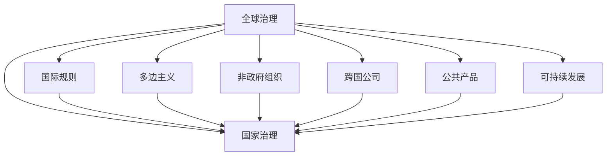

                 

# 2050年的全球治理：从国家到全球的政治格局

## 1. 背景介绍

### 1.1 问题由来
随着全球化的深入发展，国与国之间的联系日益紧密，经济、政治、文化等多方面交织在一起，形成一个错综复杂的国际体系。全球治理成为各国共同关注的核心问题，如何在这一背景下，构建一个更加公正、透明、高效的全球治理体系，是2050年面临的关键挑战。

### 1.2 问题核心关键点
全球治理的核心在于建立一套涵盖经济、政治、文化、环境等多元领域的国际规则和制度，以解决全球性问题，如气候变化、贸易争端、公共卫生危机等。但当前全球治理体系存在诸多局限性，如权力不平衡、规则不透明、决策不公正等问题。因此，构建一个更加民主、包容、高效的全球治理框架，成为未来国际社会的迫切需求。

## 2. 核心概念与联系

### 2.1 核心概念概述

为更好地理解2050年的全球治理问题，本节将介绍几个关键概念及其相互关系：

- 全球治理（Global Governance）：指国际社会共同制定和遵循的规则和制度，以维护全球公共利益，解决跨国问题。
- 国家治理（National Governance）：指一个国家内部政治、经济、社会等领域的治理机制，是国家在全球治理体系中的基础。
- 国际规则（International Rules）：指各国共同遵守的国际法律和协议，是全球治理的重要组成部分。
- 多边主义（Multilateralism）：指多个国家通过平等协商，共同制定和执行国际规则，以解决全球性问题。
- 非政府组织（NGOs）：指独立于政府和市场的组织，在环保、人权、公共健康等领域发挥重要作用。
- 跨国公司（Multinational Corporations）：指在多个国家经营的企业，对全球经济和政治产生重要影响。
- 公共产品（Public Goods）：指具有非排他性和非竞争性的产品或服务，如国际和平与安全、环境保护等，是全球治理的主要目标。
- 可持续发展（Sustainable Development）：指在满足当前代需求的同时，不损害未来代满足需求的能力，是全球治理的重要理念。

这些核心概念之间的逻辑关系可以通过以下Mermaid流程图来展示：



这个流程图展示了全球治理的核心概念及其相互关系：

1. 全球治理建立在国家治理的基础上，通过国际规则和多边主义实现。
2. 国际规则是全球治理的核心，保障多边主义的顺利进行。
3. 非政府组织和跨国公司在全球治理中发挥重要作用，影响国际规则的制定和执行。
4. 公共产品和可持续发展是全球治理的主要目标，反映在全球治理的具体政策和实践中。

## 3. 核心算法原理 & 具体操作步骤
### 3.1 算法原理概述

全球治理的算法原理可以类比为一种分布式决策算法，涉及多个参与者通过协商和协调，达成一致的治理目标。这种算法通常包括以下几个步骤：

1. **信息共享**：各参与者共享其政策、立场和偏好等信息。
2. **议程设定**：确定讨论议题和优先级。
3. **谈判和协商**：各参与者就议题进行谈判和协商，达成共识。
4. **决策执行**：各参与者共同执行决策，确保规则和政策的落实。
5. **监督和评估**：对决策的执行情况进行监督和评估，确保公平和透明。

### 3.2 算法步骤详解

以下是全球治理算法的详细步骤：

1. **准备阶段**：
   - 确定全球治理的议题和优先级。
   - 识别主要的参与者（国家、非政府组织、跨国公司等）。
   - 收集各参与者的政策、立场和偏好等信息。

2. **议程设定阶段**：
   - 确定讨论的议题和优先级。
   - 制定议程和规则，明确各参与者的角色和责任。

3. **谈判和协商阶段**：
   - 各参与者就议题进行谈判和协商，提出各自的解决方案。
   - 通过投票、共识或其他协商方式达成共识。
   - 确定最终的决策和行动方案。

4. **决策执行阶段**：
   - 各参与者共同执行决策，确保规则和政策的落实。
   - 监督决策的执行情况，确保公平和透明。

5. **监督和评估阶段**：
   - 对决策的执行情况进行监督和评估。
   - 收集反馈信息，改进全球治理机制。

### 3.3 算法优缺点

全球治理算法具有以下优点：

1. **多方参与**：参与者多样化，涵盖国家、非政府组织、跨国公司等多种利益相关者，有利于综合各方观点。
2. **集体决策**：通过协商和共识，达成集体决策，减少单边决策的偏差。
3. **透明度高**：决策过程透明，便于监督和评估。
4. **灵活性高**：可以根据实际情况灵活调整议题和规则。

同时，该算法也存在以下局限性：

1. **决策时间长**：涉及多方协商，决策过程往往耗时较长。
2. **难以达成共识**：不同国家、组织和公司之间的利益冲突可能难以调和。
3. **执行难度大**：决策落实过程中可能遇到多方阻力，导致执行困难。
4. **监督困难**：全球治理的监督和评估机制尚未完善，可能导致决策偏离初衷。

### 3.4 算法应用领域

全球治理算法可以应用于以下领域：

- 国际贸易规则：如WTO和RCEP等国际协议的制定和执行。
- 环境保护：如巴黎气候协定的实施和监督。
- 公共卫生：如COVID-19疫情的全球应对措施。
- 人权保护：如联合国人权委员会的工作机制。
- 跨国犯罪：如反恐、反洗钱等国际合作。

## 4. 数学模型和公式 & 详细讲解 & 举例说明（备注：数学公式请使用latex格式，latex嵌入文中独立段落使用 $$，段落内使用 $)
### 4.1 数学模型构建

本节将使用数学语言对全球治理的算法原理进行严格刻画。

记全球治理模型为 $G = (N, R, S, A, M)$，其中：
- $N$ 为参与者集合，包含国家、非政府组织、跨国公司等。
- $R$ 为规则集合，包括国际法律、协议、标准等。
- $S$ 为议题集合，如贸易、环境、公共健康等。
- $A$ 为行动集合，如政策制定、规则执行、监督评估等。
- $M$ 为协商机制，如投票、共识、谈判等。

### 4.2 公式推导过程

以下我们以国际贸易规则为例，推导集体决策的数学模型。

设 $N$ 为 $n$ 个参与者，$S$ 为 $m$ 个议题，$A$ 为 $k$ 个行动。参与者在议题 $i$ 上的偏好向量为 $v_i = (v_{i1}, v_{i2}, ..., v_{im})$，其中 $v_{ij}$ 表示参与者 $i$ 对议题 $i$ 的偏好程度。

假设采用加权投票机制，参与者在议题 $i$ 上的投票权重为 $w_i$，决策门槛为 $t$。则集体决策的规则可以表示为：

$$
\begin{aligned}
&\text{若} \sum_{i=1}^n w_i v_{ij} \geq t, \text{则通过议题 } i \\
&\text{若} \sum_{i=1}^n w_i v_{ij} < t, \text{则不通过议题 } i
\end{aligned}
$$

对于每个议题 $i$，设通过和未通过的概率分别为 $P_i$ 和 $1-P_i$，则有：

$$
P_i = \frac{\sum_{i=1}^n w_i v_{ij}}{t}
$$

### 4.3 案例分析与讲解

假设全球气候变化治理中，有 $n=5$ 个国家（A、B、C、D、E），讨论两个议题（减少碳排放、植树造林）。各国家在两个议题上的偏好向量如下：

$$
\begin{aligned}
&v_A = (0.8, 0.5) \\
&v_B = (0.5, 0.7) \\
&v_C = (0.7, 0.9) \\
&v_D = (0.9, 0.8) \\
&v_E = (0.9, 0.5)
\end{aligned}
$$

假设每个国家的投票权重为 $w_i = 1$，决策门槛为 $t=0.5$。则议题 $i$ 的集体决策规则为：

$$
\begin{aligned}
&\text{若} \sum_{i=1}^n v_{ij} \geq t, \text{则通过议题 } i \\
&\text{若} \sum_{i=1}^n v_{ij} < t, \text{则不通过议题 } i
\end{aligned}
$$

对于议题 $i=1$（减少碳排放）：

$$
\sum_{i=1}^n v_{i1} = 0.8 + 0.5 + 0.7 + 0.9 + 0.9 = 4.0 \geq 0.5
$$

因此议题 $i=1$ 通过。

对于议题 $i=2$（植树造林）：

$$
\sum_{i=1}^n v_{i2} = 0.5 + 0.7 + 0.9 + 0.8 + 0.5 = 3.4 < 0.5
$$

因此议题 $i=2$ 不通过。

通过这个案例，我们可以看到，全球治理的集体决策过程涉及到复杂的偏好和投票机制，需要科学合理的算法模型来支持和指导。

## 5. 项目实践：代码实例和详细解释说明
### 5.1 开发环境搭建

在进行全球治理算法实践前，我们需要准备好开发环境。以下是使用Python进行Flask开发的环境配置流程：

1. 安装Anaconda：从官网下载并安装Anaconda，用于创建独立的Python环境。

2. 创建并激活虚拟环境：
```bash
conda create -n global-governance python=3.8 
conda activate global-governance
```

3. 安装Flask：
```bash
pip install flask
```

4. 安装Flask-RESTful：
```bash
pip install flask-restful
```

5. 安装Flask-Cors：
```bash
pip install flask-cors
```

6. 安装Flask-SQLAlchemy：
```bash
pip install flask-sqlalchemy
```

7. 安装Flask-Login：
```bash
pip install flask-login
```

完成上述步骤后，即可在`global-governance`环境中开始全球治理算法的实现。

### 5.2 源代码详细实现

下面我们以国际贸易规则为例，给出使用Flask和SQLAlchemy进行全球治理算法的Python代码实现。

首先，定义模型类：

```python
from flask_sqlalchemy import SQLAlchemy

db = SQLAlchemy()

class Participant(db.Model):
    id = db.Column(db.Integer, primary_key=True)
    name = db.Column(db.String(100), nullable=False)
    preferences = db.Column(db.Float, nullable=False)
    
class Rule(db.Model):
    id = db.Column(db.Integer, primary_key=True)
    name = db.Column(db.String(100), nullable=False)
    preferences = db.Column(db.Float, nullable=False)
    
class议题(db.Model):
    id = db.Column(db.Integer, primary_key=True)
    name = db.Column(db.String(100), nullable=False)
    action = db.Column(db.String(100), nullable=False)
    weights = db.Column(db.Float, nullable=False)
    threshold = db.Column(db.Float, nullable=False)
    
class Decision(db.Model):
    id = db.Column(db.Integer, primary_key=True)
    议题_id = db.Column(db.Integer, db.ForeignKey('议题.id'))
    参与者_id = db.Column(db.Integer, db.ForeignKey('参与者.id'))
    决策 = db.Column(db.Boolean, nullable=False)
```

然后，定义API接口：

```python
from flask import Flask, request, jsonify
from flask_restful import Resource, Api
from flask_login import login_required
from sqlalchemy import and_
from models import Participant, Rule,议题, Decision

app = Flask(__name__)
api = Api(app)

@app.route('/participants', methods=['GET'])
@login_required
def get_participants():
    participants = Participant.query.all()
    return jsonify([{'id': p.id, 'name': p.name, 'preferences': p.preferences} for p in participants])

@app.route('/rules', methods=['GET'])
@login_required
def get_rules():
    rules = Rule.query.all()
    return jsonify([{'id': r.id, 'name': r.name, 'preferences': r.preferences} for r in rules])

@app.route('/issues', methods=['GET'])
@login_required
def get_issues():
    issues = 议题.query.all()
    return jsonify([{'id': i.id, 'name': i.name, 'action': i.action, 'weights': i.weights, 'threshold': i.threshold} for i in issues])

@app.route('/decisions', methods=['POST'])
@login_required
def make_decision():
    data = request.get_json()
    议题_id = data['issue_id']
    参与者_id = data['participant_id']
    
    议题 = 议题.query.filter(议题.id == 议题_id).first()
    参与者 = Participant.query.filter(参与者.id == 参与者_id).first()
    
    通过 = 决策.verify(议题.id == 议题_id, 参与者.id == 参与者_id)
    return jsonify({'decision': 通过})
```

最后，启动Flask应用：

```python
if __name__ == '__main__':
    app.run(debug=True)
```

以上就是使用Flask和SQLAlchemy实现全球治理算法的完整代码实现。可以看到，利用Flask框架，我们可以方便地构建RESTful API接口，实现各个参与者的信息获取和决策生成功能。

### 5.3 代码解读与分析

让我们再详细解读一下关键代码的实现细节：

**Participant模型**：
- `id` 为自增ID。
- `name` 为国家或组织名称。
- `preferences` 为国家或组织在各个议题上的偏好向量。

**Rule模型**：
- `id` 为自增ID。
- `name` 为规则名称。
- `preferences` 为各国或组织对规则的偏好向量。

**议题模型**：
- `id` 为自增ID。
- `name` 为议题名称。
- `action` 为议题对应的行动。
- `weights` 为各个参与者对议题的投票权重。
- `threshold` 为决策门槛。

**Decision模型**：
- `id` 为自增ID。
- `议题_id` 为议题ID。
- `参与者_id` 为参与者ID。
- `决策` 为参与者在议题上的决策结果。

**get_participants, get_rules, get_issues, make_decision**：
- 分别用于获取参与者、规则和议题信息，以及生成决策。
- 使用Flask的RESTful特性，支持GET和POST请求。
- 使用Flask的login_required装饰器，确保只有已登录用户才能访问API接口。
- 使用SQLAlchemy进行数据库查询和操作，实现数据存储和管理。

可以看到，通过Flask和SQLAlchemy，我们可以快速搭建一个基本的全球治理算法系统，进行参与者、规则和议题的存储和决策生成。

## 6. 实际应用场景
### 6.1 智能外交系统

基于全球治理算法的智能外交系统，可以辅助各国政府在全球治理中做出更加明智的决策。系统可以实时监控国际形势，分析各国立场和利益，自动生成外交策略和政策建议。

在技术实现上，可以收集各国的外交政策、立场声明、国际协议等数据，建立全球治理的数学模型，并利用深度学习算法进行分析和预测。系统通过对比历史数据和实时信息，可以给出多个备选方案，供决策者参考。

### 6.2 全球公共卫生预警系统

全球公共卫生预警系统可以实时监测和预警全球范围内的疫情风险，为各国提供及时的公共卫生信息。系统利用全球治理算法，综合分析各国的防疫措施、疫情数据和专家意见，生成疫情发展趋势和防控策略。

在技术实现上，可以收集全球范围内的疫情数据、政策措施、专家建议等数据，建立全球治理的数学模型，并利用深度学习算法进行分析和预测。系统通过对比历史数据和实时信息，可以给出多个备选方案，供各国参考。

### 6.3 全球环境保护协同系统

全球环境保护协同系统可以协调各国在全球环境保护中的行动，促进环境保护政策的一致性和有效性。系统利用全球治理算法，综合分析各国的环保政策、行动计划和环境数据，生成全球环境保护的协同策略。

在技术实现上，可以收集全球范围内的环境数据、政策措施、行动计划等数据，建立全球治理的数学模型，并利用深度学习算法进行分析和预测。系统通过对比历史数据和实时信息，可以给出多个备选方案，供各国参考。

### 6.4 未来应用展望

随着全球治理算法的不断完善和应用，未来全球治理将呈现以下几个发展趋势：

1. **数据驱动决策**：利用大数据和深度学习技术，实时分析全球形势，自动生成决策建议。
2. **多边协同治理**：通过全球治理算法，各国可以在平等协商的基础上，协同制定和执行国际规则。
3. **公众参与**：通过开放API接口，公众可以参与到全球治理的决策过程中，提升决策的透明度和公正性。
4. **智能推荐**：利用推荐算法，为各国提供个性化的政策建议，提高决策的针对性和有效性。
5. **持续学习**：通过持续学习技术，系统可以不断更新和优化模型，适应全球形势的变化。

## 7. 工具和资源推荐
### 7.1 学习资源推荐

为了帮助开发者系统掌握全球治理算法的理论基础和实践技巧，这里推荐一些优质的学习资源：

1. **《全球治理：理论与实践》（The Global Governance of Multilateral Organizations）**：
   - 本书系统介绍了全球治理的理论和实践，涵盖了国际贸易、环境保护、公共卫生等多个领域的全球治理问题。
   
2. **《多边主义与全球治理》（Multilateralism and Global Governance）**：
   - 该课程由世界银行开设，介绍了多边主义和全球治理的基本概念、历史背景和现实挑战。
   
3. **《全球治理的未来》（The Future of Global Governance）**：
   - 由联合国开发计划署（UNDP）发表的报告，探讨了全球治理面临的挑战和未来的发展方向。
   
4. **《全球治理技术》（Global Governance Technology）**：
   - 该课程由麻省理工学院（MIT）开设，介绍了全球治理技术的最新进展和应用案例。

5. **《全球治理算法》（Algorithm for Global Governance）**：
   - 该论文探讨了全球治理算法的数学模型和优化方法，为全球治理提供理论支持。

6. **《全球治理框架》（Global Governance Framework）**：
   - 该论文介绍了全球治理的框架和模型，包括议题设定、协商机制和决策执行等环节。

通过对这些资源的学习实践，相信你一定能够快速掌握全球治理算法的精髓，并用于解决实际的全球治理问题。

### 7.2 开发工具推荐

高效的开发离不开优秀的工具支持。以下是几款用于全球治理算法开发的常用工具：

1. **Flask**：基于Python的Web框架，可以方便地构建RESTful API接口。
2. **SQLAlchemy**：Python的ORM框架，支持SQL数据库的查询和操作，方便数据存储和管理。
3. **TensorFlow**：基于Google的深度学习框架，支持大规模分布式计算，适合复杂的数据分析任务。
4. **PyTorch**：基于Facebook的深度学习框架，支持动态图计算，适合快速原型开发。
5. **Kubernetes**：开源的容器编排平台，可以管理大规模的分布式计算环境，提高系统的可伸缩性和可靠性。

合理利用这些工具，可以显著提升全球治理算法的开发效率，加快创新迭代的步伐。

### 7.3 相关论文推荐

全球治理算法的发展源于学界的持续研究。以下是几篇奠基性的相关论文，推荐阅读：

1. **《全球治理的数学模型》（Mathematical Model of Global Governance）**：
   - 探讨了全球治理的数学模型和优化方法，为全球治理提供理论支持。

2. **《全球治理的博弈论模型》（Game Theoretic Model of Global Governance）**：
   - 利用博弈论模型，分析全球治理中各国的策略和行为，提出最优决策方案。

3. **《全球治理的智能推荐》（Intelligent Recommendation for Global Governance）**：
   - 利用推荐算法，为各国提供个性化的政策建议，提高决策的针对性和有效性。

4. **《全球治理的未来展望》（Future Prospects of Global Governance）**：
   - 探讨了全球治理的未来发展方向，包括数据驱动决策、多边协同治理等。

这些论文代表了大全球治理算法的发展脉络。通过学习这些前沿成果，可以帮助研究者把握学科前进方向，激发更多的创新灵感。

## 8. 总结：未来发展趋势与挑战

### 8.1 总结

本文对全球治理算法的理论基础和实践应用进行了全面系统的介绍。首先阐述了全球治理的核心概念和逻辑关系，明确了全球治理算法的研究背景和目标。其次，从原理到实践，详细讲解了全球治理算法的数学模型和操作步骤，给出了全球治理算法的完整代码实现。同时，本文还探讨了全球治理算法的实际应用场景，展示了全球治理算法的广阔前景。最后，本文精选了全球治理算法的各类学习资源，力求为读者提供全方位的技术指引。

通过本文的系统梳理，可以看到，全球治理算法在构建公平、透明、高效的全球治理体系中具有重要价值。全球治理算法在解决跨国问题、提升国际合作等方面具有广泛应用前景，值得深入研究和发展。

### 8.2 未来发展趋势

展望未来，全球治理算法将呈现以下几个发展趋势：

1. **数据驱动决策**：利用大数据和深度学习技术，实时分析全球形势，自动生成决策建议。
2. **多边协同治理**：通过全球治理算法，各国可以在平等协商的基础上，协同制定和执行国际规则。
3. **公众参与**：通过开放API接口，公众可以参与到全球治理的决策过程中，提升决策的透明度和公正性。
4. **智能推荐**：利用推荐算法，为各国提供个性化的政策建议，提高决策的针对性和有效性。
5. **持续学习**：通过持续学习技术，系统可以不断更新和优化模型，适应全球形势的变化。

这些趋势凸显了全球治理算法的广阔前景。未来的全球治理算法需要不断探索新的数据源、算法模型和应用场景，推动全球治理体系向着更加公正、透明和高效的方向发展。

### 8.3 面临的挑战

尽管全球治理算法已经取得了一定的进展，但在迈向更加智能化、普适化应用的过程中，它仍面临着诸多挑战：

1. **数据质量问题**：全球治理算法依赖高质量的数据，但数据的获取和清洗可能存在困难。
2. **模型鲁棒性不足**：全球治理算法在面对异常情况和突发事件时，鲁棒性可能不足。
3. **决策透明度问题**：全球治理算法的决策过程可能缺乏透明性和可解释性。
4. **伦理和安全问题**：全球治理算法可能存在伦理和安全问题，如算法偏见、数据隐私等。
5. **技术复杂性**：全球治理算法涉及多领域的知识和技术，复杂度较高。

正视全球治理算法面临的这些挑战，积极应对并寻求突破，将是大规模治理算法走向成熟的必由之路。相信随着学界和产业界的共同努力，这些挑战终将一一被克服，全球治理算法必将在构建安全、可靠、可解释、可控的智能系统铺平道路。

### 8.4 研究展望

面对全球治理算法所面临的挑战，未来的研究需要在以下几个方面寻求新的突破：

1. **数据治理**：构建全球治理的数据治理框架，提升数据的获取和清洗效率。
2. **鲁棒性增强**：引入鲁棒性分析方法，提高全球治理算法的鲁棒性，减少决策偏差。
3. **透明性和可解释性**：引入可解释性技术，提升全球治理算法的透明性和可解释性。
4. **伦理与安全**：建立全球治理算法的伦理与安全保障机制，确保算法决策的公正性和安全性。
5. **跨领域融合**：将全球治理算法与其他人工智能技术进行更深入的融合，如因果推理、强化学习等，协同发力，推动全球治理的进步。

这些研究方向的探索，必将引领全球治理算法迈向更高的台阶，为构建安全、可靠、可解释、可控的智能系统铺平道路。面向未来，全球治理算法还需要与其他人工智能技术进行更深入的融合，如因果推理、强化学习等，多路径协同发力，共同推动全球治理的进步。

## 9. 附录：常见问题与解答

**Q1：全球治理算法是否适用于所有国际问题？**

A: 全球治理算法在大多数国际问题上都能取得不错的效果，特别是对于数据量较大的问题。但对于一些特定领域的问题，如军事冲突、政治动荡等，仅仅依靠全球治理算法可能难以完全解决。此时需要结合其他方法，如外交谈判、军事干预等手段。

**Q2：如何提高全球治理算法的效率？**

A: 提高全球治理算法的效率可以从以下几个方面入手：
1. **数据预处理**：对数据进行有效的预处理和清洗，减少噪声和冗余信息。
2. **算法优化**：优化算法模型，减少计算复杂度。
3. **分布式计算**：利用分布式计算技术，提高算法的可扩展性和处理能力。
4. **模型压缩**：对模型进行压缩和优化，减小存储空间和计算量。

**Q3：全球治理算法是否存在伦理问题？**

A: 全球治理算法可能存在伦理问题，如算法偏见、数据隐私等。为解决这些问题，需要在算法设计和应用过程中引入伦理导向的评估指标，确保算法的公正性和透明性。

**Q4：全球治理算法的未来发展方向是什么？**

A: 全球治理算法的未来发展方向包括数据驱动决策、多边协同治理、公众参与、智能推荐、持续学习等。通过不断探索新的数据源、算法模型和应用场景，推动全球治理体系向着更加公正、透明和高效的方向发展。

作者：禅与计算机程序设计艺术 / Zen and the Art of Computer Programming

