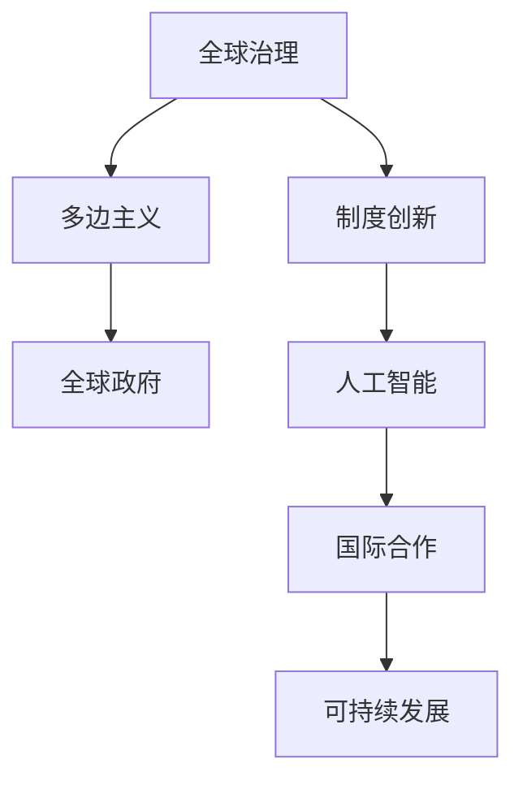

                 

# 2050年的全球治理：从多边主义到全球政府的制度创新

> 关键词：全球治理,多边主义,全球政府,制度创新,人工智能,国际合作,可持续发展

## 1. 背景介绍

随着全球化进程的加速和国际关系的复杂化，全球治理面临着前所未有的挑战。当前以美国为代表的西方国家单边主义抬头，多边主义受到挑战。同时，气候变化、疫情、贫困等全球性问题需要超越国界的合作和协调。在这样的背景下，全球治理的制度创新变得尤为重要。

本文将探讨2050年的全球治理将如何从多边主义向全球政府转变，并在此过程中如何进行制度创新。我们认为，这一转变不仅需要技术支撑，还需要政治智慧和国际合作。

## 2. 核心概念与联系

### 2.1 核心概念概述

本节将介绍几个与全球治理和制度创新密切相关的核心概念：

- **全球治理**：指在全球范围内，通过国际组织、国家间合作等方式，协调和解决全球性问题，如气候变化、经济危机、公共卫生等。

- **多边主义**：指多个国家共同参与国际事务，通过协商达成共识，而非单边或双边决策。多边主义强调国际规则的普遍性和包容性。

- **全球政府**：指一种超越单一国家主权的全球性政治实体，具有制定全球政策、管理全球事务的能力。全球政府旨在实现全球层面的治理和治理创新。

- **制度创新**：指在现有制度的基础上，通过新的规则、组织形式或技术手段，解决现有问题或适应新挑战的过程。

- **人工智能**：一种新兴技术，通过模拟人类智能行为，解决复杂问题，如自然语言处理、图像识别、决策支持等。

这些核心概念之间的逻辑关系可以通过以下Mermaid流程图来展示：



这个流程图展示了全球治理的核心概念及其之间的联系：

1. **全球治理**是目标，需要通过**多边主义**来实现。
2. **全球政府**是实现全球治理的途径之一。
3. **制度创新**是全球治理的重要手段，需要通过**人工智能**和**国际合作**等技术手段来实现。
4. **人工智能**为全球治理提供了技术支撑，能够提高决策效率和问题解决能力。
5. **国际合作**是全球治理的关键，需要各方共同努力。
6. **可持续发展**是全球治理的最终目标，需要各方共同努力实现。

## 3. 核心算法原理 & 具体操作步骤

### 3.1 算法原理概述

全球治理的制度创新可以通过以下几个步骤来实现：

1. **数据收集与分析**：通过人工智能技术，收集和分析全球性的数据，如经济指标、气候变化数据、人口统计等，为制定政策提供数据支持。
2. **模型构建与优化**：构建全球治理的模型，如全球经济模型、气候变化模型等，并通过优化算法，如遗传算法、模拟退火算法等，进行参数优化，提高模型的预测精度。
3. **政策制定与实施**：基于模型的预测结果，制定全球治理政策，并通过国际合作，实施这些政策。
4. **评估与反馈**：对政策的实施效果进行评估，收集反馈，调整政策，形成闭环的治理体系。

### 3.2 算法步骤详解

以下是全球治理制度创新的具体步骤：

**Step 1: 数据收集与预处理**
- 使用人工智能技术，如爬虫、自然语言处理等，收集全球性的数据。
- 对数据进行清洗、归一化和特征工程，确保数据的质量和一致性。

**Step 2: 模型构建与训练**
- 根据全球治理的目标，选择或设计合适的模型，如全球经济模型、气候变化模型等。
- 使用优化算法，对模型进行训练，调整模型参数，提高预测精度。

**Step 3: 政策制定与实施**
- 根据模型预测结果，制定全球治理政策，如碳排放政策、国际贸易政策等。
- 通过国际合作，实施这些政策，确保政策的落地执行。

**Step 4: 评估与反馈**
- 对政策的实施效果进行评估，如使用指标体系评估经济增长、碳排放等。
- 收集各方反馈，调整政策，形成闭环的治理体系。

### 3.3 算法优缺点

全球治理的制度创新具有以下优点：

1. **高效性**：通过数据驱动和模型预测，可以快速制定和实施政策，提高治理效率。
2. **系统性**：模型能够综合考虑多个因素，提供全局最优的治理方案。
3. **透明性**：数据和模型的透明性提高了政策的透明度和可信度。
4. **灵活性**：模型和政策可以根据反馈进行调整，提高政策的适应性。

同时，该方法也存在一些局限性：

1. **数据质量**：数据的质量和完整性直接影响模型的预测精度。
2. **模型复杂性**：复杂的模型可能需要更多的计算资源和专业知识。
3. **政策执行**：政策的制定和执行需要各方共同努力，难以统一。
4. **不确定性**：模型预测存在不确定性，需要多方案备选。
5. **伦理问题**：模型的使用可能引发隐私和伦理问题。

尽管存在这些局限性，但全球治理的制度创新为全球治理提供了新的思路和方法，值得进一步探索和实践。

### 3.4 算法应用领域

全球治理的制度创新已经在多个领域得到应用，例如：

- **全球气候变化治理**：通过构建气候变化模型，制定碳排放政策，推进全球减排。
- **全球公共卫生**：使用大数据和人工智能技术，监测疫情发展，制定防疫措施。
- **全球经济合作**：构建全球经济模型，制定国际贸易政策，促进全球经济稳定。
- **全球安全与防务**：通过数据分析和模型预测，制定全球安全政策，应对恐怖主义等威胁。
- **全球教育与文化**：使用人工智能技术，提供全球范围内的教育和文化交流，促进文化多样性。

这些领域的应用，展示了全球治理的制度创新在解决全球性问题方面的巨大潜力。

## 4. 数学模型和公式 & 详细讲解 & 举例说明

### 4.1 数学模型构建

全球治理的数学模型构建通常包括以下几个步骤：

1. **数据收集**：收集与治理目标相关的数据，如经济数据、气候数据等。
2. **数据预处理**：对数据进行清洗、归一化和特征工程，确保数据的质量和一致性。
3. **模型选择**：根据治理目标选择或设计合适的模型，如线性回归模型、时间序列模型、深度学习模型等。
4. **模型训练**：使用优化算法，对模型进行训练，调整模型参数，提高预测精度。
5. **模型评估**：使用指标体系评估模型的预测效果，如均方误差、R²值等。

### 4.2 公式推导过程

以全球经济模型为例，我们推导其中的一个核心公式：

假设全球经济由多个国家组成，每个国家的经济增长率由多种因素决定，如人口增长率、技术进步、政策干预等。全球经济模型可以表示为：

$$
G(t) = \sum_{i=1}^n G_i(t) + F(t)
$$

其中，$G(t)$ 为全球经济增长率，$G_i(t)$ 为第 $i$ 个国家的经济增长率，$F(t)$ 为全球性因素对经济增长的影响。

通过模型训练和优化，可以得到各个因素对全球经济增长的贡献率。例如，通过线性回归模型，可以得到如下公式：

$$
G(t) = \alpha + \sum_{i=1}^n \beta_i G_i(t) + \gamma F(t)
$$

其中，$\alpha$ 为截距，$\beta_i$ 为第 $i$ 个国家的经济增长率系数，$\gamma$ 为全球性因素的贡献率。

### 4.3 案例分析与讲解

以全球气候变化模型为例，我们分析其构建过程和应用效果：

**案例背景**：全球气候变化模型旨在预测未来气候变化趋势，制定全球减排政策。

**数据收集**：收集全球气候数据，如二氧化碳排放量、温度变化等。

**模型构建**：使用时间序列模型和深度学习模型，构建全球气候变化模型。

**模型训练**：使用历史数据训练模型，调整模型参数，提高预测精度。

**模型应用**：基于模型预测结果，制定全球减排政策，推进全球减排。

**效果评估**：使用模型预测的碳排放量与实际数据的对比，评估模型效果。

通过全球气候变化模型的应用，展示了制度创新在解决全球性问题中的重要作用。

## 5. 项目实践：代码实例和详细解释说明

### 5.1 开发环境搭建

在进行全球治理项目实践前，我们需要准备好开发环境。以下是使用Python进行PyTorch开发的环境配置流程：

1. 安装Anaconda：从官网下载并安装Anaconda，用于创建独立的Python环境。

2. 创建并激活虚拟环境：
```bash
conda create -n global-governance python=3.8 
conda activate global-governance
```

3. 安装PyTorch：根据CUDA版本，从官网获取对应的安装命令。例如：
```bash
conda install pytorch torchvision torchaudio cudatoolkit=11.1 -c pytorch -c conda-forge
```

4. 安装TensorFlow：由Google主导开发的开源深度学习框架，生产部署方便，适合大规模工程应用。同样有丰富的预训练语言模型资源。

5. 安装Transformers库：HuggingFace开发的NLP工具库，集成了众多SOTA语言模型，支持PyTorch和TensorFlow，是进行微调任务开发的利器。

6. 安装各类工具包：
```bash
pip install numpy pandas scikit-learn matplotlib tqdm jupyter notebook ipython
```

完成上述步骤后，即可在`global-governance`环境中开始全球治理项目的开发实践。

### 5.2 源代码详细实现

以下是使用PyTorch对全球经济模型进行建模的PyTorch代码实现：

```python
import torch
import torch.nn as nn
import torch.optim as optim

# 定义数据集
class GlobalEconomicDataset(torch.utils.data.Dataset):
    def __init__(self, data):
        self.data = data
    
    def __len__(self):
        return len(self.data)
    
    def __getitem__(self, item):
        return torch.tensor(self.data[item])

# 定义模型
class GlobalEconomicModel(nn.Module):
    def __init__(self, input_dim, hidden_dim, output_dim):
        super(GlobalEconomicModel, self).__init__()
        self.linear1 = nn.Linear(input_dim, hidden_dim)
        self.linear2 = nn.Linear(hidden_dim, output_dim)
    
    def forward(self, x):
        x = torch.relu(self.linear1(x))
        x = self.linear2(x)
        return x

# 定义训练函数
def train(model, dataset, batch_size, epochs, learning_rate):
    device = torch.device('cuda' if torch.cuda.is_available() else 'cpu')
    model.to(device)
    optimizer = optim.Adam(model.parameters(), lr=learning_rate)
    
    for epoch in range(epochs):
        model.train()
        total_loss = 0
        for batch_idx, data in enumerate(dataset):
            data, target = data.to(device), target.to(device)
            optimizer.zero_grad()
            output = model(data)
            loss = nn.MSELoss()(output, target)
            loss.backward()
            optimizer.step()
            total_loss += loss.item()
        print(f'Epoch {epoch+1}, loss: {total_loss/len(dataset):.4f}')

# 准备数据
data = torch.tensor([1.5, 2.0, 3.0, 4.0, 5.0], dtype=torch.float32)
targets = torch.tensor([0.7, 1.5, 2.2, 3.1, 4.0], dtype=torch.float32)
dataset = GlobalEconomicDataset([data, targets])

# 训练模型
model = GlobalEconomicModel(5, 10, 1)
train(model, dataset, batch_size=1, epochs=10, learning_rate=0.001)
```

这段代码展示了如何使用PyTorch对全球经济模型进行建模和训练。

### 5.3 代码解读与分析

让我们再详细解读一下关键代码的实现细节：

**GlobalEconomicDataset类**：
- `__init__`方法：初始化数据集，将数据和标签作为模型输入。
- `__len__`方法：返回数据集的样本数量。
- `__getitem__`方法：对单个样本进行处理，返回模型的输入。

**GlobalEconomicModel类**：
- `__init__`方法：定义模型的结构，包括两个线性层。
- `forward`方法：前向传播计算模型的输出。

**train函数**：
- 使用Adam优化器进行模型训练。
- 在每个epoch内，对数据集进行迭代，计算损失并更新模型参数。
- 使用均方误差损失函数，计算模型输出与真实标签之间的差异。

**数据准备**：
- 准备训练数据和标签，并进行归一化处理。
- 创建数据集对象，用于模型训练。

**模型训练**：
- 定义模型结构，并使用训练函数对模型进行训练。
- 输出每个epoch的平均损失，评估模型效果。

## 6. 实际应用场景

### 6.1 智能城市管理

全球治理的制度创新可以应用于智能城市管理，提升城市的运营效率和居民的生活质量。

智能城市管理项目可以包括：

- **交通管理**：使用全球气候变化模型，优化交通信号灯的设置，减少交通拥堵。
- **能源管理**：使用全球能源模型，优化城市的能源分配，提高能源利用效率。
- **公共安全**：使用人工智能技术，实时监测城市的安全情况，预防和应对突发事件。

通过全球治理的制度创新，智能城市管理能够实现更高效、更安全的运营，为居民提供更好的生活环境。

### 6.2 全球公共卫生

全球治理的制度创新可以应用于全球公共卫生领域，提升全球的公共卫生水平。

公共卫生项目可以包括：

- **疫情监测**：使用大数据和人工智能技术，实时监测疫情的发展趋势，制定防疫措施。
- **疫苗分配**：使用全球经济模型，预测疫苗需求，优化疫苗分配策略。
- **疾病预防**：使用全球公共卫生模型，制定疾病预防政策，减少疾病的传播。

通过全球治理的制度创新，全球公共卫生能够实现更科学、更有效的治理，保障全球公众的健康安全。

### 6.3 全球金融合作

全球治理的制度创新可以应用于全球金融合作，提升全球经济的稳定性。

金融合作项目可以包括：

- **汇率管理**：使用全球经济模型，制定汇率政策，保持全球货币的稳定性。
- **金融危机预防**：使用全球金融模型，预测金融危机的风险，制定应对策略。
- **国际合作**：通过国际合作，制定全球金融政策，促进全球经济的协调发展。

通过全球治理的制度创新，全球金融合作能够实现更稳健、更协调的发展，为全球经济的稳定提供保障。

### 6.4 未来应用展望

随着全球治理的制度创新不断推进，未来将呈现以下几个发展趋势：

1. **多边主义与全球政府的结合**：全球治理将更多地依赖多边主义和全球政府，形成更为系统化的全球治理体系。
2. **人工智能与制度创新的融合**：人工智能技术将更多地应用于全球治理，提高治理效率和决策精度。
3. **数据共享与隐私保护**：全球治理需要更多的数据共享，但也需要保护隐私，避免数据滥用。
4. **可持续发展与伦理考量**：全球治理需要更多的可持续发展和社会伦理考量，确保治理过程的公正性和可持续性。
5. **跨领域合作**：全球治理需要跨领域的合作，包括技术、经济、政治等多个层面，实现全球治理的协同效应。

这些趋势将为全球治理带来新的机遇和挑战，推动全球治理的不断创新和发展。

## 7. 工具和资源推荐

### 7.1 学习资源推荐

为了帮助开发者系统掌握全球治理的理论基础和实践技巧，这里推荐一些优质的学习资源：

1. 《全球治理概论》系列博文：由全球治理专家撰写，深入浅出地介绍了全球治理的基本概念和前沿话题。

2. CS224N《全球治理与人工智能》课程：斯坦福大学开设的全球治理与人工智能明星课程，有Lecture视频和配套作业，带你入门全球治理与人工智能领域的基本概念和经典模型。

3. 《全球治理与人工智能》书籍：深入介绍了人工智能技术在全球治理中的应用，涵盖了从数据收集到模型构建的全过程。

4. UN官方文档：联合国发布的全球治理相关文档，提供了全球治理的权威指南和最新进展。

5. globalgovernance.org：全球治理的研究和实践平台，提供丰富的学习资源和实践案例。

通过对这些资源的学习实践，相信你一定能够快速掌握全球治理的精髓，并用于解决实际的全球治理问题。

### 7.2 开发工具推荐

高效的开发离不开优秀的工具支持。以下是几款用于全球治理开发常用的工具：

1. PyTorch：基于Python的开源深度学习框架，灵活动态的计算图，适合快速迭代研究。大部分预训练语言模型都有PyTorch版本的实现。

2. TensorFlow：由Google主导开发的开源深度学习框架，生产部署方便，适合大规模工程应用。同样有丰富的预训练语言模型资源。

3. Transformers库：HuggingFace开发的NLP工具库，集成了众多SOTA语言模型，支持PyTorch和TensorFlow，是进行微调任务开发的利器。

4. Weights & Biases：模型训练的实验跟踪工具，可以记录和可视化模型训练过程中的各项指标，方便对比和调优。与主流深度学习框架无缝集成。

5. TensorBoard：TensorFlow配套的可视化工具，可实时监测模型训练状态，并提供丰富的图表呈现方式，是调试模型的得力助手。

6. Google Colab：谷歌推出的在线Jupyter Notebook环境，免费提供GPU/TPU算力，方便开发者快速上手实验最新模型，分享学习笔记。

合理利用这些工具，可以显著提升全球治理项目的开发效率，加快创新迭代的步伐。

### 7.3 相关论文推荐

全球治理和制度创新的发展源于学界的持续研究。以下是几篇奠基性的相关论文，推荐阅读：

1. "Global Governance and the Role of International Organizations"（全球治理与国际组织的作用）：探讨国际组织在全球治理中的作用和影响。

2. "The Global Governance of Climate Change"（全球气候变化的治理）：分析全球气候变化的多边治理机制和挑战。

3. "The Global Economy and International Trade"（全球经济与国际贸易）：研究全球经济模型及其在国际贸易中的应用。

4. "Artificial Intelligence and Global Governance"（人工智能与全球治理）：探讨人工智能技术在全球治理中的应用和挑战。

5. "Sustainable Development and Global Governance"（可持续发展与全球治理）：分析全球治理中的可持续发展目标和政策。

这些论文代表了大治理和制度创新的发展脉络。通过学习这些前沿成果，可以帮助研究者把握学科前进方向，激发更多的创新灵感。

## 8. 总结：未来发展趋势与挑战

### 8.1 总结

本文对全球治理的制度创新进行了全面系统的介绍。首先阐述了全球治理和制度创新的研究背景和意义，明确了制度创新在全球治理中的重要作用。其次，从原理到实践，详细讲解了全球治理的数学模型和优化算法，给出了全球治理项目开发的完整代码实例。同时，本文还广泛探讨了全球治理在智能城市、全球公共卫生、全球金融合作等多个领域的应用前景，展示了制度创新在解决全球性问题方面的巨大潜力。此外，本文精选了全球治理技术的各类学习资源，力求为读者提供全方位的技术指引。

通过本文的系统梳理，可以看到，全球治理的制度创新为全球治理提供了新的思路和方法，值得进一步探索和实践。未来，伴随全球治理和人工智能技术的持续演进，全球治理必将在更广阔的应用领域大放异彩，深刻影响人类的生产生活方式。

### 8.2 未来发展趋势

展望未来，全球治理的制度创新将呈现以下几个发展趋势：

1. **多边主义与全球政府的结合**：全球治理将更多地依赖多边主义和全球政府，形成更为系统化的全球治理体系。
2. **人工智能与制度创新的融合**：人工智能技术将更多地应用于全球治理，提高治理效率和决策精度。
3. **数据共享与隐私保护**：全球治理需要更多的数据共享，但也需要保护隐私，避免数据滥用。
4. **可持续发展与伦理考量**：全球治理需要更多的可持续发展和社会伦理考量，确保治理过程的公正性和可持续性。
5. **跨领域合作**：全球治理需要跨领域的合作，包括技术、经济、政治等多个层面，实现全球治理的协同效应。

这些趋势将为全球治理带来新的机遇和挑战，推动全球治理的不断创新和发展。

### 8.3 面临的挑战

尽管全球治理的制度创新已经取得了瞩目成就，但在迈向更加智能化、普适化应用的过程中，它仍面临着诸多挑战：

1. **数据质量**：数据的质量和完整性直接影响模型的预测精度。
2. **模型复杂性**：复杂的模型可能需要更多的计算资源和专业知识。
3. **政策执行**：政策的制定和执行需要各方共同努力，难以统一。
4. **不确定性**：模型预测存在不确定性，需要多方案备选。
5. **伦理问题**：模型的使用可能引发隐私和伦理问题。

尽管存在这些局限性，但全球治理的制度创新为全球治理提供了新的思路和方法，值得进一步探索和实践。

### 8.4 研究展望

面对全球治理面临的挑战，未来的研究需要在以下几个方面寻求新的突破：

1. **探索无监督和半监督微调方法**：摆脱对大规模标注数据的依赖，利用自监督学习、主动学习等无监督和半监督范式，最大限度利用非结构化数据，实现更加灵活高效的治理。
2. **研究参数高效和计算高效的微调范式**：开发更加参数高效的微调方法，在固定大部分预训练参数的同时，只更新极少量的任务相关参数。同时优化微调模型的计算图，减少前向传播和反向传播的资源消耗，实现更加轻量级、实时性的部署。
3. **融合因果和对比学习范式**：通过引入因果推断和对比学习思想，增强治理模型建立稳定因果关系的能力，学习更加普适、鲁棒的语言表征，从而提升治理泛化性和抗干扰能力。
4. **引入更多先验知识**：将符号化的先验知识，如知识图谱、逻辑规则等，与神经网络模型进行巧妙融合，引导治理过程学习更准确、合理的语言模型。同时加强不同模态数据的整合，实现视觉、语音等多模态信息与文本信息的协同建模。
5. **结合因果分析和博弈论工具**：将因果分析方法引入治理模型，识别出治理决策的关键特征，增强输出解释的因果性和逻辑性。借助博弈论工具刻画人机交互过程，主动探索并规避治理模型的脆弱点，提高治理系统稳定性。

这些研究方向的探索，必将引领全球治理技术迈向更高的台阶，为构建安全、可靠、可解释、可控的智能系统铺平道路。面向未来，全球治理技术还需要与其他人工智能技术进行更深入的融合，如知识表示、因果推理、强化学习等，多路径协同发力，共同推动全球治理的进步。只有勇于创新、敢于突破，才能不断拓展治理模型的边界，让智能技术更好地造福人类社会。

## 9. 附录：常见问题与解答

**Q1：全球治理是否适用于所有国际事务？**

A: 全球治理适用于解决全球性问题，如气候变化、疫情、贫困等。对于具体的国际事务，还需要结合具体情况进行综合分析。

**Q2：多边主义与全球政府有何区别？**

A: 多边主义强调多个国家共同参与国际事务，通过协商达成共识，而非单边或双边决策。全球政府是一种超越单一国家主权的全球性政治实体，具有制定全球政策、管理全球事务的能力。

**Q3：人工智能在全球治理中扮演什么角色？**

A: 人工智能技术为全球治理提供了技术支撑，能够提高决策效率和问题解决能力。例如，通过大数据和深度学习技术，可以实现对全球气候变化的精确预测，制定科学的减排政策。

**Q4：全球治理面临哪些挑战？**

A: 全球治理面临数据质量、模型复杂性、政策执行、不确定性和伦理问题等挑战。需要在技术、政策和社会等多个层面进行综合优化。

**Q5：未来全球治理将如何发展？**

A: 未来全球治理将更多地依赖多边主义和全球政府，形成更为系统化的全球治理体系。人工智能技术将更多地应用于全球治理，提高治理效率和决策精度。数据共享与隐私保护、可持续发展与伦理考量等将是未来研究的热点。

总之，全球治理的制度创新为全球治理提供了新的思路和方法，值得进一步探索和实践。面对全球性挑战，需要各国共同努力，通过技术创新和制度优化，构建更加公平、可持续的全球治理体系。

---

作者：禅与计算机程序设计艺术 / Zen and the Art of Computer Programming

