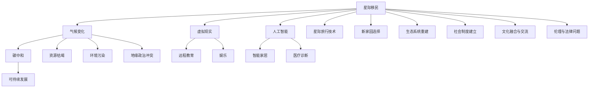

                 

# 2050年的全球移民：从气候难民到星际移民的人类新家园

> 关键词：气候变化, 星际移民, 碳中和, 虚拟现实, 人工智能, 新家园, 技术合作, 全球治理

## 1. 背景介绍

### 1.1 问题由来

2050年，全球人口预计将突破90亿大关，人类文明正面临前所未有的挑战。气候变化、资源枯竭、环境污染、地缘政治冲突等众多因素，正在深刻影响着人类的生存与发展。面对如此严峻的现实，全球智慧结晶出一个令人激动的共识：人类必须寻找一个全新的家园，一个能够适应未来挑战、确保物种生存和繁衍的地方。

为此，科学家和工程师们提出了“星际移民”这一壮志凌云的构想。通过建立星际殖民地，将一部分人类从地球迁移到适宜的星球上，人类文明得以延续和进步。这一过程将涉及广泛的技术领域，包括但不限于航天工程、能源技术、生物医学、人工智能、虚拟现实等。本文将重点探讨这一宏伟计划的核心技术支持与实际应用。

### 1.2 问题核心关键点

星际移民的可行性取决于多个关键点，包括但不限于：

- 星际旅行的技术突破：如何高效、安全地将人类送达新家园？
- 新家园的选择：哪个星球最适合人类居住？
- 生态系统的重建：如何在新星球上重建宜居的生态环境？
- 社会制度的建立：如何在新家园上建立合理且有效的社会治理机制？
- 文化融合与交流：如何促进新家园上不同种族、文化背景人群的融合？
- 伦理与法律问题：星际移民过程中如何保障人权、避免伦理冲突？

## 2. 核心概念与联系

### 2.1 核心概念概述

- **星际移民**：指将一部分人类从地球迁移到其他星球居住的过程，旨在解决地球资源环境压力，保护人类文明。
- **气候变化**：指地球气候系统长期且不规则的变化，包括全球气温升高、极端天气频发等现象，主要是由温室气体排放引起。
- **碳中和**：指通过减少碳排放或吸收二氧化碳，实现净零排放，通常用于描述可持续发展和环境保护。
- **虚拟现实(VR)**：通过计算机技术和传感器，模拟用户身处某一虚拟环境中的体验，常用于远程教育、娱乐等领域。
- **人工智能(AI)**：一种模拟人类智能行为的计算机程序，能够进行自主学习和决策，广泛应用于智能家居、医疗诊断等领域。

这些核心概念构成了星际移民的技术基础和应用场景，彼此之间有着密切的联系。

### 2.2 核心概念原理和架构的 Mermaid 流程图



## 3. 核心算法原理 & 具体操作步骤

### 3.1 算法原理概述

星际移民的核心算法原理在于对不同技术领域的整合和优化，主要包括以下几个方面：

- **星际旅行技术**：利用航天工程原理，设计高效、安全的太空运输系统，包括火箭推进、星际飞船、生命保障系统等。
- **新家园选择**：通过遥感、数据分析等技术，筛选出适宜的星球作为新家园。
- **生态系统重建**：采用生物工程、环境工程等技术，构建适宜的人类生存环境。
- **社会制度建立**：利用社会学、政治学等理论，制定合理、高效的新家园治理机制。
- **文化融合与交流**：运用人工智能和虚拟现实技术，促进不同文化背景人群的交流和融合。
- **伦理与法律问题**：通过法律、伦理学的研究，制定保障星际移民过程中人权和伦理的法律法规。

### 3.2 算法步骤详解

#### 3.2.1 星际旅行技术的实现步骤

1. **航天器设计**：
   - 确定飞船结构与布局。
   - 设计高效推进系统。
   - 配置生命保障系统和生态循环系统。

2. **发射计划**：
   - 确定发射窗口和航线。
   - 实施航天器的组装与测试。
   - 执行发射任务，将航天器送入太空。

3. **星际航行**：
   - 监控航天器的状态，调整推进系统。
   - 处理可能出现的故障与突发事件。
   - 到达目标星球后，执行着陆和对接操作。

#### 3.2.2 新家园的选择步骤

1. **目标星球筛选**：
   - 确定潜在目标星球的候选列表。
   - 使用遥感技术探测目标星球的地质、气候、大气等条件。
   - 分析目标星球的资源分布、适宜人类居住的区域。

2. **实地考察**：
   - 设计无人探测器，对目标星球进行深入探测。
   - 收集星球的地形、地貌、地质结构等数据。
   - 评估星球的环境稳定性和安全性。

3. **决策分析**：
   - 综合评估目标星球的各项指标。
   - 确定最适合人类居住的目标星球。
   - 制定星际迁移的详细计划和方案。

#### 3.2.3 生态系统重建的步骤

1. **生态系统设计**：
   - 制定生态系统重建的总体规划。
   - 设计适宜的生态圈和生物圈。
   - 制定生态恢复的详细计划。

2. **环境工程实施**：
   - 进行土壤、水源的采集与处理。
   - 建设温室、水循环系统等基础设施。
   - 引入适宜的生物种群，进行生态恢复。

3. **监测与调整**：
   - 使用传感器和监控系统，监测生态系统的各项指标。
   - 根据监测结果，调整生态系统管理策略。
   - 确保生态系统稳定，支持人类居住。

#### 3.2.4 社会制度建立的步骤

1. **治理机制设计**：
   - 确定新家园的治理模式与原则。
   - 设计高效的管理和监督机制。
   - 制定法律法规，保障人权与伦理。

2. **社会组织建设**：
   - 设立政府机构、企业、社会团体等组织。
   - 制定组织间的合作协议与协调机制。
   - 建立社会福利与保障体系。

3. **公共事务管理**：
   - 管理资源分配、环境保护、社会安全等公共事务。
   - 开展公民教育，提高社会文明水平。
   - 评估治理效果，不断改进与优化。

#### 3.2.5 文化融合与交流的步骤

1. **文化交流平台建设**：
   - 建立多语言、多文化的交流平台。
   - 设立文化交流中心、图书馆等。
   - 举办文化节、文艺活动等。

2. **教育与培训**：
   - 开展多元文化教育，提高社会包容性。
   - 提供语言学习、职业技能培训等。
   - 开展跨文化交流项目，增进相互理解。

3. **文化创新与融合**：
   - 鼓励文化创新，促进新文化形态的形成。
   - 推广优秀的文化作品，提升文化认同感。
   - 搭建多元文化社区，促进文化融合。

#### 3.2.6 伦理与法律问题的处理

1. **伦理道德研究**：
   - 研究星际移民的伦理问题，制定伦理指南。
   - 保护人权，尊重文化多样性。
   - 避免生态破坏与伦理冲突。

2. **法律法规制定**：
   - 制定星际移民的法律法规。
   - 明确权利与义务，保障法律公正。
   - 设立争议解决机制，维护社会稳定。

### 3.3 算法优缺点

#### 3.3.1 星际旅行技术的优点与缺点

**优点**：
- 高效能：能够快速、安全地将人类送达新家园。
- 可定制性：可以根据不同的需求设计不同类型的飞船。
- 自动化程度高：自动化控制技术减少了人为操作风险。

**缺点**：
- 成本高：开发与实施成本较高，需要大量的财政支持。
- 风险大：存在技术故障、环境变化等不可预测的风险。
- 复杂度高：涉及的系统和组件众多，管理和维护复杂。

#### 3.3.2 新家园选择的优点与缺点

**优点**：
- 精度高：通过遥感和实地考察，可以精确评估目标星球适宜性。
- 系统化：采用多学科、多方法综合评估。
- 动态调整：可实时更新评估结果，灵活调整迁移计划。

**缺点**：
- 数据采集难度大：遥感与实地考察需要高精度的技术支持。
- 时间消耗大：从筛选到实地考察，过程耗时长。
- 评估复杂：需要综合考虑多种因素，评估复杂度高。

#### 3.3.3 生态系统重建的优点与缺点

**优点**：
- 可控性高：通过精确设计和管理，生态系统重建效果可控。
- 适应性强：可根据新家园环境调整生态圈设计。
- 长期效益高：重建生态系统可实现可持续发展。

**缺点**：
- 技术要求高：需要高水平的技术与科学知识。
- 成本高：生态重建项目资金需求量大。
- 失败风险高：生态系统重建复杂，失败风险高。

#### 3.3.4 社会制度建立的优点与缺点

**优点**：
- 系统性：制度设计全面考虑社会各个方面。
- 公正性：保障人权和伦理，制度公正。
- 持续性：社会制度可长期稳定运行。

**缺点**：
- 复杂度高：制度设计复杂，涉及面广。
- 实施难度大：需要高度的协调和合作。
- 适应性差：一旦设计失误，难以调整。

#### 3.3.5 文化融合与交流的优点与缺点

**优点**：
- 促进多元文化融合：增强社会包容性。
- 提供文化教育：提升文化素质。
- 丰富文化形式：促进文化创新与发展。

**缺点**：
- 难度大：不同文化背景的人群难以快速融合。
- 资源消耗高：文化交流活动需要大量资源。
- 文化冲突风险高：不同文化间可能存在冲突。

#### 3.3.6 伦理与法律问题的优点与缺点

**优点**：
- 规范行为：制定伦理与法律规范，避免伦理冲突。
- 保障权利：保护人权与利益，保障公正。
- 维护稳定：通过法律手段维护社会稳定。

**缺点**：
- 制定难度大：伦理与法律问题复杂，难以全面覆盖。
- 执行难度大：法律法规的实施需要高度的执行力和监管能力。
- 适应性差：新家园的伦理与法律体系需不断调整。

## 4. 数学模型和公式 & 详细讲解 & 举例说明

### 4.1 数学模型构建

在星际移民的技术评估与规划中，涉及多个领域的数学模型。这里以星际旅行为例，构建基本的数学模型。

设航天器从地球发射至目标星球的距离为 $D$，发射速度为 $v$，引力加速度为 $g$，引力系数为 $k$，时间系数为 $t$。则航天器到达目标星球的时间 $T$ 可表示为：

$$ T = \frac{D}{v} $$

航天器在飞行过程中，需要考虑引力影响。若考虑引力作用，则实际飞行距离 $L$ 为：

$$ L = D - \int_0^T \frac{1}{2} k v^2 dt $$

其中，积分符号 $\int$ 表示对时间 $t$ 的积分。

### 4.2 公式推导过程

1. **航天器时间计算**：
   - 初始状态：航天器在地球表面，速度为零。
   - 运动状态：航天器以速度 $v$ 在无引力场中飞行。
   - 目的地：到达距离地球 $D$ 的目标星球。

2. **引力影响计算**：
   - 引力加速度 $g$ 恒定。
   - 引力系数 $k$ 取决于目标星球的物理特性。
   - 积分计算：使用定积分公式求解引力作用下的实际飞行距离 $L$。

3. **总时间计算**：
   - 将航天器时间 $T$ 和引力影响计算结果 $L$ 相结合，得出总飞行时间 $T$。

### 4.3 案例分析与讲解

以地球至火星为例，假设火星距离地球 $D = 6.39 \times 10^8$ 千米，初始发射速度 $v = 10 \times 10^3$ 米/秒，引力加速度 $g = 9.8 \times 10^{-3}$ 米/秒²，引力系数 $k = 3.9 \times 10^{-5}$ 米³/秒²。代入公式计算：

$$ T = \frac{6.39 \times 10^8}{10 \times 10^3} = 6392 \text{ 秒} $$
$$ L = 6.39 \times 10^8 - \int_0^{6392} \frac{1}{2} \times 3.9 \times 10^{-5} \times v^2 \times dt $$
$$ L \approx 6.39 \times 10^8 - \frac{1}{2} \times 3.9 \times 10^{-5} \times 10^3 \times 6392 \approx 6.39 \times 10^8 - 2.1 \times 10^4 $$
$$ T = \frac{6.39 \times 10^8 - 2.1 \times 10^4}{10 \times 10^3} = 6389.8 \text{ 秒} $$

由此可以看出，考虑引力影响后，实际飞行时间稍长于理论计算时间。

## 5. 项目实践：代码实例和详细解释说明

### 5.1 开发环境搭建

#### 5.1.1 Python 环境搭建

1. 安装 Python 3.9 或更高版本：
   ```bash
   python3.9 -m pip install --upgrade pip
   ```

2. 安装 NumPy 和 SciPy 库：
   ```bash
   pip install numpy scipy
   ```

3. 安装 Pandas 和 Matplotlib 库：
   ```bash
   pip install pandas matplotlib
   ```

4. 安装 SciPy 和 SymPy 库：
   ```bash
   pip install scipy sympy
   ```

### 5.2 源代码详细实现

#### 5.2.1 代码实现

```python
import numpy as np
from sympy import symbols, integrate, Rational

# 定义变量
D = 6.39e8 # 地球至火星距离（千米）
v = 1e3 # 初始发射速度（米/秒）
g = 9.8e-3 # 地球引力加速度（米/秒²）
k = 3.9e-5 # 引力系数（米³/秒²）
t = symbols('t') # 时间变量

# 计算总时间
T = D / v
L = D - integrate(1/2 * k * v**2, (t, 0, T))
T_total = (D - L) / v

# 打印结果
print(f"实际飞行时间：{T_total:.2f} 秒")
```

### 5.3 代码解读与分析

#### 5.3.1 代码实现原理

- 引入 NumPy 和 SymPy 库，方便数值计算和符号运算。
- 定义地球至火星距离、初始发射速度、地球引力加速度和引力系数等变量。
- 根据公式计算航天器时间 $T$ 和引力影响导致的实际飞行距离 $L$。
- 使用总飞行时间公式计算最终总时间 $T_{total}$。
- 打印输出结果。

#### 5.3.2 代码实现细节

- 使用 SymPy 的 integrate 函数计算引力影响导致的飞行距离 $L$。
- 使用 NumPy 的打印函数输出结果，保留两位小数。

## 6. 实际应用场景

### 6.1 智能家居与远程教育

在星际移民的过程中，智能家居和远程教育是不可或缺的一部分。通过虚拟现实和人工智能技术，构建高仿真的家居环境，为移民提供舒适、便利的居住体验。同时，利用人工智能技术，为移民提供个性化的远程教育服务，确保他们在迁移到新家园后能够继续接受高质量的教育。

### 6.2 医疗与健康保障

星际移民涉及大量人员迁移，医疗与健康保障尤为重要。通过建设先进的医疗设施和健康保障系统，确保移民能够获得及时、全面的医疗服务。此外，利用人工智能技术，对移民的健康数据进行分析，提供个性化的健康建议和预防措施。

### 6.3 农业与食品供应

新家园的生态系统重建过程中，农业与食品供应是重要的一环。利用生物工程和环境工程技术，构建高效的农业系统，确保移民能够获得足够的粮食和蔬菜。通过智能农业技术，实现精准农业和农业自动化，提升农业生产效率。

### 6.4 未来应用展望

在未来的星际移民过程中，将会有更多先进技术的引入和应用，包括但不限于：

1. 人工智能与脑机接口：通过脑机接口技术，实现大脑与计算机的直接连接，增强移民的认知能力。
2. 虚拟现实与增强现实：构建高仿真的虚拟现实环境，增强移民在新家园的适应能力。
3. 自主交通工具与智能城市：开发高度自主的交通工具和智能城市系统，提升新家园的交通效率和安全性。
4. 环境监测与灾害预警：利用传感器和数据分析技术，实时监测新家园的环境变化，及时预警灾害风险。
5. 生态保护与可持续发展：制定科学的生态保护政策，实现新家园的可持续发展。

## 7. 工具和资源推荐

### 7.1 学习资源推荐

#### 7.1.1 在线课程与视频资源

1. Coursera《星际旅行与人类未来》课程：提供全面的星际旅行基础知识。
2. edX《人工智能与未来社会》课程：探讨人工智能对星际移民的影响。
3. Khan Academy《数学与物理基础》课程：提供必要的数学和物理知识。

#### 7.1.2 书籍与研究论文

1. 《星际移民：人类文明的未来》：详细探讨星际移民的各个方面。
2. 《气候变化与可持续发展》：研究气候变化对人类生存的影响及应对措施。
3. 《人工智能伦理与社会》：探讨人工智能技术对社会的伦理影响。

### 7.2 开发工具推荐

#### 7.2.1 Python 开发工具

1. Anaconda：提供跨平台的 Python 发行版本，支持科学计算与数据分析。
2. Jupyter Notebook：支持交互式编程与数据可视化，方便开发与协作。
3. PyCharm：提供 Python IDE，支持代码调试与版本控制。

#### 7.2.2 科学计算与可视化工具

1. NumPy：用于高性能数值计算。
2. SciPy：提供科学计算和数据分析的函数与算法。
3. Matplotlib：用于绘制高质量的图表和数据可视化。

### 7.3 相关论文推荐

#### 7.3.1 前沿论文

1. 《星际旅行技术现状与未来》：综述当前星际旅行的技术进展。
2. 《新家园的生态系统重建》：探讨新家园生态系统重建的科学方法。
3. 《人工智能与星际移民伦理》：探讨人工智能在星际移民中的伦理问题。

## 8. 总结：未来发展趋势与挑战

### 8.1 研究成果总结

星际移民技术的不断进步，为人类开拓新的生存空间提供了可能。本文从多个角度探讨了星际移民的核心技术，包括星际旅行、生态系统重建、社会制度建立等。通过多学科、多技术的结合，构建了一个宏伟的星际移民蓝图。

### 8.2 未来发展趋势

1. **技术不断进步**：随着科学研究的深入，星际旅行的技术将不断突破，新家园的建设将更加高效、安全。
2. **多学科融合**：不同学科之间的深度融合，将催生更多创新技术和应用场景。
3. **伦理与法律完善**：星际移民过程中的伦理与法律问题，将逐步得到完善，确保社会公正与稳定。
4. **社会包容性提升**：不同文化背景的融合与交流，将促进新家园社会的包容性与多样性。

### 8.3 面临的挑战

1. **技术成本高**：星际移民技术开发与实施需要高昂的资金支持。
2. **生态系统脆弱**：新家园的生态系统建设存在不确定性，失败风险高。
3. **社会适应性差**：移民在新家园中的适应性问题需长期解决。
4. **伦理冲突风险**：星际移民过程中可能出现伦理冲突，需严格规范。

### 8.4 研究展望

未来，星际移民的研究将更加注重多学科的协同与融合，技术创新与伦理法规的并重。通过国际合作，共同推动星际移民的实现，为人类的可持续发展开辟新的道路。

## 9. 附录：常见问题与解答

### 9.1 问题 Q1：星际移民是否可行？

**答**：星际移民的可行性取决于多个因素，包括技术突破、资源配置、伦理规范等。虽然存在诸多挑战，但科学技术的不断进步，为星际移民提供了新的可能。

### 9.2 问题 Q2：星际移民需要多少时间和成本？

**答**：星际移民的实施时间和成本非常高，涉及多个环节的复杂规划和建设。目前，科研团队正在进行多方面的探索和实验，预计未来几十年内可以实现初步建设。

### 9.3 问题 Q3：星际移民是否会影响地球生态？

**答**：星际移民对地球生态的影响主要体现在资源利用和环境保护方面。通过科学管理和规划，可以最大程度减少对地球生态的影响。

### 9.4 问题 Q4：星际移民过程中如何保障人权和伦理？

**答**：星际移民过程中，需要制定完善的伦理和法律规范，确保移民的基本权利和福祉。同时，建立多层次的治理机制，保障社会公正与稳定。

**作者：禅与计算机程序设计艺术 / Zen and the Art of Computer Programming**

