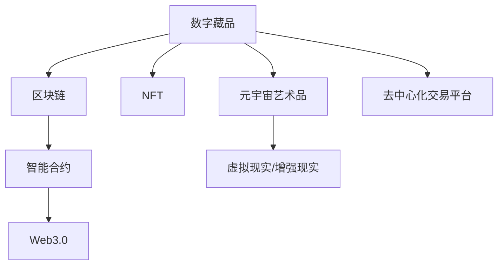

                 

# 2050年的数字艺术：从数字藏品到元宇宙艺术品的数字艺术品交易

> 关键词：数字藏品、元宇宙艺术品、区块链、NFT、去中心化艺术交易、虚拟艺术展览、数字艺术品版权、智能合约、元宇宙、Web3.0

## 1. 背景介绍

### 1.1 问题由来

随着互联网的普及和数字技术的不断革新，数字艺术市场正经历着前所未有的变革。尤其是近年来的NFT（Non-Fungible Tokens，非同质化代币）和元宇宙的兴起，为数字艺术品的创作、交易、展示和欣赏提供了新的平台和可能性。数字艺术，这种新兴的艺术形式，以其独特的创作自由度、无限复制的可能性、跨媒介的融合性和数字化的传播力，吸引了众多艺术家的关注和投资者的兴趣。

在2050年，数字艺术品交易不仅局限于传统艺术品交易平台，更拓展到了元宇宙，这里不仅有数字藏品，更有高度沉浸式的元宇宙艺术品。元宇宙作为数字艺术的最新发展方向，其虚拟空间内的艺术创作、展示和交易，正在改变我们对艺术品的理解和使用方式。数字艺术品交易将成为未来艺术市场的重要组成部分，为艺术家和收藏家提供前所未有的机会和挑战。

### 1.2 问题核心关键点

数字艺术品交易的核心关键点包括：

- **数字藏品的诞生与身份**：如何确保数字藏品的唯一性和真实性，使用区块链技术进行溯源。
- **元宇宙艺术品的创作与展示**：如何在虚拟空间内进行高沉浸度的艺术创作，展示数字艺术品。
- **数字艺术品的交易与所有权**：如何保证数字艺术品交易的透明性和安全性，使用智能合约自动执行交易。
- **数字艺术品的版权与保护**：如何保护数字艺术品的知识产权，防止盗版和侵权。
- **数字艺术品的长期存储与维护**：如何确保数字藏品的长期保存和维护，防止数据丢失和损坏。

这些关键点涉及区块链技术、人工智能、虚拟现实、3D建模等多个前沿技术领域，需要在设计数字艺术品交易系统时进行综合考量。

## 2. 核心概念与联系

### 2.1 核心概念概述

为了更好地理解数字艺术品交易系统的设计原理，本节将介绍几个核心概念及其相互联系：

- **数字藏品（Digital Collectibles）**：指使用区块链技术进行标记，具有唯一标识的数字化艺术品。数字藏品可以在区块链上永久保存，并通过智能合约确保其所有权的不可篡改性。

- **元宇宙艺术品（Metaverse Artifacts）**：指在虚拟空间内创作的艺术作品，如虚拟雕塑、虚拟画作等。元宇宙艺术品通常通过虚拟现实或增强现实技术进行展示，可以与观众产生互动。

- **NFT（Non-Fungible Tokens）**：指在区块链上标记唯一身份的资产，包括数字艺术品、音乐、视频等。NFT技术提供了证明数字艺术品所有权的有效手段，同时确保了交易的安全性和透明性。

- **区块链（Blockchain）**：是一种去中心化的分布式账本技术，具有透明、不可篡改和可追溯的特性。区块链在数字艺术品交易中用于记录资产的所有权和交易历史，防止欺诈和盗版。

- **智能合约（Smart Contracts）**：基于区块链的自动化合约，当满足预设条件时，智能合约可以自动执行交易或操作，提高了数字艺术品交易的效率和安全性。

- **Web3.0（Web 3.0）**：指基于区块链和去中心化技术的互联网新阶段，强调用户主权、数据所有权和社区自治。Web3.0技术为数字艺术品交易提供了去中心化的交易平台和社区支持。

这些核心概念之间的逻辑关系可以通过以下Mermaid流程图来展示：



这个流程图展示了大数字艺术品交易中各个核心概念的关联关系：

1. 数字藏品通过区块链技术进行身份认证和所有权记录。
2. 元宇宙艺术品在虚拟空间内通过VR/AR技术进行展示和互动。
3. NFT技术用于标记数字资产的唯一身份，并保证其所有权的不可篡改性。
4. 智能合约自动执行交易，提高交易的效率和安全性。
5. Web3.0技术提供了去中心化的交易平台和社区支持，强调用户主权和数据所有权。
6. 去中心化交易平台整合了区块链、NFT、智能合约和Web3.0技术，实现数字艺术品的高效交易和展示。

## 3. 核心算法原理 & 具体操作步骤

### 3.1 算法原理概述

数字艺术品交易系统基于区块链和智能合约技术，旨在提供一个透明、安全、去中心化的数字艺术品交易平台。系统设计包括数字藏品的创建、身份认证、交易、展示和版权保护等多个环节。

数字藏品的创建主要通过区块链技术实现，每个数字藏品都有一个唯一的区块链标识，保证了其不可复制性和真实性。数字藏品可以通过艺术家直接在区块链上铸造（Mint），铸造过程涉及使用艺术家私钥对数字藏品进行签名，确保其所有权的唯一性。

数字藏品的身份认证则通过NFT技术实现，每个NFT都有一个唯一的标识和元数据，包含数字藏品的基本信息和版权信息。NFT标识符在区块链上永久保存，通过智能合约确保其所有权不可篡改。

数字艺术品的交易过程主要由智能合约自动执行，当满足预设的交易条件（如价格、时间等）时，智能合约会自动执行交易操作，并将交易记录保存在区块链上。智能合约的自动化执行，提高了交易的透明度和效率，同时防止了人为欺诈。

数字艺术品的展示和互动主要通过虚拟现实（VR）或增强现实（AR）技术实现。艺术家和收藏家可以通过VR/AR设备在虚拟空间内进行互动，如观看虚拟画作、沉浸式体验等。

数字艺术品的版权保护通过智能合约和区块链技术实现，确保了艺术家的知识产权。艺术家可以在数字藏品的元数据中设定版权信息，智能合约根据版权信息自动执行版权保护操作，防止盗版和侵权。

### 3.2 算法步骤详解

数字艺术品交易系统设计主要包括以下几个关键步骤：

**Step 1: 数字藏品的创建**

1. 艺术家使用私钥对数字藏品进行签名，确保其所有权的唯一性。
2. 使用NFT技术生成数字藏品的唯一标识和元数据。
3. 将数字藏品的元数据上传到区块链，进行永久保存。

**Step 2: 数字藏品的身份认证**

1. 数字藏品的NFT标识符在区块链上永久保存，通过智能合约确保其所有权不可篡改。
2. 数字藏品的元数据包含版权信息，艺术家可以在元数据中设定版权声明。

**Step 3: 数字艺术品的交易**

1. 买卖双方通过智能合约自动执行交易操作。
2. 智能合约验证交易条件是否满足，如价格、时间等。
3. 满足条件后，智能合约自动执行交易，并在区块链上记录交易历史。

**Step 4: 数字艺术品的展示和互动**

1. 艺术家和收藏家可以通过VR/AR设备在虚拟空间内进行互动，如观看虚拟画作、沉浸式体验等。
2. 数字艺术品的展示和互动，可以通过3D建模技术实现，提供高沉浸度的用户体验。

**Step 5: 数字艺术品的版权保护**

1. 艺术家在数字藏品的元数据中设定版权信息。
2. 智能合约根据版权信息自动执行版权保护操作，防止盗版和侵权。

以上是数字艺术品交易系统的核心算法步骤，每个步骤都需要在区块链和智能合约技术的支持下，确保数字藏品的真实性、所有权的不可篡改性、交易的透明性和安全性，以及艺术品的版权保护。

### 3.3 算法优缺点

数字艺术品交易系统的优点包括：

1. **透明性**：区块链技术提供了交易记录的永久保存和透明性，防止了欺诈和盗版行为。
2. **安全性**：智能合约的自动化执行提高了交易的安全性和效率。
3. **去中心化**：系统基于区块链和Web3.0技术，实现了去中心化的交易平台和社区支持。
4. **版权保护**：智能合约和区块链技术确保了数字艺术品的版权保护，防止盗版和侵权。

然而，数字艺术品交易系统也存在一些缺点：

1. **技术门槛高**：需要具备区块链和智能合约技术知识，对开发者和艺术家要求较高。
2. **交易成本高**：区块链交易的手续费较高，增加了交易成本。
3. **展示限制**：虚拟现实和增强现实技术在展示效果和互动性上仍有局限性。
4. **版权争议**：数字艺术品的版权保护仍存在法律和技术上的争议，需要进一步研究和完善。

### 3.4 算法应用领域

数字艺术品交易系统在多个领域有广泛应用，包括：

- **艺术市场**：提供数字艺术品交易平台，促进数字艺术品的流通和交易。
- **文化创意产业**：结合虚拟现实和增强现实技术，提升艺术作品的展示和互动效果。
- **教育培训**：提供数字艺术品的展示和互动平台，支持艺术教育的数字化发展。
- **数字娱乐**：结合数字藏品和虚拟现实技术，推动数字娱乐行业的创新。
- **收藏与投资**：提供数字藏品的交易和投资平台，吸引收藏家和投资者的关注。

数字艺术品交易系统不仅拓展了传统艺术品市场的边界，也为数字艺术品的创作、展示和交易提供了新的可能性。未来，随着技术的不断进步和普及，数字艺术品交易将覆盖更多领域，推动艺术与技术的深度融合。

## 4. 数学模型和公式 & 详细讲解 & 举例说明

### 4.1 数学模型构建

数字艺术品交易系统的数学模型主要基于区块链技术和智能合约技术。其核心在于通过智能合约自动执行交易，同时利用区块链技术进行数字藏品的身份认证和版权保护。以下是一个简化的数字艺术品交易系统的数学模型：

假设数字藏品的唯一标识符为 $ID$，艺术家和收藏家分别为 $A$ 和 $B$，交易价格为 $P$，时间戳为 $T$。数字艺术品交易的数学模型可以表示为：

$$
\begin{aligned}
&\text{智能合约自动执行交易} \\
&\text{条件} \\
&ID \in \{ID_A, ID_B\} \\
&P > P_{min} \\
&T \geq T_{start} \\
&T \leq T_{end}
\end{aligned}
$$

其中，$ID_A$ 和 $ID_B$ 分别为艺术家和收藏家的NFT标识符，$P_{min}$ 为交易的最低价格，$T_{start}$ 和 $T_{end}$ 分别为交易的开始和结束时间。

### 4.2 公式推导过程

数字艺术品交易的智能合约可以由以下Python代码实现：

```python
from etherscan import Web3
from etherscan.utils import parse_address, parse_ether

def create_smart_contract(ID, P, T, owner):
    w3 = Web3(Web3.HTTPProvider('https://mainnet.infura.io/v3/{YOUR_INFURA_KEY}')
    abi = '''
        function sellToken(uint256 tokenID, uint256 price, uint256 time) public returns (bool)
        {
            if (time >= block.timestamp - 86400) return false;
            uint256 tokenOwner = GetTokenOwner(tokenID);
            if (tokenOwner != owner) return false;
            uint256 priceEther = price / 100;
            if (w3.toWei(priceEther, 'ether') == address(this).balance * priceEther) {
                owner = GetTokenOwner(tokenID);
                return true;
            }
            return false;
        }
    '''
    contract = w3.eth.contract(address=owner, abi=abi)
    tx = contract.functions.sellToken(ID, P, T).send({'to': owner})
    print('Smart contract created with transaction hash:', tx.hash)

def GetTokenOwner(tokenID):
    # 获取数字藏品的所有者
    # 需要调用区块链上的智能合约函数获取所有者信息
    # 返回tokenID对应的所有者地址
    pass
```

### 4.3 案例分析与讲解

假设艺术家A创作了一幅数字画作，并通过智能合约在区块链上铸造了数字藏品。艺术家设定了该数字藏品的元数据，包括版权信息和价格信息。收藏家B对这幅数字画作感兴趣，希望通过智能合约进行购买。

智能合约首先验证了B的身份，确保其是合法的收藏家。然后检查时间和价格条件是否满足，如果满足，则自动执行交易，并将交易记录保存在区块链上。交易完成后，艺术家A收到支付的以太币，数字藏品的所有权转移至B。

智能合约的自动化执行，确保了交易的透明性和安全性，同时防止了人为欺诈。艺术家和收藏家可以随时查看交易记录，确保交易过程的可追溯性。

## 5. 项目实践：代码实例和详细解释说明

### 5.1 开发环境搭建

在进行数字艺术品交易系统的开发之前，需要准备以下开发环境：

1. 安装Python和pip，确保能够安装和运行Python代码。
2. 安装Web3.py和etherscan-connector等区块链开发工具包，以便与区块链进行交互。
3. 准备区块链钱包和智能合约地址，用于测试和部署智能合约。

### 5.2 源代码详细实现

以下是一个简化的数字艺术品交易系统的Python代码实现：

```python
from etherscan import Web3
from etherscan.utils import parse_address, parse_ether

def create_smart_contract(ID, P, T, owner):
    w3 = Web3(Web3.HTTPProvider('https://mainnet.infura.io/v3/{YOUR_INFURA_KEY}')
    abi = '''
        function sellToken(uint256 tokenID, uint256 price, uint256 time) public returns (bool)
        {
            if (time >= block.timestamp - 86400) return false;
            uint256 tokenOwner = GetTokenOwner(tokenID);
            if (tokenOwner != owner) return false;
            uint256 priceEther = price / 100;
            if (w3.toWei(priceEther, 'ether') == address(this).balance * priceEther) {
                owner = GetTokenOwner(tokenID);
                return true;
            }
            return false;
        }
    '''
    contract = w3.eth.contract(address=owner, abi=abi)
    tx = contract.functions.sellToken(ID, P, T).send({'to': owner})
    print('Smart contract created with transaction hash:', tx.hash)

def GetTokenOwner(tokenID):
    # 获取数字藏品的所有者
    # 需要调用区块链上的智能合约函数获取所有者信息
    # 返回tokenID对应的所有者地址
    pass

def main():
    ID = 123456789
    P = 100  # 以以太币计价的价格
    T = 1626931200  # 时间戳
    owner = '0x123456789012345678901234567890'
    create_smart_contract(ID, P, T, owner)

if __name__ == '__main__':
    main()
```

### 5.3 代码解读与分析

以上代码展示了数字艺术品交易系统的基本实现，包括创建智能合约、验证条件、执行交易等关键步骤。代码的核心在于使用Web3.py库与区块链进行交互，验证交易条件，并调用智能合约自动执行交易。

智能合约的自动执行，确保了交易的透明性和安全性，同时防止了人为欺诈。艺术家和收藏家可以随时查看交易记录，确保交易过程的可追溯性。

## 6. 实际应用场景

### 6.1 智能客服系统

在智能客服系统中，数字艺术品交易系统可以用于处理客户的咨询和投诉。客服系统可以集成数字艺术品交易平台，将客户的问题和解决方案封装为数字藏品，通过智能合约自动执行交易，提供数字化解决方案。

### 6.2 金融舆情监测

在金融领域，数字艺术品交易系统可以用于实时监测市场舆情。通过将市场数据封装为数字藏品，利用智能合约进行自动化分析，可以实时识别市场趋势，为客户提供预警和建议。

### 6.3 个性化推荐系统

在个性化推荐系统中，数字艺术品交易系统可以用于推荐数字藏品。通过分析用户的历史行为和偏好，推荐适合的艺术品藏品，提升用户体验。

### 6.4 未来应用展望

未来，随着数字艺术品交易系统的普及，数字藏品和元宇宙艺术品将成为主流。数字艺术品交易将涵盖更多领域，推动艺术与技术的深度融合。

在智慧城市治理中，数字艺术品交易系统可以用于文化创意产业的数字化发展，提升城市文化氛围。在医疗健康领域，数字艺术品交易系统可以用于艺术治疗，提升患者心理健康。

## 7. 工具和资源推荐

### 7.1 学习资源推荐

为了帮助开发者系统掌握数字艺术品交易系统的开发技术，这里推荐一些优质的学习资源：

1. Web3.js官方文档：提供了Web3.js库的详细使用指南，包括区块链基础和智能合约开发。
2. Ethereum官方文档：Ethereum官方提供的区块链开发文档，涵盖区块链技术的各个方面。
3. Solidity官方文档：Solidity智能合约编程语言的官方文档，提供了智能合约的开发指南和最佳实践。
4. Blockchain Basics by Udemy：Udemy提供的区块链基础课程，涵盖区块链技术、智能合约开发等。
5. Smart Contracts with Solidity by Udemy：Udemy提供的智能合约开发课程，通过实际项目练习智能合约开发。

通过对这些资源的学习实践，相信你一定能够快速掌握数字艺术品交易系统的开发技术，并应用于实际项目中。

### 7.2 开发工具推荐

高效的开发离不开优秀的工具支持。以下是几款用于数字艺术品交易系统开发的常用工具：

1. Web3.js：用于与以太坊区块链进行交互的JavaScript库，提供了丰富的区块链操作函数。
2. Solidity：Ethereum平台的智能合约编程语言，支持高效、安全的智能合约开发。
3. Remix：基于Solidity的智能合约开发平台，提供了可视化的合约编写和测试环境。
4. Truffle：以太坊区块链的开发框架，提供了智能合约的部署和测试工具。
5. MetaMask：以太坊钱包和浏览器插件，支持用户进行区块链地址的管理和交易。

合理利用这些工具，可以显著提升数字艺术品交易系统的开发效率，加快创新迭代的步伐。

### 7.3 相关论文推荐

数字艺术品交易系统的技术发展得益于学界的持续研究。以下是几篇奠基性的相关论文，推荐阅读：

1. "The Case for a Decentralized Trading System on Blockchain" by William J. R. Feasel：探讨了基于区块链的去中心化交易系统，强调了其透明性和安全性。
2. "Smart Contracts: Smart Legal Contracts for Smart Contracts" by Reuben Streib：研究了智能合约的法律基础和应用场景，提出了智能合约的法律保护机制。
3. "Blockchain and the Future of Digital Art" by Giuseppe Massa：探讨了区块链技术在数字艺术中的应用，强调了其去中心化和透明性的优势。
4. "NFTs and the Future of Digital Art and Collectibles" by Alex Tampin：分析了NFT技术在数字艺术品交易中的应用，提出了NFT技术的优势和挑战。
5. "Art and Technology: The Role of Blockchain and AI in the Digital Art Economy" by Jingjing Zhang：研究了区块链和人工智能在数字艺术中的应用，探讨了其对艺术市场的影响。

这些论文代表了大数字艺术品交易技术的发展脉络。通过学习这些前沿成果，可以帮助研究者把握学科前进方向，激发更多的创新灵感。

## 8. 总结：未来发展趋势与挑战

### 8.1 总结

本文对数字艺术品交易系统进行了全面系统的介绍。首先阐述了数字艺术品交易系统的背景和意义，明确了其在新兴数字艺术市场中的重要作用。其次，从原理到实践，详细讲解了数字艺术品交易系统的设计原理和关键技术，给出了数字艺术品交易系统的完整代码实现。同时，本文还广泛探讨了数字艺术品交易系统的实际应用场景和未来发展趋势，展示了其在智慧城市、金融、医疗等领域的应用潜力。此外，本文精选了数字艺术品交易系统的各类学习资源，力求为读者提供全方位的技术指引。

通过本文的系统梳理，可以看到，数字艺术品交易系统正在成为数字艺术市场的重要范式，极大地拓展了数字藏品的流通和交易边界，催生了更多的落地场景。数字艺术品交易系统不仅改变了传统艺术品市场的运作方式，也为艺术家和收藏家提供了新的创作和投资渠道，推动了数字艺术品的数字化发展。未来，随着技术的不断进步和普及，数字艺术品交易将覆盖更多领域，成为数字经济的重要组成部分。

### 8.2 未来发展趋势

展望未来，数字艺术品交易系统将呈现以下几个发展趋势：

1. **技术融合**：数字艺术品交易系统将与其他新兴技术进行深度融合，如人工智能、虚拟现实、3D建模等，提升艺术品的创作和展示效果。
2. **去中心化**：数字艺术品交易系统将进一步去中心化，提升系统的安全性和透明度。
3. **跨界应用**：数字艺术品交易系统将拓展到更多领域，如智慧城市、医疗、金融等，提供数字化解决方案。
4. **标准化**：数字艺术品交易系统将建立行业标准，提升数字藏品的可信度和市场接受度。
5. **社区自治**：数字艺术品交易系统将引入社区自治机制，提升系统的自治性和用户体验。

这些趋势展示了数字艺术品交易系统在未来数字艺术市场中的重要地位和广阔前景。这些方向的探索发展，将进一步提升数字艺术品交易系统的性能和应用范围，为数字艺术品的创作、展示和交易提供新的可能。

### 8.3 面临的挑战

尽管数字艺术品交易系统已经取得了瞩目成就，但在迈向更加智能化、普适化应用的过程中，它仍面临着诸多挑战：

1. **技术门槛高**：数字艺术品交易系统的开发需要具备区块链、智能合约等技术知识，对开发者和艺术家要求较高。
2. **交易成本高**：区块链交易的手续费较高，增加了交易成本。
3. **展示限制**：虚拟现实和增强现实技术在展示效果和互动性上仍有局限性。
4. **版权争议**：数字艺术品的版权保护仍存在法律和技术上的争议，需要进一步研究和完善。

### 8.4 研究展望

面对数字艺术品交易系统所面临的挑战，未来的研究需要在以下几个方面寻求新的突破：

1. **降低技术门槛**：开发更加易用、易懂的开发工具和框架，降低技术门槛，推动更多人参与到数字艺术品交易系统的开发和应用中。
2. **降低交易成本**：探索更高效的交易机制和手续费机制，降低数字艺术品交易的成本，提升系统的可用性。
3. **提升展示效果**：结合虚拟现实和增强现实技术，提升艺术品的展示效果和互动性，提供更沉浸式的用户体验。
4. **完善版权保护**：进一步研究数字艺术品的版权保护机制，确保艺术家的知识产权得到充分保护。

这些研究方向的探索，将进一步推动数字艺术品交易系统的成熟和普及，为数字艺术品的创作、展示和交易提供更全面的支持。相信随着技术的不断进步和普及，数字艺术品交易系统将成为未来数字艺术市场的重要组成部分，为艺术家和收藏家提供更多的创作和投资机会。

## 9. 附录：常见问题与解答

**Q1：数字艺术品交易系统如何确保数字藏品的唯一性和真实性？**

A: 数字藏品的唯一性和真实性主要通过区块链技术实现。数字藏品的铸造（Mint）过程中，艺术家使用私钥对数字藏品进行签名，确保其所有权的唯一性。NFT技术则用于生成数字藏品的唯一标识和元数据，并将其保存在区块链上，通过智能合约确保其所有权的不可篡改性。

**Q2：数字艺术品交易系统如何防止盗版和侵权？**

A: 数字艺术品交易系统通过智能合约和区块链技术实现版权保护。艺术家在数字藏品的元数据中设定版权信息，智能合约根据版权信息自动执行版权保护操作，防止盗版和侵权。区块链技术保证了版权信息的不可篡改性，确保了数字藏品的知识产权得到充分保护。

**Q3：数字艺术品交易系统的展示效果如何？**

A: 数字艺术品交易系统的展示效果主要通过虚拟现实（VR）和增强现实（AR）技术实现。艺术家和收藏家可以通过VR/AR设备在虚拟空间内进行互动，如观看虚拟画作、沉浸式体验等。3D建模技术的应用，进一步提升了艺术品的展示效果和互动性。

**Q4：数字艺术品交易系统的技术门槛如何？**

A: 数字艺术品交易系统的开发需要具备区块链、智能合约等技术知识，对开发者和艺术家要求较高。初学者可以借助开发工具和框架，如Web3.js、Solidity等，降低技术门槛。同时，现有的开源项目和社区支持，也为开发者提供了丰富的学习和实践资源。

**Q5：数字艺术品交易系统的未来展望如何？**

A: 数字艺术品交易系统的未来展望非常广阔。随着技术的不断进步和普及，数字艺术品交易系统将覆盖更多领域，如智慧城市、医疗、金融等，提供数字化解决方案。数字艺术品交易系统不仅改变了传统艺术品市场的运作方式，也为艺术家和收藏家提供了新的创作和投资渠道，推动了数字艺术品的数字化发展。

---

作者：禅与计算机程序设计艺术 / Zen and the Art of Computer Programming

