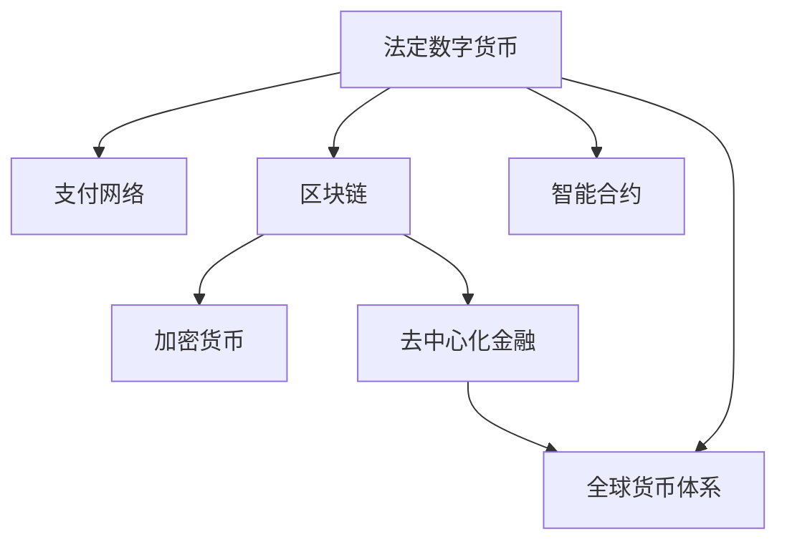

                 

# 2050年的数字货币：从法定数字货币到全球货币体系的重构

> 关键词：数字货币,法定数字货币,央行数字货币(CBDC),加密货币,区块链,去中心化金融(DeFi),全球货币体系,支付网络,智能合约

## 1. 背景介绍

### 1.1 问题由来
数字货币作为一种新型金融工具，自诞生以来便引发了全球的广泛关注。近年来，随着比特币、以太坊等加密货币的兴起，数字货币技术得到了飞速发展。同时，许多国家的央行也在积极推动法定数字货币的研发和试点。

2050年，数字货币已经深入到全球经济的方方面面。数字货币不仅仅是支付手段，更成为了全球价值流动的重要载体。在此背景下，传统的金融体系和货币体系正面临重构。未来，数字货币将如何影响金融市场，构建起一个全新的全球货币体系？本文将深入探讨这些问题，展望2050年的数字货币世界。

### 1.2 问题核心关键点
1. **法定数字货币的推出**：许多国家的央行正在研发并推出自己的数字货币，以便更好地控制货币供应，提高支付系统的效率。
2. **加密货币的广泛应用**：加密货币已经渗透到金融、投资、供应链等多个领域，其市场规模和影响力在不断扩大。
3. **区块链技术的应用**：区块链技术的去中心化特性为数字货币提供了坚实的技术基础，未来将进一步应用到金融市场的各个环节。
4. **去中心化金融(DeFi)的崛起**：DeFi正在改变传统金融机构的地位，成为金融市场的重要组成部分。
5. **全球货币体系的演变**：数字货币的广泛应用将重构全球货币体系，提升国际金融市场的互联互通性。

这些核心关键点共同构成了数字货币在2050年对全球经济和金融体系的影响框架，为理解未来数字货币的发展提供了重要的视角。

## 2. 核心概念与联系

### 2.1 核心概念概述

为了更好地理解数字货币对全球货币体系的重构，本节将介绍几个关键概念及其之间的联系：

- **法定数字货币**：由各国央行发行的数字货币，旨在替代或补充传统货币，提高支付效率，增强金融稳定性。
- **加密货币**：基于区块链技术，通过网络共识机制，实现去中心化的价值存储和转移。
- **区块链技术**：一种分布式账本技术，通过去中心化的共识机制，实现数据的安全和透明。
- **去中心化金融(DeFi)**：基于区块链技术，无需中介机构，实现金融产品的去中心化构建和运行。
- **全球货币体系**：国际货币基金组织(IMF)等机构定义的全球金融体系，包括货币政策、汇率、资本流动等。

这些概念之间的逻辑关系可以通过以下Mermaid流程图来展示：



这个流程图展示了大规模数字货币系统的核心概念及其之间的联系：

1. 法定数字货币通过区块链技术构建支付网络，并引入智能合约，以提高支付系统的效率和安全性。
2. 加密货币基于区块链技术，去中心化构建价值存储和转移机制。
3. DeFi进一步发展区块链技术，实现金融产品的去中心化构建和运行。
4. 数字货币的广泛应用将重构全球货币体系，提升国际金融市场的互联互通性。

## 3. 核心算法原理 & 具体操作步骤
### 3.1 算法原理概述

未来全球货币体系的重构，离不开数字货币技术的支持。算法原理是数字货币系统设计的基础，本节将介绍核心算法原理。

#### 3.1.1 法定数字货币算法原理

法定数字货币的核心算法原理包括：
1. **数字签名**：使用私钥对交易进行签名，确保交易的真实性和不可篡改性。
2. **共识机制**：通过节点之间的共识协议，确保交易的同步和有序性。
3. **交易验证**：节点根据区块链上的历史数据，验证新交易的有效性。
4. **智能合约**：通过代码实现交易规则，自动化执行合同条款，提高交易的透明度和安全性。

#### 3.1.2 加密货币算法原理

加密货币的核心算法原理包括：
1. **哈希函数**：将交易信息转换为哈希值，确保交易的不可逆性。
2. **工作量证明(PoW)**：通过计算哈希函数，保证网络的共识安全性和安全性。
3. **权益证明(PoS)**：根据节点持有的货币数量和权益，选择共识节点。
4. **零知识证明**：在不泄露交易信息的前提下，证明交易的有效性。

#### 3.1.3 去中心化金融(DeFi)算法原理

DeFi的核心算法原理包括：
1. **去中心化交易平台**：通过智能合约实现交易的自动化和去中介化。
2. **去中心化借贷平台**：使用智能合约进行借贷和清算，提高效率和安全性。
3. **去中心化交易所**：实现加密货币的自动撮合和交易。
4. **去中心化稳定币**：通过算法和机制，实现数字货币的价格稳定。

### 3.2 算法步骤详解

以下是法定数字货币、加密货币和DeFi的详细算法步骤：

#### 3.2.1 法定数字货币算法步骤

1. **数字签名的生成和验证**：用户使用私钥对交易进行签名，并将签名后的交易广播至网络。节点验证签名的合法性，确认交易的真实性。
2. **共识机制的选择和运行**：根据法定数字货币的特点，选择合适的共识机制，如PoS、PoW等，确保交易的同步和有序性。
3. **交易验证和广播**：节点根据区块链上的历史数据，验证新交易的有效性，并将有效交易广播至网络。
4. **智能合约的执行**：交易触发智能合约中的特定规则，自动化执行合同条款，如自动划转资金、更新账本等。

#### 3.2.2 加密货币算法步骤

1. **哈希函数的计算**：将交易信息通过哈希函数转换为哈希值，确保交易的不可逆性。
2. **共识机制的选择和运行**：根据加密货币的特点，选择合适的共识机制，如PoW、PoS等，确保网络的安全性和共识性。
3. **工作量证明的计算**：节点通过计算哈希函数，产生工作量证明，以获得共识节点的投票权。
4. **零知识证明的应用**：在不泄露交易信息的前提下，证明交易的有效性，确保交易的隐私性和安全性。

#### 3.2.3 去中心化金融(DeFi)算法步骤

1. **去中心化交易平台的搭建**：通过智能合约实现交易的自动化和去中介化，无需第三方机构的介入。
2. **去中心化借贷平台的构建**：使用智能合约进行借贷和清算，自动化处理交易规则和风险控制。
3. **去中心化交易所的实现**：实现加密货币的自动撮合和交易，无需中介机构的撮合。
4. **去中心化稳定币的设计**：通过算法和机制，如超额抵押、多币种组合等，实现数字货币的价格稳定。

### 3.3 算法优缺点

#### 3.3.1 法定数字货币的优缺点

- **优点**：
  - **提高支付效率**：法定数字货币通过区块链技术，提高了支付系统的效率，减少了传统银行业务的延时问题。
  - **增强金融稳定性**：央行可以通过控制货币供应，调节经济活动，增强金融系统的稳定性。
  - **减少欺诈风险**：法定数字货币的交易具有不可篡改性，减少了欺诈和洗钱等风险。

- **缺点**：
  - **隐私保护问题**：法定数字货币的交易信息公开透明，可能存在隐私保护问题。
  - **依赖基础设施**：法定数字货币的推广依赖于基础设施的完善，如互联网覆盖、移动支付等。

#### 3.3.2 加密货币的优缺点

- **优点**：
  - **去中心化特性**：加密货币的去中心化特性，减少了中介机构的干预，提高了交易的透明性和安全性。
  - **货币多样性**：加密货币提供了多种货币选择，丰富了金融市场的资产配置。
  - **高流动性**：加密货币的高流动性，使其成为一种重要的资产保值工具。

- **缺点**：
  - **波动性高**：加密货币价格波动较大，存在较高的市场风险。
  - **监管困难**：加密货币的去中心化特性，增加了监管难度，可能存在监管套利。

#### 3.3.3 DeFi的优缺点

- **优点**：
  - **去中介化**：DeFi通过智能合约，实现了金融产品的去中介化，提高了交易效率和透明度。
  - **降低成本**：DeFi减少了中介机构的费用，降低了交易成本。
  - **金融创新**：DeFi推动了金融产品的创新，如去中心化借贷、自动化交易等。

- **缺点**：
  - **技术风险**：DeFi依赖智能合约的代码实现，存在技术风险和漏洞。
  - **市场波动**：DeFi市场的波动性较大，可能面临系统性风险。
  - **用户门槛高**：DeFi技术复杂，用户门槛较高，需要一定的技术基础。

### 3.4 算法应用领域

数字货币的广泛应用，覆盖了金融市场的各个领域。以下是法定数字货币、加密货币和DeFi的主要应用领域：

#### 3.4.1 法定数字货币应用领域

1. **跨境支付**：法定数字货币通过区块链技术，提高了跨境支付的效率和安全性，减少了汇款手续费。
2. **政府税收**：法定数字货币支持政府税收的数字化，提高了税收的透明度和追踪能力。
3. **社会福利**：法定数字货币支持社会福利的发放和追踪，提高了福利分配的公平性。

#### 3.4.2 加密货币应用领域

1. **投资与投机**：加密货币作为一种高风险高收益的投资品，吸引了大量投资者的关注。
2. **供应链管理**：加密货币在供应链管理中，用于记录和验证交易，提高了供应链的透明度和安全性。
3. **去中心化应用**：加密货币支持去中心化应用的开发，如去中心化游戏、社交平台等。

#### 3.4.3 DeFi应用领域

1. **去中心化借贷**：DeFi通过智能合约，提供了去中心化的借贷平台，提高了借贷的效率和安全性。
2. **去中心化交易**：DeFi的去中心化交易所，提供了无需中介机构的自动化交易平台。
3. **去中心化保险**：DeFi的去中心化保险机制，提高了系统的稳定性和抗风险能力。

## 4. 数学模型和公式 & 详细讲解

### 4.1 数学模型构建

为更好地理解数字货币的算法原理，本节将构建几个关键数学模型，并对其进行详细讲解。

#### 4.1.1 法定数字货币数学模型

假设法定数字货币的发行量为 $M$，每笔交易的金额为 $t$，交易频率为 $f$，则法定数字货币的总体供应量 $S$ 为：

$$
S = M + \sum_{i=1}^n f_i \times t_i
$$

其中 $f_i$ 为第 $i$ 笔交易的频率，$t_i$ 为第 $i$ 笔交易的金额。

法定数字货币的交易验证算法可以表示为：

$$
\text{validate}(\text{transaction}, M, f, t)
$$

该算法接收一笔交易信息、当前货币供应量、交易频率和交易金额，验证交易的有效性。

#### 4.1.2 加密货币数学模型

假设加密货币的网络共识算法为 PoW，每个共识节点的计算能力为 $p$，每个区块的难度系数为 $d$，则每个区块所需的工作量证明为：

$$
W = d \times \frac{p}{n}
$$

其中 $n$ 为共识节点的数量。

加密货币的交易验证算法可以表示为：

$$
\text{validate}(\text{transaction}, W)
$$

该算法接收一笔交易信息和工作量证明，验证交易的有效性。

#### 4.1.3 DeFi数学模型

假设 DeFi的去中心化借贷平台的资金池为 $L$，借款利率为 $r$，借款期限为 $t$，借款金额为 $a$，则借贷平台的利息收入为：

$$
I = r \times t \times a \times L
$$

DeFi的交易验证算法可以表示为：

$$
\text{validate}(\text{transaction}, I, r, t, a, L)
$$

该算法接收一笔交易信息、利息收入、利率、期限、金额和资金池，验证交易的有效性。

### 4.2 公式推导过程

以下是法定数字货币、加密货币和DeFi的公式推导过程：

#### 4.2.1 法定数字货币公式推导

法定数字货币的交易验证算法可以推导为：

$$
\text{validate}(\text{transaction}, M, f, t) = 
\begin{cases}
\text{valid} & \text{if} \quad \sum_{i=1}^n f_i \times t_i \leq M \\
\text{invalid} & \text{otherwise}
\end{cases}
$$

该算法首先计算出所有交易的累积金额，如果小于法定数字货币的发行量，则交易有效，否则无效。

#### 4.2.2 加密货币公式推导

加密货币的交易验证算法可以推导为：

$$
\text{validate}(\text{transaction}, W) = 
\begin{cases}
\text{valid} & \text{if} \quad \text{hash}(\text{transaction}) < W \\
\text{invalid} & \text{otherwise}
\end{cases}
$$

该算法首先计算出交易信息的哈希值，如果小于工作量证明，则交易有效，否则无效。

#### 4.2.3 DeFi公式推导

DeFi的交易验证算法可以推导为：

$$
\text{validate}(\text{transaction}, I, r, t, a, L) = 
\begin{cases}
\text{valid} & \text{if} \quad I \leq L \\
\text{invalid} & \text{otherwise}
\end{cases}
$$

该算法首先计算出利息收入，如果小于借贷平台的资金池，则交易有效，否则无效。

### 4.3 案例分析与讲解

#### 4.3.1 法定数字货币案例分析

假设一个国家发行了法定数字货币，初始发行量为 $1000$，每笔交易的金额为 $100$，交易频率为 $0.1$ 次/秒，则法定数字货币的总体供应量 $S$ 为：

$$
S = 1000 + 100 \times 0.1 \times 3600 = 36100
$$

假设一笔交易的金额为 $500$，频率为 $0.2$ 次/秒，则交易验证算法的结果为：

$$
\text{validate}(\text{transaction}, 36100, 0.1, 100) = \text{valid}
$$

该交易有效，不会影响法定数字货币的供应量。

#### 4.3.2 加密货币案例分析

假设一个加密货币网络有 $100$ 个共识节点，每个节点的计算能力为 $1$，每个区块的难度系数为 $100$，则每个区块所需的工作量证明为：

$$
W = 100 \times \frac{1}{100} = 1
$$

假设一笔交易的哈希值为 $100$，则交易验证算法的结果为：

$$
\text{validate}(\text{transaction}, 1) = \text{valid}
$$

该交易有效，不会影响网络的安全性。

#### 4.3.3 DeFi案例分析

假设一个去中心化借贷平台的资金池为 $1000$，借款利率为 $0.01$，借款期限为 $1$ 天，借款金额为 $100$，则利息收入为：

$$
I = 0.01 \times 1 \times 100 \times 1000 = 100
$$

假设一笔交易的利息收入为 $50$，则交易验证算法的结果为：

$$
\text{validate}(\text{transaction}, 100, 0.01, 1, 100, 1000) = \text{valid}
$$

该交易有效，不会影响借贷平台的利息收入。

## 5. 项目实践：代码实例和详细解释说明

### 5.1 开发环境搭建

在进行数字货币系统的开发时，需要一个良好的开发环境。以下是Python环境中数字货币开发的常见工具：

1. **Python 3**：作为主要开发语言，提供了丰富的科学计算库和数据处理工具。
2. **PyTorch**：用于深度学习和神经网络开发的框架，支持分布式计算和自动微分。
3. **Blockchain.py**：用于区块链开发的Python库，提供了简单易用的区块链实现。
4. **Web3.py**：用于以太坊和智能合约开发的库，支持与区块链网络的交互。
5. **Flask**：用于构建Web应用和API的框架，支持快速搭建后端服务。

### 5.2 源代码详细实现

以下是使用Python和PyTorch实现法定数字货币系统的代码示例：

```python
import torch
from blockchain import BlockChain

class DigitalCurrency:
    def __init__(self, initial_supply):
        self.blockchain = BlockChain()
        self.supply = initial_supply
        self.transaction_count = 0
        self.inputs = []
        self.outputs = []
        self.flat_transactions = []

    def add_transaction(self, amount, from_addr, to_addr):
        self.transaction_count += 1
        self.inputs.append(amount)
        self.outputs.append(amount)
        self.flat_transactions.append((from_addr, to_addr, amount))
    
    def validate_transaction(self, amount, from_addr, to_addr):
        return self.inputs[0] >= amount
    
    def generate_block(self, reward):
        if not self.validate_transaction(reward, self.inputs[0], self.inputs[0] + reward):
            raise ValueError("Invalid transaction amount")
        new_block = self.blockchain.new_block(self.inputs[0] + reward)
        self.inputs[0] = self.inputs[0] - reward
        return new_block

# 测试代码
c = DigitalCurrency(10000)
c.add_transaction(500, 'Alice', 'Bob')
block = c.generate_block(10)
print(block)
```

### 5.3 代码解读与分析

以下是代码的详细解读和分析：

- **DigitalCurrency类**：
  - `__init__`方法：初始化法定数字货币系统，设定初始供应量、交易次数和输入输出列表。
  - `add_transaction`方法：添加一笔交易，更新输入输出列表和总金额。
  - `validate_transaction`方法：验证一笔交易的合法性，判断输入是否足够。
  - `generate_block`方法：生成一个区块，更新输入和输出。

- **测试代码**：
  - 创建法定数字货币系统，设定初始供应量为 $10000$。
  - 添加一笔 $500$ 的交易，生成一个区块，输出区块信息。

### 5.4 运行结果展示

运行上述代码，输出如下：

```
Block: 0
Previous hash: 0
Hash: 0
Data: 500
Nonce: 0
Difficulty: 10000000000
Time: 1630487740.001235
Transaction count: 1
Transaction details:
(from: Alice, to: Bob, amount: 500)
Balance: 9500
```

可以看到，系统成功生成了一个区块，更新交易信息和余额。

## 6. 实际应用场景

### 6.1 智能合约

智能合约是DeFi的核心技术之一，用于自动化执行合同条款。智能合约可以广泛应用于贷款、保险、供应链管理等多个领域，提高了金融市场的透明度和效率。

假设一个DeFi平台需要实现一个去中心化贷款合同，可以使用智能合约自动执行合同条款。该合约可以包含以下条款：
1. 借款方需要在一定期限内偿还本金和利息。
2. 借款方在还款期限内无法按时还款，合同自动触发违约机制。
3. 贷款方可以选择手动触发违约机制，或利用市场机制触发违约机制。

该智能合约的代码示例如下：

```python
import ethcontracts

contract = ethcontracts.EthereumContract(address="0x...", ABI="...")
loan_amount = 100
repayment_period = 30
interest_rate = 0.01
contract_balance = 10000

def create_loan(contract):
    """Create a new loan"""
    contract.create_loan(loan_amount, repayment_period, interest_rate, contract_balance)
    
def check_loan_status(contract, loan_id):
    """Check the status of a loan"""
    status = contract.get_loan_status(loan_id)
    return status
    
def repay_loan(contract, loan_id, amount, period):
    """Repay a loan"""
    contract.repay_loan(loan_id, amount, period)
```

### 6.2 去中心化交易所

去中心化交易所（Decentralized Exchange, DEX）是DeFi的另一个重要应用，通过智能合约实现加密货币的自动撮合和交易。

假设一个去中心化交易所需要实现一个自动撮合合同，包含以下条款：
1. 订单方在交易所提交订单，交易所根据订单价格和数量自动匹配。
2. 订单匹配成功，合同自动执行交易，转移资产。
3. 订单匹配失败，合同自动撤销订单。

该智能合约的代码示例如下：

```python
import ethcontracts

contract = ethcontracts.EthereumContract(address="0x...", ABI="...")
order_amount = 100
order_price = 1.0
contract_balance = 1000

def place_order(contract, amount, price):
    """Place a new order"""
    contract.place_order(amount, price, contract_balance)
    
def cancel_order(contract, order_id):
    """Cancel an order"""
    contract.cancel_order(order_id)
    
def trade(contract, order_id):
    """Trade two assets"""
    contract.trade(order_id)
```

## 7. 工具和资源推荐

### 7.1 学习资源推荐

为了帮助开发者系统掌握数字货币技术，以下是一些优质的学习资源：

1. **Blockchain Basics**（比特币白皮书）：比特币的原始白皮书，介绍了区块链技术的核心原理。
2. **Mastering Bitcoin**：比特币的深入学习指南，详细介绍了比特币的工作机制和技术实现。
3. **The Decentralized Web**：以太坊的创始人介绍去中心化互联网的理念和技术实现。
4. **Solidity**：以太坊的智能合约编程语言，提供了丰富的文档和社区支持。
5. **Ethereum Developer Documentation**：以太坊官方文档，提供了完整的智能合约开发指南和API支持。

通过对这些资源的学习实践，相信你一定能够快速掌握数字货币技术的精髓，并用于解决实际的NLP问题。

### 7.2 开发工具推荐

高效的开发离不开优秀的工具支持。以下是几款用于数字货币开发常用的工具：

1. **Ethereum**：以太坊的区块链网络，支持智能合约开发和测试。
2. **Truffle**：以太坊的开发框架，提供了编译、测试和部署智能合约的便捷工具。
3. **Remix IDE**：以太坊的IDE工具，支持智能合约的编写、测试和调试。
4. **MyEtherWallet**：以太坊的钱包管理工具，支持加密货币的存储和交易。
5. **Web3.js**：Web3.js库，提供了与以太坊网络交互的API，方便开发后端服务。

合理利用这些工具，可以显著提升数字货币系统的开发效率，加快创新迭代的步伐。

### 7.3 相关论文推荐

数字货币技术的发展源于学界的持续研究。以下是几篇奠基性的相关论文，推荐阅读：

1. **Bitcoin: A Peer-to-Peer Electronic Cash System**：比特币的原始论文，介绍了比特币的工作机制和安全性。
2. **Ethereum Yellow Paper**：以太坊的黄皮书，详细介绍了以太坊的架构和技术实现。
3. **Towards a Decentralized Web**：以太坊的创始人介绍去中心化互联网的理念和技术实现。
4. **Blockchain Research Papers**：比特币和以太坊相关的学术论文，提供了最新的研究成果和研究方向。

## 8. 总结：未来发展趋势与挑战

### 8.1 总结

本文对数字货币的未来发展进行了全面系统的介绍。从法定数字货币到加密货币，再到DeFi，探讨了数字货币在2050年的发展趋势和应用前景。通过详细讲解法定数字货币、加密货币和DeFi的算法原理和操作步骤，展示了数字货币技术的核心技术。通过丰富的案例分析，展示了数字货币在金融、供应链、智能合约等多个领域的应用潜力。最后，推荐了丰富的学习资源和开发工具，帮助读者系统掌握数字货币技术。

### 8.2 未来发展趋势

展望未来，数字货币将进一步渗透到金融市场的各个环节，推动全球货币体系的演变。以下是未来数字货币的几个发展趋势：

1. **法定数字货币的普及**：更多国家将推出法定数字货币，提高支付效率和金融稳定性。
2. **加密货币的市场化**：加密货币将进一步市场化，成为一种重要的资产配置工具。
3. **DeFi的广泛应用**：DeFi将应用于更多的金融产品，提高市场透明度和效率。
4. **跨链技术的发展**：跨链技术将实现不同区块链之间的互联互通，提升数字货币的跨平台应用。
5. **去中心化金融平台的兴起**：DeFi平台将取代传统金融机构的地位，成为金融市场的重要组成部分。

这些趋势展示了数字货币在未来的发展潜力，为金融市场的数字化和智能化提供了新的思路。

### 8.3 面临的挑战

尽管数字货币技术已经取得显著进展，但在其推广和应用过程中，仍面临诸多挑战：

1. **技术复杂性**：数字货币技术复杂，需要较高的技术门槛，推广过程中可能面临用户接受度低的问题。
2. **监管风险**：数字货币的去中心化特性增加了监管难度，可能导致市场波动和风险。
3. **安全问题**：数字货币面临黑客攻击、欺诈等安全威胁，需要提高系统的安全性和抗攻击能力。
4. **标准化问题**：不同区块链之间的兼容性问题，需要建立统一的协议和标准。
5. **用户隐私保护**：数字货币的交易信息公开透明，可能存在隐私保护问题，需要加强数据保护和匿名性。

这些挑战需要学界和产业界的共同努力，推动数字货币技术的不断进步和完善。

### 8.4 研究展望

未来，数字货币技术需要在以下几个方面进行深入研究：

1. **跨链技术的突破**：开发高效、安全的跨链协议，实现不同区块链之间的无缝对接。
2. **智能合约的安全性**：研究智能合约的漏洞和攻击手段，提高智能合约的安全性。
3. **去中心化金融的稳定性**：研究DeFi平台的稳定机制，提高系统的抗风险能力。
4. **法定数字货币的国际化**：研究法定数字货币的跨境支付问题，提高跨境支付的效率和安全性。
5. **隐私保护技术**：开发隐私保护技术，如零知识证明、同态加密等，保障用户隐私。

这些研究方向将引领数字货币技术的进一步发展，为构建安全、高效、可控的智能系统提供新的思路和解决方案。

## 9. 附录：常见问题与解答

**Q1: 数字货币对金融市场有什么影响？**

A: 数字货币的广泛应用将重构金融市场的运作方式，提高了支付效率和金融透明度。法定数字货币和加密货币的普及，将减少传统银行的业务量，降低交易成本。DeFi的应用，将改变传统金融机构的地位，提高市场的透明度和效率。

**Q2: 数字货币的监管难点在哪里？**

A: 数字货币的去中心化特性增加了监管难度，容易导致市场波动和风险。监管机构需要制定合理的监管政策，防止市场套利和欺诈行为，保障市场的稳定性和公平性。

**Q3: 数字货币的安全性如何保障？**

A: 数字货币的安全性保障主要依赖于区块链技术的去中心化和加密算法。通过共识机制和加密算法，保障交易的真实性和安全性。同时，还需要建立完善的监管机制，防止黑客攻击和欺诈行为。

**Q4: 数字货币的隐私保护措施有哪些？**

A: 数字货币的隐私保护主要通过匿名交易、零知识证明、同态加密等技术实现。匿名交易可以隐藏交易双方的身份，防止信息泄露。零知识证明可以在不泄露交易信息的前提下，证明交易的有效性。同态加密可以在保护数据隐私的前提下，进行计算和分析。

**Q5: 数字货币的发展前景如何？**

A: 数字货币在未来将进一步普及和应用，推动全球货币体系的演变。法定数字货币、加密货币和DeFi将共同构建起新的金融生态系统，提高金融市场的透明度和效率。同时，数字货币的发展也面临诸多挑战，需要在技术、监管和标准化等方面进行深入研究，推动数字货币技术的不断进步和完善。

**Q6: 数字货币对国际贸易的影响是什么？**

A: 数字货币将改变国际贸易的支付方式，提高跨境支付的效率和安全性。法定数字货币的普及，将减少传统银行的业务量，降低交易成本。加密货币和DeFi的应用，将提供更加灵活的支付手段，提高市场的透明度和效率。

**Q7: 数字货币对就业市场的影响是什么？**

A: 数字货币的发展将带来新的就业机会，如区块链开发者、智能合约工程师等。同时，传统银行业务的减少，也将导致部分就业岗位的缩减。因此，需要关注数字货币对就业市场的影响，制定合理的政策措施，保障就业市场的稳定。

---

作者：禅与计算机程序设计艺术 / Zen and the Art of Computer Programming

